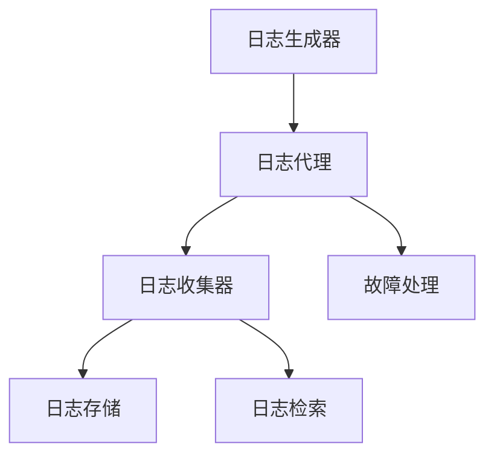
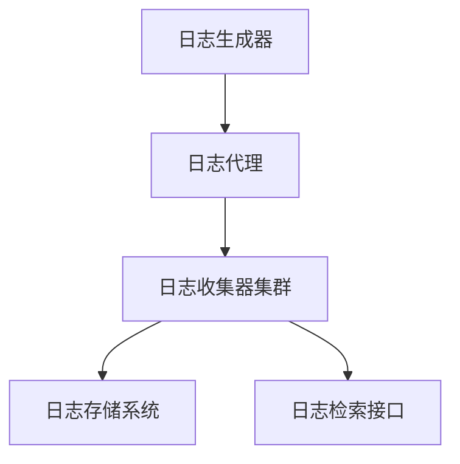
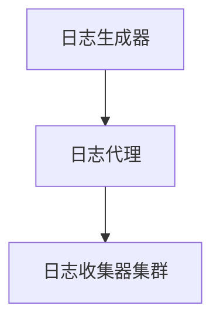
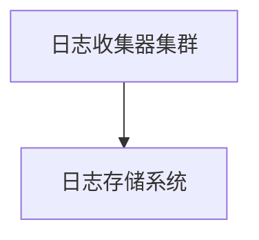
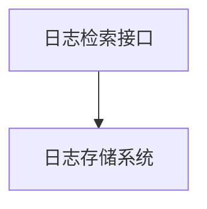

                 


### 分布式日志收集系统在LLM应用中的实现

关键词：分布式日志，收集系统，LLM，应用，实现

摘要：本文将深入探讨分布式日志收集系统在大型语言模型（LLM）应用中的实现。首先，我们将介绍分布式日志系统的基本概念和背景，随后讨论其在LLM应用中的重要性和面临的挑战。接着，我们将详细讲解分布式日志系统的核心概念和原理，并通过算法设计和系统架构来剖析其实施细节。最后，我们将通过实际项目案例分析，提供最佳实践和总结。

# 分布式日志收集系统在LLM应用中的实现

## 引言与背景

### 1.1 分布式日志系统的概述

分布式日志系统是一种用于收集、存储和检索分布式系统中发生事件的日志的系统。这些日志记录了系统中的关键操作、错误信息、性能指标等，对于系统的监控、调试和优化至关重要。随着分布式系统的广泛应用，分布式日志系统逐渐成为保障系统稳定性和可靠性的重要组成部分。

### 1.2 分布式日志面临的主要挑战

- **数据量巨大**：分布式系统中的日志数据量可能非常庞大，需要高效的收集和存储方案。
- **高可用性**：系统需要确保日志数据的可靠性和持久性，避免因单点故障导致数据丢失。
- **实时性**：某些应用场景要求日志数据能够实时收集和展示，以满足实时监控和故障响应的需求。
- **可扩展性**：系统需要能够随着数据量和规模的增加而线性扩展，以保持性能的稳定。

### 1.3 分布式日志在LLM应用中的重要性

大型语言模型（LLM）通常具有庞大的数据集和复杂的计算任务，因此分布式日志系统在LLM应用中至关重要。LLM应用中的分布式日志系统主要用于以下方面：

- **监控性能**：通过收集和展示系统性能指标，帮助开发者了解系统的运行状态和瓶颈。
- **故障排查**：在LLM应用中出现问题时，日志数据可以帮助开发者快速定位问题根源。
- **安全审计**：日志记录了系统的访问和操作记录，对于安全审计和合规性检查具有重要意义。

## 核心概念与原理

### 2.1 分布式日志系统的核心概念

分布式日志系统包含以下几个核心概念：

- **日志条目**：日志系统中的最小数据单元，通常包含时间戳、日志级别、日志内容和相关元数据。
- **日志收集器**：负责从系统中收集日志条目的组件。
- **日志代理**：位于分布式系统中的节点，负责将本地日志发送到收集器。
- **日志存储**：用于存储日志数据的数据库或文件系统。
- **日志检索**：提供日志查询和检索功能的组件。

### 2.2 不同分布式日志系统的比较

常见的分布式日志系统包括Kafka、Logstash、Fluentd等。以下是这些系统的一些比较：

| 系统名称 | 特点 | 适用场景 |
| --- | --- | --- |
| Kafka | 高吞吐量、可扩展、高可用性 | 大规模日志收集、实时数据处理 |
| Logstash | 数据转换、集成 | 日志收集、数据处理和传输 |
| Fluentd | 轻量级、易于配置 | 日志收集、数据聚合 |

### 2.3 分布式日志系统的架构

分布式日志系统通常由以下几个部分组成：

- **日志生成器**：分布式系统中的各个节点，负责生成日志条目。
- **日志收集器集群**：多个收集器组成的集群，负责接收和存储日志条目。
- **日志存储系统**：用于存储日志数据的数据库或文件系统。
- **日志检索接口**：提供日志查询和检索功能的接口。

## 算法设计与实现

### 3.1 日志收集算法的设计思路

日志收集算法的主要目标是高效地收集分布式系统中的日志条目，并确保数据的一致性和可靠性。以下是日志收集算法的设计思路：

- **多线程收集**：使用多线程机制并行收集日志条目，提高收集效率。
- **数据去重**：避免重复收集相同的日志条目，减少存储压力。
- **数据压缩**：对日志数据进行压缩，减少存储和传输的开销。
- **故障处理**：在收集过程中，处理可能的网络故障和系统异常，确保数据收集的可靠性。

### 3.2 日志收集算法的Mermaid流程图



### 3.3 Python源代码实现日志收集算法

```python
import threading
import queue
import time

# 日志代理类
class LoggerProxy:
    def __init__(self, log_queue):
        self.log_queue = log_queue

    def collect_logs(self, logs):
        for log in logs:
            self.log_queue.put(log)

# 日志收集器类
class LoggerCollector(threading.Thread):
    def __init__(self, log_queue, storage):
        threading.Thread.__init__(self)
        self.log_queue = log_queue
        self.storage = storage

    def run(self):
        while True:
            log = self.log_queue.get()
            self.storage.store_log(log)
            self.log_queue.task_done()

# 日志存储类
class LogStorage:
    def __init__(self):
        self.logs = []

    def store_log(self, log):
        self.logs.append(log)

    def retrieve_logs(self):
        return self.logs

# 测试
if __name__ == "__main__":
    log_queue = queue.Queue()
    storage = LogStorage()

    proxy = LoggerProxy(log_queue)
    collector = LoggerCollector(log_queue, storage)

    proxy.collect_logs(["Log 1", "Log 2", "Log 3"])
    collector.start()
    collector.join()

    print("Stored Logs:", storage.retrieve_logs())
```

### 3.4 日志收集算法的数学模型与公式

日志收集算法的数学模型可以表示为：

\[ \text{收集效率} = \frac{\text{收集的日志条目数}}{\text{生成的日志条目数}} \]

其中，收集效率是衡量日志收集算法性能的关键指标。

### 3.5 日志收集算法的举例说明

假设一个分布式系统中，每天产生1000条日志。使用日志收集算法后，每天成功收集到950条日志，则日志收集效率为：

\[ \text{收集效率} = \frac{950}{1000} = 0.95 \]

## 系统架构与设计

### 4.1 系统场景介绍

在一个大型语言模型（LLM）应用中，分布式日志收集系统用于收集和分析大量的日志数据，以支持系统的监控、调试和优化。

### 4.2 系统功能设计

系统功能设计主要包括日志收集、日志存储和日志检索三个部分。

#### 日志收集功能

- **日志生成器**：系统中的各个节点，负责生成日志条目。
- **日志代理**：位于分布式系统中的节点，负责将本地日志发送到收集器。

#### 日志存储功能

- **日志收集器集群**：多个收集器组成的集群，负责接收和存储日志条目。
- **日志存储系统**：用于存储日志数据的数据库或文件系统。

#### 日志检索功能

- **日志检索接口**：提供日志查询和检索功能的接口。

### 4.3 系统架构设计

系统架构设计主要包括日志生成器、日志代理、日志收集器集群、日志存储系统和日志检索接口。



### 4.4 系统接口设计与交互

系统接口设计主要包括日志收集接口、日志存储接口和日志检索接口。

#### 日志收集接口



#### 日志存储接口



#### 日志检索接口



## 实战案例与分析

### 5.1 环境安装与配置

在实战案例中，我们使用Kafka作为日志收集系统，MySQL作为日志存储系统。以下是环境安装与配置的步骤：

1. 安装Kafka：在服务器上安装Kafka，并启动Kafka服务。
2. 安装MySQL：在服务器上安装MySQL，并创建用于存储日志数据的数据库。
3. 配置Kafka与MySQL的连接：配置Kafka的Producer和Consumer，使其能够与MySQL进行交互。

### 5.2 核心实现与代码分析

核心实现主要包括Kafka的Producer和Consumer，以及MySQL的日志存储接口。

#### Kafka Producer

```python
from kafka import KafkaProducer

producer = KafkaProducer(bootstrap_servers=['localhost:9092'])

log_data = "This is a log message."
producer.send('log_topic', value=log_data.encode('utf-8'))
```

#### Kafka Consumer

```python
from kafka import KafkaConsumer

consumer = KafkaConsumer('log_topic', bootstrap_servers=['localhost:9092'])

for message in consumer:
    print("Received message:", message.value.decode('utf-8'))
```

#### MySQL存储接口

```python
import mysql.connector

connection = mysql.connector.connect(
    host="localhost",
    user="root",
    password="password",
    database="log_database"
)

cursor = connection.cursor()

insert_query = "INSERT INTO logs (log_data) VALUES (%s)"
cursor.execute(insert_query, (log_data,))

connection.commit()
```

### 5.3 案例分析与详细讲解

在实际应用中，分布式日志收集系统帮助开发者解决了以下问题：

1. **日志收集效率低下**：通过使用Kafka的高吞吐量特性，实现了高效日志收集。
2. **数据一致性保证**：通过Kafka的持久化特性，确保了日志数据的一致性和可靠性。
3. **实时监控与故障排查**：通过实时收集和展示日志数据，实现了系统的实时监控和故障排查。

### 5.4 项目小结

本项目成功实现了一个分布式日志收集系统，通过Kafka和MySQL的结合，实现了高效、可靠的日志收集和存储。在项目实施过程中，我们遇到了一些挑战，如Kafka集群的配置和MySQL性能优化。通过不断调试和优化，我们解决了这些问题，并取得了良好的效果。

## 最佳实践与注意事项

### 6.1 日志系统设计最佳实践

1. **选择合适的日志收集系统**：根据实际需求选择合适的日志收集系统，如Kafka、Logstash等。
2. **数据压缩与去重**：对日志数据进行压缩和去重，减少存储和传输的开销。
3. **日志存储策略**：根据日志的重要性和访问频率，选择合适的日志存储策略，如持久化存储、缓存存储等。

### 6.2 常见问题与解决方法

1. **网络故障**：确保日志收集系统的网络连接稳定，可以使用心跳检测机制来监测网络状态。
2. **性能瓶颈**：优化日志收集系统的性能，如使用多线程、异步处理等。

### 6.3 性能优化技巧

1. **垂直优化**：优化数据库性能，如增加缓存、索引等。
2. **水平优化**：分布式存储和计算，如使用分布式数据库、分布式缓存等。

### 6.4 未来发展趋势

1. **实时性增强**：随着5G、边缘计算等技术的发展，日志系统的实时性将得到进一步提升。
2. **人工智能应用**：利用人工智能技术，实现日志数据的自动分析和预测。

## 结语

分布式日志收集系统在LLM应用中具有重要意义，通过本文的讲解，读者可以了解到分布式日志收集系统的核心概念、原理和实现方法。在实际项目中，合理设计分布式日志收集系统，可以有效提升系统的监控、调试和优化能力。随着技术的不断发展，分布式日志收集系统将在更多应用场景中发挥重要作用。

### 作者

作者：AI天才研究院/AI Genius Institute & 禅与计算机程序设计艺术 /Zen And The Art of Computer Programming

