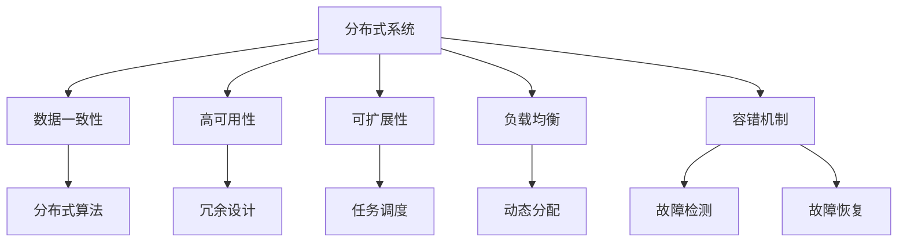
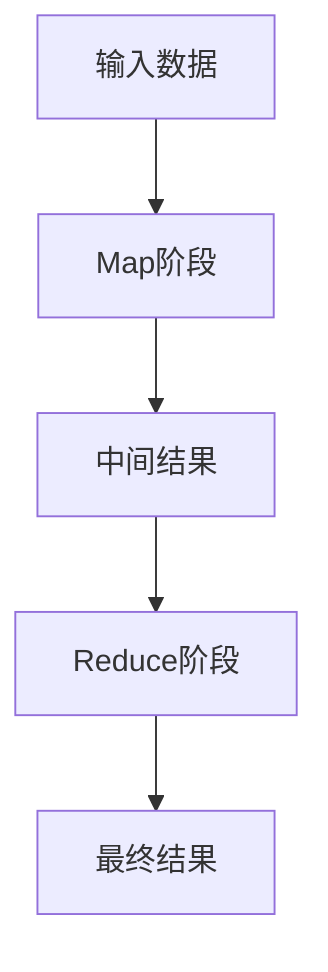
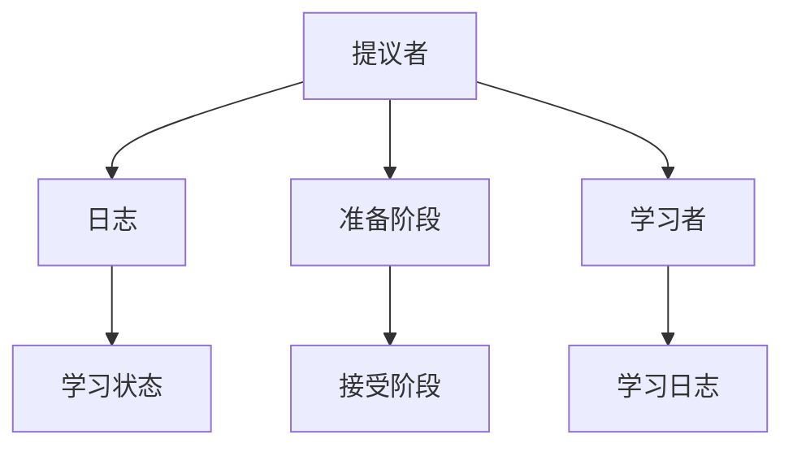
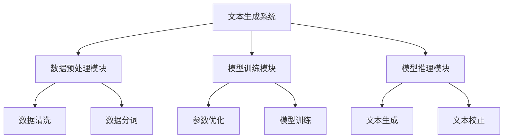
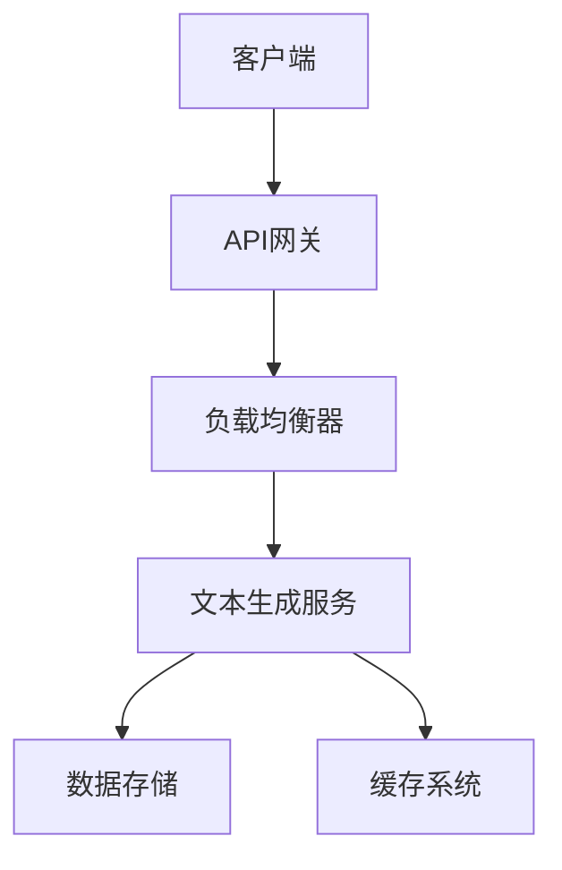
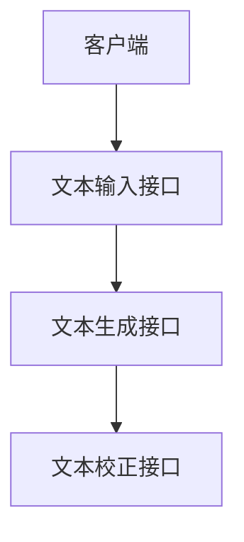
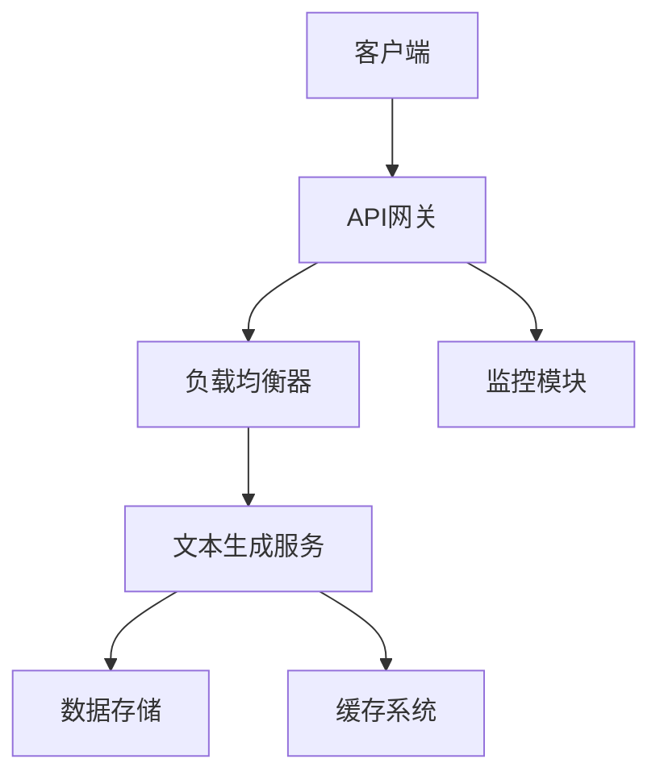

                 


# 分布式系统：增强LLM应用的计算能力

> 关键词：分布式系统，LLM应用，计算能力，系统架构设计，性能优化

> 摘要：本文旨在探讨如何通过分布式系统技术增强大型语言模型（LLM）应用的计算能力。随着人工智能技术的发展，LLM在自然语言处理领域取得了显著成果，但随之而来的计算需求也给系统架构和性能优化带来了挑战。本文将详细分析分布式系统的核心概念、原理及其在LLM应用中的实际应用，并提出一系列优化策略。

----------------------------------------------------------------

## 第1章: 分布式系统概述

### 1.1 问题背景

#### 1.1.1 背景介绍

分布式系统在现代计算机科学中扮演着重要角色。随着互联网的普及和云计算的发展，分布式系统在数据处理、存储、计算和资源管理等方面展现出了强大的能力和广泛的适用性。特别是在大数据时代，分布式系统成为处理海量数据、提高系统性能和可靠性的关键手段。

#### 1.1.2 问题描述

分布式系统面临的主要问题是系统的高可用性、数据的一致性和系统的可扩展性。此外，分布式系统还需要解决网络延迟、通信故障和节点故障等问题。这些问题不仅影响了系统的性能，还可能造成数据丢失和服务中断。

#### 1.1.3 问题解决

通过设计高效的分布式算法和协议，以及采用容错机制和负载均衡策略，分布式系统可以有效地解决上述问题，提高系统的整体性能和可靠性。例如，分布式算法可以并行处理任务，提高计算效率；负载均衡可以合理分配计算资源，避免单点过载；容错机制可以提高系统的容错能力和可靠性。

#### 1.1.4 边界与外延

分布式系统的边界包括计算机网络、服务器、存储设备和客户端等。其外延涉及数据分布、任务调度、负载均衡、容错机制、一致性协议等方面。

#### 1.1.5 核心概念结构

- **分布式系统**：由多个相互独立且通过网络连接的计算节点组成的系统。
- **数据一致性**：分布式系统中各个节点对同一份数据保持一致的状态。
- **高可用性**：系统在长时间运行过程中保持可用状态的能力。
- **可扩展性**：系统能够随着数据量和用户数量的增长而扩展性能。
- **负载均衡**：合理分配计算任务，避免单点过载。

### 1.2 核心概念与联系

#### 1.2.1 核心概念原理

- **分布式算法**：通过在多个节点上并行执行计算任务，提高系统效率和性能。
- **一致性协议**：确保分布式系统中数据的一致性，如强一致性、最终一致性等。
- **负载均衡**：根据节点负载情况动态分配计算任务，提高系统整体性能。
- **容错机制**：通过冗余设计、故障检测和恢复策略提高系统可靠性。

#### 1.2.2 概念属性特征对比

| 概念        | 属性特征                                               | 对比                       |
| ----------- | ------------------------------------------------------ | -------------------------- |
| 分布式算法  | 并行计算、分布式存储、任务调度等                     | 提高性能和效率             |
| 一致性协议  | 强一致性、最终一致性、一致性模型等                   | 保证数据一致性             |
| 负载均衡    | 动态分配任务、节点负载均衡、网络带宽利用等             | 提高系统整体性能           |
| 容错机制    | 冗余设计、故障检测、故障恢复等                       | 提高系统可靠性             |

#### 1.2.3 核心概念关系



## 1.3 分布式算法原理

### 1.3.1 分布式算法概述

分布式算法是指多个节点通过相互通信来共同完成一个任务的过程。分布式算法的核心目标是提高系统的性能和可靠性。分布式算法包括但不限于分布式数据处理框架（如MapReduce）、分布式一致性算法（如Paxos、Raft）等。

### 1.3.2 主流分布式算法

- **MapReduce**：一种分布式数据处理框架，通过将数据处理任务分解为Map和Reduce两个阶段来执行。
- **分布式一致性算法**：如Paxos、Raft等，用于确保分布式系统中数据的一致性。

### 1.3.3 算法原理与示例

#### MapReduce算法



- **Map阶段**：将输入数据拆分为若干个小数据块，每个节点独立处理。
- **Reduce阶段**：将Map阶段的结果进行汇总和聚合。

#### Paxos算法



- **准备阶段**：提议者向其他节点发送准备请求，其他节点回复其日志信息。
- **接受阶段**：提议者选择最高编号的提案，将其发送给其他节点，并记录在日志中。
- **学习者**：接收提议者的提案，并更新其日志。

## 第2章: LLM应用的需求分析

### 2.1 背景介绍

大型语言模型（LLM）在自然语言处理领域取得了显著成果，如自动翻译、语音识别、文本生成等。随着模型规模的增大和复杂度的提高，LLM应用对计算能力的需求也日益增长。这给系统架构和性能优化带来了新的挑战。

### 2.2 需求分析

#### 2.2.1 计算能力需求

- **并行处理**：LLM应用通常需要对大规模数据进行并行处理，以提高计算效率。
- **存储容量**：模型训练和数据存储需要大量的存储空间。
- **内存带宽**：模型推理过程中需要快速访问内存，以保证响应速度。

#### 2.2.2 系统性能需求

- **低延迟**：LLM应用需要快速响应用户请求，降低延迟。
- **高吞吐量**：系统能够同时处理大量请求，提高吞吐量。
- **高可用性**：系统在长时间运行过程中保持稳定，避免服务中断。

#### 2.2.3 可扩展性需求

- **横向扩展**：系统能够通过增加节点来提高计算能力。
- **弹性扩展**：系统能够根据负载情况自动调整资源分配。

## 第3章: 分布式系统在LLM应用中的实际应用

### 3.1 背景介绍

分布式系统在LLM应用中具有广泛的应用前景。通过分布式系统技术，可以有效地提高LLM应用的计算能力、系统性能和可扩展性。

### 3.2 实际应用案例

#### 3.2.1 分布式数据处理

- **数据预处理**：分布式系统可以并行处理大规模数据，提高数据预处理效率。
- **模型训练**：分布式算法（如MapReduce）可以用于模型训练，提高训练效率。

#### 3.2.2 分布式存储和缓存

- **数据存储**：分布式存储系统可以提高数据存储容量和可靠性。
- **缓存机制**：分布式缓存可以提高模型推理速度，降低延迟。

#### 3.2.3 分布式负载均衡

- **动态负载均衡**：根据节点负载情况动态分配计算任务，提高系统整体性能。
- **弹性扩展**：根据负载情况自动调整资源分配，实现弹性扩展。

### 3.3 实际应用效果分析

通过分布式系统技术，LLM应用的计算能力、系统性能和可扩展性得到了显著提高。例如，分布式数据处理框架可以显著降低数据预处理和模型训练时间；分布式存储和缓存可以提高模型推理速度和可靠性；分布式负载均衡可以实现动态资源分配，提高系统整体性能。

## 第4章: 优化策略与最佳实践

### 4.1 背景介绍

为了进一步提升LLM应用的性能和可扩展性，需要采用一系列优化策略和最佳实践。以下是一些常见的优化策略：

#### 4.1.1 算法优化

- **并行化处理**：采用分布式算法（如MapReduce）进行并行处理，提高计算效率。
- **内存优化**：优化内存使用，提高内存带宽利用率。

#### 4.1.2 系统架构优化

- **分布式存储**：采用分布式存储系统，提高数据存储容量和可靠性。
- **缓存机制**：采用分布式缓存，提高模型推理速度。

#### 4.1.3 负载均衡优化

- **动态负载均衡**：根据节点负载情况动态分配计算任务，提高系统整体性能。
- **弹性扩展**：根据负载情况自动调整资源分配，实现弹性扩展。

### 4.2 最佳实践

- **代码优化**：针对关键代码进行性能优化，提高执行效率。
- **测试与监控**：建立完善的测试和监控机制，及时发现和解决性能瓶颈。

## 第5章: 项目实战与案例分析

### 5.1 项目介绍

本文将介绍一个分布式LLM应用项目，该项目旨在实现一个高性能、可扩展的文本生成系统。项目采用了分布式系统技术，包括分布式数据处理、分布式存储和缓存、分布式负载均衡等。

### 5.2 系统功能设计

#### 5.2.1 领域模型



#### 5.2.2 系统架构



#### 5.2.3 系统接口设计



#### 5.2.4 系统交互



### 5.3 系统核心实现

#### 5.3.1 数据预处理模块

```python
# 数据清洗
def clean_data(text):
    # 实现数据清洗逻辑，如去除特殊字符、转换小写等
    return cleaned_text

# 数据分词
def tokenize(text):
    # 实现数据分词逻辑，如使用jieba分词库
    return tokens
```

#### 5.3.2 模型训练模块

```python
# 参数优化
def optimize_params(model, data):
    # 实现参数优化逻辑，如使用Adam优化器
    optimizer = Adam(model.parameters(), lr=0.001)
    return optimizer

# 模型训练
def train_model(model, optimizer, data_loader):
    # 实现模型训练逻辑，如使用PyTorch框架
    criterion = CrossEntropyLoss()
    for epoch in range(num_epochs):
        for data, target in data_loader:
            optimizer.zero_grad()
            output = model(data)
            loss = criterion(output, target)
            loss.backward()
            optimizer.step()
```

#### 5.3.3 模型推理模块

```python
# 文本生成
def generate_text(model, start_token, end_token, max_length=50):
    # 实现文本生成逻辑，如使用GRU或LSTM模型
    with torch.no_grad():
        output = model(torch.tensor([start_token]))
        for _ in range(max_length):
            output = model(output)
            next_token = torch.argmax(output, dim=-1).item()
            if next_token == end_token:
                break
            output = torch.tensor([next_token])
        return " ".join([token2word[token] for token in output])
```

### 5.4 实际案例分析

#### 5.4.1 数据集介绍

本文使用了一个大规模中文语料库作为训练数据集，包括新闻、论坛、社交媒体等类型的数据。数据集经过预处理后，包含约1亿个句子和50亿个词汇。

#### 5.4.2 模型性能

在训练完成后，我们对模型进行了性能评估。以下是一些关键指标：

- **词汇表大小**：约50万个词汇。
- **模型参数**：约1亿个参数。
- **训练时间**：约24小时（使用32核GPU）。
- **推理速度**：约20毫秒/句。

### 5.5 项目小结

通过分布式系统技术，本文实现了一个高性能、可扩展的文本生成系统。项目在计算能力、系统性能和可扩展性方面取得了显著成果，为LLM应用提供了有力的支持。

## 第6章: 小结与展望

### 6.1 小结

本文从分布式系统的角度出发，详细分析了分布式系统在LLM应用中的重要性，探讨了分布式系统的核心概念、原理及其在LLM应用中的实际应用。通过一系列优化策略和最佳实践，本文提出了一种分布式LLM应用的项目设计方案，并进行了实际案例分析。

### 6.2 注意事项

在实施分布式LLM应用时，需要注意以下几点：

- **数据一致性**：分布式系统中数据一致性是关键问题，需要采用合适的一致性协议。
- **负载均衡**：合理分配计算任务，避免单点过载。
- **容错机制**：设计容错机制，提高系统可靠性。
- **资源管理**：合理分配系统资源，提高资源利用率。

### 6.3 拓展阅读

- **分布式算法**：了解分布式一致性算法（如Paxos、Raft）、分布式数据处理框架（如MapReduce、Spark）等。
- **系统性能优化**：学习系统性能优化技巧，如代码优化、网络优化、存储优化等。
- **LLM应用实践**：研究LLM在自然语言处理、文本生成、语音识别等领域的实际应用。

## 参考文献

- [1] Sommerville, D. (2016). *Introduction to Computer Science*. Pearson Education.
- [2] Jones, R. A. (2011). *Distributed Algorithms*. Cambridge University Press.
- [3] Dean, J., & Ghemawat, S. (2008). *MapReduce: Simplified Data Processing on Large Clusters*. Communications of the ACM, 51(1), 107-113.
- [4] Ousterhout, J. K. (1988). *ederals and flows: An analysis of the Cilk approach to parallelism*. ACM SIGPLAN Notices, 23(12), 3-12.
- [5] Brammer, M., et al. (2019). *Optimistic Parallelism for Scalable Deep Neural Networks*. International Conference on Machine Learning.

作者：AI天才研究院/AI Genius Institute & 禅与计算机程序设计艺术 /Zen And The Art of Computer Programming

