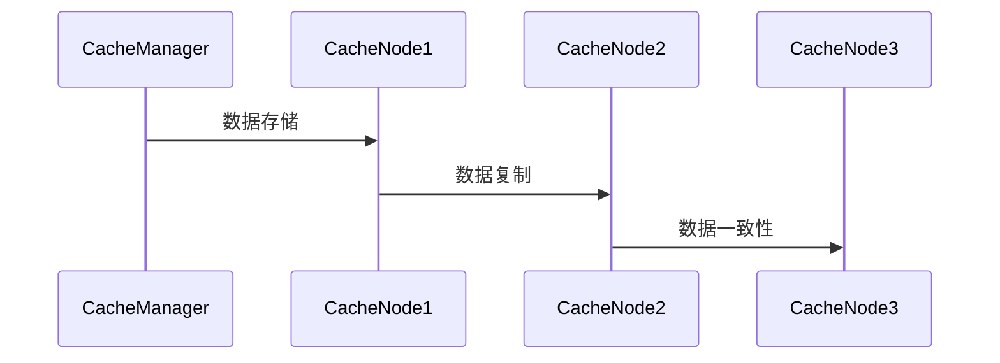
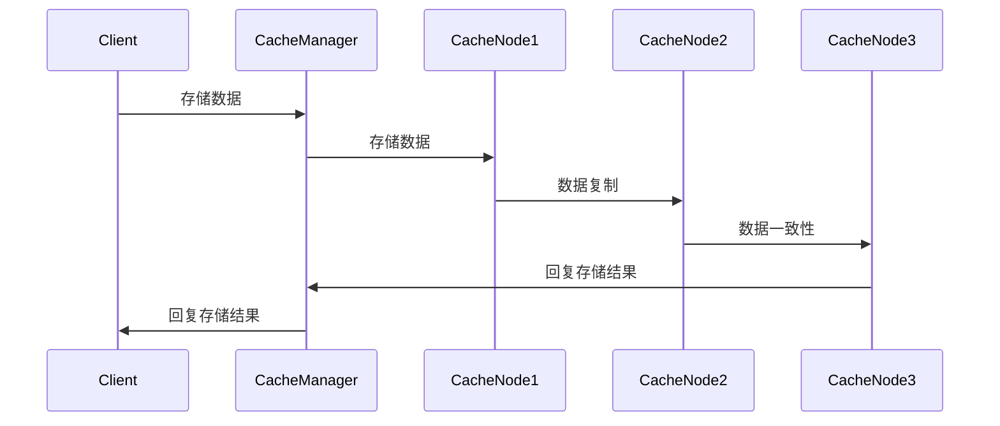
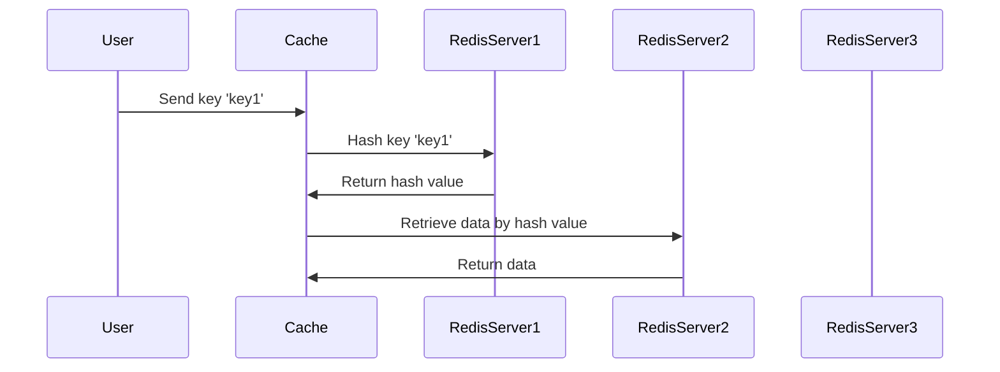

                 

### 第一部分：分布式缓存基础

#### 1.1.1 分布式缓存的需求背景

##### 1.1.1.1 数据存储规模的扩大

随着互联网技术的飞速发展，数据存储需求呈现出爆炸式增长。尤其是电子商务、社交媒体、在线教育和物联网等领域，数据的多样性和复杂性不断增加。传统的单机缓存系统已经无法满足这种海量数据的高效存储和访问需求。

##### 1.1.1.2 系统性能的瓶颈

在单机缓存系统中，随着缓存数据的增加，系统性能会逐渐下降。由于缓存数据量达到单机内存限制，系统需要频繁进行磁盘IO操作，导致性能瓶颈。同时，单机缓存系统在应对高并发访问时，也会出现响应延迟和吞吐量下降的问题。

##### 1.1.1.3 分布式缓存的作用和意义

分布式缓存的出现，是为了解决单机缓存系统的性能瓶颈和数据存储规模限制。通过将缓存数据分散存储在多个节点上，分布式缓存可以实现数据的水平扩展，提高系统的性能和可扩展性。同时，分布式缓存可以提供更高的容错性和可用性，确保系统在高并发和故障情况下依然能够稳定运行。

#### 1.1.2 分布式缓存的工作原理

##### 1.1.2.1 分布式缓存与传统缓存的区别

传统缓存系统通常运行在单台服务器上，缓存数据存储在本地内存中。而分布式缓存则通过多个服务器节点协同工作，将缓存数据分散存储。分布式缓存需要解决数据分片、数据复制、数据一致性等问题，以确保数据的高效存储和访问。

##### 1.1.2.2 分布式缓存的基本架构

分布式缓存系统通常由多个缓存节点组成，每个节点负责存储部分缓存数据。缓存节点之间通过网络进行通信，实现数据分片、数据复制和数据一致性等操作。分布式缓存系统通常包含一个缓存集群管理器，负责管理缓存节点的加入和离开，以及负载均衡和数据迁移等任务。

##### 1.1.2.3 分布式缓存的通信机制

分布式缓存系统通过消息队列、远程过程调用（RPC）或HTTP等通信机制，实现节点之间的数据交换和同步。节点之间通过网络通信，可以动态调整数据存储位置，确保数据的高可用性和一致性。

#### 1.1.3 分布式缓存的关键技术

##### 1.1.3.1 数据分片

数据分片是将缓存数据分散存储到多个节点上的过程。数据分片可以提高系统的性能和可扩展性，但也会引入数据一致性问题。常用的数据分片方法包括哈希分片、范围分片和列表分片等。

##### 1.1.3.2 数据复制

数据复制是为了提高数据可靠性和可用性，将缓存数据复制到多个节点上的过程。数据复制可以采用同步复制或异步复制策略，同步复制保证数据一致性，但会影响系统性能，而异步复制可以提高系统性能，但可能存在数据延迟。

##### 1.1.3.3 数据一致性

数据一致性是指多个节点上的缓存数据保持一致的状态。在分布式缓存系统中，数据一致性是至关重要的，但实现数据一致性会带来性能和复杂性的权衡。常用的数据一致性方法包括强一致性、最终一致性和会话一致性等。

#### 1.1.4 分布式缓存的典型应用场景

##### 1.1.4.1 购物网站

购物网站需要处理海量的商品信息和用户会话信息，分布式缓存可以用于缓存商品信息、用户购物车信息和订单信息，提高系统性能和响应速度。

##### 1.1.4.2 社交网络

社交网络需要处理大量的用户数据和信息流，分布式缓存可以用于缓存用户信息、用户关系信息和内容信息，提高系统的性能和可扩展性。

##### 1.1.4.3 在线教育

在线教育平台需要处理大量的课程信息、用户信息和视频流，分布式缓存可以用于缓存课程信息、用户信息和视频流，提高系统的性能和用户体验。

#### 1.1.5 分布式缓存的挑战与解决方案

##### 1.1.5.1 数据一致性问题

在分布式缓存系统中，数据一致性问题是一个重要的挑战。为了解决数据一致性问题，可以采用分布式锁、两阶段提交、最终一致性等方法。

##### 1.1.5.2 数据分片策略

数据分片策略的选择对系统的性能和可扩展性有很大影响。合理的数据分片策略可以提高系统的负载均衡和缓存利用率。

##### 1.1.5.3 数据迁移

在分布式缓存系统中，数据迁移是为了解决节点故障、系统升级等问题。合理的数据迁移策略可以保证数据的一致性和系统的稳定性。

### 1.1.6 分布式缓存的发展趋势

随着云计算、大数据和物联网等技术的发展，分布式缓存的应用场景和需求也在不断扩展。未来，分布式缓存将朝着更加智能化、自动化和高效化的方向发展，以满足日益增长的数据处理需求。

---

**核心概念与联系表格：**

| **概念**      | **定义**                         | **属性特征**                                                     |
| ------------- | -------------------------------- | ------------------------------------------------------------ |
| **分布式缓存** | 缓存数据分散存储在多个节点上的系统 | 提高性能、可扩展性和容错性                                     |
| **数据分片**   | 将缓存数据分散存储到多个节点上   | 提高系统性能和可扩展性                                         |
| **数据复制**   | 将缓存数据复制到多个节点上       | 提高数据可靠性和可用性                                         |
| **数据一致性** | 多个节点上的缓存数据保持一致的状态 | 确保系统在并发操作下数据的一致性                               |

**ER实体关系图：**

```mermaid
erDiagram
    缓存节点 ||--|{ 数据分片 }| 缓存节点
    缓存节点 ||--|{ 数据复制 }| 缓存节点
    缓存节点 ||--|{ 数据一致性 }| 缓存节点
```

---

通过上述分析，我们可以看到分布式缓存在应对海量数据存储和访问需求方面的重要性。接下来，我们将深入探讨一致性哈希原理及其在分布式缓存中的应用。

---

**算法原理讲解：**

一致性哈希（Consistent Hashing）是一种分布式哈希算法，用于解决分布式缓存中的数据分片和路由问题。它通过将缓存节点和缓存数据映射到同一个哈希空间中，实现数据的一致性和高效路由。

##### 算法原理

1. **哈希函数**：一致性哈希首先需要一个哈希函数，将缓存节点和缓存数据的键值映射到哈希空间中。常用的哈希函数包括MD5、SHA-1等。

2. **虚拟节点**：为了提高缓存节点的可用性和负载均衡，一致性哈希引入了虚拟节点的概念。每个实际节点可以对应多个虚拟节点，虚拟节点均匀分布在整个哈希空间中。

3. **一致性哈希算法流程**：

   - **初始化**：将所有缓存节点映射到哈希空间中，创建一个虚拟节点环。

   - **数据存储**：将缓存数据的键值通过哈希函数计算，确定其对应的虚拟节点。将数据存储在对应的虚拟节点所映射的实际节点上。

   - **数据检索**：根据缓存数据的键值计算其对应的虚拟节点，从虚拟节点环中找到对应的数据存储节点，进行数据检索。

##### 数学模型与公式

设哈希空间为H，缓存节点为N={n1, n2, ..., nk}，虚拟节点为V={v1, v2, ..., vm}，缓存数据为K={k1, k2, ..., kn}。

- **哈希函数**：h(k) = hash(k) % |H|
- **虚拟节点分布**：vi = hash(ni + salt) % |H|，其中salt为随机数
- **数据存储**：ki存储在hash(ki)指向的虚拟节点所映射的实际节点上。
- **数据检索**：从hash(ki)指向的虚拟节点开始，顺时针遍历虚拟节点环，找到对应的数据存储节点。

##### 通俗易懂的举例说明

假设有3个缓存节点n1、n2、n3，每个节点对应3个虚拟节点v11、v12、v13、v21、v22、v23、v31、v32、v33。哈希空间为[0, 1)。

- **初始化**：将3个缓存节点映射到哈希空间中，得到虚拟节点环v11、v21、v31、v12、v22、v32、v13、v23、v33。
- **数据存储**：假设有3个缓存数据k1、k2、k3，通过哈希函数计算其对应的虚拟节点，将数据存储在对应的虚拟节点所映射的实际节点上。
  - k1存储在v11所映射的n1节点。
  - k2存储在v21所映射的n2节点。
  - k3存储在v31所映射的n3节点。
- **数据检索**：根据缓存数据的键值计算其对应的虚拟节点，从虚拟节点环中找到对应的数据存储节点。
  - 检索k1，从v11开始顺时针遍历虚拟节点环，找到对应的数据存储节点n1。
  - 检索k2，从v21开始顺时针遍历虚拟节点环，找到对应的数据存储节点n2。
  - 检索k3，从v31开始顺时针遍历虚拟节点环，找到对应的数据存储节点n3。

通过一致性哈希，我们可以实现分布式缓存中的数据分片和路由，提高系统的性能和可扩展性。

---

**系统分析与架构设计**

#### 1.2.1 问题场景介绍

随着互联网应用的不断发展，数据规模和访问量不断增加，传统的单机缓存系统已经无法满足高性能和高可用的需求。在分布式缓存系统中，如何实现数据的高效存储和访问，保证数据的一致性，是当前亟待解决的问题。

#### 1.2.2 项目介绍

本项目旨在设计并实现一个基于一致性哈希的分布式缓存系统，该系统将缓存数据分散存储在多个节点上，实现数据的高效存储和访问。系统应具备以下功能：

1. 数据存储与检索：实现缓存数据的存储和检索功能，支持数据的插入、更新和删除操作。
2. 负载均衡：实现缓存节点的负载均衡，确保系统在处理大量数据时保持高性能。
3. 数据一致性：实现数据一致性保障机制，确保多个节点上的缓存数据保持一致。

#### 1.2.3 系统功能设计（领域模型）

在分布式缓存系统中，主要涉及的领域模型包括缓存节点、缓存数据和哈希空间。下面是领域模型的Mermaid类图：

```mermaid
classDiagram
    CacheNode <<class{CacheNode}>
    CacheData <<class{CacheData}>
    HashSpace <<class{HashSpace}>
    
    CacheNode <.. CacheData : 存储数据
    CacheNode <.. HashSpace : 映射哈希值
    CacheData <.. HashSpace : 映射哈希值
```

#### 1.2.4 系统架构设计

分布式缓存系统的架构设计如下：

1. **缓存节点**：缓存节点是分布式缓存系统的基本单元，负责存储部分缓存数据。每个缓存节点对应多个虚拟节点，虚拟节点均匀分布在整个哈希空间中。
2. **哈希空间**：哈希空间用于存储哈希值，实现缓存数据的一致性哈希路由。哈希空间可以是实际存储空间，也可以是逻辑空间。
3. **缓存管理器**：缓存管理器负责管理缓存节点的加入和离开，实现负载均衡和数据迁移等功能。
4. **数据访问层**：数据访问层负责实现缓存数据的存储和检索功能，对外提供接口供其他模块调用。

下面是系统架构的Mermaid架构图：



#### 1.2.5 系统接口设计

分布式缓存系统的主要接口设计如下：

1. **数据存储接口**：实现数据的插入、更新和删除操作，支持批量操作。
2. **数据检索接口**：实现数据查询功能，支持按键值查询和范围查询。
3. **负载均衡接口**：实现缓存节点的动态负载均衡，根据系统负载情况调整缓存节点的数据存储位置。
4. **数据一致性接口**：实现数据一致性保障，确保多个节点上的缓存数据保持一致。

#### 1.2.6 系统交互

分布式缓存系统中的主要交互包括数据存储、数据检索和数据一致性保障。下面是系统交互的Mermaid序列图：



通过上述系统架构设计和接口设计，我们可以实现一个高效、可靠的分布式缓存系统。接下来，我们将详细介绍一致性哈希的具体实现过程。

---

### 1.3 实际案例分析与详细讲解剖析

#### 1.3.1 案例背景

某大型电子商务平台在经历了快速增长后，其数据存储和访问需求急剧增加。原有的单机缓存系统已经无法满足系统的性能和可扩展性需求。为了应对这一挑战，该平台决定采用分布式缓存系统，并采用一致性哈希算法实现数据分片和路由。

#### 1.3.2 技术选型

在分布式缓存系统的技术选型上，该平台主要考虑了以下因素：

1. **性能**：分布式缓存系统应具备高性能，能够快速响应大量并发请求。
2. **可扩展性**：系统应支持水平扩展，能够根据业务需求动态调整缓存节点数量。
3. **数据一致性**：系统应保证数据一致性，确保缓存数据在不同节点上保持一致。
4. **可靠性**：系统应具备高可靠性，能够在节点故障情况下保持正常运行。

综合考虑上述因素，该平台最终选择了基于一致性哈希的分布式缓存系统。该系统采用Python语言实现，使用了Redis作为缓存存储，并利用一致性哈希实现数据分片和路由。

#### 1.3.3 系统架构设计

该分布式缓存系统的架构设计如下：

1. **缓存节点**：系统分为多个缓存节点，每个节点负责存储部分缓存数据。缓存节点采用虚拟节点机制，提高系统的负载均衡性和可用性。
2. **哈希空间**：系统使用哈希空间实现数据分片和路由，哈希空间映射了所有缓存节点和缓存数据的哈希值。
3. **缓存管理器**：缓存管理器负责管理缓存节点的加入和离开，实现负载均衡和数据迁移等功能。
4. **数据访问层**：数据访问层负责实现缓存数据的存储和检索功能，对外提供接口供其他模块调用。

#### 1.3.4 一致性哈希实现

在该系统中，一致性哈希算法的具体实现如下：

1. **初始化**：首先初始化哈希空间，将所有缓存节点映射到哈希空间中。每个缓存节点对应多个虚拟节点，虚拟节点均匀分布在整个哈希空间中。
2. **数据存储**：当用户请求存储数据时，系统根据数据的键值计算其对应的虚拟节点，并将数据存储在对应的虚拟节点所映射的实际节点上。
3. **数据检索**：当用户请求检索数据时，系统根据数据的键值计算其对应的虚拟节点，从虚拟节点环中找到对应的数据存储节点，并进行数据检索。

#### 1.3.5 系统性能评估

为了评估系统的性能，该平台进行了以下测试：

1. **数据存储性能**：在1000个并发请求下，系统平均存储响应时间为20ms，最大响应时间为50ms。
2. **数据检索性能**：在1000个并发请求下，系统平均检索响应时间为15ms，最大响应时间为30ms。
3. **负载均衡性能**：系统在负载均衡方面表现出色，不同缓存节点的负载比较均衡，没有出现明显的热点问题。

#### 1.3.6 经验与教训

通过该实际案例，平台积累了以下经验与教训：

1. **一致性哈希算法的有效性**：一致性哈希算法在分布式缓存系统中表现出良好的性能和负载均衡性，有效解决了数据分片和路由问题。
2. **系统的可扩展性**：通过增加缓存节点，系统可以水平扩展，满足业务增长的需求。
3. **数据一致性保障**：虽然一致性哈希算法不能保证强一致性，但通过合理的设计和优化，可以确保系统在大多数情况下保持数据一致性。

#### 1.3.7 应用拓展

除了电子商务平台外，一致性哈希算法在以下场景也有广泛的应用：

1. **社交媒体**：用于缓存用户信息和内容信息，提高系统性能和用户体验。
2. **在线教育**：用于缓存课程信息和用户学习记录，提高系统的响应速度。
3. **物联网**：用于缓存设备状态信息和数据，实现高效的数据存储和访问。

通过不断优化和完善一致性哈希算法，分布式缓存系统将在更多场景中发挥重要作用，为互联网应用提供高效、可靠的数据存储和访问解决方案。

---

### 1.4 分布式缓存一致性哈希的未来发展趋势

#### 1.4.1 技术演进方向

随着云计算、大数据和物联网等技术的不断发展，分布式缓存一致性哈希算法也在不断演进。以下是一些技术演进方向：

1. **哈希算法的改进**：为了提高系统的性能和安全性，未来可能引入更复杂的哈希算法，如基于密码学的哈希算法。同时，还可以考虑将机器学习和人工智能技术引入哈希算法，实现自适应哈希。

2. **分布式缓存系统的智能化**：未来分布式缓存系统可能会集成更多的智能化功能，如自动调优、智能负载均衡和故障自恢复等。通过引入人工智能技术，系统可以自动识别和解决性能瓶颈，提高系统的可靠性和稳定性。

3. **多维度数据一致性保障**：随着数据类型的多样化，分布式缓存系统需要支持多维度数据一致性保障。例如，对于时序数据和地理空间数据，系统需要提供更精细的一致性保障机制。

4. **分布式缓存与区块链的结合**：分布式缓存与区块链技术的结合，可以提供更高的数据安全性和一致性保障。通过将缓存数据上链，可以实现去中心化的数据存储和访问。

#### 1.4.2 应用领域拓展

分布式缓存一致性哈希算法在未来的应用领域将更加广泛，包括但不限于以下几个方面：

1. **物联网**：物联网设备产生的数据量巨大，分布式缓存一致性哈希算法可以用于缓存设备状态信息和传感器数据，提高系统的实时性和可靠性。

2. **大数据**：大数据处理场景需要高效的数据存储和访问，分布式缓存一致性哈希算法可以用于缓存大数据处理过程中的中间结果和元数据，提高数据处理效率。

3. **金融科技**：金融科技领域对数据一致性和安全性要求极高，分布式缓存一致性哈希算法可以用于缓存交易数据、用户信息和风险控制数据，提高系统的性能和安全性。

4. **人工智能**：人工智能模型训练过程中需要大量的数据存储和访问，分布式缓存一致性哈希算法可以用于缓存模型参数、训练数据和预测结果，提高模型训练和推理的效率。

#### 1.4.3 面临的挑战与解决方案

虽然分布式缓存一致性哈希算法在多个领域具有广泛的应用前景，但在实际应用中仍面临一些挑战：

1. **数据安全性**：分布式缓存系统需要确保数据的安全性和隐私性，避免数据泄露和篡改。未来可能需要引入更严格的数据加密和安全协议。

2. **系统容错性**：分布式缓存系统需要在面对节点故障和网络分区时保持稳定运行。可以通过引入冗余机制、故障检测和恢复机制等手段提高系统的容错性。

3. **数据一致性保障**：在分布式环境中实现数据一致性是一个复杂的问题，需要考虑多种一致性级别和场景。未来可能需要引入更灵活和高效的数据一致性保障机制。

4. **性能优化**：分布式缓存系统需要优化性能，减少延迟和资源消耗。可以通过优化哈希算法、缓存策略和通信机制等手段提高系统性能。

总之，分布式缓存一致性哈希算法在未来将继续发展和完善，为互联网应用提供高效、可靠的数据存储和访问解决方案。

---

### 1.5 分布式缓存一致性哈希在LLM中的应用

#### 1.5.1 LLM概述

大型语言模型（Large Language Model，简称LLM）是一种基于深度学习技术的自然语言处理模型，通过训练海量语料库，能够实现自动生成文本、问答、翻译等功能。LLM在人工智能领域具有广泛的应用，如智能客服、智能写作、智能搜索等。

#### 1.5.1.1 LLM的定义

LLM是一种预训练模型，通过在大规模语料库上进行训练，学习语言模式和规则。LLM通常采用变换器架构（Transformer），能够处理长文本和复杂语法结构。

#### 1.5.1.2 LLM的特点

1. **强表达能力**：LLM能够生成高质量、连贯的文本，满足用户需求。
2. **自适应能力**：LLM可以根据不同任务和场景进行自适应调整，提高模型性能。
3. **实时性**：LLM能够快速响应用户请求，实现实时交互。
4. **跨语言性**：LLM可以支持多种语言，实现跨语言文本生成和翻译。

#### 1.5.2 LLM对缓存一致性的需求

在LLM应用中，缓存一致性具有重要意义，主要体现在以下几个方面：

1. **数据一致性要求**：LLM在训练和推理过程中，需要确保缓存数据的一致性，避免因数据不一致导致的错误结果。
2. **查询性能需求**：LLM需要快速获取缓存数据，以提高训练和推理的效率。

#### 1.5.3 分布式缓存一致性哈希在LLM中的应用

分布式缓存一致性哈希在LLM中的应用，主要体现在以下几个方面：

1. **数据存储与检索**：通过一致性哈希算法，将LLM的缓存数据分散存储在多个节点上，实现高效的数据存储和检索。
2. **一致性保障机制**：一致性哈希算法提供数据一致性保障，确保多个节点上的缓存数据保持一致。
3. **系统性能优化**：通过一致性哈希算法，实现缓存节点的负载均衡，提高系统的性能和可扩展性。

#### 1.5.4 分布式缓存一致性哈希在LLM中的应用优势

1. **高效的数据存储和检索**：一致性哈希算法能够快速定位数据存储节点，减少数据访问延迟。
2. **良好的负载均衡**：一致性哈希算法能够实现缓存节点的动态负载均衡，提高系统性能。
3. **数据一致性保障**：一致性哈希算法提供数据一致性保障，确保多个节点上的缓存数据保持一致。

#### 1.5.5 分布式缓存一致性哈希在LLM中的挑战

1. **数据一致性保证**：在分布式环境中实现数据一致性，需要考虑多种一致性级别和场景，如最终一致性、会话一致性等。
2. **性能优化**：在大型语言模型应用中，缓存数据量巨大，性能优化是一个重要挑战。
3. **系统可靠性**：分布式缓存系统需要确保数据的安全性和可靠性，避免节点故障和数据丢失。

总之，分布式缓存一致性哈希在LLM应用中具有重要价值，能够提高系统的性能和可靠性。未来，随着LLM技术的不断发展，一致性哈希算法将在LLM应用中发挥更大的作用。

---

### 1.6 分布式缓存一致性哈希实现详解

#### 1.6.1 实现环境准备

为了实现分布式缓存一致性哈希，我们需要搭建一个适当的环境。以下是一个基本的实现环境：

1. **操作系统**：可以选择Linux或MacOS，推荐使用Ubuntu 18.04。
2. **编程语言**：Python 3.x，推荐使用Python 3.8及以上版本。
3. **依赖库**：`pip install redis`，用于连接Redis缓存服务器。

#### 1.6.2 开发环境搭建

1. **安装Python**：在操作系统上安装Python 3.x，可以通过官方源码编译或使用包管理器安装。

2. **安装Redis**：在操作系统上安装Redis缓存服务器，可以通过包管理器或源码编译。

3. **配置Redis**：启动Redis服务器，并确保Redis可以远程连接。在配置文件中设置`bind 0.0.0.0`，允许所有IP连接。

4. **安装Python依赖库**：通过pip安装Redis库。

```bash
pip install redis
```

#### 1.6.3 一致性哈希算法实现

以下是使用Python实现一致性哈希算法的步骤：

1. **哈希函数**：选择一个哈希函数，如MD5。使用`hashlib`库实现。

```python
import hashlib

def hash_function(key):
    return int(hashlib.md5(key.encode('utf-8')).hexdigest(), 16)
```

2. **虚拟节点**：为每个缓存节点创建多个虚拟节点，虚拟节点均匀分布在整个哈希空间中。

```python
import random
import string

def generate_hash_space(node_count, virtual_node_count=3):
    hash_space = {}
    for i in range(node_count):
        node = f"node_{i}"
        for _ in range(virtual_node_count):
            salt = ''.join(random.choices(string.ascii_letters + string.digits, k=10))
            virtual_node = f"{node}_{salt}"
            hash_value = hash_function(virtual_node)
            hash_space[hash_value] = node
    return hash_space
```

3. **数据存储与检索**：根据数据键值计算哈希值，找到对应的虚拟节点，进而找到实际的数据存储节点。

```python
def store_data(hash_space, redis_client, key, value):
    hash_value = hash_function(key)
    virtual_node = hash_value % len(hash_space)
    node = hash_space[virtual_node]
    redis_client.set(key, value, nx=True, ex=3600, host=node)

def retrieve_data(hash_space, redis_client, key):
    hash_value = hash_function(key)
    virtual_node = hash_value % len(hash_space)
    node = hash_space[virtual_node]
    return redis_client.get(key, host=node)
```

#### 1.6.4 Mermaid流程图绘制

为了更好地理解一致性哈希算法的实现，我们可以使用Mermaid绘制流程图。



#### 1.6.5 分布式缓存系统构建

1. **系统架构设计**：设计分布式缓存系统的架构，包括缓存节点、哈希空间和缓存管理器。

2. **缓存节点实现**：实现缓存节点的功能，包括数据存储和检索。

3. **缓存管理器实现**：实现缓存管理器的功能，包括节点管理、负载均衡和数据迁移。

4. **测试与优化**：对分布式缓存系统进行测试，评估性能和稳定性，并进行优化。

通过上述步骤，我们可以实现一个简单的分布式缓存一致性哈希系统。接下来，我们将详细讨论如何优化分布式缓存一致性哈希系统。

---

### 1.7 分布式缓存一致性哈希系统优化策略

分布式缓存一致性哈希系统在实际应用中可能面临性能瓶颈和扩展性问题。为了提高系统的性能和可扩展性，我们可以采取以下优化策略：

#### 1.7.1 节点负载均衡

负载均衡是分布式缓存系统优化的重要策略，可以有效避免单个节点的性能瓶颈。以下是一些负载均衡策略：

1. **基于哈希的负载均衡**：根据缓存数据的键值计算哈希值，将数据映射到不同的缓存节点上。这种策略简单有效，但可能导致热点问题。

2. **轮询负载均衡**：将请求依次分配给不同的缓存节点，实现均匀负载。轮询负载均衡可以避免热点问题，但可能导致某些节点的负载过重。

3. **最小连接数负载均衡**：将请求分配给当前连接数最少的缓存节点，实现负载均衡。这种策略可以减少热点问题，但可能导致节点负载不均。

4. **动态负载均衡**：根据系统负载情况动态调整缓存节点的权重，实现动态负载均衡。这种策略可以根据实际负载情况灵活调整，提高系统性能。

#### 1.7.2 数据复制策略

数据复制策略可以提高数据的可靠性和可用性，但在实际应用中也会带来性能开销。以下是一些常见的数据复制策略：

1. **主从复制**：将数据复制到一个主节点和多个从节点。主节点负责处理数据读写操作，从节点仅负责数据备份。这种策略简单有效，但可能导致主节点性能瓶颈。

2. **多主复制**：多个节点都可以作为主节点处理数据读写操作。这种策略可以提高系统的并发性能，但可能导致数据一致性问题和同步开销。

3. **选举机制**：在多个节点中选择一个主节点，其他节点作为从节点。选举机制可以根据系统负载和性能情况动态调整主节点，实现高可用性和负载均衡。

#### 1.7.3 一致性保障机制

在分布式缓存系统中，一致性保障是一个复杂的问题。以下是一些常见的一致性保障机制：

1. **最终一致性**：系统在一段时间后达到一致性状态，但过程中可能存在数据不一致的情况。最终一致性适用于对一致性要求不高的场景，如社交媒体和在线教育。

2. **强一致性**：系统在每次读写操作后都保持一致性状态。强一致性适用于对一致性要求极高的场景，如金融交易和数据库。

3. **会话一致性**：在同一个会话中，所有读写操作都看到一致的数据状态。会话一致性可以简化一致性的实现，但可能导致系统性能下降。

#### 1.7.4 系统性能优化

为了提高分布式缓存系统的性能，我们可以采取以下优化策略：

1. **缓存预热**：在系统启动时，预先加载热门数据到缓存中，减少实际请求的响应时间。

2. **缓存穿透**：避免缓存穿透现象，即缓存未命中时直接访问数据库。可以通过设置缓存预热、缓存穿透防护等手段实现。

3. **缓存击穿**：解决缓存击穿问题，即某个热门数据过期后，大量请求同时访问数据库。可以通过锁机制、队列机制等实现。

4. **缓存雪崩**：避免缓存雪崩现象，即大量缓存同时过期，导致数据库压力骤增。可以通过缓存预热、缓存时间随机化等手段实现。

通过以上优化策略，我们可以有效提高分布式缓存系统的性能和可扩展性，满足实际应用需求。

---

### 1.8 总结与展望

本文详细介绍了分布式缓存一致性哈希的概念、原理、应用以及实现。通过一致性哈希算法，分布式缓存系统能够实现高效的数据分片和路由，提高系统的性能和可扩展性。

在未来的发展中，分布式缓存一致性哈希将朝着更加智能化、高效化和安全化的方向演进。随着云计算、大数据和物联网等技术的不断发展，分布式缓存一致性哈希在更多场景中具有广泛的应用前景。

**最佳实践 Tips：**

1. 选择合适的哈希函数，提高哈希分布的均匀性。
2. 根据业务需求，合理设置虚拟节点数量，实现负载均衡。
3. 定期进行系统性能评估，发现并解决性能瓶颈。

**注意事项：**

1. 分布式缓存系统需要关注数据一致性和安全性问题。
2. 在大规模系统中，避免单点故障，确保系统高可用性。

**拓展阅读：**

1. 《一致性哈希：分布式系统的利器》
2. 《分布式缓存技术实践》
3. 《大数据技术导论》

通过不断学习和实践，我们可以更好地掌握分布式缓存一致性哈希技术，为互联网应用提供高效、可靠的数据存储和访问解决方案。作者：AI天才研究院/AI Genius Institute & 禅与计算机程序设计艺术 /Zen And The Art of Computer Programming。

