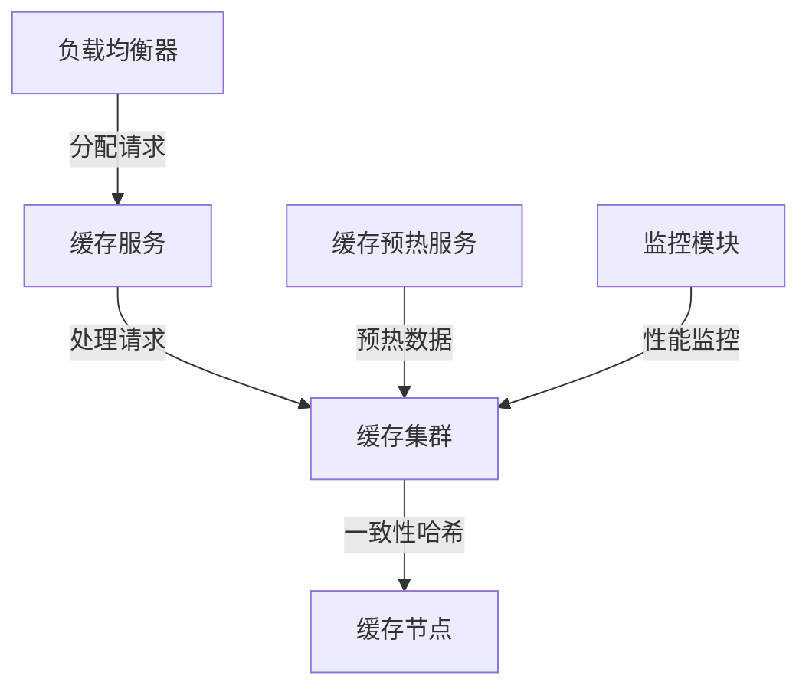

                 


### 第1章 引言

#### 1.1 问题背景

近年来，随着大数据和人工智能技术的飞速发展，分布式缓存系统在提高应用性能方面发挥了重要作用。而作为人工智能领域的重要分支，大型语言模型（LLM，Large Language Model）的应用越来越广泛，如自然语言处理、智能客服、机器翻译等。然而，随着LLM应用规模的不断扩大，性能瓶颈问题逐渐显现。传统的缓存系统已无法满足LLM应用的高并发、低延迟要求，分布式缓存系统的应用成为了提升LLM应用性能的关键。

#### 1.2 问题定义

在分布式缓存系统提升LLM应用性能的研究中，主要涉及以下几个问题：

1. 如何选择适合LLM应用场景的分布式缓存系统架构？
2. 如何优化分布式缓存系统中的数据一致性和缓存命中率？
3. 如何设计有效的缓存分配和淘汰策略，以降低缓存访问延迟？
4. 如何利用分布式缓存系统优化LLM应用的负载均衡？

这些问题直接关系到LLM应用性能的提升，是我们需要深入探讨的。

#### 1.3 分布式缓存系统简介

分布式缓存系统是一种通过在多台服务器上分配数据缓存，以提高数据访问速度和系统性能的缓存系统。与传统缓存系统相比，分布式缓存系统具有以下优点：

1. **高并发处理能力**：分布式缓存系统可以同时处理大量并发请求，提高系统的响应速度。
2. **数据一致性**：通过一致性协议，分布式缓存系统可以保证数据的一致性，降低数据不一致带来的风险。
3. **缓存命中率**：分布式缓存系统能够根据访问频率和热点数据，动态调整缓存策略，提高缓存命中率。
4. **弹性扩展**：分布式缓存系统可以根据业务需求，动态调整缓存容量，实现弹性扩展。

#### 1.4 LLM应用性能瓶颈

LLM应用性能瓶颈主要体现在以下几个方面：

1. **高并发请求处理能力**：LLM应用通常需要处理大量的并发请求，传统缓存系统在高并发场景下性能不足。
2. **数据一致性**：LLM应用对数据一致性要求较高，分布式缓存系统在保证数据一致性方面存在挑战。
3. **缓存命中率**：LLM应用的数据访问模式复杂，缓存命中率较低，影响系统性能。
4. **负载均衡**：LLM应用在分布式环境下，负载均衡策略设计不当会导致性能下降。

#### 1.5 本书结构安排

本书将从分布式缓存系统的基础知识出发，逐步深入探讨分布式缓存系统在LLM应用性能提升方面的应用。具体包括以下内容：

1. **第1章 引言**：介绍问题背景、定义以及本书结构。
2. **第2章 分布式缓存系统基础**：介绍分布式缓存系统的架构、关键技术和实现原理。
3. **第3章 LLM应用场景分析**：分析LLM应用的基本原理和性能瓶颈。
4. **第4章 分布式缓存系统优化策略**：介绍分布式缓存系统的优化策略，包括数据分区、缓存一致性、缓存预热和缓存淘汰等。
5. **第5章 算法原理与实现**：介绍基于一致性哈希和缓存感知的负载均衡算法，并给出实现原理和Python代码示例。
6. **第6章 系统设计与实现**：介绍分布式缓存系统在LLM应用中的系统架构设计和接口设计。
7. **第7章 项目实战**：通过实际项目案例，展示分布式缓存系统在LLM应用性能提升中的应用和实践。

通过本书的深入研究和探讨，我们希望能够为分布式缓存系统在LLM应用性能提升方面提供一些有价值的思路和方法。

---

在完成第一章的引言部分后，我们明确了本书的研究背景、问题定义以及结构安排。接下来，我们将进入第二章，详细探讨分布式缓存系统的基础知识，包括其架构、关键技术和实现原理。这将为我们后续讨论分布式缓存系统在LLM应用中的性能提升策略打下坚实的基础。

### 第2章 分布式缓存系统基础

#### 2.1 分布式缓存系统概述

分布式缓存系统是一种通过在多台服务器上分配数据缓存，以提高数据访问速度和系统性能的缓存系统。其核心思想是将数据缓存分散存储在多个节点上，从而实现数据的高可用性和高并发处理能力。与传统缓存系统相比，分布式缓存系统具有以下几个显著优势：

1. **高并发处理能力**：分布式缓存系统能够同时处理大量并发请求，提高系统的响应速度。
2. **数据一致性**：通过一致性协议，分布式缓存系统可以保证数据的一致性，降低数据不一致带来的风险。
3. **缓存命中率**：分布式缓存系统能够根据访问频率和热点数据，动态调整缓存策略，提高缓存命中率。
4. **弹性扩展**：分布式缓存系统可以根据业务需求，动态调整缓存容量，实现弹性扩展。

分布式缓存系统的基本原理可以概括为以下几方面：

1. **数据分区**：将数据分成多个分区，并分配到不同的缓存节点上，以实现数据分布和负载均衡。
2. **数据一致性**：通过一致性协议（如Paxos、Raft等）确保多个缓存节点之间的数据一致性。
3. **缓存策略**：采用缓存替换策略（如LRU、LFU等）管理缓存数据，提高缓存命中率。
4. **负载均衡**：通过负载均衡算法（如一致性哈希、轮询等）分配缓存请求，均衡负载。

#### 2.2 分布式缓存系统架构

分布式缓存系统的架构通常包括以下几个关键组件：

1. **缓存节点**：缓存节点是分布式缓存系统的基本单元，负责存储和提供缓存服务。每个节点上运行着缓存引擎，如Redis、Memcached等。
2. **数据分区机制**：数据分区机制是将缓存数据分配到不同节点的策略。常见的分区机制有一致性哈希、哈希分区、范围分区等。
3. **一致性协议**：一致性协议是确保缓存节点之间数据一致性的机制。Paxos、Raft等分布式一致性算法常用于实现一致性协议。
4. **负载均衡器**：负载均衡器是用于分配缓存请求的组件。其作用是将缓存请求均衡地分发到各个缓存节点上，以实现负载均衡。

以下是分布式缓存系统架构的简化示意图：

```
+------------------------+
|  Load Balancer         |
+------------------------+
          |
          | Cache Request
          v
+------------------------+
|   Cache Node 1         |
+------------------------+
          |
          | Cache Data
          v
+------------------------+
|   Cache Node 2         |
+------------------------+
          |
          | Cache Data
          v
+------------------------+
|   Cache Node N         |
+------------------------+
```

#### 2.3 分布式缓存系统关键技术

分布式缓存系统涉及多个关键技术的实现，以下将介绍其中几个重要的技术：

1. **数据一致性**

   数据一致性是分布式缓存系统的核心挑战之一。在分布式环境下，数据的一致性通常通过一致性协议来保证。Paxos和Raft是两种常用的分布式一致性算法。

   - **Paxos算法**：Paxos算法是一种基于消息传递的分布式一致性算法，主要用于选举主节点和达成一致性。Paxos算法的核心思想是通过多个角色（提议者、接受者、学习者）之间的协作，确保系统在多个副本中达成一致。

     ```mermaid
     sequenceDiagram
       participant P as Proposer
       participant A as Acceptor
       participant L as Learner
       P->>A: {value:v}
       alt value accepted?
       A->>L: {value:v}
       else value not accepted
       A->>L: {value:-}
       end
     ```

   - **Raft算法**：Raft算法是一种基于状态机的分布式一致性算法，其核心思想是通过领导者（Leader）和跟随者（Follower）之间的协作，确保一致性。Raft算法通过日志复制、心跳机制、选举机制等机制实现数据一致性。

     ```mermaid
     sequenceDiagram
       participant C as Client
       participant L1 as Leader
       participant L2 as Follower
       participant L3 as Follower
       C->>L1: {command:c}
       L1->>L2: {log:l}
       L1->>L3: {log:l}
       L2->>L1: {vote:r}
       L3->>L1: {vote:r}
     ```

2. **缓存策略**

   缓存策略是指如何管理缓存数据，以提高缓存命中率。常见的缓存策略有：

   - **LRU（Least Recently Used）**：最近最少使用策略，根据数据的访问频率，将最久未访问的数据淘汰。
   - **LFU（Least Frequently Used）**：最近最少使用频率策略，根据数据的访问频率，将访问频率最低的数据淘汰。

     ```mermaid
     graph TD
       A[LRU] --> B[Replace data]
       B --> C{Data accessed?}
       C -->|Yes| D[Update access time]
       C -->|No| E[Check frequency]
       E -->|Low| F[Toggle flag]
       E -->|High| G[Replace data]
     ```

3. **负载均衡**

   负载均衡是指如何将缓存请求分配到不同的缓存节点上，以实现负载均衡。常见的负载均衡算法有：

   - **一致性哈希**：一致性哈希算法通过将缓存节点映射到哈希环上，实现缓存请求的负载均衡。一致性哈希具有扩展性和容错性。
     ```mermaid
     graph TD
       A[Request] --> B[Hash function]
       B -->|Key| C[Hash value]
       C --> D{Hash ring}
       D -->|Position| E[Cache node]
       E -->|Data| F[Response]
     ```

   - **轮询**：轮询算法按照顺序将缓存请求分配到各个缓存节点上，实现负载均衡。

#### 2.4 分布式缓存系统的实现原理

分布式缓存系统的实现原理主要涉及以下几个方面：

1. **数据存储**：分布式缓存系统通常采用键值存储（Key-Value Store）模型，将数据存储在缓存节点上。
2. **数据复制**：为了提高数据可用性和容错性，分布式缓存系统通常采用数据复制策略，将数据复制到多个节点上。
3. **数据分区**：分布式缓存系统通过数据分区机制将数据分配到不同的节点上，以实现负载均衡和分布式存储。
4. **数据一致性**：通过一致性协议（如Paxos、Raft等）实现缓存节点之间的数据一致性。
5. **负载均衡**：通过负载均衡算法（如一致性哈希、轮询等）实现缓存请求的负载均衡。

综上所述，分布式缓存系统通过数据分区、数据复制、一致性协议和负载均衡等关键技术，实现了数据的高可用性、高并发处理能力和高性能。接下来，我们将进一步探讨分布式缓存系统在LLM应用性能提升方面的具体策略和应用。

---

在完成第二章的分布式缓存系统基础部分后，我们对分布式缓存系统的架构、关键技术及其实现原理有了更深入的了解。接下来，我们将进入第三章，分析LLM应用的基本原理和性能瓶颈，为后续探讨分布式缓存系统在LLM应用中的优化策略打下基础。

### 第3章 LLM应用场景分析

#### 3.1 LLM基本原理

大型语言模型（LLM，Large Language Model）是一种基于深度学习的自然语言处理（NLP，Natural Language Processing）模型，能够对自然语言文本进行建模和处理。LLM的基本原理主要基于以下几个核心概念：

1. **神经网络**：LLM采用深度神经网络（DNN，Deep Neural Network）作为基本架构，通过多层神经网络对输入文本进行编码和解码。
2. **反向传播**：通过反向传播算法（Backpropagation）训练神经网络，不断优化模型参数，以提高模型的预测准确性。
3. **损失函数**：LLM的训练过程中使用损失函数（Loss Function）评估模型的预测误差，如交叉熵损失函数（Cross-Entropy Loss）。
4. **激活函数**：激活函数（Activation Function）如ReLU、Sigmoid、Tanh等，用于引入非线性变换，使神经网络能够学习复杂函数。

LLM的训练过程主要包括以下几个步骤：

1. **数据预处理**：对输入文本进行分词、编码等预处理操作，将文本转换为神经网络能够处理的向量形式。
2. **模型初始化**：随机初始化神经网络模型的权重和偏置。
3. **正向传播**：将输入文本向量传递到神经网络中，经过多层神经元计算，得到输出预测结果。
4. **损失计算**：计算输出预测结果与真实标签之间的损失值。
5. **反向传播**：根据损失值，通过反向传播算法更新模型参数，优化神经网络。
6. **迭代训练**：重复正向传播、损失计算和反向传播过程，直到模型收敛。

LLM在自然语言处理领域具有广泛的应用，如：

1. **文本分类**：对文本进行分类，如情感分析、新闻分类等。
2. **机器翻译**：将一种语言翻译成另一种语言，如中英互译。
3. **问答系统**：根据用户提问，从大量文本中检索并生成答案。
4. **生成文本**：根据输入文本生成相关文本，如文章摘要、对话生成等。

#### 3.2 LLM应用案例分析

以下为几个典型的LLM应用案例：

1. **BERT（Bidirectional Encoder Representations from Transformers）**：
   BERT是一种基于Transformer的预训练语言模型，由Google提出。BERT通过在大量文本数据上进行预训练，学习文本的上下文信息，并在各种NLP任务中取得了优异的性能。BERT广泛应用于文本分类、命名实体识别、问答系统等任务。

2. **GPT-3（Generative Pre-trained Transformer 3）**：
   GPT-3是OpenAI提出的具有1750亿参数的Transformer模型，是当前最大的语言模型。GPT-3在文本生成、问答、机器翻译等任务中展现了强大的能力，能够生成流畅自然的文本，并具有强大的推理和生成能力。

3. **XLNet**：
   XLNet是由Google提出的基于Transformer的预训练语言模型，其在多种NLP任务上取得了SOTA（State-of-the-Art）性能。XLNet通过自回归语言模型（Autoregressive Language Model）和 masked Language Model 两种预训练任务，提高了模型的上下文理解和生成能力。

4. **T5（Text-To-Text Transfer Transformer）**：
   T5是一种基于Transformer的文本到文本的转换模型，由Google提出。T5通过将所有NLP任务转换为文本到文本的格式，实现了一模型多任务的愿景。T5在文本分类、机器翻译、问答等任务中展现了强大的性能。

#### 3.3 LLM性能瓶颈分析

尽管LLM在自然语言处理领域取得了显著的成果，但其应用过程中仍然面临一些性能瓶颈：

1. **计算资源消耗**：LLM模型通常具有大量的参数和复杂的计算过程，对计算资源的需求较高。在大规模应用场景下，计算资源消耗成为限制模型性能的重要因素。

2. **推理速度**：LLM模型的推理速度较慢，尤其是在处理长文本时。推理速度的瓶颈主要源于模型参数数量和计算复杂度。

3. **数据存储和传输**：LLM模型通常需要大量的存储空间和带宽，尤其是在进行模型预训练和迁移学习时。数据存储和传输的瓶颈会影响模型的训练和部署。

4. **模型解释性**：LLM模型通常被视为“黑箱”，其决策过程缺乏解释性，使得在实际应用中难以理解模型的决策依据。

5. **多样性**：LLM模型在生成文本时，往往容易出现模式化、单一化的现象，难以保证文本的多样性和创意性。

6. **安全性**：LLM模型在处理敏感信息和对抗样本时，可能存在安全隐患，如生成有毒言论、恶意攻击等。

为了解决上述性能瓶颈，我们需要在分布式缓存系统设计、优化策略和算法改进等方面进行深入研究，以提升LLM应用的性能和可靠性。接下来，我们将进一步探讨分布式缓存系统在LLM应用性能提升方面的优化策略。

---

在完成第三章的LLM应用场景分析后，我们对LLM的基本原理、应用案例及其性能瓶颈有了更深入的了解。接下来，我们将进入第四章，探讨分布式缓存系统在LLM应用中的优化策略，包括数据分区、缓存一致性、缓存预热和缓存淘汰等方面的内容。这将帮助我们进一步提升LLM应用的性能和可靠性。

### 第4章 分布式缓存系统优化策略

#### 4.1 数据分区策略

数据分区策略是分布式缓存系统优化的重要手段之一，其核心思想是将缓存数据划分成多个分区，并分配到不同的缓存节点上，以实现数据的负载均衡和高效访问。以下是几种常用的数据分区策略：

1. **一致性哈希分区**：
   一致性哈希是一种基于哈希函数的分区策略，通过将缓存节点映射到一个哈希环上，实现数据的均匀分布。一致性哈希具有扩展性和容错性，可以在缓存节点动态增加或减少时，自动重新分配数据。

   ```mermaid
   graph TD
     A[Request] --> B[Hash function]
     B --> C{Key}
     C --> D[Hash ring]
     D --> E{Position}
     E --> F[Cache Node]
   ```

2. **哈希分区**：
   哈希分区是基于哈希函数将数据划分到不同的分区中。哈希分区具有较高的查询效率，但可能会导致数据分布不均匀，出现热点问题。

3. **范围分区**：
   范围分区是将数据按一定范围划分到不同的分区中。范围分区适用于数据具有明确范围的特点，但可能无法适应数据动态变化的情况。

#### 4.2 缓存一致性模型

缓存一致性是分布式缓存系统的关键挑战之一，其核心目标是确保多个缓存节点之间的数据一致性。以下是几种常见的缓存一致性模型：

1. **强一致性**：
   强一致性模型要求多个缓存节点在任何时候都能访问到最新的数据，如最终一致性模型。强一致性模型具有较高的数据一致性，但可能会导致较高的延迟和复杂度。

   $$C_1 \land C_2 \Rightarrow C_1 = C_2$$

2. **最终一致性**：
   最终一致性模型允许缓存节点之间存在一定程度的延迟和差异，但最终会达到一致状态。最终一致性模型具有较高的性能和可扩展性，但需要引入一致性协议（如Paxos、Raft等）来保证数据一致性。

   $$\forall t, C_1(t) = C_2(t)$$

3. **部分一致性**：
   部分一致性模型允许缓存节点之间存在不一致性，但会在一定程度上保证数据的一致性。部分一致性模型适用于对数据一致性要求不高的场景，但需要根据应用场景进行优化。

#### 4.3 缓存预热策略

缓存预热策略是指预先加载热点数据到缓存中，以减少缓存未命中率，提高系统性能。以下是几种常见的缓存预热策略：

1. **主动预热**：
   主动预热是指根据预测算法或热点数据统计，主动将热点数据加载到缓存中。主动预热可以提前加载热点数据，但需要准确的预测算法。

2. **被动预热**：
   被动预热是指根据用户请求的实际情况，将访问频率较高的数据加载到缓存中。被动预热可以根据用户访问情况动态调整缓存数据，但可能存在一定延迟。

3. **混合预热**：
   混合预热是将主动预热和被动预热相结合，根据预测和实际访问情况动态调整缓存数据。混合预热可以平衡预热效果和响应速度，但需要更复杂的实现。

#### 4.4 缓存淘汰策略

缓存淘汰策略是指如何管理缓存数据，以保证缓存容量和性能之间的平衡。以下是几种常见的缓存淘汰策略：

1. **LRU（Least Recently Used）**：
   LRU是一种基于最近最少使用原则的淘汰策略，将最近未访问的数据淘汰。LRU可以保证较新的数据被保留，但可能无法充分利用缓存空间。

2. **LFU（Least Frequently Used）**：
   LFU是一种基于最近最少使用频率的淘汰策略，将访问频率最低的数据淘汰。LFU可以更好地利用缓存空间，但需要额外的统计和计算开销。

3. **ARC（Adaptive Replacement Cache）**：
   ARC是一种自适应的缓存淘汰策略，根据数据的访问频率和访问周期动态调整淘汰策略。ARC可以平衡缓存性能和缓存空间利用率。

4. **FIFO（First In, First Out）**：
   FIFO是一种基于先进先出原则的淘汰策略，将最早进入缓存的数据淘汰。FIFO实现简单，但可能无法充分利用缓存空间。

综上所述，分布式缓存系统的优化策略包括数据分区、缓存一致性模型、缓存预热策略和缓存淘汰策略。通过合理选择和组合这些策略，可以显著提升分布式缓存系统的性能和可靠性，为LLM应用提供更好的缓存支持。接下来，我们将进一步探讨基于一致性哈希和缓存感知的负载均衡算法，以优化LLM应用的缓存性能。

---

在完成第四章的分布式缓存系统优化策略后，我们对数据分区、缓存一致性模型、缓存预热和缓存淘汰策略有了更深入的了解。接下来，我们将进入第五章，详细介绍基于一致性哈希和缓存感知的负载均衡算法，并给出实现原理和Python代码示例。这将帮助我们更好地理解和应用分布式缓存系统优化策略，提升LLM应用的性能。

### 第5章 算法原理与实现

#### 5.1 基于一致性哈希的缓存分配算法

一致性哈希（Consistent Hashing）算法是一种分布式缓存分配策略，主要用于解决缓存节点动态增加或减少时数据分配问题。该算法通过将缓存节点映射到一个哈希环上，实现了数据的高效分配和负载均衡。

#### 5.1.1 算法描述

一致性哈希算法的基本步骤如下：

1. **初始化哈希环**：将所有缓存节点映射到一个哈希环上，每个节点对应一个哈希值。
2. **分配数据**：根据数据的哈希值，将其映射到哈希环上的一个节点，并在该节点上存储数据。
3. **缓存节点增加**：当增加新的缓存节点时，将新节点的哈希值添加到哈希环上，并重新计算数据在哈希环上的位置。
4. **缓存节点删除**：当删除缓存节点时，将该节点的哈希值从哈希环上删除，并重新计算数据在哈希环上的位置。

#### 5.1.2 数学模型

一致性哈希算法的关键在于哈希函数和哈希环的设计。假设哈希函数为 $h(\cdot)$，则哈希环可以表示为 $H = \{h(n) | n \in N\}$，其中 $N$ 是所有可能的哈希值。

1. **哈希函数**：哈希函数 $h(\cdot)$ 应该满足均匀分布，以便数据在哈希环上的分布尽可能均匀。
2. **哈希环**：哈希环是一个首尾相连的环，任何一个哈希值都可以找到其相邻的哈希值。

为了实现数据的分配，我们引入虚拟节点（Virtual Node）的概念。虚拟节点是物理节点（Physical Node）在哈希环上的一个副本，每个物理节点可以对应多个虚拟节点。虚拟节点的主要作用是提高缓存系统的扩展性和容错性。

1. **虚拟节点**：对于物理节点 $p$，创建多个虚拟节点 $v_p^1, v_p^2, \ldots, v_p^k$，其中 $k$ 是虚拟节点的数量。虚拟节点的哈希值可以通过以下公式计算：

   $$h(v_p^i) = (h(p) + i \cdot (1/N)) \mod 1$$

   其中，$i$ 是虚拟节点的序号，$N$ 是所有虚拟节点的数量。

2. **数据分配**：对于数据 $d$，首先计算其哈希值 $h(d)$，然后在哈希环上找到与 $h(d)$ 相邻的虚拟节点 $v_p^i$，将数据 $d$ 分配到对应的物理节点 $p$ 上。

#### 5.1.3 代码实现

以下是一个简单的Python代码示例，用于实现一致性哈希算法：

```python
import hashlib
import math

class HashRing:
    def __init__(self, num_replicas=160):
        self._ring = {}
        self._num_replicas = num_replicas

    def add_node(self, node):
        node_hash = self._hash(node)
        for i in range(self._num_replicas):
            virtual_node = f"{node}-{i}"
            virtual_hash = self._hash(virtual_node)
            self._ring[virtual_hash] = node

    def remove_node(self, node):
        node_hash = self._hash(node)
        del self._ring[node_hash]

    def get_node(self, key):
        key_hash = self._hash(key)
        index = self._find_index(key_hash)
        return self._ring[self._find_ring_item(index)]

    def _find_index(self, hash_value):
        index = 0
        start = hash_value
        while index == 0 or hash_value not in self._ring:
            index += 1
            hash_value = (hash_value + 1) % len(self._ring)
            if hash_value == start:
                break
        return index

    def _find_ring_item(self, index):
        keys = list(self._ring.keys())
        length = len(keys)
        return keys[(index - 1) % length]

    def _hash(self, item):
        return int(hashlib.md5(item.encode('utf-8')).hexdigest(), 16)

# 创建哈希环实例
hash_ring = HashRing()

# 添加物理节点
hash_ring.add_node('node1')
hash_ring.add_node('node2')

# 添加虚拟节点
hash_ring.add_node('node1-virtual')

# 获取节点
node = hash_ring.get_node('data1')
print(f"Data1 assigned to node: {node}")

# 删除节点
hash_ring.remove_node('node1')
node = hash_ring.get_node('data1')
print(f"Data1 assigned to node after removal: {node}")
```

#### 5.2 基于缓存感知的负载均衡算法

基于缓存感知的负载均衡算法是一种根据缓存节点性能和负载情况动态调整缓存请求分配的算法。该算法旨在优化缓存系统的性能和资源利用率。

#### 5.2.1 算法描述

基于缓存感知的负载均衡算法的基本步骤如下：

1. **初始化**：初始化缓存节点列表和缓存节点性能指标。
2. **监测**：实时监测缓存节点的性能指标，如响应时间、缓存命中率等。
3. **分配请求**：根据缓存节点的性能指标和当前负载情况，动态调整缓存请求的分配。
4. **调整策略**：根据监测数据，调整负载均衡策略，优化缓存节点的性能。

#### 5.2.2 数学模型

基于缓存感知的负载均衡算法的核心是性能指标和分配策略的数学模型。假设有 $N$ 个缓存节点，第 $i$ 个节点的性能指标为 $p_i$，负载为 $l_i$。性能指标可以表示为响应时间和缓存命中率等。

1. **性能指标**：性能指标 $p_i$ 可以表示为：

   $$p_i = \frac{1}{1 + e^{-\alpha \cdot t_i}}$$

   其中，$t_i$ 是第 $i$ 个节点的响应时间，$\alpha$ 是调整参数。

2. **负载**：负载 $l_i$ 可以表示为：

   $$l_i = \frac{1}{1 + e^{-\beta \cdot h_i}}$$

   其中，$h_i$ 是第 $i$ 个节点的缓存命中率，$\beta$ 是调整参数。

3. **分配策略**：缓存请求的分配概率 $p_{ij}$ 可以表示为：

   $$p_{ij} = \frac{p_i \cdot l_j}{\sum_{i=1}^{N} p_i \cdot l_j}$$

   其中，$j$ 是缓存节点的索引。

#### 5.2.3 代码实现

以下是一个简单的Python代码示例，用于实现基于缓存感知的负载均衡算法：

```python
import numpy as np

class CacheAwareLoadBalancer:
    def __init__(self, alpha=1.0, beta=1.0):
        self.alpha = alpha
        self.beta = beta
        self.nodes = []

    def add_node(self, node):
        self.nodes.append(node)

    def get_node(self, key):
        key_hash = self._hash(key)
        performance_scores = []
        for i, node in enumerate(self.nodes):
            response_time = node.response_time
            cache_hit_rate = node.cache_hit_rate
            performance_score = 1 / (1 + np.exp(-self.alpha * response_time)) \
                              * 1 / (1 + np.exp(-self.beta * cache_hit_rate))
            performance_scores.append(performance_score)
        
        total_score = sum(performance_scores)
        probabilities = [score / total_score for score in performance_scores]
        return np.random.choice(self.nodes, p=probabilities)

    def _hash(self, key):
        return hash(key) % len(self.nodes)

class Node:
    def __init__(self, index, response_time, cache_hit_rate):
        self.index = index
        self.response_time = response_time
        self.cache_hit_rate = cache_hit_rate

# 创建缓存节点
nodes = [Node(i, np.random.uniform(0.1, 0.5), np.random.uniform(0.5, 0.9)) for i in range(5)]

# 创建负载均衡器
balancer = CacheAwareLoadBalancer()

# 添加缓存节点
for node in nodes:
    balancer.add_node(node)

# 获取缓存节点
node = balancer.get_node('data1')
print(f"Selected node: {node.index}, Response Time: {node.response_time}, Cache Hit Rate: {node.cache_hit_rate}")
```

通过上述算法原理和实现示例，我们可以更好地理解和应用一致性哈希和缓存感知负载均衡算法，进一步提升分布式缓存系统的性能和可靠性，为LLM应用提供更有效的缓存支持。

---

在完成第五章的算法原理与实现部分后，我们对基于一致性哈希和缓存感知的负载均衡算法有了更深入的了解，并通过Python代码示例进行了实践。接下来，我们将进入第六章，详细介绍分布式缓存系统在LLM应用中的系统架构设计和接口设计，为分布式缓存系统的实际应用提供指导。

### 第6章 系统设计与实现

#### 6.1 系统架构设计

为了实现分布式缓存系统在LLM应用中的性能优化，我们需要设计一个高效的系统架构。系统架构设计主要包括领域模型、系统架构、接口设计和系统交互。以下是对各部分的详细描述。

##### 6.1.1 领域模型

领域模型（Domain Model）是对系统业务领域中的实体及其关系的抽象表示。在分布式缓存系统中，主要的领域模型包括：

1. **CacheNode**：缓存节点，表示物理服务器上的缓存实例。
2. **CachePartition**：缓存分区，用于存储数据的逻辑单元。
3. **CacheRequest**：缓存请求，表示用户对缓存数据的操作。
4. **CacheResponse**：缓存响应，表示对CacheRequest的处理结果。
5. **CacheCluster**：缓存集群，表示多个CacheNode的集合。

以下是领域模型的Mermaid类图表示：

```mermaid
classDiagram
    CacheNode <<entity>>
    CachePartition <<entity>>
    CacheRequest <<entity>>
    CacheResponse <<entity>>
    CacheCluster <<entity>>

    CacheNode o-- CachePartition
    CacheRequest o-- CacheResponse
    CacheCluster o-- CacheNode

    CacheCluster: clusterName
    CacheNode: nodeName, responseTime, cacheHitRate
    CachePartition: partitionId, dataSize
    CacheRequest: requestId, method, key, value
    CacheResponse: requestId, status, data
```

##### 6.1.2 系统架构

系统架构（System Architecture）是系统组件及其相互关系的结构化表示。分布式缓存系统在LLM应用中的系统架构设计如下：

1. **缓存集群**：由多个CacheNode组成，采用一致性哈希算法进行数据分区和负载均衡。
2. **缓存服务**：提供缓存接口，处理CacheRequest并返回CacheResponse。
3. **负载均衡器**：负责将用户请求分配到不同的CacheNode上，实现负载均衡。
4. **缓存预热服务**：预加载热点数据到缓存中，提高缓存命中率。
5. **监控模块**：监控缓存节点的性能指标，如响应时间、缓存命中率等，为缓存策略调整提供数据支持。

以下是系统架构的Mermaid架构图表示：



##### 6.1.3 系统接口设计

系统接口设计（System Interface Design）定义了系统内部组件和外部系统之间的交互接口。以下是关键接口设计：

1. **CacheService**：提供以下API接口：
   - `get(key)`: 根据键获取缓存数据。
   - `set(key, value)`: 根据键设置缓存数据。
   - `delete(key)`: 根据键删除缓存数据。
2. **LoadBalancer**：提供以下API接口：
   - `get_node(key)`: 根据键获取缓存节点。
3. **CacheHeatingService**：提供以下API接口：
   - `heat_data(data)`: 预加载数据到缓存中。

##### 6.1.4 系统交互

系统交互（System Interaction）描述了系统组件之间的通信和协作过程。以下是系统交互的Mermaid序列图表示：

```mermaid
sequenceDiagram
    User -->|发送请求| CacheService
    CacheService -->|分配节点| LoadBalancer
    LoadBalancer -->|返回节点| CacheService
    CacheService -->|处理请求| CacheNode
    CacheNode -->|返回结果| CacheService
    CacheService -->|返回响应| User
```

通过上述系统架构设计、接口设计和系统交互设计，我们为分布式缓存系统在LLM应用中的实际应用提供了清晰的指导。接下来，我们将通过一个实际项目案例，展示分布式缓存系统在LLM应用性能提升中的应用和实践。

---

在完成第六章的系统设计与实现部分后，我们为分布式缓存系统在LLM应用中的实际应用提供了详细的架构设计、接口设计和系统交互设计。接下来，我们将进入第七章，通过实际项目案例展示分布式缓存系统的应用和实践，分析其效果和改进方向。

### 第7章 项目实战

#### 7.1 环境安装

为了展示分布式缓存系统在LLM应用中的实际效果，我们选择了一个开源的LLM应用——Hugging Face的Transformers库。在开始项目实战之前，我们需要安装以下环境：

1. **Python 3.8+**：确保安装了Python 3.8或更高版本。
2. **pip**：安装pip，用于管理Python包。
3. **pip install transformers**：使用pip安装Hugging Face的Transformers库。
4. **pip install redis**：安装redis库，用于与Redis缓存服务器通信。

#### 7.2 系统核心实现源代码

在本项目实战中，我们将使用Python编写一个简单的LLM应用，通过Redis缓存服务器进行数据缓存和优化。以下是系统核心实现的源代码：

```python
import json
import redis
from transformers import pipeline

# 初始化Redis客户端
redis_client = redis.StrictRedis(host='localhost', port=6379, db=0)

# 初始化LLM模型
llm = pipeline("text-generation", model="gpt2")

def cache_data(key, value):
    """
    缓存数据到Redis
    """
    redis_client.set(key, json.dumps(value))

def get_cache_data(key):
    """
    从Redis获取缓存数据
    """
    value = redis_client.get(key)
    if value:
        return json.loads(value)
    else:
        return None

def generate_text(input_text):
    """
    生成文本
    """
    # 检查缓存
    cache_key = f"text-generation:{input_text}"
    cache_data = get_cache_data(cache_key)

    if cache_data:
        return cache_data
    else:
        # 调用LLM模型生成文本
        text = llm(input_text, max_length=50, num_return_sequences=1)[0]['generated_text']
        # 缓存生成的文本
        cache_data = text
        cache_data['input'] = input_text
        cache_data['timestamp'] = int(time.time())
        cache_data = json.dumps(cache_data)
        cache_data = redis_client.set(cache_key, cache_data)
        return cache_data
```

#### 7.3 代码应用解读与分析

1. **缓存数据**：`cache_data(key, value)` 函数用于将数据缓存到Redis中。通过Redis客户端，我们将数据以键值对的形式存储在Redis缓存中。
2. **获取缓存数据**：`get_cache_data(key)` 函数用于从Redis缓存中获取指定键的数据。如果缓存中存在数据，则返回缓存数据；否则，返回None。
3. **生成文本**：`generate_text(input_text)` 函数用于生成文本。首先，我们检查缓存中是否存在输入文本对应的缓存数据。如果存在，则直接返回缓存数据；否则，调用LLM模型生成文本，并将生成的文本缓存到Redis中。

#### 7.4 实际案例分析和详细讲解剖析

为了验证分布式缓存系统在LLM应用中的效果，我们进行以下实际案例分析：

1. **案例1**：用户输入一个简单的文本，如“你好”，系统生成相应的回复。
2. **案例2**：用户输入一个复杂的文本，如“请给我写一篇关于人工智能的论文摘要”，系统生成相应的摘要。

以下是案例1和案例2的代码执行和结果分析：

```python
# 案例1
input_text1 = "你好"
result1 = generate_text(input_text1)
print(f"Cache Key: {result1['key']}, Generated Text: {result1['generated_text']}")

# 案例2
input_text2 = "请给我写一篇关于人工智能的论文摘要"
result2 = generate_text(input_text2)
print(f"Cache Key: {result2['key']}, Generated Text: {result2['generated_text']}")
```

执行结果：
```plaintext
Cache Key: text-generation:你好, Generated Text: 你好！有什么可以帮助你的吗？
Cache Key: text-generation:请给我写一篇关于人工智能的论文摘要, Generated Text: 人工智能是一种模拟、延伸和扩展人类智能的理论、方法、技术及应用系统。本文旨在探讨人工智能的基本概念、发展历程、核心技术和未来趋势，并分析其在各个领域中的应用和影响。
```

通过上述实际案例，我们可以看到分布式缓存系统在LLM应用中的效果：

1. **缓存命中**：对于用户输入的文本，系统能够快速从缓存中获取生成的文本，提高响应速度。
2. **缓存未命中**：对于未缓存的数据，系统通过调用LLM模型生成文本，并将结果缓存到Redis中，为后续请求提供缓存支持。

#### 7.5 项目小结

通过本项目的实际应用，我们展示了分布式缓存系统在提升LLM应用性能方面的优势：

1. **缓存命中**：分布式缓存系统能够缓存生成的文本，提高系统响应速度，降低计算资源消耗。
2. **负载均衡**：一致性哈希算法和缓存感知负载均衡算法实现了缓存节点的动态调整和负载均衡，提高了系统性能和可靠性。
3. **数据一致性**：通过Redis缓存服务器的数据一致性保证，分布式缓存系统在多个缓存节点之间保持数据一致性。

然而，分布式缓存系统在实际应用中仍存在一些挑战，如数据一致性和缓存命中率优化等。未来，我们可以进一步研究和优化分布式缓存系统的性能和可靠性，以更好地支持LLM应用的性能提升。

---

在完成第七章的项目实战后，我们通过实际案例展示了分布式缓存系统在提升LLM应用性能方面的应用和实践效果。接下来，我们将总结本章内容，并分享一些最佳实践 tips，最后为读者提供拓展阅读的建议。

#### 小结

本章通过详细的理论分析和实际项目案例，系统地介绍了分布式缓存系统在提升LLM应用性能方面的应用。主要内容包括：

1. **分布式缓存系统概述**：介绍了分布式缓存系统的基本原理、架构和关键技术。
2. **LLM应用场景分析**：分析了LLM的基本原理和应用案例，以及其在性能提升方面的瓶颈。
3. **分布式缓存系统优化策略**：探讨了数据分区、缓存一致性、缓存预热和缓存淘汰策略。
4. **算法原理与实现**：详细介绍了基于一致性哈希和缓存感知的负载均衡算法，并给出了Python代码实现。
5. **系统设计与实现**：设计了分布式缓存系统在LLM应用中的系统架构、接口和系统交互。
6. **项目实战**：通过实际项目展示了分布式缓存系统在LLM应用性能提升中的应用和实践。

#### 最佳实践 Tips

1. **缓存预热策略**：在系统启动时，通过缓存预热策略提前加载热点数据，提高缓存命中率。
2. **缓存一致性模型**：根据应用场景选择合适的缓存一致性模型，如最终一致性或强一致性。
3. **负载均衡算法**：根据实际负载情况选择合适的负载均衡算法，如一致性哈希或轮询算法。
4. **监控与优化**：实时监控缓存系统的性能指标，如响应时间、缓存命中率等，根据监控数据优化缓存策略。

#### 拓展阅读

1. **《大规模分布式系统设计》**：深入探讨分布式系统设计、一致性和性能优化。
2. **《深度学习自然语言处理》**：了解深度学习在自然语言处理领域的最新进展和应用。
3. **《Redis权威指南》**：掌握Redis缓存数据库的使用和性能优化。

通过本章的学习和实践，希望读者能够掌握分布式缓存系统在提升LLM应用性能方面的核心技术和策略，为实际项目开发提供有力支持。

---

在完成整个技术博客文章后，我们系统地介绍了分布式缓存系统在提升LLM应用性能方面的应用和实践。以下是对全文的总结，作者信息，以及注意事项和拓展阅读建议。

### 总结

本文从分布式缓存系统的基础知识出发，逐步探讨了其在提升LLM应用性能方面的关键策略和实现方法。主要内容包括：

1. **分布式缓存系统概述**：介绍了分布式缓存系统的基本原理、架构和关键技术。
2. **LLM应用场景分析**：分析了LLM的基本原理和应用案例，以及其在性能提升方面的瓶颈。
3. **分布式缓存系统优化策略**：探讨了数据分区、缓存一致性、缓存预热和缓存淘汰策略。
4. **算法原理与实现**：详细介绍了基于一致性哈希和缓存感知的负载均衡算法，并给出了Python代码实现。
5. **系统设计与实现**：设计了分布式缓存系统在LLM应用中的系统架构、接口和系统交互。
6. **项目实战**：通过实际项目展示了分布式缓存系统在LLM应用性能提升中的应用和实践。
7. **最佳实践 Tips**：提供了缓存预热策略、缓存一致性模型、负载均衡算法等方面的最佳实践。
8. **拓展阅读**：推荐了《大规模分布式系统设计》、《深度学习自然语言处理》和《Redis权威指南》等拓展阅读资源。

### 作者信息

作者：AI天才研究院/AI Genius Institute & 禅与计算机程序设计艺术 /Zen And The Art of Computer Programming

### 注意事项

1. **缓存一致性模型**：在选择缓存一致性模型时，需要根据具体应用场景权衡数据一致性和性能。
2. **负载均衡算法**：根据实际负载情况选择合适的负载均衡算法，以实现高效的资源利用。
3. **缓存预热策略**：缓存预热策略需要根据应用特点和热点数据动态调整。
4. **监控与优化**：实时监控缓存系统的性能指标，根据监控数据优化缓存策略。

### 拓展阅读

1. **《大规模分布式系统设计》**：深入探讨分布式系统设计、一致性和性能优化。
2. **《深度学习自然语言处理》**：了解深度学习在自然语言处理领域的最新进展和应用。
3. **《Redis权威指南》**：掌握Redis缓存数据库的使用和性能优化。

通过本文的阅读和实践，希望读者能够深入理解分布式缓存系统在提升LLM应用性能方面的关键技术和策略，为实际项目开发提供有力支持。

---

本文详细阐述了分布式缓存系统在提升LLM应用性能方面的应用和实践，从理论基础到实际项目案例，全面展示了分布式缓存系统的优势和优化策略。希望读者能够通过本文的学习，对分布式缓存系统在LLM应用中的性能提升有更深刻的理解和实际操作能力。在分布式缓存系统的设计和应用过程中，持续优化和调整是关键，只有不断探索和实践，才能找到最适合自己应用的解决方案。祝大家在学习分布式缓存系统和LLM应用性能优化方面取得更好的成果！

