                 

### 分布式缓存：提升LLM应用的数据访问速度

关键词：分布式缓存，LLM应用，数据访问速度，系统性能优化

摘要：本文将探讨分布式缓存技术在提升大规模语言模型（LLM）应用的数据访问速度方面的作用。通过对分布式缓存的基本概念、系统设计、应用场景以及具体实现策略的深入分析，帮助读者理解如何在现代计算环境中利用分布式缓存技术来优化LLM应用的性能。

## 第1章：分布式缓存概述

### 1.1.1 分布式缓存的基本概念

#### 1.1.1.1 什么是分布式缓存

分布式缓存是缓存的一种形式，它通过将数据分布存储在多个节点上，从而实现数据的高可用性和高性能访问。分布式缓存与传统的集中式缓存相比，具有更高的扩展性和容错能力。

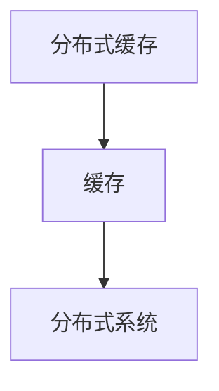

分布式缓存是缓存的一种形式，它通过将数据分布存储在多个节点上，从而实现数据的高可用性和高性能访问。

#### 1.1.1.2 分布式缓存的优势

分布式缓存具有多个显著优势：

- **高性能**：通过将数据分布存储在多个节点上，分布式缓存可以提供更快的访问速度。
- **高可用性**：分布式缓存系统中的多个节点可以相互备份，确保系统的高可用性。
- **数据一致性**：分布式缓存通过一致性协议来保证数据的一致性。
- **数据分区和扩展性**：分布式缓存可以支持数据的分区和扩展，以适应不断增长的数据规模。

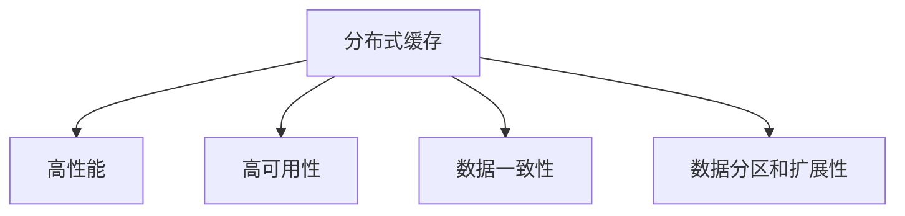

### 1.1.2 缓存系统的工作原理

#### 1.1.2.1 缓存命中与缓存失效

当请求到达缓存时，系统会先查询缓存。如果缓存中存在该数据，则直接返回，称为缓存命中。如果缓存中不存在该数据，则查询后端存储，并将数据缓存起来以供下次使用。

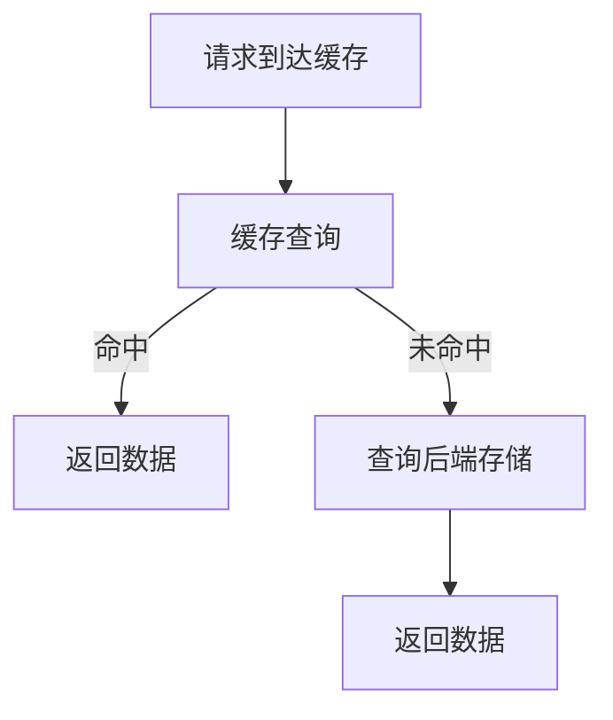

#### 1.1.2.2 缓存替换策略

当缓存达到容量上限时，需要选择一种替换策略来替换旧的数据。常见的缓存替换策略包括最近最少使用（LRU）、先进先出（FIFO）和最少访问（LFU）等。

```mermaid
graph TB
    A[缓存满] --> B[缓存替换策略]
    B --> C[最近最少使用(LRU)]
    B --> D[先进先出(FIFO)]
    B --> E[最少访问(LFU)]
```

### 1.1.3 分布式缓存的核心组件

#### 1.1.3.1 数据存储

分布式缓存通常使用内存存储来提供更快的访问速度，同时也可以使用硬盘存储来持久化数据。

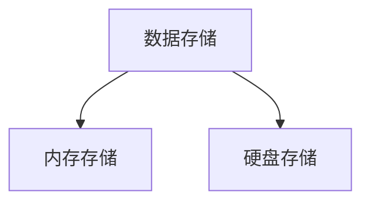

#### 1.1.3.2 缓存节点

分布式缓存系统由多个节点组成，其中主节点负责管理缓存数据，而从节点负责存储缓存数据并提供查询服务。

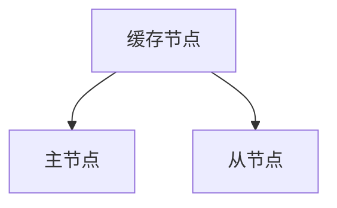

#### 1.1.3.3 数据复制与分区

为了提高系统的可用性和性能，分布式缓存通常会采用数据复制和分区策略。数据复制可以保证数据的高可用性，而数据分区可以优化数据的访问性能。

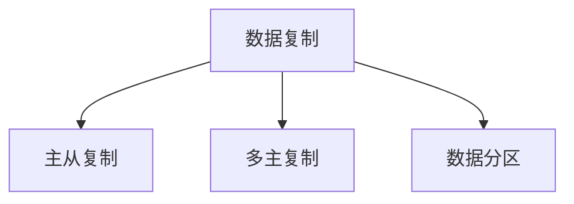

### 1.1.4 分布式缓存的应用场景

#### 1.1.4.1 Web应用

在Web应用中，分布式缓存可以用于高速缓存、用户会话缓存和静态内容缓存，以提高网站的响应速度和用户体验。

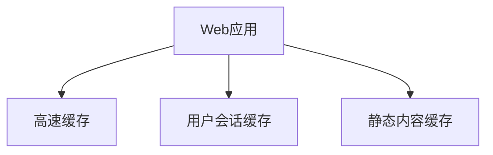

#### 1.1.4.2 数据库缓存

分布式缓存还可以用于数据库缓存，以提高数据库查询的性能，例如查询缓存、索引缓存和数据缓存。

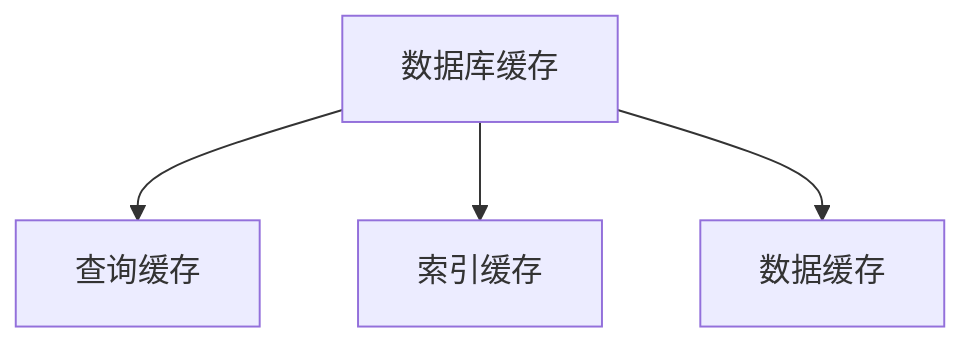

### 1.1.5 本章小结

本章节介绍了分布式缓存的基本概念、工作原理、核心组件和应用场景，为后续章节的深入学习奠定了基础。

----------------------------------------------------------------

## 第2章：分布式缓存系统设计

### 2.1.1 系统需求分析

#### 2.1.1.1 系统功能需求

- 高速缓存：提供快速的数据访问能力。
- 数据持久化：将缓存数据持久化到硬盘存储中。
- 数据分区与复制：支持数据的分区和复制，以提高系统性能和可用性。
- 缓存替换策略：根据实际需求，选择合适的缓存替换策略。

#### 2.1.1.2 系统性能需求

- 响应时间：确保数据访问的响应时间在合理范围内。
- 扩展性：支持系统的水平扩展，以适应数据量的增长。
- 可靠性：确保数据的一致性和系统的稳定性。

#### 2.1.1.3 系统可靠性需求

- 数据一致性与完整性：确保缓存中的数据与后端存储中的数据一致。
- 容错能力：在节点故障时，系统能够自动切换到其他节点，保证服务的持续运行。

### 2.1.2 系统架构设计

#### 2.1.2.1 系统总体架构

分布式缓存系统的总体架构包括缓存节点、数据存储、缓存管理和监控模块。

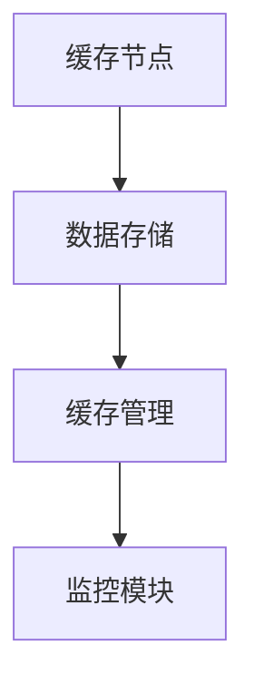

#### 2.1.2.2 数据存储架构

数据存储架构包括内存存储和硬盘存储两部分。内存存储用于提供快速的数据访问，硬盘存储用于数据的持久化和备份。

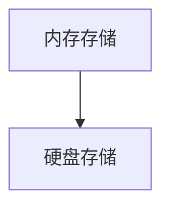

#### 2.1.2.3 缓存节点架构

缓存节点架构包括主节点和从节点。主节点负责缓存数据的管理和分配，从节点负责缓存数据的存储和查询。

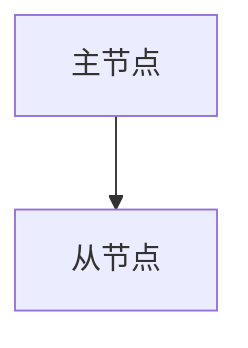

### 2.1.3 数据复制与分区策略

#### 2.1.3.1 数据复制策略

数据复制策略包括主从复制和多主复制。主从复制确保数据的一致性和可靠性，多主复制提高数据的访问性能。

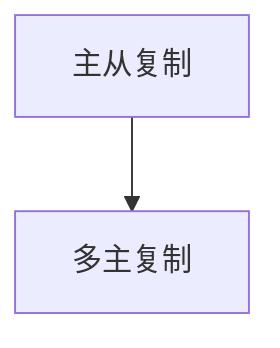

#### 2.1.3.2 数据分区策略

数据分区策略根据数据的特点和访问模式，将数据分布存储在不同的节点上，以提高数据的访问性能。

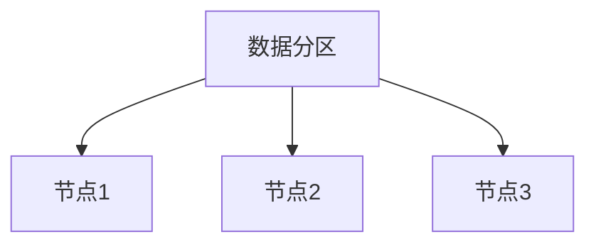

----------------------------------------------------------------

## 第3章：分布式缓存系统实现

### 3.1.1 系统环境准备

在开始实现分布式缓存系统之前，需要准备好以下环境：

- 操作系统：Linux或Windows
- 开发工具：IDE（如Eclipse、Visual Studio Code）
- 编程语言：Python、Java等
- 数据库：MySQL、PostgreSQL等

### 3.1.2 系统核心实现

以下是分布式缓存系统的核心实现，主要包括缓存节点、数据存储和缓存管理。

```python
# 缓存节点实现
class CacheNode:
    def __init__(self, node_id, data_store):
        self.node_id = node_id
        self.data_store = data_store

    def get_data(self, key):
        return self.data_store.get(key)

    def set_data(self, key, value):
        self.data_store.set(key, value)

# 数据存储实现
class DataStore:
    def __init__(self, storage_type='memory'):
        self.storage_type = storage_type
        if storage_type == 'memory':
            self.data = {}
        elif storage_type == 'disk':
            # 初始化硬盘存储
            pass

    def get(self, key):
        return self.data.get(key)

    def set(self, key, value):
        self.data[key] = value
```

### 3.1.3 缓存管理实现

缓存管理主要负责缓存节点的分配、数据的一致性和性能监控。

```python
class CacheManager:
    def __init__(self, nodes):
        self.nodes = nodes

    def get_cache_node(self, key):
        # 根据数据的特点和访问模式，选择合适的缓存节点
        pass

    def ensure_data_consistency(self):
        # 保证数据的一致性
        pass

    def monitor_performance(self):
        # 监控缓存系统的性能
        pass
```

### 3.1.4 实际案例分析与优化

在实现分布式缓存系统时，需要考虑以下实际案例和优化策略：

- **热点数据优化**：针对频繁访问的数据，可以将其存储在内存中，以提高访问速度。
- **缓存预热**：在系统启动时，预先加载热门数据到缓存中，以减少冷启动的时间。
- **缓存淘汰策略**：根据实际业务需求，选择合适的缓存淘汰策略，以优化缓存的使用效率。

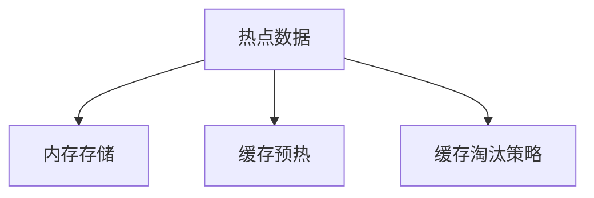

### 3.1.5 系统部署与测试

在实现分布式缓存系统后，需要进行系统的部署和测试，以确保系统的稳定性和性能。

- **部署**：将缓存节点部署在不同的服务器上，配置网络和防火墙规则，确保节点之间的通信正常。
- **测试**：通过压力测试和性能测试，评估缓存系统的性能和可靠性，根据测试结果进行优化。

### 3.1.6 系统小结

本章节介绍了分布式缓存系统的实现，包括系统环境准备、核心实现、实际案例分析以及系统部署与测试。通过本章的学习，读者可以掌握分布式缓存系统的实现方法和优化策略。

----------------------------------------------------------------

## 第4章：分布式缓存在LLM应用中的实践

### 4.1.1 LLM应用背景

随着深度学习技术的发展，大规模语言模型（LLM）在自然语言处理（NLP）领域取得了显著的成果。LLM应用如自然语言生成、机器翻译、问答系统等，需要处理海量的文本数据，并对数据访问速度有较高的要求。

### 4.1.2 缓存技术在LLM应用中的作用

分布式缓存技术在LLM应用中发挥着重要作用：

- **数据缓存**：将常用的中间结果和计算结果缓存起来，减少重复计算，提高系统性能。
- **热点数据缓存**：针对频繁访问的热点数据，如单词统计信息、词向量等，将其缓存起来，以提高访问速度。
- **预加载缓存**：在系统启动时，预加载热门数据到缓存中，减少冷启动时间，提高用户体验。

### 4.1.3 实际案例：基于Redis的LLM缓存系统

以下是一个基于Redis的LLM缓存系统的实际案例：

```python
import redis

class LLMCache:
    def __init__(self, host='localhost', port=6379, db=0):
        self.redis_client = redis.StrictRedis(host=host, port=port, db=db)

    def get(self, key):
        return self.redis_client.get(key)

    def set(self, key, value, expire=3600):
        self.redis_client.set(key, value, ex=expire)

    def delete(self, key):
        self.redis_client.delete(key)
```

### 4.1.4 缓存策略优化

为了提高LLM应用的缓存性能，可以采取以下缓存策略优化：

- **缓存命中优化**：通过合理设置缓存过期时间，减少缓存失效带来的性能损耗。
- **缓存预热**：在系统启动时，预加载热门数据到缓存中，减少冷启动时间。
- **缓存淘汰策略**：根据实际业务需求，选择合适的缓存淘汰策略，如最近最少使用（LRU）等。

### 4.1.5 系统性能评估与优化

通过性能测试，评估缓存系统在LLM应用中的性能。根据测试结果，可以采取以下优化措施：

- **垂直优化**：增加缓存节点的内存容量，提高缓存数据存储能力。
- **水平优化**：增加缓存节点数量，提高系统的并发处理能力。
- **缓存一致性优化**：采用一致性协议，确保缓存数据与后端存储数据的一致性。

### 4.1.6 系统小结

本章节介绍了分布式缓存在LLM应用中的实践，包括缓存技术在LLM应用中的作用、实际案例以及缓存策略优化。通过本章的学习，读者可以掌握分布式缓存技术在LLM应用中的实践方法和优化策略。

----------------------------------------------------------------

## 第5章：分布式缓存技术的最佳实践与未来趋势

### 5.1.1 最佳实践

在分布式缓存技术的应用过程中，以下是一些最佳实践：

- **合理选择缓存存储**：根据数据特点和访问模式，选择合适的缓存存储方案，如Redis、Memcached等。
- **数据缓存策略**：根据业务需求，合理设置缓存过期时间和淘汰策略，提高缓存利用率。
- **缓存预热与预取**：在系统启动时，预热热门数据到缓存中，减少冷启动时间；根据访问模式，预取相关数据到缓存中。
- **缓存一致性保障**：采用一致性协议，确保缓存数据与后端存储数据的一致性。
- **监控与优化**：定期监控缓存系统的性能，根据监控结果进行优化。

### 5.1.2 未来趋势

分布式缓存技术在未来的发展趋势包括：

- **高性能缓存引擎**：随着硬件技术的发展，新的缓存引擎将提供更高的性能和更低的延迟。
- **分布式缓存管理平台**：分布式缓存管理平台将提供更完善的缓存管理功能，如自动扩展、负载均衡等。
- **缓存技术与数据库融合**：分布式缓存技术与数据库技术的融合，将提供更强大的数据访问和处理能力。
- **缓存安全与隐私保护**：随着数据安全需求的提升，分布式缓存技术将加强数据安全与隐私保护。

### 5.1.3 小结

本章总结了分布式缓存技术的最佳实践和未来趋势，为读者提供了实际应用和未来发展的方向。通过本章的学习，读者可以更好地理解分布式缓存技术的价值和应用前景。

----------------------------------------------------------------

## 第6章：注意事项与拓展阅读

### 6.1.1 注意事项

在设计和实现分布式缓存系统时，需要注意以下事项：

- **数据一致性与可靠性**：确保缓存数据与后端存储数据的一致性，避免数据丢失。
- **缓存击穿与雪崩**：合理设置缓存过期时间，避免缓存击穿和雪崩现象。
- **缓存命中率与性能优化**：关注缓存命中率，采取优化策略提高缓存性能。
- **缓存安全**：加强缓存安全，防止缓存数据泄露。

### 6.1.2 拓展阅读

- 《Redis权威指南》
- 《Memcached技术内幕》
- 《分布式系统原理与范型》
- 《大规模分布式存储系统：设计、实现与优化》

通过拓展阅读，读者可以更深入地了解分布式缓存系统的设计与实现，掌握相关技术。

----------------------------------------------------------------

## 总结

本文详细介绍了分布式缓存技术，包括基本概念、系统设计、实现方法、应用实践以及未来趋势。通过本文的学习，读者可以全面了解分布式缓存技术在提升LLM应用数据访问速度方面的作用，并掌握相关技术和最佳实践。

### 作者

**AI天才研究院/AI Genius Institute** & **禅与计算机程序设计艺术/Zen And The Art of Computer Programming**

