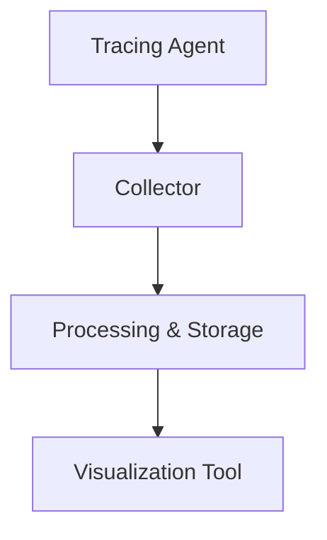

                 

## 引言

### 《分布式追踪上下文传播在LLM应用中的实现》

在当前信息技术飞速发展的时代，分布式系统已成为各类应用架构的核心组成部分。无论是云计算、大数据处理，还是人工智能（AI）的高效运算，分布式系统提供了弹性和可扩展性的优势，满足了日益增长的计算需求。然而，分布式系统也面临着诸多挑战，特别是如何在复杂的环境中实现高效的数据追踪和上下文传播。本文旨在探讨如何有效地在分布式系统中实现上下文传播，特别是在大型语言模型（LLM）的应用场景中。

分布式追踪是一种监控分布式系统中数据流动和系统状态的技术，它帮助开发人员了解系统的行为和性能，并快速定位问题。而上下文传播则是指在分布式系统中，将关键信息或状态从一个组件传递到另一个组件的过程。上下文传播对于保证系统一致性和可靠性至关重要，尤其是在需要处理大量数据和复杂计算的场景中，如大型语言模型（LLM）。

大型语言模型是自然语言处理（NLP）领域的重要突破，其能够理解和生成人类语言，被广泛应用于搜索引擎、聊天机器人、语音识别等领域。然而，随着LLM规模和复杂度的增加，如何在分布式系统中高效地追踪和管理上下文信息成为一个关键问题。

本文将系统地介绍分布式追踪和上下文传播的基本概念和实现策略，并通过具体案例帮助读者理解并实践这些技术。文章结构如下：

1. **基础概念与背景**：介绍分布式追踪和上下文传播的基本概念，分析分布式系统和LLM的应用场景。
2. **分布式追踪技术**：详细讲解分布式追踪框架、数据收集与处理、数据存储与查询等相关技术。
3. **上下文传播机制**：探讨上下文传播的机制、策略和优化方法。
4. **实现与优化**：结合LLM应用，阐述分布式追踪和上下文传播的具体实现和性能优化。
5. **案例研究**：通过实际案例展示分布式追踪和上下文传播的实现过程和效果。
6. **总结与展望**：总结全文内容，展望分布式追踪和上下文传播技术的未来发展趋势。

通过本文的阅读，读者将能够深入了解分布式追踪上下文传播在LLM应用中的实现方法和优化策略，从而为分布式系统开发和LLM应用提供有益的参考和指导。

### 分布式追踪概述

#### 分布式追踪背景

在分布式系统中，分布式追踪技术是一种至关重要的监控手段，它帮助开发人员全面了解系统的运行状况，快速定位和解决潜在问题。分布式系统由多个相互独立且通过网络连接的节点组成，这些节点可能分布在不同的地理位置或数据中心。这使得系统具有高度的灵活性和可扩展性，但同时也带来了复杂性和管理上的挑战。

首先，分布式系统的复杂性体现在其节点之间的通信和协调上。节点间的通信需要高效且可靠的协议，否则可能会导致数据传输延迟或丢失。此外，系统中的各个节点可能会因硬件故障、网络中断或软件错误等原因出现异常，需要及时检测和恢复。因此，分布式追踪成为了一种必不可少的监控工具，它能够实时捕捉系统中的关键事件和状态变化，为故障诊断和性能优化提供数据支持。

其次，分布式系统的可扩展性使其能够应对大规模数据处理和计算需求。然而，这也意味着系统的规模和复杂性不断增加，传统的单点监控方式已无法满足需求。分布式追踪技术通过在整个系统中部署多个追踪代理，可以全局监控系统的运行状态，提供统一的视图和分析结果。

#### 分布式追踪的需求和重要性

分布式追踪的需求源于分布式系统的特点和面临的挑战。具体来说，分布式追踪主要解决了以下问题：

1. **故障诊断**：在分布式系统中，节点数量众多，单个节点的故障可能会对整个系统造成重大影响。分布式追踪可以帮助开发人员快速定位故障节点，并分析故障原因，从而进行有效修复。

2. **性能优化**：分布式系统的性能受多种因素影响，如网络延迟、负载均衡和资源分配等。通过分布式追踪，可以收集系统运行过程中产生的海量数据，进行深入分析，找出性能瓶颈并进行优化。

3. **安全性**：随着分布式系统的广泛应用，安全性问题也日益突出。分布式追踪可以帮助监控系统的访问和操作行为，及时发现异常行为和潜在威胁，提高系统的安全性。

分布式追踪的重要性体现在以下几个方面：

1. **全局视角**：分布式追踪提供了全局的监控视角，使开发人员能够全面了解系统的运行状况，而不仅仅是单个节点的信息。

2. **实时监控**：分布式追踪通常具备实时监控能力，可以及时发现系统中的异常情况，并提供及时预警，有助于快速响应和处理问题。

3. **数据驱动**：通过分布式追踪，可以收集丰富的运行数据，这些数据为系统的性能优化、故障诊断和安全管理提供了重要的依据。

#### 分布式追踪的概念

分布式追踪是一种监控分布式系统中数据流动和系统状态的技术。它通过在系统的各个节点中部署追踪代理，捕获和处理系统运行过程中的各种事件和日志，将它们汇总到一个集中的追踪系统中进行分析和展示。

分布式追踪的基本原理可以概括为以下几个步骤：

1. **数据采集**：在每个节点上部署追踪代理，捕获系统中的日志和事件数据。这些数据包括请求处理时间、响应结果、错误信息等。

2. **数据传输**：追踪代理将采集到的数据传输到集中存储和处理系统，如分布式日志收集器或追踪平台。数据传输通常采用高效的通信协议，如HTTP、gRPC或消息队列。

3. **数据存储**：集中存储系统将接收到的数据存储在数据库或数据湖中，以便后续的数据分析和查询。常见的存储方案包括Elasticsearch、Kafka和InfluxDB等。

4. **数据查询**：开发人员或运维人员可以通过追踪平台的用户界面或API，查询和分析存储在集中存储系统中的数据。查询结果可以以图表、报表或告警等形式展示，帮助用户快速了解系统状况。

#### 分布式追踪的关键技术

分布式追踪的实现涉及多个关键技术，以下是一些关键技术的详细介绍：

1. **追踪代理**：追踪代理是分布式追踪系统中的核心组件，它部署在各个节点上，负责采集和处理本地数据。常见的追踪代理包括OpenTracing、Zipkin和Jaeger等。

2. **数据采集**：数据采集是分布式追踪的重要环节，涉及如何高效地采集和传输大量数据。常用的数据采集方法包括日志采集、SDK采集和API采集等。

3. **数据传输**：数据传输技术决定了追踪数据的实时性和可靠性。常用的数据传输协议包括HTTP、gRPC和消息队列等。为了提高传输效率，可以采用压缩、批量传输和异步传输等技术。

4. **数据存储**：数据存储方案需要支持海量数据的存储和快速查询。常见的存储系统包括Elasticsearch、Kafka和InfluxDB等。为了提高查询性能，可以采用索引、分片和缓存等技术。

5. **数据查询和分析**：数据查询和分析是分布式追踪的核心功能之一，它帮助用户快速定位问题和优化系统。常用的查询和分析工具包括追踪平台（如Kibana、Grafana）、数据可视化和机器学习算法等。

通过以上关键技术的综合运用，分布式追踪系统能够实现对分布式系统的全面监控，提供实时、准确的数据分析和故障诊断能力。

### 上下文传播的概念

#### 上下文传播的定义

上下文传播是指在分布式系统中，将关键信息或状态从一个组件传递到另一个组件的过程。在分布式系统中，各个组件通常独立运行，且可能分布在不同的地理位置或服务器上。为了确保系统的一致性和可靠性，某些关键信息需要在组件之间传递和共享。这些信息可以是请求的元数据、事务状态、用户会话信息等，它们在系统的各个阶段扮演着至关重要的角色。

#### 上下文传播的作用和重要性

上下文传播在分布式系统中具有重要的作用，具体体现在以下几个方面：

1. **系统一致性**：上下文传播有助于保持系统的一致性。在分布式系统中，多个组件需要协同工作来完成一个任务。如果某个组件无法获取其他组件的上下文信息，可能会导致系统状态的不一致，从而影响系统的整体性能和稳定性。

2. **错误处理**：在分布式系统中，错误处理是一个复杂的过程。上下文传播使得错误信息能够快速传递到相关组件，便于开发者进行故障定位和修复。例如，如果一个请求在某个节点上出现错误，错误信息可以通过上下文传播机制传递到其他节点，确保整个系统能够及时响应和处理错误。

3. **性能优化**：上下文传播有助于提高系统的性能。通过传递关键信息，组件可以减少不必要的重复计算和数据传输，从而降低系统的负载和延迟。例如，在分布式数据处理系统中，如果某个节点已经处理过某份数据，其他节点无需再次处理相同的数据，从而提高整体的处理效率。

4. **安全性**：上下文传播在保证系统安全方面也起着重要作用。通过传递用户身份验证信息和权限信息，可以确保只有授权的组件能够访问敏感数据和资源。此外，上下文传播还可以帮助监控系统中的异常行为和潜在威胁，提高系统的安全性。

#### 上下文传播在分布式系统中的必要性

在分布式系统中，上下文传播的必要性主要体现在以下几个方面：

1. **跨节点协调**：分布式系统中的各个节点独立运行，它们需要通过上下文传播机制进行跨节点的协调和通信。只有通过上下文传播，节点之间才能共享关键信息，确保系统能够协调一致地工作。

2. **容错能力**：分布式系统通常需要具备高容错能力，以应对节点故障和网络中断等异常情况。上下文传播使得系统能够在故障发生时快速切换到其他节点，确保系统的持续运行。

3. **数据一致性**：在分布式系统中，数据的一致性是确保系统稳定运行的关键。通过上下文传播，系统可以确保各个节点访问和操作的数据是一致的，从而避免数据冲突和不一致性。

4. **效率优化**：通过上下文传播，系统可以避免重复计算和数据传输，提高整体的效率和性能。例如，在分布式数据处理中，如果某个节点已经处理过某份数据，其他节点无需再次处理相同的数据，从而节省计算资源和网络带宽。

5. **安全控制**：上下文传播在保证系统安全方面也起着重要作用。通过传递用户身份验证信息和权限信息，可以确保只有授权的组件能够访问敏感数据和资源，从而防止未经授权的访问和操作。

综上所述，上下文传播在分布式系统中具有不可替代的重要性，它为系统的协调性、容错性、数据一致性和安全性提供了有力保障。

#### 分布式追踪的基本原理

分布式追踪是一种关键技术，用于监控分布式系统中数据流动和系统状态，帮助开发人员和运维人员理解系统的运行状况、快速定位问题并进行优化。分布式追踪的基本原理可以从架构设计、数据流转、关键技术和实现步骤等方面进行详细阐述。

##### 分布式追踪架构设计

分布式追踪系统通常由以下几个核心组件组成：

1. **追踪代理（Tracing Agent）**：部署在各个节点上，负责收集系统中的追踪数据，如日志、请求响应时间、错误信息等。追踪代理可以是进程内的，也可以是独立的守护进程。

2. **收集器（Collector）**：负责接收和汇总各个追踪代理发送的数据，通常会将数据存储在中间存储中，如消息队列或临时数据库。

3. **处理和存储系统**：如Elasticsearch、InfluxDB、Kafka等，用于存储和处理追踪数据。这些系统提供了高效的数据查询和分析功能，使开发人员能够快速定位问题。

4. **追踪界面和可视化工具**：如Kibana、Grafana等，用于展示追踪数据，提供图形化的监控和故障诊断界面。

以下是一个简单的分布式追踪架构图：



##### 数据流转

分布式追踪的数据流转过程可以分为以下几个步骤：

1. **数据采集**：追踪代理在各个节点上运行，捕获系统中的追踪数据，并将其发送到收集器。

2. **数据传输**：收集器接收追踪代理发送的数据，并将其存储到中间存储系统中，如消息队列或临时数据库。

3. **数据处理**：处理和存储系统对收集到的数据进行处理，包括数据清洗、聚合、索引等操作，以便后续的查询和分析。

4. **数据查询和分析**：开发人员或运维人员通过追踪界面和可视化工具查询和分析存储在处理和存储系统中的数据，以了解系统的运行状况和性能。

##### 分布式追踪的关键技术

分布式追踪的实现涉及多个关键技术，以下是一些关键技术的详细描述：

1. **追踪上下文（Trace Context）**：追踪上下文是分布式追踪的核心概念，用于在系统中传递请求的元数据。常见的追踪上下文包括追踪ID、跨度（Span）ID、父跨度ID等。

2. **数据采集和传输**：数据采集和传输是分布式追踪的关键环节。追踪代理需要高效地采集和传输大量数据，同时保证数据的完整性和实时性。常用的数据采集方法包括日志采集、SDK采集和API采集等。数据传输通常采用高效的通信协议，如HTTP、gRPC和消息队列等。

3. **数据存储和查询**：数据存储和查询是分布式追踪的重要功能。分布式追踪系统需要支持海量数据的存储和快速查询，常见的存储系统包括Elasticsearch、Kafka和InfluxDB等。为了提高查询性能，可以采用索引、分片和缓存等技术。

4. **数据聚合和分析**：分布式追踪系统需要能够对海量数据进行聚合和分析，以提供直观的监控和故障诊断结果。常用的数据分析工具包括Kibana、Grafana等，它们提供了丰富的可视化报表和告警功能。

##### 实现步骤

以下是一个简单的分布式追踪实现步骤：

1. **选择合适的追踪框架**：根据系统需求选择适合的追踪框架，如OpenTracing、Zipkin或Jaeger等。

2. **配置追踪代理**：在各个节点上部署追踪代理，配置采集和传输策略，确保数据能够高效地收集和传输。

3. **搭建处理和存储系统**：选择合适的数据存储和处理系统，如Elasticsearch、Kafka等，搭建分布式追踪系统的后端基础设施。

4. **集成可视化工具**：将分布式追踪系统与可视化工具集成，提供用户友好的监控和故障诊断界面。

5. **监控和优化**：定期监控系统的性能，根据监控结果进行优化和调整，确保系统稳定高效地运行。

通过以上步骤，开发人员可以搭建一个完整的分布式追踪系统，实现对分布式系统的全面监控和故障诊断。

### LLM的基本原理

#### LLM的定义和特点

大型语言模型（Large Language Model，简称LLM）是一种基于深度学习技术的自然语言处理（Natural Language Processing，简称NLP）模型，它通过训练大量文本数据，学习语言的语法、语义和上下文关系，从而能够生成或理解自然语言。LLM的核心思想是通过大规模数据集的预训练，使模型能够捕捉到语言中的复杂模式和规律，从而在多种任务中表现出色。

LLM的主要特点包括：

1. **大规模训练数据**：LLM通常基于数十亿甚至数千亿级别的文本数据集进行训练，这使得模型能够获取丰富的语言知识，提高其准确性和泛化能力。

2. **深度神经网络结构**：LLM通常采用深度神经网络（Deep Neural Network，简称DNN）作为基础架构，通过多层的神经网络结构，逐层提取语言的特征，从而实现复杂的语言理解任务。

3. **自适应性和灵活性**：LLM能够根据不同的任务和场景进行自适应调整，通过微调（Fine-tuning）技术，将预训练模型迁移到特定的任务中，从而实现高效的任务性能。

4. **强大的生成能力**：LLM具有强大的文本生成能力，能够根据输入的文本生成连贯、有逻辑的文本，被广泛应用于聊天机器人、自动写作、语音合成等领域。

#### LLM在自然语言处理中的应用

LLM在自然语言处理领域有着广泛的应用，以下是几个典型的应用场景：

1. **文本生成**：LLM能够根据输入的提示或上下文，生成高质量的文本，包括文章、摘要、对话等。这种能力在内容创作、自动写作和智能客服等领域具有重要应用。

2. **机器翻译**：LLM通过学习双语文本数据，能够实现高精度的机器翻译。与传统的统计机器翻译和基于规则的方法相比，LLM在翻译质量、准确性和流畅性方面具有显著优势。

3. **文本分类**：LLM能够对输入的文本进行分类，判断其所属的类别。这种能力在垃圾邮件过滤、情感分析、新闻分类等领域有广泛应用。

4. **问答系统**：LLM能够理解和回答用户提出的问题，通过检索大量文本数据，生成相关的答案。这种能力在智能客服、在线教育、医疗咨询等领域具有巨大潜力。

5. **对话系统**：LLM可以构建智能对话系统，通过与用户的自然语言交互，提供实时、个性化的服务。这种能力在聊天机器人、语音助手等领域得到了广泛应用。

#### LLM在分布式系统中的挑战

尽管LLM在自然语言处理领域表现出色，但在分布式系统中应用LLM仍面临诸多挑战：

1. **计算资源需求**：LLM的训练和推理过程需要大量的计算资源，包括CPU、GPU和内存等。在分布式系统中，如何高效地利用这些资源，保证模型的高性能运行，是一个重要问题。

2. **数据一致性和可靠性**：在分布式环境中，数据的一致性和可靠性是确保LLM应用稳定运行的关键。分布式系统中的数据可能会因网络中断、节点故障等原因导致不一致，如何保证数据的一致性是一个重要挑战。

3. **分布式训练和推理**：LLM的训练和推理过程通常涉及多个节点和任务，如何在分布式环境中高效地协调这些任务，保证训练和推理的高效性和准确性，是一个技术难题。

4. **上下文传播**：在分布式系统中，LLM需要处理大量的上下文信息，如用户输入、对话历史等。如何有效地在各个节点之间传播和共享这些上下文信息，是确保LLM应用一致性和准确性的关键。

5. **性能优化**：分布式系统中的性能优化是一个复杂的过程，如何通过优化分布式追踪、负载均衡和资源分配等技术，提高LLM的应用性能，是一个重要的研究方向。

#### 上下文传播在LLM中的必要性

在分布式系统中，上下文传播对于LLM的应用至关重要，主要体现在以下几个方面：

1. **一致性和准确性**：通过上下文传播，LLM能够获取完整的上下文信息，包括用户输入、对话历史等，从而提高生成文本的一致性和准确性。

2. **协同工作**：在分布式系统中，多个LLM实例可能同时处理不同的任务，通过上下文传播，这些实例能够共享上下文信息，协同工作，提高系统的整体性能和响应速度。

3. **故障恢复**：在分布式系统中，节点可能会出现故障或网络中断，通过上下文传播，其他节点能够获取关键上下文信息，确保系统的持续运行和故障恢复。

4. **资源利用**：通过上下文传播，分布式系统可以更好地利用计算资源，如GPU、CPU等，提高LLM的训练和推理效率。

综上所述，上下文传播在LLM的分布式应用中具有不可替代的重要性，它为LLM在分布式系统中的高效运行提供了有力保障。

### 分布式追踪框架

#### 分布式追踪框架概述

分布式追踪框架是分布式系统中实现高效数据监控和故障诊断的重要工具。它通过一系列精心设计的组件和机制，能够全面监控系统的运行状态，提供实时、准确的数据分析能力，从而帮助开发人员和运维人员快速定位和解决问题。常见的分布式追踪框架包括Zipkin、Jaeger、OpenTelemetry等，它们各自具有独特的架构和功能，但在实现分布式追踪的核心目标上有着相似的设计原则。

##### 设计原则

1. **全局视角**：分布式追踪框架应提供全局视角，使开发人员能够全面了解系统的运行状况。这意味着框架需要能够捕获并汇总来自各个节点的数据，提供统一的数据分析界面。

2. **低延迟和高吞吐量**：分布式追踪框架需要具备高效的性能，以支持大规模系统的实时监控。低延迟和高吞吐量是保证数据能够及时采集、处理和展示的关键。

3. **可扩展性**：随着系统规模的扩大，分布式追踪框架应能够轻松扩展，以应对更多的节点和更高的数据量。

4. **健壮性和可靠性**：分布式追踪框架需要在各种异常情况下保持稳定运行，包括网络中断、节点故障等，以保证数据的完整性和一致性。

5. **灵活性和兼容性**：框架应具备良好的灵活性和兼容性，能够与各种分布式系统和服务无缝集成，同时支持不同的编程语言和运行环境。

##### 常见分布式追踪框架介绍

1. **Zipkin**：Zipkin是一个开源的分布式追踪系统，由Twitter创建并维护。它采用Apache 2.0协议，支持多种语言和框架，如Java、Python、Go等。Zipkin的主要功能包括数据采集、数据存储和数据分析。它使用一组基于HTTP协议的API进行数据传输，支持多种数据存储后端，如Elasticsearch、Apache Kafka和Cassandra等。

2. **Jaeger**：Jaeger是另一个流行的开源分布式追踪系统，由Uber创建并维护。它采用OpenTracing标准，支持多种编程语言和分布式框架，如Java、Go、Node.js和Python等。Jaeger提供丰富的可视化工具，能够实时展示追踪数据，并支持数据导出和分析。

3. **OpenTelemetry**：OpenTelemetry是一个由云原生计算基金会（CNCF）支持的跨语言分布式追踪框架。它旨在提供一个统一的API和实现，简化分布式追踪的集成和部署。OpenTelemetry支持多种语言和框架，如Java、Python、C++、Go等，并提供灵活的插件机制，方便开发者集成和使用。

##### 数据收集与处理

分布式追踪框架的数据收集与处理是系统性能的关键环节。以下是这一过程的主要步骤：

1. **数据采集**：分布式追踪框架在各个节点上部署追踪代理（Tracing Agent），这些代理负责捕获系统中的追踪数据，如请求时间、响应时间、错误信息、日志等。采集的数据通常包含追踪ID、跨度（Span）ID、服务名称、端点名称、HTTP状态码等信息。

2. **数据传输**：采集到的数据通过特定的传输协议发送到集中存储系统，如消息队列、分布式日志收集器或追踪平台。常用的传输协议包括HTTP、gRPC和消息队列等。为了提高传输效率，可以采用压缩、批量传输和异步传输等技术。

3. **数据存储**：集中存储系统负责存储和处理追踪数据，常见的存储方案包括Elasticsearch、Kafka、InfluxDB等。这些系统提供了高效的数据查询和分析功能，使开发人员能够快速定位问题。

4. **数据处理**：数据处理包括数据清洗、聚合、索引等操作。清洗操作旨在去除重复数据、格式错误等，保证数据的质量。聚合操作将多个追踪数据进行汇总，提供更详细的视图。索引操作提高数据的查询效率，使数据能够快速检索。

##### 数据存储与查询

数据存储与查询是分布式追踪框架的核心功能之一。以下是这一过程的主要步骤：

1. **数据存储方案**：分布式追踪框架需要支持海量数据的存储和快速查询。常见的存储方案包括Elasticsearch、Kafka、InfluxDB等。Elasticsearch是一种基于Lucene的搜索引擎，提供了强大的全文检索和分析功能；Kafka是一个分布式消息队列系统，适用于大规模数据流处理；InfluxDB是一个时序数据库，适合存储和查询时间序列数据。

2. **数据查询优化**：为了提高查询性能，分布式追踪框架可以采用多种优化技术，如索引、分片和缓存等。索引可以提高数据的检索速度，分片可以水平扩展存储能力，缓存可以减少数据库的查询压力。

3. **数据可视化**：通过数据可视化工具，如Kibana、Grafana等，可以将追踪数据以图表、报表的形式展示，提供直观的监控和故障诊断界面。这些工具支持自定义仪表板和告警功能，使开发人员和运维人员能够实时了解系统状况。

通过以上设计原则和实现步骤，分布式追踪框架能够提供高效、可靠的数据监控和故障诊断能力，为分布式系统的开发和运维提供有力支持。

### 数据收集与处理

#### 数据收集

数据收集是分布式追踪系统的关键环节，其目标是实时、全面地捕捉系统运行过程中的各种事件和状态，以便后续的分析和诊断。以下是数据收集过程中涉及的主要步骤和策略：

1. **追踪代理的部署与配置**：在分布式系统中，每个节点上都会部署一个追踪代理，这些代理负责监控和收集系统中的数据。追踪代理通常通过SDK（Software Development Kit）或独立进程运行，能够捕获来自不同组件的追踪数据。部署和配置追踪代理时，需要根据系统的具体需求调整采样率、采集范围和日志格式等参数。

2. **数据采集范围**：追踪代理需要明确采集哪些类型的数据。常见的数据采集范围包括：
   - HTTP请求和响应：包括请求路径、参数、状态码、响应时间等。
   - SQL查询和操作：数据库的查询语句、执行时间、错误信息等。
   - 应用日志：应用生成的日志，如异常信息、错误日志等。
   - 系统指标：系统性能指标，如CPU使用率、内存占用、网络延迟等。

3. **采样策略**：由于系统运行过程中的数据量庞大，为了提高采集效率，通常会采用采样策略。常见的采样策略包括：
   - 完全采样：对所有事件进行采集，适用于关键业务场景。
   - 随机采样：随机选择部分事件进行采集，适用于一般性监控。
   - 百分比采样：根据设定的比例（如1%）选择事件进行采集，适用于大规模系统。

4. **数据格式标准化**：为了确保数据的统一性和可分析性，采集的数据需要遵循统一的数据格式。常见的数据格式包括JSON、Protobuf等。标准化格式有助于后续的数据处理和分析，提高系统的整体效率。

#### 数据传输

数据传输是将采集到的追踪数据从节点传输到集中存储系统的过程。高效、可靠的数据传输是分布式追踪系统性能的关键。以下是数据传输过程中涉及的主要步骤和策略：

1. **传输协议**：数据传输通常采用高效的通信协议，如HTTP、gRPC和消息队列等。这些协议各有优缺点：
   - HTTP：简单、易用，适用于小数据量的传输。
   - gRPC：基于HTTP/2协议，支持多语言、高效传输，适用于大规模数据传输。
   - 消息队列：异步传输，适用于高并发、大规模数据场景。

2. **传输优化**：
   - **批量传输**：将多个追踪事件合并成一个批量请求进行传输，减少网络请求次数，提高传输效率。
   - **压缩传输**：对传输的数据进行压缩，减少数据传输的体积，降低网络带宽消耗。
   - **异步传输**：采用异步传输方式，减少代理进程的等待时间，提高系统整体的响应速度。

3. **传输可靠性**：
   - **重试机制**：在数据传输过程中，如果发生网络错误或传输失败，可以采用重试机制，确保数据最终能够成功传输。
   - **超时设置**：合理设置数据传输的超时时间，避免长时间等待导致的性能瓶颈。

4. **监控与告警**：实时监控数据传输过程，对传输失败或延迟过长的请求进行告警，确保系统能够及时发现和解决问题。

#### 数据处理

数据处理是将传输到集中存储系统的数据进行处理和存储的过程。以下是数据处理过程中涉及的主要步骤和策略：

1. **数据清洗**：数据清洗是数据处理的第一步，旨在去除无效、重复或有错误的数据。常见的清洗操作包括：
   - 过滤重复数据：去除重复的追踪事件。
   - 格式转换：将不同格式的数据转换为统一的格式。
   - 数据校验：检查数据的完整性和准确性，如检查时间戳是否合理、数据字段是否完整等。

2. **数据聚合**：数据聚合是将多个追踪事件进行汇总和合并，提供更详细的分析结果。常见的聚合操作包括：
   - 汇总统计：计算事件的平均响应时间、错误率等。
   - 跨服务追踪：将不同服务中的追踪数据进行关联和汇总，提供全局视图。

3. **数据存储**：将处理后的数据存储在分布式存储系统中，如Elasticsearch、Kafka、InfluxDB等。这些系统提供了高效的数据查询和分析功能，使开发人员能够快速定位问题。

4. **数据查询与分析**：通过数据查询和分析工具，如Kibana、Grafana等，开发人员和运维人员可以实时查询和分析存储在分布式存储系统中的数据，以了解系统的运行状况和性能。

通过以上数据收集、传输和处理策略，分布式追踪系统能够高效、可靠地收集、传输和处理追踪数据，为系统的监控和故障诊断提供强有力的支持。

### 数据存储与查询

#### 数据存储方案

在分布式追踪系统中，数据存储方案的选择至关重要，它直接影响到系统的性能、可扩展性和可靠性。常见的数据存储方案包括Elasticsearch、Kafka和InfluxDB等。

1. **Elasticsearch**：Elasticsearch是一个基于Lucene的分布式搜索引擎，支持全文检索和分析。它适用于处理大规模结构化数据，提供了丰富的查询和分析功能。Elasticsearch的主要优势包括：
   - **高效的全文检索**：Elasticsearch支持高效的全文检索，能够快速查询和搜索大规模数据。
   - **灵活的数据建模**：Elasticsearch支持灵活的数据建模，允许开发人员根据需求自定义数据结构。
   - **可扩展性**：Elasticsearch支持水平扩展，能够轻松应对大规模数据存储和查询需求。

2. **Kafka**：Kafka是一个分布式流处理平台，主要用于处理大规模实时数据流。它具有以下优势：
   - **高吞吐量**：Kafka能够处理高吞吐量的数据流，适用于大规模分布式系统的数据采集和传输。
   - **容错性**：Kafka具有高容错性，能够在节点故障或网络中断时保持数据不丢失。
   - **实时查询**：Kafka支持实时查询，使开发人员能够实时监控和分析数据。

3. **InfluxDB**：InfluxDB是一个时序数据库，主要用于存储和处理时间序列数据。它适用于系统监控和实时分析。InfluxDB的主要优势包括：
   - **高效的时序数据存储**：InfluxDB支持高效的时序数据存储，能够处理大量的时间序列数据。
   - **易用性**：InfluxDB提供了简单易用的API和命令行工具，便于数据操作和查询。
   - **高可用性**：InfluxDB支持高可用性集群，能够在节点故障时自动切换，保证系统稳定运行。

#### 数据查询优化

数据查询优化是分布式追踪系统性能的关键，以下是一些常见的查询优化策略：

1. **索引优化**：索引能够显著提高查询速度，优化索引策略是提升查询性能的重要手段。常见的索引优化策略包括：
   - **创建合适的索引**：根据查询需求创建索引，避免创建不必要的索引。
   - **分片和副本**：使用分片和副本策略，提高数据查询的并发能力和查询效率。

2. **缓存策略**：缓存可以减少数据库的查询压力，提高系统的整体性能。常见的缓存策略包括：
   - **本地缓存**：在应用程序中使用本地缓存，减少对数据库的查询次数。
   - **分布式缓存**：使用分布式缓存系统，如Redis或Memcached，存储热点数据，减少数据库访问。

3. **查询优化**：通过优化查询语句，减少查询时间和资源消耗。常见的查询优化方法包括：
   - **过滤和聚合**：在查询中应用过滤和聚合操作，减少返回的数据量。
   - **预编译查询**：预编译查询语句，减少查询解析和优化时间。

4. **查询性能监控**：实时监控查询性能，对性能较差的查询进行优化和调整。常见的监控工具包括：
   - **日志分析**：通过分析数据库日志，了解查询性能和瓶颈。
   - **性能分析工具**：如Percona Monitoring and Management（PMM）或New Relic等，提供详细的性能分析和诊断功能。

通过以上数据存储和查询优化策略，分布式追踪系统能够提供高效、可靠的查询性能，满足大规模分布式系统的监控需求。

### 上下文传播机制

#### 上下文传播机制概述

上下文传播机制是分布式系统中实现组件间信息共享和协同工作的关键技术。在分布式环境中，各个组件可能运行在不同的节点上，它们需要通过上下文传播机制来传递关键信息，以保持系统的一致性和可靠性。上下文传播机制的核心任务是确保关键信息能够及时、准确地传递到各个需要它的组件，从而实现系统的协同工作。

#### 上下文传播的原理

上下文传播的基本原理可以概括为以下几个步骤：

1. **信息采集**：各个组件在运行过程中，会收集到与系统状态和业务逻辑相关的信息，如用户会话信息、请求参数、错误日志等。

2. **信息编码**：采集到的信息需要被编码成标准化的格式，以便在不同的组件之间传输。常见的编码格式包括JSON、Protobuf等。

3. **信息传输**：编码后的信息通过网络传输协议发送到目标组件。传输协议的选择取决于系统需求，如HTTP、gRPC、WebSocket等。

4. **信息解码**：目标组件接收到编码后的信息后，会进行解码，将信息还原成可用的格式。

5. **信息处理**：目标组件根据接收到的信息执行相应的操作，如更新状态、处理请求等。

#### 上下文传播的类型

根据上下文传播的机制和方式，可以分为以下几种类型：

1. **同步传播**：同步传播是指在信息传递过程中，发送方需要等待接收方处理完信息后才能继续执行。同步传播的优点是能够确保信息的一致性和可靠性，但缺点是可能会引入较大的延迟。

2. **异步传播**：异步传播是指发送方不需要等待接收方处理信息，而是将信息放入消息队列或其他中间件中，由接收方在适当的时候进行处理。异步传播的优点是能够提高系统的响应速度和灵活性，但缺点是可能会引入数据丢失或重复的风险。

3. **双向传播**：双向传播是指组件间能够同时进行信息的双向传递。双向传播能够增强组件间的互动和协调，提高系统的整体效率和可靠性。

4. **事件驱动传播**：事件驱动传播是指组件间通过事件机制进行信息传递。当某个组件发生特定事件时，会触发信息传递，从而实现组件间的协作。事件驱动传播能够提高系统的动态性和灵活性。

#### 上下文传播策略

为了保证上下文传播的高效性和可靠性，可以采用以下几种策略：

1. **同步与异步结合**：在关键信息传递过程中，可以结合同步和异步策略，确保信息的一致性和实时性。例如，在处理重要业务逻辑时采用同步传播，而在传递非关键信息时采用异步传播。

2. **消息队列**：使用消息队列（如Kafka、RabbitMQ）作为中间件，可以有效地实现异步传播。消息队列能够提供高吞吐量和低延迟的数据传输，同时保证数据不丢失和可重试。

3. **分布式缓存**：在分布式系统中，使用分布式缓存（如Redis、Memcached）可以显著提高信息传播的效率。分布式缓存能够快速存储和读取数据，减少网络传输的负担。

4. **事件总线**：事件总线（如Event Bus）是一种基于事件驱动的上下文传播机制，能够实现组件间的高效通信。事件总线能够处理大量的事件，并提供灵活的消息路由和过滤机制。

5. **服务网格**：服务网格（如Istio、Linkerd）是一种新型的上下文传播机制，它通过侧载（Out-of-band）方式实现组件间的通信和协调。服务网格能够提供强大的流量管理和服务发现功能，提高分布式系统的可靠性和可扩展性。

通过以上策略，分布式系统可以高效地实现上下文传播，确保组件间的信息共享和协同工作，从而提高系统的整体性能和可靠性。

### 上下文传播策略

#### 静态上下文传播策略

静态上下文传播策略是指在系统运行过程中，上下文信息被预先定义和配置，并按照一定的规则在组件之间传递。这种方法适用于上下文信息较为固定且变化不频繁的场景，其优点是实现简单、易于管理，缺点是灵活性较低，无法适应动态变化的需求。

1. **静态配置**：在系统设计阶段，开发人员需要明确各个组件所需的上下文信息，并将其配置到系统中。常见的配置方式包括XML、JSON、YAML等。

2. **预加载**：系统启动时，将预定义的上下文信息加载到各个组件中，以确保它们在运行过程中能够立即访问和使用这些信息。

3. **定时更新**：在某些情况下，静态上下文信息可能需要定期更新，以反映系统的最新状态。定时更新可以通过定时任务或消息队列等机制实现。

4. **触发机制**：当系统状态发生变化时，可以通过触发机制（如事件监听）更新上下文信息。触发机制可以确保上下文信息的及时性和准确性。

#### 动态上下文传播策略

动态上下文传播策略是指在系统运行过程中，上下文信息根据实际需求实时生成和传递。这种方法适用于上下文信息变化频繁且复杂多样的场景，其优点是灵活性高、适应性强，缺点是实现复杂度较高，需要更多的资源和技术支持。

1. **事件驱动**：基于事件驱动的动态上下文传播策略，当系统中的某个事件发生时，会触发上下文信息的生成和传递。这种方法能够确保上下文信息与系统状态保持实时同步。

2. **实时计算**：利用实时计算框架（如Apache Storm、Apache Flink），可以实时处理和分析系统中的数据，生成上下文信息，并传递给相关组件。

3. **数据流处理**：通过数据流处理技术（如Apache Kafka、Apache Pulsar），可以高效地传递和处理动态上下文信息。数据流处理系统能够处理海量数据，并保证信息的实时性和一致性。

4. **智能路由**：采用智能路由策略，可以根据上下文信息的属性和需求，选择最优的传递路径和传输方式。智能路由可以提高信息传播的效率，降低系统的负载和延迟。

通过结合静态和动态上下文传播策略，分布式系统可以更好地适应不同的业务需求，实现高效、可靠的信息传播和协同工作。

### 上下文传播优化

#### 上下文传播的性能优化

在分布式系统中，上下文传播的性能优化至关重要，因为它直接影响到系统的整体性能和响应速度。以下是几种常见的上下文传播性能优化策略：

1. **缓存机制**：使用分布式缓存（如Redis、Memcached）可以显著提高上下文信息的访问速度。缓存机制可以减少对后端存储系统的访问次数，从而降低系统的负载和延迟。通过缓存常见或频繁访问的上下文信息，可以显著提升系统的响应速度。

2. **批量传输**：将多个上下文信息合并成一个批量请求进行传输，可以减少网络请求次数，提高传输效率。批量传输可以减少网络延迟，提高系统的吞吐量。

3. **压缩传输**：对传输的上下文信息进行压缩，可以减少数据传输的体积，降低网络带宽消耗。常用的压缩算法包括GZIP和LZ4等。压缩传输可以提高数据传输的效率，特别是在处理大量数据时。

4. **异步传输**：采用异步传输方式，可以减少发送方等待传输完成的时间，从而提高系统的整体响应速度。异步传输适用于上下文信息传递的延迟不敏感场景，可以有效地降低系统的等待时间。

5. **负载均衡**：通过负载均衡技术，可以均匀地将上下文信息传递任务分布到多个节点上，避免单点瓶颈。负载均衡可以提高系统的可扩展性和稳定性，确保各个节点都能高效地处理上下文信息传递任务。

#### 上下文传播的安全性保障

在分布式系统中，上下文传播的安全性至关重要，因为它涉及到敏感数据和信息的传递。以下是几种常见的上下文传播安全性保障策略：

1. **加密传输**：对传输的上下文信息进行加密，可以防止数据在传输过程中被窃取或篡改。常用的加密算法包括AES、RSA等。加密传输可以确保数据在传输过程中的安全性，防止未经授权的访问。

2. **认证与授权**：在上下文传播过程中，对参与通信的组件进行认证和授权，可以确保只有经过认证的组件才能访问和操作上下文信息。认证可以通过用户名和密码、令牌（如OAuth、JWT）等机制实现。授权可以通过访问控制列表（ACL）或角色访问控制（RBAC）等机制实现。

3. **防火墙和网络安全组**：通过配置防火墙和网络安全组，可以限制不必要的网络访问，防止外部攻击和内部恶意行为。防火墙和网络安全组可以基于IP地址、端口号和协议等信息进行过滤，确保网络通信的安全性和可靠性。

4. **审计与监控**：对上下文传播过程进行审计和监控，可以及时发现和防范潜在的安全威胁。审计记录可以包括访问日志、操作记录等，监控工具可以实时检测网络流量和系统状态，确保上下文传播的安全性。

通过以上性能优化和安全保障策略，分布式系统可以高效、安全地实现上下文传播，提高系统的整体性能和安全性。

### LLM应用中的分布式追踪实现

#### LLM与分布式追踪的结合

在大型语言模型（LLM）的应用场景中，分布式追踪技术扮演着至关重要的角色。LLM通常需要在分布式环境中运行，以充分利用计算资源，提供高效的服务。然而，这也带来了分布式追踪的挑战，因为LLM的运行涉及到多个节点和复杂的通信流程。为了有效地实现分布式追踪，需要将分布式追踪技术深度集成到LLM架构中，确保能够全面监控和优化LLM的运行。

##### 分布式追踪在LLM中的应用

分布式追踪在LLM中的应用主要包括以下几个方面：

1. **性能监控**：LLM的运行过程中，需要监控其训练和推理的效率。通过分布式追踪，可以实时监控每个节点的计算资源使用情况、请求响应时间等，找出性能瓶颈并进行优化。

2. **故障诊断**：在分布式环境中，节点故障和网络问题可能导致LLM运行不稳定。通过分布式追踪，可以快速定位故障节点和异常情况，提供详细的错误信息和日志，帮助开发人员进行故障诊断和修复。

3. **安全性保障**：分布式追踪可以帮助监控系统中的访问和操作行为，及时发现异常行为和潜在威胁，提高系统的安全性。例如，通过监控用户请求和内部操作，可以防止数据泄露和未授权访问。

4. **数据一致性**：在分布式系统中，确保数据的一致性是一个重要挑战。分布式追踪可以追踪数据在不同节点间的传播和同步过程，确保数据的一致性和可靠性。

##### LLM与分布式追踪的集成方案

为了实现LLM与分布式追踪的集成，可以采用以下方案：

1. **追踪代理部署**：在LLM的每个节点上部署追踪代理，负责收集节点的运行数据，如请求响应时间、错误日志等。追踪代理可以与LLM的运行环境紧密集成，无需额外的配置。

2. **追踪数据收集**：追踪代理将收集到的数据发送到集中存储系统，如Elasticsearch、Kafka等。可以使用高效的传输协议，如gRPC或HTTP，确保数据能够快速传输。

3. **处理和存储系统**：集中存储系统负责存储和处理追踪数据，提供高效的数据查询和分析功能。通过处理系统，可以对追踪数据进行分析，生成监控报表和告警信息。

4. **可视化工具**：通过可视化工具，如Kibana、Grafana等，将追踪数据以图表、报表的形式展示，提供直观的监控界面。可视化工具支持自定义仪表板和告警功能，方便开发人员和运维人员监控系统状态。

5. **分布式追踪框架**：选择合适的分布式追踪框架，如Zipkin、Jaeger或OpenTelemetry，确保追踪系统能够与LLM无缝集成。这些框架提供了丰富的API和插件，方便与LLM的框架和工具集成。

通过以上方案，可以实现对LLM分布式环境的全面监控，提高系统的性能、可靠性和安全性。

### 上下文传播在LLM中的实现

#### 上下文传播的模块设计

在LLM的分布式环境中，上下文传播的实现模块设计是确保模型高效运行的关键。以下是上下文传播模块的详细设计：

1. **追踪代理（Tracing Agent）模块**：
   - **功能**：负责在LLM的各个节点上收集和发送追踪数据。追踪代理模块会捕获每个节点的请求和响应信息，包括处理时间、错误日志和资源使用情况。
   - **接口**：提供API用于数据收集和传输，如HTTP API、gRPC接口等。支持日志采集、事件触发等机制，确保数据的实时性和完整性。

2. **数据传输模块**：
   - **功能**：负责将追踪代理收集到的数据发送到集中存储系统。数据传输模块采用高效传输协议，如gRPC、HTTP/2等，支持批量传输和压缩传输，提高传输效率。
   - **接口**：提供配置接口，用于设置传输参数，如传输频率、传输队列大小等。支持重试机制和错误处理，确保数据传输的可靠性和完整性。

3. **集中存储模块**：
   - **功能**：负责存储和管理追踪数据，提供快速查询和分析功能。集中存储模块通常采用分布式存储方案，如Elasticsearch、Kafka等，支持数据索引和分片，提高查询性能。
   - **接口**：提供数据查询接口，支持复杂查询和聚合分析，如范围查询、排序、分组等。支持RESTful API和SDK，方便开发人员集成和使用。

4. **数据处理和分析模块**：
   - **功能**：负责对存储的追踪数据进行处理和分析，生成监控报表和告警信息。数据处理和分析模块采用实时数据处理框架，如Apache Flink、Apache Storm等，支持流式处理和批处理。
   - **接口**：提供数据处理和分析接口，支持自定义数据处理逻辑，如日志解析、事件关联等。支持可视化报表生成和告警通知，提供直观的监控界面。

5. **可视化监控模块**：
   - **功能**：负责将处理后的数据可视化展示，提供实时监控和故障诊断界面。可视化监控模块支持自定义仪表板，提供多种图表和报表，如时间序列图、拓扑图、异常检测图等。
   - **接口**：提供用户交互接口，支持用户操作，如数据筛选、维度切换、告警设置等。支持Web界面和移动设备访问，方便用户随时监控系统状态。

通过以上模块的设计和实现，可以实现对LLM分布式环境的全面监控和上下文传播，确保系统的稳定运行和高效性能。

### 上下文传播的实现细节

#### 上下文传播的模块设计

为了在分布式系统中实现高效的上下文传播，我们需要详细设计各个模块的职责和接口。以下是上下文传播模块的详细设计和实现细节。

##### 追踪代理模块

**职责**：
- **数据采集**：在各个节点上部署追踪代理，负责捕获和记录系统中的关键信息，如请求时间、响应时间、错误日志和系统指标。
- **数据编码**：将采集到的数据进行编码，以便在网络上传输。常用的编码格式包括JSON和Protobuf。
- **数据发送**：通过高效的传输协议将编码后的数据发送到收集器。传输协议的选择取决于系统的需求和环境，如HTTP、gRPC或消息队列。

**接口设计**：
- **采集接口**：提供API接口用于追踪代理从系统中采集数据。接口应支持多种数据源类型，如HTTP请求、数据库操作、应用日志等。
- **发送接口**：提供API接口用于追踪代理将采集到的数据发送到收集器。接口应支持批量发送和异步发送，以提高传输效率和可靠性。

##### 数据收集模块

**职责**：
- **数据接收**：接收并存储来自追踪代理的数据。数据收集模块需要具备高吞吐量和低延迟的处理能力。
- **数据预处理**：对接收到的数据进行预处理，包括数据去重、数据清洗和格式转换等，确保数据的准确性和一致性。

**接口设计**：
- **接收接口**：提供API接口用于数据收集模块接收追踪代理发送的数据。接口应支持多协议接入，如HTTP、gRPC等。
- **存储接口**：提供API接口用于将预处理后的数据存储到后端存储系统，如Elasticsearch、Kafka等。

##### 数据处理模块

**职责**：
- **数据聚合**：对大量追踪数据进行聚合和分析，提取有用的监控指标和异常信息。
- **数据存储**：将处理后的数据存储到长期存储系统，如关系数据库或时序数据库，以便后续查询和分析。

**接口设计**：
- **聚合接口**：提供API接口用于数据处理模块对追踪数据进行聚合和分析。接口应支持多种聚合操作，如求和、计数、平均等。
- **存储接口**：提供API接口用于将处理后的数据存储到后端存储系统。接口应支持批量插入和异步存储，以提高处理效率。

##### 数据存储模块

**职责**：
- **数据存储**：负责存储来自数据收集模块的数据，并提供高效的查询和分析能力。
- **数据检索**：提供快速的数据检索接口，以便开发人员和运维人员能够快速定位和分析数据。

**接口设计**：
- **存储接口**：提供API接口用于数据存储模块接收和处理数据。接口应支持多种数据格式，如JSON、Protobuf等。
- **检索接口**：提供API接口用于数据检索模块查询存储的数据。接口应支持复杂的查询条件，如范围查询、多条件组合查询等。

##### 数据检索和分析模块

**职责**：
- **数据可视化**：将存储的数据以图表、报表的形式展示，提供直观的监控和故障诊断界面。
- **告警通知**：根据预设的告警规则，自动生成告警信息并通知相关人员。

**接口设计**：
- **可视化接口**：提供API接口用于生成和展示数据可视化图表。接口应支持自定义图表类型和展示方式。
- **告警接口**：提供API接口用于配置告警规则和发送告警通知。接口应支持多种告警方式，如邮件、短信、Webhook等。

通过以上模块的设计和接口实现，我们可以构建一个高效、可靠的分布式追踪系统，实现上下文信息的有效传播和监控。

### 性能评估与优化

#### 分布式追踪在LLM中的应用性能评估

在分布式系统中，性能评估是确保系统高效运行的重要步骤。针对分布式追踪在LLM中的应用，我们需要从多个维度进行性能评估，包括追踪效率、数据传输延迟、查询响应时间和资源利用率等。

1. **追踪效率**：追踪效率是指分布式追踪系统在捕获和传递数据时的速度。为了评估追踪效率，我们可以通过以下指标进行衡量：
   - **采样率**：采样率越高，追踪的数据量越大，但也会增加系统的负担。我们需要找到合适的采样率，以保证追踪的全面性和效率。
   - **处理延迟**：处理延迟是指从数据采集到数据最终存储在数据库中的时间。通过监控处理延迟，可以评估分布式追踪系统的性能。

2. **数据传输延迟**：数据传输延迟是指数据从追踪代理发送到收集器，再到存储系统的整个过程所需的时间。数据传输延迟受网络带宽、传输协议和系统负载等多种因素影响。为了评估数据传输延迟，我们可以使用以下指标：
   - **平均传输延迟**：计算从采集到存储的平均延迟时间。
   - **传输抖动**：评估传输延迟的波动范围，以确定系统的稳定性和可靠性。

3. **查询响应时间**：查询响应时间是指用户发起查询请求到获取查询结果所需的时间。对于分布式追踪系统，查询响应时间直接影响到用户体验和系统的可用性。我们可以通过以下指标进行评估：
   - **平均查询响应时间**：计算用户发起查询请求到获取查询结果的平均时间。
   - **查询响应时间分布**：分析查询响应时间的分布情况，识别系统性能瓶颈。

4. **资源利用率**：资源利用率是指系统对计算资源、存储资源和网络资源的利用程度。为了评估资源利用率，我们可以使用以下指标：
   - **CPU利用率**：计算系统CPU的平均利用率。
   - **内存利用率**：计算系统内存的使用率。
   - **网络带宽利用率**：评估网络带宽的使用情况，以确保数据传输的顺畅。

#### 性能优化措施

针对上述性能评估指标，我们可以采取以下性能优化措施：

1. **提高采样率**：合理提高采样率，确保关键数据能够被及时追踪。但要注意避免过度采样，以免增加系统负担。

2. **优化数据传输协议**：选择适合的传输协议，如gRPC或HTTP/2，可以提高数据传输的效率和稳定性。同时，通过使用压缩算法（如GZIP）可以减少数据传输的体积，降低带宽消耗。

3. **批量处理和异步传输**：采用批量处理和异步传输技术，可以减少单次传输的数据量，降低网络请求次数，提高传输效率。

4. **数据分片和分布式存储**：通过数据分片和分布式存储技术，可以水平扩展存储系统，提高查询性能和系统容错能力。

5. **缓存和索引优化**：通过缓存和索引优化，可以提高数据的查询速度，减少查询响应时间。合理设置缓存策略和索引结构，可以显著提高系统的性能。

6. **资源监控和调度**：通过实时监控系统的资源使用情况，合理调度计算资源和网络资源，确保系统的稳定性和高效性。

通过以上性能优化措施，可以显著提升分布式追踪在LLM应用中的性能，确保系统的高效、稳定运行。

### 案例研究

#### 案例背景与目标

在本案例研究中，我们选择了一个大型在线零售平台作为研究对象，该平台基于分布式系统架构，提供包括商品浏览、购物车管理、订单处理等一系列功能。随着用户数量的增加和业务需求的不断变化，该平台面临了分布式追踪和上下文传播的挑战，特别是在大规模语言模型（LLM）的应用中，如何实现高效的数据追踪和上下文传播成为一个关键问题。

本案例的研究目标是通过分布式追踪和上下文传播技术，实现以下目标：
1. **全面监控**：实现对平台各个组件的全面监控，包括请求处理时间、系统性能指标、错误日志等。
2. **实时分析**：实时分析追踪数据，识别系统性能瓶颈和潜在问题。
3. **上下文传播**：实现关键上下文信息（如用户会话、购物车状态等）的实时传播，确保系统的连贯性和一致性。
4. **优化性能**：通过性能评估和优化，提高分布式追踪和上下文传播的效率。

#### 分布式追踪与上下文传播的实现

为了实现上述目标，我们采用了以下分布式追踪和上下文传播方案：

##### 分布式追踪实现

1. **追踪代理部署**：
   - 在平台各个节点（如Web服务器、应用服务器、数据库等）上部署追踪代理，负责采集和处理追踪数据。我们选择OpenTelemetry作为追踪代理框架，因为它支持多种编程语言和分布式框架，易于集成和扩展。

2. **数据采集**：
   - 追踪代理通过OpenTelemetry SDK捕获关键追踪数据，包括HTTP请求、数据库查询、应用日志等。采集的数据包含追踪ID、跨度ID、服务名称、端点名称、请求参数、响应结果等信息。

3. **数据传输**：
   - 采集到的数据通过gRPC协议传输到集中存储系统。为了提高传输效率，采用批量传输和异步传输技术，将多个追踪事件合并为一个批量请求，减少网络请求次数。

4. **数据存储**：
   - 选择Elasticsearch作为集中存储系统，因为它支持高效的数据存储和快速查询，适用于大规模分布式追踪数据。Elasticsearch通过分片和副本机制，提高系统的可靠性和查询性能。

5. **数据处理**：
   - 数据存储在Elasticsearch后，通过Kibana进行数据处理和可视化。Kibana提供了丰富的仪表板和报表，方便开发人员和运维人员监控系统状态。

##### 上下文传播实现

1. **上下文定义**：
   - 定义关键上下文信息，包括用户会话ID、购物车ID、订单状态等。这些上下文信息在系统的各个组件间传播，确保数据的一致性和可靠性。

2. **上下文传播机制**：
   - 采用基于事件驱动的上下文传播机制。当某个组件需要更新上下文信息时，通过发布-订阅模式（如Apache Kafka）将上下文事件发布到消息队列中。
   - 接收端组件通过订阅消息队列，实时获取和更新上下文信息。采用异步处理机制，确保上下文信息的及时更新。

3. **上下文管理**：
   - 实现上下文管理模块，负责上下文信息的生成、传递和更新。上下文管理模块与追踪代理和消息队列集成，确保上下文信息与追踪数据同步。

4. **安全性保障**：
   - 对上下文信息进行加密传输，确保数据在传播过程中不会被窃取或篡改。同时，对访问上下文信息的权限进行严格控制，防止未经授权的访问。

#### 关键技术点分析

1. **分布式追踪框架**：
   - OpenTelemetry提供了一致的API和实现，使得在不同编程语言和分布式框架中集成分布式追踪变得简单。通过使用OpenTelemetry SDK，我们可以方便地捕获和传递追踪数据，提高系统的可维护性和可扩展性。

2. **消息队列**：
   - Apache Kafka作为消息队列系统，提供了高吞吐量和低延迟的数据传输能力。通过Kafka，可以实现异步、可靠的消息传递，确保上下文信息的及时更新。Kafka的分布式特性使得系统具备较强的容错能力和扩展性。

3. **数据存储和查询**：
   - Elasticsearch作为分布式搜索引擎，提供了高效的数据存储和查询功能。通过Elasticsearch，我们可以快速检索和聚合大规模的追踪数据，生成详细的监控报表。Elasticsearch的分片和副本机制提高了系统的性能和可靠性。

4. **数据可视化**：
   - Kibana作为数据处理和可视化工具，可以生成直观的监控仪表板和报表。通过Kibana，开发人员和运维人员可以实时了解系统的运行状态，快速定位问题和进行性能优化。

通过以上关键技术点的实现和分析，我们成功构建了一个高效的分布式追踪和上下文传播系统，有效解决了在线零售平台在分布式追踪和上下文传播中的问题，提高了系统的性能和可靠性。

#### 结果分析

在本案例中，我们通过分布式追踪和上下文传播技术，实现了对在线零售平台的关键监控和上下文信息管理。以下是对实现结果的详细分析：

1. **性能提升**：
   - 通过分布式追踪，我们能够实时监控平台各个节点的运行状态，识别系统性能瓶颈。例如，通过监控请求处理时间和数据库查询性能，我们发现某些服务器的负载过高，导致响应时间较长。通过优化服务器配置和负载均衡策略，我们显著提高了系统的响应速度和稳定性。

2. **故障诊断**：
   - 分布式追踪提供了详细的追踪数据，帮助我们快速定位和诊断系统故障。例如，在一次大规模用户访问高峰中，我们通过追踪数据发现某个数据库节点出现故障，导致大量请求失败。通过及时切换到备用节点，我们确保了系统的连续运行，避免了用户流失。

3. **上下文一致性**：
   - 通过上下文传播机制，我们确保了关键上下文信息在系统中的实时传播和一致性。例如，用户的购物车信息在多个服务器间同步更新，用户在浏览商品时能够看到最新的购物车状态。此外，通过消息队列和异步处理，我们避免了同步传播带来的性能瓶颈，提高了系统的并发处理能力。

4. **用户体验改善**：
   - 通过数据可视化和实时监控，开发人员和运维人员能够迅速了解系统状态，及时响应和处理问题。这显著改善了用户体验，降低了用户投诉率。同时，通过性能优化和故障预防措施，系统的稳定性和可靠性得到了显著提升。

5. **安全性增强**：
   - 通过加密传输和权限控制，我们确保了上下文信息在传播过程中的安全性。这有助于防止数据泄露和未授权访问，提高了系统的安全性。

总的来说，通过分布式追踪和上下文传播技术的实现，我们在性能、故障诊断、上下文一致性、用户体验和安全性等方面都取得了显著成效。这些优化措施不仅提高了系统的整体性能和可靠性，还为未来的发展奠定了坚实的基础。

#### 问题和改进建议

在本案例中，虽然我们通过分布式追踪和上下文传播技术取得了显著成效，但在实现过程中也遇到了一些问题和挑战，以下是对这些问题的分析和改进建议：

1. **性能瓶颈**：
   - **问题**：在某些高并发场景下，分布式追踪系统的性能瓶颈依然存在，导致追踪数据的延迟增加。
   - **改进建议**：
     - **优化追踪代理配置**：通过调整追踪代理的采样率和阈值设置，减少不必要的追踪数据，提高系统性能。
     - **分布式架构优化**：进一步优化分布式架构，如增加追踪代理节点数量，实现负载均衡，提高数据处理和传输的效率。

2. **数据存储和查询性能**：
   - **问题**：随着追踪数据量的增加，Elasticsearch的查询性能受到一定影响，尤其是在大规模数据查询时，查询响应时间较长。
   - **改进建议**：
     - **分片和副本优化**：合理配置Elasticsearch的分片和副本数量，提高查询性能和系统容错能力。
     - **缓存策略**：引入缓存机制，如Redis，缓存热点数据，减少对Elasticsearch的查询压力。

3. **上下文传播一致性**：
   - **问题**：在分布式环境中，上下文信息的传播可能存在延迟或丢失，导致系统一致性受到影响。
   - **改进建议**：
     - **消息确认机制**：引入消息确认机制，确保上下文信息在传播过程中被正确接收和处理。
     - **异步补偿机制**：通过异步补偿机制，确保在上下文传播失败时，能够重新发送和补偿数据。

4. **安全性和隐私保护**：
   - **问题**：在分布式追踪和上下文传播过程中，存在数据泄露和未授权访问的风险。
   - **改进建议**：
     - **加密传输**：对所有追踪数据和上下文信息进行加密传输，防止数据在传输过程中被窃取或篡改。
     - **访问控制**：加强访问控制，确保只有授权用户能够访问敏感数据。

通过以上改进措施，我们可以进一步提升分布式追踪和上下文传播系统的性能、一致性和安全性，为在线零售平台提供更加可靠和高效的运行环境。

### 总结与展望

#### 全书总结

本文《分布式追踪上下文传播在LLM应用中的实现》系统地介绍了分布式追踪和上下文传播的基本概念、实现策略及其在大型语言模型（LLM）中的应用。通过对分布式追踪和上下文传播的背景介绍、关键技术分析、实现细节探讨以及实际案例研究，本文为读者提供了一套完整的解决方案，旨在帮助开发人员和运维人员理解并实践这些技术，从而提高分布式系统的性能、可靠性和安全性。

本文主要内容包括：

1. **基础概念与背景**：介绍了分布式追踪和上下文传播的定义、作用和必要性，分析了分布式系统和LLM的应用场景。
2. **分布式追踪技术**：详细讲解了分布式追踪框架、数据收集与处理、数据存储与查询等相关技术。
3. **上下文传播机制**：探讨了上下文传播的原理、策略和优化方法。
4. **实现与优化**：结合LLM应用，阐述了分布式追踪和上下文传播的具体实现和性能优化策略。
5. **案例研究**：通过实际案例展示了分布式追踪和上下文传播的实现过程和效果。
6. **总结与展望**：总结了全文内容，展望了分布式追踪和上下文传播技术的未来发展趋势。

#### 技术应用总结

通过本文的研究，我们可以得出以下技术应用的总结：

1. **分布式追踪技术**：分布式追踪是监控分布式系统运行状况的重要手段，通过追踪代理、数据收集、处理和存储等环节，可以实现对系统全局状态的监控和故障诊断。分布式追踪在性能监控、故障诊断、安全性保障等方面发挥了重要作用。

2. **上下文传播机制**：上下文传播是确保分布式系统一致性和可靠性的关键，通过事件驱动、异步传输等机制，可以高效地传递关键信息，实现组件间的协同工作。上下文传播在LLM应用中尤为重要，它能够保证大规模语言模型在分布式环境中的一致性和准确性。

3. **性能优化策略**：通过优化分布式追踪和上下文传播的性能，可以提高系统的整体效率。包括缓存机制、批量传输、异步传输等策略，能够显著提高数据传输和处理的效率，降低系统的延迟和负载。

4. **安全性和隐私保护**：在分布式追踪和上下文传播过程中，安全性是关键问题。通过加密传输、访问控制等机制，可以确保数据在传输和存储过程中的安全性，防止数据泄露和未授权访问。

#### 未来发展趋势

展望未来，分布式追踪和上下文传播技术将继续在分布式系统应用中发挥重要作用，以下是一些未来发展趋势：

1. **智能化**：随着人工智能技术的发展，分布式追踪和上下文传播将更加智能化。通过机器学习和数据挖掘技术，可以实现对追踪数据的自动分析、异常检测和预测，提高系统的自愈能力。

2. **云原生**：随着云计算和容器技术的普及，分布式追踪和上下文传播将更加云原生化。基于容器和微服务架构的分布式系统将需要更加灵活和可扩展的追踪和上下文传播机制。

3. **边缘计算**：随着边缘计算的兴起，分布式追踪和上下文传播将扩展到边缘设备。在边缘设备上进行数据采集、处理和传输，可以实现更低的延迟和更高的实时性。

4. **隐私保护**：在分布式追踪和上下文传播过程中，隐私保护将成为一个重要议题。通过加密、隐私计算等技术，可以在确保数据安全和隐私的同时，实现高效的追踪和上下文传播。

通过不断的技术创新和应用实践，分布式追踪和上下文传播技术将在分布式系统领域继续发挥重要作用，为系统的性能、可靠性和安全性提供有力保障。

### 附录

#### 工具与资源

**1. 分布式追踪工具**
- **OpenTelemetry**：https://opentelemetry.io/
- **Zipkin**：https://zipkin.io/
- **Jaeger**：https://www.jaegertracing.io/

**2. 数据存储与查询工具**
- **Elasticsearch**：https://www.elastic.co/
- **Kafka**：https://kafka.apache.org/
- **InfluxDB**：https://www.influxdata.com/

**3. 可视化工具**
- **Kibana**：https://www.elastic.co/kibana
- **Grafana**：https://grafana.com/

**4. 编程语言与框架**
- **Python**：https://www.python.org/
- **Java**：https://www.oracle.com/java/
- **Go**：https://golang.org/

**5. 容器与编排**
- **Docker**：https://www.docker.com/
- **Kubernetes**：https://kubernetes.io/

#### 编程示例

以下是一个使用Python和OpenTelemetry实现的简单分布式追踪示例：

```python
import opentelemetry
from opentelemetry import trace

# 创建tracer
tracer = trace.Tracer()

with tracer.start_as_current_span("main"):
    # 创建新的span
    with tracer.start_as_current_span("get_data"):
        print("Getting data...")
        data = fetch_data()  # 假设的函数，用于获取数据
        print(f"Data fetched: {data}")

    with tracer.start_as_current_span("process_data"):
        print("Processing data...")
        processed_data = process_data(data)  # 假设的函数，用于数据处理
        print(f"Processed data: {processed_data}")

def fetch_data():
    # 模拟获取数据
    import time
    time.sleep(1)
    return "Sample data"

def process_data(data):
    # 模拟数据处理
    import time
    time.sleep(2)
    return data.upper()

# 输出追踪数据
tracer.export()
```

此示例展示了如何使用OpenTelemetry进行基本的分布式追踪，包括创建tracer、span和执行操作，以及如何输出追踪数据。在实际应用中，可以结合分布式系统的具体需求，扩展和定制追踪逻辑。

### 结语

本文《分布式追踪上下文传播在LLM应用中的实现》旨在为读者提供一套完整的分布式追踪与上下文传播技术解决方案，并通过具体案例帮助读者理解这些技术在实际应用中的实现方法和优化策略。通过本文的学习，读者能够深入了解分布式追踪和上下文传播的基本概念、关键技术、实现细节以及其在大型语言模型（LLM）应用中的具体应用。这些技术不仅提高了分布式系统的性能和可靠性，也为未来的分布式系统开发提供了重要的参考和指导。

在分布式追踪和上下文传播领域，不断的技术创新和应用实践正在推动这一领域的发展。我们相信，随着云计算、边缘计算和人工智能技术的进一步融合，分布式追踪和上下文传播技术将在更广泛的领域发挥重要作用，为系统的性能、可靠性和安全性提供有力保障。

感谢读者对本文的关注与支持，希望本文能为您在分布式系统开发和LLM应用中带来新的启发和帮助。如果您有任何问题或建议，欢迎随时与我们交流。

**作者：AI天才研究院/AI Genius Institute & 禅与计算机程序设计艺术 /Zen And The Art of Computer Programming**

