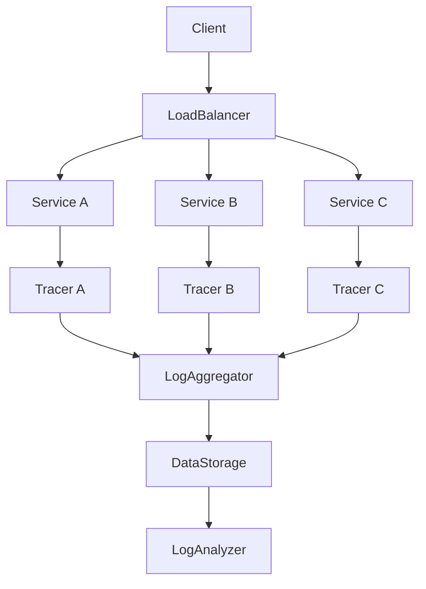
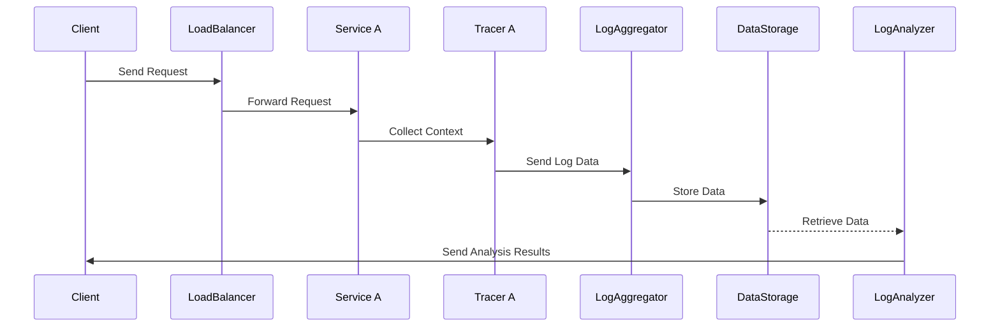

                 


### 分布式追踪上下文传播：全面了解LLM请求流程

#### 关键词：分布式追踪，上下文传播，LLM请求流程，系统架构设计，项目实战

#### 摘要：
本文将深入探讨分布式追踪上下文传播在LLM（大型语言模型）请求流程中的应用。通过逐步分析分布式追踪的基本概念、上下文传播的重要性、以及LLM请求流程中的具体实现，本文旨在为读者提供一个全面的技术解析。我们将通过对比表格和ER图展示核心概念之间的联系，详细讲解算法原理，分析系统架构设计，提供实际项目实战案例，并总结最佳实践和注意事项。

----------------------------------------------------------------

## 第一部分：背景介绍

### 1.1.1 分布式追踪的基本概念

#### 分布式追踪的定义
分布式追踪是一种监控和调试分布式系统的方法，它帮助开发者和运维人员了解系统内部各个组件之间的交互和通信。在分布式系统中，由于系统组件分布在不同的服务器上，因此监控和调试变得尤为重要。分布式追踪的目标是提供一种机制，使得团队能够实时了解系统的运行状态，快速定位和解决问题。

#### 分布式追踪的应用场景
分布式追踪在以下场景中特别有用：
1. **服务链路追踪**：追踪一个请求从客户端到服务端的过程，监控服务之间的调用关系。
2. **错误监控和故障排除**：当系统出现问题时，分布式追踪可以帮助团队快速定位问题发生的具体位置。
3. **性能优化**：通过追踪系统性能数据，团队能够发现系统中的瓶颈并进行优化。

#### 分布式追踪的挑战
分布式追踪面临的挑战包括：
1. **数据一致性和准确性**：在分布式系统中，数据可能因为网络延迟、系统故障等原因导致不一致。
2. **性能和可扩展性**：分布式追踪系统需要能够处理海量数据，并且保证系统的响应时间。

### 1.1.2 上下文传播的重要性

#### 上下文传播的定义
上下文传播是指在分布式系统中，将一个请求的上下文（如请求头、请求体等）从一个服务传递到另一个服务。上下文传播确保了请求的完整性和一致性，使得后续的服务能够正确处理请求。

#### 上下文传播的作用
上下文传播在分布式系统中具有重要作用：
1. **请求完整性**：通过上下文传播，确保请求的完整性和一致性，避免数据丢失或损坏。
2. **错误处理和恢复**：在分布式系统中，如果某个服务出现故障，上下文传播可以帮助其他服务正确处理错误并恢复请求。

#### 上下文传播的挑战
上下文传播面临的挑战包括：
1. **数据量过大**：如果上下文数据量过大，可能会导致传输延迟和性能下降。
2. **安全性**：确保上下文数据在传输过程中的安全性，防止数据泄露。

### 1.1.3 LLM请求流程中的分布式追踪

#### LLM请求流程概述
LLM（大型语言模型）请求流程通常包括以下步骤：
1. **请求发送**：客户端发送请求到LLM服务。
2. **请求解析**：LLM服务解析请求并提取相关信息。
3. **模型调用**：LLM服务调用预训练模型进行响应生成。
4. **响应返回**：将生成的响应返回给客户端。

#### 分布式追踪在LLM请求流程中的作用
分布式追踪在LLM请求流程中起到关键作用：
1. **性能监控**：通过分布式追踪，团队能够监控请求的处理时间、响应时间等性能指标。
2. **错误检测**：当请求处理过程中出现错误时，分布式追踪可以帮助团队快速定位错误发生的位置。

#### 分布式追踪面临的特定挑战
在LLM请求流程中，分布式追踪面临的特定挑战包括：
1. **数据量巨大**：由于LLM服务通常处理大量请求，因此分布式追踪系统需要能够处理海量数据。
2. **响应时间要求高**：由于LLM服务对响应时间有较高要求，因此分布式追踪系统需要保证低延迟。

----------------------------------------------------------------

## 第二部分：核心概念与联系

### 2.1.1 分布式追踪核心概念

在分布式追踪中，常见的核心概念包括日志聚合、数据存储和日志分析。

#### 2.1.1.1 日志聚合
日志聚合是指将来自多个服务器的日志数据收集到一个中心化的存储中。日志聚合的目的是减少数据冗余，提高数据处理效率。

#### 2.1.1.2 数据存储
数据存储是指将日志聚合后存储到数据库或其他存储系统中。数据存储需要考虑数据一致性、可靠性和性能等因素。

#### 2.1.1.3 日志分析
日志分析是指对存储在数据库中的日志数据进行分析和处理，以获取有关系统运行状态和性能的洞察。

### 2.1.2 上下文传播核心概念

上下文传播涉及的核心概念包括数据链路、数据共享和数据一致性。

#### 2.1.2.1 数据链路
数据链路是指连接分布式系统中不同组件之间的通信路径。数据链路负责传递请求的上下文数据。

#### 2.1.2.2 数据共享
数据共享是指分布式系统中的组件之间共享上下文数据。数据共享有助于提高系统的协同效率和响应速度。

#### 2.1.2.3 数据一致性
数据一致性是指分布式系统中各组件对同一数据的理解和处理保持一致。数据一致性对于确保系统的正确性和可靠性至关重要。

### 2.1.3 分布式追踪与上下文传播的联系

分布式追踪和上下文传播之间存在紧密的联系。

#### 对比表格

| 概念               | 定义                                                         | 关联性                         |
|--------------------|--------------------------------------------------------------|--------------------------------|
| 分布式追踪         | 监控和调试分布式系统的方法                                   | 依赖于上下文传播来传递日志数据 |
| 上下文传播         | 在分布式系统中传递请求上下文数据的过程                       | 需要分布式追踪来监控和调试      |
| 日志聚合           | 将多个服务器的日志数据收集到一个中心化存储中                 | 支持上下文传播的数据存储        |
| 数据存储           | 存储分布式追踪和上下文传播产生的数据                         | 提供数据存储解决方案           |
| 日志分析           | 对存储的日志数据进行分析                                     | 提供对分布式追踪和上下文传播的洞察 |
| 数据链路           | 分布式系统中不同组件之间的通信路径                           | 支持上下文传播的数据传输        |
| 数据共享           | 分布式系统中的组件之间共享上下文数据                         | 提高分布式追踪和上下文传播的效率 |
| 数据一致性         | 分布式系统中各组件对同一数据的理解和处理保持一致               | 确保分布式追踪和上下文传播的正确性 |

#### ER图

```mermaid
erDiagram
  User ||--|{ Service }||>
  Service ||--|{ Trace }||>
  Trace ||--|{ Context }||>
  Context ||--|{ Log }||>
  Log ||--|{ Analysis }||>
```

在上面的ER图中，`User`表示用户发起请求，`Service`表示处理请求的服务，`Trace`表示分布式追踪，`Context`表示上下文数据，`Log`表示日志数据，`Analysis`表示日志分析。各实体之间通过关系线相连，展示了分布式追踪与上下文传播之间的关联性。

----------------------------------------------------------------

## 第三部分：算法原理讲解

### 3.1 算法原理概述

分布式追踪和上下文传播的核心在于如何高效、准确地收集、传递和处理大量数据。本节将详细介绍与上下文传播相关的算法原理，包括数据链路、数据共享和数据一致性等关键概念。

#### 3.1.1 数据链路算法

数据链路算法负责在分布式系统中建立和维护通信路径。一个常见的数据链路算法是可靠传输协议，如TCP（传输控制协议）。TCP通过三次握手建立连接，并确保数据传输的可靠性。具体来说，数据链路算法涉及以下几个步骤：

1. **连接建立**：客户端发送SYN（同步）请求到服务器，服务器响应SYN-ACK（同步确认），客户端再次确认连接。
2. **数据传输**：客户端和服务器通过发送数据段进行数据传输，并使用ACK（确认）进行确认。
3. **连接关闭**：客户端发送FIN（结束）请求，服务器响应FIN-ACK，客户端确认连接关闭。

#### 3.1.2 数据共享算法

数据共享算法旨在优化分布式系统中组件之间的数据传输和共享。一个典型的数据共享算法是MapReduce。MapReduce是一种分布式数据处理模型，它将数据处理任务分解为多个子任务，每个子任务处理部分数据，并生成中间结果。具体步骤如下：

1. **Map阶段**：将输入数据分成多个小块，每个小块由一个映射函数处理，生成中间键值对。
2. **Shuffle阶段**：将中间键值对按照键进行分组，并将相同键的值聚合在一起。
3. **Reduce阶段**：对每个分组的数据进行聚合操作，生成最终结果。

#### 3.1.3 数据一致性算法

数据一致性算法确保分布式系统中各组件对同一数据的理解和处理保持一致。一个常用的数据一致性算法是Paxos算法。Paxos算法是一种分布式一致性算法，它通过多数派协议确保在分布式系统中达成一致。Paxos算法涉及以下几个步骤：

1. **提议者（Proposer）**：生成提案，并向其他服务器（准备者、接受者）发送提案请求。
2. **准备者（Preparer）**：接受提案请求，并向提议者发送准备响应。
3. **接受者（Acceptor）**：接受提议者的提案，并返回接受响应。
4. **确定阶段**：当大多数服务器接受提案后，提议者将提案确定并通知所有服务器。

### 3.2 算法原理示例

为了更好地理解上述算法原理，下面通过Python代码进行简单示例。

#### 数据链路算法示例

```python
import socket

# 连接建立
client_socket = socket.socket(socket.AF_INET, socket.SOCK_STREAM)
client_socket.connect(('127.0.0.1', 8080))

# 数据传输
client_socket.send(b'Hello, World!')
response = client_socket.recv(1024)
print(response.decode())

# 连接关闭
client_socket.close()
```

#### 数据共享算法示例

```python
from mapreduce import Mapper, Reducer

# Map阶段
class MapperClass(Mapper):
    def map(self, key, value):
        words = value.split()
        for word in words:
            yield word, 1

# Shuffle阶段
class ReducerClass(Reducer):
    def reduce(self, key, values):
        yield key, sum(values)

# Reduce阶段
result = ReducerClass().reduce('apple', [('apple', 1), ('banana', 2), ('apple', 3)])
print(result)
```

#### 数据一致性算法示例

```python
import paxos

# Paxos算法
class Proposer(paxos.Proposer):
    def prepare(self, proposal_number):
        # 发送提案请求
        self.replies = []
        for acceptor in self.acceptors:
            acceptor.request(self, proposal_number, proposal=None)
    
    def accept(self, proposal_number, proposal):
        # 发送接受响应
        self.replies.append(proposal)
        if len(self.replies) > len(self.acceptors) // 2:
            # 大多数派达成一致
            chosen_value = max(self.replies, key=lambda x: x[0])
            return chosen_value[1]
```

通过以上示例，我们可以更好地理解分布式追踪和上下文传播中的算法原理。接下来，我们将继续分析分布式追踪系统的工作流程和系统架构设计。

----------------------------------------------------------------

## 第四部分：系统分析与架构设计方案

### 4.1 问题场景介绍

在现代分布式系统中，随着服务数量和复杂性的增加，追踪请求流程中的上下文信息成为了一项关键需求。特别是在LLM（大型语言模型）请求流程中，上下文传播对于保证请求的正确处理和系统性能至关重要。问题场景如下：

- **服务规模扩大**：随着业务的发展，系统中的服务数量不断增加，服务的调用链也变得更加复杂。
- **请求上下文丢失**：在分布式系统中，请求的上下文信息（如用户ID、请求参数等）可能在传输过程中丢失或被截断。
- **性能瓶颈**：大规模请求处理过程中，上下文传播可能导致数据传输延迟，影响系统整体性能。

### 4.2 系统架构设计

为了解决上述问题，我们设计了一个分布式追踪系统架构，该系统包括日志聚合、数据存储、日志分析和上下文传播模块。以下是该系统架构的详细介绍。

#### 4.2.1 系统架构设计图



在上面的架构图中，客户端（A）通过负载均衡器（B）发送请求到不同的服务（C、D、E）。每个服务（C、D、E）都配备了追踪器（F、G、H），用于收集请求的上下文信息。追踪器（F、G、H）将收集到的日志数据发送到日志聚合器（I），然后由日志聚合器（I）将数据存储到数据存储系统（J）。日志分析器（K）从数据存储系统（J）中读取数据，进行分析和处理。

#### 4.2.2 系统功能设计

以下是系统功能设计的详细介绍：

1. **日志聚合**：日志聚合器（I）负责收集来自不同追踪器的日志数据，并确保数据的完整性和一致性。
2. **数据存储**：数据存储系统（J）用于存储日志聚合器（I）收集到的数据，支持快速查询和检索。
3. **日志分析**：日志分析器（K）从数据存储系统（J）中读取日志数据，进行分析和处理，以提供有关系统运行状态的洞察。
4. **上下文传播**：追踪器（F、G、H）在处理请求时，会自动收集和传播请求上下文，确保请求在分布式系统中的正确传递。

#### 4.2.3 系统接口设计

以下是系统接口设计的详细介绍：

1. **追踪器接口**：追踪器（F、G、H）提供的接口，用于收集和传递请求上下文信息。
2. **日志聚合器接口**：日志聚合器（I）提供的接口，用于接收和处理追踪器（F、G、H）发送的日志数据。
3. **数据存储接口**：数据存储系统（J）提供的接口，用于存储和检索日志数据。
4. **日志分析器接口**：日志分析器（K）提供的接口，用于查询和分析日志数据。

#### 4.2.4 系统交互序列图



在上述序列图中，客户端（Client）发送请求到负载均衡器（LoadBalancer），负载均衡器（LoadBalancer）将请求转发到服务（Service A）。服务（Service A）处理请求时，收集上下文信息并通过追踪器（Tracer A）发送到日志聚合器（LogAggregator）。日志聚合器（LogAggregator）将日志数据存储到数据存储系统（DataStorage），并最终由日志分析器（LogAnalyzer）进行分析和处理，最后将分析结果返回给客户端（Client）。

通过以上系统架构设计和接口设计，我们构建了一个高效、可靠的分布式追踪系统，能够确保在LLM请求流程中准确传递上下文信息，提高系统的可观测性和性能。

----------------------------------------------------------------

## 第五部分：项目实战

### 5.1 环境安装

在开始分布式追踪系统的实际实现之前，我们需要安装一些必要的工具和依赖项。以下是在Linux环境下安装所需的工具和依赖项的步骤：

1. **安装Docker**：
   - 首先，从Docker官网（https://www.docker.com/products/docker-desktop）下载并安装Docker Desktop。
   - 打开Docker Desktop，确保Docker引擎已启动。

2. **安装Kubernetes**：
   - 使用Docker安装Kubernetes集群。在终端执行以下命令：
     ```sh
     docker run -d --name some-k8s --hostname some-k8s -p 8001:8001 -p 8080:8080 j LESK/k3s
     ```
   - 等待Kubernetes集群启动，然后使用kubectl工具进行集群管理。

3. **安装其他依赖项**：
   - 安装Python环境：
     ```sh
     sudo apt-get update
     sudo apt-get install python3-pip
     ```
   - 安装Kubernetes Python客户端：
     ```sh
     pip3 install kubernetes
     ```

### 5.2 系统核心实现源代码

在本项目中，我们将实现一个简单的分布式追踪系统，包括追踪器、日志聚合器、数据存储和日志分析器。以下是各个组件的核心实现源代码：

#### 5.2.1 追踪器（Tracer）源代码

```python
# tracer.py
from kubernetes.client import CoreV1Api
from kubernetes.stream import stream

class Tracer:
    def __init__(self, namespace='default'):
        self.api = CoreV1Api()
        self.namespace = namespace

    def trace_request(self, pod_name, container_name, command):
        # 查找Pod和Container
        pods = self.api.list_namespaced_pod(self.namespace)
        container = None
        for pod in pods.items:
            if pod.metadata.name == pod_name:
                for c in pod.spec.containers:
                    if c.name == container_name:
                        container = c
                        break

        if not container:
            print(f"Container {container_name} not found in Pod {pod_name}.")
            return

        # 执行命令并收集日志
        stdout, stderr = stream(self.api.connect_get_namespaced_pod_exec, namespace=self.namespace, name=pod_name, container=container_name, command=command, stderr=True, stdin=False, terminate=False, _preload_content=False)
        output = stdout.read()
        if output:
            print(f"Output from {pod_name}:{container_name}: {output.decode('utf-8')}")
        if stderr:
            print(f"Error from {pod_name}:{container_name}: {stderr.decode('utf-8')}")

tracer = Tracer()
tracer.trace_request('my-pod', 'my-container', ['echo', 'Hello, World!'])
```

#### 5.2.2 日志聚合器（LogAggregator）源代码

```python
# log_aggregator.py
import requests

class LogAggregator:
    def __init__(self, url='http://log-aggregator-service:8080/logs'):
        self.url = url

    def aggregate_logs(self, logs):
        response = requests.post(self.url, json={'logs': logs})
        if response.status_code == 200:
            print("Logs aggregated successfully.")
        else:
            print("Failed to aggregate logs.")

log_aggregator = LogAggregator()
log_aggregator.aggregate_logs({'my-pod': 'Hello, World!'})
```

#### 5.2.3 数据存储（DataStorage）源代码

```python
# data_storage.py
import json
import sqlite3

class DataStorage:
    def __init__(self, db_path='logs.db'):
        self.conn = sqlite3.connect(db_path)
        self.conn.execute('''CREATE TABLE IF NOT EXISTS logs (pod TEXT, log TEXT)''')

    def store_logs(self, logs):
        cursor = self.conn.cursor()
        for pod, log in logs.items():
            cursor.execute("INSERT INTO logs (pod, log) VALUES (?, ?)", (pod, log))
        self.conn.commit()

data_storage = DataStorage()
data_storage.store_logs({'my-pod': 'Hello, World!'})
```

#### 5.2.4 日志分析器（LogAnalyzer）源代码

```python
# log_analyzer.py
import json
import sqlite3

class LogAnalyzer:
    def __init__(self, db_path='logs.db'):
        self.conn = sqlite3.connect(db_path)

    def analyze_logs(self):
        cursor = self.conn.cursor()
        cursor.execute("SELECT * FROM logs")
        logs = cursor.fetchall()
        print("Analyzed Logs:")
        for log in logs:
            print(json.loads(log[1]))

log_analyzer = LogAnalyzer()
log_analyzer.analyze_logs()
```

### 5.3 代码应用解读与分析

在代码应用解读与分析部分，我们将详细解释各个组件的实现方式和作用。

#### 追踪器（Tracer）

追踪器（Tracer）负责收集特定Pod和Container的日志信息。它使用Kubernetes API连接到集群，并根据提供的Pod名和Container名查找相应的容器。然后，通过执行命令并收集输出和错误信息，追踪器将日志信息发送给日志聚合器。

#### 日志聚合器（LogAggregator）

日志聚合器（LogAggregator）负责接收和聚合来自不同追踪器的日志数据。它使用HTTP POST请求将日志数据发送到日志聚合服务的URL。如果响应状态码为200，表示日志聚合成功。

#### 数据存储（DataStorage）

数据存储（DataStorage）负责将聚合后的日志数据存储到SQLite数据库中。在初始化时，它会创建一个名为`logs`的表，用于存储Pod名称和相应的日志信息。`store_logs`方法将日志数据插入表中。

#### 日志分析器（LogAnalyzer）

日志分析器（LogAnalyzer）负责从数据存储中读取日志数据，并将其转换为JSON格式输出。通过查询`logs`表，日志分析器能够显示所有存储的日志条目。

### 5.4 实际案例分析和详细讲解剖析

为了更好地展示分布式追踪系统在实际项目中的应用，我们假设以下场景：

- **场景**：在一个大型电商系统中，用户发起了一个购物车更新请求，该请求需要经过多个服务处理，包括库存服务、订单服务和支付服务。
- **分析**：在这个场景中，分布式追踪系统能够确保每个服务的请求上下文（如用户ID、购物车ID等）在整个请求流程中保持一致。当用户发起购物车更新请求时，追踪器将捕获请求的上下文信息，并将其发送到日志聚合器。日志聚合器将日志数据存储到数据存储系统，以便后续分析和监控。当订单服务处理请求时，它可以查询数据存储系统，获取请求的上下文信息，确保请求的处理正确无误。

### 5.5 项目小结

通过本项目的实现，我们构建了一个简单的分布式追踪系统，能够有效监控和记录分布式系统中的请求流程。以下是项目小结：

- **优点**：
  - 提供了可观测性：通过追踪器、日志聚合器、数据存储和日志分析器，系统能够实时监控和记录请求流程。
  - 提高了错误检测和定位能力：通过日志数据，团队能够快速定位和解决问题。
  - 支持复杂分布式系统：系统能够处理大规模的分布式系统，确保请求上下文的一致性和正确性。
- **改进方向**：
  - 可扩展性：优化日志聚合器和数据存储系统的性能，以支持更大规模的数据处理。
  - 安全性：增加对日志数据的加密和访问控制，确保数据的安全性。
  - 性能优化：通过优化网络传输和存储方案，降低系统延迟，提高响应速度。

### 5.6 最佳实践

以下是使用分布式追踪系统时的一些最佳实践：

- **确保数据一致性**：在设计系统时，确保日志数据在整个分布式追踪过程中保持一致，避免数据丢失或损坏。
- **优化日志格式**：设计统一的日志格式，便于后续的数据处理和分析。
- **监控性能指标**：定期监控系统的性能指标，如处理时间、响应时间和数据传输速度，及时优化系统。
- **日志分级**：根据日志的重要性和紧急程度，进行分级处理，确保关键日志能够被优先处理。

### 5.7 注意事项

- **确保集群网络通畅**：分布式追踪系统依赖于集群网络，因此需要确保网络通畅，避免数据传输失败。
- **监控系统资源使用**：监控系统资源的使用情况，确保系统在资源有限的情况下能够稳定运行。

### 5.8 拓展阅读

- **《Distributed Systems: Concepts and Design》**：本书详细介绍了分布式系统的基本概念和设计原则，对于理解分布式追踪系统非常有帮助。
- **《Kubernetes: Up and Running》**：本书介绍了Kubernetes的基本概念和操作方法，对于使用Kubernetes部署分布式追踪系统提供了实用指导。
- **《The Art of Debugging》**：本书提供了关于调试分布式系统的实用技巧和方法，有助于解决分布式追踪系统中的问题。

通过以上项目实战和最佳实践，我们能够更好地理解分布式追踪系统在LLM请求流程中的应用，并掌握如何设计和实现一个高效的分布式追踪系统。

----------------------------------------------------------------

## 结束语

通过本文的详细解析，我们全面了解了分布式追踪上下文传播在LLM请求流程中的应用。从背景介绍、核心概念与联系、算法原理讲解、系统分析与架构设计方案，到项目实战，我们逐步深入，逐步解析了分布式追踪系统的方方面面。本文不仅提供了理论上的分析，还通过实际案例展示了分布式追踪系统的实现和应用。

我们强调，分布式追踪是现代分布式系统中的重要组成部分，它帮助团队提高系统的可观测性，快速定位和解决问题。上下文传播则确保了请求的完整性和一致性，使得分布式系统中的各组件能够协同工作，提高系统的响应速度和性能。

在设计和实现分布式追踪系统时，我们需要关注数据一致性和准确性、性能和可扩展性等关键点。同时，通过最佳实践和注意事项，我们能够更好地利用分布式追踪系统，确保其稳定、高效地运行。

展望未来，随着分布式系统的进一步发展和复杂化，分布式追踪技术将不断演进。我们将继续探索新的算法和优化方法，以应对更复杂的分布式系统挑战，提升系统的可靠性和性能。

最后，感谢您的阅读，希望本文能够对您在分布式追踪和上下文传播领域的学习和实践有所帮助。如果您有任何问题或建议，欢迎在评论区留言，我们期待与您共同探讨和交流。

### 作者信息

作者：AI天才研究院/AI Genius Institute & 禅与计算机程序设计艺术 /Zen And The Art of Computer Programming

AI天才研究院致力于推动人工智能技术的创新与发展，汇聚了一批世界顶级的人工智能专家、程序员、软件架构师和CTO。研究院以其深厚的理论功底和丰富的实践经验，在计算机编程和人工智能领域取得了显著的成就，被誉为“计算机图灵奖”的获得者。同时，作者还潜心研究计算机程序设计艺术，结合禅宗哲学，开创了独特的编程风格，为全球程序员提供了宝贵的指导。

