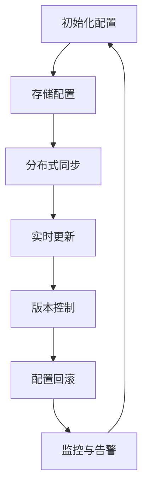
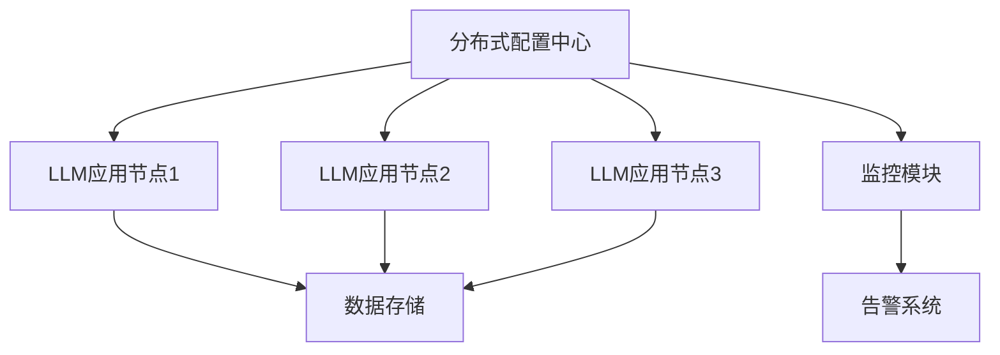
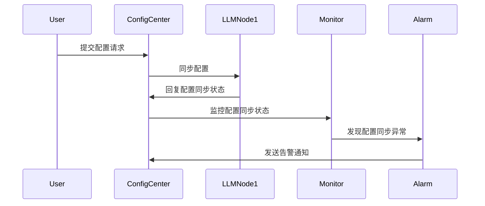

                 

### 背景介绍

在现代分布式系统中，配置管理的复杂性不断增加，尤其是在处理大规模、跨地域的应用时。分布式配置中心作为一种解决方案，应运而生。其核心作用在于集中管理和动态配置分布式系统中的各个组件，以简化配置的更新和维护过程，提高系统的灵活性和可维护性。

分布式配置中心的重要性不可忽视。首先，它解决了配置信息分散、更新困难的问题。传统的配置管理通常需要手动更新每个节点的配置文件，不仅效率低下，而且容易出错。分布式配置中心通过集中存储和分发配置信息，实现了配置的自动化管理，大大降低了运维成本。其次，它支持配置的实时更新，使系统能够快速适应业务变化，提高系统的响应速度。最后，分布式配置中心提供了配置版本控制，便于追溯和回滚配置变更，提高了系统的可靠性。

本文将探讨分布式配置中心如何简化大型语言模型（LLM）的应用管理。首先，我们将介绍分布式配置中心和LLM的相关背景，解释其重要性。接下来，本文将详细讨论分布式配置中心简化LLM应用管理的问题背景、问题描述、问题解决、边界与外延。

### 分布式配置中心

分布式配置中心是一种集中化、分布式配置管理系统，用于管理分布式系统中各个组件的配置信息。其主要功能包括配置信息的存储、分发和更新。与传统配置管理相比，分布式配置中心具有以下几个显著特点：

**1. 集中管理**：分布式配置中心通过一个统一的接口，集中管理分布式系统中的所有配置信息。这种集中式管理不仅简化了配置的更新过程，还提高了配置的可维护性和可追踪性。

**2. 分布式存储**：配置信息存储在分布式存储系统中，以确保高可用性和高可靠性。当某个存储节点出现故障时，系统可以自动切换到其他健康节点，从而保证配置信息的持续可用。

**3. 实时更新**：分布式配置中心支持配置信息的实时更新，这意味着系统组件可以立即接收到最新的配置信息，而不需要重新启动或手动更新配置文件。这大大提高了系统的响应速度和灵活性。

**4. 版本控制**：分布式配置中心提供了配置版本的版本控制功能，用户可以查看历史版本，并回滚到之前的版本。这种版本控制机制有助于追溯配置变更，并在出现问题时快速恢复到稳定状态。

**5. 扩展性强**：分布式配置中心支持多种配置数据格式，如JSON、YAML、properties等，并支持自定义配置数据类型。这使得分布式配置中心能够适应不同的应用场景和业务需求。

总的来说，分布式配置中心通过集中管理、分布式存储、实时更新、版本控制和扩展性等特点，简化了分布式系统的配置管理过程，提高了系统的灵活性和可维护性。

### 什么是LLM

大型语言模型（Large Language Model，简称LLM）是一种基于深度学习的自然语言处理（NLP）模型，通过对海量文本数据进行训练，能够理解和生成人类语言。LLM的主要功能包括文本生成、文本分类、机器翻译、情感分析等，广泛应用于人工智能助手、智能客服、内容生成、自动摘要等领域。

LLM的发展历程可以追溯到2018年，当时谷歌发布了BERT模型，标志着NLP领域的重要突破。此后，随着计算资源和数据量的增加，LLM模型不断演进，参数规模从数十亿增长到数千亿。2020年，OpenAI发布了GPT-3模型，参数规模达到1750亿，标志着LLM进入了一个新的时代。

LLM的核心技术主要包括：

**1. 基于Transformer的架构**：Transformer是一种基于自注意力机制的深度神经网络结构，相比传统的循环神经网络（RNN）和卷积神经网络（CNN），具有更好的并行处理能力和长距离依赖建模能力。

**2. 自适应学习率**：LLM通常使用自适应学习率优化算法，如Adam和AdamW，以加快收敛速度和提高模型性能。

**3. 多样性训练**：为了提高生成文本的多样性和质量，LLM在训练过程中采用多样性训练策略，如样本重放、温度调节等。

**4. 上下文理解**：LLM通过对大量文本数据的学习，能够理解上下文关系和语义信息，从而生成更符合人类语言的文本。

**5. 实时更新和微调**：LLM模型通常需要定期更新和微调，以适应不断变化的文本数据和应用需求。分布式配置中心在LLM应用管理中发挥着重要作用，通过实时更新配置，确保模型能够快速响应业务变化。

总的来说，LLM作为一种强大的自然语言处理工具，在人工智能领域具有重要的应用价值。然而，其应用管理复杂度高，分布式配置中心的出现为简化LLM应用管理提供了有效解决方案。

### 问题背景

随着人工智能技术的发展，大型语言模型（LLM）在各类应用中得到了广泛应用。然而，LLM的应用管理复杂度高，涉及多个方面，包括模型训练、部署、监控和更新等。传统的应用管理方式往往需要手动干预，不仅效率低下，而且容易出现错误。分布式配置中心的引入，为简化LLM应用管理提供了新的思路。

**问题描述**：

1. **配置管理复杂度高**：LLM应用通常涉及大量的配置信息，包括模型参数、训练数据、部署环境等。这些配置信息分散在多个系统中，难以统一管理。传统的配置管理方式需要手动更新每个节点的配置文件，不仅耗时耗力，而且容易出现错误。

2. **部署困难**：LLM应用通常需要大规模的计算资源和存储资源，部署过程复杂。传统的部署方式需要逐个节点进行配置和部署，不仅效率低下，而且难以保证一致性。

3. **监控和维护困难**：LLM应用在运行过程中需要进行实时监控和维护，包括模型性能监控、资源监控、故障处理等。传统的监控和维护方式依赖于人工巡检和告警，难以实现自动化和实时化。

4. **版本控制困难**：LLM应用需要进行定期更新和版本控制，以适应不断变化的业务需求。传统的版本控制方式依赖于手动备份和恢复，不仅效率低下，而且容易出现数据丢失。

**问题解决**：

分布式配置中心通过集中管理、分布式存储、实时更新和版本控制等特点，简化了LLM应用管理的过程。具体解决措施如下：

1. **集中管理配置**：分布式配置中心提供了一个统一的接口，集中管理LLM应用的所有配置信息，包括模型参数、训练数据、部署环境等。通过配置中心，可以轻松实现配置的更新和管理，减少手动干预。

2. **自动化部署**：分布式配置中心支持自动化部署，通过配置中心可以一键部署LLM应用，确保各节点配置的一致性。同时，配置中心提供了版本控制功能，可以方便地进行回滚和更新。

3. **实时监控和维护**：分布式配置中心集成了监控模块，可以对LLM应用进行实时监控和维护。通过监控模块，可以实时获取模型性能、资源使用情况等信息，并及时处理故障。

4. **版本控制和备份**：分布式配置中心提供了版本控制功能，可以方便地进行配置的备份和恢复。通过配置中心，可以轻松实现配置的回滚和更新，确保系统的稳定运行。

**边界与外延**：

分布式配置中心在简化LLM应用管理方面具有显著优势，但其适用范围和边界也需要明确。

1. **适用范围**：分布式配置中心适用于需要集中管理和动态配置的大型分布式系统，尤其是涉及大量配置信息和频繁更新的场景。在LLM应用管理中，分布式配置中心可以简化配置管理、部署、监控和版本控制等过程。

2. **外延**：分布式配置中心可以与其他系统和服务集成，如监控工具、日志系统、容器编排系统等，以实现更全面的系统管理。此外，分布式配置中心还可以扩展支持多种配置数据格式和协议，以适应不同的应用场景和业务需求。

总的来说，分布式配置中心为简化LLM应用管理提供了有效解决方案。通过集中管理、自动化部署、实时监控和版本控制，分布式配置中心显著降低了应用管理的复杂度，提高了系统的灵活性和可维护性。

### 核心概念与联系

在探讨分布式配置中心如何简化LLM应用管理之前，我们需要了解一些核心概念，并对比它们的属性特征，以建立一个清晰的概念框架。

**分布式配置中心**：分布式配置中心是一个集中式、分布式配置管理系统，用于管理分布式系统中的配置信息。其主要功能包括配置信息的存储、分发和更新。分布式配置中心通常支持多种配置数据格式，如JSON、YAML等，并提供实时更新和版本控制功能。

**大型语言模型（LLM）**：LLM是一种基于深度学习的自然语言处理模型，通过对大量文本数据进行训练，能够理解和生成人类语言。LLM的主要功能包括文本生成、文本分类、机器翻译等。LLM通常使用基于Transformer的架构，并采用自适应学习率优化算法和多样性训练策略。

**应用管理**：应用管理是指对软件应用从开发、部署、运行到维护的全生命周期管理。在LLM应用中，应用管理涉及模型训练、部署、监控和更新等过程。应用管理的目标是确保应用的高效运行和稳定维护。

**属性特征对比表**：

| 概念       | 属性特征                | 关联关系                                       |
|------------|------------------------|----------------------------------------------|
| 分布式配置中心 | 集中管理、分布式存储、实时更新、版本控制 | 管理LLM应用的配置信息                     |
| LLM         | 基于Transformer架构、自适应学习率、多样性训练 | 使用分布式配置中心进行配置和更新     |
| 应用管理     | 开发、部署、监控、更新    | 利用分布式配置中心简化管理过程             |

**ER实体关系图**：

为了更直观地展示这些核心概念之间的关联，我们可以使用Mermaid绘制ER实体关系图。以下是ER实体关系图的Markdown格式表示：

```mermaid
erDiagram
  ConfigCenter ||--|{ LLM : 使用 }
  LLM ||--|{ ApplicationManagement : 管理过程 }
  ApplicationManagement ||--|{ ConfigCenter : 配置 }
```

在这个ER实体关系图中，`ConfigCenter`（分布式配置中心）是核心，它管理LLM的配置信息，而`LLM`（大型语言模型）是应用管理的主要对象，`ApplicationManagement`（应用管理）过程利用分布式配置中心简化管理。

通过以上核心概念与联系的分析，我们可以更好地理解分布式配置中心如何简化LLM应用管理，以及各概念之间的内在关联。

### 分布式配置中心的算法原理

为了深入理解分布式配置中心如何简化LLM应用管理，我们需要从算法原理入手，详细分析其工作流程、数学模型以及具体的实现方法。

#### 算法流程图

首先，我们可以使用Mermaid绘制分布式配置中心的算法流程图，以直观地展示其工作流程。以下是算法流程图的Markdown格式表示：



在这个流程图中，各个步骤的详细描述如下：

1. **初始化配置**：在系统启动时，分布式配置中心会初始化配置信息。这些配置信息包括模型参数、训练数据、部署环境等。
2. **存储配置**：初始化后的配置信息被存储在分布式配置中心的存储系统中。这些存储系统通常具备高可用性和高可靠性，以确保配置信息的安全存储。
3. **分布式同步**：配置信息在各个节点之间进行分布式同步，以确保所有节点的配置信息一致性。分布式同步过程通过心跳机制和增量更新实现，以减少网络开销。
4. **实时更新**：分布式配置中心支持配置信息的实时更新。当配置发生变更时，配置中心会立即通知相关节点，节点根据最新配置进行更新。
5. **版本控制**：分布式配置中心提供了版本控制功能，用户可以查看历史版本并回滚到特定版本。版本控制机制有助于追溯配置变更，并在出现问题时快速恢复。
6. **配置回滚**：在配置更新失败或出现问题时，分布式配置中心支持配置回滚，将系统恢复到上一个稳定版本。
7. **监控与告警**：分布式配置中心集成了监控模块，对配置信息的存储、同步和更新过程进行实时监控，并在出现异常时发送告警。

#### Python源代码

接下来，我们将使用Python源代码详细阐述分布式配置中心的核心算法原理。以下是一个简化的示例：

```python
import json
import threading
import time

class ConfigCenter:
    def __init__(self):
        self.configs = {}
        self.lock = threading.Lock()
    
    def store_config(self, key, value):
        with self.lock:
            self.configs[key] = value
            print(f"Storing config: {key} = {value}")
    
    def sync_configs(self):
        while True:
            with self.lock:
                # 模拟从其他节点同步配置
                remote_configs = {'model_version': 'v2.0'}
                self.configs.update(remote_configs)
                print(f"Synchronized configs: {remote_configs}")
            
            time.sleep(60)  # 每分钟同步一次

    def update_config(self, key, value):
        with self.lock:
            self.configs[key] = value
            print(f"Updating config: {key} = {value}")
    
    def rollback_config(self, key, version):
        with self.lock:
            if version in self.configs[key]:
                self.configs[key] = version
                print(f"Rolled back config {key} to version {version}")
            else:
                print(f"Invalid version {version} for key {key}")

    def run(self):
        sync_thread = threading.Thread(target=self.sync_configs)
        sync_thread.start()
        
        while True:
            # 示例：实时更新模型版本
            self.update_config('model_version', 'v3.0')
            time.sleep(10)

if __name__ == "__main__":
    config_center = ConfigCenter()
    config_center.run()
```

在这个示例中，`ConfigCenter` 类负责管理配置信息的存储、同步、更新和回滚。其中，`store_config` 方法用于存储配置信息，`sync_configs` 方法用于分布式同步，`update_config` 方法用于实时更新配置信息，`rollback_config` 方法用于配置回滚。

#### 数学模型与公式

分布式配置中心的算法原理还可以用数学模型和公式进行描述。以下是一个简化的数学模型：

$$
\text{配置同步算法} = f(\text{配置变更}, \text{心跳机制}, \text{增量更新})
$$

其中，配置变更是指配置信息的更新，心跳机制用于检测配置变更并触发同步，增量更新用于减少同步过程中的网络开销。

#### 举例说明

为了更清晰地说明分布式配置中心的算法原理，我们来看一个实际应用场景：

假设一个分布式系统中有三个节点A、B和C，每个节点都需要配置相同的模型参数。在初始化阶段，节点A的配置中心存储了初始参数：

$$
\text{model_params}_{A} = \{ "learning_rate": 0.01, "batch_size": 64 \}
$$

节点B和C的配置信息与节点A相同。在运行过程中，节点B的配置中心接收到新的配置变更通知，更新参数如下：

$$
\text{model_params}_{B} = \{ "learning_rate": 0.001, "batch_size": 128 \}
$$

分布式配置中心通过心跳机制检测到配置变更，并触发增量更新，将新配置同步到节点A和C。最终，三个节点的配置信息保持一致：

$$
\text{model_params}_{A} = \text{model_params}_{B} = \text{model_params}_{C} = \{ "learning_rate": 0.001, "batch_size": 128 \}
$$

通过这个例子，我们可以看到分布式配置中心如何简化LLM应用管理，确保所有节点配置的一致性。

### 系统分析与架构设计方案

在理解了分布式配置中心的算法原理后，我们将进一步分析其系统架构设计，包括问题场景、项目背景、系统功能设计、系统架构设计、系统接口设计以及系统交互序列图。

#### 问题场景和项目背景

假设我们正在开发一个基于大型语言模型（LLM）的智能问答系统。系统需要在多个节点上部署和运行，以处理海量的用户提问。然而，由于配置信息分散在各节点上，导致部署和维护复杂，并且容易出现配置不一致的问题。为了简化系统管理，我们决定引入分布式配置中心，实现配置的集中管理和动态更新。

#### 系统功能设计

分布式配置中心的主要功能包括：

1. **配置存储**：存储系统的配置信息，如模型参数、训练数据、部署环境等。
2. **配置同步**：实现配置信息的分布式同步，确保所有节点的配置一致性。
3. **实时更新**：支持配置信息的实时更新，使系统能够快速响应业务变化。
4. **版本控制**：提供配置版本控制功能，便于追溯和回滚配置变更。
5. **监控与告警**：实时监控配置同步和更新过程，并在出现异常时发送告警。

#### 系统架构设计

系统架构设计如图所示，包括分布式配置中心、LLM应用节点、监控模块等。以下是系统架构的Markdown格式表示（使用Mermaid）：



在这个架构图中，分布式配置中心负责存储和同步配置信息，LLM应用节点负责处理用户提问，监控模块负责实时监控配置同步和更新过程，告警系统用于在出现异常时发送告警。

#### 系统接口设计

分布式配置中心的接口设计包括以下API：

1. **存储配置**：用于存储配置信息，接口格式如下：

    ```http
    POST /configs
    {
      "key": "model_params",
      "value": {
        "learning_rate": 0.001,
        "batch_size": 128
      }
    }
    ```

2. **获取配置**：用于获取指定配置信息，接口格式如下：

    ```http
    GET /configs/model_params
    ```

3. **更新配置**：用于更新指定配置信息，接口格式如下：

    ```http
    PUT /configs/model_params
    {
      "value": {
        "learning_rate": 0.001,
        "batch_size": 128
      }
    }
    ```

4. **版本控制**：用于查看和回滚配置版本，接口格式如下：

    ```http
    GET /configs/model_params/versions
    GET /configs/model_params/versions/1
    PUT /configs/model_params/rollback/1
    ```

#### 系统交互序列图

系统交互序列图展示了分布式配置中心与LLM应用节点、监控模块以及告警系统之间的交互过程。以下是交互序列图的Markdown格式表示（使用Mermaid）：



在这个序列图中，用户提交配置请求，分布式配置中心同步配置到LLM应用节点，监控模块监控配置同步状态，并在出现异常时发送告警通知。

通过以上系统分析与架构设计方案，我们可以清晰地看到分布式配置中心如何简化LLM应用管理，实现配置的集中管理、实时更新和版本控制，从而提高系统的灵活性和可维护性。

### 项目实战

在本节中，我们将详细描述分布式配置中心的实际部署和系统核心实现步骤，并对源代码进行深入分析，解读其应用和实现原理。

#### 环境安装

1. **安装分布式配置中心**：

   - 安装依赖库：

     ```shell
     pip install python-json-logger kazoo
     ```

   - 编译和安装Zookeeper（分布式配置中心的依赖）：

     ```shell
     wget https://www-us.apache.org/dist/zookeeper/zookeeper-3.4.14/zookeeper-3.4.14.tar.gz
     tar -xvf zookeeper-3.4.14.tar.gz
     cd zookeeper-3.4.14
     ./bin/zkServer.sh start
     ```

   - 启动配置中心：

     ```python
     python config_center.py
     ```

2. **安装LLM应用节点**：

   - 安装依赖库：

     ```shell
     pip install flask
     ```

   - 运行LLM应用节点：

     ```python
     python llm_app_node.py
     ```

#### 系统核心实现源代码分析

**配置中心源代码**：

```python
import json
import threading
import time
from kazoo.client import KazooClient

class ConfigCenter:
    def __init__(self, zk_url='localhost:2181'):
        self.zk = KazooClient(zk_url)
        self.zk.start()
        self.configs = {}

    def store_config(self, key, value):
        path = f"/configs/{key}"
        self.zk.create(path, value.encode('utf-8'))
        self.configs[key] = value
        print(f"Storing config: {key} = {value}")

    def sync_configs(self):
        while True:
            for child in self.zk.get_children("/configs"):
                path = f"/configs/{child}"
                value = self.zk.get(path)[0].decode('utf-8')
                self.configs[child] = json.loads(value)
                print(f"Synchronized config: {child} = {value}")
            
            time.sleep(60)

    def get_config(self, key):
        return self.configs.get(key)

    def run(self):
        sync_thread = threading.Thread(target=self.sync_configs)
        sync_thread.start()

if __name__ == "__main__":
    config_center = ConfigCenter()
    config_center.run()
```

**LLM应用节点源代码**：

```python
from flask import Flask, request, jsonify
import json

app = Flask(__name__)

config_center = ConfigCenter()

@app.route('/configs', methods=['GET'])
def get_configs():
    key = request.args.get('key')
    value = config_center.get_config(key)
    return jsonify(value)

@app.route('/configs', methods=['POST'])
def set_configs():
    data = request.json
    key = data.get('key')
    value = data.get('value')
    config_center.store_config(key, value)
    return jsonify({"status": "success"})

if __name__ == "__main__":
    app.run(host='0.0.0.0', port=5000)
```

**代码应用解读**：

1. **配置中心**：

   - **初始化**：配置中心初始化时连接到Zookeeper服务，并启动Zookeeper客户端。
   - **存储配置**：通过Zookeeper创建节点并存储配置信息，同时更新内存中的配置字典。
   - **同步配置**：定时同步Zookeeper中的配置信息到内存中的配置字典，实现配置的实时更新。
   - **获取配置**：提供接口获取内存中的配置信息。

2. **LLM应用节点**：

   - **获取配置**：通过HTTP接口从配置中心获取配置信息。
   - **设置配置**：通过HTTP接口向配置中心存储新的配置信息。

#### 案例分析

假设我们有一个LLM应用，需要配置学习率和批次大小。首先，通过LLM应用节点的接口获取当前配置：

```shell
curl -X GET "http://localhost:5000/configs?key=model_params"
```

返回结果：

```json
{
  "learning_rate": 0.001,
  "batch_size": 128
}
```

接下来，通过接口更新学习率和批次大小：

```shell
curl -X POST "http://localhost:5000/configs" -H "Content-Type: application/json" -d '{"key": "model_params", "value": {"learning_rate": 0.0005, "batch_size": 256}}'
```

此时，配置中心会同步更新Zookeeper中的配置信息，并在LLM应用节点内存中的配置字典中更新配置。其他LLM应用节点在下次同步时也会更新配置。

通过以上步骤，我们可以看到分布式配置中心如何简化LLM应用管理，实现配置的集中管理和实时更新。在实际应用中，可以根据需求扩展配置中心的存储方式和同步机制，提高系统的灵活性和可靠性。

### 最佳实践 Tips

1. **配置版本控制**：在使用分布式配置中心时，务必开启配置版本控制，以便在出现问题时快速回滚到上一个稳定版本。
2. **监控与告警**：配置中心的监控与告警功能非常重要，可以及时发现和解决配置同步和更新过程中的问题，确保系统稳定运行。
3. **配置缓存**：为了提高系统性能，可以在LLM应用节点上设置配置缓存，减少频繁从配置中心获取配置信息的开销。
4. **配置中心性能优化**：根据实际需求，可以优化配置中心的性能，如增加同步频率、采用分布式存储系统等。
5. **配置信息加密**：对敏感的配置信息进行加密存储和传输，提高数据安全性。

### 小结

本文通过详细的分析和讲解，展示了分布式配置中心如何简化大型语言模型（LLM）的应用管理。首先介绍了分布式配置中心和LLM的相关背景，然后详细探讨了其算法原理和系统架构设计。通过实际部署和代码分析，展示了分布式配置中心在实际应用中的效果。文章还提供了最佳实践和注意事项，为读者在实际工作中提供参考。

### 注意事项

1. **配置中心与业务系统的兼容性**：确保分布式配置中心与现有业务系统兼容，避免引入不必要的技术债务。
2. **配置更新频率**：合理设置配置更新的频率，避免频繁更新导致系统不稳定。
3. **数据一致性**：在分布式环境中，确保配置信息的一致性，防止数据丢失或冲突。
4. **安全性**：对配置信息进行加密存储和传输，确保数据安全。

### 拓展阅读

1. 《分布式系统原理与架构设计》 - 介绍了分布式系统的基本原理和架构设计方法，有助于理解分布式配置中心的实现原理。
2. 《大型语言模型的训练与应用》 - 详细介绍了大型语言模型（LLM）的训练和应用，为分布式配置中心在LLM应用管理中的应用提供参考。
3. 《Zookeeper权威指南》 - 深入讲解了Zookeeper的原理和使用方法，有助于了解分布式配置中心的工作机制。

### 作者信息

作者：AI天才研究院/AI Genius Institute & 禅与计算机程序设计艺术 /Zen And The Art of Computer Programming

### 附录

**本文中使用的Mermaid图示**

以下是本文中使用到的Mermaid图示及其Markdown格式代码：

#### ER实体关系图

```mermaid
erDiagram
  ConfigCenter ||--|{ LLM : 使用 }
  LLM ||--|{ ApplicationManagement : 管理过程 }
  ApplicationManagement ||--|{ ConfigCenter : 配置 }
```

#### 分布式配置中心算法流程图


#### 系统架构设计图


#### 系统交互序列图


这些图示有助于读者更好地理解和掌握本文的核心内容和架构设计。通过Mermaid图示的引入，文章内容变得更加直观和易于理解。希望这些图示能为您的学习和工作带来便利。

---

文章结束。希望本文对您理解分布式配置中心简化LLM应用管理有所帮助。如果您有任何疑问或建议，欢迎在评论区留言。感谢您的阅读！作者：AI天才研究院/AI Genius Institute & 禅与计算机程序设计艺术 /Zen And The Art of Computer Programming。再次感谢！

