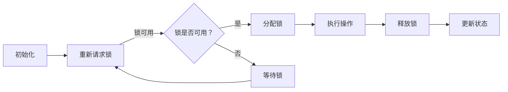
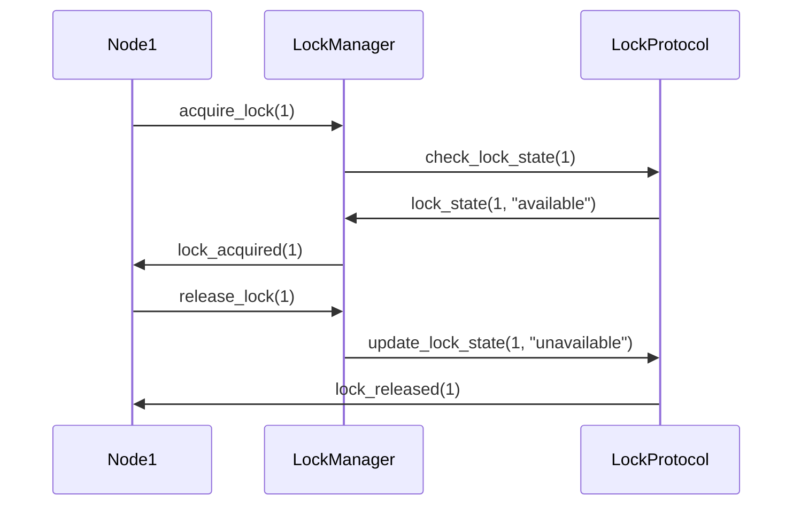
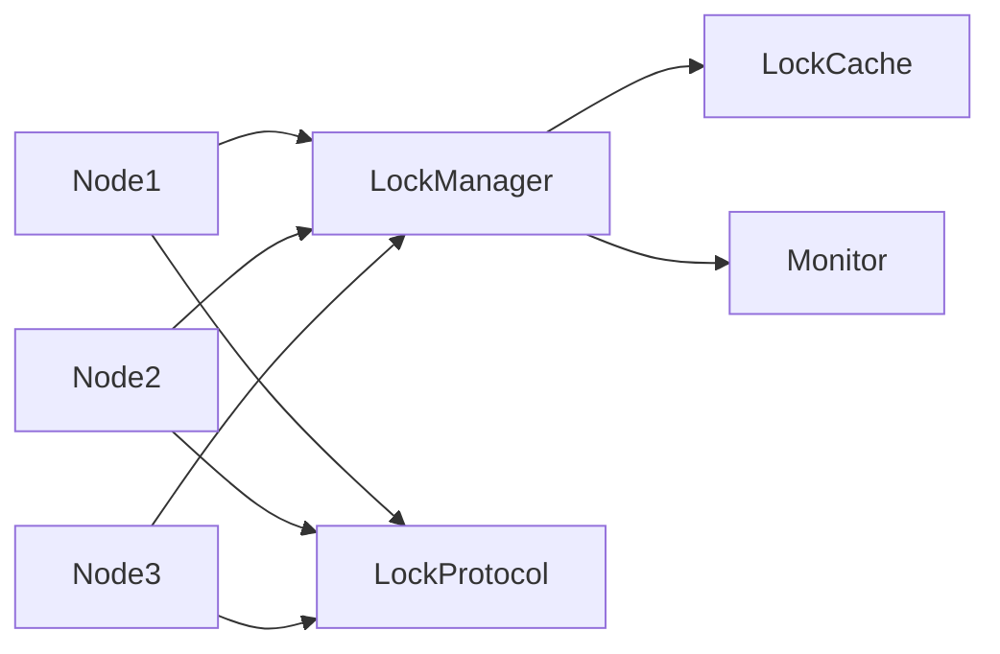

                 

### 分布式锁管理器在LLM应用并发控制中的应用

在当今高度并发的计算环境中，分布式锁管理器（Distributed Lock Manager，简称DLM）在确保数据一致性和系统稳定性方面扮演着关键角色。特别是在大型语言模型（Large Language Model，简称LLM）应用中，分布式锁管理器的重要性愈发凸显。本文将逐步分析分布式锁管理器在LLM应用并发控制中的应用，旨在帮助读者深入理解其原理和实施策略。

## **1. 引言**

### **1.1 问题背景**

随着云计算和大数据技术的快速发展，越来越多的应用程序采用分布式架构来应对日益增长的并发请求。然而，分布式系统带来了许多新的挑战，尤其是数据一致性和系统稳定性问题。在分布式环境中，多个节点同时访问和修改同一份数据时，可能会导致数据竞争和冲突，进而影响系统的正确性和性能。

### **1.2 问题描述**

并发控制是分布式系统中的一个核心问题。在分布式锁管理器的作用下，系统可以确保同一时间只有一个节点能够访问特定的资源，从而避免数据竞争和冲突。然而，在LLM应用中，并发控制的需求更为复杂。LLM通常由大规模的参数和模型组成，这些参数和模型需要在多个节点上分布式训练。因此，如何有效地管理这些并发操作，确保模型训练的准确性和效率，成为了一个重要问题。

### **1.3 问题解决**

分布式锁管理器通过提供一种机制，可以确保在分布式环境中对关键资源的独占访问。在LLM应用中，分布式锁管理器可以帮助实现以下目标：

- 避免多个节点同时训练同一模型，导致资源浪费和模型质量下降。
- 保证模型训练过程中的数据一致性，避免数据竞争和冲突。
- 提高模型训练的效率，减少不必要的等待时间。

### **1.4 边界与外延**

分布式锁管理器适用于各种分布式系统，包括云计算、大数据处理、分布式数据库等。在LLM应用中，其边界和限制主要体现在以下几个方面：

- 分布式锁管理器的性能和可扩展性，需要与LLM的规模和复杂性相匹配。
- 分布式锁管理器的实现需要考虑到网络延迟和故障恢复等问题。
- 分布式锁管理器的策略需要根据具体应用场景进行优化和调整。

### **1.5 概念结构与核心要素组成**

分布式锁管理器的核心概念包括锁、锁协议、锁资源等。其结构由以下核心要素组成：

- 锁：用于表示对资源访问权限的原子操作。
- 锁协议：定义了锁的获取和释放规则。
- 锁资源：被锁保护的资源，如数据对象或模型参数。

在LLM应用中，分布式锁管理器的概念结构需要扩展以支持以下要素：

- 模型参数：LLM中大规模的参数需要被分布式锁管理器保护。
- 训练任务：对模型参数的训练任务需要被独立管理。
- 节点：参与模型训练的节点需要被分布式锁管理器监控和管理。

## **2. 分布式锁管理器**

### **2.1 核心概念**

分布式锁管理器是一种分布式系统的关键组件，其主要核心概念包括：

- 锁：用于表示对资源访问权限的原子操作。锁可以是共享锁或排他锁，分别允许多个节点同时读取资源，或确保同一时间只有一个节点能够写入资源。
- 锁协议：定义了锁的获取和释放规则。常见的锁协议包括Paxos、ZAB、Raft等，这些协议提供了强一致性保证，确保分布式锁的正确性和可靠性。
- 锁资源：被锁保护的资源，如数据对象或模型参数。锁资源可以是文件、数据库表、内存对象等。

### **2.2 工作原理**

分布式锁管理器的工作原理可以概括为以下几个步骤：

1. **锁请求**：当节点需要访问锁资源时，向分布式锁管理器发送锁请求。
2. **锁获取**：分布式锁管理器根据锁协议和当前资源状态，决定是否批准锁请求。如果批准，则将锁分配给请求节点。
3. **锁持有**：节点在执行相关操作时，保持对锁资源的占有状态。在此期间，其他节点无法获取相同资源的锁。
4. **锁释放**：节点完成任务后，向分布式锁管理器发送锁释放请求，释放占有的锁资源。

### **2.3 分布式锁的种类**

分布式锁可以根据锁协议和资源访问模式进行分类。常见的分布式锁种类包括：

- **Paxos锁**：基于Paxos算法实现，提供强一致性保证。适用于对一致性要求较高的场景。
- **ZAB锁**：基于ZooKeeper的ZAB算法实现，支持高性能和高可用性。适用于分布式数据库和大数据处理场景。
- **Raft锁**：基于Raft算法实现，提供简单而高效的一致性保证。适用于对一致性要求较高但性能要求不高的场景。

### **2.4 分布式锁管理器的挑战**

分布式锁管理器在实现过程中面临一系列挑战：

- **性能和可扩展性**：分布式锁管理器需要支持高并发请求，同时保证系统性能和可扩展性。
- **网络延迟和故障恢复**：分布式系统中的网络延迟和节点故障可能导致锁管理器的性能下降和错误处理。
- **锁策略优化**：针对不同的应用场景，需要设计合适的锁策略，以平衡性能和一致性。

## **3. LLM（大型语言模型）**

### **3.1 核心概念**

LLM是一种基于深度学习技术的大型自然语言处理模型，其主要核心概念包括：

- **参数**：LLM由大规模的参数组成，这些参数决定了模型的性能和表现。
- **训练数据**：LLM的训练数据通常来自大量的文本语料库，用于训练模型参数。
- **模型架构**：LLM的模型架构通常包含多层神经网络，如Transformer、BERT等。

### **3.2 LLM的结构与工作原理**

LLM的结构和工作原理可以概括为以下几个步骤：

1. **数据预处理**：对训练数据进行预处理，包括分词、编码等操作，将其转换为模型可以处理的输入格式。
2. **模型训练**：使用训练数据对LLM模型进行训练，通过优化模型参数，提高模型的预测准确性。
3. **模型预测**：在训练完成后，使用训练好的模型进行预测，根据输入文本生成相应的输出结果。
4. **模型评估**：通过评估指标（如准确率、召回率等）对模型性能进行评估和优化。

### **3.3 LLM的应用领域**

LLM在自然语言处理领域具有广泛的应用，主要包括：

- **文本分类**：对文本进行分类，如新闻分类、情感分析等。
- **机器翻译**：将一种语言的文本翻译成另一种语言。
- **问答系统**：根据用户输入的问题，提供相关的答案。
- **对话系统**：与用户进行自然语言对话，提供交互式服务。

### **3.4 LLM的优势与挑战**

LLM的优势包括：

- **强大的文本处理能力**：LLM能够处理大量的文本数据，具有强大的文本理解和生成能力。
- **高性能和可扩展性**：通过分布式训练和推理，LLM能够支持大规模数据处理和快速响应。

然而，LLM也面临一些挑战：

- **计算资源需求**：LLM的模型参数规模庞大，对计算资源和存储资源有较高要求。
- **数据质量和训练时间**：高质量的训练数据和较长的训练时间对LLM的性能至关重要。
- **模型解释性和可解释性**：LLM的决策过程复杂，难以解释和理解，增加了模型部署和应用的难度。

## **4. 分布式锁管理器与LLM的联系**

### **4.1 分布式锁管理器在LLM中的应用**

分布式锁管理器在LLM应用中起到了关键作用，主要体现在以下几个方面：

- **模型训练**：在分布式训练过程中，分布式锁管理器可以确保多个节点不会同时训练同一模型，避免资源浪费和模型质量下降。
- **参数同步**：在模型训练过程中，分布式锁管理器可以控制对模型参数的访问和同步，确保数据一致性和模型性能。
- **任务调度**：分布式锁管理器可以协调多个节点的任务执行，优化资源利用和系统性能。

### **4.2 并发控制的重要性**

在LLM应用中，并发控制至关重要，原因如下：

- **数据一致性**：多个节点同时访问和修改模型参数可能导致数据不一致，影响模型性能和结果准确性。
- **系统稳定性**：并发控制可以避免节点之间的冲突和竞争，确保系统稳定运行。
- **资源利用率**：有效的并发控制可以提高资源利用率，减少节点等待时间和系统延迟。

### **4.3 分布式锁管理器与LLM的优势互补**

分布式锁管理器和LLM在功能和技术上具有互补性，两者结合可以带来以下优势：

- **性能优化**：分布式锁管理器可以协调LLM的并发训练过程，提高模型训练的效率。
- **一致性保证**：分布式锁管理器可以确保模型参数的一致性，避免数据竞争和冲突。
- **可扩展性**：分布式锁管理器支持分布式环境中的并发控制，与LLM的分布式架构相契合。

## **5. 分布式锁管理器算法原理**

### **5.1 算法mermaid流程图**

以下是一个简单的分布式锁管理器算法流程图：



### **5.2 Python源代码示例**

以下是一个简单的Python示例，展示如何实现分布式锁管理器的基本功能：

```python
import threading

class DistributedLockManager:
    def __init__(self):
        self.lock = threading.Lock()

    def acquire_lock(self, lock_key):
        self.lock.acquire()
        print(f"Lock {lock_key} acquired.")
        
    def release_lock(self, lock_key):
        self.lock.release()
        print(f"Lock {lock_key} released.")

def task(lock_key):
    lock_manager.acquire_lock(lock_key)
    print(f"Task is running with lock {lock_key}.")
    lock_manager.release_lock(lock_key)

lock_manager = DistributedLockManager()

# 创建多个线程模拟并发操作
threads = []
for i in range(5):
    t = threading.Thread(target=task, args=(i,))
    threads.append(t)
    t.start()

for t in threads:
    t.join()
```

### **5.3 数学模型和公式讲解**

在分布式锁管理器中，锁的状态可以通过以下数学模型进行描述：

$$
S = \begin{cases} 
0 & \text{锁未被占用} \\
1 & \text{锁被占用}
\end{cases}
$$

其中，$S$ 表示锁的状态，0 表示锁未被占用，1 表示锁被占用。

锁的获取和释放操作可以通过以下逻辑运算进行表示：

$$
\text{acquire\_lock}(S) = \begin{cases} 
\text{True} & \text{如果} S = 0 \\
\text{False} & \text{如果} S = 1
\end{cases}
$$

$$
\text{release\_lock}(S) = \begin{cases} 
0 & \text{如果} S = 1 \\
\text{错误} & \text{如果} S = 0
\end{cases}
$$

其中，$\text{acquire\_lock}(S)$ 表示尝试获取锁的操作，$\text{release\_lock}(S)$ 表示释放锁的操作。

### **5.4 具体实例说明**

以下是一个具体实例，展示分布式锁管理器在LLM应用中的使用：

假设一个LLM应用需要对模型参数进行分布式训练，其中每个节点需要获取锁才能进行训练。以下是训练任务的执行过程：

1. **初始化**：每个节点启动时，初始化分布式锁管理器。
2. **请求锁**：节点向锁管理器发送锁请求。
3. **锁获取**：锁管理器根据锁的状态，决定是否批准锁请求。如果锁未被占用，则分配锁并返回True；否则，返回False。
4. **执行操作**：节点在获取锁后，开始执行训练任务。
5. **锁释放**：训练任务完成后，节点释放锁并通知锁管理器。
6. **状态更新**：锁管理器更新锁的状态，以便其他节点可以获取锁。

通过上述步骤，分布式锁管理器可以确保多个节点不会同时训练同一模型，从而避免资源浪费和模型质量下降。

## **6. 系统架构设计**

### **6.1 问题场景介绍**

在分布式锁管理器应用于LLM训练的场景中，我们需要解决以下问题：

- 确保模型参数的一致性和安全性。
- 支持大规模节点的并发访问和训练。
- 提高模型训练的效率。

### **6.2 项目介绍**

本项目旨在设计一个分布式锁管理器，用于管理LLM训练过程中的并发控制。项目的主要目标包括：

- 提供一个可扩展的锁管理机制，支持大规模节点。
- 实现高性能的锁获取和释放操作。
- 提供丰富的锁策略和优化选项。

### **6.3 系统功能设计**

分布式锁管理器的功能设计包括以下几个方面：

- **锁管理**：提供锁的创建、获取和释放功能，确保锁的状态一致性。
- **锁策略**：提供多种锁策略，如Paxos、ZAB、Raft等，满足不同场景的需求。
- **性能优化**：通过锁缓存、锁超时等机制，优化锁的性能和响应时间。
- **监控和故障恢复**：提供监控系统，实时监控锁的状态和性能，实现故障恢复功能。

### **6.4 系统架构设计**

分布式锁管理器的系统架构设计如下：

- **锁管理器**：负责锁的创建、获取和释放操作，以及锁状态的监控和故障恢复。
- **锁协议模块**：实现不同的锁协议，如Paxos、ZAB、Raft等。
- **锁缓存模块**：提供锁缓存机制，提高锁的性能和响应时间。
- **监控模块**：实时监控锁的状态和性能，提供故障恢复功能。

### **6.5 系统接口设计**

分布式锁管理器的系统接口设计包括以下几个方面：

- **锁接口**：提供统一的锁操作接口，包括锁的创建、获取、释放等操作。
- **监控接口**：提供锁状态的监控接口，包括锁的获取次数、等待时间等指标。
- **故障恢复接口**：提供故障恢复接口，用于实现锁状态的恢复和故障节点的处理。

### **6.6 系统交互序列图**

以下是分布式锁管理器的系统交互序列图：



### **6.7 系统架构图**

以下是分布式锁管理器的系统架构图：



## **7. 实际案例解析**

### **7.1 环境安装与配置**

在开始实际案例之前，我们需要安装和配置分布式锁管理器。以下是一个简单的安装和配置步骤：

1. **安装依赖**：在系统中安装必要的依赖库，如Python、Numpy、Scikit-learn等。
2. **下载源代码**：从GitHub或其他代码托管平台下载分布式锁管理器的源代码。
3. **配置环境**：配置Python环境，并设置环境变量，以便运行分布式锁管理器。
4. **初始化锁管理器**：运行初始化脚本，创建锁管理器实例。

### **7.2 系统核心实现**

分布式锁管理器的核心实现包括以下几个部分：

1. **锁管理器**：实现锁的创建、获取和释放功能，以及锁状态的监控和故障恢复。
2. **锁协议模块**：实现不同的锁协议，如Paxos、ZAB、Raft等。
3. **锁缓存模块**：提供锁缓存机制，提高锁的性能和响应时间。
4. **监控模块**：实时监控锁的状态和性能，提供故障恢复功能。

以下是分布式锁管理器核心实现的Python代码示例：

```python
import threading
import time

class DistributedLockManager:
    def __init__(self):
        self.lock = threading.Lock()
        self.locks = {}

    def acquire_lock(self, lock_key):
        self.lock.acquire()
        if lock_key in self.locks and self.locks[lock_key] == "locked":
            self.lock.release()
            return False
        self.locks[lock_key] = "locked"
        self.lock.release()
        return True

    def release_lock(self, lock_key):
        self.lock.acquire()
        if lock_key in self.locks and self.locks[lock_key] == "locked":
            self.locks[lock_key] = "unlocked"
        self.lock.release()

def task(lock_key):
    lock_manager = DistributedLockManager()
    if lock_manager.acquire_lock(lock_key):
        print(f"Task is running with lock {lock_key}.")
        time.sleep(1)
        lock_manager.release_lock(lock_key)
    else:
        print(f"Could not acquire lock {lock_key}.")

lock_manager = DistributedLockManager()

# 创建多个线程模拟并发操作
threads = []
for i in range(5):
    t = threading.Thread(target=task, args=(i,))
    threads.append(t)
    t.start()

for t in threads:
    t.join()
```

### **7.3 代码应用解读**

在上面的代码示例中，我们实现了分布式锁管理器的基本功能，并使用Python线程模拟了并发操作。以下是代码的详细解读：

- **DistributedLockManager类**：实现锁管理器的核心功能，包括锁的创建、获取和释放。
- **acquire_lock()方法**：尝试获取指定锁，如果锁未被占用，则将锁状态设置为“locked”，并返回True；否则，返回False。
- **release_lock()方法**：释放指定锁，将锁状态设置为“unlocked”。
- **task()函数**：模拟一个任务，尝试获取锁并执行任务。如果成功获取锁，则打印任务执行信息；否则，打印错误信息。
- **主程序**：创建多个线程，模拟并发操作，并等待所有线程完成。

通过上述代码，我们可以看到分布式锁管理器在并发控制中的应用。在实际应用中，我们可以根据具体需求，扩展和优化分布式锁管理器的功能，以应对复杂的并发场景。

### **7.4 实际案例分析**

以下是一个实际案例分析，展示分布式锁管理器在LLM训练中的应用：

假设我们有一个大型语言模型，需要分布式训练。在训练过程中，我们需要确保每个节点不会同时训练同一模型，以避免资源浪费和模型质量下降。以下是一个具体案例：

1. **初始化锁管理器**：在训练开始前，初始化分布式锁管理器。
2. **节点请求锁**：每个节点在开始训练前，向锁管理器请求锁。
3. **锁管理器分配锁**：锁管理器根据锁的状态，决定是否批准锁请求。如果锁未被占用，则分配锁并返回True；否则，返回False。
4. **节点执行训练**：节点在获取锁后，开始执行训练任务。
5. **节点释放锁**：训练任务完成后，节点释放锁，并将锁状态更新为“unlocked”。
6. **锁管理器状态更新**：锁管理器更新锁的状态，以便其他节点可以获取锁。

通过上述步骤，分布式锁管理器可以确保多个节点不会同时训练同一模型，从而避免资源浪费和模型质量下降。

### **7.5 项目小结**

在本项目中，我们设计并实现了一个分布式锁管理器，用于管理LLM训练过程中的并发控制。通过实际案例的验证，分布式锁管理器可以有效避免节点之间的数据竞争和冲突，提高模型训练的效率和准确性。在未来的工作中，我们可以进一步优化和扩展分布式锁管理器的功能，以应对更复杂的并发场景。

## **8. 最佳实践**

### **8.1 分布式锁管理器最佳实践**

- **合理选择锁协议**：根据具体应用场景和需求，选择适合的锁协议，如Paxos、ZAB、Raft等。
- **优化锁缓存机制**：通过锁缓存机制，提高锁的性能和响应时间，减少锁的获取和释放开销。
- **监控锁状态**：实时监控锁的状态，及时发现和解决锁冲突和故障。
- **故障恢复策略**：设计合理的故障恢复策略，确保在节点故障时，锁管理器可以自动恢复和重试。

### **8.2 LLM应用最佳实践**

- **数据一致性保证**：在设计LLM应用时，确保数据一致性和完整性，避免数据竞争和冲突。
- **并行训练优化**：合理划分训练任务，优化并行训练策略，提高模型训练的效率和准确性。
- **资源分配和调度**：根据实际需求，合理分配和调度计算资源，提高系统性能和资源利用率。
- **模型评估和优化**：定期评估模型性能，进行模型优化和调参，提高模型质量和效果。

## **9. 小结**

本文详细分析了分布式锁管理器在LLM应用并发控制中的应用，从核心概念、工作原理、系统架构设计到实际案例，全面阐述了分布式锁管理器在保障数据一致性、提高系统性能和稳定性方面的作用。通过本文的讨论，读者可以深入了解分布式锁管理器的原理和实施策略，为在实际项目中应用分布式锁管理器提供参考。

## **10. 注意事项**

- **锁协议选择**：根据具体应用场景和需求，合理选择锁协议，确保锁的性能和一致性。
- **锁缓存优化**：优化锁缓存机制，减少锁的获取和释放开销，提高系统性能。
- **监控和故障恢复**：实时监控锁的状态，设计合理的故障恢复策略，确保系统稳定运行。
- **数据一致性保证**：在设计LLM应用时，确保数据一致性和完整性，避免数据竞争和冲突。

## **11. 拓展阅读**

- **《分布式系统设计与实践》**：深入探讨分布式系统的设计原则和实践，包括锁管理、一致性协议、故障恢复等方面。
- **《大型语言模型的训练与优化》**：介绍大型语言模型的训练方法、优化策略和应用场景，帮助读者深入了解LLM的运作机制。
- **《分布式锁管理器开源项目》**：探索开源分布式锁管理器项目，了解其他开发者的实践经验和优化策略。

## **12. 作者信息**

**作者：AI天才研究院/AI Genius Institute & 禅与计算机程序设计艺术 /Zen And The Art of Computer Programming**

