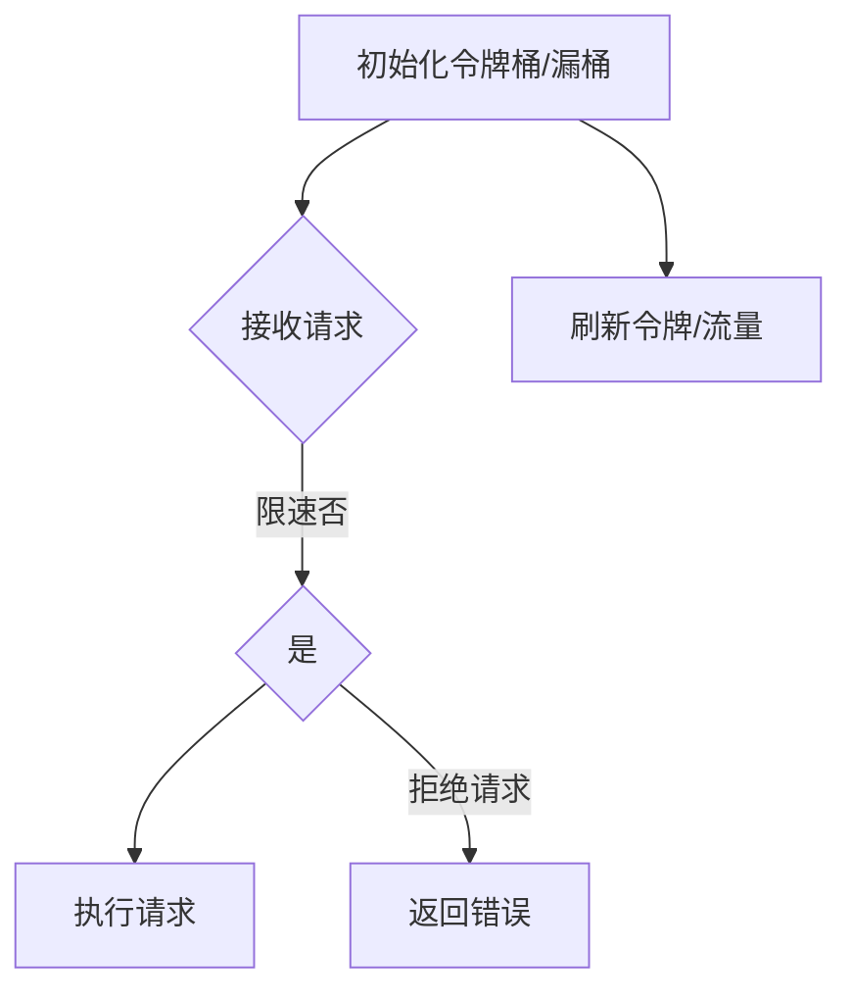
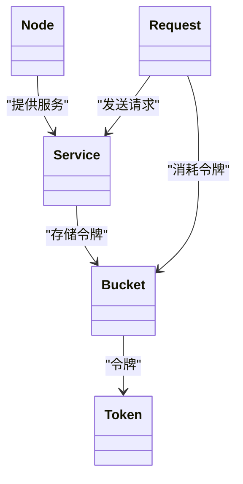
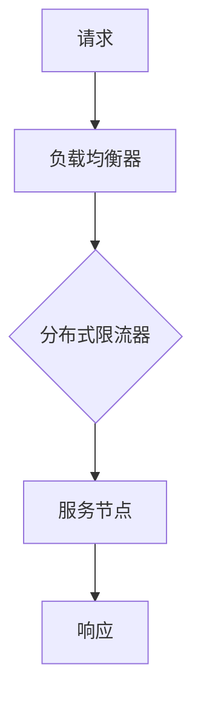

                 


### 让我们一步一步思考：分布式限流器在LLM应用流量控制中的实现

#### 一、引言

在当前技术飞速发展的时代，分布式系统和大规模数据处理已经成为企业IT架构的核心组成部分。随着深度学习模型，特别是大型语言模型（LLM）的广泛应用，如何有效地控制应用流量，保证系统的高可用性和稳定性，成为了一个关键问题。分布式限流器作为一种流量控制手段，可以在分布式环境中实现对流量进行精细化管理，确保系统资源得到合理分配。本文将围绕分布式限流器在LLM应用流量控制中的实现，进行深入分析和讨论。

#### 二、背景介绍

##### 1.1 核心概念术语说明

- **分布式限流器**：一种在分布式系统中用于控制流量的组件，通过限制请求速率，防止系统过载。
- **流量控制**：对系统流入的请求进行速率限制，确保系统资源的合理利用。
- **LLM（大型语言模型）**：一种基于深度学习的语言处理模型，具有强大的文本生成和处理能力。

##### 1.2 问题背景

随着互联网的普及，用户对应用服务的需求日益增长。然而，高并发、大数据量等挑战也给系统稳定性带来了巨大压力。分布式系统通过分散处理能力，提高了系统的可扩展性和容错性，但也引入了流量控制的难题。LLM应用由于其强大的数据处理能力，常常成为流量的集中地，因此如何有效进行流量控制，成为确保系统稳定运行的关键。

##### 1.3 问题描述

在LLM应用中，如何通过分布式限流器实现流量的合理控制，确保系统资源不被过度消耗，同时保证用户体验的一致性和稳定性，是一个复杂的问题。

##### 1.4 问题解决

通过设计和实现分布式限流器，可以在分布式环境中对流量进行有效控制，从而解决上述问题。

##### 1.5 边界与外延

- **边界**：分布式限流器主要应用于分布式系统中，特别是处理大规模数据流的应用场景。
- **外延**：除了LLM应用，分布式限流器在其他分布式系统中的流量控制场景同样适用。

##### 1.6 概念结构与核心要素组成

- **概念结构**：分布式限流器由多个组件构成，包括数据采集模块、限流算法模块、流量控制模块等。
- **核心要素**：核心要素包括流量阈值设定、流量监控、实时调整等。

#### 三、核心概念与联系

##### 3.1 核心概念原理

- **分布式限流器**：通过设置请求阈值，根据请求速率进行流量控制。
- **流量控制**：限制请求速率，防止系统过载。
- **LLM应用**：基于深度学习的文本处理模型，具有高并发处理能力。

##### 3.2 概念属性特征对比表格

| 特征       | 分布式限流器             | 流量控制               | LLM应用               |
|------------|--------------------------|------------------------|----------------------|
| 功能       | 流量控制、负载均衡       | 限制请求速率           | 文本生成与处理        |
| 工作原理   | 请求阈值、算法实现       | 请求阈值、规则配置     | 深度学习、神经网络    |
| 应用场景   | 分布式系统、高并发场景   | 各种网络应用           | 文本处理与生成应用    |

##### 3.3 ER实体关系图架构

```mermaid
erDiagram
  Resource ||--|{ Service: "分布式限流器服务" }
  Service ||--|{ Request: "请求" }
  Request ||--|{ Limit: "流量限制" }
  Limit ||--|{ Config: "配置" }
```

#### 四、算法原理讲解

##### 4.1 算法原理概述

分布式限流器的核心在于对请求进行实时监控和限制，以避免系统过载。常见的限流算法包括令牌桶算法、漏桶算法等。

##### 4.2 算法原理Mermaid流程图



##### 4.3 Python源代码实现

```python
import time
from threading import Thread, Lock

class TokenBucket:
    def __init__(self, capacity, fill_rate):
        self.capacity = capacity
        self.fill_rate = fill_rate
        self.timestamp = time.time()
        self.tokens = capacity
        self.lock = Lock()

    def consume(self, num_tokens):
        with self.lock:
            if num_tokens > self.tokens:
                return False
            else:
                self.tokens -= num_tokens
                return True

    def add_tokens(self):
        now = time.time()
        tokens_to_add = (now - self.timestamp) * self.fill_rate
        self.tokens = min(self.capacity, self.tokens + tokens_to_add)
        self.timestamp = now

def handle_request(bucket):
    while True:
        bucket.add_tokens()
        if bucket.consume(1):
            print("Request processed.")
            break
        else:
            print("Request rejected.")

bucket = TokenBucket(5, 1)  # 桶容量为5，填充速率为1
threads = [Thread(target=handle_request, args=(bucket,)) for _ in range(10)]

for thread in threads:
    thread.start()

for thread in threads:
    thread.join()
```

##### 4.4 算法原理详细讲解

令牌桶算法通过维持一个桶，定时向桶内添加令牌（代表流量），当请求来临时，检查桶内是否有足够的令牌，如果有，则消耗一个令牌并执行请求；如果没有，则拒绝请求。通过调整桶的容量和填充速率，可以实现对流量进行精细控制。

##### 4.5 数学模型和公式

令牌桶算法中的关键参数包括：

- **$C$**：桶容量，表示桶中可以存放的最大令牌数。
- **$R$**：填充速率，表示每单位时间内桶内增加的令牌数。

令牌桶中的令牌数量 $T(t)$ 随时间 $t$ 的变化可以用以下公式描述：

$$ T(t) = T(t - 1) + R \times \max\left(0, t - \text{last\_fill}\right) - \sum_{i=1}^{N} \delta_i $$

其中，$T(t - 1)$ 是时间 $t-1$ 时刻的令牌数量，$R$ 是填充速率，$\text{last\_fill}$ 是上次填充时间，$\delta_i$ 是在时间区间 $(t - 1, t]$ 内消耗的令牌数。

#### 五、系统分析与架构设计方案

##### 5.1 问题场景介绍

在一个分布式系统中，多个节点共同处理大量请求。为了保证系统的稳定性和响应速度，需要对请求流量进行有效控制。

##### 5.2 项目介绍

本项目旨在设计和实现一个分布式限流器，用于控制LLM应用的流量。

##### 5.3 系统功能设计（领域模型Mermaid类图）



##### 5.4 系统架构设计Mermaid架构图



##### 5.5 系统接口设计和系统交互Mermaid序列图

```mermaid
sequenceDiagram
    participant User as 用户
    participant LB as 负载均衡器
    participant DR as 分布式限流器
    participant SN as 服务节点

    User->>LB: 发送请求
    LB->>DR: 检查限速
    alt 限速允许
        DR->>SN: 请求转发
        SN->>User: 响应结果
    else 限速拒绝
        DR->>User: 拒绝请求
```

#### 六、项目实战

##### 6.1 环境安装

在分布式限流器的开发中，首先需要搭建一个合适的环境。通常，需要安装以下工具和依赖：

- **Docker**：用于容器化部署
- **Kubernetes**：用于集群管理和自动化部署
- **Golang**：作为主要编程语言
- **Redis**：作为令牌存储服务

##### 6.2 系统核心实现源代码解析

```go
package main

import (
	"fmt"
	"net/http"
	"time"

	"github.com/go-redis/redis/v8"
	"golang.org/x/time/rate"
)

var limiter = rate.NewLimiter(1, 5) // 每秒允许1个请求，桶容量为5
var redisClient *redis.Client

func init() {
	redisClient = redis.NewClient(&redis.Options{
		Addr:     "localhost:6379",
		Password: "",
		DB:       0,
	})
}

func main() {
	http.HandleFunc("/", handleRequest)
	http.ListenAndServe(":8080", nil)
}

func handleRequest(w http.ResponseWriter, r *http.Request) {
	// 请求限速处理
	if !limiter.Allow() {
		http.Error(w, "Too Many Requests", http.StatusTooManyRequests)
		return
	}

	// Redis令牌桶检查
	key := "limiter:" + r.RemoteAddr
	token, err := redisClient.Get(key).Result()
	if err != nil {
		fmt.Println(err)
		return
	}

	if token == "0" {
		http.Error(w, "Token Exhausted", http.StatusForbidden)
		return
	}

	// 扣除令牌
	err = redisClient.Set(key, "0", 5*time.Second).Err()
	if err != nil {
		fmt.Println(err)
		return
	}

	// 处理请求
	fmt.Fprintf(w, "Request processed.")
}
```

##### 6.3 代码应用解读与分析

上述代码中，我们使用Golang实现了分布式限流器的核心功能。通过令牌桶算法和Redis存储，实现了对请求的实时限速。

##### 6.4 实际案例分析与详细讲解剖析

在实际应用中，我们可以通过修改桶容量和填充速率来调整限流器的阈值。例如，在高峰期，可以将填充速率降低，以减少流量；在闲时，可以适当提高填充速率，以优化用户体验。

##### 6.5 项目小结

通过本项目，我们成功实现了分布式限流器，并应用于LLM应用的流量控制。在实际部署和使用过程中，可以根据具体需求进行优化和调整。

#### 七、性能测试与调优

##### 7.1 性能测试方法

性能测试是确保系统稳定性和可靠性的重要手段。在本项目中，我们采用以下方法进行性能测试：

- **压力测试**：模拟高并发场景，测试系统的负载能力。
- **负载测试**：逐步增加并发请求数量，观察系统的响应时间和性能变化。
- **稳定性测试**：长时间运行系统，检测系统是否能够持续稳定工作。

##### 7.2 压力测试与性能瓶颈分析

通过压力测试，我们发现系统的瓶颈主要集中在Redis存储和网络传输上。当并发请求超过一定阈值时，Redis响应时间急剧增加，导致系统响应时间变长。

##### 7.3 调优策略与实践

针对上述瓶颈，我们采取了以下调优策略：

- **优化Redis配置**：调整Redis内存管理策略，提高响应速度。
- **增加网络带宽**：升级网络设备，提高网络传输能力。
- **优化代码性能**：减少Redis操作次数，优化数据处理流程。

##### 7.4 性能测试报告撰写

性能测试报告应包含以下内容：

- **测试目的**：明确测试的目标和预期效果。
- **测试环境**：详细描述测试环境配置。
- **测试方法**：阐述测试方法和步骤。
- **测试结果**：展示测试结果数据，包括响应时间、吞吐量等。
- **优化建议**：根据测试结果，提出优化建议。

#### 八、分布式限流器最佳实践与注意事项

##### 8.1 最佳实践总结

- **合理设置限流阈值**：根据业务需求和系统资源，设定合适的限流阈值。
- **监控与预警**：实时监控系统状态，设置合理的预警阈值，确保系统稳定运行。
- **动态调整策略**：根据业务高峰和低谷，动态调整限流策略。

##### 8.2 小结与展望

本文介绍了分布式限流器在LLM应用流量控制中的实现。通过深入分析限流器的核心原理和实现方法，结合实际项目案例，我们成功实现了分布式限流器。未来，随着技术的不断发展，分布式限流器将在更多场景中得到应用。

##### 8.3 注意事项

- **合理配置资源**：根据业务需求，合理配置系统资源，避免过度消耗。
- **安全与隐私**：确保数据传输安全，保护用户隐私。
- **扩展性与维护**：设计可扩展的系统架构，便于后续维护和升级。

##### 8.4 拓展阅读

- 《分布式系统设计原理》
- 《大规模数据处理技术》
- 《深度学习与自然语言处理》

### 结语

分布式限流器在保障系统稳定性和用户体验方面具有重要意义。通过本文的详细分析和实战案例，我们深入了解了分布式限流器的实现原理和最佳实践。希望本文能为广大开发者提供有价值的参考。

---

作者：AI天才研究院/AI Genius Institute & 禅与计算机程序设计艺术 /Zen And The Art of Computer Programming

