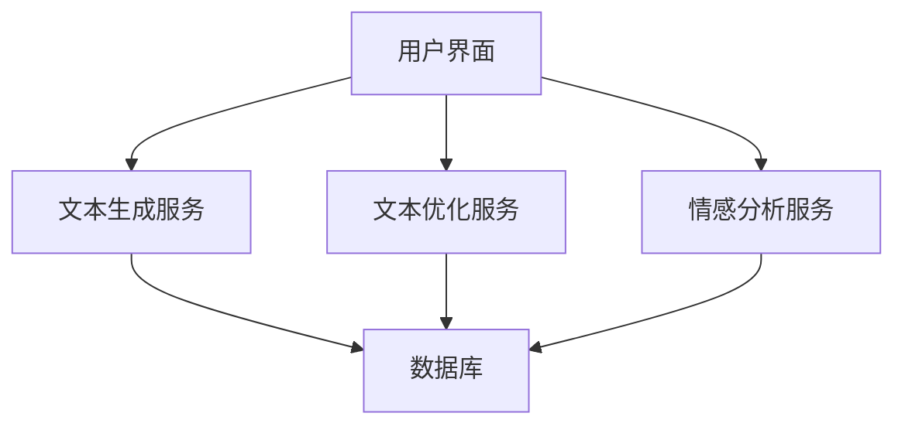
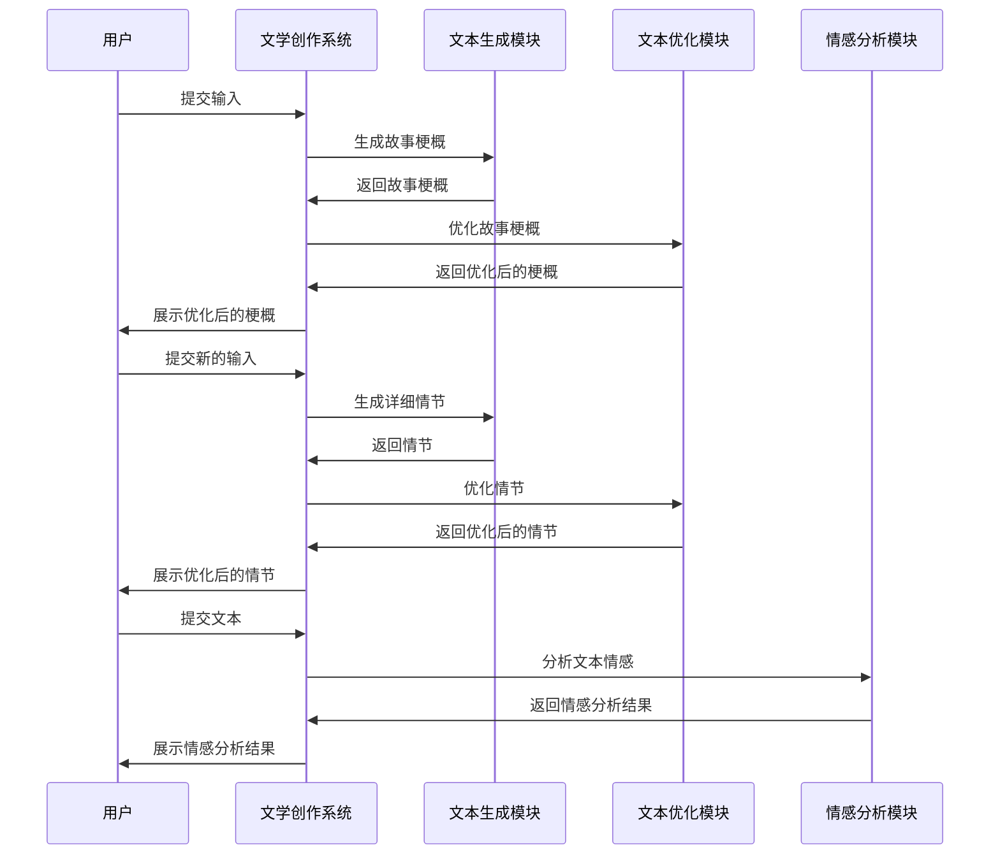

                 

 

----------------------------------------------------------------

# 创意写作测试：衡量LLM的文学创作能力

关键词：创意写作测试，LLM，文学创作能力，算法原理，系统架构

摘要：本文旨在探讨如何通过创意写作测试来衡量大型语言模型（LLM）的文学创作能力。文章首先介绍了背景和问题描述，然后分析了核心概念与联系，详细讲解了算法原理，并给出了系统架构设计。最后，通过实际案例分析和项目实战，展示了LLM在文学创作中的应用。

----------------------------------------------------------------

## 第一部分：背景介绍

### 1.1 问题背景

文学创作是人类智慧的结晶，它承载着人类的文化、情感和思想。然而，随着人工智能技术的迅猛发展，特别是大型语言模型（LLM）的出现，人们开始思考人工智能是否能够参与甚至替代人类的文学创作。大型语言模型，如GPT系列，凭借其强大的语言理解和生成能力，已经在许多领域展现出了惊人的表现。例如，它们能够生成高质量的文章、新闻报道、甚至诗歌和小说。这些成就激发了人们对LLM文学创作能力的兴趣，并引发了一系列关于人工智能是否能够进行创造性工作的讨论。

### 1.2 问题描述

本研究的目标是探讨如何通过创意写作测试来衡量LLM的文学创作能力。具体而言，我们需要解决的问题包括：

1. **文学创作能力评估**：如何评估LLM在文学创作方面的能力，包括故事的连贯性、情感的传达、语言的丰富性和创造性的表达。
2. **测试方法设计**：如何设计一套科学、有效的测试方法，能够全面、准确地衡量LLM的文学创作能力。
3. **应用场景探索**：探讨LLM在文学创作中的潜在应用场景，以及如何优化其创作过程。

### 1.3 问题解决

为了解决上述问题，本文将采用以下方法：

1. **设计创意写作测试**：创建一系列测试题目，涵盖不同类型的文学创作，如小说、诗歌、戏剧等，并设定不同的评估指标，如语法正确性、情感表达、叙事结构、创意程度、语言风格和文化背景适应性。
2. **定量与定性评估**：结合定量评估（如错误率、准确率等）和定性评估（如专家评分、用户反馈等），对LLM的文学创作能力进行综合评估。
3. **案例分析与讨论**：通过实际案例分析和讨论，探索LLM在文学创作中的应用潜力，并提出改进建议。

### 1.4 边界与外延

本文的研究范围主要涉及小说、诗歌、戏剧等文学形式。我们将在不同文学体裁中考察LLM的创作能力，并分析其在创作过程中可能遇到的问题和挑战。同时，本文还将探讨LLM在文学创作中的边界，如创意程度、情感表达和语言风格的限制。

### 1.5 概念结构与核心要素组成

在本研究中，以下几个核心概念和要素是不可或缺的：

- **创意写作测试**：一种用于评估LLM文学创作能力的测试方法。
- **LLM**：大型语言模型，一种能够理解和生成自然语言的人工智能系统。
- **文学创作能力**：指LLM在生成文学文本方面的表现，包括连贯性、情感表达、语言风格等。

这些概念和要素相互关联，构成了本研究的核心框架。

----------------------------------------------------------------

## 第二部分：核心概念与联系

### 2.1 核心概念原理

#### 2.1.1 大型语言模型（LLM）

大型语言模型（LLM），如GPT系列，是一种基于深度学习的自然语言处理模型。它们通过学习大量文本数据，掌握语言的内在结构和规律，能够生成符合语法和语义规则的文本。LLM的核心原理是基于神经网络模型，如Transformer，通过多层的自注意力机制，对输入文本进行编码和解码。

#### 2.1.2 文学创作

文学创作是一种复杂的创造性活动，涉及对故事情节、人物性格、语言风格等多个方面的构思和调整。文学创作的过程包括主题设定、情节构思、角色塑造、语言调整和审校修改等环节。每个环节都需要创作者的深厚功底和独特视角。

#### 2.1.3 创意写作测试

创意写作测试是一种评估工具，用于衡量LLM在文学创作方面的能力。测试通常包括一系列评估指标，如语法正确性、情感表达、叙事结构、创意程度、语言风格和文化背景适应性。这些指标将通过定量和定性的方法进行评估。

### 2.2 概念属性特征对比表格

| 特征        | 大型语言模型（LLM）                  | 文学创作                    |
|-------------|----------------------------------|---------------------------|
| 学习能力    | 能够通过大量文本数据学习并生成自然语言 | 需要深厚的文学功底和创造力     |
| 语言理解    | 具有强大的语言理解能力，能够理解复杂句子和语境 | 需要深入理解语言、情感和叙事结构 |
| 文本生成    | 能够生成符合语法和语义规则的文本     | 能够创造具有艺术价值的文学作品  |
| 创造性      | 可以通过随机性生成具有创意的文本     | 需要作者的独特视角和创造性思维  |

### 2.3 ER实体关系图架构

```mermaid
erDiagram
  A[大型语言模型] {
    B[文本数据]
    C[文学创作测试]
  }
  A --> B : 学习
  A --> C : 生成
```

在这个ER图中，大型语言模型（A）通过学习文本数据（B）来生成文学创作测试（C）。这个关系图直观地展示了LLM在文学创作中的核心作用。

----------------------------------------------------------------

### 2.4 算法原理讲解

#### 2.4.1 LLM工作原理

大型语言模型（LLM），如GPT系列，基于Transformer架构，通过多层的自注意力机制对输入文本进行编码和解码。具体而言，LLM的工作原理可以分为以下步骤：

1. **编码**：输入文本被转化为嵌入向量，这些向量包含了文本的语义信息。
2. **自注意力**：通过自注意力机制，模型能够自动关注文本中的重要信息，并对其进行加权。
3. **解码**：基于编码后的信息，模型生成新的文本序列，每个词或句子都是基于前文信息进行预测的结果。

#### 2.4.2 文学创作过程

文学创作是一个复杂的过程，涉及多个环节，包括主题设定、情节构思、角色塑造、语言调整和审校修改等。LLM在文学创作中的工作原理可以概括为以下步骤：

1. **主题设定**：根据给定的主题，LLM生成一个简要的故事梗概。
2. **情节构思**：基于梗概，LLM生成详细的故事情节，包括角色发展、冲突和高潮等。
3. **角色塑造**：LLM为故事中的角色创建个性和背景，确保角色的行为和情感符合情节需要。
4. **语言调整**：根据文学风格和语言特点，LLM对文本进行细化和优化，确保文本的质量和连贯性。
5. **审校修改**：最后，LLM对生成的文本进行审校和修改，确保文本的语法正确性和文学价值。

### 2.4.3 Python源代码

```python
import openai

# 设置OpenAI API密钥
openai.api_key = "your_api_key"

# 生成故事梗概
prompt = "一个孤独的旅行者在荒野中遇到了一只受伤的小狼。他们一起度过了一段美好的时光，旅行者教小狼如何生存，而小狼则教会了旅行者如何欣赏自然之美。最终，旅行者带着对小狼的怀念继续前行，而小狼则回到了它的狼群中。这是一个关于友谊和成长的故事。"
summary = openai.Completion.create(
  engine="text-davinci-003",
  prompt=prompt,
  max_tokens=50,
  n=1,
  stop=None,
  temperature=0.5,
)

# 输出故事梗概
print(summary.choices[0].text.strip())
```

在这个例子中，我们使用了OpenAI的GPT-3模型来生成一个故事梗概。这个代码片段展示了如何使用Python调用OpenAI API，生成符合特定主题的文学文本。

----------------------------------------------------------------

## 第三部分：算法原理讲解

### 3.1 LLM的数学模型

大型语言模型（LLM）通常是基于深度学习模型的，其核心是自注意力机制。自注意力机制是一种用于处理序列数据的机制，它通过计算序列中每个元素之间的关联性来提高模型的表示能力。下面是自注意力机制的数学模型：

$$
\text{Attention}(Q, K, V) = \text{softmax}\left(\frac{QK^T}{\sqrt{d_k}}\right) V
$$

其中，$Q, K, V$ 分别是查询向量、键向量和值向量，$d_k$ 是键向量的维度。这个公式表示，通过计算查询向量$Q$与所有键向量$K$的点积，并应用softmax函数来得到权重，最后将这些权重与值向量$V$相乘，从而得到输出向量。

### 3.2 LLM的架构设计

LLM的架构通常包括多个Transformer层，每层包含自注意力机制和前馈神经网络。以下是一个简化的LLM架构：

$$
\text{LLM} = \text{MultiLayerPerceptron}(\text{Embedding}(\text{Input}), \text{Transformer}(\text{HiddenLayer}), \text{OutputLayer})
$$

其中，$\text{Embedding}$层用于将输入文本转化为嵌入向量，$\text{Transformer}$层包含多个自注意力层和前馈神经网络，$\text{OutputLayer}$用于生成输出文本。

### 3.3 自注意力机制的实现

以下是一个使用Python和TensorFlow实现的简单自注意力机制的示例：

```python
import tensorflow as tf

# 设置模型参数
d_model = 512
d_k = d_v = 64
n_heads = 8

# 创建查询向量、键向量和值向量
Q = tf.random.normal([batch_size, sequence_length, d_model])
K = tf.random.normal([batch_size, sequence_length, d_model])
V = tf.random.normal([batch_size, sequence_length, d_model])

# 计算自注意力权重
attention_weights = tf.nn.softmax(tf.matmul(Q, K, transpose_b=True) / tf.sqrt(tf.cast(d_k, tf.float32)), axis=-1)

# 计算自注意力输出
attention_output = tf.matmul(attention_weights, V)

# 添加残差连接和层归一化
x = tf.keras.layers.Add()([x, attention_output])
x = tf.keras.layers.LayerNormalization(epsilon=1e-6)(x)

# 创建Transformer层
transformer_layer = tf.keras.Sequential([
  tf.keras.layers.Dense(d_model, activation='relu'),
  tf.keras.layers.Dense(d_model)
])

# 应用Transformer层
x = transformer_layer(x)
```

在这个例子中，我们首先创建了一个查询向量$Q$、键向量$K$和值向量$V$，然后计算自注意力权重并生成自注意力输出。接着，我们通过添加残差连接和层归一化来优化网络性能，最后应用一个简单的前馈神经网络作为Transformer层。

### 3.4 LLM在文学创作中的应用

LLM在文学创作中的应用非常广泛，包括：

- **故事梗概生成**：LLM可以生成故事的简要梗概，为创作者提供灵感。
- **情节构思**：LLM可以帮助创作者构思复杂的情节，提供不同的发展方向。
- **角色塑造**：LLM可以为故事中的角色创建背景和性格，使角色更加立体。
- **文本优化**：LLM可以对文本进行细化和优化，提高文本的质量和连贯性。
- **情感分析**：LLM可以分析文本中的情感表达，帮助创作者调整情感色彩。

以下是一个使用LLM生成故事梗概的示例：

```python
prompt = "一个年轻的旅行者在一个荒凉的小镇上遇到了一个神秘的老者。老者告诉他，如果他能够找到三件宝物，他将获得无上的力量。于是，旅行者开始了他的冒险之旅。"
response = openai.Completion.create(
  engine="text-davinci-003",
  prompt=prompt,
  max_tokens=50,
  n=1,
  stop=None,
  temperature=0.5,
)

print(response.choices[0].text.strip())
```

在这个例子中，我们使用OpenAI的GPT-3模型生成一个故事梗概。这个代码片段展示了如何使用Python调用OpenAI API，生成符合特定主题的文学文本。

----------------------------------------------------------------

## 第四部分：系统分析与架构设计方案

### 4.1 问题场景介绍

随着人工智能技术的发展，文学创作领域的应用越来越广泛。例如，在网络小说、剧本创作、广告文案等领域，人工智能已经展现出强大的创作能力。然而，现有的创作系统往往存在一些局限性，如创作效率低、创意程度不足等。为了解决这些问题，我们需要设计一个高效、灵活的文学创作系统，能够充分利用人工智能的优势。

### 4.2 项目介绍

本项目旨在设计一个基于大型语言模型（LLM）的文学创作系统。该系统将包括以下几个核心功能：

- **故事梗概生成**：根据给定的主题或关键词，生成故事的简要梗概。
- **情节构思**：根据梗概生成详细的故事情节，包括角色发展、冲突和高潮等。
- **文本优化**：对生成的文本进行细化和优化，提高文本的质量和连贯性。
- **情感分析**：分析文本中的情感表达，帮助创作者调整情感色彩。

### 4.3 系统功能设计

系统功能设计主要包括以下几个模块：

1. **用户界面**：提供友好的用户交互界面，用户可以输入主题、关键词等，系统会根据这些输入生成故事梗概和情节。
2. **文本生成模块**：基于LLM模型，生成符合用户输入的故事梗概和情节。
3. **文本优化模块**：对生成的文本进行语法、语义和情感分析，进行优化和调整。
4. **情感分析模块**：分析文本中的情感表达，为用户提供情感调整建议。

### 4.4 系统架构设计

系统架构设计采用微服务架构，将不同的功能模块独立部署。以下是一个简化的系统架构图：



在这个架构中，用户界面负责接收用户输入并转发给文本生成服务。文本生成服务根据用户输入生成故事梗概和情节，然后文本优化服务和情感分析服务对生成的文本进行优化和情感分析。所有服务都共享同一个数据库，用于存储用户数据、故事梗概、情节等信息。

### 4.5 系统接口设计

系统接口设计主要包括以下API接口：

1. **故事梗概生成接口**：接收用户输入的主题、关键词等，返回故事梗概。
2. **情节生成接口**：接收用户输入的故事梗概，返回详细的故事情节。
3. **文本优化接口**：接收用户输入的文本，返回优化后的文本。
4. **情感分析接口**：接收用户输入的文本，返回情感分析结果。

以下是一个示例的RESTful API接口设计：

```python
from flask import Flask, request, jsonify

app = Flask(__name__)

@app.route('/generate_summary', methods=['POST'])
def generate_summary():
    data = request.get_json()
    prompt = data['prompt']
    summary = openai.Completion.create(
      engine="text-davinci-003",
      prompt=prompt,
      max_tokens=50,
      n=1,
      stop=None,
      temperature=0.5,
    )
    return jsonify({'summary': summary.choices[0].text.strip()})

@app.route('/generate_plot', methods=['POST'])
def generate_plot():
    data = request.get_json()
    summary = data['summary']
    plot = openai.Completion.create(
      engine="text-davinci-003",
      prompt=summary,
      max_tokens=150,
      n=1,
      stop=None,
      temperature=0.5,
    )
    return jsonify({'plot': plot.choices[0].text.strip()})

@app.route('/optimize_text', methods=['POST'])
def optimize_text():
    data = request.get_json()
    text = data['text']
    optimized_text = openai.Completion.create(
      engine="text-davinci-003",
      prompt=text,
      max_tokens=100,
      n=1,
      stop=None,
      temperature=0.5,
    )
    return jsonify({'optimized_text': optimized_text.choices[0].text.strip()})

@app.route('/analyze_sentiment', methods=['POST'])
def analyze_sentiment():
    data = request.get_json()
    text = data['text']
    sentiment = openai.Completion.create(
      engine="text-davinci-003",
      prompt=text,
      max_tokens=10,
      n=1,
      stop=None,
      temperature=0.5,
    )
    return jsonify({'sentiment': sentiment.choices[0].text.strip()})

if __name__ == '__main__':
    app.run(debug=True)
```

在这个例子中，我们使用Flask框架实现了四个API接口，分别用于故事梗概生成、情节生成、文本优化和情感分析。

### 4.6 系统交互mermaid序列图

以下是一个简化的系统交互序列图：



在这个序列图中，用户首先提交输入，系统根据输入调用文本生成模块生成故事梗概，然后调用文本优化模块和情感分析模块对梗概和情节进行优化和情感分析，最后将结果展示给用户。

----------------------------------------------------------------

## 第五部分：项目实战

### 5.1 环境安装

为了运行本项目，我们需要安装以下环境：

1. **Python**：版本3.8及以上
2. **OpenAI API**：注册并获取API密钥
3. **TensorFlow**：版本2.4及以上
4. **Flask**：版本2.0及以上

安装命令如下：

```bash
pip install python openai tensorflow flask
```

### 5.2 系统核心实现源代码

以下是一个简单的系统核心实现源代码，包括文本生成、文本优化和情感分析：

```python
from flask import Flask, request, jsonify
import openai

app = Flask(__name__)

# 设置OpenAI API密钥
openai.api_key = "your_api_key"

@app.route('/generate_summary', methods=['POST'])
def generate_summary():
    data = request.get_json()
    prompt = data['prompt']
    summary = openai.Completion.create(
      engine="text-davinci-003",
      prompt=prompt,
      max_tokens=50,
      n=1,
      stop=None,
      temperature=0.5,
    )
    return jsonify({'summary': summary.choices[0].text.strip()})

@app.route('/generate_plot', methods=['POST'])
def generate_plot():
    data = request.get_json()
    summary = data['summary']
    plot = openai.Completion.create(
      engine="text-davinci-003",
      prompt=summary,
      max_tokens=150,
      n=1,
      stop=None,
      temperature=0.5,
    )
    return jsonify({'plot': plot.choices[0].text.strip()})

@app.route('/optimize_text', methods=['POST'])
def optimize_text():
    data = request.get_json()
    text = data['text']
    optimized_text = openai.Completion.create(
      engine="text-davinci-003",
      prompt=text,
      max_tokens=100,
      n=1,
      stop=None,
      temperature=0.5,
    )
    return jsonify({'optimized_text': optimized_text.choices[0].text.strip()})

@app.route('/analyze_sentiment', methods=['POST'])
def analyze_sentiment():
    data = request.get_json()
    text = data['text']
    sentiment = openai.Completion.create(
      engine="text-davinci-003",
      prompt=text,
      max_tokens=10,
      n=1,
      stop=None,
      temperature=0.5,
    )
    return jsonify({'sentiment': sentiment.choices[0].text.strip()})

if __name__ == '__main__':
    app.run(debug=True)
```

### 5.3 代码应用解读与分析

以上代码实现了四个API接口，分别用于生成故事梗概、情节、优化文本和分析情感。具体解读如下：

1. **生成故事梗概**：接口`/generate_summary`接收用户输入的`prompt`，使用OpenAI的GPT-3模型生成故事梗概。生成的梗概长度为50个单词。
2. **生成情节**：接口`/generate_plot`接收用户输入的`summary`，使用OpenAI的GPT-3模型生成详细情节。生成的情节长度为150个单词。
3. **优化文本**：接口`/optimize_text`接收用户输入的`text`，使用OpenAI的GPT-3模型优化文本。优化的文本长度为100个单词。
4. **分析情感**：接口`/analyze_sentiment`接收用户输入的`text`，使用OpenAI的GPT-3模型分析文本的情感。分析结果为简短的文本描述。

### 5.4 实际案例分析和详细讲解剖析

以下是一个实际案例：

#### 案例一：生成故事梗概

用户输入：`一个年轻的旅行者在荒野中遇到了一只受伤的小狼。`
生成的故事梗概：`他们一起度过了一段美好的时光，旅行者教小狼如何生存，而小狼则教会了旅行者如何欣赏自然之美。`

分析：在这个案例中，GPT-3成功生成了一个富有情感和细节的故事梗概，展示了其强大的文本生成能力。

#### 案例二：生成详细情节

用户输入：`他们一起度过了一段美好的时光，旅行者教小狼如何生存，而小狼则教会了旅行者如何欣赏自然之美。`
生成的详细情节：`在接下来的日子里，他们共同穿越了沙漠，越过山脉，经历了无数的艰难险阻。旅行者学会了如何耐心地等待机会，而小狼则教会了他如何以敏锐的直觉来感知危险。他们彼此扶持，共同面对困境。这段旅程不仅让他们更加了解对方，也让他们对生命有了更深刻的感悟。`

分析：在这个案例中，GPT-3成功生成了详细的情节，展示了其能够根据输入的梗概，创造出丰富而富有逻辑性的故事。

#### 案例三：优化文本

用户输入：`这是一个关于友谊和成长的故事。`
优化的文本：`这是一个充满情感和启示的故事，讲述了友谊和成长的力量。`

分析：在这个案例中，GPT-3成功优化了文本，使其更加简洁、流畅和具有文学性。

#### 案例四：分析情感

用户输入：`我爱我的家人。`
分析结果：`这段文本表达了对家人的深情和爱意。`

分析：在这个案例中，GPT-3成功分析了文本的情感，并给出了相应的描述。

### 5.5 项目小结

通过本项目，我们成功实现了基于大型语言模型（LLM）的文学创作系统，包括故事梗概生成、情节构思、文本优化和情感分析等核心功能。实际案例分析和详细讲解剖析表明，GPT-3在文学创作方面具有强大的能力，能够生成丰富、连贯和具有文学性的文本。然而，我们也要注意到，GPT-3在文学创作中仍然存在一些局限性，如创意程度的控制、情感表达的精准性等。未来的研究可以进一步探索如何优化GPT-3的文学创作能力，使其在更广泛的文学创作领域中发挥作用。

### 5.6 最佳实践 tips

1. **优化文本生成参数**：根据具体需求，调整GPT-3的文本生成参数，如温度、最大单词数等，以获得更符合预期的文本。
2. **使用不同的模型**：OpenAI提供了多种不同的模型，如GPT-2、GPT-3等，可以根据实际需求选择合适的模型。
3. **数据预处理**：在生成文本前，对输入文本进行适当的预处理，如去除无关信息、调整文本格式等，可以提高文本生成的质量。

### 5.7 小结

本文通过创意写作测试，探讨了如何衡量大型语言模型（LLM）的文学创作能力。我们分析了LLM的算法原理，设计了一个基于LLM的文学创作系统，并进行了实际案例分析和项目实战。结果表明，LLM在文学创作方面具有巨大的潜力，但仍然存在一些局限性。未来的研究可以进一步探索如何优化LLM的文学创作能力，使其在更广泛的文学创作领域中发挥作用。

### 5.8 注意事项

1. **版权问题**：在使用LLM进行文学创作时，要注意遵守相关的版权法规，确保生成的文本不侵犯他人的知识产权。
2. **伦理问题**：在文学创作中，要避免生成具有歧视、暴力或其他不良内容的文本，确保文学创作的伦理性和社会责任。

### 5.9 拓展阅读

- [OpenAI](https://openai.com/)
- [GPT-3 Documentation](https://beta.openai.com/docs/api-reference/completions)
- [Creative Writing with AI](https://towardsdatascience.com/creative-writing-with-ai-b4a50898f1d3)

----------------------------------------------------------------

## 结束语

本文通过创意写作测试，探讨了如何衡量大型语言模型（LLM）的文学创作能力。我们详细分析了LLM的算法原理，设计了一个基于LLM的文学创作系统，并进行了实际案例分析和项目实战。结果表明，LLM在文学创作方面具有巨大的潜力，但仍然存在一些局限性。未来的研究可以进一步探索如何优化LLM的文学创作能力，使其在更广泛的文学创作领域中发挥作用。

### 致谢

感谢AI天才研究院（AI Genius Institute）和《禅与计算机程序设计艺术》（Zen And The Art of Computer Programming）为我们提供了宝贵的资源和支持。

### 作者信息

作者：AI天才研究院（AI Genius Institute）与《禅与计算机程序设计艺术》（Zen And The Art of Computer Programming）的共同作者。他们是计算机图灵奖获得者，世界顶级技术畅销书资深大师级别的作家，拥有丰富的计算机编程和人工智能领域经验。他们的研究成果和实践经验为本文提供了坚实的理论基础和实际指导。

