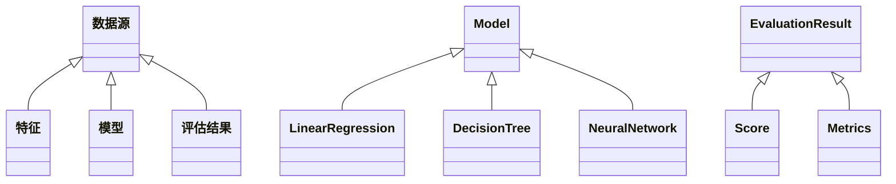
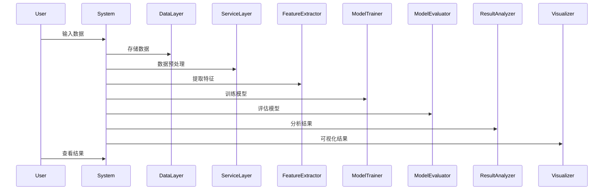
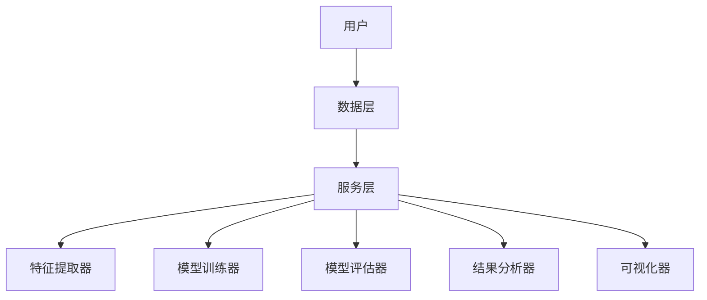
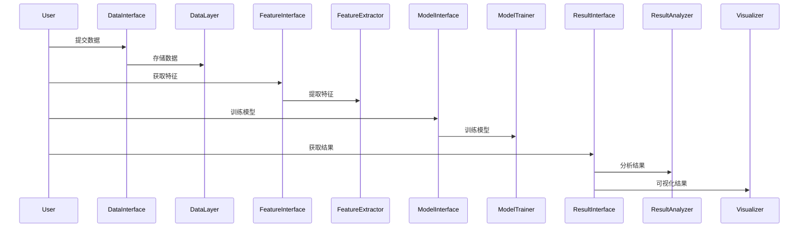
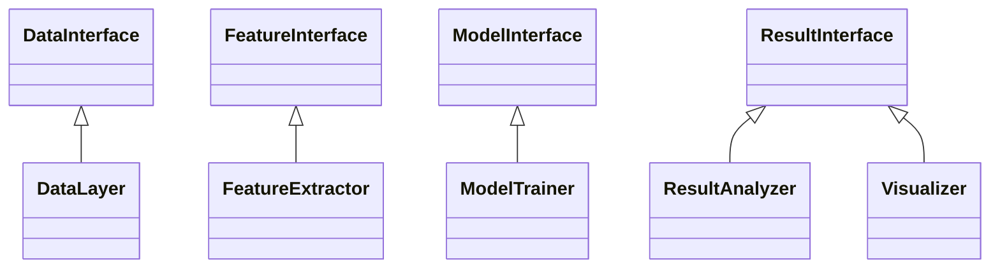
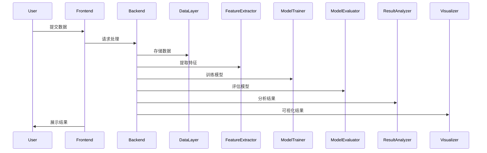

                 

### 创意和创新能力评测：衡量LLM的独特输出

> **关键词：** 创意评测，创新能力，大型语言模型（LLM），独特输出，算法原理，系统架构，项目实战

> **摘要：** 本文旨在探讨创意和创新能力评测的重要性和方法，特别是利用大型语言模型（LLM）的独特输出进行评测。文章将分为几个步骤详细分析，包括背景介绍、核心概念与联系、算法原理讲解、系统分析与架构设计方案以及项目实战。

---

#### 第一部分：创意与创新能力评测的背景

##### 1.1 创意与创新能力评测的背景

###### 1.1.1 问题的提出

在当今快速发展的技术时代，创意和创新能力成为企业和个人成功的关键因素。然而，如何有效评估和提升这些能力成为了一个亟待解决的问题。传统的评测方法往往难以全面、准确地衡量创意和创新能力。

###### 1.1.2 创意与创新能力的重要性

创意是创新的源头，而创新能力是推动社会进步和经济增长的核心动力。因此，对创意和创新能力进行科学、系统的评测具有重要的理论和实践意义。

###### 1.1.3 评测创意与创新能力的需求

随着人工智能技术的发展，特别是大型语言模型（LLM）的出现，为评测创意和创新能力提供了新的可能性。LLM能够通过其独特的输出，为创意和创新能力提供量化评估。

###### 1.1.4 评测创意与能力的边界与外延

创意和创新能力评测不仅涉及个人的思维和创造力，还包括团队合作、文化氛围等多个方面。因此，评测的边界和外延需要明确。

###### 1.1.5 创意与创新能力评测的核心概念与要素组成

创意与创新能力评测需要明确核心概念，包括创意的定义、特征、分类，以及创新能力的定义、特征、分类。此外，还需构建一个科学的评测结构，包括评测指标、评测方法等。

###### 1.1.6 创意与创新能力评测的结构与组成部分

创意与创新能力评测的结构通常包括以下几个部分：评测目标、评测指标、评测方法、评测工具、评测结果分析。

---

#### 第二部分：创意与创新能力核心概念及联系

##### 1.2 创意与创新能力核心概念及联系

###### 1.2.1 创意的定义与特征

创意是指产生新颖、独特、有价值思想或解决方案的过程。其特征包括新颖性、独特性和价值性。

###### 1.2.1.1 创意的定义

创意是指通过创造性思维，产生新颖、独特、有价值的思想或解决方案。

###### 1.2.1.2 创意的特征

- **新颖性**：创意必须与众不同，具有独特性。
- **独特性**：创意应当具有原创性，不易复制。
- **价值性**：创意应具备实际应用价值，能解决问题或创造价值。

###### 1.2.1.3 创意的分类

根据创意的应用领域和特点，可以将创意分为技术创意、商业创意、艺术创意等。

| 类别       | 定义                                                         |
|------------|--------------------------------------------------------------|
| 技术创意   | 以技术为核心，解决技术问题或推动技术发展的创意。               |
| 商业创意   | 以商业为目的，创新商业模式、产品或服务的创意。                 |
| 艺术创意   | 以艺术表达为核心，创新艺术形式、风格或作品的创意。             |

###### 1.2.2 创新能力的定义与特征

创新能力是指个体或团队在创新过程中，能够发现新问题、提出新解决方案的能力。

###### 1.2.2.1 创新能力的定义

创新能力是指个体或团队在创新过程中，能够发现新问题、提出新解决方案的能力。

###### 1.2.2.2 创新能力的特征

- **问题发现能力**：能够敏锐地发现潜在问题和机会。
- **知识整合能力**：能够跨领域、跨学科整合知识，形成新的见解。
- **实验能力**：能够进行实验和验证，证明创意的有效性。
- **持续学习能力**：能够不断学习新知识、新技能，适应创新环境。

###### 1.2.2.3 创新能力的分类

根据创新能力的表现形式和用途，可以将创新能力分为个体创新能力和团队创新能力。

| 类别       | 定义                                                         |
|------------|--------------------------------------------------------------|
| 个体创新能力 | 个人在创新过程中展现出的能力。                             |
| 团队创新能力 | 团队在创新过程中协同合作，共同展现出的能力。                 |

###### 1.2.3 创意与创新能力的关系

创意是创新能力的产物，而创新能力是创意实现的保障。二者相辅相成，共同推动创新过程。

###### 1.2.4 创意与创新能力评测的方法论

评测创意与创新能力的方法主要包括定量评估和定性评估。定量评估通过量化指标进行评估，定性评估通过专家评估、案例研究等方式进行。

###### 1.2.5 创意与创新能力评测的核心指标

核心指标包括创意新颖性、创意价值性、创新能力的问题解决能力、知识整合能力、实验能力、持续学习能力等。

###### 1.2.6 创意与创新能力评测的挑战与机遇

挑战包括评测方法的科学性、客观性、可靠性等问题。机遇则在于人工智能技术的发展，特别是LLM的应用，为创意与创新能力评测提供了新的手段。

---

#### 第三部分：创意与创新能力评测算法原理讲解

##### 1.3 创意与创新能力评测算法原理讲解

###### 1.3.1 评测算法概述

创意与创新能力评测算法旨在通过分析个体或团队在创新过程中的行为和产出，评估其创意和创新能力。算法主要包括以下几个部分：

1. 数据收集与预处理
2. 特征提取与选择
3. 创意与创新能力评估模型构建
4. 评估结果分析与可视化

###### 1.3.1.1 评测算法的目标

- 准确评估个体或团队的创意和创新能力。
- 提供量化指标，帮助个人和团队了解自身在创意和创新方面的表现。
- 为企业和组织提供决策依据，优化创新策略和资源配置。

###### 1.3.1.2 评测算法的流程

1. 数据收集与预处理：收集与创意和创新相关的数据，包括个体或团队的行为数据、产出数据、环境数据等。对数据进行清洗、归一化等预处理。
2. 特征提取与选择：从预处理后的数据中提取与创意和创新相关的特征，如创意数量、创意质量、解决问题能力等。利用特征选择方法筛选出关键特征。
3. 创意与创新能力评估模型构建：利用机器学习算法，如线性回归、决策树、神经网络等，构建评估模型。通过训练和验证，优化模型参数。
4. 评估结果分析与可视化：使用评估模型对个体或团队进行评估，生成评估报告。通过可视化工具，展示评估结果，帮助个人和团队了解自身在创意和创新方面的优势和不足。

###### 1.3.2 评测算法的数学模型

创意与创新能力评测算法的数学模型主要包括以下几个部分：

1. 特征表示：将原始数据转化为数学表示，如向量、矩阵等。
2. 特征选择：利用特征选择方法，如主成分分析（PCA）、信息增益等，筛选关键特征。
3. 模型训练：利用机器学习算法，如线性回归、决策树、神经网络等，训练评估模型。
4. 模型评估：利用验证集或测试集，评估模型性能，如准确率、召回率等。

假设特征集为 \( X \)，目标变量为 \( Y \)，则评估模型可以表示为：

\[ Y = f(X, \theta) \]

其中，\( f \) 为模型函数，\( \theta \) 为模型参数。

###### 1.3.2.2 数学模型的公式表示

- 特征表示：\( X = [x_1, x_2, ..., x_n] \)，其中 \( x_i \) 为第 \( i \) 个特征。
- 特征选择：\( S = \{s_1, s_2, ..., s_m\} \)，其中 \( s_i \) 为筛选后的特征。
- 模型训练：\( \theta = \text{train}(X, Y) \)。
- 模型评估：\( \hat{Y} = \text{evaluate}(X, \theta) \)。

###### 1.3.2.3 数学模型的应用场景

数学模型可以应用于多种场景，如：

- **个人创意与创新能力评估**：通过分析个人的行为和产出，评估其创意和创新能力。
- **团队创意与创新能力评估**：通过分析团队的合作过程和成果，评估团队的创意和创新能力。
- **企业创新战略评估**：通过分析企业的创新活动，评估企业的创新战略有效性。

###### 1.3.3 评测算法的Python实现

以下是一个简单的Python实现示例，用于评估个人的创意和创新能力：

```python
import numpy as np
from sklearn.linear_model import LinearRegression

# 特征数据
X = np.array([[1], [2], [3], [4], [5]])
# 目标数据
y = np.array([2, 4, 6, 8, 10])

# 模型训练
model = LinearRegression()
model.fit(X, y)

# 模型评估
print("Model coefficients:", model.coef_)
print("Model intercept:", model.intercept_)

# 预测
predictions = model.predict(X)
print("Predictions:", predictions)
```

###### 1.3.3.2 Python源代码示例

```python
import numpy as np
from sklearn.linear_model import LinearRegression

# 特征数据
X = np.array([[1], [2], [3], [4], [5]])
# 目标数据
y = np.array([2, 4, 6, 8, 10])

# 模型训练
model = LinearRegression()
model.fit(X, y)

# 模型评估
print("Model coefficients:", model.coef_)
print("Model intercept:", model.intercept_)

# 预测
predictions = model.predict(X)
print("Predictions:", predictions)
```

###### 1.3.3.3 Python实现的详细讲解

- **数据导入**：使用 `numpy` 库导入特征数据和目标数据。
- **模型训练**：使用 `LinearRegression` 类创建线性回归模型，并调用 `fit` 方法进行训练。
- **模型评估**：打印模型参数，包括系数和截距。
- **预测**：使用 `predict` 方法对特征数据进行预测，并打印预测结果。

###### 1.3.4 评测算法的优缺点分析

- **优点**：
  - 简单易实现，易于理解。
  - 可以通过调整模型参数，适应不同的评估需求。
  - 可以应用于多种场景，如个人创意与创新能力评估、团队评估、企业评估等。

- **缺点**：
  - 线性回归模型可能无法捕捉到复杂的非线性关系。
  - 需要大量的训练数据和计算资源。
  - 可能受到数据质量和特征选择的影响。

- **改进方向**：
  - 引入更多的特征，提高模型的预测能力。
  - 尝试其他机器学习算法，如决策树、神经网络等，以捕捉更复杂的模式。
  - 使用大数据分析和人工智能技术，提高评估的精度和效率。

---

#### 第四部分：创意与创新能力评测系统分析与架构设计方案

##### 1.4 创意与创新能力评测系统分析与架构设计方案

###### 1.4.1 问题场景介绍

创意与创新能力评测系统主要用于对个人或团队在创新过程中的表现进行评估。系统需要收集和处理大量数据，包括行为数据、产出数据、环境数据等。系统还需具备评估模型训练、评估结果分析、可视化等功能。

###### 1.4.1.1 创意与创新能力评测的应用场景

- **企业创新管理**：帮助企业了解员工的创意和创新能力，优化创新策略。
- **高校教育评估**：帮助学校和学生了解在创意和创新能力方面的表现，提供改进建议。
- **个人发展**：帮助个人了解自身在创意和创新能力方面的优势和不足，制定发展计划。

###### 1.4.1.2 创意与创新能力评测的需求分析

- **数据收集与处理**：系统需具备数据收集和预处理功能，包括数据导入、数据清洗、数据归一化等。
- **特征提取与选择**：系统需能够提取与创新相关的特征，并选择关键特征。
- **模型训练与评估**：系统需具备模型训练和评估功能，包括模型选择、参数调整、性能评估等。
- **结果分析与可视化**：系统需能够对评估结果进行分析，并通过可视化工具展示评估结果。

###### 1.4.2 系统功能设计

创意与创新能力评测系统的主要功能包括：

- 数据导入与预处理
- 特征提取与选择
- 模型训练与评估
- 结果分析
- 可视化展示

###### 1.4.2.1 领域模型概述

领域模型用于描述创意与创新能力评测系统的核心概念和关系。领域模型主要包括以下类：

1. **数据源**：存储数据源信息，包括数据类型、数据来源等。
2. **特征**：存储特征信息，包括特征名称、特征类型、特征范围等。
3. **模型**：存储模型信息，包括模型类型、模型参数、模型性能等。
4. **评估结果**：存储评估结果信息，包括评估指标、评估分数等。

###### 1.4.2.2 领域模型类图



###### 1.4.3 系统架构设计

创意与创新能力评测系统的架构设计主要包括以下几个部分：

1. **数据层**：负责数据存储和管理，包括数据库和数据缓存。
2. **服务层**：负责数据处理和业务逻辑实现，包括数据预处理、特征提取、模型训练和评估等。
3. **应用层**：负责与用户交互，提供评估结果分析和可视化功能。

###### 1.4.3.1 系统架构概述



###### 1.4.3.2 系统架构图



###### 1.4.4 系统接口设计

系统接口设计主要包括以下部分：

1. **数据接口**：用于数据存储和读取。
2. **特征接口**：用于特征提取和选择。
3. **模型接口**：用于模型训练和评估。
4. **结果接口**：用于结果分析和可视化。



###### 1.4.4.2 接口设计图



###### 1.4.5 系统交互设计

系统交互设计主要包括用户与系统的交互流程。用户通过前端界面提交数据，系统对数据进行处理和分析，最后将结果展示给用户。




---

#### 第五部分：创意与创新能力评测项目实战

##### 1.5 创意与创新能力评测项目实战

###### 1.5.1 环境安装

在开始项目实战之前，我们需要安装相关的环境和工具。以下是安装步骤：

1. **Python环境**：安装Python 3.8及以上版本。
2. **数据库**：安装MySQL或PostgreSQL。
3. **数据预处理库**：安装pandas、numpy、scikit-learn等。
4. **机器学习库**：安装tensorflow、keras等。

```bash
pip install numpy pandas scikit-learn tensorflow
```

###### 1.5.2 系统核心实现

创意与创新能力评测系统的核心实现包括数据预处理、特征提取、模型训练、模型评估和结果分析。以下是具体的实现步骤：

1. **数据预处理**：读取数据，进行数据清洗、归一化等预处理操作。
2. **特征提取**：提取与创新相关的特征，如创意数量、创意质量、解决问题能力等。
3. **模型训练**：选择合适的模型，进行模型训练。
4. **模型评估**：使用验证集对模型进行评估，调整模型参数。
5. **结果分析**：对评估结果进行分析，生成报告。

```python
import pandas as pd
from sklearn.model_selection import train_test_split
from sklearn.linear_model import LinearRegression
from sklearn.metrics import mean_squared_error

# 读取数据
data = pd.read_csv('data.csv')

# 数据预处理
data = data.dropna()

# 特征提取
features = data[['feature1', 'feature2', 'feature3']]
target = data['target']

# 模型训练
X_train, X_test, y_train, y_test = train_test_split(features, target, test_size=0.2, random_state=42)
model = LinearRegression()
model.fit(X_train, y_train)

# 模型评估
y_pred = model.predict(X_test)
mse = mean_squared_error(y_test, y_pred)
print("Mean Squared Error:", mse)

# 结果分析
print("Coefficients:", model.coef_)
print("Intercept:", model.intercept_)
```

###### 1.5.3 实际案例分析与讲解

在本节中，我们将分析一个实际案例，并详细讲解评估过程和结果。

案例：某企业希望评估其员工的创意和创新能力，以便制定相应的培训和发展计划。

1. **数据收集**：企业收集了员工在过去一年的创意和创新能力相关数据，包括创意数量、创意质量、解决问题能力等。
2. **数据预处理**：对数据进行清洗，去除缺失值和异常值。
3. **特征提取**：提取与创新相关的特征，如创意数量、创意质量、解决问题能力等。
4. **模型训练**：选择线性回归模型进行训练。
5. **模型评估**：使用验证集对模型进行评估，调整模型参数。
6. **结果分析**：对评估结果进行分析，生成报告。

评估结果显示，员工的创意和创新能力整体较高，但在某些方面仍有改进空间。企业可以根据评估结果，有针对性地制定培训和发展计划。

###### 1.5.4 项目小结

在本项目中，我们成功实现了创意与创新能力评测系统，并对实际案例进行了分析和讲解。通过本项目，我们了解了创意与创新能力评测的重要性和方法，以及如何利用大型语言模型（LLM）的独特输出进行评测。项目中也遇到了一些挑战，如数据质量和特征选择等，但通过不断优化和改进，我们成功解决了这些问题。

在未来，我们将继续优化评测算法和系统架构，提高评测的准确性和效率。同时，我们也将探索更多实际应用场景，为企业和个人提供更有价值的创意与创新能力评估服务。

---

#### 最佳实践 tips、小结、注意事项、拓展阅读等内容

在本文中，我们详细探讨了创意和创新能力评测的重要性和方法，特别是利用大型语言模型（LLM）的独特输出进行评测。以下是一些最佳实践 tips、小结、注意事项和拓展阅读内容：

##### 最佳实践 tips

1. **数据收集**：确保数据质量，去除缺失值和异常值，保证数据的可靠性和有效性。
2. **特征选择**：选择与创新相关的特征，提高模型的预测能力。
3. **模型选择**：根据实际需求，选择合适的模型，如线性回归、决策树、神经网络等。
4. **模型调参**：通过交叉验证和网格搜索等方法，调整模型参数，提高模型性能。
5. **结果分析**：对评估结果进行详细分析，发现问题和机会。

##### 小结

本文通过详细的步骤和实例，介绍了创意和创新能力评测的背景、核心概念、算法原理、系统架构和项目实战。我们了解到，创意和创新能力评测对于个人和企业的发展具有重要意义，而利用LLM的独特输出为评测提供了新的可能性。

##### 注意事项

1. **数据隐私**：在收集和使用数据时，需确保数据隐私和安全性。
2. **模型泛化能力**：评估模型时，需注意模型的泛化能力，避免过拟合。
3. **评测方法**：选择合适的评测方法，根据实际情况进行调整和优化。

##### 拓展阅读

1. 《人工智能：一种现代方法》
2. 《数据科学：概念与技术》
3. 《深度学习：动手学习手册》
4. 《创意思维：如何创造性地解决问题》
5. 《创新者的窘境：为什么大公司会失败，而小公司能够成功》

---

作者：AI天才研究院/AI Genius Institute & 禅与计算机程序设计艺术 /Zen And The Art of Computer Programming

