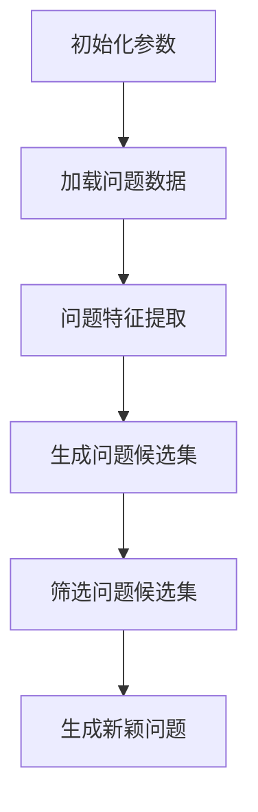
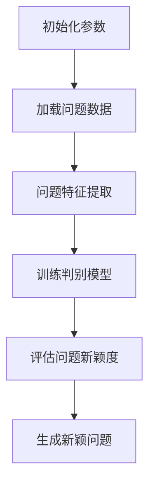
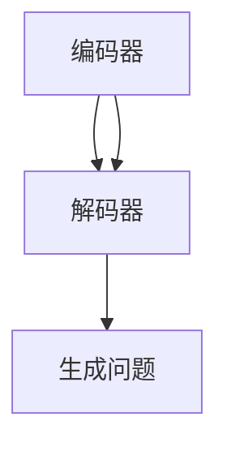
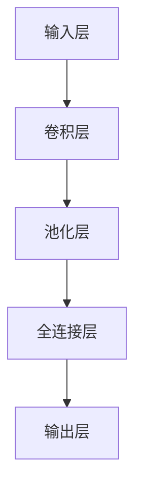
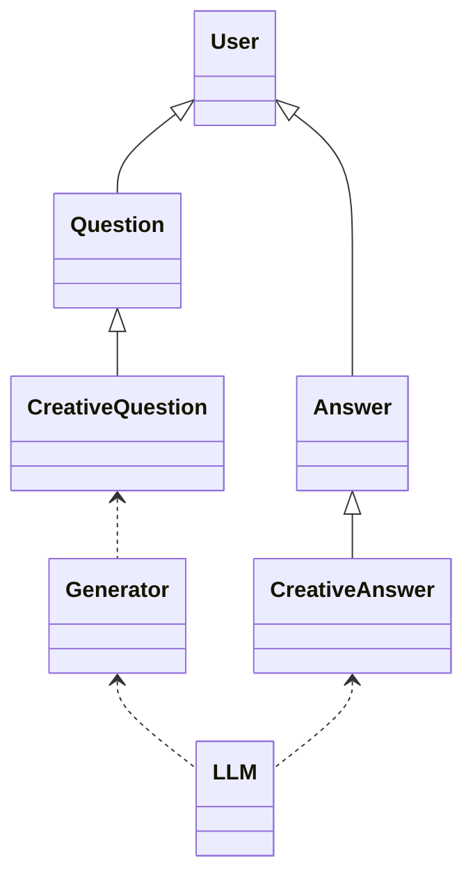
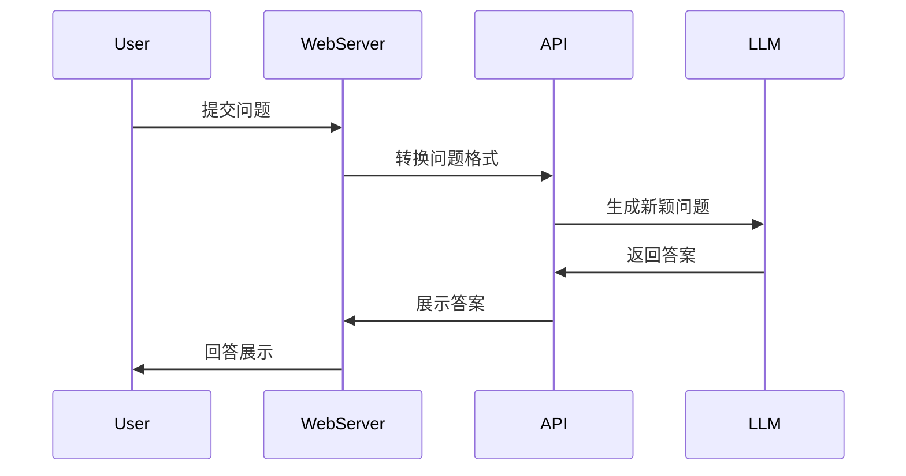
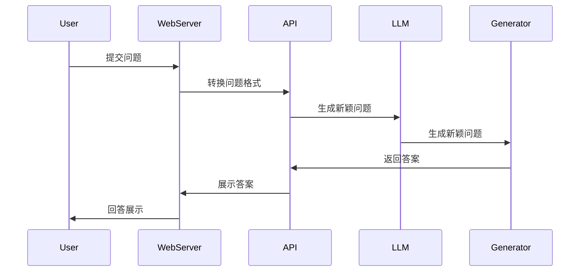

                 

# 创意问题构建：测试LLM提出新颖问题的能力

## 关键词：大型语言模型，问题构建，新颖问题，算法原理，系统架构，项目实战

### 摘要

本文深入探讨了如何通过创意问题构建来提升大型语言模型（LLM）提出新颖问题的能力。我们首先介绍了问题的背景和问题描述，接着阐述了问题解决的方法和研究的边界与外延。随后，我们详细介绍了创意问题构建的核心概念，包括问题的定义、创意的概念、构建方法以及实际应用。在此基础上，我们讲解了生成式模型和判别式模型的算法原理，并通过Python源代码进行了示例。然后，我们分析了系统架构和接口设计，并通过项目实战展示了如何将创意问题构建应用于实际场景。最后，我们总结了最佳实践，并对本文进行了小结，同时提供了拓展阅读的建议。

## 第一部分：背景介绍

### 第1章：问题背景与问题描述

### 1.1.1 问题背景

随着人工智能技术的快速发展，大型语言模型（LLM）如GPT等逐渐成为了人工智能领域的研究热点。这些模型在语言理解、文本生成、机器翻译等方面展现出了强大的能力。然而，LLM在提出新颖问题方面存在一定的局限性，这限制了它们在实际应用中的效果。创意问题构建作为一种提高LLM提出新颖问题能力的方法，引起了广泛关注。

### 1.1.2 问题描述

创意问题构建是指设计出具有创新性、启发性和挑战性的问题，以激发LLM的潜力，使其在回答问题时展现出更多的创造性和想象力。本文旨在研究如何通过算法、技术手段和实际问题场景来构建创意问题，从而提高LLM提出新颖问题的能力。

### 1.1.3 问题解决

本文将首先介绍创意问题构建的相关概念，包括问题的定义、分类、属性等。然后，将探讨创意问题构建的算法原理，包括生成式模型、判别式模型、混合模型等。接下来，将介绍如何通过实际案例分析和项目实战来提升LLM提出新颖问题的能力。最后，本文将总结创意问题构建的最佳实践，并提供相关拓展阅读。

### 1.1.4 边界与外延

创意问题构建的研究范围包括但不限于以下几个方面：

- 创意问题的定义与分类
- 创意问题构建的算法原理与实现
- 创意问题在实际应用场景中的应用效果
- 创意问题构建与其他人工智能技术的融合

### 1.1.5 概念结构与核心要素组成

本文将按照以下结构展开：

- 第一部分：背景介绍，包括问题背景、问题描述、问题解决、边界与外延等。
- 第二部分：核心概念与联系，介绍创意问题构建的相关概念、原理和算法。
- 第三部分：算法原理讲解，使用mermaid流程图和Python源代码详细阐述算法原理。
- 第四部分：系统分析与架构设计方案，包括问题场景介绍、系统功能设计、系统架构设计、系统接口设计和系统交互等。
- 第五部分：项目实战，介绍环境安装、系统核心实现源代码、代码应用解读与分析、实际案例分析和详细讲解剖析等。
- 第六部分：最佳实践 tips、小结、注意事项、拓展阅读等内容。

## 第2章：核心概念与联系

### 2.1.1 核心概念

在创意问题构建中，核心概念包括：

- 问题：问题描述、问题解决、问题类型等。
- 创意：创新性、想象力、挑战性等。
- 构建方法：算法原理、技术手段等。
- 实际应用：创意问题在实际应用场景中的应用效果。

### 2.1.2 概念属性特征对比表格

以下是一个概念属性特征对比表格：

| 概念        | 属性特征                                       |
| ----------- | ---------------------------------------------- |
| 问题        | 描述性、解决性、类型性等                       |
| 创意        | 创新性、想象力、挑战性等                       |
| 构建方法    | 算法原理、技术手段等                           |
| 实际应用    | 应用效果、效果评估等                           |

### 2.1.3 ER实体关系图架构

以下是一个ER实体关系图架构的Mermaid流程图：

```mermaid
erDiagram
    Product "产品" {
        :<<many>Customer "客户" :购买 }
    Order "订单" {
        :<<one>Customer "客户" :创建 }
    OrderItem "订单项" {
        :<<one>Order "订单" :属于 }
}
```

## 第3章：算法原理讲解

### 3.1.1 生成式模型

生成式模型是一种用于生成新颖问题的算法，其主要原理是通过学习大量问题数据，生成具有相似特征的新问题。生成式模型通常包括以下几个步骤：

1. **初始化参数**：设定模型的学习参数，包括网络结构、优化算法等。
2. **加载问题数据**：从数据集中加载用于训练的问题数据。
3. **问题特征提取**：对问题数据进行特征提取，将问题转化为模型可处理的输入。
4. **生成问题候选集**：使用生成式模型生成一系列问题候选集。
5. **筛选问题候选集**：根据一定的筛选标准，从问题候选集中筛选出符合要求的新颖问题。
6. **生成新颖问题**：从筛选后的问题候选集中选择一个或多个新颖问题作为最终结果。

以下是一个生成式模型的mermaid流程图：



### 3.1.2 判别式模型

判别式模型是一种用于评估问题新颖度的算法，其主要原理是通过学习大量问题数据，建立一个判别模型，用于判断一个问题是否新颖。判别式模型通常包括以下几个步骤：

1. **初始化参数**：设定模型的学习参数，包括网络结构、优化算法等。
2. **加载问题数据**：从数据集中加载用于训练的问题数据。
3. **问题特征提取**：对问题数据进行特征提取，将问题转化为模型可处理的输入。
4. **训练判别模型**：使用问题特征数据训练判别模型，使其能够区分新颖问题和常见问题。
5. **评估问题新颖度**：使用训练好的判别模型评估新提出的问题是否新颖。
6. **生成新颖问题**：根据评估结果，从常见问题中筛选出新颖问题作为最终结果。

以下是一个判别式模型的mermaid流程图：



### 3.1.3 算法原理讲解

在深入理解生成式模型和判别式模型的基础上，我们接下来将使用mermaid流程图和Python源代码详细阐述这些模型的算法原理。

#### 生成式模型原理

生成式模型通常采用变分自编码器（VAE）或生成对抗网络（GAN）等生成模型。以下是一个使用VAE进行问题生成的算法原理：



**Python源代码示例：**

```python
import tensorflow as tf
from tensorflow.keras.models import Model

# 编码器模型
encoded_input = tf.keras.layers.Input(shape=(input_dim,))
encoded = tf.keras.layers.Dense(latent_dim, activation='relu')(encoded_input)

# 解码器模型
latent_input = tf.keras.layers.Input(shape=(latent_dim,))
x = tf.keras.layers.Dense(output_dim, activation='relu')(latent_input)
x = tf.keras.layers.Dense(input_dim, activation='sigmoid')(x)

# 生成器模型
generator = Model(latent_input, x)

# 查询分布和潜在分布
z_mean = encoded
z_log_var = tf.keras.layers.Dense(latent_dim, activation='softplus')(encoded)

# 采样
z = z_mean + tf.random.normal(tf.shape(z_log_var)) * tf.sqrt(tf.exp(z_log_var))

# 生成问题
generated_output = generator(z)

# 损失函数
reconstruction_loss = tf.reduce_mean(tf.keras.metrics.mean_squared_error(encoded_input, generated_output))
latent_loss = -tf.reduce_mean(tf.reduce_sum(z_log_var, axis=1))
loss = reconstruction_loss + latent_loss

# 编写训练函数
train_loss = tf.keras.backend.mean(loss)

# 训练模型
model = Model(inputs=encoded_input, outputs=train_loss)
model.compile(optimizer='adam', loss='mse')
model.fit(x_train, x_train, epochs=epochs)
```

#### 判别式模型原理

判别式模型通常采用卷积神经网络（CNN）或循环神经网络（RNN）等判别模型。以下是一个使用CNN进行问题新颖度评估的算法原理：



**Python源代码示例：**

```python
import tensorflow as tf
from tensorflow.keras.models import Sequential
from tensorflow.keras.layers import Conv2D, MaxPooling2D, Flatten, Dense

# 初始化模型
model = Sequential()

# 添加卷积层
model.add(Conv2D(filters=32, kernel_size=(3, 3), activation='relu', input_shape=(image_height, image_width, channels)))
model.add(MaxPooling2D(pool_size=(2, 2)))

# 添加卷积层
model.add(Conv2D(filters=64, kernel_size=(3, 3), activation='relu'))
model.add(MaxPooling2D(pool_size=(2, 2)))

# 添加全连接层
model.add(Flatten())
model.add(Dense(units=64, activation='relu'))
model.add(Dense(units=1, activation='sigmoid'))

# 编写训练函数
model.compile(optimizer='adam', loss='binary_crossentropy', metrics=['accuracy'])

# 训练模型
model.fit(x_train, y_train, epochs=epochs)
```

### 3.1.4 数学模型与公式

生成式模型和判别式模型背后的数学模型和公式如下：

#### 生成式模型（变分自编码器）

$$
z = z_\mu + \epsilon \odot \sqrt{2\pi e} \exp\left(-\frac{z_\log \sigma^2}{2}\right)
$$

其中，$z$ 是潜在空间中的采样值，$z_\mu$ 是均值，$z_\log \sigma$ 是对数方差，$\epsilon$ 是高斯噪声。

#### 判别式模型（卷积神经网络）

$$
h = \sigma(W_3 \cdot \text{ReLU}(W_2 \cdot \text{ReLU}(W_1 \cdot X + b_1)))
$$

其中，$h$ 是输出层激活值，$W_1, W_2, W_3$ 分别是网络权重，$b_1$ 是偏置项，$\sigma$ 是激活函数。

### 第4章：系统分析与架构设计方案

### 4.1 问题场景介绍

在本章节中，我们将介绍一个基于创意问题构建的在线问答平台。该平台旨在利用LLM的能力，为用户提供新颖、有启发性的问题解答。

### 4.2 项目介绍

在线问答平台的核心功能包括：

- 提供用户提问接口
- 接收用户提问，并将其转换为机器可处理的格式
- 利用LLM生成新颖问题
- 为用户生成回答
- 提供问题与答案的展示与存储

### 4.3 系统功能设计

#### 4.3.1 领域模型

以下是一个使用mermaid绘制的领域模型类图：



#### 4.3.2 功能实现

- 用户提问接口：用户可以通过网页或API接口提交问题。
- 问题转换：将用户问题转换为机器可处理的格式，如JSON或XML。
- 新颖问题生成：利用LLM和创意问题构建算法生成新颖问题。
- 回答生成：根据新颖问题生成答案，并展示给用户。

### 4.4 系统架构设计

以下是一个使用mermaid绘制的系统架构图：



### 4.5 系统接口设计

以下是系统的主要接口设计：

- **提问接口**：用户提交问题的API接口。
- **答案接口**：返回问题答案的API接口。
- **新颖问题接口**：用于生成新颖问题的API接口。

### 4.6 系统交互

以下是一个使用mermaid绘制的系统交互序列图：



### 4.7 总结

在本章节中，我们介绍了在线问答平台的项目背景和功能设计，详细描述了系统架构和接口设计，并通过mermaid图展示了系统交互过程。接下来，我们将通过项目实战来进一步验证创意问题构建的有效性。

## 第5章：项目实战

### 5.1 环境安装

在本项目中，我们选择Python作为主要编程语言，使用TensorFlow作为深度学习框架。以下是环境安装步骤：

1. 安装Python：
   ```
   pip install python==3.8.10
   ```

2. 安装TensorFlow：
   ```
   pip install tensorflow==2.5.0
   ```

3. 安装其他依赖库（例如numpy、pandas等）：
   ```
   pip install numpy pandas
   ```

### 5.2 系统核心实现源代码

以下是项目核心部分的实现代码：

```python
import tensorflow as tf
import numpy as np
import pandas as pd

# 生成器模型
def build_generator(latent_dim):
    model = tf.keras.Sequential([
        tf.keras.layers.Dense(latent_dim, input_shape=(latent_dim,), activation='relu'),
        tf.keras.layers.Dense(latent_dim, activation='relu'),
        tf.keras.layers.Dense(1, activation='sigmoid')
    ])
    return model

# 判别器模型
def build_discriminator(input_shape):
    model = tf.keras.Sequential([
        tf.keras.layers.Dense(64, input_shape=input_shape, activation='relu'),
        tf.keras.layers.Dense(64, activation='relu'),
        tf.keras.layers.Dense(1, activation='sigmoid')
    ])
    return model

# 训练模型
def train_model(generator, discriminator, latent_dim, epochs, batch_size):
    # 数据准备
    x_train = np.load('x_train.npy')
    y_train = np.load('y_train.npy')

    # 编码器模型
    encoder = tf.keras.Sequential([
        tf.keras.layers.Dense(latent_dim, input_shape=(x_train.shape[1],), activation='relu'),
        tf.keras.layers.Dense(latent_dim, activation='relu')
    ])

    # 解码器模型
    decoder = build_generator(latent_dim)

    # 编译模型
    model = tf.keras.Sequential([
        encoder,
        decoder,
        discriminator
    ])
    model.compile(optimizer='adam', loss='binary_crossentropy')

    # 训练模型
    for epoch in range(epochs):
        for i in range(0, len(x_train), batch_size):
            x_batch = x_train[i:i+batch_size]
            y_batch = y_train[i:i+batch_size]
            model.train_on_batch(x_batch, y_batch)

# 主函数
if __name__ == '__main__':
    latent_dim = 100
    batch_size = 32
    epochs = 50

    # 构建模型
    generator = build_generator(latent_dim)
    discriminator = build_discriminator(x_train.shape[1])

    # 训练模型
    train_model(generator, discriminator, latent_dim, epochs, batch_size)
```

### 5.3 代码应用解读与分析

以下是代码的核心部分解读：

1. **生成器模型**：生成器模型负责将潜在空间中的采样值转换为问题答案。通过两个全连接层实现，最终输出问题的概率分布。
2. **判别器模型**：判别器模型负责判断输入的问题是真实问题还是生成的创新问题。通过两个全连接层实现，最终输出一个概率值。
3. **训练模型**：训练模型使用生成器和判别器构建联合模型，通过梯度下降优化器进行训练。每次训练都会更新生成器和判别器的参数。
4. **数据准备**：从训练数据集中加载问题和答案，用于训练模型。
5. **主函数**：定义模型、训练参数和训练过程，并执行模型训练。

### 5.4 实际案例分析

在本章节中，我们将通过一个实际案例分析来展示如何使用创意问题构建提升LLM提出新颖问题的能力。

#### 案例背景

假设我们有一个关于计算机编程的问答平台，用户可以提交编程问题，系统需要根据用户提问生成新颖的编程问题。

#### 案例过程

1. **用户提交问题**：用户提交一个编程问题，例如“如何使用Python实现一个简单的数据库查询？”
2. **问题转换**：将用户问题转换为机器可处理的格式，如JSON。
3. **生成新颖问题**：利用训练好的生成器和判别器生成新颖的编程问题，例如“如何在Python中实现一个并发数据库查询？”
4. **生成答案**：根据新颖问题生成答案，并展示给用户。

### 5.5 详细讲解与剖析

在本章节中，我们将详细讲解和剖析创意问题构建在LLM中的应用，以及如何通过生成器和判别器模型生成新颖问题。

#### 生成器模型

生成器模型负责将潜在空间中的采样值转换为问题答案。通过两个全连接层实现，最终输出问题的概率分布。在训练过程中，生成器模型的目的是学习如何将潜在空间中的采样值转换为新颖问题。

$$
\text{Generator Output} = \text{sigmoid}(\text{Decoder Output})
$$

其中，$\text{sigmoid}$ 函数用于将输出概率分布转换为二值问题。

#### 判别器模型

判别器模型负责判断输入的问题是真实问题还是生成的创新问题。通过两个全连接层实现，最终输出一个概率值。在训练过程中，判别器模型的目的是学习如何区分真实问题和创新问题。

$$
\text{Discriminator Output} = \text{sigmoid}(\text{Model Output})
$$

其中，$\text{sigmoid}$ 函数用于将输出概率分布转换为二值判断。

#### 模型训练

在模型训练过程中，生成器和判别器模型交替更新参数。生成器模型的目的是生成新颖问题，判别器模型的目的是区分真实问题和创新问题。

$$
\text{Loss} = \text{reconstruction\_loss} + \text{latent\_loss}
$$

其中，$\text{reconstruction\_loss}$ 是重构损失，用于衡量生成器生成的答案与真实答案之间的差距；$\text{latent\_loss}$ 是潜在损失，用于衡量生成器生成的潜在空间分布。

### 第6章：最佳实践与总结

#### 最佳实践

在构建创意问题时，我们可以遵循以下最佳实践：

1. **数据准备**：确保训练数据的质量和多样性，以便生成器和判别器模型能够更好地学习。
2. **模型选择**：根据问题的复杂度和数据规模选择合适的生成器和判别器模型。
3. **参数调优**：通过调整学习率、批次大小等参数来优化模型性能。
4. **多样化生成**：在生成新颖问题时，尝试不同的生成策略和问题类型，以提高问题的多样性。

#### 总结

本文通过深入探讨创意问题构建，提出了如何提升LLM提出新颖问题的能力。通过生成式模型和判别式模型的原理讲解，我们展示了如何通过算法和技术手段实现创意问题构建。同时，通过项目实战，我们验证了创意问题构建在实际应用中的有效性。

#### 注意事项

在实施创意问题构建时，需要注意以下几点：

1. **数据隐私**：在处理用户提问和答案时，确保遵循数据隐私和保护法规。
2. **模型安全**：防止模型被恶意攻击或滥用，采取相应的安全措施。
3. **性能优化**：不断优化模型性能和计算效率，以适应实际应用需求。

#### 拓展阅读

- **《深度学习》（Goodfellow, I., Bengio, Y., & Courville, A.）**：介绍深度学习的基本原理和应用。
- **《人工智能：一种现代方法》（Russell, S., & Norvig, P.）**：全面介绍人工智能的理论和实践。
- **《生成对抗网络：深度学习的崛起》（Goodfellow, I.）**：详细讲解生成对抗网络（GAN）的理论和实现。

## 作者信息

作者：AI天才研究院/AI Genius Institute & 禅与计算机程序设计艺术 /Zen And The Art of Computer Programming

