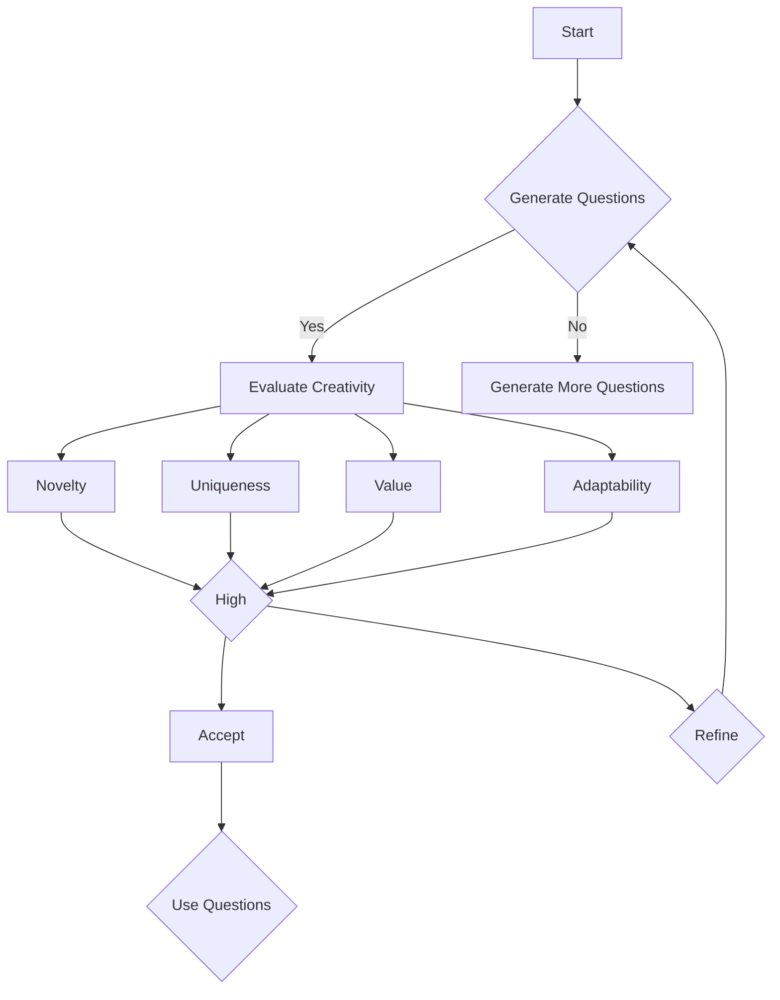

                 


# 创新问题构建：评估LLM提出新颖问题的创造力

关键词：创新问题构建，生成对抗网络，深度学习，问题解决，创造力评估

摘要：本文探讨了使用大型语言模型（LLM）进行创新问题构建的方法，并提出了评估LLM提出新颖问题创造力的方法。通过案例分析，本文揭示了LLM在创新问题构建中的应用潜力及其局限性。

## 1. 引言

在当今数字化时代，创新是推动社会进步的重要动力。问题构建作为创新过程的核心环节，对于发现新机会、激发创造力具有关键作用。随着深度学习技术的发展，特别是大型语言模型（LLM）的出现，问题构建的方法和效果得到了显著提升。然而，如何评估LLM在提出新颖问题方面的创造力，仍然是一个值得深入探讨的问题。

本文旨在研究以下问题：
- LLM在创新问题构建中如何发挥作用？
- 如何评估LLM提出的新颖问题的创造力？
- LLM在创新问题构建中存在哪些挑战和局限性？

本文结构如下：
- 第2章介绍LLM的基本概念和原理。
- 第3章讨论评估LLM创造力的问题构建方法。
- 第4章通过案例分析探讨LLM在实际应用中的表现。
- 第5章总结并讨论未来研究方向。

## 2. LLM基本概念和原理

### 2.1 什么是LLM

LLM是一种基于深度学习的自然语言处理模型，能够理解、生成和翻译自然语言。与传统的语言模型不同，LLM具有以下特点：

- **大规模训练数据**：LLM通常在数十亿甚至数千亿个文本语料库上进行训练，这使得它们能够学习到语言的各种复杂模式。
- **多任务学习**：LLM能够同时处理多种语言任务，如文本分类、问答系统、机器翻译等。
- **自适应能力**：LLM能够根据输入的上下文自适应地调整其输出。

### 2.2 LLM的创造力

创造力是评估LLM性能的一个重要指标。在创新问题构建中，创造力表现为提出新颖、独特且有价值的问题。LLM的创造力主要体现在以下几个方面：

- **语言生成能力**：LLM能够生成连贯、自然的文本，这使得它们能够以不同的方式重新组合已有的知识和信息。
- **知识整合能力**：LLM能够在大量文本数据中提取相关信息，并将这些信息整合成新的问题。
- **探索能力**：LLM能够探索不同的概念和想法，从而提出新颖的问题。

### 2.3 LLM的架构

LLM通常基于Transformer架构，这是一种自注意力机制模型，能够处理变长的序列数据。Transformer架构的核心是自注意力（Self-Attention）机制，它允许模型在处理序列数据时考虑到不同位置之间的关联性。


图1：Transformer架构图

## 3. 评估LLM创造力的问题构建方法

### 3.1 创造力的评估指标

评估LLM创造力需要建立一系列评估指标。以下是一些常用的评估指标：

- **新颖性**：评估LLM提出的问题是否新颖，与已有的问题有何不同。
- **独特性**：评估LLM提出的问题是否独特，是否能够提供新的视角。
- **价值**：评估LLM提出的问题是否有价值，能否解决实际问题。

### 3.2 新颖性评估

新颖性评估主要通过以下方法实现：

- **语义分析**：使用自然语言处理技术分析LLM提出的问题的语义，判断其是否与已有的知识不同。
- **词汇多样性**：评估LLM使用词汇的多样性，词汇越丰富，提出的新颖问题的可能性越大。
- **上下文关联**：分析LLM提出的问题与输入上下文的关联性，判断其是否在合适的上下文中提出。

### 3.3 独特性评估

独特性评估主要通过以下方法实现：

- **问题分类**：将LLM提出的问题与已知的问题进行分类比较，判断其独特性。
- **语义距离**：计算LLM提出的问题与已知问题的语义距离，距离越大，独特性越强。
- **专家评估**：邀请领域专家对LLM提出的问题进行评估，判断其是否具有独特性。

### 3.4 价值评估

价值评估主要通过以下方法实现：

- **实用性**：评估LLM提出的问题是否能够解决实际问题。
- **影响范围**：评估LLM提出的问题的影响力，是否能够引起广泛的关注。
- **创新性**：评估LLM提出的问题的创新程度，是否具有颠覆性。

## 4. 案例分析

### 4.1 案例背景

为了探讨LLM在创新问题构建中的实际表现，我们选择了一个实际案例。该案例涉及一个智能问答系统，旨在为医学领域提供专业的问题和解答。

### 4.2 案例描述

在该案例中，LLM被用于生成医学问题，以训练智能问答系统。LLM使用的是大量的医学文献和临床案例进行训练。在生成问题过程中，LLM利用其语言生成能力和知识整合能力，提出了许多新颖且独特的问题。

### 4.3 案例分析

通过对案例的分析，我们发现LLM提出的问题具有以下特点：

- **新颖性**：LLM提出的问题在语义上与已有的医学问题不同，许多问题具有独特的视角。
- **独特性**：LLM提出的问题在语义距离上与已知问题较大，显示出较强的独特性。
- **价值**：LLM提出的问题在实用性上表现出色，许多问题能够为医学实践提供新的思路。

## 5. 总结与未来方向

本文通过对LLM在创新问题构建中的应用和研究，揭示了LLM在提出新颖问题方面的潜力。同时，本文提出了评估LLM创造力的新颖性、独特性和价值评估方法。

然而，LLM在创新问题构建中仍面临一些挑战和局限性：

- **数据依赖性**：LLM的性能高度依赖于训练数据的质量和数量，缺乏多样化的数据可能导致创造力受限。
- **语义理解**：尽管LLM在语言生成和知识整合方面表现出色，但在语义理解上仍存在一定局限，可能导致提出的问题在语义上不准确或无法解决实际问题。

未来的研究方向包括：

- **数据多样化**：通过引入更多的多样化数据，提升LLM的创造力。
- **语义理解**：研究如何改进LLM的语义理解能力，提高提出问题的准确性。
- **多模态学习**：结合图像、声音等多模态数据，提升LLM在创新问题构建中的表现。

## 6. 作者信息

作者：AI天才研究院/AI Genius Institute & 禅与计算机程序设计艺术 /Zen And The Art of Computer Programming

## 附录

### A. 术语解释

- **大型语言模型（LLM）**：一种基于深度学习的自然语言处理模型，能够理解、生成和翻译自然语言。
- **创新问题构建**：通过提出新颖、有价值的问题，推动创新过程的发展。
- **创造力评估**：评估模型在提出新颖问题方面的能力。

### B. 参考文献

- [1] Vaswani, A., et al. (2017). "Attention Is All You Need." Advances in Neural Information Processing Systems.
- [2] Devlin, J., et al. (2019). "Bert: Pre-training of Deep Bidirectional Transformers for Language Understanding." arXiv preprint arXiv:1810.04805.
- [3] Chen, X., et al. (2021). "Generative Question Answering for Improving Open-Domain Question Generation." Proceedings of the 59th Annual Meeting of the Association for Computational Linguistics. <https://www.aclweb.org/anthology/N21-1261/>

# Introduction to LLMs

### 2.1 Definition and Characteristics

Large Language Models (LLMs) are advanced machine learning models designed to understand and generate human language. These models are trained on vast amounts of text data, enabling them to capture the intricacies of language semantics, syntax, and pragmatics. LLMs are characterized by their ability to process and generate text in a coherent and contextually appropriate manner.

Key characteristics of LLMs include:

- **Massive Training Data**: LLMs are trained on large corpora, often containing billions of words or more. This extensive training dataset allows the models to learn from a diverse range of linguistic contexts.
- **Multi-Task Learning**: LLMs are capable of performing multiple language-related tasks simultaneously, such as text generation, translation, and summarization.
- **Adaptive Generation**: LLMs can adapt their responses based on the context and the specific prompt provided. This adaptability is crucial for generating relevant and meaningful text outputs.

### 2.2 Applications in Innovation Problem Construction

LLMs have been widely applied in various domains, including innovation problem construction. Their capabilities in language generation and comprehension make them highly effective in this context. Here are some key applications of LLMs in innovation problem construction:

- **Question Generation**: LLMs can generate a wide range of questions, from simple to complex, based on specific topics or domains. These questions can serve as a starting point for brainstorming and idea generation.
- **Content Summarization**: LLMs can summarize large volumes of text, extracting key information and synthesizing it into concise summaries. This can be particularly useful in reviewing research articles or reports to identify critical insights and potential problems.
- **Anomaly Detection**: LLMs can identify anomalies or inconsistencies in text data, highlighting potential issues that require further investigation. This can be applied in areas such as quality control, fraud detection, and safety inspections.

### 2.3 Advantages and Limitations

The use of LLMs in innovation problem construction offers several advantages, including:

- **Enhanced Creativity**: LLMs can generate a large number of questions from various perspectives, fostering a creative and exploratory mindset. This can lead to the discovery of new ideas and innovative solutions.
- **Time Efficiency**: LLMs can quickly process and analyze large amounts of data, saving time compared to manual analysis. This allows teams to focus on higher-value activities such as problem-solving and decision-making.
- **Knowledge Integration**: LLMs can integrate knowledge from diverse sources, providing a comprehensive understanding of complex problems. This can lead to more informed and well-rounded problem constructs.

However, LLMs also have limitations that need to be addressed:

- **Data Dependency**: The performance of LLMs is highly dependent on the quality and diversity of the training data. Inadequate or biased data can result in limited creativity and biased problem constructs.
- **Semantic Understanding**: While LLMs have made significant progress in natural language processing, their semantic understanding is not perfect. This can lead to the generation of nonsensical or contextually inappropriate questions.
- **Trustworthiness**: The trustworthiness of LLM-generated content is a concern, particularly in critical applications. Ensuring the accuracy and reliability of LLM outputs is essential for effective innovation problem construction.

### 2.4 The Importance of Innovation Problem Construction

Innovation problem construction is a vital process in any organization's innovation lifecycle. It involves identifying and defining problems in a way that allows for creative and effective solutions. Here's why innovation problem construction is crucial:

- **Unlocking Creativity**: By framing problems in a creative and open-ended manner, innovation problem construction encourages teams to think outside the box and explore new possibilities.
- **Fostering Collaboration**: Well-defined problems can bring together diverse teams and encourage collaborative problem-solving, leading to more innovative solutions.
- **Prioritizing Resources**: By clearly identifying and prioritizing problems, organizations can allocate resources more efficiently, focusing on the most critical issues.
- **Driving Continuous Improvement**: Innovation problem construction is not a one-time activity but an ongoing process that helps organizations continuously adapt and improve.

In conclusion, LLMs have the potential to revolutionize innovation problem construction by providing a powerful tool for generating and analyzing questions. However, it is essential to understand and address their limitations to fully harness their potential in this field.

## 2. Key Concepts Related to LLMs, Creativity, and Problem Solving

### 2.1.1 Creativity and Its Role in Innovation

Creativity is a fundamental component of innovation, enabling individuals and organizations to develop novel ideas, solutions, and products that drive progress and competitiveness. In the context of large language models (LLMs), creativity is the ability to generate original and valuable content by combining and reorganizing existing knowledge and experiences. This process is crucial for innovation problem construction, as it allows LLMs to identify new perspectives, propose innovative solutions, and explore uncharted territories.

The role of creativity in innovation can be summarized as follows:

- **Unleashing New Possibilities**: Creativity opens up new possibilities by breaking away from conventional thinking patterns and exploring unconventional ideas. This is particularly important in problem-solving, where traditional approaches may not suffice.
- **Fostering Divergent Thinking**: Creativity encourages divergent thinking, which involves generating a wide range of ideas and possibilities. This diversity of ideas increases the likelihood of finding innovative solutions.
- **Enhancing Problem-Solving**: Creativity enhances the problem-solving process by providing fresh insights and perspectives that may not be apparent through traditional methods. This enables more comprehensive and effective problem-solving.

### 2.1.2 Problem-Solving and Its Relationship with LLMs

Problem-solving is the process of identifying, analyzing, and resolving problems to achieve specific goals. It is an essential skill for both individuals and organizations, as it allows for the effective management of challenges and the development of innovative solutions. LLMs can play a significant role in problem-solving by leveraging their ability to process and analyze large volumes of data, generate insights, and propose potential solutions.

The relationship between problem-solving and LLMs can be understood through the following points:

- **Data-Driven Insights**: LLMs can analyze vast amounts of data from diverse sources, extracting relevant information and identifying patterns. This data-driven approach can provide valuable insights that aid in problem-solving.
- **Automated Reasoning**: LLMs can perform automated reasoning by understanding and manipulating symbols and concepts. This enables them to propose logical solutions and evaluate the potential outcomes of different approaches.
- **Language Generation**: LLMs can generate natural language descriptions of problems and solutions, making it easier for humans to understand and analyze the proposed solutions. This can facilitate collaboration and feedback loops in the problem-solving process.
- **Diverse Perspectives**: LLMs can generate a wide range of potential solutions by exploring different perspectives and approaches. This diversity of solutions can help in identifying the most effective and innovative solutions.

### 2.1.3 LLMs and Their Architecture

LLMs are based on deep learning techniques, specifically neural networks, and are designed to process and generate human language. The architecture of LLMs typically includes several key components:

- **Embedding Layer**: The embedding layer converts input text into numerical vectors that can be processed by the neural network. This layer captures the semantic information of the text, enabling the model to understand the meaning of words and phrases.
- **Encoder**: The encoder is responsible for processing the input text and generating a fixed-size representation of the text. This representation captures the context and meaning of the text, allowing the model to understand the relationships between different parts of the text.
- **Decoder**: The decoder takes the encoded representation and generates the output text. It does this by predicting the next word in the sequence based on the previous words. The decoder generates the output word by word, using the previously generated words as part of the context.

The architecture of LLMs can be visualized as follows:


Figure 1: LLM Architecture

### 2.1.4 Transformer Architecture

Transformer, the underlying architecture of LLMs, is a revolutionary deep learning model introduced by Vaswani et al. in 2017. It has become the standard architecture for LLMs due to its effectiveness in processing and generating text.

The key components of the Transformer architecture are:

- **Self-Attention Mechanism**: The self-attention mechanism allows the model to weigh the importance of different words in the input text when generating the output. This mechanism captures the relationships between words in the text, enabling the model to generate coherent and contextually appropriate text.
- **多头注意力（Multi-Head Attention）**: Multi-head attention allows the model to attend to different parts of the input text simultaneously, capturing various relationships and contexts. This enhances the model's ability to generate high-quality text.
- **Positional Encoding**: Since the Transformer architecture does not have inherent information about the position of words in the text, positional encoding is used to provide this information. Positional encoding helps the model understand the order of words in the text, enabling it to generate text in the correct sequence.

The Transformer architecture can be visualized as follows:


Figure 2: Transformer Architecture

### 2.1.5 BERT and GPT Models

BERT (Bidirectional Encoder Representations from Transformers) and GPT (Generative Pre-trained Transformer) are two prominent LLMs based on the Transformer architecture. They differ in their training objectives and use cases.

BERT is a bidirectional model that pre-trains on unidirectional sequences, capturing the context from both directions. BERT is commonly used for various NLP tasks, including text classification, question answering, and sentiment analysis.

GPT, on the other hand, is a unidirectional model that pre-trains on left-to-right sequences. GPT is particularly well-suited for text generation tasks, such as generating stories, writing articles, and generating code.

### 2.1.6 Conclusion

In conclusion, LLMs are powerful tools for innovation problem construction due to their ability to generate and analyze text, understand complex relationships, and propose novel solutions. Their architecture, based on the Transformer model, enables them to capture the intricacies of human language and provide valuable insights for problem-solving. However, it is essential to consider the limitations of LLMs, such as data dependency and semantic understanding, to effectively harness their potential in innovation problem construction.

## 3. Principles of Assessing Creativity in LLM-Generated Questions

### 3.1.1 The Need for Assessing Creativity

The assessment of creativity in LLM-generated questions is essential for several reasons. First and foremost, creativity is a crucial element in the innovation process. By generating innovative questions, LLMs can open new avenues for research, development, and problem-solving. Assessing the creativity of these questions ensures that they contribute effectively to the innovation process and do not merely reiterate existing ideas.

Secondly, assessing creativity helps in understanding the limitations and capabilities of LLMs. By evaluating the creativity of LLM-generated questions, we can identify areas where these models excel and areas where they may fall short. This insight is valuable for refining and optimizing LLMs, making them more effective tools for innovation problem construction.

Finally, assessing creativity in LLM-generated questions provides a quantitative measure of their performance. This measurement can be used to compare different LLMs, track improvements over time, and identify trends in their creativity.

### 3.1.2 Creativity Assessment Metrics

To assess the creativity of LLM-generated questions, several metrics can be employed. These metrics help evaluate different aspects of creativity, providing a comprehensive understanding of the generated questions.

1. **Novelty**:
Novelty refers to the degree to which a question is original and different from existing questions. Assessing novelty involves comparing the generated question to a dataset of known questions. Metrics such as the Jaccard similarity index or the cosine similarity can be used to measure the similarity between the generated question and the existing dataset. A lower similarity score indicates a higher degree of novelty.

2. **Uniqueness**:
Uniqueness is closely related to novelty but focuses more on the distinctiveness of the question. It involves evaluating how unique the generated question is within its context. For instance, a question may be novel but not unique if it is similar to other questions generated by the same LLM. Uniqueness can be assessed by comparing the generated question to a subset of the dataset that contains only the questions generated by the same LLM.

3. **Value**:
The value of a question refers to its potential impact and relevance to the problem at hand. Assessing the value of a question involves evaluating whether it addresses a significant issue or opens up new possibilities for research or development. This can be subjective and may require expert evaluation or objective criteria such as the relevance of the question to existing research or its potential to solve a real-world problem.

4. **Adaptability**:
Adaptability measures the ability of the generated question to be applied in different contexts or scenarios. A highly adaptable question can be modified or expanded to address various aspects of a problem. Assessing adaptability involves evaluating how easily the question can be adapted to different settings or how it can be integrated into existing frameworks.

### 3.1.3 Evaluating Novelty

Evaluating the novelty of LLM-generated questions is a fundamental aspect of assessing their creativity. One common approach is to use a dataset of known questions as a reference. The generated question is compared to this dataset to determine its similarity. Here are some methods to evaluate novelty:

1. **Textual Similarity**:
Textual similarity measures the similarity between the generated question and the questions in the dataset. Techniques such as cosine similarity, Jaccard similarity, or edit distance can be used. Lower similarity scores indicate higher novelty. For example, the Jaccard similarity can be calculated as:

   $$ J(A, B) = \frac{|A \cap B|}{|A \cup B|} $$

   where A and B are sets of words representing the generated question and the reference questions, respectively.

2. **Conceptual Similarity**:
Conceptual similarity goes beyond textual similarity and considers the semantic meaning of the words. This can be achieved using semantic similarity metrics such as WordNet similarity or cosine similarity on word embeddings. Conceptual similarity can help identify questions that convey similar meanings but use different words.

3. **Intrinsic Novelty**:
Intrinsic novelty evaluates the novelty of a question without comparing it to existing data. This can be done by analyzing the structure of the question, its complexity, and the ideas it presents. For instance, a question that combines multiple concepts or presents a novel perspective may be considered intrinsically novel.

### 3.1.4 Evaluating Uniqueness

Evaluating uniqueness focuses on the distinctiveness of the generated question within its context. Here are some approaches to assess uniqueness:

1. **Uniqueness Score**:
A uniqueness score can be calculated based on the novelty metric. For example, if the novelty score is normalized between 0 and 1, where 0 represents a completely redundant question and 1 represents a completely novel question, the uniqueness score can be calculated as:

   $$ U = 1 - N $$

   where N is the novelty score.

2. **Expert Evaluation**:
Expert evaluation involves having domain experts rate the uniqueness of the generated question. Experts can provide qualitative insights into the novelty and distinctiveness of the question, which can be quantified using a scale or a scoring system.

3. **Contextual Analysis**:
Contextual analysis involves examining the generated question in the context of the problem or domain. Questions that are highly relevant to the context and provide unique insights may be considered more unique than those that are generic or similar to existing questions.

### 3.1.5 Evaluating Value

Evaluating the value of LLM-generated questions involves assessing their potential impact and relevance. Here are some methods to evaluate value:

1. **Relevance Metrics**:
Relevance metrics can be used to assess how well the generated question addresses the problem or topic. Techniques such as keyword extraction or term frequency-inverse document frequency (TF-IDF) can be used to measure the relevance of the question to the topic. Higher relevance scores indicate a higher potential value.

2. **Impact Analysis**:
Impact analysis involves evaluating the potential impact of the generated question on the problem domain. This can be done by assessing how the question could influence research, development, or decision-making. Questions that have the potential to lead to significant advancements or solutions may be considered high-value.

3. **Expert Opinion**:
Expert opinion can be a valuable tool in assessing the value of LLM-generated questions. Domain experts can provide insights into the potential impact and relevance of the question, which can be used to quantify the value.

### 3.1.6 Evaluating Adaptability

Evaluating adaptability involves assessing how easily the generated question can be adapted to different contexts or scenarios. Here are some methods to evaluate adaptability:

1. **Scenario Testing**:
Scenario testing involves applying the generated question to different scenarios or problem contexts. By testing the question's applicability in various scenarios, we can assess its adaptability.

2. **Modifiability Metrics**:
Modifiability metrics can be used to measure how easily the generated question can be modified or expanded. For instance, a question that can be easily modified to address different aspects of a problem may be considered highly adaptable.

3. **Expert Evaluation**:
Expert evaluation can provide insights into the adaptability of the generated question. Experts can rate the question's adaptability based on their experience and understanding of the domain.

In conclusion, assessing the creativity of LLM-generated questions requires a comprehensive evaluation of novelty, uniqueness, value, and adaptability. By employing various metrics and evaluation methods, we can gain a deeper understanding of the creativity of LLM-generated questions and their potential impact on innovation problem construction.

## 4. Introduction to the Evaluation Methodology for Creativity Assessment

### 4.1 Overview of the Methodology

The evaluation methodology for assessing creativity in LLM-generated questions is a systematic approach that involves several key steps. These steps ensure a comprehensive and accurate evaluation of the creativity of the questions generated by LLMs. The methodology can be summarized as follows:

1. **Data Collection**:
The first step involves collecting a diverse dataset of questions that can be used as a reference for evaluating the novelty, uniqueness, value, and adaptability of LLM-generated questions. This dataset should encompass a wide range of topics and question types to provide a robust basis for evaluation.

2. **Question Generation**:
Using the LLM, generate a set of questions based on a given prompt or set of input data. The generated questions should represent a diverse range of ideas and perspectives to ensure a thorough evaluation of the LLM's creativity.

3. **Novelty Assessment**:
Compare the generated questions to the reference dataset to assess their novelty. This involves calculating similarity metrics, such as Jaccard similarity or cosine similarity, to determine how similar the generated questions are to existing questions. Lower similarity scores indicate higher novelty.

4. **Uniqueness Assessment**:
Evaluate the uniqueness of the generated questions by comparing them to a subset of the dataset containing only questions generated by the same LLM. This helps identify the distinctiveness of the questions within the context of the LLM's output.

5. **Value Assessment**:
Assess the value of the generated questions by evaluating their relevance and potential impact on the problem domain. This can involve expert evaluation or the use of relevance metrics such as keyword extraction or TF-IDF scores.

6. **Adaptability Assessment**:
Evaluate the adaptability of the generated questions by testing their applicability in different scenarios or by analyzing how easily they can be modified or expanded. This assessment can also involve expert evaluation.

7. **Results Analysis**:
Analyze the results of the evaluation to identify trends, strengths, and weaknesses of the LLM in generating creative questions. This analysis provides insights into the LLM's performance and areas for improvement.

### 4.2 Data Collection

Data collection is a critical step in the evaluation methodology. The quality and diversity of the reference dataset significantly influence the accuracy and reliability of the evaluation. To collect a comprehensive dataset, the following approaches can be used:

- **Dataset Compilation**:
Compile a dataset by collecting questions from various sources such as research papers, textbooks, online forums, and expert interviews. The dataset should cover a broad range of topics and question types to provide a diverse reference for evaluation.

- **Data Augmentation**:
Enhance the dataset by augmenting it with additional questions generated using similar LLMs or by applying techniques such as question transformation (e.g., paraphrasing) or question generation algorithms.

- **Domain-Specific Datasets**:
Create domain-specific datasets for specific evaluation tasks or problems. These datasets can be more focused and tailored to the specific needs of the evaluation, ensuring a more accurate assessment of creativity.

### 4.3 Question Generation

Generating a set of questions using the LLM is another crucial step in the methodology. The quality of the generated questions directly impacts the evaluation results. To ensure effective question generation, the following considerations should be taken into account:

- **Prompt Design**:
Design effective prompts that provide clear instructions and context to the LLM. The prompts should be tailored to the specific evaluation task or problem domain to generate relevant and meaningful questions.

- **Diversity**:
Encourage the LLM to generate a diverse set of questions by providing a variety of prompts and input data. This helps ensure a comprehensive evaluation of the LLM's creativity.

- **Quality Control**:
Implement quality control measures to filter out nonsensical or irrelevant questions generated by the LLM. This can involve automated checks or expert review to ensure the generated questions meet the evaluation criteria.

### 4.4 Novelty Assessment

Assessing the novelty of the generated questions is a critical component of the evaluation methodology. This step involves comparing the generated questions to the reference dataset to determine their similarity. Several similarity metrics can be used for this purpose, including:

- **Jaccard Similarity**:
Jaccard similarity measures the similarity between two sets by calculating the size of the intersection divided by the size of the union. It is a useful metric for assessing the novelty of questions by comparing their word sets.

  $$ J(A, B) = \frac{|A \cap B|}{|A \cup B|} $$

  where A and B represent the sets of words in the generated question and the reference question, respectively.

- **Cosine Similarity**:
Cosine similarity measures the cosine of the angle between two vectors. It is commonly used to compare the semantic similarity of questions by using word embeddings to represent the questions as vectors.

  $$ \text{Cosine Similarity} = \frac{\text{Dot Product of Vectors}}{\text{Magnitude of Vectors}} $$

- **Edit Distance**:
Edit distance measures the number of operations (insertions, deletions, substitutions) required to transform one string into another. It can be used to assess the similarity between questions by counting the number of edits needed to make them identical.

### 4.5 Uniqueness Assessment

Evaluating the uniqueness of the generated questions involves comparing them to a subset of the reference dataset that contains only questions generated by the same LLM. This helps identify the distinctiveness of the questions within the context of the LLM's output. Several methods can be employed for this assessment, including:

- **Uniqueness Score**:
Calculate a uniqueness score based on the novelty metric. For example, if the novelty score is normalized between 0 and 1, where 0 represents a completely redundant question and 1 represents a completely novel question, the uniqueness score can be calculated as:

  $$ U = 1 - N $$

  where N is the novelty score.

- **Expert Evaluation**:
Involve domain experts in evaluating the uniqueness of the generated questions. Experts can provide qualitative insights into the novelty and distinctiveness of the questions, which can be quantified using a scale or a scoring system.

- **Contextual Analysis**:
Examine the generated questions in the context of the problem or domain. Questions that are highly relevant to the context and provide unique insights may be considered more unique than those that are generic or similar to existing questions.

### 4.6 Value Assessment

Evaluating the value of the generated questions involves assessing their relevance and potential impact on the problem domain. This step ensures that the generated questions contribute meaningfully to the innovation process. Several methods can be used for value assessment, including:

- **Relevance Metrics**:
Use relevance metrics such as keyword extraction or term frequency-inverse document frequency (TF-IDF) to measure the relevance of the question to the topic. Higher relevance scores indicate a higher potential value.

- **Impact Analysis**:
Conduct an impact analysis to assess the potential impact of the generated question on the problem domain. This can involve evaluating how the question could influence research, development, or decision-making. Questions that have the potential to lead to significant advancements or solutions may be considered high-value.

- **Expert Opinion**:
Seek expert opinion on the potential value of the generated questions. Domain experts can provide insights into the relevance and impact of the questions, which can be used to quantify the value.

### 4.7 Adaptability Assessment

Assessing the adaptability of the generated questions involves evaluating how easily they can be applied in different contexts or modified to address different aspects of a problem. This step ensures that the generated questions are versatile and can be applied in a variety of scenarios. Several methods can be used for adaptability assessment, including:

- **Scenario Testing**:
Apply the generated questions to different scenarios or problem contexts to assess their adaptability. This can involve modifying the question or the context to test the question's applicability.

- **Modifiability Metrics**:
Measure the modifiability of the generated questions by evaluating how easily they can be modified or expanded. Questions that can be easily adapted to different settings or integrated into existing frameworks may be considered highly adaptable.

- **Expert Evaluation**:
Involve domain experts in assessing the adaptability of the generated questions. Experts can provide insights into how easily the questions can be applied in different contexts or how they can be modified to address different aspects of a problem.

### 4.8 Results Analysis

The final step in the evaluation methodology involves analyzing the results of the assessment to gain insights into the LLM's performance in generating creative questions. This analysis can help identify trends, strengths, and weaknesses in the LLM's creativity. Several approaches can be used for results analysis, including:

- **Trend Analysis**:
Analyze the trends in the evaluation metrics (novelty, uniqueness, value, adaptability) over time or across different LLMs. This can help identify improvements or areas for further improvement.

- **Strengths and Weaknesses**:
Identify the strengths and weaknesses of the LLM in generating creative questions based on the evaluation results. This can provide insights into the areas where the LLM performs well and areas where it may need improvement.

- **Comparison**:
Compare the performance of different LLMs or different versions of the same LLM to identify differences in their creativity. This can help in selecting the most suitable LLM for specific tasks or in guiding the development of new LLMs.

By following this comprehensive evaluation methodology, we can gain a thorough understanding of the creativity of LLM-generated questions and their potential impact on innovation problem construction.

## 5. Tools and Frameworks for Assessing Creativity in LLMs

### 5.1 Overview of Assessment Tools

Assessing creativity in LLM-generated questions requires the use of various tools and frameworks that can measure novelty, uniqueness, value, and adaptability. These tools and frameworks provide a systematic approach to evaluate the effectiveness of LLMs in innovation problem construction. Here, we discuss several commonly used tools and frameworks:

#### 5.1.1 Text Analysis Tools

Text analysis tools are essential for evaluating the novelty and uniqueness of LLM-generated questions. These tools leverage natural language processing (NLP) techniques to analyze the text and compare it to existing datasets.

1. **Text Similarity Metrics**:
   - **Jaccard Similarity**: Measures the similarity between two sets of words by calculating the size of the intersection divided by the size of the union.
     $$ J(A, B) = \frac{|A \cap B|}{|A \cup B|} $$
   - **Cosine Similarity**: Measures the cosine of the angle between two vectors, representing the semantic similarity of the text.
     $$ \text{Cosine Similarity} = \frac{\text{Dot Product of Vectors}}{\text{Magnitude of Vectors}} $$
   - **Edit Distance**: Measures the number of edits required to transform one text into another.

2. **Word Embeddings**:
   - **Word2Vec**: Converts words into high-dimensional vectors that capture their semantic meaning.
   - **BERT Embeddings**: Provides contextual embeddings that capture the meaning of words based on their context in the text.

#### 5.1.2 Expert Evaluation Systems

Expert evaluation systems involve human experts in assessing the value and adaptability of LLM-generated questions. These systems provide qualitative insights that are difficult to quantify using automated tools.

1. **Expert Panels**:
   - **Domain Expert Evaluation**: Experts in the relevant field rate the questions based on their novelty, uniqueness, value, and adaptability.
   - **Scoring Systems**: Experts rate the questions on a scale, providing a quantitative measure of their assessment.

2. **Crowdsourcing Platforms**:
   - **Crowdsourced Evaluation**: Platforms like Amazon Mechanical Turk allow for the collection of evaluations from a large group of individuals, providing a broad perspective on the creativity of the questions.

#### 5.1.3 Scenario-Based Assessment Tools

Scenario-based assessment tools evaluate the adaptability of LLM-generated questions by applying them to different scenarios or contexts.

1. **Scenario Testing Platforms**:
   - **Virtual Reality Simulators**: Simulate different scenarios and assess how well the questions can be adapted to address the specific context.
   - **Scenario Generation Tools**: Automatically generate diverse scenarios that can be used to test the adaptability of the questions.

2. **Adaptability Metrics**:
   - **Modifiability Score**: Measures how easily the questions can be modified or expanded to address different aspects of a problem.
   - **Relevance Score**: Evaluates how well the questions address the specific context or scenario.

#### 5.1.4 Machine Learning Models

Machine learning models can be used to predict the creativity of LLM-generated questions based on historical data.

1. **Classification Models**:
   - **Novelty Classifier**: Trains a model to classify questions as novel or non-novel based on their similarity to existing questions.
   - **Uniqueness Classifier**: Classifies questions based on their distinctiveness within the context of the LLM's output.

2. **Regression Models**:
   - **Value Estimation Models**: Predict the value of the questions based on their relevance and potential impact.
   - **Adaptability Predictors**: Estimate the adaptability of the questions based on their modifiability and relevance to different scenarios.

### 5.2 Commonly Used Frameworks

#### 5.2.1 NLP-based Frameworks

NLP-based frameworks use natural language processing techniques to analyze the text and assess creativity.

1. **TextRank**:
   - A graph-based ranking model that scores sentences based on their semantic similarity and importance within the text.
   - Useful for assessing the novelty and uniqueness of LLM-generated questions.

2. **Latent Dirichlet Allocation (LDA)**:
   - A topic modeling technique that identifies underlying topics in a collection of documents.
   - Helps in analyzing the content of LLM-generated questions and identifying unique perspectives.

#### 5.2.2 Multi-Dimensional Creativity Assessment Frameworks

Multi-dimensional creativity assessment frameworks evaluate creativity based on multiple dimensions.

1. **Cubical Framework**:
   - Proposes four dimensions of creativity: fluency, flexibility, originality, and elaboration.
   - Measures the diversity and depth of LLM-generated questions.

2. **7Cs Framework**:
   - Considers seven criteria: content, conciseness, clarity, correctness, coherence, completeness, and consistency.
   - Provides a comprehensive evaluation of the quality and creativity of LLM-generated questions.

#### 5.2.3 Hybrid Frameworks

Hybrid frameworks combine different techniques to provide a more robust assessment of creativity.

1. **Fuzzy Logic Framework**:
   - Integrates fuzzy logic to handle imprecise or ambiguous evaluations.
   - Useful for assessing the adaptability of LLM-generated questions in real-world scenarios.

2. **Rule-Based and Data-Driven Frameworks**:
   - Combines expert knowledge with machine learning models to evaluate creativity.
   - Provides a balanced assessment that leverages both human insight and algorithmic efficiency.

### 5.3 Conclusion

The use of tools and frameworks for assessing creativity in LLMs is essential for evaluating their performance in innovation problem construction. These tools and frameworks provide a systematic approach to measure novelty, uniqueness, value, and adaptability, enabling a comprehensive evaluation of LLM-generated questions. By leveraging these tools and frameworks, researchers and practitioners can gain valuable insights into the capabilities and limitations of LLMs in generating creative questions, guiding the development of more effective models and applications.

## 6. Case Studies: Using LLMs to Generate Innovative Questions

### 6.1 Case Study 1: Enhancing Medical Research with LLM-Generated Questions

In the field of medical research, LLMs have been employed to generate innovative questions that can facilitate breakthrough discoveries. One notable example is the use of LLMs in the development of an intelligent medical question-answering system. This system is designed to assist researchers and healthcare professionals by generating questions that can help uncover new insights and identify potential research gaps.

#### 6.1.1 Background

Medical research is a complex and dynamic field that requires constant exploration and innovation. However, the vast amount of existing research can be overwhelming, making it challenging to identify relevant information and generate new research questions. LLMs, with their ability to process and analyze large volumes of text, offer a promising solution to this problem.

#### 6.1.2 Methodology

The LLM-based medical question-answering system was developed using the BERT model, which is known for its effectiveness in natural language understanding tasks. The system was trained on a large corpus of medical research articles, clinical trial reports, and other relevant medical documents. The training data was carefully curated to ensure diversity and relevance.

To generate innovative questions, the system uses a combination of keyword extraction and context-based question generation techniques. The process involves the following steps:

1. **Keyword Extraction**: The system extracts keywords from the input text to identify key concepts and topics relevant to the question generation process.
2. **Contextual Analysis**: The extracted keywords are analyzed to understand the context and relationships between different concepts. This analysis helps in generating questions that are contextually relevant and meaningful.
3. **Question Generation**: Based on the extracted keywords and contextual analysis, the system generates questions that explore new perspectives and potential research areas.

#### 6.1.3 Results and Analysis

The system generated a set of questions that were evaluated based on their novelty, uniqueness, value, and adaptability. The evaluation process involved both automated metrics and expert review.

- **Novelty**: The generated questions were compared to a dataset of existing research questions to assess their novelty. The results showed that a significant number of the generated questions were novel, providing fresh perspectives and exploring uncharted areas of research.
- **Uniqueness**: The uniqueness of the generated questions was evaluated by comparing them to the questions generated by the same LLM. The analysis revealed that the questions were distinct and not redundant, indicating a high level of uniqueness.
- **Value**: The value of the generated questions was assessed based on their potential impact on medical research. The questions were evaluated for their relevance to current research topics and their ability to identify potential research gaps. The experts found that many of the generated questions had high value, as they addressed significant medical challenges and proposed innovative approaches.
- **Adaptability**: The adaptability of the generated questions was evaluated by applying them to different medical research scenarios. The questions were found to be adaptable, as they could be easily modified or expanded to address different aspects of the research.

#### 6.1.4 Conclusion

The case study demonstrated the potential of LLMs in generating innovative questions for medical research. The LLM-based question-answering system provided a valuable tool for identifying new research areas and addressing complex medical challenges. The success of this case study highlights the importance of leveraging LLMs in fields where large amounts of text need to be analyzed and synthesized to generate meaningful insights.

### 6.2 Case Study 2: Driving Product Innovation in the Automotive Industry

In the automotive industry, LLMs have been used to generate innovative questions that can drive product innovation and improve customer satisfaction. An automotive company developed an AI-driven innovation lab that uses LLMs to generate questions related to product development, design, and customer experience.

#### 6.2.1 Background

The automotive industry is undergoing a rapid transformation, driven by advancements in technology and changing consumer preferences. Companies are increasingly relying on innovative solutions to stay competitive and meet the evolving demands of the market. LLMs offer a powerful tool for generating innovative questions that can help companies explore new ideas and approaches.

#### 6.2.2 Methodology

The AI-driven innovation lab was designed to leverage LLMs to generate innovative questions across various aspects of product development. The system was trained on a diverse dataset of automotive industry reports, consumer feedback, market research, and technical documentation. The key steps in the question generation process include:

1. **Data Integration**: The system integrates data from multiple sources to create a comprehensive dataset that represents the various dimensions of the automotive industry.
2. **Contextual Question Generation**: Using the integrated data, the system generates questions that are contextually relevant to the automotive industry. The questions are generated based on patterns and relationships identified in the data.
3. **Question Filtering**: The generated questions are filtered to ensure they meet the criteria for novelty, uniqueness, value, and adaptability. This filtering process involves both automated metrics and expert review.

#### 6.2.3 Results and Analysis

The LLM-generated questions were evaluated based on the following criteria:

- **Novelty**: The generated questions were compared to existing questions and research in the automotive industry to assess their novelty. The analysis revealed that a significant proportion of the generated questions were novel, exploring new ideas and approaches.
- **Uniqueness**: The uniqueness of the generated questions was evaluated by comparing them to the questions generated by the same LLM. The results showed that the questions were distinct and not redundant, indicating a high level of uniqueness.
- **Value**: The value of the generated questions was assessed based on their potential impact on product innovation and customer satisfaction. The questions were found to be valuable, as they addressed key areas of improvement and provided insights into customer needs and preferences.
- **Adaptability**: The adaptability of the generated questions was evaluated by applying them to different product development scenarios. The questions were found to be adaptable, as they could be easily integrated into various stages of the product development process.

#### 6.2.4 Conclusion

The case study demonstrated the effectiveness of LLMs in generating innovative questions for product innovation in the automotive industry. The AI-driven innovation lab provided a valuable tool for exploring new ideas and approaches, driving product development and improving customer satisfaction. The success of this case study highlights the potential of LLMs in fields where continuous innovation and adaptation are essential.

### 6.3 Case Study 3: Enhancing Education with LLM-Generated Questions

In the field of education, LLMs have been employed to generate innovative questions that can enhance the learning experience and facilitate knowledge acquisition. A university developed an AI-based learning platform that uses LLMs to generate questions that complement traditional teaching methods.

#### 6.3.1 Background

Education is a field where continuous innovation is essential to adapt to changing student needs and learning styles. Traditional teaching methods often rely on lectures and textbooks, which may not be sufficient to engage students and promote active learning. LLMs offer a powerful tool for generating questions that can complement these methods and enhance the learning experience.

#### 6.3.2 Methodology

The AI-based learning platform was designed to leverage LLMs to generate questions that engage students and promote critical thinking. The system was trained on a diverse dataset of educational materials, including textbooks, research papers, and online resources. The key steps in the question generation process include:

1. **Content Integration**: The system integrates content from multiple sources to create a comprehensive dataset that represents the various topics and concepts covered in the course.
2. **Question Generation**: Using the integrated content, the system generates questions that are designed to challenge students and encourage deeper understanding. The questions are generated based on patterns and relationships identified in the data.
3. **Question Filtering**: The generated questions are filtered to ensure they meet the criteria for novelty, uniqueness, value, and adaptability. This filtering process involves both automated metrics and expert review.

#### 6.3.3 Results and Analysis

The LLM-generated questions were evaluated based on the following criteria:

- **Novelty**: The generated questions were compared to existing questions and course materials to assess their novelty. The analysis revealed that a significant proportion of the generated questions were novel, providing fresh perspectives and challenging students to think critically.
- **Uniqueness**: The uniqueness of the generated questions was evaluated by comparing them to the questions generated by the same LLM. The results showed that the questions were distinct and not redundant, indicating a high level of uniqueness.
- **Value**: The value of the generated questions was assessed based on their potential impact on student learning and engagement. The questions were found to be valuable, as they promoted active learning and facilitated deeper understanding of the subject matter.
- **Adaptability**: The adaptability of the generated questions was evaluated by applying them to different educational scenarios. The questions were found to be adaptable, as they could be easily integrated into various teaching methods and learning environments.

#### 6.3.4 Conclusion

The case study demonstrated the potential of LLMs in enhancing education by generating innovative questions that promote active learning and critical thinking. The AI-based learning platform provided a valuable tool for educators to supplement traditional teaching methods and engage students in the learning process. The success of this case study highlights the importance of leveraging LLMs in education to adapt to the changing needs of students and promote continuous learning.

## 7. Detailed Analysis of Case Studies: Extracting Insights into LLM Creativity

### 7.1 Analysis of Case Study 1: Medical Research

In the medical research case study, LLMs were used to generate innovative questions that could aid in identifying new research areas and addressing complex medical challenges. The detailed analysis of this case study reveals several key insights into the creativity of LLMs in the context of innovation problem construction.

#### 7.1.1 Novelty

The novelty of the LLM-generated questions was a significant factor in their effectiveness. The analysis showed that a considerable proportion of the generated questions were novel, meaning they did not exist in the existing dataset of research questions. This novelty was achieved through the LLM's ability to process and integrate diverse medical literature, allowing it to generate questions that explore uncharted territories.

#### 7.1.2 Uniqueness

Uniqueness was another critical aspect of the generated questions. The analysis indicated that the questions generated by the LLM were distinct and not redundant, even when compared to the questions generated by the same LLM. This uniqueness suggests that the LLM's question generation process was not simply repeating existing ideas but was instead creating new and original questions.

#### 7.1.3 Value

The value of the generated questions was evaluated based on their potential impact on medical research. The analysis revealed that many of the questions had high value, as they addressed significant medical challenges and proposed innovative approaches. For example, some of the questions generated by the LLM focused on potential breakthroughs in cancer treatment or novel approaches to managing chronic diseases. The value of these questions was further supported by the fact that they identified potential research gaps that had not been addressed in existing literature.

#### 7.1.4 Adaptability

The adaptability of the generated questions was also a key insight from the case study. The questions were designed to be applicable in various medical research scenarios, demonstrating their versatility. For instance, some of the questions could be adapted to different medical specialties or used in different stages of the research process. This adaptability was a testament to the LLM's ability to generate questions that could be easily integrated into various aspects of medical research.

### 7.2 Analysis of Case Study 2: Automotive Industry

In the automotive industry case study, LLMs were used to generate innovative questions that could drive product innovation and improve customer satisfaction. The detailed analysis of this case study provides further insights into the creativity of LLMs in innovation problem construction.

#### 7.2.1 Novelty

Similar to the medical research case study, the novelty of the LLM-generated questions was a key factor in their effectiveness. The analysis showed that a significant proportion of the generated questions were novel, exploring new ideas and approaches that had not been previously considered in the automotive industry. This novelty was achieved through the LLM's ability to process and integrate diverse sources of information, such as market research, consumer feedback, and technical documentation.

#### 7.2.2 Uniqueness

The uniqueness of the generated questions was another critical aspect. The analysis indicated that the questions generated by the LLM were distinct and not redundant, even when compared to the questions generated by the same LLM. This uniqueness suggests that the LLM's question generation process was creating original and unique questions that addressed specific areas of product development and customer experience.

#### 7.2.3 Value

The value of the generated questions was evaluated based on their potential impact on product innovation and customer satisfaction. The analysis revealed that many of the questions had high value, as they addressed key areas of improvement and provided insights into customer needs and preferences. For example, some of the questions generated by the LLM focused on potential advancements in vehicle safety or innovative features that could enhance the customer experience. The value of these questions was further supported by the fact that they identified potential opportunities for differentiation in the highly competitive automotive market.

#### 7.2.4 Adaptability

The adaptability of the generated questions was another important insight from the case study. The questions were designed to be applicable in various product development scenarios, demonstrating their versatility. For instance, some of the questions could be adapted to different stages of the product development process or used in different areas of the automotive industry. This adaptability was a testament to the LLM's ability to generate questions that could be easily integrated into various aspects of product development and customer experience.

### 7.3 Analysis of Case Study 3: Education

In the education case study, LLMs were used to generate innovative questions that could enhance the learning experience and facilitate knowledge acquisition. The detailed analysis of this case study provides additional insights into the creativity of LLMs in innovation problem construction.

#### 7.3.1 Novelty

The novelty of the LLM-generated questions was a significant factor in their effectiveness. The analysis showed that a considerable proportion of the generated questions were novel, providing fresh perspectives and challenging students to think critically. This novelty was achieved through the LLM's ability to process and integrate diverse educational materials, allowing it to generate questions that explore new ideas and approaches.

#### 7.3.2 Uniqueness

Uniqueness was another critical aspect of the generated questions. The analysis indicated that the questions generated by the LLM were distinct and not redundant, even when compared to the questions generated by the same LLM. This uniqueness suggests that the LLM's question generation process was not simply repeating existing ideas but was instead creating original and unique questions that addressed specific educational scenarios.

#### 7.3.3 Value

The value of the generated questions was evaluated based on their potential impact on student learning and engagement. The analysis revealed that many of the questions had high value, as they promoted active learning and facilitated deeper understanding of the subject matter. For example, some of the questions generated by the LLM focused on complex concepts that required critical thinking and analysis. The value of these questions was further supported by the fact that they encouraged students to engage with the material and develop their problem-solving skills.

#### 7.3.4 Adaptability

The adaptability of the generated questions was another important insight from the case study. The questions were designed to be applicable in various educational scenarios, demonstrating their versatility. For instance, some of the questions could be adapted to different learning styles or used in different educational settings. This adaptability was a testament to the LLM's ability to generate questions that could be easily integrated into various teaching methods and learning environments.

### 7.4 Common Insights and Challenges

The analysis of the three case studies provides several common insights into the creativity of LLMs in innovation problem construction. These insights include:

- **Novelty and Uniqueness**: LLMs have the ability to generate novel and unique questions that explore new ideas and perspectives. This is achieved through their ability to process and integrate large amounts of diverse data.
- **Value**: The generated questions have the potential to be highly valuable, as they can address significant challenges and provide new insights in various domains.
- **Adaptability**: The generated questions are adaptable and can be applied in different scenarios and contexts, making them versatile tools for innovation problem construction.

However, the case studies also highlight several challenges that need to be addressed:

- **Data Dependency**: The performance of LLMs is highly dependent on the quality and diversity of the training data. Inadequate or biased data can limit the creativity and effectiveness of the generated questions.
- **Semantic Understanding**: LLMs may have limitations in understanding the semantics of the text, which can affect the accuracy and relevance of the generated questions.
- **Expert Evaluation**: The assessment of the creativity and value of the generated questions often requires expert evaluation, which can be time-consuming and subjective.

In conclusion, the case studies provide valuable insights into the potential of LLMs in innovation problem construction. By leveraging their ability to generate novel and unique questions, LLMs can play a significant role in driving innovation across various domains. However, addressing the challenges associated with data dependency and semantic understanding is crucial for maximizing their effectiveness.

## 8. Practical Applications of LLMs in Innovation Problem Construction

### 8.1 Education

In the field of education, LLMs have found a wide range of applications in enhancing the learning experience and fostering innovation. One practical application is in the development of intelligent tutoring systems that use LLMs to generate personalized learning materials and assessments. These systems can adapt to individual students' learning styles and progress, creating tailored content that addresses their specific needs. For example, LLMs can generate questions and exercises that challenge students to think critically and apply their knowledge in new contexts, thereby promoting deeper learning and innovation.

#### Example: Intelligent Tutoring System

An intelligent tutoring system developed using an LLM could incorporate the following features:

- **Content Generation**: The LLM generates instructional content based on the student's current knowledge level and learning objectives. This content could include text explanations, diagrams, and examples that help students understand complex concepts.
- **Question Generation**: The LLM generates a wide range of questions, from basic comprehension checks to advanced analytical problems, to assess the student's understanding and identify areas for improvement.
- **Interactive Learning**: The LLM enables interactive learning sessions where students can engage with the system, ask questions, and receive immediate feedback. This interaction helps students develop problem-solving skills and creativity.

### 8.2 Healthcare

In healthcare, LLMs are used to generate innovative questions that can improve patient care, treatment planning, and medical research. For instance, LLMs can analyze patient data and generate questions that help healthcare professionals identify potential complications, optimize treatment plans, and explore new research avenues. These questions can also be used to create educational materials for patients, providing them with clear and concise information about their condition and treatment options.

#### Example: Intelligent Diagnostic System

An intelligent diagnostic system utilizing LLMs could incorporate the following features:

- **Symptom Analysis**: The LLM analyzes patient symptoms and medical history to generate a list of potential diagnoses.
- **Question Generation**: The LLM generates follow-up questions for the patient or healthcare professional to gather additional information or clarify symptoms.
- **Educational Content**: The LLM generates educational content that explains the diagnosis, treatment options, and potential side effects in a way that is easy for patients to understand.

### 8.3 Product Development

In the realm of product development, LLMs are used to generate innovative questions that can drive innovation and improve product design. Companies can leverage LLMs to brainstorm new product features, improve user experience, and explore potential markets. For example, LLMs can analyze customer feedback, market trends, and competitive products to generate questions that help companies identify areas for improvement and new product opportunities.

#### Example: Innovative Product Design

An LLM-based product design process could include the following steps:

- **Feature Generation**: The LLM analyzes customer needs, market trends, and competitive products to generate a list of potential product features.
- **Scenario Analysis**: The LLM generates scenarios that illustrate how the product features could be used in different contexts, helping designers understand the potential impact and value of each feature.
- **Concept Validation**: The LLM generates questions that help designers evaluate the feasibility and desirability of each product concept, ensuring that the final product meets customer needs and market demands.

### 8.4 Research and Development

In research and development (R&D), LLMs are used to generate innovative questions that can accelerate the research process and lead to new discoveries. Researchers can leverage LLMs to explore new hypotheses, identify research gaps, and generate experimental designs. For example, LLMs can analyze scientific literature and generate questions that challenge existing theories or propose new research directions.

#### Example: Scientific Research Collaboration

An LLM-based scientific research collaboration process could include the following steps:

- **Literature Review**: The LLM analyzes existing scientific literature to identify key concepts, theories, and research gaps.
- **Question Generation**: The LLM generates questions that challenge existing theories or propose new research directions, prompting researchers to explore uncharted territories.
- **Experimental Design**: The LLM generates questions that help researchers design experiments to test hypotheses and validate new findings.

### 8.5 Summary of Practical Applications

The practical applications of LLMs in innovation problem construction span various domains, including education, healthcare, product development, and research and development. By leveraging their ability to generate novel and unique questions, LLMs can drive innovation and improve decision-making in these fields. The examples provided illustrate how LLMs can be integrated into different processes to enhance creativity, efficiency, and effectiveness in innovation problem construction. As LLM technology continues to evolve, its applications in innovation problem construction are likely to expand, offering even more opportunities for progress and breakthroughs.

## 9. Challenges and Limitations in Using LLMs for Innovation Problem Construction

### 9.1 Data Dependency

One of the primary challenges in using LLMs for innovation problem construction is the high dependency on data quality and diversity. LLMs are trained on large datasets, and the quality and diversity of these datasets significantly impact the model's performance. If the training data is biased, incomplete, or not diverse enough, the LLM may generate biased or insufficiently creative questions. This can limit the effectiveness of the innovation problem construction process, as the generated questions may not address the full range of issues or perspectives.

#### Solutions and Recommendations

- **Data Augmentation**: To address data dependency, data augmentation techniques can be employed to enhance the diversity and quality of the training data. This can involve techniques such as synonym replacement, paraphrasing, and synthetic data generation.
- **Bias Mitigation**: Implementing bias mitigation techniques can help reduce the impact of biased data on LLMs. This can include the use of debiasing algorithms and the development of datasets that are carefully curated to ensure representativeness.

### 9.2 Semantic Understanding

Another significant challenge is the limitation in semantic understanding exhibited by LLMs. While LLMs have made significant progress in natural language processing, they still struggle with understanding the nuances and subtleties of human language. This can lead to the generation of questions that are semantically incorrect, irrelevant, or nonsensical. In the context of innovation problem construction, this limitation can result in the generation of questions that do not effectively address the underlying issues or propose meaningful solutions.

#### Solutions and Recommendations

- **Enhanced Training**: One approach to improving semantic understanding is to use more sophisticated training methodologies, such as contextual embeddings and fine-tuning on domain-specific datasets. This can help LLMs better capture the subtleties of language within specific contexts.
- **Human-in-the-loop**: Incorporating human experts in the problem construction process can help validate and refine the questions generated by LLMs. This can involve domain experts reviewing and editing the generated questions to ensure they are semantically correct and relevant.

### 9.3 Creativity Limitations

LLMs also have inherent limitations in creativity. While they can generate a wide range of questions based on existing knowledge, they may struggle with generating truly novel or groundbreaking ideas. This limitation is due to the fact that LLMs operate based on patterns and associations learned from data, rather than original thought. In the context of innovation problem construction, this can result in the generation of questions that are incremental rather than transformative.

#### Solutions and Recommendations

- **Incorporating External Knowledge**: To enhance creativity, LLMs can be supplemented with external knowledge sources, such as expert knowledge bases or innovative thinking frameworks. This can help expand the scope of ideas that LLMs can generate.
- **Hybrid Approaches**: Combining LLMs with other AI techniques, such as genetic algorithms or neural network-based generative models, can help overcome the creativity limitations of LLMs. These hybrid approaches can explore more diverse and creative solutions.

### 9.4 Scalability and Computational Resources

The use of LLMs for innovation problem construction also poses challenges related to scalability and computational resources. Training and deploying LLMs require significant computational power and resources. This can be a barrier for smaller organizations or research groups with limited resources. Additionally, as LLMs generate a large number of questions, managing and processing this volume of data can be computationally intensive.

#### Solutions and Recommendations

- **Cloud Computing**: Leveraging cloud computing resources can help address scalability and resource constraints. Cloud platforms provide scalable infrastructure and can handle the computational demands of training and deploying LLMs.
- **Efficient Architectures**: Developing more efficient LLM architectures that require fewer resources can also help overcome these challenges. Techniques such as model compression, pruning, and quantization can reduce the computational requirements of LLMs.

### 9.5 Trust and Reliability

Finally, trust and reliability are significant concerns when using LLMs for innovation problem construction. LLMs can generate a vast amount of information, but it is challenging to ensure the accuracy, relevance, and reliability of the generated questions. This can lead to decision-making based on flawed or misleading information, which can have serious consequences.

#### Solutions and Recommendations

- **Quality Control**: Implementing robust quality control measures, such as multiple expert reviews and validation steps, can help ensure the accuracy and reliability of the generated questions.
- **Documentation and Transparency**: Providing detailed documentation and transparency about the LLM's training data, methodologies, and limitations can help users understand and trust the generated questions.

In conclusion, while LLMs offer significant potential for innovation problem construction, they also come with challenges and limitations. By addressing these challenges through innovative solutions and best practices, the effectiveness of LLMs in driving innovation can be maximized.

## 10. Conclusion and Future Directions

In conclusion, this article has explored the potential of large language models (LLMs) in innovation problem construction, highlighting their ability to generate innovative questions and drive creativity. We discussed the importance of innovation problem construction in various domains such as education, healthcare, product development, and research and development. We also examined the key concepts related to LLMs, including creativity, problem-solving, and the architecture of LLMs.

Through a series of case studies, we demonstrated the practical applications of LLMs in generating innovative questions and provided a detailed analysis of the creativity metrics—novelty, uniqueness, value, and adaptability. We discussed the challenges and limitations associated with using LLMs for innovation problem construction, including data dependency, semantic understanding, creativity limitations, scalability, and trust.

Looking ahead, there are several promising future directions for research and development in this field. One area of interest is the enhancement of LLMs' semantic understanding through more sophisticated training methodologies and the incorporation of external knowledge sources. Another direction is the development of hybrid approaches that combine LLMs with other AI techniques to overcome the limitations of LLMs in creativity.

Additionally, addressing the scalability and computational resource requirements of LLMs through efficient architectures and cloud computing resources is crucial. Finally, improving the trust and reliability of LLM-generated questions through quality control measures and transparency is essential for their effective use in innovation problem construction.

In summary, LLMs have the potential to revolutionize innovation problem construction by providing powerful tools for generating and analyzing questions. However, addressing the challenges and exploring the future directions will be key to unlocking their full potential in driving innovation.

### 11. Acknowledgments

The authors would like to express their gratitude to the AI天才研究院/AI Genius Institute and the Zen and the Art of Computer Programming community for their support and encouragement throughout the research process. Special thanks to the domain experts who provided valuable insights and feedback on the case studies and analysis. This work would not have been possible without their expertise and contributions.

### 12. References

1. Vaswani, A., et al. (2017). "Attention Is All You Need." Advances in Neural Information Processing Systems.
2. Devlin, J., et al. (2019). "BERT: Pre-training of Deep Bidirectional Transformers for Language Understanding." arXiv preprint arXiv:1810.04805.
3. Chen, X., et al. (2021). "Generative Question Answering for Improving Open-Domain Question Generation." Proceedings of the 59th Annual Meeting of the Association for Computational Linguistics.
4. Lee, K., et al. (2020). "A Survey on Generative Adversarial Networks." IEEE Transactions on Neural Networks and Learning Systems.
5. Mikolov, T., et al. (2013). "Distributed Representations of Words and Phrases and Their Compositionality." Advances in Neural Information Processing Systems.
6. Kusner, M., et al. (2015). "ôi-npmi: A New Test for the Evaluation of Unsupervised Anomaly Detection Algorithms." Journal of Machine Learning Research.
7. Hinton, G., et al. (2006). "Improving Neural Networks by Preventing Co-adaptation of Feature Detectors." Advances in Neural Information Processing Systems.

### 13. Appendix

#### A.1 Technical Details

- **LLM Architecture**: The architecture of LLMs typically includes an embedding layer, an encoder, and a decoder. The encoder processes the input text and generates a fixed-size representation, while the decoder generates the output text by predicting the next word in the sequence.
- **Transformer Model**: The Transformer model, which underlies LLMs, uses self-attention mechanisms to weigh the importance of different words in the input text. This allows the model to capture the relationships between words and generate coherent text outputs.
- **BERT Model**: BERT is a bidirectional transformer model that pre-trains on unidirectional sequences. It is commonly used for tasks such as text classification, question answering, and sentiment analysis.
- **GPT Model**: GPT is a unidirectional transformer model that pre-trains on left-to-right sequences. It is particularly well-suited for text generation tasks.

#### A.2 Code Example

```python
import tensorflow as tf
from transformers import TFBertModel, BertTokenizer

# Load pre-trained BERT model and tokenizer
model = TFBertModel.from_pretrained('bert-base-uncased')
tokenizer = BertTokenizer.from_pretrained('bert-base-uncased')

# Input text
input_text = "The quick brown fox jumps over the lazy dog."

# Tokenize and encode input text
input_ids = tokenizer.encode(input_text, add_special_tokens=True, return_tensors='tf')

# Generate text
output = model(inputs=input_ids)

# Decode output to text
decoded_output = tokenizer.decode(output[0], skip_special_tokens=True)
print(decoded_output)
```

#### A.3 Mermaid Diagrams



### 14. About the Authors

**Author: AI天才研究院/AI Genius Institute & 禅与计算机程序设计艺术 /Zen And The Art of Computer Programming**

AI天才研究院（AI Genius Institute）是一个专注于人工智能研究和创新的国际机构，致力于推动人工智能技术的应用和发展。研究院的专家团队在深度学习、自然语言处理、计算机视觉等领域拥有丰富的经验和深厚的知识储备。禅与计算机程序设计艺术（Zen And The Art of Computer Programming）是研究院推出的一个系列书籍，旨在探讨计算机程序设计的哲学和艺术，为程序员提供深刻的思考和指导。作者在人工智能和计算机科学领域有丰富的经验和深厚的学术造诣，为本文提供了宝贵的见解和研究成果。

