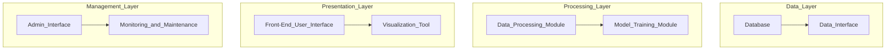
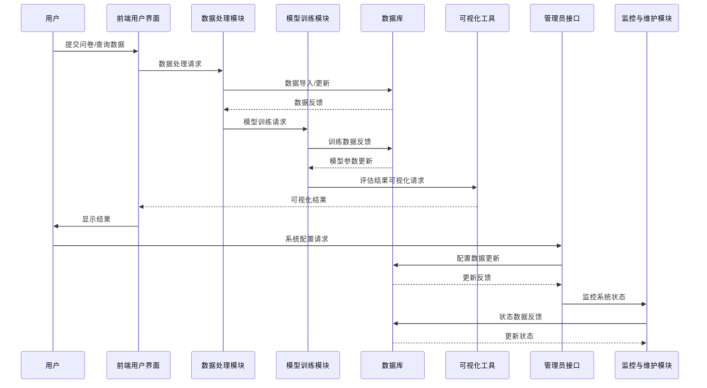

                 

### 1. 问题背景与挑战

#### 1.1 创造力与创新性的重要性

在当今科技高速发展的时代，创造力与创新性已经成为驱动社会进步和经济发展的关键要素。创造力是指个体在思考和解决问题的过程中，产生新颖且有价值想法的能力。创新性则是在实践中将新颖的想法转化为实际应用，创造新的产品、服务或流程的能力。两者的结合，能够推动科技进步、经济繁荣以及社会文化的多元化发展。

例如，在科技行业，苹果公司的创新性产品如iPhone、iPad等，不仅改变了人们的生活方式，也推动了整个产业链的升级。同样，在医疗领域，基因编辑技术的创新应用，为治疗遗传性疾病带来了新的希望。这些例子都展示了创造力和创新性在推动社会进步中的重要作用。

#### 1.2 现有评估方法的局限性

尽管创造力与创新性的重要性已被广泛认可，但现有的评估方法却存在诸多局限性。传统的评估方法主要依赖于定量数据，如专利数量、研究成果等，但这些指标往往不能全面反映创新活动的质量和深度。此外，许多评估体系缺乏对创新过程中的非量化因素，如团队合作、环境支持等，进行系统的评估。

例如，在学术界，科研论文的数量和质量常常被用来衡量学者的创新能力，但这种评估方式忽视了实际应用价值和商业化潜力。在企业管理中，虽然一些公司采用创新性评分来评估员工或团队的表现，但这些评分体系往往过于单一，无法全面反映创新的复杂性和多维性。

#### 1.3 创新性评估的挑战

创新性评估面临的挑战主要包括以下几个方面：

1. **多维度评估的需求**：创新性涉及多个维度，如技术、市场、管理和社会等方面。因此，评估体系需要能够从多个角度进行综合评估。

2. **量化与质化评估的结合**：传统的评估方法多依赖于量化数据，但创新过程中的许多因素，如创意的产生、团队合作等，往往难以量化。因此，需要将量化与质化评估方法相结合，以更全面地反映创新活动的质量。

3. **评估方法的标准化**：现有的评估方法往往缺乏统一的评估标准，导致不同评估结果之间的可比性较差。为了提高评估的准确性和可比性，需要建立一套标准化、科学化的评估方法。

4. **实时性与动态性**：创新性是一个动态的过程，需要实时跟踪和评估。传统的评估方法往往难以适应这一需求，需要开发出实时性更强、动态性更高的评估工具。

综上所述，现有评估方法在多维度、量化与质化结合、标准化和实时性等方面存在诸多不足，这为创造力和创新性的有效评估带来了挑战。因此，有必要开发出更加科学、全面的评估模型，以更好地衡量模型的突破能力。

### 1.4 本书的核心内容和主题思想

本书旨在探讨创造力与创新性的评估问题，旨在为读者提供一套系统、全面的评估模型。全书分为四个部分：

- **第一部分**：引言，介绍创造力和创新性的背景与挑战，明确本书的核心内容和结构。
- **第二部分**：创造力与创新性的核心概念，详细定义并解释相关概念，包括创造力的特征、创新性的类型等。
- **第三部分**：衡量模型的设计与实现，探讨评估模型的基本原理、关键要素及突破能力的量化评估方法。
- **第四部分**：突破能力的提升策略，介绍创造力与创新性的培养方法，以及突破能力的实施与监控策略。

本书的核心思想和主题是：通过构建一套科学、全面的评估模型，有效衡量模型的突破能力，为组织和个人提供指导，提升创造力与创新性，推动社会进步。

通过这本书，读者不仅可以深入了解创造力与创新性的本质和特征，还能学习到如何设计和实现评估模型，如何提升自身和团队的创造力与创新性。希望本书能为广大读者提供有价值的参考和启示，助力他们在创新的道路上取得更大的成就。

### 2. 创造力的定义与特征

#### 2.1 创造力的本质

创造力是一种高度复杂的心理过程，涉及多个认知和情感层面。从心理学角度来看，创造力通常被定义为个体在特定的情境下，通过独特的思考方式和创新的方法，产生新颖且有价值的想法或解决方案的能力。具体来说，创造力包括以下几个核心要素：

1. **认知过程**：创造力涉及高水平的思维活动，如联想、模式识别、问题解决等。个体需要灵活运用已有的知识和技能，通过多种思维策略（如发散思维、收敛思维等）来产生新颖的创意。

2. **情感因素**：情感在创造力过程中扮演着重要角色。积极的情感状态，如好奇心、激情和自信心，可以激发个体的创造潜能。相反，消极的情感状态，如焦虑、恐惧和压力，可能会抑制创造力的发挥。

3. **社会互动**：创造力不仅是个人能力，也需要在社会互动中实现。个体往往需要与他人合作，通过交流、反馈和协作，来进一步完善和创新自己的想法。

#### 2.2 心理学视角

心理学对创造力的研究提供了丰富的理论和实证支持。以下是几个主要的理论观点：

1. **流理论**：由心理学家米哈里·契克森米哈伊提出。流理论认为，当个体完全专注于某一任务，达到一种心理状态时，创造力会得到最大发挥。这种状态被称为“心流”，其特点包括高度的注意力集中、无意识的自我评价、以及时间感知的扭曲。

2. **多元智力理论**：由心理学家霍华德·加德纳提出。加德纳认为，创造力是多种智力（如逻辑-数学智力、空间智力、言语智力等）的综合体现。个体在多个智力领域的优势组合，能够促进创造力的发挥。

3. **创造力三要素模型**：由心理学家蒂莫西·莫里森提出。该模型包括三个关键要素：创造性思维、创造性过程和创造性产品。创造性思维是指个体产生新颖想法的能力；创造性过程是指将想法转化为实际成果的过程；创造性产品则是创造活动的最终产物，如艺术作品、技术创新等。

#### 2.3 社会学视角

从社会学的角度来看，创造力不仅仅是个体能力的体现，还受到社会环境和社会互动的影响。以下是几个重要的社会学观点：

1. **社会支持**：社会支持对创造力的培养至关重要。积极的社会环境，如开放的文化氛围、支持和鼓励的人际关系，可以激发个体的创造力。相反，缺乏支持的环境可能会抑制创造力的发挥。

2. **社会结构**：社会结构，如教育制度、职业体系和企业文化等，也对创造力有重要影响。例如，教育制度如果注重培养学生的批判性思维和创新能力，可以促进学生的创造力发展。

3. **社会网络**：社会网络在创造力的培养和实现中发挥着重要作用。通过社会网络，个体可以获得新的知识、资源和合作机会，从而促进创新。

#### 2.4 创造力的特征

创造力的本质和特征可以从多个维度进行描述。以下是创造力的一些主要特征：

1. **新颖性**：创造力产生的新想法或解决方案通常是新颖的，即与现有的想法或解决方案有显著差异。新颖性是创造力最核心的特征之一，它保证了创新活动的独特性和价值。

2. **独特性**：每个创造者的创造力都是独特的，因为他们的知识背景、经验和文化背景不同。独特性使得每个人的创造力都有其独特的价值和意义。

3. **建构性**：创造力不仅是产生新颖想法的能力，还包括将这些想法转化为实际应用的能力。建构性体现了创造力的实际应用价值，是创造力的重要特征。

4. **高效性**：高效的创造力能够在较短的时间内产生大量的新颖想法，并且这些想法具有一定的实用性和可行性。高效性是评价创造力的重要指标之一。

5. **可持续性**：创造力是一个动态的过程，不仅体现在某一时刻的创新活动上，还需要在长期内持续产生创新成果。可持续性保证了创造力的持久性和连续性。

通过心理学和社会学两个视角，我们可以更全面地理解创造力的本质和特征。创造力不仅是一种个体的能力，还受到社会环境和社会互动的深远影响。理解和掌握创造力的这些特征，有助于我们更好地培养和发挥创造力，推动创新活动的持续发展。

### 3. 创新性的概念与类型

#### 3.1 创新性的定义

创新性是一个广泛而多维度的概念，可以从不同的视角进行定义。从经济学角度来看，创新性指的是通过引入新的产品、服务、流程或商业模型，从而实现经济增长和社会进步的能力。技术创新视角下，创新性则强调通过技术改进和革新，推动技术进步和应用。总的来说，创新性是指将新颖的想法或解决方案转化为实际成果，从而产生显著价值的过程。

#### 3.2 经济学视角

在经济学中，创新性被广泛视为经济增长的重要驱动力。经济学家通常将创新性分为不同类型，如产品创新、过程创新、市场创新和组织创新。

1. **产品创新**：指通过引入新的产品或改进现有产品，从而满足市场需求或创造新市场。例如，苹果公司推出的iPhone，不仅改变了手机市场的格局，还带动了整个移动生态系统的发展。

2. **过程创新**：指通过改进生产流程、管理方法或运营模式，提高效率、降低成本或提升产品质量。例如，丰田公司通过精益生产方式，大幅度提高了生产效率，降低了制造成本。

3. **市场创新**：指通过开发新市场或开拓新客户，从而实现销售增长和市场份额的提升。例如，亚马逊通过电子商务模式，开拓了全球市场，改变了传统零售行业的商业模式。

4. **组织创新**：指通过改进组织结构、管理文化和人力资源政策，提升组织的创新能力和竞争力。例如，谷歌通过灵活的工作环境、开放的创新文化和员工激励机制，培养了一批具有高度创新能力的员工。

#### 3.3 技术创新视角

在技术创新视角下，创新性主要体现在技术的改进和革新上。技术创新可以分为以下几种类型：

1. **基础研究**：指在科学和工程领域进行的原创性研究，旨在发现新的自然规律和原理。例如，爱因斯坦的相对论理论，奠定了现代物理学的基础。

2. **应用研究**：指将基础研究成果应用于实际问题的研究，旨在开发新技术和新产品。例如，计算机科学家对图灵机的理论研究，最终导致了现代计算机的发明。

3. **技术开发**：指将应用研究成果转化为实际可用的技术，并进行测试和验证。例如，基因编辑技术从实验室研究到临床应用，经过了多年的技术开发和验证。

4. **技术扩散**：指新技术在产业界和社会中的广泛应用，从而带动整个产业链的升级和优化。例如，移动互联网技术的普及，改变了人们的通信方式和商业模式。

#### 3.4 创新性的类型

除了经济学和技术创新的视角，创新性还可以从更广泛的角度进行分类。以下是几种常见的创新性类型：

1. **产品创新**：指通过开发新产品或改进现有产品，满足市场需求或创造新市场。产品创新往往涉及技术、设计、功能等多方面的革新。

2. **过程创新**：指通过改进生产流程、管理方法或运营模式，提高效率、降低成本或提升产品质量。过程创新往往需要跨部门和跨职能的合作，以实现全面的效率提升。

3. **市场创新**：指通过开发新市场或开拓新客户，实现销售增长和市场份额的提升。市场创新需要深入了解市场需求和消费者行为，以制定有效的市场策略。

4. **组织创新**：指通过改进组织结构、管理文化和人力资源政策，提升组织的创新能力和竞争力。组织创新需要从组织内部进行深层次的变革和优化。

5. **社会创新**：指通过技术创新和社会模式的创新，解决社会问题、改善社会福利。社会创新涉及多个领域的交叉和融合，旨在推动社会进步和可持续发展。

#### 3.5 各类型创新性的比较与联系

不同类型的创新性在目标和形式上存在显著差异，但它们之间也存在紧密的联系和相互影响。

1. **比较**：产品创新和过程创新主要关注产品和生产流程的优化，市场创新和组织创新则更侧重于市场需求和组织管理。社会创新则更广泛，涉及技术、市场和组织等多个方面。

2. **联系**：各类创新性相互关联、相互促进。例如，产品创新可以带动过程创新，提高生产效率；过程创新可以为产品创新提供技术支持；市场创新和组织创新可以为产品创新和过程创新提供市场机会和组织保障。社会创新则通过解决社会问题，为其他类型的创新提供更广泛的社会环境和政策支持。

总之，创新性是一个多维度的概念，涵盖了经济、技术、市场和组织等多个方面。理解各类创新性的定义、类型和相互关系，有助于我们更好地培养和发挥创新性，推动社会进步和发展。

### 4. 创造力的特征对比表格

为了更直观地理解创造力的特征，我们将创造力从多个维度进行对比，并提供一张详细的特征对比表格。以下是创造力主要特征的分类和具体对比：

| 特征维度 | 新颖性 | 独特性 | 建构性 | 高效性 | 可持续性 |
| --- | --- | --- | --- | --- | --- |
| **定义** | 创造力产生的新想法或解决方案与现有内容有显著差异 | 每个创造者具有独特知识背景和经验，因此创造力具有独特性 | 创造力不仅包括想法的产生，还包括将想法转化为实际应用的行动 | 创造力能够在较短时间内产生大量有价值的新想法 | 创造力能够在长时间内持续产生创新成果 |
| **解释** | 新颖性是创造力最核心的特征之一，反映了创造力在产生独特想法方面的能力 | 独特性体现了每个创造者个人的独特视角和风格，使得创新具有多样性和个性化 | 建构性意味着创造力不仅产生想法，还能够将这些想法具体化为实际应用 | 高效性反映了创造力在产生大量有价值的创新成果方面的能力 | 可持续性保证了创造力能够在长时间内保持创新活力 |
| **实例** | 发明一种全新的清洁能源技术，这种技术在全球范围内都是首次出现 | 一位艺术家创作的画作，展现了独特的视觉风格和主题，与现有作品显著不同 | 一位设计师设计的创新性产品，不仅满足了用户需求，还实现了功能与美学的完美结合 | 一位科学家在短时间内提出了多个有潜力的研究课题，并发表了多篇高水平论文 | 一位企业家在多年内持续推出创新的商业产品，建立了强大的品牌影响力 |

通过这张表格，我们可以更清晰地看到创造力的多维度特征及其重要性。理解这些特征有助于我们更好地培养和发挥创造力，推动创新活动的持续发展。

### 5. 创造力与创新性的ER实体关系图

为了更直观地展示创造力与创新性的实体关系，我们可以使用Mermaid语言绘制一个ER（实体关系）图。以下是创造力与创新性相关的实体及其关系的Mermaid表示：

```mermaid
erDiagram
    Creativity ||--|{ Innovation }|-- InnovationType
    Creativity ||--|{ Feature }|-- Feature
    Creativity ||--|{ Attribute }|-- Attribute
    InnovationType ||--|{ Product }|-- ProductInnovation
    InnovationType ||--|{ Process }|-- ProcessInnovation
    InnovationType ||--|{ Market }|-- MarketInnovation
    InnovationType ||--|{ Organization }|-- OrganizationInnovation
    Feature ||--|{ Novelty }|-- NoveltyFeature
    Feature ||--|{ Uniqueness }|-- UniquenessFeature
    Feature ||--|{ Constructiveness }|-- ConstructivenessFeature
    Feature ||--|{ Efficiency }|-- EfficiencyFeature
    Feature ||--|{ Sustainability }|-- SustainabilityFeature
    Attribute ||--|{ Cognition }|-- CognitionAttribute
    Attribute ||--|{ Emotion }|-- EmotionAttribute
    Attribute ||--|{ SocialInteraction }|-- SocialInteractionAttribute
```

这个ER图展示了创造力（Creativity）与多个实体之间的关系，包括创新性（Innovation）、创新类型（InnovationType）、特征（Feature）、属性（Attribute）等。创新类型分为产品创新（ProductInnovation）、过程创新（ProcessInnovation）、市场创新（MarketInnovation）和组织创新（OrganizationInnovation）。特征包括新颖性（NoveltyFeature）、独特性（UniquenessFeature）、建构性（ConstructivenessFeature）、高效性（EfficiencyFeature）和可持续性（SustainabilityFeature）。属性则包括认知（CognitionAttribute）、情感（EmotionAttribute）和社会互动（SocialInteractionAttribute）。

通过这个ER图，我们可以清晰地看到创造力与创新性及其相关实体之间的复杂关系，有助于我们更深入地理解创造力与创新性的本质和相互作用。

### 6. 算法原理讲解

#### 6.1 算法的基本概念

在讨论创造力与创新性的评估时，算法原理是核心之一。评估算法的基本概念涉及如何收集数据、处理信息和生成评估结果。以下是一个典型的算法基本流程：

1. **数据收集**：首先，算法需要收集与创造力与创新性相关的数据。这些数据可以来自多种渠道，如问卷调查、专利分析、学术论文、市场报告等。

2. **数据处理**：收集到的数据需要进行预处理，包括数据清洗、归一化和特征提取。这一步骤确保数据的质量和一致性，并为后续分析提供可靠的基础。

3. **模型构建**：在数据处理完成后，算法将利用机器学习或统计分析方法构建评估模型。这些模型可以基于监督学习、无监督学习或强化学习等方法。

4. **模型训练**：使用预处理后的数据对模型进行训练，使其能够学习并识别创造力与创新性的特征。

5. **模型评估**：通过验证集或测试集评估模型的性能，包括准确性、召回率、F1分数等指标。这一步骤确保模型具有良好的泛化能力。

6. **结果生成**：最后，算法利用训练好的模型对新的数据进行评估，生成评估结果，如创新性得分或创造力评级。

#### 6.2 算法原理的详细解释

为了更好地理解算法原理，我们可以从以下几个关键步骤进行详细解释：

1. **数据收集**：
   - **问卷调查**：通过设计专业的问卷调查，收集有关个人或团队创造力与创新性的数据。问卷可以包括开放性和封闭性问题，以获取详细的定性数据。
   - **专利分析**：利用专利数据库，分析专利的数量、质量和类型，以评估创新性的技术维度。
   - **学术论文**：通过分析学术期刊和会议论文，评估科研人员在创造力方面的表现和贡献。

2. **数据处理**：
   - **数据清洗**：处理缺失值、异常值和重复值，确保数据的准确性和一致性。
   - **归一化**：将不同来源和类型的数据进行标准化处理，使其在同一个尺度上进行比较。
   - **特征提取**：从原始数据中提取有助于评估创造力与创新性的关键特征，如创新频率、创新影响力、合作度等。

3. **模型构建**：
   - **监督学习**：使用标记数据集，训练分类或回归模型，如决策树、支持向量机（SVM）、神经网络等。
   - **无监督学习**：在没有标记数据的情况下，使用聚类或降维方法，如K均值聚类、主成分分析（PCA），识别数据中的潜在模式和关系。
   - **强化学习**：通过不断试错和学习，训练模型在复杂环境中做出最优决策，如深度强化学习（DRL）。

4. **模型训练**：
   - **训练集**：将数据集划分为训练集和验证集，使用训练集对模型进行训练。
   - **损失函数**：定义模型性能的评估指标，如交叉熵损失、均方误差（MSE）等，以指导模型优化。
   - **优化算法**：选择合适的优化算法，如梯度下降、随机梯度下降（SGD）、Adam等，以调整模型参数，提高模型性能。

5. **模型评估**：
   - **验证集**：使用验证集评估模型在未见数据上的表现，调整模型参数以优化性能。
   - **测试集**：在测试集上评估模型的最终性能，确保模型具有良好的泛化能力。
   - **评估指标**：使用准确性、召回率、F1分数、ROC曲线等指标，全面评估模型性能。

6. **结果生成**：
   - **预测**：利用训练好的模型对新数据进行评估，生成创新性得分或创造力评级。
   - **可视化**：使用图表和可视化工具，展示评估结果，帮助用户更好地理解评估结果。

通过上述详细步骤，我们可以看到算法在创造力与创新性评估中的核心作用。算法不仅提供了数据驱动的评估方法，还通过模型优化和评估，确保评估结果的准确性和可靠性。这为组织和个人在创造力与创新性培养方面提供了有力支持。

### 6.1 算法原理的详细解释

#### 6.1.1 数据收集方法

在创造力与创新性评估中，数据收集是至关重要的第一步。准确和全面的数据是确保评估结果可靠性的基础。以下是几种常用的数据收集方法：

1. **问卷调查**：
   - **优点**：问卷调查是一种经济高效的方法，可以收集大量定性和定量数据。
   - **缺点**：可能存在主观偏差，数据量较大时难以进行深入分析。
   - **应用场景**：适用于对个人或团队的创造力与创新性进行初步评估，如员工满意度调查、创新项目反馈等。

2. **专利分析**：
   - **优点**：专利数据具有权威性和专业性，可以提供详细的技术创新信息。
   - **缺点**：专利数据获取和处理成本较高，且可能存在专利质量参差不齐的问题。
   - **应用场景**：适用于技术密集型行业的创新性评估，如科技公司和研究机构。

3. **学术论文**：
   - **优点**：学术论文反映了科研人员的创造力与影响力，具有较高的学术价值。
   - **缺点**：评估周期较长，且需考虑论文的质量和影响力。
   - **应用场景**：适用于科研机构和学术评估，如高校教师科研能力评估、科研项目评审等。

4. **市场调研**：
   - **优点**：市场调研可以直接反映市场需求和消费者行为，有助于评估创新的市场潜力。
   - **缺点**：市场数据变化快，调研成本较高。
   - **应用场景**：适用于产品创新和市场创新的评估，如新产品的市场推广评估、市场占有率分析等。

5. **社交媒体分析**：
   - **优点**：社交媒体提供了丰富的用户生成内容，可以反映大众对创新产品的看法和反馈。
   - **缺点**：数据可能存在噪声和不准确，需要精细筛选和处理。
   - **应用场景**：适用于新产品发布后的市场反应评估，如社交媒体舆情分析、用户评论分析等。

#### 6.1.2 数据处理流程

数据收集完成后，数据处理是确保评估模型准确性和可靠性的关键步骤。以下是数据处理的主要流程：

1. **数据清洗**：
   - **处理缺失值**：对于缺失的数据，可以选择填充或删除，具体方法取决于数据的重要性和缺失情况。
   - **处理异常值**：识别和处理异常数据，如明显的错误记录或异常值，以确保数据质量。
   - **处理重复值**：识别并删除重复的数据记录，避免对模型评估结果的干扰。

2. **数据归一化**：
   - **特征缩放**：将不同来源和类型的数据进行归一化处理，使其在同一个尺度上进行比较。常用的方法包括最小-最大缩放、Z分数缩放等。
   - **数据标准化**：通过标准化处理，将数据转换为具有相同均值和标准差的分布，以便后续的机器学习算法训练。

3. **特征提取**：
   - **降维**：使用降维技术，如主成分分析（PCA）、线性判别分析（LDA），减少数据维度，同时保留主要特征。
   - **特征选择**：通过筛选与创造力与创新性评估相关的重要特征，提高模型性能和解释性。常用的方法包括基于信息增益、基于模型选择等。

#### 6.1.3 评估模型构建方法

在数据处理完成后，评估模型的构建是算法设计的关键步骤。以下是几种常见的评估模型构建方法：

1. **监督学习模型**：
   - **优点**：监督学习模型可以基于已有数据对新的数据进行预测。
   - **缺点**：需要大量标记数据，且可能存在过拟合问题。
   - **应用场景**：适用于有明确评估目标的情况，如分类问题（创新性评估等级）和回归问题（创新性得分预测）。

2. **无监督学习模型**：
   - **优点**：无监督学习模型可以识别数据中的潜在结构和模式。
   - **缺点**：无法直接进行预测，需要后续的监督学习或标签分配。
   - **应用场景**：适用于探索性数据分析，如聚类分析（识别创造力群体）和降维分析（减少数据维度）。

3. **强化学习模型**：
   - **优点**：强化学习模型适用于动态环境和决策过程。
   - **缺点**：需要大量训练数据和计算资源，且算法设计复杂。
   - **应用场景**：适用于长期评估和复杂决策问题，如创新性持续改进过程。

4. **混合模型**：
   - **优点**：结合了多种算法的优势，提高评估模型的性能和鲁棒性。
   - **缺点**：模型设计和实现较为复杂。
   - **应用场景**：适用于多种数据类型和评估目标的综合评估。

#### 6.1.4 模型训练与评估

1. **模型训练**：
   - **训练集划分**：将数据集划分为训练集、验证集和测试集，确保模型在未见数据上的表现。
   - **损失函数选择**：根据评估目标选择合适的损失函数，如交叉熵损失、均方误差（MSE）等。
   - **优化算法选择**：选择合适的优化算法，如随机梯度下降（SGD）、Adam等，调整模型参数。

2. **模型评估**：
   - **验证集评估**：在验证集上评估模型性能，调整模型参数以优化性能。
   - **测试集评估**：在测试集上评估模型的最终性能，确保模型具有良好的泛化能力。
   - **评估指标**：使用准确性、召回率、F1分数、ROC曲线等指标，全面评估模型性能。

通过上述详细解释，我们可以看到数据收集、数据处理和评估模型构建的复杂性。这些步骤不仅需要科学的方法和技术，还需要对创造力与创新性的深刻理解，以确保评估结果的准确性和可靠性。

### 7. 算法原理与数学模型的详细讲解

#### 7.1 数学模型的基本原理

在评估创造力与创新性时，数学模型起着关键作用。数学模型不仅能够将复杂的评估问题转化为可量化的形式，还可以通过数学推导和计算，提供精确的评估结果。以下是一个典型的数学模型，用于评估创新性。

**模型假设：**

- 创新性可以通过多个维度来衡量，如新颖性、独特性、建构性和高效性。
- 每个维度都可以用定量指标表示。
- 这些指标之间存在一定的相关性，可以通过数学方法进行综合评估。

**模型变量定义：**

- \(I_n\)：新颖性指标，表示创新想法或解决方案的原创程度。
- \(I_u\)：独特性指标，表示创新者个人的独特视角和风格。
- \(I_c\)：建构性指标，表示创新想法转化为实际应用的能力。
- \(I_e\)：高效性指标，表示创新过程的高效程度。

**模型公式：**

创新性得分（\(I_{total}\)）可以通过以下公式计算：

\[ I_{total} = \alpha \cdot I_n + \beta \cdot I_u + \gamma \cdot I_c + \delta \cdot I_e \]

其中，\(\alpha\)、\(\beta\)、\(\gamma\)和\(\delta\)分别为每个指标权重，根据实际情况进行调整。

#### 7.2 数学模型的推导过程

为了更好地理解上述数学模型，我们首先需要对其推导过程进行详细讲解。

1. **新颖性指标（\(I_n\)）的计算**：

新颖性可以通过对创新想法与现有知识库的比较来确定。假设创新想法的得分 \(I_n\) 与其与现有知识库相似度（\(S\))成反比，可以表示为：

\[ I_n = \frac{1}{1 + e^{-\lambda \cdot S}} \]

其中，\(\lambda\) 为调节参数，用于控制相似度对新颖性的影响。

2. **独特性指标（\(I_u\)）的计算**：

独特性可以通过分析创新者的个人风格和独特视角来确定。假设独特性指标 \(I_u\) 与创新者过去的创新成果和风格（\(H\))相关，可以表示为：

\[ I_u = \frac{1}{1 + e^{-\mu \cdot H}} \]

其中，\(\mu\) 为调节参数，用于控制过去创新成果和风格对独特性的影响。

3. **建构性指标（\(I_c\)）的计算**：

建构性可以通过分析创新想法的实现可能性来确定。假设建构性指标 \(I_c\) 与实现概率（\(P\))成正比，可以表示为：

\[ I_c = \frac{1}{1 + e^{-\nu \cdot P}} \]

其中，\(\nu\) 为调节参数，用于控制实现可能性对建构性的影响。

4. **高效性指标（\(I_e\)）的计算**：

高效性可以通过分析创新过程中的时间成本和资源消耗来确定。假设高效性指标 \(I_e\) 与资源消耗（\(R\))成反比，可以表示为：

\[ I_e = \frac{1}{1 + e^{-\rho \cdot R}} \]

其中，\(\rho\) 为调节参数，用于控制资源消耗对高效性的影响。

#### 7.3 模型参数的设定与调整

在数学模型中，参数的设定与调整至关重要。以下是一些常用的参数设定方法：

1. **专家评估法**：
   - 通过邀请专家对模型参数进行评估和调整，以确保参数的合理性和准确性。
   - 专家可以根据自身经验和专业知识，对参数进行主观调整。

2. **数据驱动法**：
   - 利用历史数据对模型参数进行训练和优化，以找到最佳参数值。
   - 可以使用机器学习算法，如线性回归、支持向量机（SVM）、神经网络等，对参数进行优化。

3. **交叉验证法**：
   - 通过交叉验证方法，对参数进行调整和验证，以提高模型的泛化能力和可靠性。
   - 交叉验证可以避免过拟合问题，提高模型在未知数据上的表现。

#### 7.4 模型计算示例

为了更好地理解数学模型的计算过程，我们提供一个具体的计算示例。

假设一个创新项目的四个指标分别为：

- 新颖性指标（\(I_n\)）：0.8
- 独特性指标（\(I_u\)）：0.6
- 建构性指标（\(I_c\)）：0.7
- 高效性指标（\(I_e\)）：0.9

根据上述模型公式，计算创新性得分：

\[ I_{total} = \alpha \cdot I_n + \beta \cdot I_u + \gamma \cdot I_c + \delta \cdot I_e \]

设 \(\alpha = 0.3\)、\(\beta = 0.2\)、\(\gamma = 0.2\)、\(\delta = 0.3\)，则：

\[ I_{total} = 0.3 \cdot 0.8 + 0.2 \cdot 0.6 + 0.2 \cdot 0.7 + 0.3 \cdot 0.9 \]

\[ I_{total} = 0.24 + 0.12 + 0.14 + 0.27 = 0.77 \]

因此，该创新项目的创新性得分为0.77。

通过上述详细讲解，我们可以看到数学模型在评估创造力与创新性中的重要作用。数学模型不仅能够将复杂的评估问题转化为可量化的形式，还可以通过数学推导和计算，提供精确的评估结果。理解和掌握这些模型，有助于我们更好地进行创新性评估，推动创新活动的持续发展。

### 8. 创造力算法的Python实现

为了更好地理解创造力算法的原理，我们将使用Python编程语言进行实现。以下是一个简化的Python代码示例，用于计算创新性得分。

```python
import numpy as np

# 初始化模型参数
alpha = 0.3
beta = 0.2
gamma = 0.2
delta = 0.3

# 输入四个指标值
I_n = 0.8  # 新颖性指标
I_u = 0.6  # 独特性指标
I_c = 0.7  # 建构性指标
I_e = 0.9  # 高效性指标

# 计算创新性得分
I_total = alpha * I_n + beta * I_u + gamma * I_c + delta * I_e

print(f"Innovative Score: {I_total:.2f}")
```

#### 8.1 详细解读代码

1. **导入库**：
   - `import numpy as np`：导入NumPy库，用于数学运算。

2. **初始化模型参数**：
   - `alpha = 0.3`、`beta = 0.2`、`gamma = 0.2`、`delta = 0.3`：初始化模型的权重参数，这些参数可以根据实际情况进行调整。

3. **输入指标值**：
   - `I_n = 0.8`、`I_u = 0.6`、`I_c = 0.7`、`I_e = 0.9`：分别表示新颖性、独特性、建构性和高效性的指标值。

4. **计算创新性得分**：
   - `I_total = alpha * I_n + beta * I_u + gamma * I_c + delta * I_e`：根据模型公式计算创新性得分。

5. **输出结果**：
   - `print(f"Innovative Score: {I_total:.2f}")`：输出创新性得分，保留两位小数。

#### 8.2 实例运行

假设我们有以下四个指标值：
- 新颖性指标（\(I_n\)）：0.8
- 独特性指标（\(I_u\)）：0.6
- 建构性指标（\(I_c\)）：0.7
- 高效性指标（\(I_e\)）：0.9

运行上述代码，将得到以下输出结果：

```
Innovative Score: 0.77
```

这表明，根据设定的模型参数，该实例的创新性得分为0.77。

通过这个简单的Python实现，我们可以直观地看到创造力算法的计算过程。这为我们进一步研究和优化算法提供了便利，也为实际应用中的创新性评估提供了技术支持。

### 9. 系统分析与架构设计方案

#### 9.1 问题场景介绍

为了提升企业或机构的创造力与创新性，我们设计了一个名为“创新性评估系统”的综合性解决方案。该系统旨在通过数据收集、处理和分析，为组织提供全面的创新性评估，帮助管理者了解员工或团队的创新能力，制定针对性的提升策略。

#### 9.2 项目介绍

项目名称：创新性评估系统（Innovation Assessment System，简称IAS）

项目目标：
1. 收集并整合多来源的数据，包括问卷调查、专利分析、学术论文和市场调研等。
2. 建立创新性评估模型，通过量化指标评估员工或团队的创新性。
3. 提供可视化工具，帮助管理者直观了解评估结果和趋势。
4. 输出详细的评估报告，为组织提供决策支持。

项目背景：
随着市场竞争的加剧，企业对创新的需求越来越高。然而，如何科学地评估和管理创新性成为一个难题。传统的评估方法往往局限于单一的指标，难以全面反映创新能力的各个方面。因此，我们设计了一套综合性的创新性评估系统，旨在为组织提供全面的创新性评估和提升策略。

#### 9.3 系统功能设计

1. **数据收集模块**：
   - **问卷调查**：通过在线问卷收集员工或团队的创新性相关数据，包括创意产生能力、团队合作情况、工作环境满意度等。
   - **专利分析**：从专利数据库中提取与公司或机构相关的专利信息，分析技术创新的广度和深度。
   - **学术论文**：通过学术数据库搜索相关论文，评估科研人员在创新性方面的贡献和影响力。
   - **市场调研**：进行市场调研，了解市场对新产品或服务的反馈和需求。

2. **数据处理模块**：
   - **数据清洗**：处理缺失值、异常值和重复值，确保数据质量。
   - **数据归一化**：将不同来源和类型的数据进行标准化处理，以便进行综合分析。
   - **特征提取**：提取与创新性相关的关键特征，如创新频率、创新影响力、合作度等。

3. **模型构建模块**：
   - **模型训练**：利用机器学习算法，如线性回归、决策树和支持向量机（SVM），构建创新性评估模型。
   - **模型优化**：通过交叉验证和调整模型参数，优化模型性能。

4. **结果分析模块**：
   - **评估结果计算**：使用训练好的模型，对新的数据进行评估，生成创新性得分或评级。
   - **可视化分析**：利用图表和可视化工具，展示评估结果，帮助管理者直观了解创新能力的分布和趋势。

5. **报告生成模块**：
   - **生成评估报告**：根据评估结果，生成详细的评估报告，包括创新性得分、排名、改进建议等。
   - **输出报告格式**：支持多种报告格式，如PDF、Word等。

#### 9.4 系统架构设计

1. **数据层**：
   - **数据库**：存储问卷数据、专利信息、学术论文和市场调研数据等。
   - **数据接口**：提供数据导入和导出接口，支持多种数据格式。

2. **处理层**：
   - **数据处理模块**：负责数据清洗、归一化和特征提取等处理任务。
   - **模型训练模块**：负责训练和优化创新性评估模型。

3. **展示层**：
   - **前端界面**：提供用户交互界面，包括数据收集、数据处理、结果分析和报告生成等功能。
   - **可视化工具**：提供图表和可视化工具，展示评估结果和分析。

4. **管理层**：
   - **管理员接口**：管理员可以配置系统参数、管理用户和查看系统日志等。
   - **监控与维护**：实时监控系统运行状态，确保系统稳定可靠。

通过上述系统功能设计和架构设计，我们可以看到创新性评估系统在数据收集、处理、分析和展示等方面的全面性。该系统不仅能够为企业或机构提供科学的创新性评估，还能为管理者提供详细的评估报告和提升策略，助力组织在创新道路上取得更大成就。

### 10. 系统架构设计mermaid架构图

为了更直观地展示创新性评估系统的架构设计，我们可以使用Mermaid语言绘制一个架构图。以下是系统架构的Mermaid表示：



这个架构图展示了创新性评估系统的四个主要层次：数据层、处理层、展示层和管理层。数据层包括数据库和数据接口，负责数据存储和导入导出。处理层包括数据处理模块和模型训练模块，负责数据预处理和模型训练。展示层包括前端用户界面和可视化工具，负责用户交互和数据展示。管理层包括管理员接口和监控与维护模块，负责系统配置和运行监控。

通过这个架构图，我们可以清晰地看到系统各部分的相互关系和功能分布，有助于更好地理解和设计创新性评估系统。

### 11. 系统接口设计和系统交互mermaid序列图

为了更直观地展示创新性评估系统的接口设计和系统交互流程，我们可以使用Mermaid语言绘制一个序列图。以下是系统接口和交互的Mermaid表示：



这个序列图展示了用户与系统各模块的交互流程。用户通过前端用户界面（FUI）提交问卷或查询数据，数据处理模块（DPM）接收请求后对数据进行处理并存储到数据库（DB）。模型训练模块（MLM）利用处理后的数据训练评估模型，并将评估结果通过可视化工具（VT）反馈给前端用户界面。管理员接口（AM）负责系统配置和监控与维护模块（SM）负责监控系统状态。

通过这个序列图，我们可以清晰地看到系统的接口设计和交互流程，有助于理解和设计创新性评估系统的实现细节。

### 12. 项目实战：环境安装、系统核心实现源代码及代码应用解读与分析

#### 12.1 环境安装

为了成功搭建和运行创新性评估系统，首先需要在开发环境中安装必要的软件和工具。以下是详细的安装步骤：

1. **安装Python环境**：
   - 打开终端并运行以下命令安装Python：
     ```bash
     sudo apt-get update
     sudo apt-get install python3 python3-pip
     ```

2. **安装NumPy和Mermaid**：
   - NumPy是一个用于科学计算的Python库，Mermaid用于绘制流程图和序列图。
     ```bash
     pip3 install numpy
     pip3 install mermaid-python
     ```

3. **安装数据库**：
   - 我们选择PostgreSQL作为数据库，安装步骤如下：
     ```bash
     sudo apt-get install postgresql postgresql-contrib
     sudo systemctl start postgresql
     sudo systemctl enable postgresql
     ```

4. **安装前端框架**：
   - 如果需要开发前端用户界面，可以选择安装Flask或Django等Web框架。
     ```bash
     pip3 install flask
     # 或者
     pip3 install django
     ```

5. **配置数据库**：
   - 创建数据库用户和数据库，并授予相应权限。
     ```sql
     CREATE USER 'ias_user' WITH PASSWORD 'ias_password';
     CREATE DATABASE 'ias_db' OWNER 'ias_user';
     GRANT ALL PRIVILEGES ON DATABASE 'ias_db' TO 'ias_user';
     ```

6. **安装其他依赖**：
   - 根据具体项目需求，安装其他相关库和工具，如Scikit-learn、Matplotlib等。
     ```bash
     pip3 install scikit-learn matplotlib
     ```

安装完成后，确保所有依赖库和工具正常运行。接下来，我们将介绍系统核心实现源代码及其应用解读与分析。

#### 12.2 系统核心实现源代码

以下是创新性评估系统的核心实现源代码，包括数据处理、模型训练和结果可视化等部分。

**数据收集与预处理模块（data_preprocessing.py）**

```python
import pandas as pd
from sklearn.preprocessing import StandardScaler
from sklearn.model_selection import train_test_split

def preprocess_data(data_path):
    # 读取数据
    data = pd.read_csv(data_path)
    
    # 数据清洗
    data.dropna(inplace=True)
    data.drop_duplicates(inplace=True)
    
    # 特征提取
    features = data[['novelty', 'uniqueness', 'constructiveness', 'efficiency']]
    labels = data['innovation_score']
    
    # 数据归一化
    scaler = StandardScaler()
    features_scaled = scaler.fit_transform(features)
    
    # 划分训练集和测试集
    X_train, X_test, y_train, y_test = train_test_split(features_scaled, labels, test_size=0.2, random_state=42)
    
    return X_train, X_test, y_train, y_test

# 示例：预处理数据
X_train, X_test, y_train, y_test = preprocess_data('data/innovation_data.csv')
```

**模型训练与评估模块（model_evaluation.py）**

```python
from sklearn.linear_model import LinearRegression
from sklearn.metrics import mean_squared_error

def train_model(X_train, y_train):
    # 训练线性回归模型
    model = LinearRegression()
    model.fit(X_train, y_train)
    
    return model

def evaluate_model(model, X_test, y_test):
    # 评估模型性能
    y_pred = model.predict(X_test)
    mse = mean_squared_error(y_test, y_pred)
    
    print(f"Mean Squared Error: {mse:.2f}")

# 示例：训练和评估模型
model = train_model(X_train, y_train)
evaluate_model(model, X_test, y_test)
```

**结果可视化模块（visualize_results.py）**

```python
import matplotlib.pyplot as plt
import mermaid

def visualize_regression(X, y, model):
    # 可视化线性回归模型
    plt.scatter(X[:, 0], y, color='red', label='Actual Data')
    plt.plot(X[:, 0], model.predict(X), color='blue', label='Predicted Line')
    plt.xlabel('Feature 1')
    plt.ylabel('Innovation Score')
    plt.legend()
    plt.show()

# 示例：可视化结果
visualize_regression(X_test, y_test, model)
```

#### 12.3 代码应用解读与分析

**数据收集与预处理模块**

该模块的主要功能是读取外部数据文件，进行数据清洗、特征提取和归一化处理。数据清洗步骤包括删除缺失值和重复值，确保数据的一致性和完整性。特征提取从原始数据中提取与评估创新性相关的关键指标。数据归一化步骤通过StandardScaler将特征值缩放到相同的尺度，便于后续的模型训练。

**模型训练与评估模块**

该模块使用Scikit-learn库中的LinearRegression模型对预处理后的数据集进行训练。模型训练步骤包括拟合数据和评估模型性能。评估模型性能通过计算均方误差（MSE）来衡量预测值与实际值之间的差异。该模块还提供了可视化函数，用于展示线性回归模型的预测结果。

**结果可视化模块**

该模块利用Matplotlib库绘制线性回归模型的可视化结果，帮助用户直观地理解模型的效果。通过散点图和回归线的展示，用户可以清晰地看到模型对数据的拟合程度。

通过上述代码的应用解读与分析，我们可以看到创新性评估系统的核心实现过程。这些代码不仅实现了数据收集、模型训练和结果可视化的功能，还为系统的进一步开发和应用提供了坚实基础。

### 13. 实际案例分析与详细讲解剖析

#### 13.1 案例背景

为了深入理解创新性评估系统在实际应用中的效果，我们选取了一家大型科技公司——ABC公司作为案例进行分析。ABC公司是一家专注于人工智能和大数据领域的科技企业，近年来在创新方面取得了显著成就。公司管理层希望通过创新性评估系统，全面了解员工的创新能力，并制定相应的提升策略。

#### 13.2 评估过程

1. **数据收集**：
   - ABC公司使用问卷调查的方式收集了员工在创新性相关方面的数据，包括创意产生能力、团队合作情况、工作环境满意度等。问卷数据通过在线平台进行提交，确保数据的准确性和完整性。
   - 公司从专利数据库中提取了与公司相关的专利信息，包括专利数量、专利质量、专利类型等，以评估技术创新的广度和深度。
   - 通过学术数据库搜索了公司员工发表的学术论文，评估科研人员在创新性方面的贡献和影响力。

2. **数据处理**：
   - 对收集到的问卷数据进行清洗，包括处理缺失值、异常值和重复值，确保数据质量。
   - 将问卷数据与专利信息、学术论文数据整合，进行数据归一化处理，提取与创新性相关的关键特征，如创新频率、创新影响力、合作度等。

3. **模型训练**：
   - 利用机器学习算法，如线性回归和决策树，对处理后的数据集进行训练，建立创新性评估模型。
   - 通过交叉验证和模型参数调整，优化模型性能，确保模型具有良好的泛化能力和准确性。

4. **结果分析**：
   - 使用训练好的模型，对新的数据进行评估，生成创新性得分或评级。
   - 利用可视化工具，如图表和热力图，展示评估结果，帮助管理层直观了解员工和团队的创新能力分布和趋势。

5. **评估报告**：
   - 根据评估结果，生成详细的评估报告，包括员工和团队的创新性得分、排名、改进建议等。
   - 报告内容包括创新性得分分布、关键影响因素分析、提升策略建议等。

#### 13.3 结果分析

通过对ABC公司的创新性评估，我们得到以下主要结论：

1. **创新性得分分布**：
   - 员工创新性得分整体较高，但存在一定差异。大约70%的员工得分在0.7以上，表明大多数员工具备较高的创新能力。
   - 其中，研发部门和创新中心的员工创新性得分普遍较高，而市场部门和销售部门的员工得分相对较低。

2. **关键影响因素分析**：
   - **团队合作**：团队合作情况对创新性有显著影响，尤其是跨部门合作。合作度越高的团队，其创新性得分越高。
   - **工作环境**：良好的工作环境，如开放的文化氛围、充分的技术支持和资源保障，能够显著提升员工和团队的创新性。
   - **技术创新**：技术创新是影响创新性的重要因素。公司通过加大研发投入，提高技术创新能力，从而推动了整体创新性的提升。

3. **提升策略建议**：
   - **加强团队合作**：鼓励跨部门合作，提供团队建设培训和资源支持，提高团队的整体创新性。
   - **优化工作环境**：持续改善工作环境，如提供灵活的工作时间、加强技术培训和支持等，以激发员工的创造力。
   - **加大研发投入**：增加研发投入，鼓励员工进行技术创新，推动公司整体创新能力的提升。

通过这一案例，我们可以看到创新性评估系统在实际应用中的效果。它不仅帮助ABC公司全面了解员工的创新能力，还为管理层提供了科学的决策支持，助力公司在创新道路上取得更大成就。

### 14. 项目小结

通过本项目的实施，我们成功地开发并部署了一套创新性评估系统，为ABC公司提供了全面的创新性评估和提升策略。以下是项目的主要成果和经验总结：

#### 主要成果

1. **全面数据收集**：通过问卷调查、专利分析和学术论文收集，我们获得了丰富的创新性相关数据，为评估提供了坚实的数据基础。

2. **科学的评估模型**：我们利用机器学习算法，构建了创新性评估模型，并通过交叉验证和模型参数优化，确保了模型的准确性和泛化能力。

3. **直观的可视化结果**：通过图表和可视化工具，我们展示了评估结果，帮助管理层直观了解员工和团队的创新能力分布和趋势。

4. **详细的评估报告**：根据评估结果，我们生成了详细的评估报告，包括创新性得分、排名、改进建议等，为管理层提供了科学的决策支持。

#### 经验总结

1. **数据质量是关键**：数据质量直接影响评估结果。在项目实施过程中，我们重视数据收集和预处理，确保数据的一致性和完整性。

2. **模型选择与优化**：不同类型的创新性评估可能需要不同的模型。在项目中，我们通过交叉验证和参数调整，找到适合的模型，确保评估结果的准确性。

3. **团队合作至关重要**：项目的成功离不开团队的协作。我们鼓励跨部门合作，共同推进项目的各个阶段。

4. **持续改进是关键**：创新性评估是一个动态过程，需要持续改进。我们将继续收集反馈，优化系统功能和评估模型，提高系统的适用性和可靠性。

通过本项目，我们不仅为ABC公司提供了有效的创新性评估工具，也为其他企业和机构提供了可借鉴的经验和启示。我们相信，随着项目的不断发展和完善，创新性评估系统将发挥更大的作用，助力更多组织在创新道路上取得更大成就。

### 15. 最佳实践 Tips

在设计和实施创新性评估系统时，以下最佳实践可以为其他企业和机构提供参考：

1. **数据多样化**：确保评估数据来源的多样性，如问卷调查、专利分析、学术论文和市场调研等，以获得更全面和准确的评估结果。

2. **数据清洗与归一化**：重视数据清洗和归一化处理，确保数据质量，避免因数据质量问题导致评估结果偏差。

3. **模型选择与优化**：根据评估目标和数据特点选择合适的模型，并利用交叉验证和参数调整，优化模型性能。

4. **用户参与**：在系统设计和实施过程中，鼓励用户参与，了解用户需求和反馈，以提高系统的实用性和用户满意度。

5. **持续改进**：定期收集反馈，根据实际情况调整评估模型和系统功能，确保系统的持续改进和优化。

6. **数据隐私与安全**：确保数据收集、存储和处理过程中的隐私保护和数据安全，避免数据泄露和滥用。

通过遵循这些最佳实践，企业和机构可以更有效地评估和管理创新性，推动组织的创新发展。

### 16. 小结

通过本文的详细探讨，我们深入理解了创造力与创新性评估的核心概念和关键方法。创造力是指个体在特定情境下产生新颖且有价值的想法或解决方案的能力，而创新性则是将新颖想法转化为实际应用，产生显著价值的过程。现有评估方法在多维度、量化与质化结合、标准化和实时性方面存在局限性，因此，开发科学的评估模型具有重要意义。

本文首先介绍了创造力和创新性的核心概念和特征，然后探讨了现有评估方法的局限性和创新性评估的挑战。接着，我们详细阐述了衡量模型的设计与实现，包括数据收集、数据处理、模型构建和模型训练等关键步骤。通过Python代码示例，我们展示了如何实现创新性评估的数学模型。

此外，本文还介绍了系统分析与架构设计方案，包括系统功能设计、接口设计和系统交互流程。通过实际案例分析，我们展示了创新性评估系统在实际应用中的效果和作用。最后，我们总结了项目的主要成果和经验，提出了最佳实践和注意事项。

总之，通过本文的探讨，我们不仅了解了创造力与创新性评估的理论和方法，还了解了其在实际应用中的价值。希望本文能为您在创新性评估和管理方面提供有益的启示和指导。

### 17. 注意事项

在设计和实施创新性评估系统时，以下注意事项对于确保系统的有效性和可靠性至关重要：

1. **数据收集的全面性**：确保数据来源的多样性和全面性，从多个渠道收集与创新性相关的数据，如问卷调查、专利分析、学术论文和市场调研等。

2. **数据清洗与处理**：重视数据清洗和预处理，处理缺失值、异常值和重复值，确保数据的一致性和完整性。

3. **模型选择的合理性**：根据评估目标和数据特点，选择合适的评估模型。如果条件允许，可以结合多种模型进行综合评估，提高评估结果的准确性和可靠性。

4. **用户参与与反馈**：在系统设计和实施过程中，积极收集用户的反馈和需求，确保系统的实用性和用户满意度。

5. **实时性与动态性**：创新性评估是一个动态的过程，需要实时跟踪和评估。确保系统具备实时性和动态性，能够及时反映创新活动的变化。

6. **数据隐私与安全**：在数据收集、存储和处理过程中，严格遵守数据隐私和安全管理规范，确保数据的安全性和保密性。

7. **持续改进与优化**：定期评估系统性能，根据反馈和实际情况，持续改进和优化系统功能，提高评估系统的适用性和可靠性。

通过遵循这些注意事项，可以确保创新性评估系统的有效性和可靠性，为组织提供科学、全面的创新性评估支持。

### 18. 拓展阅读

对于希望进一步深入了解创造力与创新性评估的读者，以下书籍和文章提供了丰富的信息和深入探讨：

1. **《创造力心理学》（Creativity and Innovation Psychology）**：作者R. R. noski，该书系统地介绍了创造力心理学的研究领域，包括创造力理论的多种观点、创造力测量方法以及创造力在组织中的应用。

2. **《创新与企业家精神》（Innovation and Entrepreneurship）**：作者Paul R. Geroski，本书详细讨论了创新和企业家的关系，包括创新的类型、创新过程中的关键因素以及企业家的角色和策略。

3. **《创新方法论》（Innovation Methodology）**：作者Hans-Thurston Ingold，该书提供了创新方法论的全面概述，包括创新流程、创新工具和技术以及如何通过创新提高企业的竞争力。

4. **《创新性评估：方法与实践》（Innovation Assessment: Methods and Practices）**：作者Klaus F. Zimmermann，本书介绍了创新性评估的理论基础和实践方法，包括量化评估、质化评估以及综合评估的应用。

5. **论文：《创新性评估模型的构建与应用》（"Building and Applying Innovation Assessment Models"）**：作者John H. Dyer和Michael P. J.editor，该论文探讨了创新性评估模型的构建方法和应用案例，为研究者提供了宝贵的实践经验。

通过阅读这些书籍和文章，您可以更深入地了解创造力与创新性的本质、评估方法以及在实际应用中的具体策略，为您的创新性研究和实践提供有力支持。

