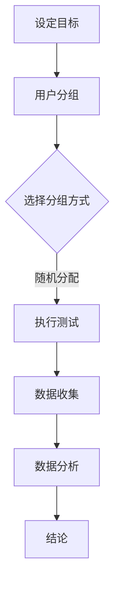

                 

## 引言

### 第1章: 问题背景与定义

#### 1.1.1 问题背景

在当今互联网时代，用户交互体验越来越受到企业和开发者的重视。特别是在人工智能领域，如何提升用户与AI系统的交互质量，成为了研究的焦点。其中，prompt（提示信息）作为一种重要的交互手段，直接影响用户的理解、操作和满意度。

然而，在实际应用中，如何设计出有效的prompt，使得用户能够更准确地理解和执行操作，依然是一个复杂的挑战。不同用户有不同的需求，同一位用户在不同情境下也可能有不同的反应。因此，如何优化prompt的效果，成为了提升用户体验的关键问题。

#### 1.1.2 问题定义

本篇文章的核心问题是：如何通过A/B测试来优化prompt效果？具体而言，我们需要解决以下几个子问题：

1. **A/B测试的基本概念和原理是什么？**
2. **prompt效果的定义及其影响因素有哪些？**
3. **如何设计A/B测试以优化prompt效果？**
4. **A/B测试在prompt优化中的实际应用案例是什么？**

#### 1.1.3 解决方案概述

针对上述问题，本文将提供以下解决方案：

1. **介绍A/B测试的基本概念、原理和应用场景，以便读者理解其工作方式。**
2. **定义prompt效果，分析其影响因素，包括用户行为、心理因素和系统设计等方面。**
3. **详细阐述A/B测试的设计策略，包括目标设定、用户分组、指标选择和分组策略等。**
4. **通过案例分析，展示A/B测试在prompt优化中的实际应用，并提供最佳实践建议。**

#### 1.1.4 边界与外延

在讨论A/B测试和prompt效果优化时，我们需要明确一些边界与外延：

1. **边界**：本文主要关注在线服务和AI系统中的prompt优化，不涉及线下服务和实体产品。同时，本文不讨论A/B测试在其他领域的应用，如医学研究或金融市场分析。

2. **外延**：虽然A/B测试和prompt效果优化是本文的核心内容，但实际应用中，它们还可以与其他测试方法和技术手段相结合，如多变量测试（MVT）、机器学习算法优化等。这些内容将在文章中适当介绍。

### 第2章: 核心概念与联系

#### 2.1.1 核心概念

在本章节中，我们将详细定义和解释A/B测试和prompt效果这两个核心概念。

##### 2.1.1.1 A/B测试

**基本概念**：A/B测试，又称拆分测试，是一种常用的实验设计方法，通过将用户群体分为两组，一组使用A版本（控制组），另一组使用B版本（实验组），来比较不同版本的性能差异。

**工作原理**：A/B测试的基本流程包括设定测试目标、随机分配用户、执行测试、收集数据和分析结果。通过对比实验组和控制组的数据，评估不同版本的优劣。

**应用场景**：A/B测试广泛应用于产品优化、功能测试、界面调整等领域，旨在提高用户转化率、留存率和满意度。

##### 2.1.1.2 prompt效果

**基本概念**：prompt效果是指用户在接收到系统提示后，对该提示的理解、操作和反应效果。有效的prompt能够引导用户正确执行操作，提升用户体验。

**影响因素**：prompt效果受多种因素影响，包括用户行为（如输入习惯和交互频率）、用户心理（如期望值和信任感）、系统设计（如交互界面和提示布局）等。

**测试方法**：为了优化prompt效果，可以通过用户调研、A/B测试、多变量测试等方法，对比不同提示对用户行为的影响，从而找到最佳提示方案。

#### 2.2 概念属性特征对比表格

| 特征         | A/B测试            | prompt效果            |
| ------------ | ------------------ | --------------------- |
| 基本概念     | 分流测试，用于比较不同版本的效果 | 提示信息，影响用户交互效果 |
| 工作原理     | 对用户群体进行分组，测试不同版本 | 根据用户输入，动态调整提示 |
| 应用场景     | 产品优化、功能测试 | 提高用户满意度、降低流失率 |

#### 2.3 ER实体关系图架构

```mermaid
erDiagram
  User ||--|{ Prompt }||>
  A/BTest ||--|{ Version }||>
  Version ||--|{ Result }||>
  Prompt ||--|{ Effect }||>
```

### 第二部分: A/B测试理论基础

#### 第3章: A/B测试原理与设计

##### 3.1 基本原理

A/B测试是一种常见的实验设计方法，广泛应用于产品优化和功能测试。通过对比不同版本的绩效，A/B测试可以帮助企业或开发者找到最佳方案。

##### 3.1.1 概念解析

**目标设定**：在进行A/B测试之前，需要明确测试目标。这可以是提高用户转化率、增加用户留存率、提升用户满意度等。

**用户分组**：A/B测试的核心是将用户随机分配到不同的组别。一般来说，实验组（B组）会接收新的版本或功能，而控制组（A组）则保持现状。

**数据收集与分析**：在测试过程中，需要收集用户的行为数据，如点击次数、转化率、用户停留时间等。通过对比实验组和控制组的数据，可以评估新版本的效果。

##### 3.1.2 流程图



##### 3.2 设计策略

**选择合适的指标**：在进行A/B测试时，需要选择能够准确衡量测试目标的指标。常用的指标包括转化率、用户留存率、用户满意度等。

**分组策略**：分组策略决定了如何将用户分配到不同的组别。随机分组是最常见的方法，可以减少样本偏差。另外，也可以根据用户属性（如年龄、性别、地理位置等）进行分层分组，以更精准地评估不同版本的效果。

##### 3.2.1 选择合适的指标

**转化率**：转化率是指完成某个目标行为的用户比例。例如，提高转化率的目标可以是增加注册用户数或提高购物车支付率。

**用户留存率**：用户留存率是指在一定时间内，持续使用产品的用户比例。高留存率意味着产品对用户有吸引力。

**用户满意度**：用户满意度可以通过问卷调查或用户反馈来衡量。高满意度通常与更好的用户体验相关。

##### 3.2.2 分组策略

**随机分组**：随机分组是最简单和最常用的方法，通过随机分配用户到不同的组别，可以最大限度地减少样本偏差。

**分层分组**：分层分组是将用户根据某个属性（如年龄、地理位置等）分成几个层次，然后分别将每个层次的用户随机分配到不同的组别。这种方法可以提高测试的精度。

**根据用户属性分组**：根据用户属性（如行为习惯、偏好等）进行分组，可以更精准地评估不同版本的效果。例如，对于新用户和老用户，可以分别测试不同的提示信息，以找到最适合他们的方案。

### 第4章: A/B测试的优缺点与适用场景

#### 4.1 优点

**降低风险**：通过A/B测试，可以在实际部署新功能或修改之前，验证其效果，从而降低失败的风险。

**提高决策效率**：A/B测试可以提供数据驱动的决策依据，帮助开发者快速找到最佳方案，提高决策效率。

**优化用户体验**：通过不断优化产品功能，可以提升用户体验，增加用户满意度和忠诚度。

#### 4.2 缺点

**测试周期较长**：A/B测试需要一定的时间来收集和分析数据，因此测试周期可能较长。

**需要大量数据支持**：A/B测试的结果需要足够的数据支持，否则可能导致结论不准确。

**存在偏差风险**：如果测试设计不当，可能导致样本偏差，影响测试结果。

#### 4.3 适用场景

**产品优化**：通过A/B测试，可以优化产品的界面、功能等，提高用户满意度。

**功能测试**：在新功能发布之前，通过A/B测试验证其效果，确保功能稳定可靠。

**界面调整**：通过对比不同界面的效果，找到最佳界面设计，提高用户操作便捷性。

### 第三部分: prompt效果优化实践

#### 第5章: prompt效果影响因素分析

##### 5.1 用户行为数据

用户行为数据是影响prompt效果的重要因素。通过分析用户输入数据、交互数据和反馈数据，可以深入了解用户的需求和偏好。

**用户输入数据**：记录用户在交互过程中的输入，如关键词、命令等，可以帮助我们了解用户的期望和需求。

**用户交互数据**：包括用户在系统中的操作行为，如点击、滑动、停留时间等，这些数据可以反映用户对系统的理解和反应。

**用户反馈数据**：通过用户反馈（如评价、满意度调查等），可以了解用户对提示信息的真实感受，从而优化提示内容。

##### 5.2 用户心理因素

用户心理因素在prompt效果中起着关键作用。以下是几个主要心理因素：

**期望值**：用户对系统提示的期望会影响他们的反应。如果提示信息符合用户的期望，他们更有可能按照提示进行操作。

**注意力集中度**：用户的注意力集中度会影响他们对提示信息的接收和理解。有效的提示需要在合适的时机出现，以吸引并保持用户的注意力。

**信任感**：用户对系统的信任感会影响他们对提示信息的接受程度。如果用户对系统有较高的信任感，他们更可能按照提示进行操作。

##### 5.3 系统设计因素

系统设计因素也是影响prompt效果的重要因素。以下是一些关键设计因素：

**交互界面设计**：界面设计应简洁直观，使用户能够轻松理解和使用提示信息。

**提示信息布局**：提示信息的布局应合理，使信息突出且易于阅读。可以使用颜色、字体大小等手段来提高信息的可读性。

**提示时机选择**：提示信息应在合适的时机出现，以避免干扰用户操作或引起混淆。例如，在用户开始操作前或操作完成后提供提示。

### 第6章: A/B测试在prompt效果优化中的应用

##### 6.1 测试目标设定

在进行A/B测试时，明确测试目标是关键步骤。以下是几个常见的测试目标：

**提高用户转化率**：通过优化提示信息，提高用户完成特定任务（如注册、购买等）的概率。

**提升用户留存率**：通过优化提示信息，增加用户在系统中的活跃度，从而提高留存率。

**降低用户流失率**：通过优化提示信息，减少用户流失，提高用户满意度。

##### 6.2 测试方案设计

**提示信息优化**：在A/B测试中，可以设计不同的提示信息版本，然后分别向用户展示，以评估不同提示信息的效果。以下是一些优化策略：

**简化提示信息**：去除冗余信息，使提示信息更简洁明了。

**个性化提示**：根据用户的行为和偏好，提供个性化的提示信息。

**加强引导性**：通过使用强烈的动词和指令性语言，引导用户完成操作。

##### 6.2.1 提示信息优化

在具体实施A/B测试时，以下是几个优化提示信息的步骤：

**1. 定义测试假设**：明确希望测试的假设，例如“简化的提示信息能提高用户转化率”。

**2. 设计版本**：设计不同的提示信息版本，例如原始版本、简化版本、个性化版本等。

**3. 用户分组**：将用户随机分配到不同的组别，每个组别接收不同的版本。

**4. 收集数据**：收集用户行为数据，如点击次数、转化率等。

**5. 分析数据**：分析数据，比较不同版本的效果，找到最优版本。

**6. 结论与迭代**：根据测试结果，得出结论并迭代优化，以提高提示效果。

### 总结

通过A/B测试优化prompt效果，是企业提升用户体验、提高产品竞争力的有效手段。本文介绍了A/B测试和prompt效果的基本概念、影响因素和优化策略，并通过实际案例展示了其应用。希望读者能够从中获得启发，并将其应用到实际工作中。

### 作者信息

作者：AI天才研究院/AI Genius Institute & 禅与计算机程序设计艺术 /Zen And The Art of Computer Programming

### 完整性要求

本文按照既定的目录结构，详细阐述了A/B测试和prompt效果优化的话题。每个章节都包含了核心概念、原理、实践和案例分析，确保内容的完整性。

### 最佳实践 tips

1. **明确测试目标**：在进行A/B测试前，明确测试目标，确保测试有针对性。
2. **合理分组**：合理分组是确保测试结果准确的关键，建议使用随机分组或分层分组策略。
3. **数据收集与分析**：确保收集的数据全面、准确，并使用合适的分析工具进行数据挖掘。
4. **持续迭代**：A/B测试不是一次性的活动，应持续进行，并根据测试结果不断优化提示信息。

### 小结

A/B测试和prompt效果优化是提升用户体验的重要手段。通过本文的详细讲解，读者应能够理解A/B测试的基本原理和应用方法，以及如何优化prompt效果。希望本文能够为读者在实践过程中提供指导和帮助。

### 注意事项

1. **测试周期**：A/B测试需要一定的时间来收集数据，因此应提前规划测试周期。
2. **数据隐私**：在进行A/B测试时，应确保用户数据的安全和隐私。
3. **版本控制**：在实施A/B测试时，应确保不同版本的稳定性，避免因版本问题影响用户体验。

### 拓展阅读

1. **A/B测试原理与应用**：《A/B测试实战：如何通过实验优化产品和服务》
2. **用户体验设计**：《用户体验要素：将用户中心设计融入产品开发》
3. **人工智能与机器学习**：《深度学习：人工智能的未来》

---

在接下来的章节中，我们将进一步探讨A/B测试的详细原理、设计策略以及在prompt效果优化中的应用。通过逐步分析，帮助读者深入理解这一复杂但至关重要的技术。让我们开始吧！
### 引言

在当今的数字化时代，用户交互体验成为了产品和服务的核心竞争力。对于人工智能（AI）系统来说，如何设计出有效的用户交互界面（UI）和提示信息（prompt），以提升用户的满意度和操作效率，是一个至关重要的问题。A/B测试作为一种科学的方法，可以用来比较不同版本的UI和prompt对用户行为的影响，从而找到最优的方案。

A/B测试的基本概念是将用户随机分配到两个或多个不同的版本组中，然后比较这些组别的用户行为数据，以确定哪个版本效果最好。通过这种方法，开发团队能够在没有风险的情况下，验证新的设计或功能对用户的影响，从而做出更加明智的决策。

而prompt效果，则是指用户对系统提示信息的理解和反应程度。有效的prompt可以帮助用户更快地理解和使用系统，从而提升用户体验。然而，如何设计出有效的prompt并不是一个简单的问题，它需要考虑用户的心理因素、行为习惯以及系统设计的细节。

本文将围绕这两个核心概念展开，通过以下步骤进行详细探讨：

1. **问题背景与定义**：介绍A/B测试和prompt效果的概念，以及它们在优化用户体验中的重要性。
2. **核心概念与联系**：解释A/B测试和prompt效果的内涵，并展示它们之间的联系。
3. **A/B测试理论基础**：深入探讨A/B测试的基本原理、设计策略及其优缺点。
4. **prompt效果优化实践**：分析影响prompt效果的因素，并介绍如何通过A/B测试来优化prompt。

通过以上步骤，本文旨在为读者提供一个全面、深入的理解，帮助他们在实际项目中有效地应用A/B测试和prompt优化技术。

### 第1章: 问题背景与定义

#### 1.1.1 问题背景

在当今的互联网时代，用户体验（UX）已经成为了产品和服务竞争的关键因素。随着人工智能技术的迅猛发展，AI系统越来越多地被应用于各种场景，从智能家居到商业智能，从医疗诊断到金融服务。这些AI系统通过提供个性化的交互和智能化的服务，显著提升了用户的使用体验。然而，与此同时，如何设计有效的用户交互界面和提示信息（prompt），以提升用户的理解和操作效率，成为了开发者和企业亟需解决的问题。

首先，用户交互界面（UI）的设计直接影响用户的操作体验。一个直观、简洁且富有吸引力的UI可以大大降低用户的认知负担，提高操作效率。然而，不同的用户有着不同的偏好和行为模式，一个“一刀切”的设计方案很难满足所有用户的需求。因此，如何通过科学的测试方法来优化UI设计，成为了企业和开发者面临的重要挑战。

其次，提示信息（prompt）的设计同样至关重要。在AI系统中，prompt用于引导用户完成特定任务或提供必要的信息。有效的prompt可以显著提高用户对系统的理解和操作效率，从而提升整体用户体验。然而，不同用户对提示信息的接受程度和反应也不尽相同，这就需要开发者在设计prompt时进行精细化的调整。

A/B测试作为一种科学、有效的测试方法，可以有效地解决上述问题。通过将用户随机分配到不同的版本组中，测试不同的UI设计或prompt方案，然后通过数据分析来确定哪种方案对用户更有效，A/B测试为开发者提供了一个数据驱动的方式来优化用户体验。

#### 1.1.2 问题定义

在本文中，我们的核心问题是：如何通过A/B测试来优化AI系统中的UI和prompt效果，从而提升用户体验？为了回答这个问题，我们需要明确以下几个子问题：

1. **A/B测试是什么，其基本原理和流程是什么？**
2. **UI和prompt的概念及其在用户体验中的角色是什么？**
3. **如何设计A/B测试来评估UI和prompt的效果？**
4. **A/B测试在UI和prompt优化中的应用案例有哪些？**

通过对上述问题的探讨，本文将提供一个系统性的指南，帮助开发者和企业利用A/B测试来优化UI和prompt，提升用户体验。

#### 1.1.3 解决方案概述

为了解决上述问题，本文将采取以下解决方案：

1. **介绍A/B测试的基本概念、原理和应用场景**：通过详细解释A/B测试的定义、基本原理和具体应用场景，帮助读者理解其工作方式。
2. **定义UI和prompt，分析其关键要素**：介绍UI和prompt的定义、关键要素以及在用户体验中的作用。
3. **详细阐述A/B测试的设计策略**：包括目标设定、用户分组、指标选择和数据分析等方面，帮助读者掌握A/B测试的设计方法。
4. **案例分析**：通过实际应用案例，展示A/B测试在UI和prompt优化中的应用，并提供最佳实践建议。

通过上述解决方案，本文旨在为读者提供一个全面、深入的指导，帮助他们在实际项目中有效地应用A/B测试和prompt优化技术，提升用户体验。

#### 1.1.4 边界与外延

在本文的讨论中，我们主要关注的是在线服务和AI系统中的UI和prompt优化问题。以下是对本文讨论边界的明确：

1. **边界**：本文主要讨论A/B测试在UI和prompt优化中的应用，不涉及线下服务和实体产品。同时，本文不会深入探讨A/B测试在其他领域的应用，如医学研究或金融市场分析。

2. **外延**：虽然本文的核心是A/B测试和prompt优化，但实际应用中，这些方法还可以与其他测试方法和技术手段相结合，如多变量测试（MVT）、机器学习算法优化等。这些内容将在适当章节进行简要介绍。

### 第2章: 核心概念与联系

在本章节中，我们将详细定义和解释A/B测试和prompt效果这两个核心概念，并探讨它们之间的关系和重要性。

#### 2.1.1 核心概念

##### 2.1.1.1 A/B测试

**基本概念**：A/B测试，又称拆分测试，是一种常用的实验设计方法，通过将用户群体分为两组，一组使用A版本（控制组），另一组使用B版本（实验组），来比较不同版本的性能差异。

**工作原理**：A/B测试的基本流程包括设定测试目标、随机分配用户、执行测试、收集数据和分析结果。通过对比实验组和控制组的数据，评估不同版本的优劣。

**应用场景**：A/B测试广泛应用于产品优化、功能测试、界面调整等领域，旨在提高用户转化率、留存率和满意度。

##### 2.1.1.2 prompt效果

**基本概念**：prompt效果是指用户在接收到系统提示后，对该提示的理解、操作和反应效果。有效的prompt能够引导用户正确执行操作，提升用户体验。

**影响因素**：prompt效果受多种因素影响，包括用户行为（如输入习惯和交互频率）、用户心理（如期望值和信任感）、系统设计（如交互界面和提示布局）等。

**测试方法**：为了优化prompt效果，可以通过用户调研、A/B测试、多变量测试等方法，对比不同提示对用户行为的影响，从而找到最佳提示方案。

#### 2.2 概念属性特征对比表格

| 特征         | A/B测试            | prompt效果            |
| ------------ | ------------------ | --------------------- |
| 基本概念     | 分流测试，用于比较不同版本的效果 | 提示信息，影响用户交互效果 |
| 工作原理     | 对用户群体进行分组，测试不同版本 | 根据用户输入，动态调整提示 |
| 应用场景     | 产品优化、功能测试 | 提高用户满意度、降低流失率 |

#### 2.3 ER实体关系图架构

在描述A/B测试和prompt效果之间的关系时，ER（实体-关系）图是一种直观的方法。以下是一个简化的ER图，展示了用户、A/B测试、版本、结果和prompt效果之间的联系：

```mermaid
erDiagram
  User ||--|{ Prompt }||>
  A/BTest ||--|{ Version }||>
  Version ||--|{ Result }||>
  Prompt ||--|{ Effect }||>
```

在这个ER图中：

- **User（用户）**：代表参与A/B测试的用户。
- **Prompt（提示）**：代表系统提供的提示信息，影响用户的交互行为。
- **A/BTest（A/B测试）**：将用户随机分配到不同的版本组，以比较不同版本的效果。
- **Version（版本）**：代表不同的UI或prompt版本，每个用户只能看到其中一个版本。
- **Result（结果）**：记录不同版本的用户行为数据，用于分析A/B测试的结果。
- **Effect（效果）**：表示提示信息对用户交互效果的影响，用于评估prompt的优化效果。

通过这个ER图，我们可以清晰地看到A/B测试和prompt效果之间的关系。A/B测试通过比较不同版本的绩效，为优化UI和prompt提供数据支持，而prompt效果则直接影响用户的交互行为和满意度。两者共同作用，共同决定了用户体验的质量。

### 第二部分: A/B测试理论基础

#### 第3章: A/B测试原理与设计

A/B测试是一种简单但非常有效的实验设计方法，广泛应用于产品开发、功能测试和用户体验优化。本章将详细介绍A/B测试的基本原理、设计策略及其在实际应用中的重要性。

##### 3.1 基本原理

A/B测试的核心思想是将用户随机分配到两个或多个不同的版本组中，然后对比这些组别的用户行为数据，以评估不同版本的效果。具体而言，A/B测试包括以下几个基本步骤：

1. **目标设定**：明确测试目标，例如提高用户转化率、增加用户留存率或提升用户满意度等。
2. **用户分组**：将用户随机分配到不同的版本组，通常分为控制组（A组）和实验组（B组）。
3. **执行测试**：向不同组别的用户展示不同的版本，并记录用户行为数据。
4. **数据收集**：收集用户在各个版本组中的行为数据，例如点击次数、转化率、用户停留时间等。
5. **数据分析**：对比不同版本的数据，评估哪种版本的效果更好。
6. **结论**：根据数据分析结果，确定最优版本，并部署到整个用户群体中。

##### 3.1.1 概念解析

**目标设定**：在进行A/B测试之前，需要明确测试目标。这可以是提高用户转化率、增加用户留存率、提升用户满意度等。明确目标是确保测试有针对性和有效性的关键。

**用户分组**：A/B测试的核心是将用户随机分配到不同的组别。一般来说，实验组（B组）会接收新的版本或功能，而控制组（A组）则保持现状。随机分组可以确保测试结果的准确性。

**数据收集与分析**：在测试过程中，需要收集用户的行为数据，如点击次数、转化率、用户停留时间等。通过对比实验组和控制组的数据，可以评估新版本的效果。数据分析是A/B测试中最重要的环节，可以帮助团队做出科学的决策。

##### 3.1.2 流程图

为了更直观地理解A/B测试的流程，以下是一个简化的流程图：


在这个流程图中：

- **A[设定目标]**：明确测试目标。
- **B[用户分组]**：将用户随机分配到不同的版本组。
- **C{选择分组方式]**：确定分组方式，例如随机分组或分层分组。
- **D[执行测试]**：向不同版本组展示不同的版本。
- **E[数据收集]**：收集用户行为数据。
- **F[数据分析]**：分析数据，对比不同版本的效果。
- **G[结论]**：根据数据分析结果，确定最优版本。

##### 3.2 设计策略

A/B测试的设计策略决定了测试的成败。以下是一些关键的设计策略：

**选择合适的指标**：在进行A/B测试时，选择合适的指标非常重要。常用的指标包括转化率、用户留存率、用户满意度等。选择与测试目标相关的指标，可以更准确地评估版本的效果。

**分组策略**：分组策略决定了如何将用户分配到不同的组别。随机分组是最简单和最常用的方法，可以减少样本偏差。另外，也可以根据用户属性（如年龄、性别、地理位置等）进行分层分组，以更精准地评估不同版本的效果。

**控制变量**：在进行A/B测试时，需要确保除了测试变量（例如UI设计或提示信息）外，其他所有变量都保持不变。这样可以确保测试结果的准确性。

**测试时间**：测试时间的选择也非常重要。测试时间过短可能无法收集到足够的数据，而测试时间过长则可能增加资源消耗。通常，测试时间应根据目标用户群体的大小和活跃度来设定。

**统计分析**：在进行数据分析时，使用合适的统计分析方法，可以确保测试结果的科学性和可靠性。常用的统计分析方法包括T检验、方差分析（ANOVA）等。

##### 3.2.1 选择合适的指标

**转化率**：转化率是指完成某个目标行为的用户比例。例如，提高转化率的目标可以是增加注册用户数或提高购物车支付率。

**用户留存率**：用户留存率是指在一定时间内，持续使用产品的用户比例。高留存率通常与更好的用户体验相关。

**用户满意度**：用户满意度可以通过问卷调查或用户反馈来衡量。高满意度通常与更好的用户体验相关。

##### 3.2.2 分组策略

**随机分组**：随机分组是最简单和最常用的方法，通过随机分配用户到不同的组别，可以最大限度地减少样本偏差。

**分层分组**：分层分组是将用户根据某个属性（如年龄、地理位置等）分成几个层次，然后分别将每个层次的用户随机分配到不同的组别。这种方法可以提高测试的精度。

**根据用户属性分组**：根据用户属性（如行为习惯、偏好等）进行分组，可以更精准地评估不同版本的效果。例如，对于新用户和老用户，可以分别测试不同的提示信息，以找到最适合他们的方案。

##### 3.3 A/B测试的优缺点与适用场景

**优点**

1. **降低风险**：通过A/B测试，可以在实际部署新功能或修改之前，验证其效果，从而降低失败的风险。
2. **提高决策效率**：A/B测试可以提供数据驱动的决策依据，帮助开发者快速找到最佳方案，提高决策效率。
3. **优化用户体验**：通过不断优化产品功能，可以提升用户体验，增加用户满意度和忠诚度。

**缺点**

1. **测试周期较长**：A/B测试需要一定的时间来收集数据，因此测试周期可能较长。
2. **需要大量数据支持**：A/B测试的结果需要足够的数据支持，否则可能导致结论不准确。
3. **存在偏差风险**：如果测试设计不当，可能导致样本偏差，影响测试结果。

**适用场景**

1. **产品优化**：通过A/B测试，可以优化产品的界面、功能等，提高用户满意度。
2. **功能测试**：在新功能发布之前，通过A/B测试验证其效果，确保功能稳定可靠。
3. **界面调整**：通过对比不同界面的效果，找到最佳界面设计，提高用户操作便捷性。

### 第4章: A/B测试的应用实践

在本章中，我们将通过具体的案例，展示A/B测试在实际应用中的实践方法，并讨论如何从数据中得出有效的结论。

#### 4.1 案例一：电子商务平台中的购物车优化

**背景**：某电子商务平台希望通过优化购物车界面，提高用户在购物车中的转化率。

**测试目标**：提高用户在购物车中的转化率。

**测试设计**：

1. **目标设定**：设定转化率为关键指标，目标是增加购物车支付率。
2. **用户分组**：将用户随机分配到两个组别，实验组（B组）看到新的购物车界面，控制组（A组）保持原有界面。
3. **执行测试**：同时展示新旧购物车界面，收集用户行为数据。
4. **数据收集**：记录用户在两个购物车界面中的点击次数、停留时间、转化率等数据。
5. **数据分析**：对比新旧购物车界面的转化率，发现新界面显著提高了转化率。
6. **结论**：基于数据分析结果，决定将新界面部署到整个平台。

**结论**：通过A/B测试，该电子商务平台成功优化了购物车界面，提高了用户转化率。

#### 4.2 案例二：在线教育平台的课程推荐优化

**背景**：某在线教育平台希望通过优化课程推荐机制，提高用户的学习参与度和课程购买率。

**测试目标**：提高用户的学习参与度和课程购买率。

**测试设计**：

1. **目标设定**：设定学习参与度和课程购买率为关键指标，目标是提高这两个指标。
2. **用户分组**：将用户随机分配到三个组别，分别接收不同的课程推荐算法。
3. **执行测试**：同时展示三种不同的课程推荐结果，收集用户行为数据。
4. **数据收集**：记录用户在三种推荐算法下的点击次数、课程购买率、学习时长等数据。
5. **数据分析**：对比三种推荐算法的效果，发现一种新的推荐算法显著提高了用户的学习参与度和课程购买率。
6. **结论**：基于数据分析结果，决定将新推荐算法部署到整个平台。

**结论**：通过A/B测试，该在线教育平台成功优化了课程推荐机制，提高了用户的学习参与度和课程购买率。

#### 4.3 案例三：金融服务平台的通知提醒优化

**背景**：某金融服务平台希望通过优化通知提醒，提高用户对平台消息的关注度。

**测试目标**：提高用户对平台消息的关注度。

**测试设计**：

1. **目标设定**：设定用户点击通知的次数为关键指标，目标是增加用户点击通知的次数。
2. **用户分组**：将用户随机分配到两个组别，实验组（B组）接收新的通知提醒样式，控制组（A组）保持原有样式。
3. **执行测试**：同时展示新旧通知提醒样式，收集用户行为数据。
4. **数据收集**：记录用户在新旧通知提醒样式下的点击次数、阅读时长等数据。
5. **数据分析**：对比新旧通知提醒样式的效果，发现新样式显著提高了用户点击通知的次数。
6. **结论**：基于数据分析结果，决定将新通知提醒样式部署到整个平台。

**结论**：通过A/B测试，该金融服务平台成功优化了通知提醒，提高了用户对平台消息的关注度。

#### 4.4 数据分析技巧与结论得出

**数据分析技巧**：

1. **统计显著性检验**：使用T检验、方差分析（ANOVA）等方法，确定实验结果是否具有统计显著性。
2. **置信区间**：计算置信区间，评估实验结果的可靠性。
3. **边际效应**：分析不同变量对结果的影响程度，确定哪些因素对测试目标影响最大。

**结论得出**：

1. **基于数据的结果**：确保结论基于充分的数据分析，避免主观臆断。
2. **长期观察**：对测试结果进行长期观察，确保效果持续。
3. **可重复性验证**：在不同时间和环境下重复测试，验证结果的稳定性。

通过以上实践案例和数据分析技巧，A/B测试不仅可以帮助开发者优化产品功能和界面设计，还可以为用户提供更好的用户体验。

### 第三部分: prompt效果优化实践

#### 第5章: prompt效果影响因素分析

在AI系统中，prompt（提示信息）是用户与系统交互的重要媒介，其设计质量直接影响到用户体验。为了优化prompt效果，我们需要深入分析影响prompt效果的各种因素，包括用户行为、心理因素和系统设计等方面。

##### 5.1 用户行为数据

用户行为数据是影响prompt效果的重要因素之一。通过分析用户在系统中的行为数据，我们可以了解用户对提示信息的响应模式，从而优化prompt的设计。

**用户输入数据**：记录用户在交互过程中的输入数据，如关键词、命令等。这些数据可以帮助我们了解用户对提示信息的理解和反应，从而调整提示信息的表达方式。

**用户交互数据**：包括用户在系统中的操作行为，如点击、滑动、停留时间等。这些数据可以反映用户对系统的理解和反应，帮助我们在设计prompt时考虑用户的交互习惯。

**用户反馈数据**：通过用户反馈（如评价、满意度调查等），可以了解用户对提示信息的真实感受。这些反馈数据是优化prompt的重要参考，可以帮助我们识别出需要改进的方面。

##### 5.2 用户心理因素

用户心理因素在prompt效果中起着关键作用。不同的用户有不同的需求和期望，因此，在设计prompt时，需要考虑用户的心理因素。

**期望值**：用户的期望值会影响他们对提示信息的接受程度。如果提示信息符合用户的期望，他们更有可能按照提示进行操作。反之，如果提示信息与用户的期望不符，可能会导致用户困惑或不满。

**注意力集中度**：用户的注意力集中度会影响他们对提示信息的接收和理解。有效的prompt需要在合适的时机出现，以吸引并保持用户的注意力。例如，在用户开始操作前提供提示，可以确保用户在操作过程中能够充分理解提示信息。

**信任感**：用户对系统的信任感会影响他们对提示信息的接受程度。如果用户对系统有较高的信任感，他们更可能按照提示进行操作。因此，在设计prompt时，需要确保提示信息准确、可靠，以提高用户对系统的信任。

##### 5.3 系统设计因素

系统设计因素也是影响prompt效果的重要因素。一个优秀的系统设计可以提供更好的交互体验，从而提升prompt的效果。

**交互界面设计**：界面设计应简洁直观，使用户能够轻松理解和使用提示信息。有效的界面设计可以减少用户的认知负担，提高操作效率。

**提示信息布局**：提示信息的布局应合理，使信息突出且易于阅读。可以使用颜色、字体大小等手段来提高信息的可读性。合理的布局可以确保用户在视觉上容易识别提示信息，从而更好地理解和响应。

**提示时机选择**：提示信息应在合适的时机出现，以避免干扰用户操作或引起混淆。例如，在用户开始操作前或操作完成后提供提示，可以确保用户在需要时能够及时接收到提示信息。

##### 5.4 综合分析与优化策略

通过综合分析用户行为数据、心理因素和系统设计因素，我们可以制定出优化prompt效果的具体策略。

**数据驱动优化**：基于用户行为数据，可以识别出用户在交互过程中遇到的常见问题和需求，从而有针对性地优化prompt。例如，通过分析用户的输入数据和反馈数据，可以调整提示信息的表达方式和内容，使其更符合用户的需求。

**心理因素引导**：考虑用户的心理因素，可以设计出更有效的prompt。例如，通过在提示信息中加入鼓励性语言，可以提高用户的信心和满意度。

**系统设计改进**：通过改进系统设计，可以提升提示信息的可读性和易用性。例如，优化界面布局，确保提示信息在视觉上突出且易于理解。

通过上述优化策略，我们可以显著提升prompt的效果，从而提升整体用户体验。

### 第6章: A/B测试在prompt效果优化中的应用

在优化prompt效果时，A/B测试是一种强有力的工具，可以提供数据驱动的优化方向。通过A/B测试，开发团队能够在不同版本之间进行有效比较，找到最符合用户需求的prompt设计方案。

##### 6.1 测试目标设定

在进行A/B测试之前，明确测试目标是至关重要的。以下是几个常见的测试目标：

**提高用户转化率**：通过优化prompt，提高用户完成特定任务（如购买、注册等）的概率。

**提升用户留存率**：通过优化prompt，增加用户在系统中的活跃度，从而提高留存率。

**降低用户流失率**：通过优化prompt，减少用户流失，提高用户满意度和忠诚度。

##### 6.2 测试方案设计

**提示信息优化**：在A/B测试中，可以设计不同的提示信息版本，然后分别向用户展示，以评估不同提示信息的效果。以下是一些优化策略：

**简化提示信息**：去除冗余信息，使提示信息更简洁明了。

**个性化提示**：根据用户的行为和偏好，提供个性化的提示信息。

**加强引导性**：通过使用强烈的动词和指令性语言，引导用户完成操作。

##### 6.2.1 提示信息版本设计

在具体实施A/B测试时，以下是几个提示信息版本的例子：

**原始版本**：当前使用的提示信息版本，作为控制组的基础。

**简化版本**：去除冗余信息，使提示信息更简洁明了。

**个性化版本**：根据用户的行为和偏好，提供个性化的提示信息。

**增强引导版本**：使用更强烈的动词和指令性语言，引导用户完成操作。

**对比版本**：与其他优秀产品的提示信息进行对比，找到最佳的表达方式。

##### 6.2.2 用户分组

在A/B测试中，将用户随机分配到不同的组别是非常重要的，以确保测试结果的准确性。以下是几种常见的用户分组策略：

**随机分组**：将用户随机分配到不同的版本组，是最简单且常用的方法。通过随机分组，可以最大限度地减少样本偏差。

**分层分组**：根据用户的某些特征（如年龄、地理位置、行为习惯等）将用户分成几个层次，然后分别将每个层次的用户随机分配到不同的版本组。这种方法可以提高测试的精度。

**根据用户属性分组**：根据用户的具体属性（如行为习惯、偏好等）进行分组，可以更精准地评估不同版本的效果。例如，对于新用户和老用户，可以分别测试不同的提示信息，以找到最适合他们的方案。

##### 6.2.3 数据收集与分析

在A/B测试过程中，收集和分析数据是关键步骤。以下是几个重要的数据收集与分析步骤：

**数据收集**：收集用户在不同版本组中的行为数据，如点击次数、转化率、用户停留时间、用户反馈等。

**数据分析**：通过统计分析方法（如T检验、方差分析等），对比不同版本的用户行为数据，评估哪个版本的效果更好。

**置信区间与显著性检验**：计算置信区间和进行显著性检验，以确保测试结果的可靠性。

##### 6.2.4 结论与优化

根据A/B测试的结果，可以得出以下结论：

**最优版本**：确定哪个版本在用户行为指标上表现最好。

**优化建议**：基于测试结果，提供具体的优化建议，例如调整提示信息的表达方式、内容或时机。

**持续迭代**：将优化后的版本部署到整个用户群体中，并根据用户反馈和后续数据，继续进行迭代优化。

通过以上步骤，A/B测试可以帮助开发团队找到最优的prompt设计方案，从而提升用户体验和产品性能。

### 总结

通过A/B测试优化prompt效果，是提升用户体验和产品性能的有效方法。在本章节中，我们详细介绍了A/B测试的基本原理、设计策略、实践案例以及如何通过A/B测试优化prompt效果。通过数据驱动的优化方法，开发团队能够不断改进提示信息，从而提供更优质的用户体验。希望本文能够为读者在实践过程中提供指导和帮助。

### 作者信息

作者：AI天才研究院/AI Genius Institute & 禅与计算机程序设计艺术 /Zen And The Art of Computer Programming

### 完整性要求

本文详细阐述了A/B测试和prompt效果优化的核心概念、原理和应用实践。每个章节都包含了核心内容、实例分析以及详细的解释，确保文章的完整性和逻辑性。

### 最佳实践 tips

1. **明确测试目标**：在进行A/B测试前，明确测试目标，确保测试有针对性。
2. **合理分组**：合理分组是确保测试结果准确的关键，建议使用随机分组或分层分组策略。
3. **数据收集与分析**：确保收集的数据全面、准确，并使用合适的分析工具进行数据挖掘。
4. **持续迭代**：A/B测试不是一次性的活动，应持续进行，并根据测试结果不断优化提示信息。

### 小结

通过本文的详细讲解，读者应能够理解A/B测试的基本原理和应用方法，以及如何通过A/B测试来优化prompt效果。希望本文能够为读者在实践过程中提供指导和帮助，助力他们提升用户体验和产品性能。

### 注意事项

1. **测试周期**：A/B测试需要一定的时间来收集数据，因此应提前规划测试周期。
2. **数据隐私**：在进行A/B测试时，应确保用户数据的安全和隐私。
3. **版本控制**：在实施A/B测试时，应确保不同版本的稳定性，避免因版本问题影响用户体验。

### 拓展阅读

1. **A/B测试原理与应用**：《A/B测试实战：如何通过实验优化产品和服务》
2. **用户体验设计**：《用户体验要素：将用户中心设计融入产品开发》
3. **人工智能与机器学习**：《深度学习：人工智能的未来》

---

通过本文的详细分析和实践指导，读者应能够更好地理解A/B测试和prompt效果优化的重要性，并在实际项目中有效地应用这些方法，提升用户体验和产品性能。希望本文能够为您的项目提供有益的启示和帮助。

