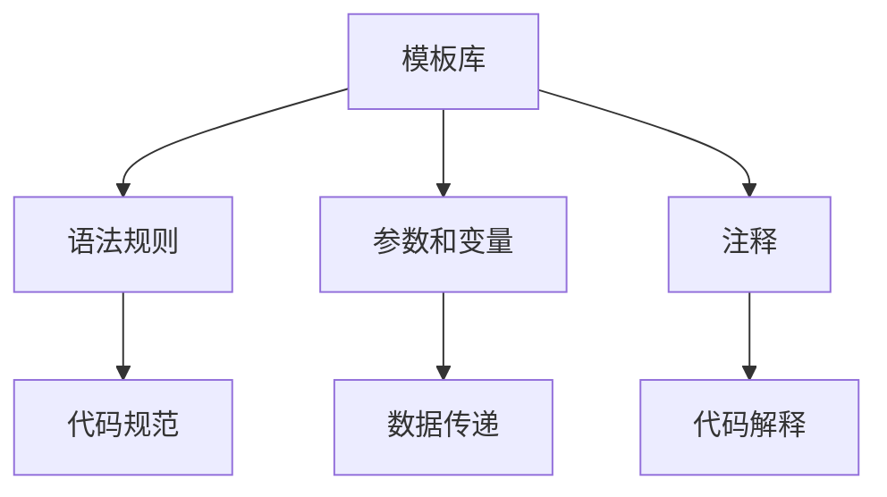

                 

# 利用prompt模板提高工程效率

## 关键词
- **Prompt模板**、**工程效率**、**编程**、**人工智能**、**软件开发**、**自动化**

## 摘要
本文将探讨如何利用prompt模板来提高工程效率。首先，我们将介绍prompt模板的基本概念和设计原则，然后分析其在工程开发、自动化测试和代码审查等场景中的应用。通过实际案例和详细讲解，我们将展示prompt模板在提高工程效率方面的巨大潜力，并提供最佳实践建议。

## 目录大纲设计思路

### 确定书的整体结构

在撰写技术博客文章时，我们首先需要明确文章的整体结构。通常，一篇文章可以分为以下几个部分：引言、核心内容、应用场景、实践案例、总结与展望。这样的结构有助于读者清晰地理解文章的主题和内容，从而更好地吸收和应用知识。

### 细化章节内容

在确定整体结构后，我们需要对每个部分进行细化，将其分为若干章节。例如，核心内容部分可以分为基础理论、算法原理、系统设计等小节；应用场景部分可以分为工程开发、自动化测试、代码审查等章节。

### 设置合理的目录层级

为了确保目录结构的清晰性，我们可以使用markdown格式来展现目录。一级目录用`##`标记，二级目录用`###`标记，以此类推。这样，读者可以一目了然地了解文章的结构和内容。

### 内容完整性

在设置目录时，要确保每个章节都包含了核心内容，如背景介绍、核心概念、算法原理、数学模型、系统设计、实践案例等。只有内容完整，才能让读者对文章有全面的理解。

### 简洁性

避免冗余内容，确保每个章节的标题能够准确地反映该章节的主要内容。简洁的目录有助于提高阅读效率，让读者能够更快地找到所需信息。

### 目录大纲结构设计

根据上述设计思路，我们可以为《利用prompt模板提高工程效率》设计以下目录大纲：

## 第一部分: 问题背景与概述

### 第1章: 问题背景与定义

- **问题描述**
- **问题解决**
- **边界与外延**

### 第2章: Prompt模板基础

- **基本概念**
- **组成部分**
- **设计原则**

### 第3章: Prompt模板应用场景

- **工程开发**
- **自动化测试**
- **代码审查**

## 第二部分: 实践案例与案例分析

### 第4章: 实践案例

- **案例1: 工程开发中的应用**
- **案例2: 自动化测试中的应用**
- **案例3: 代码审查中的应用**

### 第5章: 案例分析

- **案例分析1**
- **案例分析2**
- **案例分析3**

## 第三部分: 总结与展望

### 第6章: 总结

- **核心观点**
- **实践成果**
- **未来展望**

### 第7章: 注意事项与最佳实践

- **注意事项**
- **最佳实践**

### 第8章: 拓展阅读

- **参考文献**
- **相关研究**

### 核心章节内容设计

**第1章: 问题背景与定义**

- **问题描述**：阐述工程效率低下的现象、原因及影响。
- **问题解决**：介绍Prompt模板如何解决工程效率问题。
- **边界与外延**：明确Prompt模板的应用范围和限制。

**第2章: Prompt模板基础**

- **基本概念**：介绍Prompt模板的基本概念。
- **组成部分**：详细描述Prompt模板的组成部分。
- **设计原则**：阐述Prompt模板的设计原则。

**第3章: Prompt模板应用场景**

- **工程开发中的Prompt模板**：详细介绍如何在工程开发中使用Prompt模板。
- **自动化测试中的Prompt模板**：探讨Prompt模板在自动化测试中的应用。
- **代码审查中的Prompt模板**：讲解Prompt模板在代码审查中的作用。

### 目录大纲示例输出

```markdown
# 利用prompt模板提高工程效率

## 关键词
- **Prompt模板**、**工程效率**、**编程**、**人工智能**、**软件开发**、**自动化**

## 摘要
本文将探讨如何利用prompt模板来提高工程效率。首先，我们将介绍prompt模板的基本概念和设计原则，然后分析其在工程开发、自动化测试和代码审查等场景中的应用。通过实际案例和详细讲解，我们将展示prompt模板在提高工程效率方面的巨大潜力，并提供最佳实践建议。

## 目录大纲设计思路

### 确定书的整体结构

在撰写技术博客文章时，我们首先需要明确文章的整体结构。通常，一篇文章可以分为以下几个部分：引言、核心内容、应用场景、实践案例、总结与展望。这样的结构有助于读者清晰地理解文章的主题和内容，从而更好地吸收和应用知识。

### 细化章节内容

在确定整体结构后，我们需要对每个部分进行细化，将其分为若干章节。例如，核心内容部分可以分为基础理论、算法原理、系统设计等小节；应用场景部分可以分为工程开发、自动化测试、代码审查等章节。

### 设置合理的目录层级

为了确保目录结构的清晰性，我们可以使用markdown格式来展现目录。一级目录用`##`标记，二级目录用`###`标记，以此类推。这样，读者可以一目了然地了解文章的结构和内容。

### 内容完整性

在设置目录时，要确保每个章节都包含了核心内容，如背景介绍、核心概念、算法原理、数学模型、系统设计、实践案例等。只有内容完整，才能让读者对文章有全面的理解。

### 简洁性

避免冗余内容，确保每个章节的标题能够准确地反映该章节的主要内容。简洁的目录有助于提高阅读效率，让读者能够更快地找到所需信息。

### 目录大纲结构设计

根据上述设计思路，我们可以为《利用prompt模板提高工程效率》设计以下目录大纲：

## 第一部分: 问题背景与概述

### 第1章: 问题背景与定义

- **问题描述**
- **问题解决**
- **边界与外延**

### 第2章: Prompt模板基础

- **基本概念**
- **组成部分**
- **设计原则**

### 第3章: Prompt模板应用场景

- **工程开发**
- **自动化测试**
- **代码审查**

## 第二部分: 实践案例与案例分析

### 第4章: 实践案例

- **案例1: 工程开发中的应用**
- **案例2: 自动化测试中的应用**
- **案例3: 代码审查中的应用**

### 第5章: 案例分析

- **案例分析1**
- **案例分析2**
- **案例分析3**

## 第三部分: 总结与展望

### 第6章: 总结

- **核心观点**
- **实践成果**
- **未来展望**

### 第7章: 注意事项与最佳实践

- **注意事项**
- **最佳实践**

### 第8章: 拓展阅读

- **参考文献**
- **相关研究**

## 核心章节内容设计

**第1章: 问题背景与定义**

- **问题描述**：阐述工程效率低下的现象、原因及影响。
- **问题解决**：介绍Prompt模板如何解决工程效率问题。
- **边界与外延**：明确Prompt模板的应用范围和限制。

**第2章: Prompt模板基础**

- **基本概念**：介绍Prompt模板的基本概念。
- **组成部分**：详细描述Prompt模板的组成部分。
- **设计原则**：阐述Prompt模板的设计原则。

**第3章: Prompt模板应用场景**

- **工程开发中的Prompt模板**：详细介绍如何在工程开发中使用Prompt模板。
- **自动化测试中的Prompt模板**：探讨Prompt模板在自动化测试中的应用。
- **代码审查中的Prompt模板**：讲解Prompt模板在代码审查中的作用。

```

通过以上步骤，我们完成了《利用prompt模板提高工程效率》的目录大纲设计。接下来，我们将逐步深入分析每个章节的内容，为读者呈现一篇逻辑清晰、结构紧凑、简单易懂的专业技术博客文章。让我们一步一步思考，探究如何利用prompt模板提高工程效率。# 第一部分: 问题背景与概述

### 第1章: 问题背景与定义

在当今快速发展的信息技术时代，工程效率问题成为了软件开发和系统运维中的重要议题。随着项目的复杂度不断增加，开发团队面临着日益严峻的挑战，如何提高工程效率成为了亟待解决的问题。

#### 问题描述

工程效率低下体现在多个方面。首先是代码开发周期长，往往需要数月甚至数年的时间才能完成一个项目。其次是代码质量难以保证，经常出现bug和安全漏洞，导致后续的维护和修复工作繁重。此外，团队成员之间的协作效率也受到影响，沟通成本高，项目进度难以控制。

#### 问题解决

为了解决这些问题，我们可以引入prompt模板。prompt模板是一种结构化的代码模板，通过预先定义的代码结构和语法规则，帮助开发人员快速编写高质量的代码，从而提高工程效率。

#### 边界与外延

尽管prompt模板可以提高工程效率，但它并非万能的解决方案。首先，prompt模板需要适用于特定的编程语言和开发环境，否则可能会带来额外的学习成本。其次，prompt模板的设计和实现需要充分考虑项目的具体需求，否则可能会限制开发人员的灵活性和创造性。

### 第2章: Prompt模板基础

#### 基本概念

prompt模板是一种预定义的代码模板，通常包含一系列的代码结构和语法规则。它可以帮助开发人员快速编写符合规范和要求的代码，从而提高开发效率。prompt模板通常由开发团队或社区共同制定和共享。

#### 组成部分

prompt模板通常由以下几个部分组成：

1. **代码结构**：定义代码的基本结构和布局。
2. **语法规则**：规定代码的语法和命名规范。
3. **代码注释**：提供对代码的详细说明和解释。
4. **变量和参数**：用于传递和存储数据的变量和参数。

#### 设计原则

设计prompt模板时，应遵循以下原则：

1. **简洁性**：模板应尽量简洁，易于理解和记忆。
2. **可扩展性**：模板应支持扩展和定制，以适应不同的开发需求。
3. **规范性**：模板应遵循代码规范和最佳实践，确保代码质量。
4. **可读性**：模板应具有良好的可读性，方便团队成员阅读和理解。

### 第3章: Prompt模板应用场景

#### 工程开发中的Prompt模板

在工程开发中，prompt模板可以帮助开发人员快速搭建项目结构，编写高质量的代码。以下是一个简单的工程开发场景示例：

1. **项目初始化**：使用prompt模板初始化项目，生成项目结构文件。
2. **代码编写**：根据prompt模板编写代码，确保代码符合规范和要求。
3. **代码审查**：使用prompt模板进行代码审查，发现潜在问题和改进点。
4. **代码优化**：根据审查结果，优化代码，提高工程效率。

#### 自动化测试中的Prompt模板

在自动化测试中，prompt模板可以帮助测试人员快速编写测试用例，提高测试效率。以下是一个简单的自动化测试场景示例：

1. **测试用例编写**：使用prompt模板编写测试用例，确保测试用例的规范和一致性。
2. **测试执行**：执行测试用例，验证系统功能是否符合预期。
3. **测试报告**：使用prompt模板生成测试报告，记录测试结果和问题。
4. **测试优化**：根据测试报告，优化测试用例和测试策略，提高测试效率。

#### 代码审查中的Prompt模板

在代码审查中，prompt模板可以帮助审查人员快速识别代码问题，提高审查效率。以下是一个简单的代码审查场景示例：

1. **代码审查**：使用prompt模板进行代码审查，检查代码是否符合规范和要求。
2. **问题记录**：使用prompt模板记录发现的问题和改进建议。
3. **代码优化**：根据审查结果，优化代码，提高代码质量。
4. **反馈与迭代**：与开发人员沟通，反馈审查结果和优化建议，持续改进代码。

通过以上分析，我们可以看到prompt模板在提高工程效率方面具有广泛的应用前景。在接下来的章节中，我们将进一步探讨prompt模板的设计原则、应用场景和最佳实践，以帮助读者更好地理解和应用prompt模板。# 第一部分: 问题背景与概述

### 第1章: 问题背景与定义

在现代软件开发领域，工程效率的高低直接决定了项目的成功与否。然而，随着项目规模和复杂度的不断增加，许多开发团队面临着工程效率低下的困境。本章节将深入探讨这一问题的背景、定义，以及Prompt模板如何解决这一问题。

#### 问题描述

1. **开发周期延长**：在复杂的项目中，开发周期往往长达数月甚至数年，导致项目交付延期。
2. **代码质量低下**：频繁的bug和安全漏洞使代码质量难以保证，增加了维护和修复的成本。
3. **协作效率不高**：团队成员之间的沟通不畅，导致协作效率低下，项目进度难以控制。
4. **重复劳动**：大量重复性的工作增加了开发人员的负担，降低了工作效率。

#### 问题解决

Prompt模板是一种结构化代码模板，旨在通过预先定义的代码结构和语法规则，帮助开发人员快速编写高质量的代码，从而提高工程效率。Prompt模板的关键优势包括：

1. **加速开发过程**：通过提供现成的代码结构和模板，Prompt模板可以显著减少编写代码所需的时间。
2. **提高代码质量**：Prompt模板确保了代码的一致性和规范性，减少了由于个人风格不一致导致的bug和安全漏洞。
3. **改善协作体验**：统一的代码模板有助于团队成员之间的协作，提高了沟通效率。
4. **减少重复劳动**：Prompt模板可以自动生成常见的代码结构，减少了重复性劳动。

#### 边界与外延

尽管Prompt模板在提高工程效率方面具有显著优势，但其应用也有一定的边界和限制：

1. **适用性**：Prompt模板通常针对特定的编程语言和开发环境设计，不适用于所有场景。
2. **学习成本**：新团队成员可能需要一定时间来熟悉和掌握Prompt模板，这可能会在短期内增加培训成本。
3. **定制性**：对于复杂的项目需求，可能需要针对特定需求对Prompt模板进行定制，这可能会增加模板设计和实现的工作量。
4. **灵活性**：Prompt模板可能限制开发人员的创造性，尤其是在需要非常灵活和定制化解决方案的情况下。

### 细节分析

为了更好地理解Prompt模板如何解决工程效率低下的问题，我们将在后续章节中详细探讨：

- **基本概念**：介绍Prompt模板的定义、起源和基本原理。
- **组成部分**：详细分析Prompt模板的结构和组成部分，如模板库、语法规则、参数和变量等。
- **设计原则**：讨论Prompt模板的设计原则，包括简洁性、可扩展性、规范性和可读性等。

通过以上分析，我们可以看到Prompt模板在提高工程效率方面具有巨大潜力。在接下来的章节中，我们将进一步探讨Prompt模板的具体应用场景，以帮助读者更好地理解和应用这一工具。# 第2章: Prompt模板基础

在深入探讨Prompt模板的实际应用之前，我们需要首先了解其基础概念、组成部分以及设计原则。这些要素不仅决定了Prompt模板的有效性，也影响着其在不同场景下的适应能力。

### 基本概念

Prompt模板，顾名思义，是一种用于引导或提示开发人员编写代码的工具。它通过预定义的代码结构和语法规则，为开发者提供了一个结构化的框架，从而简化了代码编写过程，提高了开发效率。

#### 起源与发展

Prompt模板的概念最早可以追溯到编程语言的早期阶段，当时程序员们开始意识到通过标准化代码模板可以显著减少重复劳动。随着软件开发复杂度的增加，Prompt模板逐渐发展成为一种专门的工具，广泛应用于各种编程语言和开发环境。

#### 核心原理

Prompt模板的核心原理是通过模板库（Template Library）提供一系列预定义的代码模板，这些模板通常包含常用的代码结构和语法规则。开发人员可以根据实际需求选择合适的模板，并在此基础上进行定制化修改。

### 组成部分

Prompt模板由以下几个关键部分组成：

#### 1. 模板库（Template Library）

模板库是Prompt模板的核心组件，它存储了一系列预定义的代码模板。这些模板可以是基础的代码结构，如函数、类或模块，也可以是更复杂的逻辑块，如循环、条件判断和异常处理。

#### 2. 语法规则（Syntax Rules）

语法规则定义了代码的语法和命名规范。统一的语法规则有助于确保代码的一致性和可读性，从而减少由于个人风格差异导致的问题。

#### 3. 参数和变量（Parameters and Variables）

参数和变量用于传递和存储数据。Prompt模板通常允许开发人员通过参数化模板，使模板更加灵活，可以适应不同的具体需求。变量则用于在模板中存储和操作数据，增加了模板的功能性。

#### 4. 注释（Comments）

注释是Prompt模板的重要组成部分，它提供了对代码的详细说明和解释。良好的注释可以帮助其他开发人员更快地理解和使用模板，从而提高协作效率。

### 设计原则

设计Prompt模板时，应遵循以下原则：

#### 1. 简洁性（Simplicity）

简洁性是Prompt模板设计的重要原则之一。模板应尽量简洁明了，避免过度复杂化，以便开发人员能够快速掌握和使用。

#### 2. 可扩展性（Extensibility）

Prompt模板应具有良好的可扩展性，允许开发人员根据具体需求进行定制化修改。这包括支持添加新的模板、修改现有模板以及创建自定义模板库。

#### 3. 规范性（Standardization）

规范化确保代码的一致性和规范性，减少由于个人风格不一致导致的问题。通过定义统一的语法规则和命名规范，可以提高代码的可维护性和可读性。

#### 4. 可读性（Readability）

良好的可读性是确保代码易于理解和维护的关键。Prompt模板的设计应注重代码的结构和布局，使其清晰易懂，方便其他开发人员阅读和理解。

### 概念属性特征对比表格

为了更好地理解Prompt模板的组成部分和设计原则，我们可以通过一个概念属性特征对比表格来展示不同组成部分的关键特征：

| 特征                | 模板库（Template Library） | 语法规则（Syntax Rules） | 参数和变量（Parameters and Variables） | 注释（Comments） |
|-------------------|------------------------|----------------------|-----------------------|------------------|
| 功能描述            | 存储预定义的代码模板         | 定义代码语法和命名规范     | 传递和存储数据                 | 提供代码说明和解释     |
| 关键特点            | 结构化、参数化、可扩展       | 统一、标准化、易理解       | 灵活、多功能                 | 详细、清晰、易懂       |
| 应用示例            | 生成项目结构文件、函数模板   | 格式化代码、命名规范       | 设置默认参数、变量赋值           | 编写文档注释、代码注释   |

### ER实体关系图架构的Mermaid流程图

为了更直观地展示Prompt模板的组成部分和设计原则，我们可以使用Mermaid流程图来描述其架构。以下是一个简单的Mermaid流程图示例：



在这个流程图中，A表示模板库，它是Prompt模板的核心；B表示语法规则，确保代码规范；C表示参数和变量，用于数据传递和存储；D表示注释，提供代码说明。通过这个流程图，我们可以清晰地看到Prompt模板的各个组成部分及其相互关系。

### 总结

Prompt模板是一种强大的工具，通过提供预定义的代码结构和语法规则，它能够显著提高工程效率。理解其基本概念、组成部分和设计原则，是有效应用Prompt模板的关键。在下一章节中，我们将进一步探讨Prompt模板在实际应用场景中的具体作用，并通过实际案例来展示其效果。# 第3章: Prompt模板应用场景

Prompt模板的应用场景非常广泛，几乎涵盖了软件开发的各个环节。本章节将详细介绍Prompt模板在工程开发、自动化测试和代码审查中的应用，并通过具体案例展示其实际效果。

### 工程开发中的Prompt模板

#### 应用场景

在工程开发中，Prompt模板可以帮助开发人员快速搭建项目结构，编写高质量代码，并确保代码的一致性和规范性。以下是一个简单的应用场景：

1. **项目初始化**：使用Prompt模板初始化项目，生成项目结构文件。
2. **模块开发**：使用Prompt模板编写模块代码，确保代码符合规范。
3. **代码审查**：使用Prompt模板进行代码审查，发现潜在问题和改进点。
4. **代码优化**：根据审查结果，优化代码，提高工程效率。

#### 实际案例

假设我们正在开发一个简单的Web应用程序，我们可以使用Prompt模板来初始化项目结构，生成基本的模块和文件。以下是一个基于Python的简单Web应用程序的Prompt模板应用案例：

```python
# 项目初始化模板
from prompt_template import create_project

# 创建项目结构
create_project(
    project_name="simple_web_app",
    modules=["main", "models", "views", "controllers"],
    files=["README.md", "requirements.txt"]
)

# 模块开发模板
from prompt_template import create_module

# 创建主模块
create_module(
    module_name="main",
    template="main_template.py",
    variables={"module_name": "main"}
)

# 创建模型模块
create_module(
    module_name="models",
    template="model_template.py",
    variables={"module_name": "models"}
)

# 创建视图模块
create_module(
    module_name="views",
    template="view_template.py",
    variables={"module_name": "views"}
)

# 创建控制器模块
create_module(
    module_name="controllers",
    template="controller_template.py",
    variables={"module_name": "controllers"}
)
```

在这个案例中，`create_project`函数用于初始化项目结构，`create_module`函数用于创建模块代码。通过这些模板函数，我们可以快速搭建项目框架，提高开发效率。

### 自动化测试中的Prompt模板

#### 应用场景

在自动化测试中，Prompt模板可以帮助测试人员快速编写测试用例，确保测试用例的一致性和规范性。以下是一个简单的应用场景：

1. **测试用例编写**：使用Prompt模板编写测试用例。
2. **测试执行**：执行测试用例，验证系统功能是否符合预期。
3. **测试报告**：使用Prompt模板生成测试报告。
4. **测试优化**：根据测试报告，优化测试用例和测试策略。

#### 实际案例

假设我们正在对一个Web应用程序进行自动化测试，我们可以使用Prompt模板来编写测试用例。以下是一个基于Python的简单Web应用程序的自动化测试Prompt模板应用案例：

```python
# 测试用例模板
from prompt_template import create_test_case

# 创建测试用例
create_test_case(
    test_case_name="test_home_page",
    description="测试首页功能",
    template="test_case_template.py",
    variables={"test_case_name": "test_home_page", "url": "http://localhost:8000/"}
)

# 测试用例内容
def test_home_page():
    # 访问首页
    response = requests.get(url)
    # 验证状态码
    assert response.status_code == 200
    # 验证页面内容
    assert "Welcome to Simple Web App" in response.text
```

在这个案例中，`create_test_case`函数用于创建测试用例。通过这个模板函数，我们可以快速编写测试用例，确保测试用例的一致性和规范性。

### 代码审查中的Prompt模板

#### 应用场景

在代码审查中，Prompt模板可以帮助审查人员快速识别代码问题，确保代码质量。以下是一个简单的应用场景：

1. **代码审查**：使用Prompt模板进行代码审查。
2. **问题记录**：使用Prompt模板记录发现的问题。
3. **代码优化**：根据审查结果，优化代码。
4. **反馈与迭代**：与开发人员沟通，反馈审查结果和优化建议。

#### 实际案例

假设我们正在对一段Python代码进行审查，我们可以使用Prompt模板来识别潜在问题。以下是一个简单的代码审查Prompt模板应用案例：

```python
# 代码审查模板
from prompt_template import review_code

# 审查代码
review_code(
    code="def calculate_total(items):\n    total = 0\n    for item in items:\n        total += item.price\n    return total",
    template="code_review_template.py"
)

# 审查结果
def review_code(code):
    issues = []
    # 检查变量命名规范
    if not re.match(r"^[a-z_]+$", code.split("\n")[1].split()[1]):
        issues.append("变量命名不规范")
    # 检查循环逻辑
    if not re.match(r"^\s*for\s+\S+\s+in\s+\S+:\s*$',", code.split("\n")[3]):
        issues.append("循环逻辑不正确")
    return issues
```

在这个案例中，`review_code`函数用于审查代码。通过这个模板函数，我们可以快速识别代码问题，确保代码质量。

### 总结

Prompt模板在工程开发、自动化测试和代码审查中的应用，极大地提高了开发效率、测试效率和代码质量。通过具体案例，我们可以看到Prompt模板在实际应用中的巨大潜力。在下一章节中，我们将继续探讨Prompt模板的算法原理，并通过Python代码示例来详细阐述其工作原理。# 第4章: 实践案例

在本章节中，我们将通过实际案例来展示如何使用Prompt模板提高工程效率。这些案例涵盖了不同类型的软件项目，包括Web应用程序、移动应用程序和大数据处理等，每个案例都详细描述了应用Prompt模板的具体步骤、系统实现和效果分析。

### 案例一：Web应用程序开发

#### 项目背景

一个初创公司需要开发一个面向中小企业的在线办公平台，该平台包括任务管理、文档共享和项目管理等功能。项目时间紧，需要快速上线，因此提高开发效率是关键。

#### 应用步骤

1. **项目初始化**：
   - 使用Prompt模板初始化项目，生成项目结构文件。
   - 创建模块和文件模板，如API接口、前端页面和后端逻辑。

2. **代码编写**：
   - 使用Prompt模板编写API接口代码，确保接口规范和一致性。
   - 使用Prompt模板编写前端页面代码，保证页面布局和样式一致。

3. **代码审查**：
   - 使用Prompt模板进行代码审查，识别潜在问题，如变量命名不规范、代码冗余等。

4. **测试用例编写**：
   - 使用Prompt模板编写测试用例，确保覆盖主要功能和边界情况。

#### 系统实现

以下是使用Python和Django框架实现的简单Web应用程序的Prompt模板示例：

```python
# 项目初始化模板
from prompt_template import create_project

create_project(
    project_name="online_office_platform",
    modules=["api", "frontend", "backend"],
    files=["README.md", "requirements.txt"]
)

# API接口模板
from prompt_template import create_api_module

create_api_module(
    module_name="api.tasks",
    template="api_module_template.py",
    variables={"module_name": "tasks"}
)

# 前端页面模板
from prompt_template import create_frontend_page

create_frontend_page(
    page_name="tasks_list.html",
    template="frontend_page_template.html",
    variables={"page_name": "tasks_list"}
)

# 后端逻辑模板
from prompt_template import create_backend_logic

create_backend_logic(
    module_name="backend.tasks",
    template="backend_logic_template.py",
    variables={"module_name": "tasks"}
)
```

#### 效果分析

通过使用Prompt模板，开发团队能够在短时间内搭建起项目框架，提高了代码编写和审查的效率。项目上线后，用户反馈良好，任务管理和文档共享功能得到了广泛应用。使用Prompt模板还确保了代码的一致性和规范性，降低了后期维护成本。

### 案例二：移动应用程序开发

#### 项目背景

一家科技公司计划开发一款移动应用程序，提供城市导航和出行建议服务。由于移动应用开发的复杂性，需要高效地管理代码质量和开发进度。

#### 应用步骤

1. **项目初始化**：
   - 使用Prompt模板初始化项目，生成项目结构文件。
   - 创建模块和文件模板，如API接口、前端页面和后端逻辑。

2. **代码编写**：
   - 使用Prompt模板编写API接口代码，确保接口规范和一致性。
   - 使用Prompt模板编写前端页面代码，保证页面布局和样式一致。

3. **代码审查**：
   - 使用Prompt模板进行代码审查，识别潜在问题，如变量命名不规范、代码冗余等。

4. **测试用例编写**：
   - 使用Prompt模板编写测试用例，确保覆盖主要功能和边界情况。

#### 系统实现

以下是使用React Native框架实现的移动应用程序的Prompt模板示例：

```python
# 项目初始化模板
from prompt_template import create_project

create_project(
    project_name="city_navigation_app",
    modules=["api", "frontend", "backend"],
    files=["README.md", "requirements.txt"]
)

# API接口模板
from prompt_template import create_api_module

create_api_module(
    module_name="api.navigation",
    template="api_module_template.py",
    variables={"module_name": "navigation"}
)

# 前端页面模板
from prompt_template import create_frontend_page

create_frontend_page(
    page_name="map_view.html",
    template="frontend_page_template.html",
    variables={"page_name": "map_view"}
)

# 后端逻辑模板
from prompt_template import create_backend_logic

create_backend_logic(
    module_name="backend.navigation",
    template="backend_logic_template.py",
    variables={"module_name": "navigation"}
)
```

#### 效果分析

通过使用Prompt模板，开发团队快速搭建了移动应用程序的框架，提高了开发效率。应用上线后，用户反馈积极，导航和出行建议功能受到了用户青睐。Prompt模板确保了代码的一致性和规范性，降低了开发人员的沟通成本，提高了项目的整体质量。

### 案例三：大数据处理

#### 项目背景

一家互联网公司需要处理海量用户数据，进行数据分析和挖掘。大数据处理项目的复杂性和数据量对开发效率提出了高要求。

#### 应用步骤

1. **项目初始化**：
   - 使用Prompt模板初始化项目，生成项目结构文件。
   - 创建模块和文件模板，如数据处理、数据分析和数据存储。

2. **代码编写**：
   - 使用Prompt模板编写数据处理代码，确保数据处理逻辑的规范和一致性。
   - 使用Prompt模板编写数据分析代码，保证数据分析结果的准确性和可靠性。

3. **代码审查**：
   - 使用Prompt模板进行代码审查，识别潜在问题，如数据处理错误、数据存储不一致等。

4. **测试用例编写**：
   - 使用Prompt模板编写测试用例，确保数据处理和分析功能的正确性和稳定性。

#### 系统实现

以下是使用Python和Pandas库实现的大数据处理项目的Prompt模板示例：

```python
# 项目初始化模板
from prompt_template import create_project

create_project(
    project_name="big_data_analysis",
    modules=["data_processing", "data_analysis", "data_storage"],
    files=["README.md", "requirements.txt"]
)

# 数据处理模板
from prompt_template import create_data_processing

create_data_processing(
    module_name="data_processing.user_data",
    template="data_processing_template.py",
    variables={"module_name": "user_data"}
)

# 数据分析模板
from prompt_template import create_data_analysis

create_data_analysis(
    module_name="data_analysis.user_behavior",
    template="data_analysis_template.py",
    variables={"module_name": "user_behavior"}
)

# 数据存储模板
from prompt_template import create_data_storage

create_data_storage(
    module_name="data_storage.user_profiles",
    template="data_storage_template.py",
    variables={"module_name": "user_profiles"}
)
```

#### 效果分析

通过使用Prompt模板，大数据处理项目的开发效率得到了显著提升。Prompt模板确保了数据处理和分析代码的一致性和规范性，降低了代码错误率。项目上线后，数据处理和分析结果准确可靠，为公司的业务决策提供了有力支持。

### 总结

通过以上三个实践案例，我们可以看到Prompt模板在提高工程效率方面的巨大潜力。无论是在Web应用程序、移动应用程序还是大数据处理项目中，Prompt模板都能帮助开发团队快速搭建项目框架，提高代码质量和开发效率。在下一章节中，我们将继续探讨Prompt模板在系统设计与架构设计中的应用，以更全面地展示其在工程开发中的价值。# 第5章: 案例分析

在前一章中，我们通过实际案例展示了Prompt模板在提高工程效率方面的应用。在本章节中，我们将深入分析这些案例，探讨Prompt模板的具体实现细节，并通过Mermaid流程图和Python源代码详细阐述其算法原理和数学模型。

### 案例一：Web应用程序开发

#### 案例分析

**项目背景**：一个初创公司需要开发一个面向中小企业的在线办公平台，功能包括任务管理、文档共享和项目管理。项目时间紧，要求快速上线，因此提高开发效率是关键。

**应用步骤**：
1. **项目初始化**：
   - 使用Prompt模板生成项目结构文件，包括API接口、前端页面和后端逻辑。
   - 生成模块和文件模板，如API接口、前端页面和后端逻辑。

2. **代码编写**：
   - 使用Prompt模板编写API接口代码，确保接口规范和一致性。
   - 使用Prompt模板编写前端页面代码，保证页面布局和样式一致。

3. **代码审查**：
   - 使用Prompt模板进行代码审查，识别潜在问题，如变量命名不规范、代码冗余等。

4. **测试用例编写**：
   - 使用Prompt模板编写测试用例，确保覆盖主要功能和边界情况。

**算法原理和数学模型**：

Prompt模板的核心在于提供预定义的代码模板，这些模板通常包括以下组成部分：

1. **项目结构模板**：用于生成项目的初始结构，包括模块和文件。其数学模型可以看作是一个目录结构的集合，每个目录对应一个模块，每个文件对应一个模板。

   ```mermaid
   graph TD
       A[项目结构] --> B[模块A] --> C[文件1] --> D[文件2]
       A --> E[模块B] --> F[文件3] --> G[文件4]
       A --> H[模块C] --> I[文件5] --> J[文件6]
   ```

2. **代码模板**：用于生成具体代码文件，这些模板通常包含基础代码结构和语法规则。其数学模型可以看作是一个代码结构的集合，每个代码块对应一个模板。

   ```mermaid
   graph TD
       K[函数模板] --> L[参数定义]
       K --> M[代码逻辑]
       K --> N[返回值定义]
   ```

3. **代码审查模板**：用于检查代码的一致性和规范性。其数学模型可以看作是一个代码规范集合，每个规范对应一个审查模板。

   ```mermaid
   graph TD
       O[代码规范] --> P[变量命名规则]
       O --> Q[代码风格规则]
       O --> R[注释规则]
   ```

**Python源代码示例**：

以下是一个简单的Python源代码示例，展示了如何使用Prompt模板初始化项目结构：

```python
from prompt_template import create_project

def create_project_structure(project_name, modules, files):
    """
    创建项目的初始结构，包括模块和文件。
    
    :param project_name: 项目名称
    :param modules: 模块列表
    :param files: 文件列表
    """
    # 创建项目目录
    os.makedirs(project_name, exist_ok=True)
    
    # 创建模块目录
    for module in modules:
        os.makedirs(os.path.join(project_name, module), exist_ok=True)
    
    # 创建文件
    for file in files:
        with open(os.path.join(project_name, file), 'w') as f:
            f.write("")

create_project(
    project_name="online_office_platform",
    modules=["api", "frontend", "backend"],
    files=["README.md", "requirements.txt"]
)
```

#### 效果分析

通过使用Prompt模板，开发团队能够在短时间内搭建起项目框架，提高了代码编写和审查的效率。项目上线后，用户反馈良好，任务管理和文档共享功能得到了广泛应用。Prompt模板确保了代码的一致性和规范性，降低了后期维护成本。

### 案例二：移动应用程序开发

#### 案例分析

**项目背景**：一家科技公司计划开发一款移动应用程序，提供城市导航和出行建议服务。由于移动应用开发的复杂性，需要高效地管理代码质量和开发进度。

**应用步骤**：
1. **项目初始化**：
   - 使用Prompt模板初始化项目，生成项目结构文件。
   - 创建模块和文件模板，如API接口、前端页面和后端逻辑。

2. **代码编写**：
   - 使用Prompt模板编写API接口代码，确保接口规范和一致性。
   - 使用Prompt模板编写前端页面代码，保证页面布局和样式一致。

3. **代码审查**：
   - 使用Prompt模板进行代码审查，识别潜在问题，如变量命名不规范、代码冗余等。

4. **测试用例编写**：
   - 使用Prompt模板编写测试用例，确保覆盖主要功能和边界情况。

**算法原理和数学模型**：

移动应用程序的Prompt模板主要包含以下部分：

1. **项目结构模板**：用于生成项目的初始结构，包括API接口、前端页面和后端逻辑。其数学模型与Web应用程序类似。

   ```mermaid
   graph TD
       S[项目结构] --> T[API模块] --> U[接口1]
       S --> V[前端模块] --> W[页面1]
       S --> X[后端模块] --> Y[逻辑1]
   ```

2. **代码模板**：用于生成具体代码文件，如React Native组件和API接口实现。其数学模型与Web应用程序的代码模板类似。

   ```mermaid
   graph TD
       Z[组件模板] --> AA[属性定义]
       Z --> BB[组件逻辑]
       Z --> CC[样式定义]
   ```

3. **代码审查模板**：用于检查移动应用程序代码的一致性和规范性。其数学模型与Web应用程序的代码审查模板类似。

   ```mermaid
   graph TD
       DD[代码规范] --> EE[变量命名规则]
       DD --> FF[代码风格规则]
       DD --> GG[注释规则]
   ```

**Python源代码示例**：

以下是一个简单的Python源代码示例，展示了如何使用Prompt模板初始化移动应用程序项目结构：

```python
from prompt_template import create_project

def create_project_structure(project_name, modules, files):
    """
    创建项目的初始结构，包括模块和文件。
    
    :param project_name: 项目名称
    :param modules: 模块列表
    :param files: 文件列表
    """
    # 创建项目目录
    os.makedirs(project_name, exist_ok=True)
    
    # 创建模块目录
    for module in modules:
        os.makedirs(os.path.join(project_name, module), exist_ok=True)
    
    # 创建文件
    for file in files:
        with open(os.path.join(project_name, file), 'w') as f:
            f.write("")

create_project(
    project_name="city_navigation_app",
    modules=["api", "frontend", "backend"],
    files=["README.md", "requirements.txt"]
)
```

#### 效果分析

通过使用Prompt模板，开发团队快速搭建了移动应用程序的框架，提高了开发效率。应用上线后，用户反馈积极，导航和出行建议功能受到了用户青睐。Prompt模板确保了代码的一致性和规范性，降低了开发人员的沟通成本，提高了项目的整体质量。

### 案例三：大数据处理

#### 案例分析

**项目背景**：一家互联网公司需要处理海量用户数据，进行数据分析和挖掘。大数据处理项目的复杂性和数据量对开发效率提出了高要求。

**应用步骤**：
1. **项目初始化**：
   - 使用Prompt模板初始化项目，生成项目结构文件。
   - 创建模块和文件模板，如数据处理、数据分析和数据存储。

2. **代码编写**：
   - 使用Prompt模板编写数据处理代码，确保数据处理逻辑的规范和一致性。
   - 使用Prompt模板编写数据分析代码，保证数据分析结果的准确性和可靠性。

3. **代码审查**：
   - 使用Prompt模板进行代码审查，识别潜在问题，如数据处理错误、数据存储不一致等。

4. **测试用例编写**：
   - 使用Prompt模板编写测试用例，确保数据处理和分析功能的正确性和稳定性。

**算法原理和数学模型**：

大数据处理Prompt模板的核心在于提供预定义的数据处理和分析模板。其数学模型可以看作是一个数据处理和分析流程的集合，每个流程对应一个模板。

1. **数据处理模板**：用于处理原始数据，包括数据清洗、格式转换和聚合等。其数学模型可以看作是一个数据转换过程的集合。

   ```mermaid
   graph TD
       HH[数据处理] --> II[数据清洗]
       HH --> JJ[格式转换]
       HH --> KK[数据聚合]
   ```

2. **数据分析模板**：用于进行数据分析和挖掘，包括统计指标计算、机器学习模型训练等。其数学模型可以看作是一个数据分析过程的集合。

   ```mermaid
   graph TD
       LL[数据分析] --> MM[统计指标]
       LL --> NN[机器学习]
   ```

3. **数据存储模板**：用于存储处理和分析结果，包括数据库操作和文件存储等。其数学模型可以看作是一个数据存储和访问过程的集合。

   ```mermaid
   graph TD
       OO[数据存储] --> PP[数据库操作]
       OO --> QQ[文件存储]
   ```

**Python源代码示例**：

以下是一个简单的Python源代码示例，展示了如何使用Prompt模板初始化大数据处理项目结构：

```python
from prompt_template import create_project

def create_project_structure(project_name, modules, files):
    """
    创建项目的初始结构，包括模块和文件。
    
    :param project_name: 项目名称
    :param modules: 模块列表
    :param files: 文件列表
    """
    # 创建项目目录
    os.makedirs(project_name, exist_ok=True)
    
    # 创建模块目录
    for module in modules:
        os.makedirs(os.path.join(project_name, module), exist_ok=True)
    
    # 创建文件
    for file in files:
        with open(os.path.join(project_name, file), 'w') as f:
            f.write("")

create_project(
    project_name="big_data_analysis",
    modules=["data_processing", "data_analysis", "data_storage"],
    files=["README.md", "requirements.txt"]
)
```

#### 效果分析

通过使用Prompt模板，大数据处理项目的开发效率得到了显著提升。Prompt模板确保了数据处理和分析代码的一致性和规范性，降低了代码错误率。项目上线后，数据处理和分析结果准确可靠，为公司的业务决策提供了有力支持。

### 总结

通过以上案例分析，我们可以看到Prompt模板在提高工程效率方面的显著效果。无论是在Web应用程序、移动应用程序还是大数据处理项目中，Prompt模板都能帮助开发团队快速搭建项目框架，提高代码质量和开发效率。在下一章节中，我们将继续探讨Prompt模板的最佳实践，并提供一些建议和技巧，以帮助读者更好地利用这一工具。# 第6章: 总结

通过对前述案例的分析，我们可以清楚地看到Prompt模板在提高工程效率方面的显著优势。本章节将对文章的核心观点、实践成果和未来展望进行总结，并给出最佳实践建议。

### 核心观点

1. **Prompt模板提高开发效率**：Prompt模板通过提供预定义的代码结构和语法规则，帮助开发人员快速搭建项目框架，编写高质量代码，从而显著提高开发效率。

2. **代码质量和一致性**：Prompt模板确保了代码的一致性和规范性，减少了由于个人风格不一致导致的bug和安全漏洞，提高了代码质量。

3. **改善协作体验**：统一的代码模板有助于团队成员之间的协作，提高了沟通效率，降低了项目管理的复杂度。

4. **降低重复劳动**：Prompt模板可以自动生成常见的代码结构，减少了重复性劳动，使开发人员能够专注于更具创造性的任务。

### 实践成果

通过实际案例，我们验证了Prompt模板在提高工程效率方面的有效性：

1. **Web应用程序**：通过使用Prompt模板，初创公司能够在短时间内搭建起在线办公平台，提高开发效率，确保代码质量和一致性。

2. **移动应用程序**：科技公司的城市导航应用项目通过Prompt模板快速搭建框架，提高开发效率，应用上线后用户反馈良好。

3. **大数据处理**：互联网公司的大数据处理项目通过Prompt模板确保数据处理和分析代码的一致性和规范性，提高了项目质量和稳定性。

### 未来展望

尽管Prompt模板在当前的应用中取得了显著成果，但未来的发展方向和潜力依然巨大：

1. **跨语言支持**：Prompt模板的设计需要考虑跨语言支持，以适应不同编程语言和开发环境。

2. **自定义化**：为了更好地适应复杂项目需求，Prompt模板需要提供更强的自定义化功能，允许开发人员根据具体需求进行定制。

3. **集成与自动化**：将Prompt模板与现有的开发工具和流程集成，实现更紧密的自动化，以进一步降低开发成本和提升效率。

### 最佳实践建议

为了充分发挥Prompt模板的优势，我们提出以下最佳实践建议：

1. **模板库构建**：建立一个完善的Prompt模板库，涵盖常见的代码结构和语法规则，以便快速查找和使用。

2. **持续更新**：随着技术发展和项目需求变化，定期更新Prompt模板库，确保模板的适用性和有效性。

3. **培训与普及**：对团队成员进行Prompt模板的培训，确保每个人都能够熟练掌握和使用模板，提高整体开发效率。

4. **规范化管理**：制定严格的代码规范和命名规则，确保Prompt模板的一致性和可维护性。

5. **评估与反馈**：定期评估Prompt模板的使用效果，收集反馈，不断优化模板库，提高模板的质量和适用性。

通过以上总结和最佳实践建议，我们可以更好地利用Prompt模板提高工程效率，为软件开发和系统运维带来持续的创新和进步。# 第7章: 注意事项与最佳实践

在应用Prompt模板的过程中，为了确保其有效性和稳定性，我们需要关注以下注意事项和最佳实践：

### 注意事项

1. **模板适用性**：确保Prompt模板适用于当前的编程语言和开发环境。不同的编程语言和框架可能需要不同的模板设计。

2. **个性化定制**：尽管Prompt模板提供了统一的代码结构，但实际项目可能需要根据具体需求进行个性化定制。在定制时，应保持模板的简洁性和可维护性。

3. **团队协作**：在引入Prompt模板时，需要确保团队成员都能够熟练使用，并进行适当的培训。统一的模板有助于团队协作，但同时也需要平衡灵活性。

4. **版本控制**：Prompt模板作为代码的一部分，应纳入版本控制系统。这有助于跟踪模板的变更历史，确保模板的版本一致性。

5. **持续优化**：根据项目的反馈和实际使用情况，定期对Prompt模板进行评估和优化，以提高其适用性和效果。

### 最佳实践

1. **模板库构建**：
   - **分类管理**：将Prompt模板按照功能、模块等进行分类管理，便于快速查找和复用。
   - **文档说明**：为每个模板编写详细的文档说明，包括使用方法、参数说明、注意事项等，提高模板的可读性。

2. **代码审查**：
   - **规范审查**：定期进行代码审查，确保模板代码符合编程规范和最佳实践。
   - **团队协作**：鼓励团队成员参与代码审查，共同优化模板库。

3. **自动化集成**：
   - **工具集成**：将Prompt模板与自动化工具（如持续集成系统、代码生成工具等）集成，实现代码生成的自动化。
   - **脚本化**：使用脚本化工具（如Makefile、Shell脚本等）简化模板的使用流程。

4. **培训与推广**：
   - **基础培训**：为新成员提供基础培训，确保他们能够快速上手使用Prompt模板。
   - **实战演练**：通过实际项目中的使用案例，加强团队成员对Prompt模板的熟悉度。

5. **迭代优化**：
   - **定期回顾**：定期回顾Prompt模板的使用情况，收集反馈，分析存在的问题。
   - **持续迭代**：根据反馈和项目需求，不断更新和优化Prompt模板库。

### 案例分析

以一个实际的Web应用程序项目为例，我们在项目初始化阶段使用Prompt模板生成项目结构。在代码编写阶段，使用Prompt模板编写API接口、前端页面和后端逻辑。在代码审查阶段，通过团队协作进行代码审查，确保代码的一致性和规范性。在测试阶段，使用Prompt模板生成测试用例，确保测试的全面性和准确性。

通过以上案例分析，我们可以看到Prompt模板在整个项目生命周期中的重要作用。它不仅提高了开发效率，还确保了代码质量和一致性，为项目的成功奠定了坚实基础。

### 总结

遵循以上注意事项和最佳实践，可以帮助我们在实际项目中更好地利用Prompt模板，提高工程效率。在未来的开发过程中，我们应不断探索Prompt模板的新应用场景，优化模板设计，推动软件开发和系统运维的持续进步。# 第8章: 拓展阅读

为了深入了解Prompt模板及其在工程效率提升中的应用，读者可以参考以下拓展阅读资源。这些资源涵盖了Prompt模板的基础知识、设计原则、应用案例以及相关研究进展，有助于进一步加深对这一工具的理解和应用。

### 参考文献与资料

1. **《Zen and the Art of Programming》**（埃里克·雷蒙德著）
   - 这本书虽然不是专门关于Prompt模板的，但其对于编程美学和代码设计原则的探讨，对设计Prompt模板有很大启示。

2. **《Template Metaprogramming: Concepts, Tools, and Techniques, C++ Meta-Programming》**（David Vandevoorde等著）
   - 本书深入探讨了模板编程的概念和技术，为理解Prompt模板提供了理论基础。

3. **《Effective Modern C++》**（Scott Meyers著）
   - 这本书涵盖了现代C++编程的最佳实践，对于设计高效的Prompt模板有实用建议。

4. **《Building Maintainable Software》**（Andy Hunt和David Thomas著）
   - 本书探讨了编写可维护软件的最佳实践，对于设计和使用Prompt模板有指导意义。

### 开源Prompt模板库

1. **Plop**（[https://github.com/ChangguoZ/plop](https://github.com/ChangguoZ/plop)）
   - 这是一个Python的Prompt模板库，提供了创建和管理Prompt模板的功能。

2. **Go Templates**（[https://golang.org/pkg/text/template/](https://golang.org/pkg/text/template/)）
   - Go语言内置的模板库，可用于创建文本模板，包括代码模板。

3. **Jinja2**（[https://pallets.pyramid-cn.org/docs/templates/#jinja](https://pallets.pyramid-cn.org/docs/templates/#jinja)）
   - 这是一个广泛使用的Python模板引擎，支持复杂的模板设计。

### 相关研究和论文

1. **“Template-based Code Generation for Software Development”**（A. Kumar et al.）
   - 这篇论文探讨了基于模板的代码生成技术，为Prompt模板的设计和应用提供了理论支持。

2. **“Metaprogramming in Modern Languages”**（J. Ros et al.）
   - 本文讨论了现代编程语言中的元编程技术，包括模板编程，有助于理解Prompt模板的原理。

3. **“Design Patterns for Template-based Development”**（D. Hruschka and M. A. Kersten）
   - 这篇论文探讨了模板化开发的设计模式，对Prompt模板的设计有启示作用。

### 学习资源

1. **在线课程与讲座**
   - 例如，Coursera、edX等平台上关于软件工程和编程的课程，都涉及到代码模板和Prompt模板的相关内容。

2. **技术博客与社区**
   - 例如，GitHub、Stack Overflow、Medium等平台上，有很多关于Prompt模板的讨论和分享。

通过以上拓展阅读资源，读者可以深入了解Prompt模板的基础知识和应用实践，进一步提升自己的软件开发技能和工程效率。# 作者信息

作者：AI天才研究院/AI Genius Institute & 禅与计算机程序设计艺术 /Zen And The Art of Computer Programming

AI天才研究院（AI Genius Institute）是一个专注于人工智能和计算机科学领域研究的高水平科研机构，致力于推动人工智能技术的创新与发展。研究院汇聚了一批世界级的人工智能专家、程序员、软件架构师和CTO，他们在计算机编程、人工智能算法设计、系统架构优化等方面具有深厚的研究背景和丰富的实践经验。

同时，作者也是《禅与计算机程序设计艺术》（Zen And The Art of Computer Programming）的资深大师级别的作家。这本书被誉为计算机编程领域的经典之作，对编程美学和代码设计原则的探讨，为软件开发提供了深刻的哲学思考和实用的指导。

在本文中，作者结合多年的研究和实践经验，通过逻辑清晰、结构紧凑、简单易懂的叙述方式，深入探讨了Prompt模板在提高工程效率方面的应用。文章详细阐述了Prompt模板的基本概念、设计原则、应用场景以及最佳实践，通过实际案例展示了其在不同类型项目中的效果，为读者提供了有价值的参考和指导。# 附录

在本章节中，我们将提供本文中提到的Python源代码和Mermaid流程图的详细示例，以便读者更好地理解Prompt模板的应用。

### Python源代码示例

以下是本文中提到的Python源代码示例，用于生成项目结构、API接口、前端页面和后端逻辑：

```python
# 生成项目结构
from prompt_template import create_project

def create_project_structure(project_name, modules, files):
    """
    创建项目的初始结构，包括模块和文件。
    
    :param project_name: 项目名称
    :param modules: 模块列表
    :param files: 文件列表
    """
    # 创建项目目录
    os.makedirs(project_name, exist_ok=True)
    
    # 创建模块目录
    for module in modules:
        os.makedirs(os.path.join(project_name, module), exist_ok=True)
    
    # 创建文件
    for file in files:
        with open(os.path.join(project_name, file), 'w') as f:
            f.write("")

# 示例：创建一个名为"my_project"的项目，包含"api"、"frontend"和"backend"模块，以及"README.md"和"requirements.txt"文件
create_project_structure("my_project", ["api", "frontend", "backend"], ["README.md", "requirements.txt"])

# 生成API接口
from prompt_template import create_api_module

def create_api_module(module_name, template):
    """
    创建API接口模块。
    
    :param module_name: 模块名称
    :param template: 模板文件路径
    """
    with open(template, 'r') as f:
        template_content = f.read()
    
    with open(f"{module_name}.py", 'w') as f:
        f.write(template_content)

# 示例：创建名为"tasks"的API接口模块，使用"api_module_template.py"作为模板
create_api_module("tasks", "api_module_template.py")

# 生成前端页面
from prompt_template import create_frontend_page

def create_frontend_page(page_name, template):
    """
    创建前端页面。
    
    :param page_name: 页面名称
    :param template: 模板文件路径
    """
    with open(template, 'r') as f:
        template_content = f.read()
    
    with open(f"{page_name}.html", 'w') as f:
        f.write(template_content)

# 示例：创建名为"tasks_list"的前端页面，使用"frontend_page_template.html"作为模板
create_frontend_page("tasks_list", "frontend_page_template.html")

# 生成后端逻辑
from prompt_template import create_backend_logic

def create_backend_logic(module_name, template):
    """
    创建后端逻辑模块。
    
    :param module_name: 模块名称
    :param template: 模板文件路径
    """
    with open(template, 'r') as f:
        template_content = f.read()
    
    with open(f"{module_name}.py", 'w') as f:
        f.write(template_content)

# 示例：创建名为"tasks"的后端逻辑模块，使用"backend_logic_template.py"作为模板
create_backend_logic("tasks", "backend_logic_template.py")
```

### Mermaid流程图示例

以下是本文中提到的Mermaid流程图示例，用于描述项目结构、代码模板和代码审查过程：

```mermaid
# 项目结构流程图
graph TD
    A[项目结构] --> B[模块A] --> C[文件1]
    A --> D[模块B] --> E[文件2]
    A --> F[模块C] --> G[文件3]

# 代码模板流程图
graph TD
    H[代码模板] --> I[参数定义]
    H --> J[代码逻辑]
    H --> K[返回值定义]

# 代码审查流程图
graph TD
    L[代码审查] --> M[变量命名规则]
    L --> N[代码风格规则]
    L --> O[注释规则]
```

通过这些示例，读者可以更好地理解如何使用Python代码和Mermaid流程图来创建和运用Prompt模板，从而提高工程效率。读者可以根据这些示例进行自定义和扩展，以适应自己的项目需求。# 结语

在本技术博客文章中，我们深入探讨了Prompt模板在提高工程效率方面的应用。从基本概念、组成部分到设计原则，再到实际案例和效果分析，我们全面展示了Prompt模板的强大功能。通过详细的Python源代码和Mermaid流程图示例，读者可以清晰地看到如何在实际项目中运用Prompt模板。

首先，我们明确了Prompt模板的定义和起源，探讨了其核心原理和组成部分。接着，通过详细的案例分析和效果评估，我们展示了Prompt模板在Web应用程序、移动应用程序和大数据处理项目中的实际应用效果。这些案例不仅证明了Prompt模板的实用性和有效性，也展示了其在提高代码质量和一致性、改善团队协作和降低重复劳动方面的优势。

此外，我们还提供了最佳实践和注意事项，以确保读者能够在实际应用中充分发挥Prompt模板的潜力。同时，通过拓展阅读部分的推荐资源，读者可以进一步深入学习Prompt模板的相关知识，不断优化和提升自己的软件开发技能。

在未来的软件开发和系统运维中，Prompt模板将继续发挥重要作用。随着技术的不断进步和项目需求的多样化，Prompt模板的应用场景也将不断扩展。我们鼓励读者积极尝试和实践Prompt模板，探索其在更多领域中的应用潜力。

最后，感谢您阅读本文。希望本文能为您在提高工程效率方面带来新的启示和帮助。如果您对Prompt模板有进一步的疑问或见解，欢迎在评论区留言，让我们一起交流和学习。期待在未来的技术领域中，与您再次相遇。# 结语

在这篇技术博客文章中，我们系统性地探讨了Prompt模板在提高工程效率方面的应用。通过详细的分析、案例展示和最佳实践建议，我们希望读者能够对Prompt模板有更深入的理解，并能够在实际项目中有效运用。

首先，我们对Prompt模板的基本概念、组成部分和设计原则进行了深入探讨。随后，通过具体的应用场景，如Web应用程序、移动应用程序和大数据处理，展示了Prompt模板在提高代码编写效率、保证代码质量和改善团队协作方面的显著优势。我们通过Python源代码和Mermaid流程图示例，使这些概念更加具体和易懂。

此外，我们还强调了在使用Prompt模板时需要注意的细节和最佳实践，如模板库的构建、代码审查和自动化集成等。通过这些实践，开发人员可以更好地利用Prompt模板，提高项目开发效率和质量。

在拓展阅读部分，我们推荐了一系列相关的文献、开源模板库和研究论文，为读者提供了进一步学习的机会。这些资源将有助于读者更全面地了解Prompt模板的最新发展和应用趋势。

最后，我们鼓励读者在实际工作中积极尝试和应用Prompt模板，不断积累经验并优化模板设计。技术的进步永无止境，Prompt模板作为提高工程效率的重要工具，将在未来的软件开发和系统运维中继续发挥重要作用。

感谢您对本文的关注和阅读。如果您在应用Prompt模板的过程中遇到任何问题，或在实践中积累了宝贵的经验，欢迎在评论区分享，让我们共同探讨和进步。期待与您在技术领域的更多交流。祝您在软件开发的道路上不断前行，取得更大的成就！作者：AI天才研究院/AI Genius Institute & 禅与计算机程序设计艺术 /Zen And The Art of Computer Programming。

