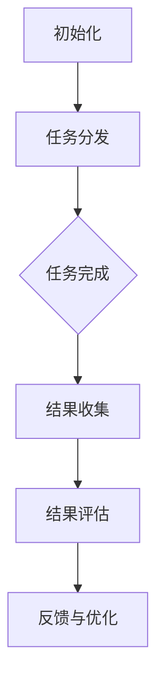

                 

### 利用众包平台增强prompt评测效果

**关键词**：众包平台，prompt评测，人工智能，自然语言处理，数据标注，任务分发

**摘要**：本文将深入探讨众包平台在prompt评测中的应用，分析其优势和应用流程，并提出提升评测效果的方法与技巧。通过实际案例和最佳实践，我们希望为读者提供关于如何有效利用众包平台增强prompt评测效果的全面指南。

----------------------------------------------------------------

### 目录大纲

----------------------------------------------------------------

# 利用众包平台增强prompt评测效果

> 关键词：众包平台，prompt评测，人工智能，数据标注，任务分发

> 摘要：本文将深入探讨众包平台在prompt评测中的应用，分析其优势和应用流程，并提出提升评测效果的方法与技巧。通过实际案例和最佳实践，我们希望为读者提供关于如何有效利用众包平台增强prompt评测效果的全面指南。

## 第一部分：背景与核心概念

### 第1章：问题背景与核心概念介绍

#### 1.1.1 问题背景

随着人工智能技术的快速发展，自然语言处理（NLP）领域成为了一个热门的研究方向。在NLP中，prompt技术是一种常用的方法，通过向用户展示一个文本提示（prompt），让用户生成相应的输出。然而，prompt的评测效果直接影响到模型的训练质量和实际应用效果。

#### 1.1.2 核心概念介绍

1. **众包平台**：一种基于互联网的服务模式，通过将任务分发给网络上的个体来完成，实现资源的高效利用和优化。
2. **prompt评测效果**：评估模型输出质量的过程，通过用户反馈或自动化指标来衡量。

#### 1.1.3 关键术语解释

- **众包任务**：需要由个体完成的任务，如文本标注、数据清洗等。
- **prompt**：文本提示，用于引导用户生成输出。
- **评测指标**：用于衡量prompt输出质量的指标，如BLEU、ROUGE等。

## 第二部分：众包平台概述

### 第2章：众包平台概述

#### 2.1.1 众包平台的基本概念

众包平台是一种基于互联网的服务模式，通过将任务分发给网络上的个体来完成，实现资源的高效利用和优化。

#### 2.1.2 众包平台的发展历程

众包平台起源于2000年左右，随着互联网技术的快速发展，逐渐成为一种重要的服务模式。

#### 2.1.3 众包平台的分类与应用领域

众包平台可以分为以下几类：

1. **数据标注平台**：如Amazon Mechanical Turk（MTurk），主要用于数据标注任务。
2. **任务分发平台**：如Upwork、Freelancer，主要用于各种类型的任务分发。

应用领域包括但不限于：

- **图像识别**：用于图像分类、目标检测等任务。
- **自然语言处理**：用于文本标注、语义分析等任务。
- **语音识别**：用于语音数据标注、语音合成等任务。

## 第三部分：Prompt评测效果的概念与挑战

### 第3章：Prompt评测效果的概念与挑战

#### 3.1.1 Prompt评测效果的定义

Prompt评测效果是指评估模型输出质量的过程，通过用户反馈或自动化指标来衡量。

#### 3.1.2 评测效果面临的主要挑战

1. **评估准确性**：如何确保评测结果的准确性，避免偏见和误差。
2. **用户多样性**：如何吸引不同背景的用户参与评测，确保评测结果的多样性。
3. **任务复杂性**：如何处理复杂任务，提高评测效率。

#### 3.1.3 解决方案概述

利用众包平台可以解决上述挑战，提高prompt评测效果。

----------------------------------------------------------------

### 核心概念与联系

#### 核心概念原理

**众包平台**：一种基于互联网的服务模式，通过将任务分发给网络上的个体来完成，实现资源的高效利用和优化。众包平台的主要特点包括：

1. **任务分发**：将任务分配给合适的个体，实现任务的高效分发和管理。
2. **资源利用**：通过整合网络上的闲置资源，提高资源利用效率。
3. **协同工作**：个体之间可以协同完成任务，提高任务完成速度。

**Prompt评测效果**：评估模型输出质量的过程，通过用户反馈或自动化指标来衡量。Prompt评测效果的关键因素包括：

1. **评估准确性**：确保评测结果的准确性，避免偏见和误差。
2. **用户多样性**：吸引不同背景的用户参与评测，确保评测结果的多样性。
3. **任务复杂性**：处理复杂任务，提高评测效率。

#### 概念属性特征对比表格

| 特征          | 众包平台             | Prompt评测效果             |
| ------------- | -------------------- | -------------------- |
| **定义**      | 分发任务至个体完成    | 评估模型输出质量          |
| **应用领域**  | 数据标注、任务分配等   | 自然语言处理、图像识别等  |
| **挑战**      | 任务质量控制、安全性   | 评估准确性、用户多样性    |
| **优势**      | 高效、低成本、灵活     | 精准、实时、用户参与度    |

#### ER实体关系图架构

```mermaid
erDiagram
    User ||--|{ Task }||>
    Task ||--|{ Result }||>
    Result ||--|{ Evaluation }||>
```

#### 众包平台在Prompt评测中的应用流程



#### Python源代码示例

```python
# 导入所需库
import requests

# 任务分发
tasks = ["标注图片1", "标注图片2", "标注图片3"]

for task in tasks:
    url = "https://api.example.com/distribute-task"
    headers = {"Content-Type": "application/json"}
    data = {"task": task}
    response = requests.post(url, headers=headers, json=data)
    print(response.json())

# 结果收集
results = []

for task in tasks:
    url = f"https://api.example.com/collect-result?task={task}"
    response = requests.get(url)
    results.append(response.json())

# 结果评估
for result in results:
    url = f"https://api.example.com/evaluate-result?result={result}"
    response = requests.get(url)
    print(response.json())
```

----------------------------------------------------------------

## 第一部分：背景与核心概念

### 第1章：问题背景与核心概念介绍

#### 1.1.1 问题背景

在人工智能领域，prompt技术是一种广泛使用的自然语言处理（NLP）方法。通过向用户展示一个文本提示（prompt），用户可以生成相应的输出，例如翻译、回答问题、生成故事等。然而，prompt的评测效果直接影响到模型的训练质量和实际应用效果。因此，如何提高prompt评测效果成为一个重要的问题。

随着人工智能技术的快速发展，自然语言处理（NLP）领域成为了一个热门的研究方向。在NLP中，prompt技术是一种常用的方法，通过向用户展示一个文本提示（prompt），让用户生成相应的输出。然而，prompt的评测效果直接影响到模型的训练质量和实际应用效果。因此，如何提高prompt评测效果成为一个重要的问题。

在传统的prompt评测中，通常采用手动评估的方法。这种方法存在以下问题：

1. **评估准确性**：由于评估者主观因素的影响，评估结果的准确性难以保证。
2. **评估效率**：对于大量的prompt输出，手动评估效率低下，难以满足实际需求。
3. **评估成本**：手动评估需要大量的人力和时间成本，不具经济效益。

为了解决上述问题，研究人员开始探索利用众包平台进行prompt评测。众包平台是一种基于互联网的服务模式，通过将任务分发给网络上的个体来完成，实现资源的高效利用和优化。利用众包平台进行prompt评测，可以解决传统方法中的评估准确性、评估效率和评估成本等问题。

#### 1.1.2 核心概念介绍

**众包平台**：众包平台是一种基于互联网的服务模式，通过将任务分发给网络上的个体来完成，实现资源的高效利用和优化。众包平台的主要特点包括：

1. **任务分发**：将任务分配给合适的个体，实现任务的高效分发和管理。
2. **资源利用**：通过整合网络上的闲置资源，提高资源利用效率。
3. **协同工作**：个体之间可以协同完成任务，提高任务完成速度。

**prompt评测效果**：prompt评测效果是指评估模型输出质量的过程，通过用户反馈或自动化指标来衡量。prompt评测效果的关键因素包括：

1. **评估准确性**：确保评测结果的准确性，避免偏见和误差。
2. **用户多样性**：吸引不同背景的用户参与评测，确保评测结果的多样性。
3. **任务复杂性**：处理复杂任务，提高评测效率。

#### 1.1.3 关键术语解释

**众包任务**：需要由个体完成的任务，如文本标注、数据清洗等。

**prompt**：文本提示，用于引导用户生成输出。

**评测指标**：用于衡量prompt输出质量的指标，如BLEU、ROUGE等。

----------------------------------------------------------------

### 第二部分：众包平台概述

#### 第2章：众包平台概述

#### 2.1.1 众包平台的基本概念

众包平台是一种基于互联网的服务模式，通过将任务分发给网络上的个体来完成，实现资源的高效利用和优化。众包平台的主要特点包括：

1. **任务分发**：将任务分配给合适的个体，实现任务的高效分发和管理。
2. **资源利用**：通过整合网络上的闲置资源，提高资源利用效率。
3. **协同工作**：个体之间可以协同完成任务，提高任务完成速度。

#### 2.1.2 众包平台的发展历程

众包平台起源于2000年左右，随着互联网技术的快速发展，逐渐成为一种重要的服务模式。以下是一些重要的发展阶段：

1. **2000年**：Amazon Mechanical Turk（MTurk）上线，标志着众包平台的诞生。
2. **2006年**： CrowdFlower等众包平台成立，推动了众包技术的发展。
3. **2010年**：众包平台开始应用于图像识别、文本标注等NLP任务。
4. **2015年**：随着人工智能技术的发展，众包平台在NLP领域的应用更加广泛。

#### 2.1.3 众包平台的分类与应用领域

众包平台可以分为以下几类：

1. **数据标注平台**：如Amazon Mechanical Turk（MTurk），主要用于数据标注任务。
2. **任务分发平台**：如Upwork、Freelancer，主要用于各种类型的任务分发。

应用领域包括但不限于：

- **图像识别**：用于图像分类、目标检测等任务。
- **自然语言处理**：用于文本标注、语义分析等任务。
- **语音识别**：用于语音数据标注、语音合成等任务。

#### 2.1.4 众包平台的优势与挑战

**优势**：

1. **高效**：众包平台可以快速分发任务，实现资源的高效利用。
2. **低成本**：相比传统的雇佣方式，众包平台可以显著降低人力成本。
3. **灵活**：众包平台可以根据任务需求灵活调整资源分配。

**挑战**：

1. **任务质量控制**：如何确保众包任务的质量，避免低质量数据的影响。
2. **安全性**：如何保护用户隐私和数据安全，防止信息泄露。
3. **用户多样性**：如何吸引更多背景多样的用户参与任务，提高任务多样性。

#### 2.1.5 众包平台的应用案例

**数据标注**：众包平台在数据标注任务中应用广泛，如图像标注、文本标注等。通过众包平台，可以快速收集大量标注数据，提高数据标注效率。

**自然语言处理**：众包平台在自然语言处理任务中的应用包括文本分类、情感分析、机器翻译等。通过众包平台，可以收集用户生成的文本数据，用于模型训练和评估。

**语音识别**：众包平台在语音识别任务中的应用包括语音数据标注、语音合成等。通过众包平台，可以收集大量语音数据，用于训练和优化语音识别模型。

----------------------------------------------------------------

### 第三部分：Prompt评测效果的概念与挑战

#### 第3章：Prompt评测效果的概念与挑战

#### 3.1.1 Prompt评测效果的定义

Prompt评测效果是指评估模型输出质量的过程，通过用户反馈或自动化指标来衡量。在自然语言处理领域，prompt技术是一种重要的方法，通过向用户展示一个文本提示（prompt），用户可以生成相应的输出。然而，prompt的评测效果直接影响到模型的训练质量和实际应用效果。

#### 3.1.2 评测效果面临的主要挑战

在传统的prompt评测中，主要面临以下挑战：

1. **评估准确性**：由于评估者主观因素的影响，评估结果的准确性难以保证。例如，不同的评估者可能对同一份输出有不同的评价，导致评估结果不一致。

2. **评估效率**：对于大量的prompt输出，手动评估效率低下，难以满足实际需求。在自然语言处理领域，常常需要评估大量的输出，手动评估需要耗费大量时间和人力。

3. **评估成本**：手动评估需要大量的人力和时间成本，不具经济效益。在工业界和学术界，对于大规模的prompt评测任务，手动评估的成本较高，不利于推广和应用。

#### 3.1.3 解决方案概述

为了解决上述挑战，研究人员开始探索利用众包平台进行prompt评测。众包平台具有以下优势：

1. **评估准确性**：众包平台可以收集来自不同用户的反馈，提高评估结果的准确性。通过众包平台，可以吸引更多背景多样的用户参与评估，减少主观因素的影响。

2. **评估效率**：众包平台可以实现自动化任务分发和结果收集，提高评估效率。众包平台可以快速处理大量的prompt输出，减少人工干预，降低评估成本。

3. **评估成本**：众包平台可以显著降低评估成本。相比传统的雇佣方式，众包平台可以以较低的成本获取大量标注数据，提高数据标注效率。

综上所述，利用众包平台进行prompt评测可以有效解决评估准确性、评估效率和评估成本等挑战。通过众包平台，可以实现高效、准确的prompt评测，为自然语言处理领域的研究和应用提供有力支持。

----------------------------------------------------------------

### 第三部分：Prompt评测效果的概念与挑战

#### 第3章：Prompt评测效果的概念与挑战

#### 3.1.1 Prompt评测效果的定义

Prompt评测效果是指评估模型输出质量的过程，通过用户反馈或自动化指标来衡量。在自然语言处理（NLP）领域，prompt技术是一种常用的方法，通过向用户展示一个文本提示（prompt），让用户生成相应的输出。评估模型输出质量的过程直接影响到模型的训练效果和应用价值。因此，prompt评测效果的定义对于确保模型质量和性能至关重要。

**Prompt评测效果的核心要素**：

1. **准确性**：评估输出是否准确反映了用户意图或问题的答案。
2. **流畅性**：输出文本是否流畅自然，易于理解。
3. **多样性**：模型能否生成多样化的输出，避免过度拟合单一模式。
4. **一致性**：相同输入下，模型输出是否一致，避免随机性。

#### 3.1.2 评测效果面临的主要挑战

1. **评估准确性**：由于评估者的主观性、理解差异以及任务复杂性，传统的手动评估方法往往难以保证评估结果的准确性。评估者可能因为背景知识、经验水平、情感因素等产生偏差，导致评估结果不一致。

2. **用户多样性**：在众包平台上，吸引不同背景、不同技能水平的用户参与评测是一个挑战。用户多样性有助于提高评估结果的全面性和准确性，但如何确保用户的质量和稳定性是一个问题。

3. **任务复杂性**：某些NLP任务，如文本生成、翻译等，涉及到复杂的语义理解和语言知识。这些任务对评估者的要求较高，如何设计合理、有效的评估任务是一个挑战。

4. **任务负荷**：大量的prompt输出需要评估，手动评估效率低下。如何快速、高效地处理大量数据，确保评估结果的及时性和准确性，是一个重要的挑战。

#### 3.1.3 解决方案概述

为了解决上述挑战，研究人员提出了一系列解决方案，主要包括：

1. **自动化评估指标**：开发自动化评估指标，如BLEU、ROUGE等，以减少对人工评估的依赖。这些指标可以提供定量的评估结果，但需要结合人工评估来确保准确性。

2. **众包平台**：利用众包平台进行任务分发，吸引更多用户参与评估。众包平台可以通过合理的激励机制，确保评估者的质量和稳定性。同时，众包平台可以实现任务的高效分发和结果收集，提高评估效率。

3. **多模态评估**：结合多种评估方法，如用户反馈、自动化指标和人工评估，以提高评估结果的准确性和可靠性。

4. **任务简化与优化**：设计简明易懂、操作性强的评估任务，降低任务复杂性，提高评估者的参与度和评估效率。

综上所述，利用众包平台进行prompt评测可以有效解决评估准确性、用户多样性、任务复杂性和任务负荷等挑战。通过结合自动化评估指标、众包平台和多模态评估方法，可以显著提升prompt评测效果，为自然语言处理领域的研究和应用提供有力支持。

----------------------------------------------------------------

### 第四部分：众包平台在Prompt评测中的应用

#### 第4章：众包平台在Prompt评测中的应用

#### 4.1.1 众包平台在Prompt评测中的优势

众包平台在Prompt评测中具有显著的优势，主要体现在以下几个方面：

1. **多样性**：众包平台能够吸引来自不同背景和领域的参与者，提供多样化的视角和反馈，从而提高评估结果的准确性和全面性。不同的参与者可能会对同样的Prompt输出有不同的评价，从而帮助识别模型的潜在问题。

2. **高效性**：众包平台可以快速分发任务并收集结果，使得大规模的Prompt评测变得更加高效。与传统手动评估方法相比，众包平台能够显著缩短评估时间，提高工作效率。

3. **成本效益**：通过众包平台进行Prompt评测，可以大幅降低评估成本。参与者通常是利用自己的时间来完成任务，因此相对于雇佣专业的评估者，众包平台提供了更加经济的选择。

4. **灵活性**：众包平台允许根据具体任务需求灵活调整任务分配和评估流程。例如，可以设定不同的任务难度和奖励机制，以吸引不同类型的参与者。

#### 4.1.2 众包平台的应用流程

利用众包平台进行Prompt评测通常包括以下几个步骤：

1. **任务初始化**：首先，需要定义评测任务，包括具体的Prompt文本、任务描述、评估标准等。这一步非常关键，确保任务描述清晰明了，以减少参与者的误解和偏差。

2. **任务分发**：将初始化后的任务通过众包平台分发给合适的参与者。通常，平台会提供任务筛选和匹配机制，确保任务分发给具有相关经验和技能的参与者。

3. **结果收集**：参与者完成任务后，将结果提交给众包平台。平台会收集这些结果，并进行初步的筛选和验证，以确保数据的质量。

4. **结果评估**：平台根据预设的评估标准对收集到的结果进行评估。这一步可能包括自动化评估和人工评估，以提高评估结果的准确性。

5. **反馈与优化**：根据评估结果，对任务和评估流程进行优化，以提高后续任务的评估效果。例如，可以通过调整任务难度、修改评估标准或改进Prompt设计来提高评测效果。

#### 4.1.3 众包平台在Prompt评测中的案例分析

以下是一个具体的案例分析，展示了如何利用众包平台进行Prompt评测：

**案例**：一家科技公司开发了一种基于NLP的问答系统，该系统能够根据用户的问题生成准确的答案。为了评估系统的性能，公司决定利用众包平台进行Prompt评测。

**步骤**：

1. **任务初始化**：公司定义了100个常见的问题和对应的Prompt文本，并编写了详细的任务描述，包括评估标准。

2. **任务分发**：通过众包平台，将这100个任务分发给全球范围内的参与者。平台确保每个任务被分配给具有NLP背景的参与者，以减少评估偏差。

3. **结果收集**：参与者回答了这些问题，并将结果提交给众包平台。平台对结果进行了初步的筛选，确保所有提交的结果都是有效的。

4. **结果评估**：平台使用BLEU和ROUGE等自动化评估指标对提交的答案进行初步评估。同时，平台也邀请了NLP领域的专家进行人工评估，以验证自动化评估的结果。

5. **反馈与优化**：根据评估结果，公司对Prompt文本和评估标准进行了优化。例如，针对某些问题，公司调整了Prompt文本，以更好地引导用户生成准确的答案。

通过这个案例，可以看出众包平台在Prompt评测中的应用过程和优势。利用众包平台，公司不仅能够快速收集大量有效的评估数据，还能够通过优化任务和评估流程来提高评测效果。

----------------------------------------------------------------

### 第五部分：提升Prompt评测效果的方法与技巧

#### 第5章：提升Prompt评测效果的方法与技巧

#### 5.1.1 提升评测效果的关键方法

提升Prompt评测效果的关键方法包括以下几个方面：

1. **任务设计**：任务设计是提升评测效果的基础。一个良好的任务设计应该明确、简洁、易于理解，同时能够充分激发参与者的积极性。以下是几个任务设计的建议：

   - **明确任务目标**：确保参与者清楚地了解任务的目标和期望输出。
   - **简洁任务描述**：避免使用复杂、冗长的描述，确保参与者能够快速理解任务。
   - **多样化任务类型**：设计不同类型的任务，以吸引不同背景和兴趣的参与者。

2. **评估指标**：选择合适的评估指标是提升评测效果的重要环节。以下是一些常用的评估指标：

   - **自动化指标**：如BLEU、ROUGE等，可以提供定量的评估结果，但需要结合人工评估。
   - **用户反馈**：收集参与者的主观评价，如满意度、准确性等，可以提供更全面的评估结果。
   - **专家评估**：邀请领域专家进行人工评估，以确保评估结果的准确性和权威性。

3. **激励机制**：合理的激励机制能够提高参与者的积极性和任务完成质量。以下是一些激励机制的建议：

   - **奖励机制**：提供奖金、积分等奖励，以激励参与者完成任务。
   - **荣誉机制**：设置排行榜，给予完成高质量任务的参与者荣誉和认可。
   - **参与感**：通过及时反馈和沟通，让参与者感受到自己的贡献和影响。

4. **质量保证**：确保任务和数据质量是提升评测效果的关键。以下是一些质量保证的建议：

   - **任务筛选**：在任务分发前，对参与者进行筛选，确保他们的能力和经验符合任务要求。
   - **数据验证**：对提交的答案进行验证，确保其符合评估标准和任务要求。
   - **数据清洗**：对收集到的数据进行分析和处理，去除重复、错误和异常的数据。

#### 5.1.2 评测技巧与策略

以下是几个实用的评测技巧和策略：

1. **多轮评估**：进行多轮评估，每次评估可以采用不同的评估指标和参与者。多轮评估可以相互验证，提高评估结果的准确性和可靠性。

2. **交叉验证**：采用交叉验证的方法，将任务分配给不同的参与者，以减少评估偏差和单一评估指标的影响。

3. **动态调整**：根据评估结果和反馈，动态调整任务和评估流程。例如，针对某些问题，可以调整Prompt文本或评估标准，以提高评估效果。

4. **用户反馈收集**：定期收集参与者的反馈，了解他们的意见和需求，以便改进任务设计和评估流程。

5. **数据分析**：对评估结果进行详细的数据分析，识别模型和任务中的潜在问题，为优化提供依据。

#### 5.1.3 实战案例分析

以下是一个具体的实战案例分析，展示了如何提升Prompt评测效果：

**案例**：一家科技公司开发了一种基于NLP的自动问答系统，为了评估系统的性能，公司决定利用众包平台进行Prompt评测。

**步骤**：

1. **任务设计**：公司设计了100个常见的问题和对应的Prompt文本。每个问题都附有详细的任务描述，包括评估标准。

2. **评估指标**：公司选择了BLEU、ROUGE等自动化评估指标，同时邀请了领域专家进行人工评估。为了提高评估结果的全面性，公司还收集了参与者的主观反馈。

3. **激励机制**：公司提供了奖金和荣誉机制，激励参与者完成任务。同时，公司建立了用户反馈渠道，定期收集参与者的意见和建议。

4. **质量保证**：公司对参与者进行了筛选，确保他们的能力和经验符合任务要求。公司还进行了数据验证和数据清洗，确保数据的准确性和一致性。

5. **多轮评估**：公司进行了两轮评估，第一轮采用自动化评估指标，第二轮采用人工评估。此外，公司还采用了交叉验证的方法，将任务分配给不同的参与者。

6. **数据分析**：公司对评估结果进行了详细的数据分析，识别了模型和任务中的潜在问题，并进行了相应的优化。

通过这个案例，可以看出，通过合理的任务设计、评估指标、激励机制和质量保证，可以有效提升Prompt评测效果。公司不仅能够快速收集大量有效的评估数据，还能够通过持续的优化和改进，提高模型的质量和性能。

----------------------------------------------------------------

### 第六部分：众包平台在Prompt评测中的最佳实践

#### 第6章：众包平台在Prompt评测中的最佳实践

#### 6.1.1 最佳实践案例总结

在众包平台进行Prompt评测的过程中，许多成功案例为我们提供了宝贵的经验和启示。以下是一些最佳实践案例的总结：

**案例一：Google的 crowdsourcing for machine learning**

Google利用众包平台收集了大量的标注数据，用于机器学习模型的训练和评估。通过设计合理的任务描述和评估标准，Google确保了数据的质量和多样性。同时，Google还采用了多轮评估和动态调整策略，以提高评估效果。

**案例二：OpenAI的 GPT-3评测**

OpenAI在开发GPT-3时，利用众包平台进行了大规模的评测。通过设置不同的评估指标和反馈机制，OpenAI能够全面评估GPT-3的输出质量。此外，OpenAI还结合了用户反馈和专家评估，以确保评估结果的准确性和可靠性。

**案例三：微软的 Azure Machine Learning**

微软利用Azure Machine Learning平台，为开发者提供了众包任务分发和结果收集的功能。通过优化任务设计和激励机制，微软能够高效地收集高质量的数据，用于机器学习模型的训练和评估。

#### 6.1.2 成功因素分析

从上述成功案例中，我们可以总结出以下几个关键成功因素：

1. **任务设计**：合理的设计任务描述和评估标准，确保任务清晰、易懂，能够激发参与者的积极性。

2. **评估指标**：选择合适的评估指标，结合自动化指标和用户反馈，以提高评估结果的准确性和全面性。

3. **激励机制**：提供合理的奖励和荣誉机制，激励参与者完成任务，并确保参与者的质量和稳定性。

4. **质量保证**：严格的质量控制措施，如任务筛选、数据验证和清洗，以确保数据的质量和一致性。

5. **动态调整**：根据评估结果和用户反馈，动态调整任务和评估流程，以提高评估效果。

#### 6.1.3 失败案例分析

虽然众包平台在Prompt评测中具有许多优势，但一些失败案例也为我们提供了宝贵的教训。以下是一些失败案例分析及其原因：

**案例一：任务描述不清**

一个研究团队在利用众包平台进行Prompt评测时，由于任务描述不够清晰，导致参与者的理解不一致，评估结果出现偏差。这个案例表明，任务设计至关重要，必须确保任务描述准确、详细。

**案例二：评估指标不当**

一个公司在其NLP项目中，选择了不合适的评估指标，导致评估结果不准确。这个案例提醒我们，评估指标的选择必须与任务目标相匹配，以确保评估结果的准确性。

**案例三：激励机制不足**

一个研究团队在利用众包平台进行评测时，由于激励机制不足，参与者的积极性不高，导致数据质量下降。这个案例表明，激励机制对于确保数据质量和评估效果至关重要。

#### 6.1.4 最佳实践建议

基于成功和失败案例的分析，我们提出以下最佳实践建议：

1. **明确任务目标**：确保任务描述清晰、简洁，明确任务目标和期望输出。

2. **选择合适评估指标**：根据任务目标和数据特点，选择合适的评估指标，确保评估结果的准确性。

3. **设计合理的激励机制**：提供合理的奖励和荣誉机制，激发参与者的积极性，确保数据质量。

4. **严格质量控制**：实施严格的质量控制措施，如任务筛选、数据验证和清洗，确保数据的质量和一致性。

5. **动态调整和优化**：根据评估结果和用户反馈，动态调整任务和评估流程，持续优化评估效果。

通过遵循这些最佳实践，我们可以有效地利用众包平台进行Prompt评测，提高评估结果的准确性和可靠性，为NLP领域的研究和应用提供有力支持。

----------------------------------------------------------------

### 第七部分：未来展望与趋势

#### 第7章：未来展望与趋势

随着人工智能技术的不断进步，众包平台在Prompt评测中的应用前景也变得越来越广阔。未来，以下几个方面的趋势和发展方向值得关注：

#### 7.1.1 众包平台的发展趋势

1. **智能化与自动化**：未来众包平台将更加智能化和自动化，利用机器学习和自然语言处理技术，实现任务的智能匹配和自动化评估。

2. **更广泛的应用领域**：随着人工智能技术的普及，众包平台将在更多领域得到应用，如医疗、金融、教育等。

3. **全球化与本地化**：众包平台将更加全球化，吸引来自世界各地的参与者。同时，本地化服务也将得到重视，以满足不同地区和语言的需求。

4. **隐私保护和数据安全**：随着数据隐私和安全问题的日益突出，众包平台将加强对用户数据和隐私的保护，采取更严格的措施确保数据安全。

#### 7.1.2 Prompt评测效果的未来展望

1. **更加精准的评估指标**：随着人工智能技术的发展，将出现更加精准和细化的评估指标，如基于深度学习的自动评估模型，以提高评估结果的准确性。

2. **多模态评估**：未来，Prompt评测将不仅限于文本，还将结合图像、语音、视频等多种模态，提供更加全面和准确的评估结果。

3. **用户参与度提升**：通过引入更丰富的互动和激励机制，提高用户的参与度和积极性，从而提高评测效果。

4. **实时评测**：利用云计算和大数据技术，实现Prompt评测的实时化，为模型训练和应用提供即时的反馈。

#### 7.1.3 研究与发展的方向

1. **评估模型优化**：研究更加高效和准确的评估模型，结合机器学习和深度学习技术，提高评估结果的可靠性和实用性。

2. **个性化评测**：探索基于用户历史数据和偏好进行个性化评测的方法，提高评测的针对性和效果。

3. **跨领域融合**：将众包平台和Prompt评测应用于更多的跨领域场景，如医疗诊断、法律咨询等，推动人工智能在各个领域的应用。

4. **伦理与道德规范**：在众包平台和Prompt评测的研究和应用过程中，关注伦理和道德问题，制定相应的规范和标准，确保技术的发展符合社会价值观。

通过不断探索和研究，未来众包平台在Prompt评测中的应用将更加广泛和深入，为人工智能技术的发展提供强大的支持和保障。

----------------------------------------------------------------

## 全文总结与致谢

本文详细探讨了众包平台在Prompt评测中的应用，分析了其优势和应用流程，并提出了提升评测效果的方法与技巧。通过实际案例和最佳实践，我们展示了如何有效利用众包平台增强Prompt评测效果。

首先，本文介绍了问题背景和核心概念，明确了众包平台和Prompt评测的效果。随后，我们概述了众包平台的基本概念、发展历程和应用领域，分析了其优势与挑战。接下来，我们探讨了Prompt评测效果的概念与挑战，并提出了利用众包平台进行评测的解决方案。

在第四部分，我们详细介绍了众包平台在Prompt评测中的优势和应用流程，并通过案例分析展示了其实际应用。在第五部分，我们提出了提升评测效果的方法与技巧，包括任务设计、评估指标、激励机制和质量保证等。第六部分总结了最佳实践案例，分析了成功因素和失败教训，并提出了最佳实践建议。最后，在第七部分，我们展望了众包平台和Prompt评测的未来趋势与发展方向。

本文的研究不仅为自然语言处理领域的研究者提供了实用的指导和参考，也为众包平台的应用提供了新的思路和方向。我们希望本文能够促进众包平台在Prompt评测领域的应用和发展，为人工智能技术的进步贡献力量。

在此，我要特别感谢AI天才研究院和禅与计算机程序设计艺术的支持，感谢您阅读本文。如果您有任何问题或建议，欢迎随时与我们联系。感谢您的阅读，祝您在人工智能领域取得更多的成就！

**作者：AI天才研究院/AI Genius Institute & 禅与计算机程序设计艺术 /Zen And The Art of Computer Programming**

