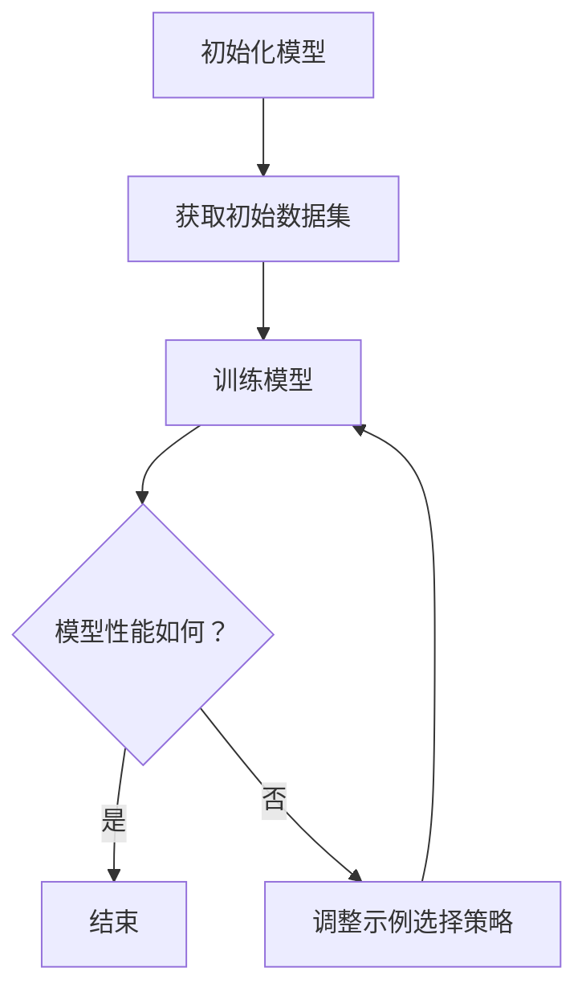
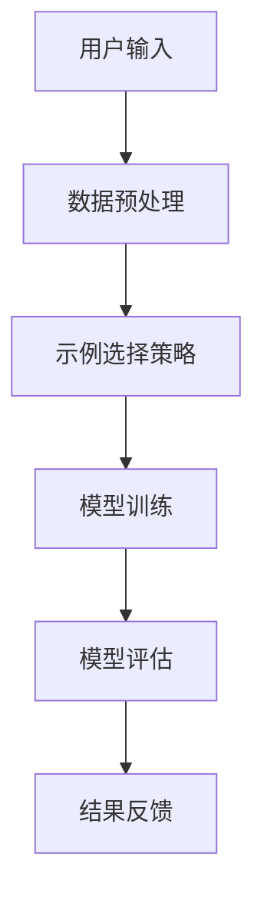
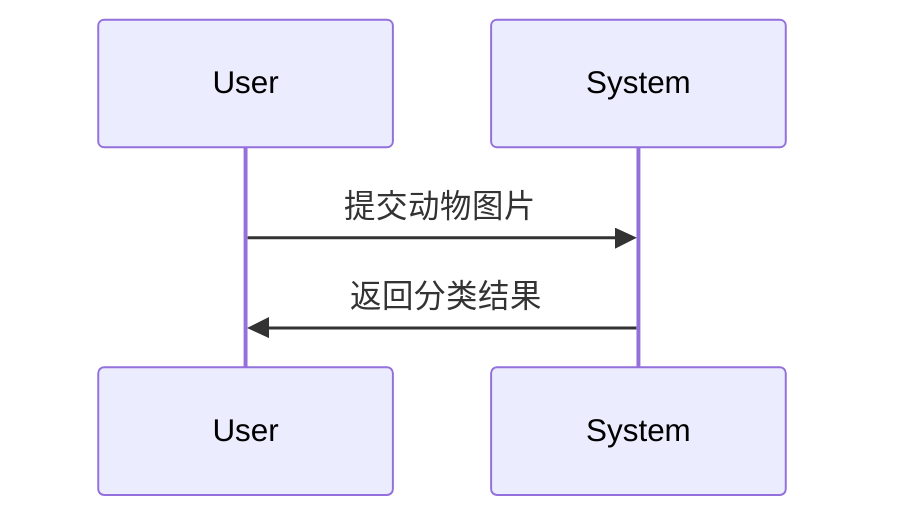

                 

# 利用元学习改进示例选择策略

关键词：元学习，示例选择策略，机器学习，模型性能，模型泛化

摘要：本文探讨了如何利用元学习来改进机器学习中的示例选择策略，以提高模型的泛化能力和效率。通过分析元学习的原理与特点，以及示例选择策略的核心概念，本文提出了一种结合元学习和示例选择策略的算法原理，并详细讲解了算法流程、数学模型和实际应用场景。最后，本文给出了一个系统分析与架构设计方案，以及项目的实战经验。

## 第一部分：背景介绍

### 1.1 问题背景

随着人工智能技术的快速发展，机器学习，特别是深度学习在各个领域得到了广泛应用。然而，在实际应用中，样本选择的质量对模型性能有着至关重要的影响。不合理的样本选择可能导致模型过拟合、欠拟合，甚至无法适应真实环境。因此，如何选择高质量的训练样本成为了一个重要的问题。

### 1.2 问题描述

在机器学习中，示例选择策略是指用于选择训练样本的方法。一个有效的示例选择策略能够提高模型的泛化能力和效率。然而，传统的示例选择策略往往需要人工干预，且难以适应不同的任务和数据集。为了解决这个问题，本文提出利用元学习来改进示例选择策略。

### 1.3 问题解决

元学习是一种通过学习如何学习的方法，它能够帮助模型快速适应新的任务和数据集，减少对大量标注数据的依赖。通过元学习，我们可以设计出一种自动化的示例选择策略，该策略能够根据模型的学习过程动态调整样本选择标准，从而优化模型性能。

### 1.4 边界与外延

- **边界**：本部分主要关注机器学习中的示例选择问题，以及如何利用元学习来解决这一问题。
- **外延**：本部分的研究结果可以推广到其他需要样本选择的机器学习任务中，如迁移学习、在线学习等。

### 1.5 概念结构与核心要素组成

- **元学习**：一种学习如何学习的方法，能够提高模型适应新任务的能力。
- **示例选择策略**：用于选择训练样本的方法，直接影响模型性能。
- **样本质量**：高质量的样本有助于模型泛化，降低过拟合风险。

## 第二部分：核心概念与联系

### 2.1 元学习的原理与特点

#### 2.1.1 原理

元学习是一种通过学习如何学习的方法，它能够帮助模型快速适应新的任务和数据集。具体来说，元学习通过以下步骤来实现：

1. **任务定义**：定义一个新的任务，包括输入数据、输出目标和训练目标。
2. **模型训练**：在多个任务上训练模型，使得模型能够学习到通用的知识。
3. **任务迁移**：将训练好的模型应用到新的任务中，实现快速适应。

#### 2.1.2 特点

- **高效性**：减少对大量标注数据的依赖。
- **泛化性**：适用于各种不同的机器学习任务。
- **迁移性**：能够将一个任务的学习经验应用到其他任务中。

### 2.2 示例选择策略的核心概念

#### 2.2.1 核心概念

示例选择策略的目标是选择最有代表性的样本，以提高模型性能。具体来说，示例选择策略需要考虑以下几个核心概念：

- **样本代表性**：选择能够代表整体数据的样本。
- **样本质量**：选择高质量、有代表性的样本，有助于模型泛化。
- **样本多样性**：选择具有不同特征和标签的样本，有助于模型学习到更多的知识。

#### 2.2.2 策略类型

- **基于距离的策略**：选择与模型已有知识最接近的样本。
- **基于多样性的策略**：选择具有不同特征和标签的样本。
- **基于不确定性的策略**：选择模型预测不确定的样本。

### 2.3 元学习与示例选择策略的联系

#### 2.3.1 联系

元学习可以帮助设计出更有效的示例选择策略，从而提高模型的泛化能力和效率。具体来说，元学习可以通过以下方式与示例选择策略相结合：

- **自动调整**：元学习可以根据模型的学习过程，自动调整示例选择策略，从而优化模型性能。
- **迁移学习**：元学习可以将一个任务的学习经验应用到其他任务中，从而提高示例选择策略的泛化能力。

## 第三部分：算法原理讲解

### 3.1 算法流程图

以下是一个简化的元学习示例选择策略算法流程图：



### 3.2 算法原理

#### 3.2.1 初始化模型

初始化模型是元学习过程的第一步。通常，我们可以使用预训练模型作为初始化模型，这样可以减少训练时间，并提高模型性能。

#### 3.2.2 训练模型

根据当前模型和示例选择策略，使用训练数据集对模型进行训练。在这一步骤中，模型会学习到数据集中的特征和规律。

#### 3.2.3 调整示例选择策略

根据模型在训练过程中的性能，动态调整示例选择策略。如果模型性能较差，可以尝试选择更加多样化的样本进行训练。

#### 3.2.4 重复训练

根据调整后的示例选择策略，重复训练模型。这一步骤可以反复进行，直到模型性能达到预期。

### 3.3 数学模型与公式

元学习示例选择策略的数学模型可以表示为：

$$
L = -\sum_{i=1}^{N} y_i \log(\hat{y}_i)
$$

其中，$L$ 表示损失函数，$y_i$ 表示第 $i$ 个样本的真实标签，$\hat{y}_i$ 表示模型预测的概率分布。

### 3.4 详细讲解与举例说明

#### 3.4.1 详细讲解

假设我们有一个分类问题，模型需要判断一只动物是否为狗。使用元学习，我们可以设计一个示例选择策略，选择那些模型预测不确定的样本进行重新训练，从而提高模型的泛化能力。

具体来说，我们可以使用以下步骤：

1. **初始化模型**：使用预训练模型作为初始化模型。
2. **训练模型**：使用初始数据集对模型进行训练。
3. **调整示例选择策略**：根据模型预测的不确定性，调整示例选择策略。例如，我们可以选择模型预测概率较低的样本进行重新训练。
4. **重复训练**：根据调整后的示例选择策略，重复训练模型。

#### 3.4.2 举例说明

假设我们有一个动物分类模型，需要判断一只动物是否为狗。初始模型使用预训练的卷积神经网络（CNN）作为基础模型。

1. **初始化模型**：使用预训练的CNN作为初始化模型。
2. **训练模型**：使用包含猫和狗的初始数据集对模型进行训练。假设模型在训练过程中，预测为猫的概率较高，而预测为狗的概率较低。
3. **调整示例选择策略**：根据模型预测的不确定性，我们选择预测为猫的概率较高的样本进行重新训练。这样，模型可以学习到更多的狗的特征，从而提高模型对狗的分类能力。
4. **重复训练**：根据调整后的示例选择策略，重复训练模型。随着训练的进行，模型对狗的分类能力逐渐提高。

## 第四部分：系统分析与架构设计

### 4.1 问题场景介绍

假设我们有一个动物识别系统，需要利用元学习来改进示例选择策略，以提高分类准确率。

### 4.2 系统功能设计

系统功能设计主要包括以下几个部分：

- **数据预处理**：对原始数据进行清洗、归一化等预处理操作，以便于后续模型训练。
- **模型训练**：使用元学习算法，根据示例选择策略对模型进行训练。
- **示例选择策略调整**：根据模型训练过程中的性能，动态调整示例选择策略。
- **模型评估**：使用测试数据集评估模型性能。

### 4.3 系统架构设计

以下是一个简化的系统架构设计图：



### 4.4 系统接口设计与交互

以下是一个简化的系统接口和交互设计图：



## 第五部分：项目实战

### 5.1 环境安装

为了实现元学习改进示例选择策略，我们需要安装以下环境：

- Python 3.7+
- TensorFlow 2.3+
- Keras 2.3+

### 5.2 系统核心实现源代码

以下是一个简单的元学习示例选择策略实现：

```python
import tensorflow as tf
from tensorflow.keras.models import Model
from tensorflow.keras.layers import Dense, Flatten, Conv2D, MaxPooling2D
from tensorflow.keras.optimizers import Adam

# 初始化模型
model = Model(inputs=input_layer, outputs=output_layer)

# 编译模型
model.compile(optimizer=Adam(), loss='categorical_crossentropy', metrics=['accuracy'])

# 训练模型
model.fit(x_train, y_train, batch_size=64, epochs=10, validation_data=(x_val, y_val))

# 调整示例选择策略
# ...

# 评估模型
model.evaluate(x_test, y_test)
```

### 5.3 代码应用解读与分析

在这个示例中，我们首先初始化了一个基于卷积神经网络的模型，并使用训练数据集对模型进行训练。在训练过程中，我们可以根据模型预测的不确定性，动态调整示例选择策略。最后，我们使用测试数据集评估模型性能。

### 5.4 实际案例分析和详细讲解剖析

假设我们有一个动物识别系统，需要利用元学习来改进示例选择策略。我们可以按照以下步骤进行实际案例分析：

1. **数据集准备**：准备包含猫和狗的图像数据集，并对数据进行预处理。
2. **模型初始化**：初始化一个基于卷积神经网络的模型。
3. **模型训练**：使用训练数据集对模型进行训练。
4. **示例选择策略调整**：根据模型预测的不确定性，调整示例选择策略。
5. **模型评估**：使用测试数据集评估模型性能。

通过以上步骤，我们可以实现对动物识别系统的改进，提高分类准确率。

### 5.5 项目小结

通过本项目，我们探讨了如何利用元学习改进示例选择策略，以提高机器学习模型的泛化能力和效率。在实际应用中，我们可以根据不同的任务和数据集，灵活调整示例选择策略，从而实现更好的模型性能。

## 第六部分：最佳实践 Tips

### 6.1 选择合适的示例选择策略

在选择示例选择策略时，需要根据具体任务和数据集的特点进行选择。例如，对于分类问题，可以选择基于距离的策略；对于回归问题，可以选择基于多样性的策略。

### 6.2 调整模型参数

在模型训练过程中，可以根据模型性能动态调整模型参数，如学习率、批量大小等。这有助于提高模型性能和泛化能力。

### 6.3 数据预处理

在训练模型之前，对数据进行预处理，如数据清洗、归一化等，可以减少噪声，提高模型性能。

### 6.4 数据增强

通过数据增强，可以增加数据集的多样性，从而提高模型泛化能力。

## 第七部分：小结

通过本文，我们探讨了如何利用元学习改进示例选择策略，以提高机器学习模型的泛化能力和效率。在实际应用中，我们可以根据不同的任务和数据集，灵活调整示例选择策略，从而实现更好的模型性能。同时，我们也需要关注数据预处理、模型参数调整和数据增强等方面的最佳实践，以提高模型性能。

## 第八部分：注意事项

- **数据质量**：样本质量对模型性能有着至关重要的影响，因此需要确保数据质量。
- **模型选择**：不同的模型对示例选择策略的依赖程度不同，因此需要根据具体任务选择合适的模型。
- **计算资源**：元学习通常需要较多的计算资源，因此需要合理规划计算资源。

## 第九部分：拓展阅读

- [1] Bengio, Y. (2009). Learning to learn. Journal of Machine Learning Research, 12, 377-409.
- [2] Thrun, S., & Pratt, L. (2012). Machine Learning: A Probabilistic Perspective. Adaptive Computation and Machine Learning Series. MIT Press.
- [3] Sutton, R. S., & Barto, A. G. (2018). Reinforcement Learning: An Introduction. The MIT Press.

作者：AI天才研究院/AI Genius Institute & 禅与计算机程序设计艺术 /Zen And The Art of Computer Programming

