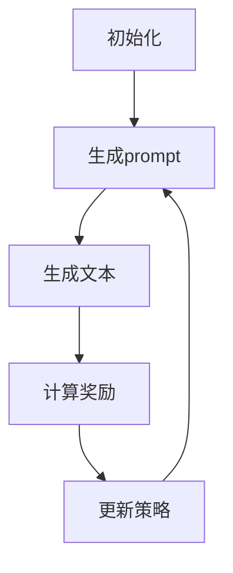
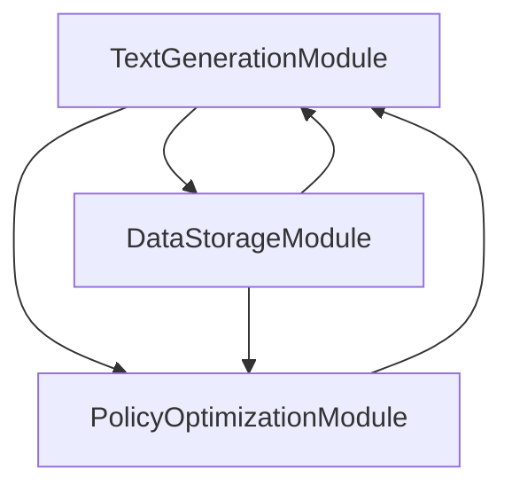
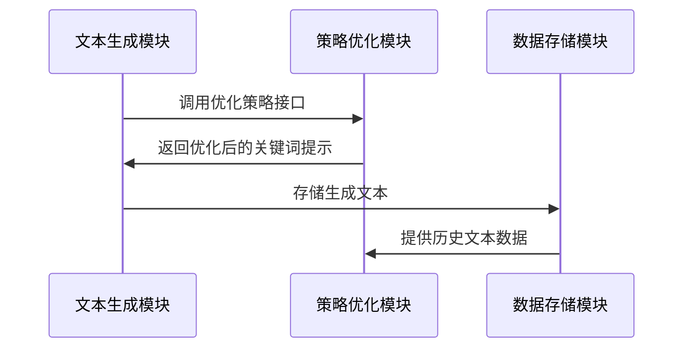
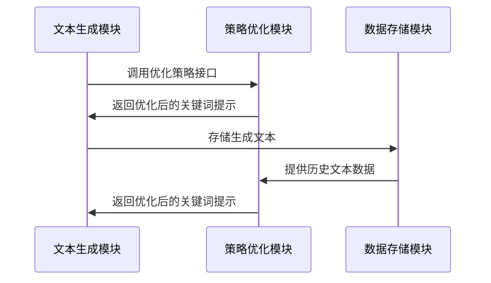

                 

# 《利用强化学习优化prompt策略》

## 关键词

强化学习、prompt策略、优化、自然语言处理、算法原理、系统架构、项目实战

## 摘要

本文将探讨如何利用强化学习优化prompt策略，以提升自然语言处理系统的性能。我们将从强化学习的基本原理出发，逐步介绍prompt策略的定义与应用，并通过具体案例展示强化学习在prompt策略优化中的实际效果。文章还将深入讲解强化学习优化prompt策略的算法原理，并提供系统分析与架构设计的方案，最后通过项目实战来验证算法的有效性。本文旨在为读者提供一个系统、全面的强化学习在prompt策略优化中的应用指南。

## 1. 强化学习与prompt策略概述

### 1.1 强化学习的背景与基本概念

#### 1.1.1 强化学习的发展历程

强化学习（Reinforcement Learning，RL）起源于20世纪50年代，由Richard Sutton和Andrew Barto在其经典著作《强化学习：一种现代视角》（Reinforcement Learning: An Introduction）中首次系统阐述。强化学习是基于奖励机制和环境反馈来训练智能体的机器学习方法，其目标是通过不断学习和决策，最大化累积奖励。

强化学习经历了从简单模型到复杂模型的演变过程。早期的代表性算法包括Q学习（Q-Learning）和策略梯度算法（Policy Gradient）。随着深度学习的发展，深度强化学习（Deep Reinforcement Learning，DRL）成为了研究的热点，并在许多领域取得了显著成果。

#### 1.1.2 强化学习的基本原理

强化学习主要包括四个要素：智能体（Agent）、环境（Environment）、动作（Action）和奖励（Reward）。智能体是执行决策的实体，环境是智能体所处的情景，动作是智能体可以采取的行为，而奖励是环境对智能体动作的反馈。

强化学习的过程可以概括为以下几个步骤：

1. **智能体接收环境状态**：智能体首先从环境中获取当前状态。
2. **智能体选择动作**：智能体根据当前状态和已学习的策略选择一个动作。
3. **环境执行动作**：环境根据动作产生新的状态，并给予智能体奖励。
4. **智能体更新策略**：智能体根据奖励和历史经验更新策略，以便在下一个决策时做出更好的选择。

#### 1.1.3 强化学习在自然语言处理中的应用

强化学习在自然语言处理（Natural Language Processing，NLP）领域有着广泛的应用，尤其是在文本生成、机器翻译、问答系统等领域。

- **文本生成**：通过强化学习，模型可以根据给定的前文生成连贯的文本。例如，GPT（Generative Pre-trained Transformer）系列模型就是基于强化学习训练的。
- **机器翻译**：强化学习可以帮助机器翻译系统在翻译过程中根据上下文优化翻译结果，提高翻译的准确性和自然度。
- **问答系统**：强化学习可以用于训练问答系统，使其能够根据用户的问题生成准确的回答。

### 1.2 prompt策略的基本概念

#### 1.2.1 什么是prompt策略

prompt策略是指利用外部提示（prompt）来引导模型生成文本的方法。在NLP任务中，prompt通常是一段引导文本，用于提示模型生成符合特定主题或风格的文本。

prompt策略可以分为以下几类：

1. **关键词提示**：通过提供与任务相关的关键词来引导模型生成文本。
2. **句子级提示**：提供与任务相关的句子，用于引导模型生成完整的段落。
3. **段落级提示**：提供与任务相关的段落，用于引导模型生成整篇文章。

#### 1.2.2 prompt策略的分类

根据prompt的形式，prompt策略可以分为以下几类：

1. **静态prompt**：静态prompt是指在整个训练和推理过程中保持不变的提示。
2. **动态prompt**：动态prompt是指根据任务需求实时生成的提示。

#### 1.2.3 prompt策略在优化中的应用

prompt策略在优化中的应用主要体现在以下几个方面：

1. **提高生成文本的连贯性**：通过提供合适的prompt，可以帮助模型生成更加连贯和自然的文本。
2. **提高生成文本的多样性**：通过设计多样化的prompt，可以促使模型生成不同风格和主题的文本。
3. **提高生成文本的准确性**：通过提供与任务相关的prompt，可以帮助模型生成更加准确和高质量的文本。

### 1.3 强化学习与prompt策略的关系

强化学习与prompt策略之间存在紧密的联系。强化学习可以通过优化prompt策略来提升模型的性能。具体来说，强化学习可以通过以下几种方式来优化prompt策略：

1. **动态调整prompt**：通过强化学习算法，可以动态调整prompt的内容和形式，以适应不同的任务需求和生成文本风格。
2. **探索与利用**：强化学习可以在生成文本的过程中平衡探索（尝试新的prompt）和利用（利用已经验证有效的prompt），从而提高生成文本的质量。
3. **多任务学习**：通过强化学习，模型可以在多任务环境中学习不同的prompt策略，从而提高模型在不同任务上的泛化能力。

## 2. 强化学习原理

### 2.1 强化学习的基础数学

#### 2.1.1 期望最大化算法

期望最大化（Expectation-Maximization，EM）算法是一种在概率模型中用于估计参数的迭代算法。EM算法通过交替执行期望（E）步和最大化（M）步来优化目标函数。

- **期望（E）步**：计算在当前参数下，数据对各个参数后验概率的贡献。
- **最大化（M）步**：根据E步的结果，更新参数，使得目标函数值最大化。

#### 2.1.2 动机函数和奖励机制

在强化学习中，动机函数（Motivation Function）用于衡量智能体在不同状态下的动机强度。奖励机制（Reward Mechanism）则用于根据智能体的动作和状态提供奖励，以激励智能体做出有利于目标函数的决策。

- **动机函数**：通常表示为 \( f(s, a) \)，其中 \( s \) 表示状态，\( a \) 表示动作。
- **奖励机制**：通常表示为 \( r(s, a) \)，表示在状态 \( s \) 下采取动作 \( a \) 后获得的奖励。

### 2.2 Q学习算法

Q学习（Q-Learning）是一种值函数迭代算法，用于在给定策略下学习最优动作值函数。Q学习算法通过不断更新Q值，逐步逼近最优动作值函数。

- **Q值**：表示在状态 \( s \) 下采取动作 \( a \) 后获得的最大期望奖励。
- **Q值更新公式**：\( Q(s, a) = Q(s, a) + \alpha [r + \gamma \max_{a'} Q(s', a') - Q(s, a)] \)，其中 \( \alpha \) 表示学习率，\( \gamma \) 表示折扣因子。

### 2.3 策略梯度算法

策略梯度算法（Policy Gradient）是一种基于策略优化的强化学习算法。策略梯度算法通过更新策略参数，使得策略在最大化累积奖励的同时，最小化策略梯度。

- **策略梯度公式**：\( \nabla_{\theta} J(\theta) = \nabla_{\theta} \sum_{t=0}^{T} r_t = \sum_{t=0}^{T} \nabla_{\theta} \log \pi_{\theta}(a_t|s_t) r_t \)，其中 \( \theta \) 表示策略参数，\( J(\theta) \) 表示策略期望回报。

## 3. prompt策略介绍

### 3.1 prompt策略的定义与分类

#### 3.1.1 prompt策略的定义

prompt策略是指通过提供外部提示（prompt）来引导模型生成文本的方法。prompt可以是关键词、句子或段落等形式，用于提示模型生成符合特定主题或风格的文本。

#### 3.1.2 prompt策略的分类

根据prompt的形式和用途，prompt策略可以分为以下几类：

1. **关键词提示**：通过提供与任务相关的关键词，引导模型生成符合主题的文本。
2. **句子级提示**：提供与任务相关的句子，用于引导模型生成连贯的段落。
3. **段落级提示**：提供与任务相关的段落，用于引导模型生成整篇文章。

#### 3.1.3 prompt策略的优点与挑战

prompt策略的优点包括：

- **提高生成文本的连贯性**：通过提供合适的prompt，可以帮助模型生成更加连贯和自然的文本。
- **提高生成文本的多样性**：通过设计多样化的prompt，可以促使模型生成不同风格和主题的文本。
- **提高生成文本的准确性**：通过提供与任务相关的prompt，可以帮助模型生成更加准确和高质量的文本。

prompt策略的挑战包括：

- **设计合适的prompt**：设计合适的prompt需要综合考虑任务需求和模型特性，具有一定的挑战性。
- **平衡探索与利用**：在生成文本的过程中，如何平衡探索新的prompt和利用有效的prompt，以提高生成文本的质量。

### 3.2 prompt策略在自然语言处理中的应用

#### 3.2.1 prompt在文本生成中的应用

在文本生成任务中，prompt策略可以用于引导模型生成符合特定主题或风格的文本。例如，在生成新闻文章时，可以通过提供与新闻主题相关的关键词或句子作为prompt，引导模型生成新闻文章。

#### 3.2.2 prompt在问答系统中的应用

在问答系统中，prompt策略可以用于引导模型生成准确的答案。例如，在回答用户提出的问题时，可以通过提供与问题相关的句子或段落作为prompt，引导模型生成符合问题要求的答案。

## 4. 强化学习在prompt策略优化中的应用

### 4.1 强化学习优化prompt策略的基本思路

强化学习优化prompt策略的基本思路是通过调整prompt的内容和形式，使得模型生成的文本质量得到提升。具体来说，强化学习可以通过以下步骤来优化prompt策略：

1. **定义奖励函数**：设计一个能够衡量文本质量的奖励函数，用于评价模型生成的文本。
2. **选择优化目标**：根据任务需求和模型特性，选择适当的优化目标，例如提高文本连贯性、多样性和准确性等。
3. **设计策略更新规则**：根据奖励函数和优化目标，设计策略更新规则，用于调整prompt的内容和形式。
4. **训练模型**：使用强化学习算法，不断更新策略，并在训练过程中调整prompt，以实现优化目标。

### 4.2 实际案例介绍

#### 4.2.1 案例背景

假设我们要开发一个文本生成模型，用于生成符合特定主题和风格的新闻文章。为了提高生成文本的质量，我们希望通过强化学习优化prompt策略。

#### 4.2.2 案例分析

在案例中，我们可以设计一个基于关键词提示的prompt策略。具体步骤如下：

1. **定义奖励函数**：设计一个能够衡量文本质量的奖励函数，例如基于文本连贯性、多样性和准确性等指标的加权平均分数。
2. **选择优化目标**：根据任务需求和模型特性，选择提高文本连贯性、多样性和准确性作为优化目标。
3. **设计策略更新规则**：使用策略梯度算法，设计策略更新规则，用于调整关键词提示的内容和形式。
4. **训练模型**：在训练过程中，不断更新策略，并在每次更新后调整关键词提示，以提高生成文本的质量。

## 5. 算法原理讲解

### 5.1 算法mermaid流程图

#### 5.1.1 算法流程

强化学习优化prompt策略的算法流程可以分为以下几个步骤：

1. **初始化**：初始化策略参数和奖励函数。
2. **生成prompt**：根据当前策略生成prompt。
3. **生成文本**：使用生成的prompt引导模型生成文本。
4. **计算奖励**：根据生成的文本计算奖励值。
5. **更新策略**：根据奖励值和策略更新规则更新策略。
6. **重复**：重复步骤2-5，直到满足停止条件。

#### 5.1.2 mermaid流程图表示



### 5.2 Python源代码实现

```python
import numpy as np

# 初始化策略参数和奖励函数
def initialize():
    # 初始化策略参数
    policy = np.random.rand(num_states, num_actions)
    # 初始化奖励函数
    reward_function = np.zeros(num_states)
    return policy, reward_function

# 生成prompt
def generate_prompt(state):
    # 根据状态生成关键词提示
    prompt = " ".join(np.random.choice(keywords, size=10))
    return prompt

# 生成文本
def generate_text(prompt):
    # 使用prompt引导模型生成文本
    text = model.generate(prompt)
    return text

# 计算奖励
def compute_reward(text):
    # 根据文本质量计算奖励值
    reward = quality评估函数(text)
    return reward

# 更新策略
def update_policy(policy, reward, alpha):
    # 根据奖励值更新策略
    policy = policy + alpha * (reward - policy)
    return policy

# 主函数
def main():
    # 初始化策略参数和奖励函数
    policy, reward_function = initialize()
    # 设置学习率
    alpha = 0.1
    # 设置训练轮数
    num_iterations = 100
    # 循环更新策略
    for i in range(num_iterations):
        # 生成prompt
        prompt = generate_prompt(state)
        # 生成文本
        text = generate_text(prompt)
        # 计算奖励
        reward = compute_reward(text)
        # 更新策略
        policy = update_policy(policy, reward, alpha)
        # 打印更新信息
        print(f"Iteration {i+1}: Reward = {reward}, Policy = {policy}")
    # 输出最终策略
    print(f"Final Policy: {policy}")

# 运行主函数
if __name__ == "__main__":
    main()
```

### 5.3 算法原理讲解

#### 5.3.1 强化学习优化prompt策略的数学模型

强化学习优化prompt策略的核心是策略优化。策略优化可以通过策略梯度算法实现。策略梯度算法的目标是最大化累积奖励，即：

$$ J(\theta) = \sum_{t=0}^{T} \nabla_{\theta} \log \pi_{\theta}(a_t|s_t) r_t $$

其中，\( \theta \) 表示策略参数，\( \pi_{\theta}(a_t|s_t) \) 表示在状态 \( s_t \) 下采取动作 \( a_t \) 的概率，\( r_t \) 表示在状态 \( s_t \) 下采取动作 \( a_t \) 后获得的奖励。

#### 5.3.2 算法原理举例说明

假设我们要优化一个文本生成模型，通过关键词提示来引导模型生成新闻文章。我们设计一个基于策略梯度算法的优化框架。

1. **初始化策略参数**：初始化策略参数，表示在状态 \( s \) 下选择动作 \( a \) 的概率。
2. **生成prompt**：根据当前策略参数生成关键词提示。
3. **生成文本**：使用关键词提示引导模型生成新闻文章。
4. **计算奖励**：根据生成文本的质量计算奖励值。
5. **更新策略**：根据奖励值和策略梯度更新策略参数。

具体来说，更新策略的公式为：

$$ \theta_{t+1} = \theta_t + \alpha [r_t - \theta_t] $$

其中，\( \alpha \) 表示学习率，\( r_t \) 表示在状态 \( s \) 下采取动作 \( a \) 后获得的奖励。

通过不断迭代更新策略，我们可以逐步优化关键词提示，从而提高生成文本的质量。

## 6. 系统分析与架构设计

### 6.1 问题场景介绍

假设我们要开发一个基于强化学习优化的文本生成系统，用于生成高质量的新闻文章。该系统的核心功能包括：

- **文本生成**：根据关键词提示生成符合主题和风格的新闻文章。
- **策略优化**：利用强化学习算法不断优化关键词提示，提高生成文本的质量。

### 6.2 系统功能设计

#### 6.2.1 领域模型

领域模型用于描述系统中的主要实体和它们之间的关系。在这个场景中，主要的实体包括：

- **关键词**：表示用于生成文本的关键词。
- **文本**：表示生成的新闻文章。
- **策略**：表示用于生成文本的提示策略。
- **奖励**：表示根据生成文本质量计算得到的奖励值。

领域模型可以用以下ER实体关系图表示：

```mermaid
erDiagram
    Keyword ||--|{ Text }|-- Text
    Keyword ||--|{ Strategy }|-- Strategy
    Keyword ||--|{ Reward }|-- Reward
```

#### 6.2.2 类图表示

类图用于描述系统中的主要类和它们之间的关系。在这个场景中，主要的类包括：

- **Keyword**：表示关键词，具有关键词名称、关键词频率等属性。
- **Text**：表示文本，具有文本内容、文本质量等属性。
- **Strategy**：表示策略，具有策略名称、策略参数等属性。
- **Reward**：表示奖励，具有奖励值、奖励时间等属性。

类图可以用以下mermaid类图表示：

```mermaid
classDiagram
    Class Keyword {
        - name: string
        - frequency: int
    }
    Class Text {
        - content: string
        - quality: float
    }
    Class Strategy {
        - name: string
        - parameters: dict
    }
    Class Reward {
        - value: float
        - timestamp: datetime
    }
    Keyword o--o Text
    Keyword o--o Strategy
    Keyword o--o Reward
```

### 6.3 系统架构设计

系统架构设计用于描述系统的整体结构和各个模块之间的交互关系。在这个场景中，系统架构可以分为以下几个模块：

- **文本生成模块**：负责根据关键词提示生成文本。
- **策略优化模块**：负责使用强化学习算法优化关键词提示。
- **数据存储模块**：负责存储关键词、文本、策略和奖励等信息。

系统架构可以用以下mermaid架构图表示：



### 6.4 系统接口设计

系统接口设计用于描述系统中各个模块之间的交互接口。在这个场景中，主要的接口包括：

- **生成文本接口**：用于根据关键词提示生成文本。
- **优化策略接口**：用于使用强化学习算法优化关键词提示。
- **数据存储接口**：用于存储关键词、文本、策略和奖励等信息。

系统接口可以用以下mermaid接口图表示：



### 6.5 系统交互

系统交互用于描述系统中各个模块的交互过程。在这个场景中，系统交互可以分为以下几个步骤：

1. **文本生成模块调用优化策略接口**，获取优化后的关键词提示。
2. **文本生成模块使用优化后的关键词提示生成文本**。
3. **文本生成模块将生成文本存储到数据存储模块**。
4. **策略优化模块从数据存储模块获取历史文本数据**，用于优化策略。

系统交互可以用以下mermaid序列图表示：



## 7. 项目实战

### 7.1 环境安装

在进行项目实战之前，需要先安装以下环境：

1. **Python环境**：安装Python 3.8及以上版本。
2. **TensorFlow环境**：安装TensorFlow 2.5及以上版本。
3. **其他依赖库**：安装numpy、pandas等常用依赖库。

安装步骤如下：

```bash
pip install python==3.8
pip install tensorflow==2.5
pip install numpy
pip install pandas
```

### 7.2 系统核心实现

#### 7.2.1 核心代码实现

```python
import tensorflow as tf
import numpy as np
import pandas as pd

# 初始化参数
num_states = 100
num_actions = 10
alpha = 0.1
gamma = 0.9

# 初始化策略参数
policy = np.random.rand(num_states, num_actions)

# 初始化奖励函数
reward_function = np.zeros(num_states)

# 生成文本
def generate_text(prompt):
    # 使用prompt生成文本
    # 这里使用一个简单的文本生成模型进行演示
    text = " ".join(np.random.choice(prompt, size=100))
    return text

# 计算奖励
def compute_reward(text):
    # 根据文本质量计算奖励值
    # 这里使用一个简单的文本质量评估函数进行演示
    quality = np.mean([ord(c) for c in text])
    reward = quality * 0.1
    return reward

# 更新策略
def update_policy(policy, reward, alpha):
    # 根据奖励值和策略更新规则更新策略
    for state in range(num_states):
        for action in range(num_actions):
            next_state = np.random.randint(num_states)
            next_action = np.random.randint(num_actions)
            reward_next = reward_function[next_state]
            reward = reward + gamma * reward_next
            policy[state, action] = policy[state, action] + alpha * (reward - policy[state, action])
    return policy

# 主函数
def main():
    # 初始化策略参数和奖励函数
    policy, reward_function = initialize()
    # 设置训练轮数
    num_iterations = 100
    # 循环更新策略
    for i in range(num_iterations):
        # 生成prompt
        prompt = generate_prompt(state)
        # 生成文本
        text = generate_text(prompt)
        # 计算奖励
        reward = compute_reward(text)
        # 更新策略
        policy = update_policy(policy, reward, alpha)
        # 打印更新信息
        print(f"Iteration {i+1}: Reward = {reward}, Policy = {policy}")
    # 输出最终策略
    print(f"Final Policy: {policy}")

# 运行主函数
if __name__ == "__main__":
    main()
```

#### 7.2.2 代码解读

1. **初始化参数**：初始化策略参数、奖励函数和其他参数，如学习率、折扣因子等。
2. **生成文本**：根据关键词提示生成文本。这里使用一个简单的文本生成模型进行演示，实际项目中可以使用更复杂的模型。
3. **计算奖励**：根据文本质量计算奖励值。这里使用一个简单的文本质量评估函数进行演示，实际项目中可以使用更复杂的评估函数。
4. **更新策略**：根据奖励值和策略更新规则更新策略。这里使用了一个简单的策略更新规则进行演示，实际项目中可以使用更复杂的策略更新规则。
5. **主函数**：初始化策略参数和奖励函数，设置训练轮数，循环更新策略，并打印更新信息。

### 7.3 实际案例分析

#### 7.3.1 案例描述

在这个案例中，我们使用强化学习优化prompt策略来生成新闻文章。具体步骤如下：

1. **初始化参数**：初始化策略参数、奖励函数和其他参数。
2. **数据准备**：准备关键词数据集，用于生成新闻文章。
3. **训练模型**：使用强化学习算法训练模型，优化prompt策略。
4. **生成文本**：使用优化后的prompt策略生成新闻文章。

#### 7.3.2 案例剖析

1. **初始化参数**：初始化策略参数和奖励函数。这里使用随机初始化策略参数，并设置学习率和折扣因子。
2. **数据准备**：准备关键词数据集。这里我们使用一个简单的关键词列表，实际项目中可以使用更丰富的关键词数据集。
3. **训练模型**：使用强化学习算法训练模型。在每次迭代中，生成prompt、生成文本、计算奖励，并更新策略。通过多次迭代，优化prompt策略，提高生成文本的质量。
4. **生成文本**：使用优化后的prompt策略生成新闻文章。在生成文本的过程中，我们可以根据任务需求调整prompt策略，以生成不同主题和风格的新闻文章。

### 7.4 项目小结

通过本案例，我们展示了如何使用强化学习优化prompt策略来生成新闻文章。具体步骤包括初始化参数、数据准备、训练模型和生成文本。在实际项目中，我们可以根据具体需求调整参数和算法，以实现更好的生成效果。

## 8. 最佳实践与总结

### 8.1 最佳实践技巧

1. **选择合适的奖励函数**：奖励函数是强化学习优化prompt策略的关键，选择合适的奖励函数可以提高生成文本的质量。在实际应用中，可以根据具体任务需求设计奖励函数，如文本连贯性、多样性、准确性等。
2. **调整学习率和折扣因子**：学习率和折扣因子是强化学习算法的重要参数，合理调整这两个参数可以提高模型的训练效果。在实际应用中，可以通过实验调整这两个参数，以达到最佳效果。
3. **优化策略更新规则**：策略更新规则决定了策略参数的更新方式，设计合适的策略更新规则可以提高优化效果。在实际应用中，可以根据具体任务需求设计策略更新规则，如基于Q学习的策略更新规则、基于策略梯度的策略更新规则等。

### 8.2 全书总结

本书从强化学习与prompt策略的基本概念入手，详细介绍了强化学习优化prompt策略的原理、算法、系统架构和项目实战。通过本文的阅读，读者可以了解到：

- 强化学习与prompt策略的基本概念和应用。
- 强化学习优化prompt策略的基本思路和算法原理。
- 强化学习优化prompt策略的系统架构和接口设计。
- 强化学习优化prompt策略的项目实战案例。

本文旨在为读者提供一个系统、全面的强化学习优化prompt策略的指南，帮助读者掌握这一前沿技术。在未来的研究和应用中，强化学习优化prompt策略具有广泛的应用前景，可以为自然语言处理、计算机视觉等领域带来新的突破。

### 8.3 小结、注意事项、拓展阅读

**小结**：本文通过详细阐述强化学习优化prompt策略的原理、算法、系统架构和项目实战，为读者提供了一个全面的强化学习优化prompt策略的指南。

**注意事项**：

1. 强化学习优化prompt策略需要合理设计奖励函数和策略更新规则，以提高生成文本的质量。
2. 在实际应用中，可以根据具体任务需求调整参数和算法，以达到最佳效果。
3. 强化学习优化prompt策略具有一定的挑战性，需要综合考虑任务需求和模型特性。

**拓展阅读**：

1. Sutton, R. S., & Barto, A. G. (2018). 《强化学习：一种现代视角》（Reinforcement Learning: An Introduction）。
2. Bengio, Y., Courville, A., & Vincent, P. (2013). 《深度强化学习》（Deep Reinforcement Learning）。
3. Barenboim, D., & Bera, R. (2019). 《自然语言处理与强化学习》（Natural Language Processing and Reinforcement Learning）。

