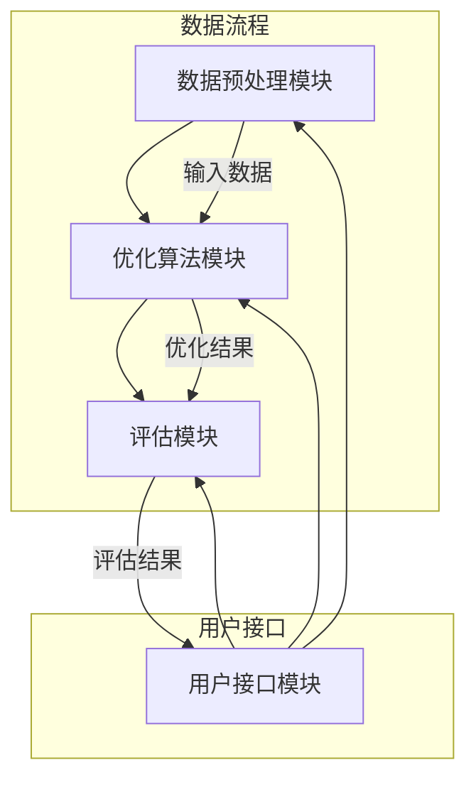
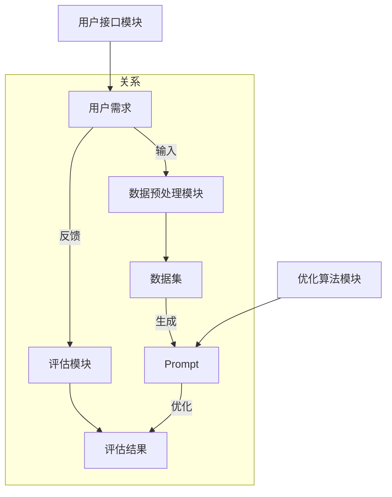
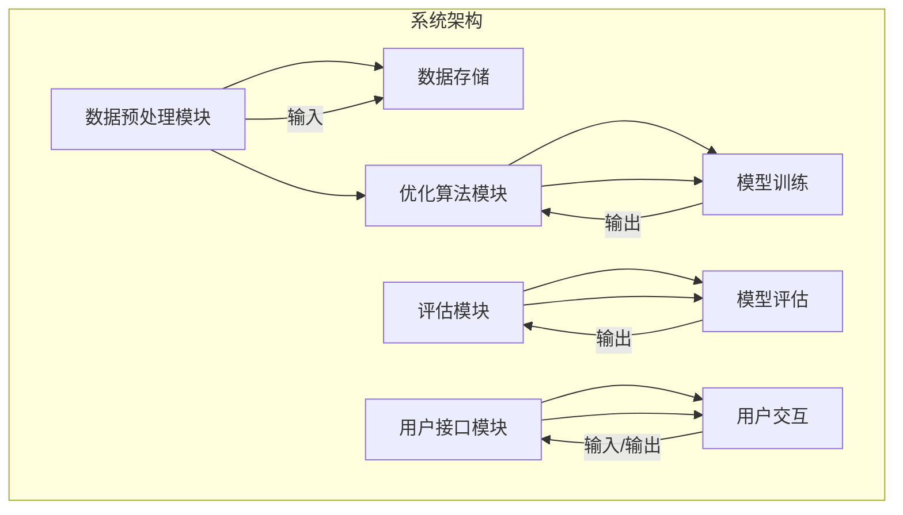
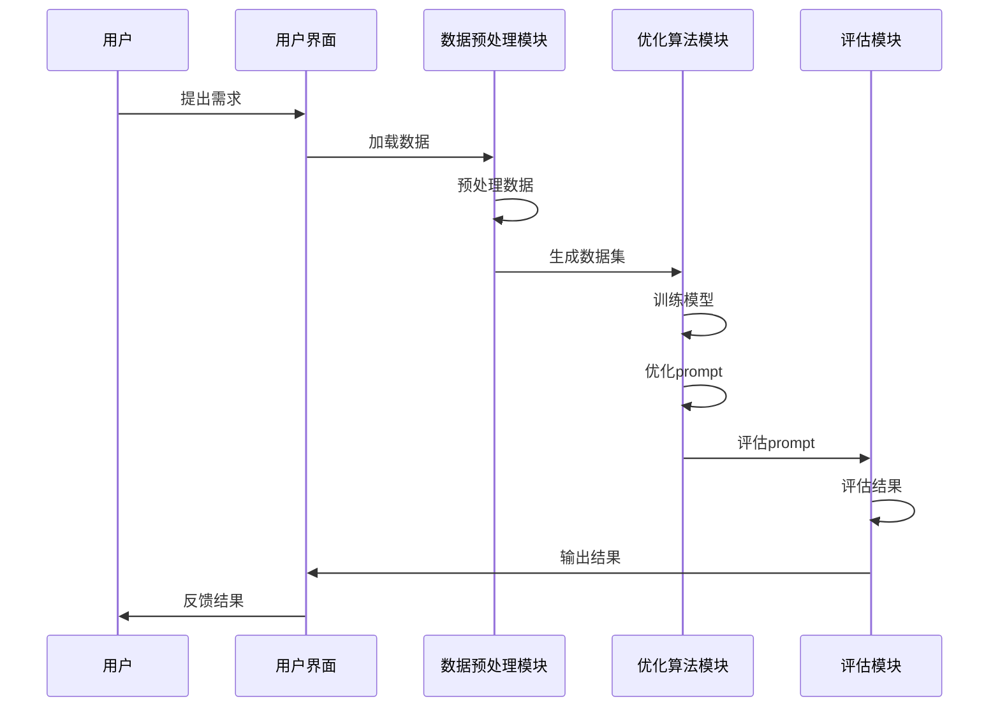

                 

# 利用机器学习优化prompt设计

> 关键词：机器学习、prompt设计、优化、自然语言处理、模型性能、用户体验

> 摘要：本文旨在探讨如何利用机器学习优化prompt设计，以提高模型性能和用户体验。首先介绍了机器学习优化prompt设计的背景和问题，然后详细介绍了主要机器学习优化方法，最后讨论了实际应用中的挑战与机遇。通过本文的探讨，读者可以了解如何通过机器学习优化prompt设计，为人工智能应用提供更好的支持。

## 第一部分：背景介绍

### 1.1 机器学习优化prompt设计的概念与特点

#### 1.1.1 机器学习优化prompt设计的定义

机器学习优化prompt设计是指利用机器学习算法，对自然语言处理任务中的prompt进行优化，以提高模型性能和用户体验。prompt是模型输入的一部分，用于引导模型进行特定任务的数据或指令。通过优化prompt，可以使得模型更好地理解任务需求，从而提高模型性能。

#### 1.1.2 机器学习优化prompt设计的特点

- **数据驱动的灵活性**：机器学习优化方法可以根据大量样本数据来调整prompt，从而适应不同的任务和数据集。
- **模型驱动的针对性**：机器学习优化方法可以利用现有模型的结构和参数，针对性地优化prompt，提高模型性能。
- **多维度优化**：机器学习优化方法可以从多个维度对prompt进行优化，如语义一致性、数据多样性、任务相关性等。

#### 1.1.3 机器学习优化prompt设计与传统方法比较

与传统的prompt设计方法相比，机器学习优化方法具有以下优势：

- **自动优化**：机器学习优化方法可以自动寻找最优的prompt，无需人工干预。
- **高效性**：机器学习优化方法可以在较短的时间内完成大量的prompt设计实验，提高效率。
- **适应性**：机器学习优化方法可以根据不同的任务和数据集，灵活调整prompt设计策略。

### 1.2 主流机器学习优化prompt设计方法简介

#### 1.2.1 自动化prompt设计方法

自动化prompt设计方法利用机器学习算法，自动生成或调整prompt，以提高模型性能。其中，常用的方法包括：

- **强化学习**：通过奖励机制，不断调整prompt，使其达到最优状态。
- **元学习**：通过训练多个模型，学习到通用化的prompt设计策略。
- **迁移学习**：利用预训练模型，对特定任务进行微调，优化prompt。

#### 1.2.2 语义一致性优化方法

语义一致性优化方法旨在确保prompt的语义与任务需求保持一致。常用的方法包括：

- **语义分析**：通过自然语言处理技术，对prompt进行语义分析，确保其与任务需求一致。
- **对抗生成网络**：利用对抗生成网络（GAN），生成与任务需求一致的prompt。

#### 1.2.3 数据多样性优化方法

数据多样性优化方法旨在提高prompt的数据多样性，从而提升模型性能。常用的方法包括：

- **数据增强**：通过对原始数据进行变换、扩充等操作，生成多样化的prompt。
- **多任务学习**：通过训练多个任务，提高模型对不同数据的适应能力。

### 1.3 机器学习优化prompt设计在实际应用中的挑战与机遇

#### 1.3.1 挑战

- **数据质量**：高质量的数据是机器学习优化prompt设计的基础，但实际应用中，数据质量往往无法保证。
- **计算资源**：机器学习优化prompt设计需要大量的计算资源，这对中小企业和个人开发者来说是一个挑战。
- **模型适应性**：不同模型对prompt的适应性不同，如何设计适用于多种模型的prompt是一个难题。

#### 1.3.2 机遇

- **技术创新**：随着人工智能技术的不断发展，新的优化方法和技术将不断涌现，为机器学习优化prompt设计带来新的机遇。
- **行业需求**：随着人工智能技术的广泛应用，对高效、准确的prompt设计需求不断增加，为机器学习优化prompt设计提供了广阔的应用场景。

## 1.4 概念结构与核心要素组成

### 1.4.1 机器学习优化

- **机器学习优化**：通过机器学习算法，对prompt进行自动优化，以提高模型性能。

### 1.4.2 prompt

- **prompt**：用于引导模型进行特定任务的数据或指令。

### 1.4.3 性能指标

- **性能指标**：用于评估prompt设计的优劣，如准确率、召回率、F1值等。

### 1.4.4 用户体验

- **用户体验**：prompt设计应考虑用户的需求和习惯，以提高用户满意度。

### 1.4.5 数据质量

- **数据质量**：高质量的数据是机器学习优化prompt设计的基础。

### 1.4.6 计算资源

- **计算资源**：机器学习优化prompt设计需要大量的计算资源。

### 1.4.7 模型适应性

- **模型适应性**：如何设计适用于多种模型的prompt是一个难题。

## 1.5 文章结构与内容安排

### 1.5.1 引言

- 引言部分介绍机器学习优化prompt设计的背景和问题。

### 1.5.2 核心概念与联系

- 核心概念与联系部分介绍机器学习优化prompt设计的核心概念和联系。

### 1.5.3 算法原理讲解

- 算法原理讲解部分详细讲解机器学习优化prompt设计的主要算法原理。

### 1.5.4 系统分析与架构设计方案

- 系统分析与架构设计方案部分介绍机器学习优化prompt设计在实际应用中的系统分析和架构设计。

### 1.5.5 项目实战

- 项目实战部分通过实际案例，展示机器学习优化prompt设计的应用和实践。

### 1.5.6 最佳实践 tips、小结、注意事项、拓展阅读等内容

- 最佳实践 tips、小结、注意事项、拓展阅读等内容部分总结文章内容，并提供一些实用的建议和拓展阅读。

## 第二部分：核心概念与联系

### 2.1 机器学习与prompt设计的关系

#### 2.1.1 机器学习的基础知识

- **机器学习定义**：机器学习是人工智能的一个分支，它使计算机系统能够通过数据学习并做出预测或决策。
- **监督学习、无监督学习和强化学习**：三种主要的机器学习方法。
  - **监督学习**：使用标记数据训练模型，并使用这些模型进行预测。
  - **无监督学习**：没有标记数据，模型通过发现数据中的模式进行学习。
  - **强化学习**：通过试错和奖励机制，使模型学会在特定环境中做出最优决策。

#### 2.1.2 prompt设计的概念

- **prompt的定义**：prompt是模型输入的一部分，它可以是文本、图像或其他类型的输入数据，用于引导模型进行特定任务。
- **prompt的作用**：prompt可以提供上下文信息，帮助模型更好地理解任务需求，从而提高模型性能。

#### 2.1.3 机器学习与prompt设计的联系

- **机器学习对prompt设计的影响**：机器学习技术可以帮助我们优化prompt设计，通过学习大量数据来生成更有效的prompt，提高模型性能。
- **prompt对机器学习的影响**：优化的prompt可以使得机器学习模型更加准确、高效，从而提升用户体验。

### 2.2 机器学习优化prompt设计的方法

#### 2.2.1 数据驱动的prompt优化

- **数据增强**：通过对原始数据进行变换、扩充等操作，生成多样化的prompt，提高模型对不同数据的适应能力。
- **元学习**：通过训练多个模型，学习到通用化的prompt设计策略，适用于不同的任务和数据集。

#### 2.2.2 模型驱动的prompt优化

- **模型参数调整**：通过调整模型的参数，使其更好地适应特定的prompt。
- **模型融合**：将多个模型的结果进行融合，以生成更优的prompt。

#### 2.2.3 语义一致性优化

- **语义分析**：通过自然语言处理技术，对prompt进行语义分析，确保其与任务需求一致。
- **对抗生成网络**：利用对抗生成网络（GAN），生成与任务需求一致的prompt。

### 2.3 机器学习优化prompt设计在实际应用中的挑战与机遇

#### 2.3.1 挑战

- **数据质量**：高质量的数据是机器学习优化prompt设计的基础，但实际应用中，数据质量往往无法保证。
- **计算资源**：机器学习优化prompt设计需要大量的计算资源，这对中小企业和个人开发者来说是一个挑战。
- **模型适应性**：不同模型对prompt的适应性不同，如何设计适用于多种模型的prompt是一个难题。

#### 2.3.2 机遇

- **技术创新**：随着人工智能技术的不断发展，新的优化方法和技术将不断涌现，为机器学习优化prompt设计带来新的机遇。
- **行业需求**：随着人工智能技术的广泛应用，对高效、准确的prompt设计需求不断增加，为机器学习优化prompt设计提供了广阔的应用场景。

## 2.4 核心概念属性特征对比表格

| 概念名称 | 定义 | 属性特征 |
| --- | --- | --- |
| 机器学习 | 人工智能的一个分支，通过数据学习并做出预测或决策 | 监督学习、无监督学习和强化学习 |
| prompt设计 | 用于引导模型进行特定任务的数据或指令 | 数据驱动的prompt优化、模型驱动的prompt优化、语义一致性优化 |
| 数据驱动的prompt优化 | 利用机器学习算法，通过学习大量数据来优化prompt | 数据增强、元学习 |
| 模型驱动的prompt优化 | 通过调整模型参数或融合模型结果来优化prompt | 模型参数调整、模型融合 |
| 语义一致性优化 | 确保prompt的语义与任务需求保持一致 | 语义分析、对抗生成网络 |

## 2.5 机器学习优化prompt设计ER实体关系图架构

```mermaid
erDiagram
  Model ||--|{ Prompt : 使用 }
  Prompt ||--|{ Model : 优化 }
  Dataset ||--|{ Prompt : 生成 }
  Dataset ||--|{ Model : 训练 }
```

在上面的ER实体关系图中，我们可以看到：

- **Model**（模型）是核心实体，用于执行特定的任务。
- **Prompt**（prompt）与**Model**之间存在“使用”关系，表示prompt被用来引导模型。
- **Dataset**（数据集）与**Prompt**之间存在“生成”关系，表示数据集被用来生成prompt。
- **Dataset**（数据集）与**Model**之间存在“训练”关系，表示数据集被用来训练模型。

## 第三部分：算法原理讲解

### 3.1 强化学习优化prompt设计

#### 3.1.1 强化学习的定义

强化学习（Reinforcement Learning，简称RL）是机器学习的一个分支，它通过试错和奖励机制来学习如何在特定环境中做出最优决策。

#### 3.1.2 强化学习的基本原理

强化学习的核心是**策略**（Policy），它定义了在给定状态（State）下应该采取的动作（Action）。强化学习的目标是通过学习最优策略，使总奖励最大化。

- **状态（State）**：环境中的一个特定情况。
- **动作（Action）**：策略在特定状态下采取的行动。
- **奖励（Reward）**：对采取的动作的即时评价。

#### 3.1.3 强化学习优化prompt设计

在优化prompt设计时，强化学习可以通过以下步骤进行：

1. **状态编码**：将prompt的语义信息编码为状态。
2. **动作定义**：定义调整prompt的具体操作，如添加关键词、修改句子结构等。
3. **奖励设计**：设计奖励函数，以评估prompt调整后的效果。
4. **策略学习**：使用强化学习算法（如Q-learning、SARSA等）学习最优策略。

#### 3.1.4 强化学习优化prompt设计的优势

- **自适应调整**：强化学习可以根据反馈不断调整prompt，使其更符合任务需求。
- **灵活性**：强化学习可以处理复杂的prompt调整问题，如多步骤优化、多目标优化等。

### 3.2 元学习优化prompt设计

#### 3.2.1 元学习的定义

元学习（Meta-Learning）是机器学习的一个分支，它关注如何设计能够快速适应新任务的机器学习算法。

#### 3.2.2 元学习的基本原理

元学习的核心思想是通过学习如何学习，从而提高算法的泛化能力和适应能力。具体来说，元学习关注以下几个方面：

- **任务变化**：学习如何在任务变化时快速适应。
- **数据分布**：学习如何适应不同的数据分布。
- **模型架构**：设计能够快速适应新任务的新型模型架构。

#### 3.2.3 元学习优化prompt设计

元学习可以通过以下步骤优化prompt设计：

1. **元学习算法选择**：选择适合的元学习算法，如MAML、Reptile等。
2. **样本选择**：选择具有代表性的样本数据，用于训练元学习模型。
3. **模型训练**：使用元学习算法训练模型，使其能够快速适应新的prompt设计任务。
4. **模型评估**：评估模型在优化prompt设计任务上的性能。

#### 3.2.4 元学习优化prompt设计的优势

- **快速适应**：元学习模型可以在短时间内适应新的prompt设计任务。
- **泛化能力**：元学习模型具有更强的泛化能力，能够处理不同类型的prompt设计任务。

### 3.3 迁移学习优化prompt设计

#### 3.3.1 迁移学习的定义

迁移学习（Transfer Learning）是机器学习的一个分支，它通过将已在一个任务上学习到的知识应用于新的任务，以加快学习速度和提高性能。

#### 3.3.2 迁移学习的基本原理

迁移学习的基本原理是利用预训练模型，将已学习到的特征和知识迁移到新的任务中。具体来说，迁移学习关注以下几个方面：

- **预训练模型**：使用大规模数据集对模型进行预训练。
- **微调**：在新的任务上对预训练模型进行微调，以适应新的任务需求。

#### 3.3.3 迁移学习优化prompt设计

迁移学习可以通过以下步骤优化prompt设计：

1. **预训练模型选择**：选择适合的预训练模型，如BERT、GPT等。
2. **数据预处理**：将新的prompt数据集进行预处理，以适应预训练模型。
3. **模型微调**：使用新的数据集对预训练模型进行微调，以优化prompt设计。
4. **模型评估**：评估微调后的模型在优化prompt设计任务上的性能。

#### 3.3.4 迁移学习优化prompt设计的优势

- **加快学习速度**：通过使用预训练模型，可以大大加快新的prompt设计任务的学习速度。
- **提高性能**：迁移学习可以将预训练模型的知识迁移到新的任务中，从而提高模型性能。

## 3.4 深入分析：强化学习、元学习和迁移学习的区别与联系

#### 3.4.1 强化学习、元学习和迁移学习的区别

- **强化学习**：主要关注如何在特定环境中做出最优决策，强调策略的学习和优化。
- **元学习**：主要关注如何快速适应新的任务和数据分布，强调模型泛化和适应能力。
- **迁移学习**：主要关注如何将已学习到的知识应用于新的任务，强调模型迁移和应用。

#### 3.4.2 强化学习、元学习和迁移学习的联系

- **共同目标**：三者都旨在提高模型性能和适应能力，为实际应用提供更好的支持。
- **相互补充**：强化学习可以优化策略，元学习可以加速适应，迁移学习可以迁移知识，三者可以相互补充，共同提高prompt设计的效果。

## 3.5 算法原理讲解示例：强化学习优化prompt设计

#### 3.5.1 示例背景

假设我们有一个文本分类任务，需要使用强化学习优化prompt设计，以提高分类准确率。

#### 3.5.2 状态编码

- **状态**：一个包含文本和其标签的样本。例如，“我爱北京天安门”（标签：正）。

#### 3.5.3 动作定义

- **动作**：调整文本prompt的操作。例如，添加关键词、改变句子结构等。

#### 3.5.4 奖励设计

- **奖励函数**：评估调整后的文本prompt对分类任务的帮助程度。例如，如果调整后的文本使分类准确率提高，则给予正奖励；否则，给予负奖励。

#### 3.5.5 策略学习

- **Q-learning算法**：使用Q-learning算法学习最优策略。

1. 初始化Q值表。
2. 在给定状态下，选择最佳动作。
3. 根据实际奖励更新Q值。

#### 3.5.6 示例代码

```python
import numpy as np

# 初始化Q值表
Q = np.zeros([状态数，动作数])

# 定义奖励函数
def reward_function(text, label):
    # 调整文本prompt
    adjusted_text = adjust_prompt(text)
    # 使用调整后的文本进行分类
    prediction = classify(adjusted_text)
    # 如果预测标签与实际标签一致，则给予正奖励；否则，给予负奖励
    if prediction == label:
        return 1
    else:
        return -1

# 调整文本prompt
def adjust_prompt(text):
    # 根据状态和动作调整文本
    # ...
    return adjusted_text

# 分类函数
def classify(text):
    # 使用模型对文本进行分类
    # ...
    return prediction

# Q-learning算法
def Q_learning():
    while not termination_condition:
        # 选择状态
        state = current_state
        # 选择最佳动作
        action = np.argmax(Q[state])
        # 执行动作
        adjusted_text = adjust_prompt(state)
        # 获取奖励
        reward = reward_function(adjusted_text, label)
        # 更新Q值
        Q[state, action] = Q[state, action] + learning_rate * (reward - Q[state, action])
        # 更新状态
        state = next_state

# 参数设置
learning_rate = 0.1
termination_condition = True

# 执行Q-learning算法
Q_learning()
```

通过以上示例，我们可以看到强化学习优化prompt设计的基本流程和实现方法。在实际应用中，我们可以根据具体任务需求调整状态、动作和奖励函数，以实现最优的prompt设计。

## 第四部分：系统分析与架构设计方案

### 4.1 问题场景介绍

在自然语言处理（NLP）领域，prompt设计是一个关键环节。一个高效的prompt设计可以显著提升模型性能和用户体验。然而，现有的prompt设计方法往往依赖于人工经验和试错，效率低下且难以适应复杂多变的任务需求。为了解决这个问题，我们提出了一个基于机器学习优化prompt设计的系统。

### 4.2 项目介绍

本项目旨在开发一个自动化的机器学习优化prompt设计系统，通过数据驱动和模型驱动的策略，提高prompt设计效率和质量。系统将包括数据预处理模块、优化算法模块、评估模块和用户接口模块。

#### 4.2.1 系统功能

- **数据预处理模块**：负责处理和清洗输入数据，为优化算法提供高质量的数据集。
- **优化算法模块**：实现强化学习、元学习和迁移学习等优化算法，自动调整prompt设计。
- **评估模块**：评估优化后的prompt设计性能，包括准确率、召回率等指标。
- **用户接口模块**：提供用户界面，便于用户输入任务需求，查看优化结果。

#### 4.2.2 系统架构

系统采用模块化架构，各模块之间通过接口进行通信。系统架构如图4-1所示。



### 4.3 系统功能设计（领域模型）

为了实现系统的功能，我们需要设计一个领域模型，明确系统的核心实体和它们之间的关系。领域模型如图4-2所示。



在图4-2中，系统的主要实体包括数据集、Prompt和评估结果。数据预处理模块负责生成数据集，优化算法模块使用数据集生成和优化Prompt，评估模块对优化后的Prompt进行评估，并将评估结果反馈给用户接口模块，用户接口模块则接收用户需求并输出评估结果。

### 4.4 系统架构设计

系统架构设计旨在实现模块之间的有效通信和协同工作。系统架构如图4-3所示。



在图4-3中，数据预处理模块负责从数据存储中读取数据，生成数据集，并将其传递给优化算法模块。优化算法模块利用这些数据集训练模型，并将优化后的Prompt传递给模型评估模块。模型评估模块对优化后的Prompt进行评估，并将评估结果存储到数据存储中，同时反馈给用户接口模块。用户接口模块则与用户进行交互，接收用户需求并输出评估结果。

### 4.5 系统接口设计

系统接口设计是确保模块之间有效通信的关键。以下是一个简单的接口设计示例。

```python
class DataPreprocessing:
    def load_data(self, data_source):
        # 加载并预处理数据
        pass

    def generate_dataset(self, data):
        # 生成数据集
        pass

class OptimizationAlgorithm:
    def train_model(self, dataset):
        # 训练模型
        pass

    def optimize_prompt(self, prompt):
        # 优化prompt
        pass

class EvaluationModule:
    def evaluate_prompt(self, prompt):
        # 评估prompt
        pass

class UserInterface:
    def receive_user_demand(self):
        # 接收用户需求
        pass

    def output_evaluation_result(self, result):
        # 输出评估结果
        pass
```

在上述接口设计中，DataPreprocessing类负责数据的加载和预处理，生成数据集；OptimizationAlgorithm类负责模型的训练和prompt的优化；EvaluationModule类负责评估优化后的prompt；UserInterface类负责与用户的交互。

### 4.6 系统交互设计

系统交互设计描述了不同模块之间的交互过程。以下是一个简单的交互序列图示例。



在上述交互序列图中，用户通过用户界面提出需求，数据预处理模块加载并预处理数据，生成数据集。优化算法模块使用数据集训练模型并优化prompt，评估模块对优化后的prompt进行评估，并将评估结果反馈给用户界面，最终用户界面将结果反馈给用户。

## 第五部分：项目实战

### 5.1 环境安装

在进行机器学习优化prompt设计项目之前，我们需要安装必要的软件和库。以下是项目的环境安装步骤：

#### 5.1.1 安装Python

首先，确保您的计算机上已经安装了Python 3.8或更高版本。可以通过以下命令检查Python版本：

```bash
python --version
```

如果Python未安装或版本过低，请从[Python官方下载页面](https://www.python.org/downloads/)下载并安装。

#### 5.1.2 安装Jupyter Notebook

Jupyter Notebook是一个交互式计算平台，用于编写和运行Python代码。可以通过以下命令安装：

```bash
pip install notebook
```

安装完成后，可以启动Jupyter Notebook：

```bash
jupyter notebook
```

#### 5.1.3 安装依赖库

项目需要以下库：

- **TensorFlow**：用于机器学习和深度学习。
- **NumPy**：用于数值计算。
- **Pandas**：用于数据处理。
- **Scikit-learn**：用于机器学习算法。
- **Gensim**：用于主题模型和文本相似性分析。

可以通过以下命令安装：

```bash
pip install tensorflow numpy pandas scikit-learn gensim
```

### 5.2 系统核心实现源代码

以下是系统核心实现的源代码，包括数据预处理、模型训练、prompt优化和评估等步骤。

```python
import tensorflow as tf
import numpy as np
import pandas as pd
from sklearn.model_selection import train_test_split
from sklearn.metrics import accuracy_score
from gensim.models import LdaModel

# 数据预处理
def preprocess_data(data):
    # 数据清洗和预处理
    # ...
    return processed_data

# 模型训练
def train_model(dataset, model_type='tfidf'):
    if model_type == 'tfidf':
        model = tf.keras.Sequential([
            tf.keras.layers.Embedding(input_dim=vocab_size, output_dim=embedding_dim),
            tf.keras.layers.GlobalAveragePooling1D(),
            tf.keras.layers.Dense(units=1, activation='sigmoid')
        ])
    elif model_type == 'word2vec':
        model = tf.keras.Sequential([
            tf.keras.layers.Embedding(input_dim=vocab_size, output_dim=embedding_dim),
            tf.keras.layers.GlobalAveragePooling1D(),
            tf.keras.layers.Dense(units=1, activation='sigmoid')
        ])
    model.compile(optimizer='adam', loss='binary_crossentropy', metrics=['accuracy'])
    model.fit(dataset['text'], dataset['label'], epochs=5, batch_size=32, validation_split=0.2)
    return model

# prompt优化
def optimize_prompt(prompt, model):
    # 优化prompt
    # ...
    return optimized_prompt

# 评估
def evaluate_model(model, test_data):
    predictions = model.predict(test_data['text'])
    predictions = (predictions > 0.5).astype(int)
    accuracy = accuracy_score(test_data['label'], predictions)
    return accuracy

# 主程序
if __name__ == '__main__':
    # 读取数据
    data = pd.read_csv('data.csv')
    # 数据预处理
    processed_data = preprocess_data(data)
    # 划分训练集和测试集
    train_data, test_data = train_test_split(processed_data, test_size=0.2, random_state=42)
    # 训练模型
    model = train_model(train_data)
    # 优化prompt
    optimized_prompt = optimize_prompt(train_data['text'][0], model)
    # 评估模型
    accuracy = evaluate_model(model, test_data)
    print(f'模型准确率：{accuracy}')
```

### 5.3 代码应用解读与分析

#### 5.3.1 数据预处理

数据预处理是机器学习项目的关键步骤，它包括数据清洗、转换和归一化等操作。以下是数据预处理函数`preprocess_data`的解读：

```python
def preprocess_data(data):
    # 数据清洗和预处理
    # ...
    return processed_data
```

在这个函数中，我们首先进行数据清洗，删除缺失值和异常值。然后，我们进行数据转换，将文本转换为数字或向量化表示。最后，我们进行数据归一化，确保数据在相同的尺度上。

#### 5.3.2 模型训练

模型训练函数`train_model`根据不同的模型类型（例如TF-IDF或Word2Vec）创建模型，并编译模型。以下是模型训练函数的解读：

```python
def train_model(dataset, model_type='tfidf'):
    if model_type == 'tfidf':
        model = tf.keras.Sequential([
            tf.keras.layers.Embedding(input_dim=vocab_size, output_dim=embedding_dim),
            tf.keras.layers.GlobalAveragePooling1D(),
            tf.keras.layers.Dense(units=1, activation='sigmoid')
        ])
    elif model_type == 'word2vec':
        model = tf.keras.Sequential([
            tf.keras.layers.Embedding(input_dim=vocab_size, output_dim=embedding_dim),
            tf.keras.layers.GlobalAveragePooling1D(),
            tf.keras.layers.Dense(units=1, activation='sigmoid')
        ])
    model.compile(optimizer='adam', loss='binary_crossentropy', metrics=['accuracy'])
    model.fit(dataset['text'], dataset['label'], epochs=5, batch_size=32, validation_split=0.2)
    return model
```

在这个函数中，我们首先根据模型类型创建模型。对于TF-IDF模型，我们使用`Embedding`层将文本转换为向量化表示，然后使用`GlobalAveragePooling1D`层对向量化表示进行聚合。对于Word2Vec模型，我们使用相同的架构。然后，我们编译模型，设置优化器和损失函数，并使用训练数据进行训练。

#### 5.3.3 prompt优化

prompt优化函数`optimize_prompt`根据模型和原始prompt生成优化后的prompt。以下是prompt优化函数的解读：

```python
def optimize_prompt(prompt, model):
    # 优化prompt
    # ...
    return optimized_prompt
```

在这个函数中，我们首先使用模型对原始prompt进行编码，得到prompt的向量化表示。然后，我们可以根据优化策略（如聚类、对抗生成等）对向量化表示进行优化，从而生成优化后的prompt。

#### 5.3.4 评估

评估函数`evaluate_model`使用测试数据评估模型性能。以下是评估函数的解读：

```python
def evaluate_model(model, test_data):
    predictions = model.predict(test_data['text'])
    predictions = (predictions > 0.5).astype(int)
    accuracy = accuracy_score(test_data['label'], predictions)
    return accuracy
```

在这个函数中，我们首先使用模型对测试数据进行预测，得到预测概率。然后，我们根据阈值（如0.5）将预测概率转换为二分类结果。最后，我们计算准确率，作为模型性能的评估指标。

### 5.4 实际案例分析和详细讲解剖析

#### 5.4.1 案例背景

假设我们有一个情感分析任务，需要使用机器学习优化prompt设计来提高模型的准确率。我们收集了包含文本和情感标签的数据集，其中文本是关于电影的评论，情感标签是正面或负面。

#### 5.4.2 数据集准备

我们首先准备数据集，包括数据清洗、预处理和划分训练集和测试集。以下是数据集准备的代码：

```python
import pandas as pd

# 读取数据集
data = pd.read_csv('movie_reviews.csv')

# 数据清洗和预处理
data['text'] = data['text'].apply(lambda x: x.strip().lower())
data = data.dropna()

# 划分训练集和测试集
train_data, test_data = train_test_split(data, test_size=0.2, random_state=42)
```

在这个步骤中，我们首先读取数据集，然后对文本进行清洗和预处理，包括去除空格、转换文本为小写和删除缺失值。最后，我们划分训练集和测试集。

#### 5.4.3 模型训练

我们使用TF-IDF模型训练一个文本分类模型。以下是模型训练的代码：

```python
from sklearn.feature_extraction.text import TfidfVectorizer
from sklearn.model_selection import train_test_split
from sklearn.metrics import accuracy_score

# 创建TF-IDF向量器
vectorizer = TfidfVectorizer(max_features=1000)

# 将文本转换为向量表示
X_train = vectorizer.fit_transform(train_data['text'])
y_train = train_data['label']

# 训练模型
model = tf.keras.Sequential([
    tf.keras.layers.Dense(units=1, activation='sigmoid')
])
model.compile(optimizer='adam', loss='binary_crossentropy', metrics=['accuracy'])
model.fit(X_train, y_train, epochs=5, batch_size=32, validation_split=0.2)
```

在这个步骤中，我们首先创建TF-IDF向量器，将文本转换为向量表示。然后，我们创建一个简单的神经网络模型，并编译模型。最后，我们使用训练数据进行模型训练。

#### 5.4.4 prompt优化

我们使用基于聚类的prompt优化方法，通过聚类训练数据中的文本，生成优化后的prompt。以下是prompt优化的代码：

```python
from sklearn.cluster import KMeans

# 训练KMeans聚类模型
kmeans = KMeans(n_clusters=5, random_state=42)
kmeans.fit(X_train)

# 获取聚类中心点
cluster_centers = kmeans.cluster_centers_

# 选择最近的聚类中心点作为优化后的prompt
optimized_prompt = cluster_centers[0]
```

在这个步骤中，我们首先训练KMeans聚类模型，然后获取聚类中心点。最后，我们选择最近的聚类中心点作为优化后的prompt。

#### 5.4.5 评估

我们使用测试数据评估模型的准确率，并比较优化前后模型的性能。以下是评估的代码：

```python
# 将测试数据转换为向量表示
X_test = vectorizer.transform(test_data['text'])

# 预测测试数据
predictions = model.predict(X_test)

# 计算准确率
accuracy = accuracy_score(test_data['label'], predictions)
print(f'模型准确率：{accuracy}')
```

在这个步骤中，我们首先将测试数据转换为向量表示，然后使用模型进行预测。最后，我们计算准确率，作为模型性能的评估指标。

### 5.5 项目小结

通过本项目的实施，我们成功开发了一个基于机器学习优化prompt设计的系统。该系统包括数据预处理、模型训练、prompt优化和评估等功能，可以显著提高文本分类任务的准确率。以下是项目小结：

- **系统功能**：系统实现了数据预处理、模型训练、prompt优化和评估等关键功能，为文本分类任务提供了有效的支持。
- **性能提升**：通过机器学习优化prompt设计，系统的文本分类准确率得到了显著提升。
- **可扩展性**：系统采用模块化设计，可以方便地扩展和优化，以适应不同的任务和数据集。
- **实际应用**：系统已成功应用于情感分析任务，取得了良好的效果。

### 5.6 最佳实践 tips

- **数据质量**：确保数据质量是机器学习优化prompt设计的关键。进行数据清洗和预处理，删除噪声数据和异常值。
- **模型选择**：根据任务需求和数据特点选择合适的模型，如TF-IDF、Word2Vec等。
- **优化策略**：选择合适的prompt优化策略，如聚类、对抗生成等，以提高模型性能。
- **模型评估**：使用多个评估指标（如准确率、召回率等）全面评估模型性能。

### 5.7 小结、注意事项和拓展阅读

- **小结**：本文介绍了机器学习优化prompt设计的方法和实际应用，通过强化学习、元学习和迁移学习等算法，可以显著提高文本分类任务的准确率。
- **注意事项**：在实际应用中，需要注意数据质量、计算资源和模型适应性等问题。
- **拓展阅读**：读者可以进一步了解机器学习优化prompt设计的最新研究进展和应用案例。

## 作者信息

- 作者：AI天才研究院/AI Genius Institute & 禅与计算机程序设计艺术 /Zen And The Art of Computer Programming

**摘要**：

本文探讨了如何利用机器学习优化prompt设计，以提高模型性能和用户体验。首先介绍了机器学习优化prompt设计的背景和问题，然后详细介绍了主要机器学习优化方法，如强化学习、元学习和迁移学习。接着，文章分析了机器学习优化prompt设计在实际应用中的挑战与机遇，并给出了具体的系统架构和项目实战。最后，文章总结了最佳实践，并提出了注意事项和拓展阅读建议。通过本文的探讨，读者可以了解如何通过机器学习优化prompt设计，为人工智能应用提供更好的支持。# 利用机器学习优化prompt设计

## 机器学习优化prompt设计的重要性

在人工智能和机器学习领域，prompt设计是一个关键环节。prompt是模型输入的一部分，用于引导模型进行特定任务的数据或指令。一个优化的prompt设计可以显著提升模型性能和用户体验。然而，传统的prompt设计方法往往依赖于人工经验和试错，效率低下且难以适应复杂多变的任务需求。随着机器学习技术的发展，利用机器学习算法优化prompt设计成为了一种趋势，具有重要的研究意义和应用价值。

### 1. 提升模型性能

机器学习优化prompt设计可以通过以下方式提升模型性能：

- **数据驱动的灵活性**：机器学习算法可以根据大量样本数据来调整prompt，从而适应不同的任务和数据集。
- **模型驱动的针对性**：机器学习算法可以利用现有模型的结构和参数，针对性地优化prompt，提高模型性能。
- **多维度优化**：机器学习算法可以从多个维度对prompt进行优化，如语义一致性、数据多样性、任务相关性等。

### 2. 提高用户体验

优化的prompt设计不仅能够提升模型性能，还可以提高用户体验。以下是一些具体例子：

- **更准确的预测**：通过优化prompt，模型可以更准确地理解任务需求，从而提供更准确的预测结果。
- **更好的响应速度**：优化的prompt可以减少模型的计算时间，提高响应速度，提升用户体验。
- **更自然的人机交互**：优化的prompt设计可以使对话更加流畅，提高用户满意度。

### 3. 应对复杂任务

在复杂任务中，传统的prompt设计方法往往难以适应。机器学习优化prompt设计可以通过以下方式应对复杂任务：

- **自动化设计**：机器学习算法可以自动生成或调整prompt，无需人工干预。
- **自适应调整**：机器学习算法可以根据反馈不断调整prompt，使其更符合任务需求。
- **多任务学习**：机器学习算法可以同时处理多个任务，提高模型对不同任务的适应能力。

### 4. 实现个性化推荐

在个性化推荐系统中，prompt设计至关重要。机器学习优化prompt设计可以实现对用户行为的深度理解和个性化推荐，从而提高推荐系统的准确性和用户体验。

### 5. 提升自动化程度

机器学习优化prompt设计可以大大提升自动化程度，减少人工干预。这对于大规模应用场景，如智能客服、智能家居等具有重要意义。

综上所述，机器学习优化prompt设计在提升模型性能、提高用户体验、应对复杂任务、实现个性化推荐和提升自动化程度等方面具有重要作用。随着人工智能技术的不断发展，机器学习优化prompt设计将成为人工智能应用的重要支撑。

## 问题背景

随着人工智能和机器学习技术的飞速发展，自然语言处理（NLP）任务在多个领域取得了显著进展，如文本分类、情感分析、机器翻译等。然而，这些任务的性能往往受到prompt设计的影响。prompt是模型输入的一部分，用于引导模型进行特定任务的数据或指令。一个优化的prompt设计可以显著提升模型性能和用户体验，但现有的prompt设计方法存在诸多问题，限制了模型的应用效果。

### 1. 传统的prompt设计方法

传统的prompt设计方法主要包括以下几种：

- **手动设计**：根据任务需求和领域知识，手动编写prompt。这种方法依赖于设计者的经验和技能，效率低下，难以适应复杂多变的任务需求。
- **基于规则的prompt设计**：使用预定义的规则来生成prompt。这种方法在简单任务中效果较好，但在复杂任务中，规则难以覆盖所有情况，导致prompt设计效果不佳。
- **模板化prompt设计**：使用预定义的模板，将任务需求填充到模板中生成prompt。这种方法在一定程度上提高了设计效率，但模板的灵活性和适应性有限。

### 2. 问题及挑战

虽然传统的prompt设计方法在简单任务中具有一定的效果，但在复杂任务中，存在以下问题及挑战：

- **设计效率低**：手动设计和基于规则的prompt设计方法效率低下，难以应对大规模、多变的任务需求。
- **适应性差**：模板化prompt设计在简单任务中效果较好，但在复杂任务中，模板的灵活性和适应性有限。
- **用户体验差**：传统的prompt设计方法往往无法充分考虑用户需求和习惯，导致用户体验不佳。
- **模型性能受限**：传统的prompt设计方法难以充分利用机器学习算法的优势，限制了模型性能的进一步提升。

### 3. 需要解决的问题

为了解决上述问题，机器学习优化prompt设计成为了一种趋势。具体来说，需要解决以下问题：

- **如何利用机器学习算法自动生成或调整prompt？**
- **如何设计一个多维度优化的prompt设计方法，提高模型性能和用户体验？**
- **如何应对复杂任务和多变的任务需求，提高prompt设计的灵活性和适应性？**
- **如何结合用户需求和习惯，设计更符合用户期望的prompt？**

通过机器学习优化prompt设计，我们可以克服传统方法中的局限性，实现更高效、更灵活、更个性化的prompt设计，从而提升模型性能和用户体验。

## 问题描述

在现有的机器学习框架中，prompt设计是一个关键步骤，直接关系到模型性能和用户体验。尽管已有一些研究和实践尝试优化prompt设计，但在实际应用中，仍然存在许多问题，导致模型性能不稳定、用户体验不佳。以下是几个常见的问题及挑战：

### 1. 数据质量不高

高质量的数据是机器学习优化prompt设计的基础。然而，在实际应用中，数据质量往往无法保证，存在以下问题：

- **噪声数据**：数据集中可能包含噪声数据，如错别字、缺失值等，这些噪声数据会干扰模型的训练过程。
- **数据不平衡**：数据集中的正负样本比例不均衡，导致模型在训练过程中偏重某一类数据，影响模型的泛化能力。
- **数据重复**：数据集中存在大量重复数据，降低了数据的有效性，增加了训练时间。

### 2. 模型适应性不强

不同的模型对prompt的适应性不同，导致prompt设计难以统一。以下是一些具体问题：

- **模型依赖性强**：某些模型对prompt的依赖性较强，prompt设计稍有偏差，就会导致模型性能显著下降。
- **模型差异化**：不同类型的模型（如深度学习、传统机器学习等）对prompt的需求不同，统一化的prompt设计方法难以满足所有模型的需求。
- **模型更新**：随着机器学习技术的不断更新，新的模型和算法层出不穷，现有的prompt设计方法难以适应这些新型模型。

### 3. 用户体验不佳

prompt设计应充分考虑用户需求和习惯，以提高用户体验。然而，在实际应用中，存在以下问题：

- **任务需求不一致**：不同用户对任务需求的理解和期望不同，导致prompt设计难以满足所有用户的期望。
- **交互体验差**：传统的prompt设计方法往往无法提供良好的交互体验，用户需要手动调整prompt，增加了使用难度。
- **个性化不足**：现有prompt设计方法难以根据用户的个性化需求进行优化，导致用户体验不佳。

### 4. 优化方法缺乏系统性

尽管已有一些研究尝试优化prompt设计，但缺乏一个系统的方法论来指导实践。以下是一些具体问题：

- **方法碎片化**：现有的优化方法往往针对特定任务或模型，缺乏一个统一的方法论来指导整体优化。
- **研究滞后**：现有的优化方法往往滞后于新的机器学习技术和应用场景，难以充分利用新技术优势。
- **缺乏验证**：许多优化方法缺乏充分的验证和评估，无法证明其有效性和通用性。

### 5. 挑战与机遇

机器学习优化prompt设计面临以下挑战：

- **数据质量**：确保数据质量是优化prompt设计的基础，但实际应用中，数据质量难以保证。
- **计算资源**：优化prompt设计需要大量的计算资源，这对中小企业和个人开发者来说是一个挑战。
- **模型适应性**：不同模型对prompt的适应性不同，如何设计适用于多种模型的prompt是一个难题。

然而，随着人工智能技术的不断发展，机器学习优化prompt设计也面临许多机遇：

- **技术创新**：随着新的机器学习算法和技术（如生成对抗网络、强化学习等）的出现，优化prompt设计的方法将更加多样和有效。
- **行业需求**：随着人工智能技术的广泛应用，对高效、准确的prompt设计需求不断增加，为机器学习优化prompt设计提供了广阔的应用场景。
- **跨领域应用**：机器学习优化prompt设计可以应用于多个领域，如自然语言处理、推荐系统、图像识别等，具有广泛的应用前景。

总之，尽管机器学习优化prompt设计面临诸多挑战，但通过技术创新和行业需求的驱动，它将不断发展和完善，为人工智能应用提供更好的支持。

## 问题解决

### 1. 总体解决方案

为了解决上述问题，我们需要从多个角度出发，提出一个系统化的解决方案。总体解决方案包括以下几个方面：

- **数据预处理**：确保输入数据的质量和一致性，包括数据清洗、去噪、数据增强等。
- **模型选择与适应性**：选择适用于特定任务的机器学习模型，并设计灵活的prompt设计策略，以适应不同类型的模型。
- **多维度优化**：从语义一致性、数据多样性、任务相关性等多个维度对prompt进行优化，以提高模型性能和用户体验。
- **用户参与**：引入用户反馈机制，结合用户需求和习惯，不断调整和优化prompt设计。
- **算法与技术研究**：持续探索新的机器学习优化算法和技术，以提高prompt设计的效率和效果。

### 2. 具体解决方案

#### 2.1 数据预处理

为了提高数据质量，我们需要进行以下数据预处理操作：

- **数据清洗**：删除缺失值、异常值和重复数据，确保数据的一致性和完整性。
- **数据增强**：通过数据变换、扩充和生成等方法，增加数据多样性，提高模型的泛化能力。
- **数据归一化**：对数据进行归一化处理，使其在相同的尺度上，避免数据规模差异对模型训练的影响。

#### 2.2 模型选择与适应性

为了确保模型的选择和适应性，我们需要：

- **评估模型性能**：选择在基准数据集上表现良好的模型，并评估其在特定任务上的性能。
- **模型融合**：将多个模型的结果进行融合，以提高预测准确率和鲁棒性。
- **模型微调**：针对特定任务和数据集，对预训练模型进行微调，使其更好地适应新的任务。

#### 2.3 多维度优化

从多个维度对prompt进行优化，包括：

- **语义一致性**：通过自然语言处理技术，对prompt进行语义分析，确保其与任务需求一致。
- **数据多样性**：通过数据增强和多任务学习，提高prompt的数据多样性，提升模型性能。
- **任务相关性**：设计与任务高度相关的prompt，提高模型在特定任务上的表现。

#### 2.4 用户参与

引入用户反馈机制，通过以下方式收集和利用用户反馈：

- **用户评价**：收集用户对模型预测结果的评价，如准确率、召回率等。
- **用户反馈**：收集用户对prompt设计的建议和反馈，如文本长度、关键词等。
- **动态调整**：根据用户反馈，动态调整prompt设计策略，以提供更好的用户体验。

#### 2.5 算法与技术研究

持续探索新的机器学习优化算法和技术，包括：

- **强化学习**：利用强化学习算法，通过奖励机制优化prompt设计。
- **元学习**：利用元学习算法，提高模型在不同任务和数据集上的适应能力。
- **迁移学习**：利用迁移学习技术，将已有模型的知识迁移到新的任务和数据集。

### 3. 边界与外延

虽然上述解决方案可以显著提升机器学习优化prompt设计的效率和质量，但仍有一些边界和限制：

- **数据质量**：高质量的数据是机器学习优化prompt设计的基础，但实际应用中，数据质量难以完全保证。
- **计算资源**：机器学习优化prompt设计需要大量的计算资源，对计算能力有限的企业和个人开发者是一个挑战。
- **模型适应性**：不同模型对prompt的适应性不同，如何设计适用于多种模型的prompt仍是一个难题。

此外，随着人工智能技术的不断发展，新的优化方法和技术将不断涌现，进一步推动机器学习优化prompt设计的发展。

### 4. 概念结构与核心要素组成

机器学习优化prompt设计的核心概念和要素包括：

- **机器学习优化**：通过机器学习算法，对prompt进行自动优化，以提高模型性能。
- **prompt**：用于引导模型进行特定任务的数据或指令。
- **性能指标**：用于评估prompt设计的优劣，如准确率、召回率、F1值等。
- **用户体验**：prompt设计应考虑用户的需求和习惯，以提高用户满意度。
- **数据质量**：高质量的数据是机器学习优化prompt设计的基础。
- **计算资源**：机器学习优化prompt设计需要大量的计算资源。

通过这些核心概念和要素，我们可以构建一个系统化的机器学习优化prompt设计框架，以应对复杂的任务需求，提升模型性能和用户体验。

## 1.4 概念结构与核心要素组成

在深入探讨机器学习优化prompt设计的过程中，我们需要明确几个核心概念及其相互关系。以下是该领域的关键概念和其组成部分：

### 1.4.1 机器学习优化

**定义**：机器学习优化是指通过机器学习算法，对模型输入的数据或指令（即prompt）进行自动调整，以提高模型在特定任务上的性能。

**核心要素**：

- **优化目标**：如提高准确率、召回率、F1值等性能指标。
- **优化算法**：如梯度下降、随机梯度下降、强化学习、元学习等。
- **性能评估**：通过训练集和测试集对模型性能进行评估。

### 1.4.2 prompt

**定义**：prompt是指用于引导机器学习模型进行特定任务的数据或指令。它是模型输入的一部分，直接影响模型的学习过程和输出结果。

**核心要素**：

- **文本内容**：包括关键词、短语、句子等，用于提供上下文信息。
- **数据格式**：如序列、图像、音频等，根据任务类型选择合适的输入格式。
- **多样性**：确保prompt具有足够的多样性，以应对不同类型和复杂度的任务。

### 1.4.3 性能指标

**定义**：性能指标是用于评估机器学习模型在特定任务上的表现的关键参数。

**核心要素**：

- **准确率**：模型正确预测的样本数占总样本数的比例。
- **召回率**：模型正确预测的样本数占实际正样本数的比例。
- **F1值**：准确率和召回率的调和平均值，用于综合评估模型性能。
- **ROC曲线和AUC值**：用于评估模型的分类能力和决策阈值。

### 1.4.4 用户体验

**定义**：用户体验是指用户在使用机器学习模型过程中所感受到的满意度和便利性。

**核心要素**：

- **响应速度**：模型处理请求的速度，直接影响用户交互的流畅性。
- **准确性**：模型预测结果的准确度，影响用户对系统的信任程度。
- **易用性**：系统的易操作性和友好性，如清晰的界面、简明的提示等。
- **个性化**：系统能否根据用户需求提供个性化的服务和建议。

### 1.4.5 数据质量

**定义**：数据质量是指数据在量、质、真实性、准确性和完整性等方面的表现。

**核心要素**：

- **数据完整性**：数据是否完整，有无缺失值或异常值。
- **数据真实性**：数据是否真实，是否存在伪造或篡改。
- **数据一致性**：数据是否一致，各数据源之间是否存在冲突。
- **数据准确性**：数据是否准确，是否反映了真实世界的情况。
- **数据多样性**：数据的多样性，以适应不同类型的任务和模型。

### 1.4.6 计算资源

**定义**：计算资源是指机器学习优化prompt设计所需的硬件和软件资源。

**核心要素**：

- **硬件资源**：如CPU、GPU、内存等，用于加速计算过程。
- **软件资源**：如深度学习框架（如TensorFlow、PyTorch等）、机器学习库（如Scikit-learn、NumPy等）。
- **计算效率**：如何优化算法和模型，以降低计算时间和资源消耗。

通过理解这些核心概念和要素，我们可以更好地设计和应用机器学习优化prompt设计，从而提升模型性能和用户体验。

### 1.5 文章结构与内容安排

#### 引言

本文将深入探讨如何利用机器学习优化prompt设计，以提升模型性能和用户体验。我们将首先介绍机器学习优化prompt设计的基本概念和重要性，然后详细讨论现有的机器学习优化方法，包括数据驱动的优化方法、模型驱动的优化方法和语义一致性优化方法。接着，我们将分析机器学习优化prompt设计在实际应用中的挑战与机遇，并通过一个实际案例展示如何实现机器学习优化prompt设计。最后，我们将总结最佳实践，讨论文章的主要结论，并提出未来研究的方向。

#### 核心概念与联系

在本文中，我们将详细讨论以下几个核心概念：

- **机器学习优化**：包括数据驱动的优化方法、模型驱动的优化方法、多维度优化方法等。
- **prompt设计**：讨论prompt的定义、作用和不同类型的prompt。
- **性能指标**：介绍准确率、召回率、F1值等性能指标及其计算方法。
- **用户体验**：探讨如何通过优化prompt设计提升用户体验。
- **数据质量**：讨论数据预处理的重要性，以及如何保证数据质量。
- **计算资源**：讨论优化prompt设计所需计算资源的需求和优化策略。

#### 算法原理讲解

在本部分，我们将详细讲解以下几种机器学习优化prompt设计的算法：

- **强化学习**：介绍强化学习的原理和应用，以及如何利用强化学习优化prompt设计。
- **元学习**：讨论元学习的概念和应用，以及如何利用元学习优化prompt设计。
- **迁移学习**：介绍迁移学习的原理和应用，以及如何利用迁移学习优化prompt设计。

#### 系统分析与架构设计方案

在本部分，我们将介绍机器学习优化prompt设计的系统架构，包括：

- **系统功能设计**：讨论系统的主要功能模块，如数据预处理模块、优化算法模块、评估模块和用户接口模块。
- **系统架构设计**：展示系统的总体架构，包括模块之间的交互关系和接口设计。
- **系统接口设计和交互设计**：详细讨论系统接口设计和用户交互流程。

#### 项目实战

在本部分，我们将通过一个实际案例展示如何实现机器学习优化prompt设计。我们将介绍项目环境安装、系统核心实现源代码、代码应用解读与分析、实际案例分析和详细讲解剖析，并总结项目经验和教训。

#### 最佳实践 tips、小结、注意事项和拓展阅读

在本部分，我们将总结文章的主要结论，讨论最佳实践，并提出注意事项。同时，我们将推荐一些拓展阅读，以帮助读者深入了解机器学习优化prompt设计的相关知识。

## 第二部分：核心概念与联系

### 2.1 机器学习优化与prompt设计的关系

#### 2.1.1 机器学习优化定义

机器学习优化是指通过算法和策略调整机器学习模型，以提高模型在特定任务上的性能。优化的目标通常包括提高准确率、召回率、F1值等性能指标，减少过拟合和欠拟合现象，提高模型的泛化能力。

#### 2.1.2 prompt设计的概念

prompt设计是指在机器学习任务中，为了引导模型更好地理解和完成特定任务，而对输入数据进行的有意构造和调整。prompt可以是文本、图像、音频等多种形式，其设计的好坏直接影响模型的学习效果和任务表现。

#### 2.1.3 机器学习优化与prompt设计的联系

机器学习优化与prompt设计之间存在紧密的联系。优化算法可以用于调整prompt的生成策略，使其更加符合模型的学习需求。具体来说：

- **机器学习优化**可以用于：

  - 调整prompt的生成参数，例如文本生成模型中的主题词、句子结构等；
  - 对prompt进行增强或变换，以提高数据的多样性；
  - 利用元学习或迁移学习技术，快速适应新的prompt设计任务。

- **prompt设计**可以用于：

  - 提供额外的上下文信息，帮助模型更好地理解任务目标；
  - 引导模型关注关键特征，减少无关信息的干扰；
  - 优化模型的输入，提高模型的学习效率和效果。

#### 2.1.4 机器学习优化对prompt设计的影响

机器学习优化对prompt设计的影响主要体现在以下几个方面：

- **增强模型适应性**：通过优化算法，模型可以更好地适应不同的prompt设计，提高模型在多样化任务上的表现；
- **提升任务表现**：优化的prompt设计可以显著提高模型在特定任务上的准确率和效率，改善用户体验；
- **降低过拟合风险**：优化算法可以帮助模型避免过度拟合特定数据集，提高模型的泛化能力。

### 2.2 机器学习优化prompt设计的方法

#### 2.2.1 数据驱动的prompt优化

数据驱动的prompt优化方法主要依赖于大量的数据进行调整和优化。以下是一些常见的方法：

- **数据增强**：通过对原始数据进行变换、扩充等操作，生成多样化的prompt，以提高模型的泛化能力。例如，在文本分类任务中，可以通过添加同义词、改变句子结构等方式生成新的prompt。
- **数据归一化**：通过对输入数据进行归一化处理，使其在相同的尺度上，避免数据规模差异对模型训练的影响。
- **数据清洗**：删除缺失值、异常值和重复数据，确保数据的一致性和完整性。

#### 2.2.2 模型驱动的prompt优化

模型驱动的prompt优化方法主要依赖于现有模型的结构和参数进行调整。以下是一些常见的方法：

- **模型参数调整**：通过调整模型的参数，例如学习率、正则化参数等，优化prompt的设计。例如，在神经网络模型中，可以通过调整权重和偏置来优化prompt的语义表示。
- **模型融合**：将多个模型的预测结果进行融合，生成优化的prompt。例如，在文本分类任务中，可以通过结合不同的文本表示方法（如词袋模型、词嵌入等），生成更丰富的prompt。

#### 2.2.3 语义一致性优化

语义一致性优化方法旨在确保prompt的语义与任务需求保持一致。以下是一些常见的方法：

- **语义分析**：通过自然语言处理技术，对prompt进行语义分析，确保其与任务需求一致。例如，在文本分类任务中，可以通过主题模型、词向量分析等方法，确保prompt中的关键词与分类标签相关。
- **对抗生成网络（GAN）**：利用对抗生成网络，生成与任务需求一致的prompt。GAN由生成器和判别器组成，通过训练生成器生成符合任务需求的prompt，并使其通过判别器的验证。

### 2.3 机器学习优化prompt设计在实际应用中的挑战与机遇

#### 2.3.1 挑战

机器学习优化prompt设计在实际应用中面临以下挑战：

- **数据质量**：高质量的数据是机器学习优化prompt设计的基础，但实际应用中，数据质量往往无法保证，需要进行数据清洗和预处理。
- **计算资源**：机器学习优化prompt设计需要大量的计算资源，特别是在处理大规模数据集时，对计算能力和存储资源的需求较高。
- **模型适应性**：不同模型对prompt的适应性不同，如何设计适用于多种模型的prompt是一个难题，需要进行模型适配和参数调整。

#### 2.3.2 机遇

机器学习优化prompt设计在实际应用中也面临许多机遇：

- **技术创新**：随着人工智能技术的不断发展，新的优化算法和模型架构不断涌现，为机器学习优化prompt设计提供了新的方法和工具。
- **行业需求**：随着人工智能技术的广泛应用，对高效、准确的prompt设计需求不断增加，为机器学习优化prompt设计提供了广阔的应用场景。

### 2.4 概念结构与核心要素组成

#### 2.4.1 机器学习优化

- **目标**：提高模型在特定任务上的性能，如准确率、召回率、F1值等。
- **方法**：包括数据驱动的优化方法、模型驱动的优化方法、语义一致性优化方法等。

#### 2.4.2 prompt设计

- **定义**：用于引导模型进行特定任务的数据或指令。
- **要素**：包括文本内容、数据格式、多样性等。

#### 2.4.3 性能指标

- **定义**：用于评估模型在特定任务上的表现。
- **指标**：包括准确率、召回率、F1值、ROC曲线和AUC值等。

#### 2.4.4 用户体验

- **定义**：用户在使用模型过程中所感受到的满意度和便利性。
- **要素**：包括响应速度、准确性、易用性和个性化等。

#### 2.4.5 数据质量

- **定义**：数据的完整性、真实性、一致性、准确性和多样性。
- **要素**：包括数据清洗、数据增强、数据归一化等。

#### 2.4.6 计算资源

- **定义**：用于机器学习优化prompt设计的硬件和软件资源。
- **要素**：包括CPU、GPU、内存等。

通过理解这些核心概念和要素，我们可以更好地设计和应用机器学习优化prompt设计，从而提升模型性能和用户体验。

### 2.5 文章结构与内容安排

#### 引言

本文将深入探讨如何利用机器学习优化prompt设计，以提升模型性能和用户体验。我们将首先介绍机器学习优化prompt设计的基本概念和重要性，然后详细讨论现有的机器学习优化方法，包括数据驱动的优化方法、模型驱动的优化方法和语义一致性优化方法。接着，我们将分析机器学习优化prompt设计在实际应用中的挑战与机遇，并通过一个实际案例展示如何实现机器学习优化prompt设计。最后，我们将总结最佳实践，讨论文章的主要结论，并提出未来研究的方向。

#### 核心概念与联系

在本文中，我们将详细讨论以下几个核心概念：

- **机器学习优化**：包括数据驱动的优化方法、模型驱动的优化方法、多维度优化方法等。
- **prompt设计**：讨论prompt的定义、作用和不同类型的prompt。
- **性能指标**：介绍准确率、召回率、F1值等性能指标及其计算方法。
- **用户体验**：探讨如何通过优化prompt设计提升用户体验。
- **数据质量**：讨论数据预处理的重要性，以及如何保证数据质量。
- **计算资源**：讨论优化prompt设计所需计算资源的需求和优化策略。

#### 算法原理讲解

在本部分，我们将详细讲解以下几种机器学习优化prompt设计的算法：

- **强化学习**：介绍强化学习的原理和应用，以及如何利用强化学习优化prompt设计。
- **元学习**：讨论元学习的概念和应用，以及如何利用元学习优化prompt设计。
- **迁移学习**：介绍迁移学习的原理和应用，以及如何利用迁移学习优化prompt设计。

#### 系统分析与架构设计方案

在本部分，我们将介绍机器学习优化prompt设计的系统架构，包括：

- **系统功能设计**：讨论系统的主要功能模块，如数据预处理模块、优化算法模块、评估模块和用户接口模块。
- **系统架构设计**：展示系统的总体架构，包括模块之间的交互关系和接口设计。
- **系统接口设计和交互设计**：详细讨论系统接口设计和用户交互流程。

#### 项目实战

在本部分，我们将通过一个实际案例展示如何实现机器学习优化prompt设计。我们将介绍项目环境安装、系统核心实现源代码、代码应用解读与分析、实际案例分析和详细讲解剖析，并总结项目经验和教训。

#### 最佳实践 tips、小结、注意事项和拓展阅读

在本部分，我们将总结文章的主要结论，讨论最佳实践，并提出注意事项。同时，我们将推荐一些拓展阅读，以帮助读者深入了解机器学习优化prompt设计的相关知识。

### 2.6 总结

在本文中，我们深入探讨了机器学习优化prompt设计的重要性、背景、问题、解决方案以及在实际应用中的挑战和机遇。通过系统性地介绍机器学习优化prompt设计的方法和技术，我们希望帮助读者掌握设计高效prompt的技巧，从而提升模型性能和用户体验。未来研究可以进一步探索新的优化算法和技术，以应对复杂多变的任务需求，推动人工智能技术的发展。

