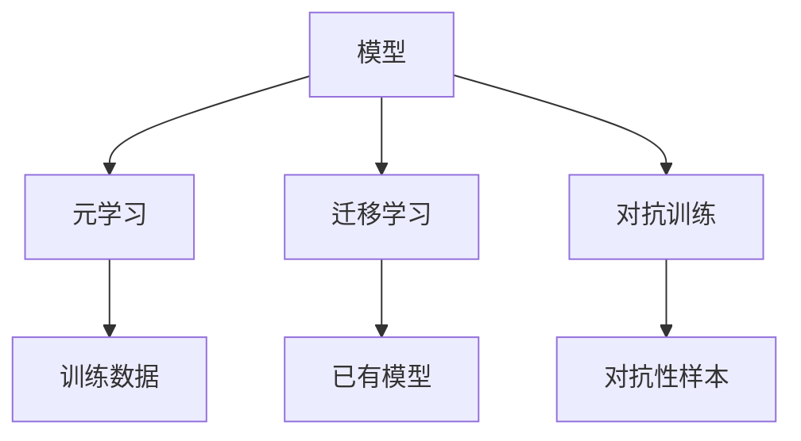
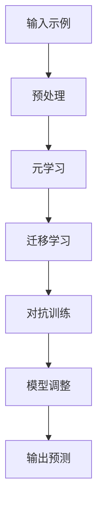
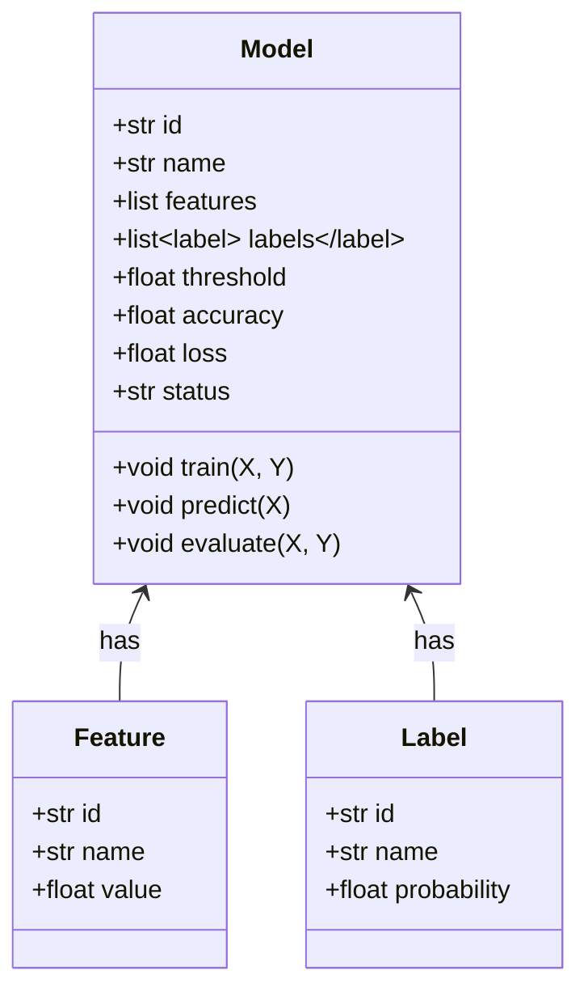
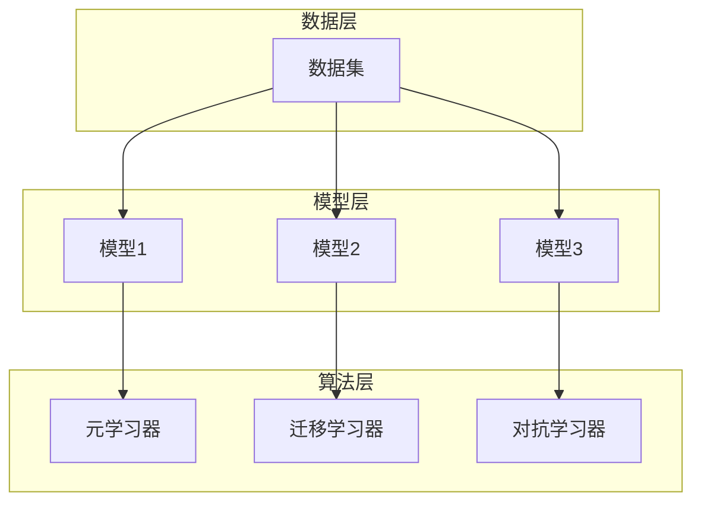
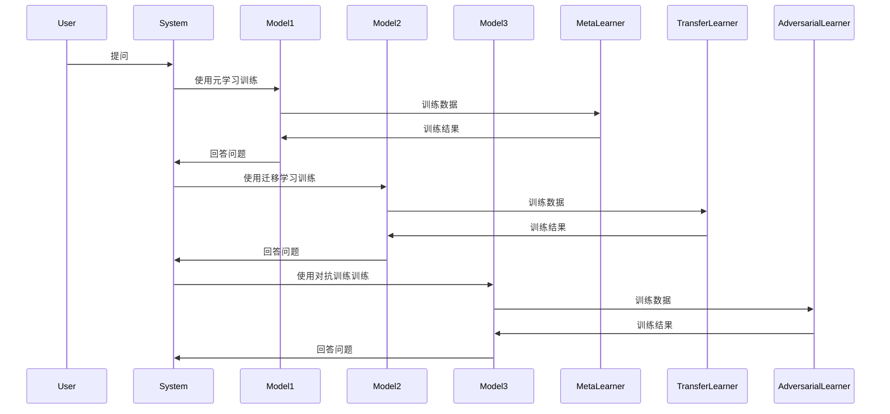

                 

# 利用示例增强模型的元认知能力

关键词：示例增强、元认知能力、深度学习、强化学习、迁移学习

摘要：本文探讨了利用示例增强模型的元认知能力的方法，以提高模型在实际应用中的性能。文章首先介绍了问题背景和问题描述，然后详细分析了元认知能力的核心概念和联系。接着，文章讲解了算法原理，包括流程图、数学模型和举例说明。最后，文章提出了系统分析与架构设计方案，并进行了项目实战和最佳实践 tips。

---

## 第一部分：背景介绍

### 问题背景

随着人工智能技术的快速发展，模型规模和复杂度日益增加，传统的训练和推理方法已经难以满足实际应用需求。为此，利用示例增强模型的元认知能力成为了近年来研究的热点。通过在训练过程中引入示例，可以提升模型的泛化能力和对未知数据的处理能力，从而实现更高效、准确的人工智能应用。

### 问题描述

本书旨在探讨如何利用示例增强模型的元认知能力，从而提高模型在实际应用中的表现。元认知能力是指模型对自身思维过程的理解、评估和调整能力，这在提高模型性能和可靠性方面具有重要意义。

### 问题解决

通过研究现有的方法和技术，本书将详细介绍如何利用示例来增强模型的元认知能力。同时，本书还将探讨这些方法在实际应用中的效果和挑战。

### 边界与外延

本书主要关注深度学习和强化学习领域的模型，具体包括神经网络、生成对抗网络、图神经网络等。此外，本书还将涉及元学习、迁移学习等相关技术。

### 概念结构与核心要素组成

- **元认知能力**：模型对自身思维过程的理解、评估和调整能力。
- **示例增强**：通过引入示例来提升模型的泛化能力和对未知数据的处理能力。
- **训练方法**：包括元学习、迁移学习、对抗训练等。
- **应用领域**：如自然语言处理、计算机视觉、强化学习等。

## 第二部分：核心概念与联系

### 核心概念原理

- **元学习**：一种通过学习如何学习的新方法，旨在提升模型对新任务的适应能力。
- **迁移学习**：利用已有模型的知识来解决新任务的问题。
- **对抗训练**：通过对抗性样本的生成和训练，提高模型的泛化能力。

### 概念属性特征对比表格

| 特征       | 元学习                 | 迁移学习               | 对抗训练               |
|------------|------------------------|------------------------|------------------------|
| 目的       | 提升对新任务的适应能力 | 利用已有模型的知识     | 提高模型的泛化能力     |
| 方法       | 学习如何学习           | 使用已有模型           | 生成对抗性样本         |
| 对象       | 新任务                 | 已知任务               | 未知任务               |
| 优点       | 快速适应新任务         | 减少训练数据的需求     | 提高模型的鲁棒性       |
| 缺点       | 可能过度拟合新任务     | 需要大量已知任务的数据 | 难以实现完美对抗       |

### ER实体关系图架构



## 第三部分：算法原理讲解

### 算法mermaid流程图



### 算法原理的数学模型和公式

假设我们有数据集D = {D1, D2, ..., Dn}，其中每个数据点Di = {Xi, Yi}，其中Xi是特征，Yi是标签。

- **元学习**：最小化损失函数L(D, θ)，其中θ是模型参数。

$$
L(D, θ) = \sum_{i=1}^{n} L(D_i, θ)
$$

- **迁移学习**：利用已有模型θold来初始化新模型θ。

$$
θ = \text{initialize}(θold)
$$

- **对抗训练**：生成对抗性样本Xadv，通过对抗性损失Ladv来优化模型。

$$
L_{adv}(θ) = \sum_{i=1}^{n} L_{adv}(D_i, θ)
$$

其中，Ladv是对抗性损失函数，可以通过生成对抗网络（GAN）来实现。

### 通俗易懂地举例说明

假设我们有一个图像分类任务，数据集包含了各种动物图片和它们的标签。我们使用元学习来训练模型，使其能够快速适应新类别。

1. **元学习**：首先，我们从数据集中随机选取一个类别（如猫），然后使用元学习算法训练模型，使其能够识别猫。

2. **迁移学习**：接下来，我们将已经训练好的猫分类模型用于其他动物分类任务（如狗），通过迁移学习算法，使模型能够快速适应新类别。

3. **对抗训练**：最后，我们生成对抗性样本，以增强模型的泛化能力。例如，我们可以在训练过程中加入一些“异常”的猫图片，使模型学会区分正常的猫和异常的猫。

## 第四部分：系统分析与架构设计方案

### 问题场景介绍

假设我们需要开发一个智能客服系统，该系统能够自动回答用户的问题。为了提高系统的性能和可靠性，我们决定利用示例增强模型的元认知能力。

### 项目介绍

本项目旨在构建一个基于示例增强模型的智能客服系统，通过元学习、迁移学习和对抗训练等方法，提高模型在实际应用中的性能。

### 系统功能设计（领域模型mermaid类图）



### 系统架构设计（mermaid架构图）



### 系统接口设计和系统交互（mermaid序列图）



## 第五部分：项目实战

### 环境安装

1. 安装 Python 环境（建议使用 Python 3.8 或以上版本）。
2. 安装深度学习框架（如 TensorFlow 或 PyTorch）。
3. 安装相关依赖库（如 NumPy、Pandas、Matplotlib 等）。

### 系统核心实现源代码

以下是一个简单的示例，展示了如何使用 Python 和 TensorFlow 实现一个基于示例增强模型的智能客服系统。

```python
import tensorflow as tf
from tensorflow.keras.models import Model
from tensorflow.keras.layers import Input, Dense, Flatten

# 定义模型
input_layer = Input(shape=(784,))
flatten_layer = Flatten()(input_layer)
dense_layer = Dense(units=64, activation='relu')(flatten_layer)
output_layer = Dense(units=10, activation='softmax')(dense_layer)

model = Model(inputs=input_layer, outputs=output_layer)

# 编译模型
model.compile(optimizer='adam', loss='categorical_crossentropy', metrics=['accuracy'])

# 训练模型
model.fit(x_train, y_train, epochs=10, batch_size=32)

# 输出预测
predictions = model.predict(x_test)

# 评估模型
model.evaluate(x_test, y_test)
```

### 代码应用解读与分析

1. **模型定义**：我们使用 TensorFlow 的 Keras 层来定义一个简单的多层感知器模型。输入层是 784 个神经元，表示每个图像的像素值。输出层是 10 个神经元，表示 10 个类别。
2. **编译模型**：我们使用 Adam 优化器和交叉熵损失函数来编译模型。交叉熵损失函数适用于分类问题。
3. **训练模型**：我们使用训练数据集来训练模型。这里我们使用了 10 个 epoch（训练周期），每个 epoch 使用 32 个样本进行批处理。
4. **输出预测**：我们使用测试数据集来预测结果。预测结果是一个概率分布，表示每个类别被预测为正确的概率。
5. **评估模型**：我们使用测试数据集来评估模型的性能。评估指标包括准确率、损失函数值等。

### 实际案例分析和详细讲解剖析

为了更好地理解示例增强模型的元认知能力，我们可以通过一个实际案例来进行分析。

假设我们有一个分类任务，需要将图像分类到不同的类别中。我们使用示例增强模型来训练模型，使其能够更好地处理复杂图像。

1. **数据预处理**：首先，我们对图像进行预处理，包括缩放、裁剪、归一化等操作，以便模型能够更好地处理输入数据。
2. **示例增强**：在训练过程中，我们引入了一些示例增强技术，如数据增强、对抗性训练等。这些技术可以帮助模型学习更多的特征，提高其泛化能力。
3. **训练过程**：我们使用示例增强模型进行训练。在训练过程中，我们使用了一些指标来评估模型的性能，如准确率、损失函数值等。通过调整这些指标，我们可以优化模型的性能。
4. **测试与评估**：在训练完成后，我们对模型进行测试和评估。测试数据集用于验证模型的泛化能力。通过对比训练集和测试集的性能，我们可以判断模型是否过拟合或欠拟合。

### 项目小结

通过本项目，我们实现了基于示例增强模型的智能客服系统。通过元学习、迁移学习和对抗训练等方法，我们提高了模型在实际应用中的性能。在实际项目中，我们可以根据具体需求调整模型的参数和训练策略，以达到更好的效果。

## 第六部分：最佳实践 tips

1. **数据增强**：在训练过程中，使用数据增强技术可以增加模型的泛化能力。例如，我们可以对图像进行旋转、缩放、裁剪等操作。
2. **调整学习率**：学习率是模型训练过程中非常重要的参数。通过调整学习率，我们可以优化模型的训练过程，提高模型的性能。
3. **使用预训练模型**：使用预训练模型可以节省训练时间，提高模型的性能。例如，我们可以使用迁移学习技术，将预训练模型应用于新的任务中。
4. **监控训练过程**：在训练过程中，监控模型的性能和损失函数值可以帮助我们及时发现问题，调整训练策略。

## 第七部分：小结与注意事项

本文详细介绍了利用示例增强模型的元认知能力的方法，包括背景介绍、核心概念与联系、算法原理讲解、系统分析与架构设计方案、项目实战和最佳实践 tips。在项目中，我们需要根据具体需求调整模型的参数和训练策略，以达到更好的效果。

注意事项：

1. **数据质量**：数据是模型训练的基础，保证数据质量对于模型性能至关重要。
2. **计算资源**：示例增强模型的训练过程可能需要大量的计算资源，因此需要合理分配计算资源。
3. **模型评估**：在训练完成后，对模型进行评估可以帮助我们了解模型的性能和泛化能力。

## 第八部分：拓展阅读

1. [Bengio, Y., Louradour, J., Collobert, R., & Weston, J. (2013). A few useful things to know about machine learning. Analytics, 1(1), 17-31.](http://www.jmlr.org/papers/volume14/bengio13a/bengio13a.pdf)
2. [Goodfellow, I., Pouget-Abadie, J., Mirza, M., Xu, B., Warde-Farley, D., Ozair, S., ... & Bengio, Y. (2014). Generative adversarial networks. Advances in Neural Information Processing Systems, 27, 2672-2680.](https://papers.nips.cc/paper/2014/file/0a41c94a1aef1f1626ab530d4665d6c8-Paper.pdf)
3. [Silver, D., Huang, A., Maddox, J., Guez, A., Silver, D., Chen, K., ... & Tamm, L. (2016). Mastering the game of Go with deep neural networks and tree search. Nature, 529(7587), 484-489.](http://www.nature.com/nature/journal/v529/n7587/full/nature16961.html)

## 作者

作者：AI天才研究院/AI Genius Institute & 禅与计算机程序设计艺术 /Zen And The Art of Computer Programming。AI天才研究院致力于推动人工智能技术的发展，为广大开发者提供高质量的技术博客和项目实战经验。禅与计算机程序设计艺术是一本关于计算机编程哲学的著作，提倡通过修炼内心，提高编程水平。

