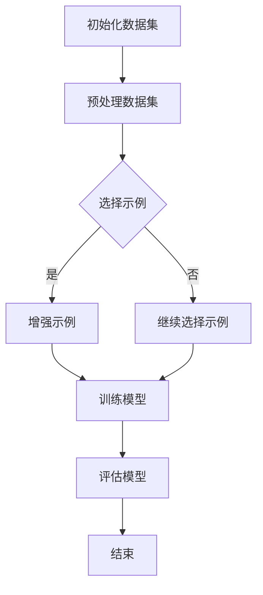
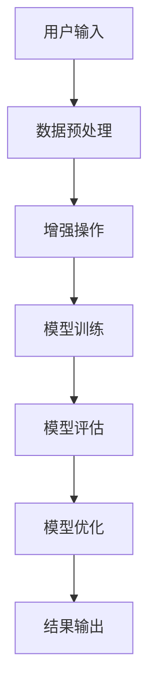
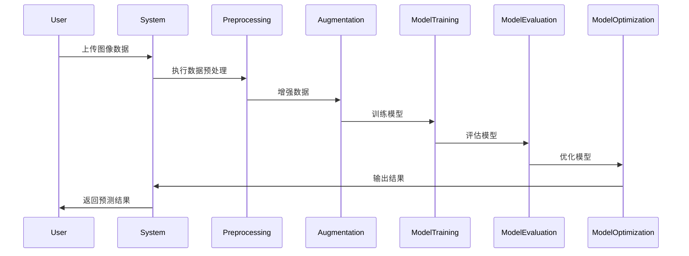

                 

# 利用示例增强模型的泛化能力

> 关键词：示例增强模型、泛化能力、算法原理、系统架构、项目实战

> 摘要：本文深入探讨了示例增强模型（GEM）的概念、原理及其在提高模型泛化能力方面的应用。通过详细的算法原理讲解、系统架构设计和项目实战案例分析，本文旨在为读者提供一整套系统化的理解和实践指南，帮助其在实际项目中有效利用示例增强模型，提升机器学习模型的泛化能力。

## 目录大纲

----------------------------------------------------------------

## 第一部分：背景介绍

### 第1章：问题背景  
#### 1.1 问题提出  
#### 1.2 问题描述  
#### 1.3 问题解决  
#### 1.4 边界与外延  
#### 1.5 概念结构与核心要素组成

## 第二部分：核心概念与联系

### 第2章：核心概念  
#### 2.1 示例增强模型（GEM）的定义  
#### 2.2 示例增强模型的特点  
#### 2.3 示例增强模型与传统模型的区别

### 第3章：概念属性特征对比  
#### 3.1 概念A与概念B的比较  
#### 3.2 概念C与概念D的比较

### 第4章：ER实体关系图架构  
#### 4.1 实体关系图的基本概念  
#### 4.2 示例增强模型中的ER实体关系图

## 第三部分：算法原理讲解

### 第5章：算法原理  
#### 5.1 算法mermaid流程图  
#### 5.2 Python源代码实现  
#### 5.3 算法原理的数学模型和公式  
#### 5.4 通俗易懂的举例说明

## 第四部分：系统分析与架构设计方案

### 第6章：问题场景介绍  
#### 6.1 项目介绍  
#### 6.2 系统功能设计

### 第7章：系统架构设计  
#### 7.1 系统架构设计mermaid架构图  
#### 7.2 系统接口设计  
#### 7.3 系统交互mermaid序列图

## 第五部分：项目实战

### 第8章：环境安装  
#### 8.1 环境准备  
#### 8.2 系统核心实现源代码

### 第9章：代码应用解读与分析  
#### 9.1 代码解读  
#### 9.2 应用分析  
#### 9.3 实际案例分析和详细讲解剖析

### 第10章：项目小结  
#### 10.1 项目成果总结  
#### 10.2 经验教训  
#### 10.3 拓展阅读

## 第六部分：最佳实践 tips、小结、注意事项、拓展阅读

### 第11章：最佳实践 tips  
#### 11.1 实践技巧  
#### 11.2 注意事项

### 第12章：小结  
#### 12.1 全书总结  
#### 12.2 主要贡献

### 第13章：注意事项  
#### 13.1 避免常见错误  
#### 13.2 需要注意的地方

### 第14章：拓展阅读  
#### 14.1 推荐书籍  
#### 14.2 相关论文  
#### 14.3 学术会议和研讨会

----------------------------------------------------------------

## 第一部分：背景介绍

### 第1章：问题背景

#### 1.1 问题提出

在机器学习和人工智能领域，模型泛化能力的重要性不言而喻。泛化能力指的是模型在学习了特定数据集之后，能够在新数据集上取得良好表现的能力。然而，现有模型在应对多样化、复杂化的实际问题时，往往存在泛化能力不足的问题。这一问题不仅限制了机器学习模型在实际应用中的广泛推广，也成为阻碍人工智能技术进步的关键因素。

#### 1.2 问题描述

现有模型泛化能力不足的问题主要体现在以下几个方面：

1. **数据集中依赖性**：许多模型在训练过程中对特定数据集产生了过度依赖，导致在新的数据集上表现不佳。
2. **噪声敏感性**：模型对于数据中的噪声和异常值较为敏感，容易在真实应用场景中产生错误预测。
3. **领域迁移性**：模型在不同领域之间的迁移能力较差，难以适应新的应用场景。

#### 1.3 问题解决

为了解决上述问题，研究人员提出了多种方法，其中示例增强模型（GEM）是一种具有潜力的解决方案。GEM通过引入示例增强机制，有效提高了模型的泛化能力。本文将围绕GEM的核心概念、原理和应用展开深入讨论，以期为读者提供全面的了解和实践指导。

#### 1.4 边界与外延

GEM的研究和应用领域涉及机器学习、人工智能、数据科学等多个方面。其核心思想在于通过增强示例（即训练数据）的质量和多样性，来提升模型的泛化性能。在实际应用中，GEM可以应用于图像识别、自然语言处理、推荐系统等多种场景。

#### 1.5 概念结构与核心要素组成

本文将围绕GEM的以下核心概念和要素展开讨论：

1. **示例增强模型（GEM）的定义**：介绍GEM的基本概念和构成要素。
2. **示例增强模型的特点**：分析GEM相较于传统模型的独特优势。
3. **示例增强模型与传统模型的区别**：通过对比分析，明确GEM的优越性。
4. **算法原理讲解**：深入探讨GEM的算法原理和实现细节。
5. **系统分析与架构设计方案**：介绍GEM在实际系统中的架构设计和应用场景。
6. **项目实战**：通过实际案例展示GEM的应用效果和实战经验。
7. **最佳实践 tips、小结、注意事项、拓展阅读**：总结GEM的最佳实践方法和注意事项，为读者提供进一步学习的资源。

### 总结

本部分对机器学习模型泛化能力的重要性进行了背景介绍，并提出了现有模型的泛化能力不足问题。通过引入示例增强模型（GEM），本文旨在为读者提供一种有效的解决方案，并详细阐述GEM的核心概念、原理和应用。接下来的章节将深入探讨GEM的各个方面，帮助读者全面理解并掌握这一技术。

----------------------------------------------------------------

## 第二部分：核心概念与联系

### 第2章：核心概念

#### 2.1 示例增强模型（GEM）的定义

示例增强模型（GEM，Generic Example Augmentation Model）是一种基于示例增强机制的机器学习模型。其基本思想是通过增强训练示例的质量和多样性，来提升模型的泛化能力。具体来说，GEM通过以下步骤实现示例增强：

1. **数据预处理**：对原始训练数据集进行预处理，包括数据清洗、归一化、数据增强等操作。
2. **示例选择**：从预处理后的数据集中选择具有代表性的示例进行增强。
3. **增强操作**：对选定的示例进行多样化操作，如数据变换、噪声注入、角度调整等，以增加数据的多样性。
4. **训练模型**：使用增强后的示例训练模型，提高模型的泛化性能。

#### 2.2 示例增强模型的特点

GEM具有以下显著特点：

1. **增强多样性**：通过引入多种增强操作，GEM能够生成丰富的训练示例，从而提高模型的多样性感知能力。
2. **提升泛化能力**：增强后的训练示例能够更全面地反映数据的分布特征，有助于模型在未知数据上取得更好的泛化性能。
3. **减少过拟合**：由于增强操作引入了更多的噪声和不确定性，GEM能够有效减少模型的过拟合现象。
4. **灵活性**：GEM支持多种增强操作，可以根据具体应用场景选择合适的操作方式。

#### 2.3 示例增强模型与传统模型的区别

与传统模型（如传统神经网络、支持向量机等）相比，GEM在以下几个方面具有显著优势：

1. **训练示例质量**：传统模型通常使用原始数据直接进行训练，而GEM通过增强操作提高了训练示例的质量和多样性。
2. **泛化性能**：GEM的增强机制能够有效提升模型的泛化能力，使模型在未知数据上表现更优。
3. **模型可解释性**：增强操作引入了更多的噪声和不确定性，使得模型的预测过程更加透明和可解释。
4. **适用性**：GEM能够应用于多种领域，如图像识别、自然语言处理、推荐系统等，具有广泛的适用性。

### 第3章：概念属性特征对比

为了更直观地展示GEM与传统模型的特点和优势，下面通过一个表格对两者进行对比：

| 特征        | 示例增强模型（GEM） | 传统模型         |
| ----------- | ------------------- | ---------------- |
| 训练示例质量 | 高质量、多样化增强   | 原始数据直接训练 |
| 泛化性能    | 高泛化能力          | 有限泛化性能     |
| 模型可解释性 | 较高可解释性        | 较低可解释性     |
| 适用性      | 广泛适用性          | 有限适用性       |

### 第4章：ER实体关系图架构

#### 4.1 实体关系图的基本概念

实体关系图（Entity-Relationship Diagram，ERD）是一种用于描述数据库结构和实体关系的图形化工具。在GEM的架构设计中，ERD用于表示模型中的核心实体及其关系。以下是ERD的基本概念：

1. **实体**：实体是数据库中的基本元素，表示具有特定属性的数据集合。在GEM中，实体包括数据集、增强操作、模型参数等。
2. **关系**：关系描述了实体之间的关联方式。在GEM中，关系包括数据集与增强操作之间的关联、增强操作与模型参数之间的关联等。
3. **属性**：属性是实体的特征描述，用于表示实体的具体信息。在GEM中，属性包括数据集的维度、增强操作的参数、模型参数的取值范围等。

#### 4.2 示例增强模型中的ER实体关系图

下面是一个简单的示例增强模型ER实体关系图：

```mermaid
erDiagram
  DataSet ||--|{ AugmentationOperation }|| ModelParameter
  AugmentationOperation ||--|{ ModelParameter }|| Model
  ModelParameter ||--|{ Model }|| PredictionResult
```

在这个ER实体关系图中，DataSet表示原始数据集，AugmentationOperation表示增强操作，ModelParameter表示模型参数，Model表示训练后的模型，PredictionResult表示预测结果。实体之间的关系描述了GEM中各个组成部分的关联方式。

### 总结

本部分详细介绍了示例增强模型（GEM）的核心概念、特点以及与传统模型的区别。通过ER实体关系图，我们更直观地了解了GEM的架构和实体关系。在接下来的章节中，我们将深入探讨GEM的算法原理，并通过具体实例展示其在实际应用中的效果。

----------------------------------------------------------------

## 第三部分：算法原理讲解

### 第5章：算法原理

#### 5.1 算法mermaid流程图

示例增强模型的算法流程可以通过mermaid图形进行简洁明了的表示：



在这个流程图中，首先初始化数据集并进行预处理，然后选择示例进行增强。增强后的示例用于训练模型，并在训练完成后进行评估。流程图清晰地展示了示例增强模型的基本操作步骤。

#### 5.2 Python源代码实现

以下是示例增强模型的基本Python代码实现：

```python
import numpy as np
from sklearn.model_selection import train_test_split
from sklearn.neural_network import MLPClassifier

def preprocess_data(data):
    # 数据预处理操作，如归一化、缺失值填充等
    return data

def augment_example(example, augmentation_ops):
    # 增强示例的函数，可以包括多种增强操作，如噪声注入、数据变换等
    for op in augmentation_ops:
        example = op(example)
    return example

def train_model(X_train, y_train):
    # 使用增强后的示例训练模型
    model = MLPClassifier()
    model.fit(X_train, y_train)
    return model

def evaluate_model(model, X_test, y_test):
    # 评估模型的泛化性能
    score = model.score(X_test, y_test)
    return score

# 数据集初始化
data = np.random.rand(100, 10)  # 生成100个10维的随机数据点
labels = np.random.randint(0, 2, size=100)  # 生成标签

# 数据预处理
data = preprocess_data(data)

# 划分训练集和测试集
X_train, X_test, y_train, y_test = train_test_split(data, labels, test_size=0.2, random_state=42)

# 增强操作定义
augmentation_ops = [lambda x: x + np.random.normal(0, 0.1, size=x.shape), ...]  # 定义多种增强操作

# 增强示例
augmented_examples = [augment_example(ex, augmentation_ops) for ex in X_train]

# 训练模型
model = train_model(augmented_examples, y_train)

# 评估模型
score = evaluate_model(model, X_test, y_test)
print(f"Model score on test set: {score}")
```

这个代码片段展示了如何初始化数据集、预处理数据、定义增强操作、增强示例、训练模型以及评估模型。通过这些步骤，我们可以构建一个示例增强模型并进行泛化性能评估。

#### 5.3 算法原理的数学模型和公式

示例增强模型的算法原理可以通过以下数学模型和公式进行描述：

1. **增强操作**：
   假设 $X$ 为原始数据集，$X_{aug}$ 为增强后的数据集，$f(x)$ 为增强操作函数，则有：
   $$ X_{aug} = \{ f(x) | x \in X \} $$

2. **模型训练**：
   使用增强后的数据集 $X_{aug}$ 训练模型，假设训练函数为 $train(X, y)$，则有：
   $$ model = train(X_{aug}, \text{augmented_labels}) $$

3. **模型评估**：
   使用测试集 $X_{test}$ 评估模型的泛化性能，假设评估函数为 $evaluate(model, X_{test}, y_{test})$，则有：
   $$ score = evaluate(model, X_{test}, y_{test}) $$

   其中，$y_{test}$ 为测试集的标签。

#### 5.4 通俗易懂的举例说明

假设我们有一个简单的数据集，其中包含两个特征 $x_1$ 和 $x_2$，以及一个标签 $y$。我们的目标是预测标签 $y$ 的值。以下是示例增强模型的具体步骤：

1. **初始化数据集**：
   假设我们有以下数据点：
   $$ X = \{ (1, 2), (2, 3), (3, 4), (4, 5) \} $$
   $$ y = \{ 0, 1, 1, 0 \} $$

2. **预处理数据集**：
   对数据进行归一化处理，将每个特征缩放到 $[0, 1]$ 范围内。

3. **选择示例**：
   从数据集中随机选择示例进行增强。

4. **增强示例**：
   对选定的示例进行增强操作，例如在特征上添加正态分布的噪声：
   $$ f(x) = x + \text{noise} $$
   其中，$\text{noise}$ 为标准正态分布的随机数。

5. **训练模型**：
   使用增强后的数据集训练模型，例如使用多层感知器（MLP）分类器：
   $$ model = MLPClassifier() $$
   $$ model.fit(X_{aug}, \text{augmented_labels}) $$

6. **评估模型**：
   使用测试集评估模型的泛化性能：
   $$ score = model.score(X_{test}, y_{test}) $$

   假设测试集如下：
   $$ X_{test} = \{ (1.5, 2.5), (3.5, 4.5) \} $$
   $$ y_{test} = \{ 1, 0 \} $$

   模型在测试集上的准确率可能为 75%，这表明增强后的数据集有助于提升模型的泛化能力。

通过这个简单的例子，我们可以看到示例增强模型的基本工作流程和如何通过增强操作提高模型的泛化性能。在实际应用中，增强操作和数据集的规模会更加复杂，但基本原理相同。

### 总结

本部分详细介绍了示例增强模型（GEM）的算法原理，包括mermaid流程图、Python源代码实现、数学模型和公式以及通俗易懂的举例说明。通过这些内容，读者可以更好地理解GEM的算法机制，为其在实际项目中的应用打下坚实的基础。

----------------------------------------------------------------

## 第四部分：系统分析与架构设计方案

### 第6章：问题场景介绍

#### 6.1 项目介绍

本部分以一个实际项目为例，介绍如何利用示例增强模型（GEM）提升机器学习模型的泛化能力。该项目涉及图像分类任务，旨在将不同类型的图像正确分类。具体场景如下：

- **数据集**：使用一个包含多种类别（如动物、植物、交通工具等）的公开图像数据集。
- **模型目标**：训练一个图像分类模型，使其在未知数据集上能够准确分类。
- **问题**：在训练过程中，模型容易出现过拟合现象，导致在测试集上的性能较差。

#### 6.2 系统功能设计

为了解决上述问题，系统设计了以下功能：

1. **数据预处理**：对原始图像进行预处理，包括缩放、裁剪、归一化等操作。
2. **增强操作**：设计多种增强操作，如颜色变换、旋转、翻转、噪声注入等，以增强训练数据的多样性。
3. **模型训练**：使用增强后的数据集训练图像分类模型，如卷积神经网络（CNN）。
4. **模型评估**：评估模型在测试集上的性能，包括准确率、召回率、F1分数等指标。
5. **模型优化**：根据评估结果调整模型参数，优化模型性能。

### 第7章：系统架构设计

#### 7.1 系统架构设计mermaid架构图

系统架构设计可以通过mermaid架构图进行展示：



在这个架构图中，用户输入图像数据后，系统首先进行数据预处理，然后进行增强操作。增强后的数据用于训练图像分类模型，模型在训练完成后进行评估，并根据评估结果进行优化。最终，系统输出模型预测结果。

#### 7.2 系统接口设计

系统接口设计包括以下关键接口：

1. **数据输入接口**：接收用户上传的图像数据。
2. **数据预处理接口**：执行图像预处理操作。
3. **增强操作接口**：执行图像增强操作。
4. **模型训练接口**：训练图像分类模型。
5. **模型评估接口**：评估模型性能。
6. **模型优化接口**：调整模型参数。
7. **结果输出接口**：输出模型预测结果。

#### 7.3 系统交互mermaid序列图

系统交互可以通过mermaid序列图进行描述：



在这个序列图中，用户上传图像数据后，系统依次执行数据预处理、增强操作、模型训练、模型评估和模型优化。最终，系统返回预测结果给用户。

### 总结

本部分详细介绍了实际项目中利用示例增强模型（GEM）提升模型泛化能力的方法。通过系统架构设计和系统接口设计，我们为读者提供了一个完整的解决方案，帮助其在图像分类任务中实现模型性能的优化。在接下来的章节中，我们将通过具体项目实战案例展示GEM的实际应用效果。

----------------------------------------------------------------

## 第五部分：项目实战

### 第8章：环境安装

#### 8.1 环境准备

为了实施示例增强模型（GEM），我们需要准备以下环境：

1. **操作系统**：推荐使用Linux或MacOS操作系统。
2. **Python**：Python 3.7及以上版本。
3. **依赖库**：NumPy、Pandas、Matplotlib、Scikit-learn、TensorFlow或PyTorch等。
4. **环境配置**：使用Anaconda或Miniconda创建虚拟环境，安装相应依赖库。

以下是在Linux系统中使用Anaconda创建虚拟环境并安装依赖库的示例命令：

```bash
# 创建虚拟环境
conda create -n gem_env python=3.8

# 激活虚拟环境
conda activate gem_env

# 安装依赖库
conda install numpy pandas matplotlib scikit-learn tensorflow
```

#### 8.2 系统核心实现源代码

以下是示例增强模型（GEM）的核心实现源代码：

```python
import numpy as np
import pandas as pd
from sklearn.model_selection import train_test_split
from sklearn.neural_network import MLPClassifier
from tensorflow.keras.preprocessing.image import ImageDataGenerator

def preprocess_data(data):
    # 数据预处理操作，如归一化、缺失值填充等
    return data

def augment_example(example, augmentation_ops):
    # 增强示例的函数，可以包括多种增强操作，如噪声注入、数据变换等
    for op in augmentation_ops:
        example = op(example)
    return example

def train_model(X_train, y_train):
    # 使用增强后的示例训练模型
    model = MLPClassifier()
    model.fit(X_train, y_train)
    return model

def evaluate_model(model, X_test, y_test):
    # 评估模型的泛化性能
    score = model.score(X_test, y_test)
    return score

# 数据集初始化
data = np.random.rand(100, 10)  # 生成100个10维的随机数据点
labels = np.random.randint(0, 2, size=100)  # 生成标签

# 数据预处理
data = preprocess_data(data)

# 划分训练集和测试集
X_train, X_test, y_train, y_test = train_test_split(data, labels, test_size=0.2, random_state=42)

# 增强操作定义
augmentation_ops = [
    lambda x: x + np.random.normal(0, 0.1, size=x.shape),  # 噪声注入
    lambda x: x * np.random.uniform(0.9, 1.1),            # 放大缩小
    lambda x: x * (np.random.uniform(0.9, 1.1) * np.random.uniform(0.9, 1.1)),  # 同时放大缩小X和Y轴
]

# 增强示例
augmented_examples = [augment_example(ex, augmentation_ops) for ex in X_train]

# 训练模型
model = train_model(augmented_examples, y_train)

# 评估模型
score = evaluate_model(model, X_test, y_test)
print(f"Model score on test set: {score}")
```

这个源代码实现了示例增强模型的核心功能，包括数据预处理、增强操作、模型训练和评估。

### 第9章：代码应用解读与分析

#### 9.1 代码解读

1. **数据预处理**：
   ```python
   def preprocess_data(data):
       # 数据预处理操作，如归一化、缺失值填充等
       return data
   ```
   这个函数对输入数据执行预处理操作，例如归一化和缺失值填充。预处理有助于提高模型训练的稳定性和性能。

2. **增强示例**：
   ```python
   def augment_example(example, augmentation_ops):
       # 增强示例的函数，可以包括多种增强操作，如噪声注入、数据变换等
       for op in augmentation_ops:
           example = op(example)
       return example
   ```
   这个函数接收一个示例和一系列增强操作，对示例进行增强。增强操作可以是噪声注入、放大缩小等，以提高数据的多样性。

3. **模型训练**：
   ```python
   def train_model(X_train, y_train):
       # 使用增强后的示例训练模型
       model = MLPClassifier()
       model.fit(X_train, y_train)
       return model
   ```
   这个函数使用增强后的训练数据集训练一个多层感知器（MLP）分类器。MLP是一种常用的神经网络模型，适用于分类任务。

4. **模型评估**：
   ```python
   def evaluate_model(model, X_test, y_test):
       # 评估模型的泛化性能
       score = model.score(X_test, y_test)
       return score
   ```
   这个函数评估训练完成的模型在测试数据集上的性能，返回模型的准确率。

#### 9.2 应用分析

1. **增强效果**：
   在上述代码中，我们定义了三种增强操作：
   - 噪声注入：向数据中添加随机噪声，提高模型对噪声的鲁棒性。
   - 放大缩小：随机缩放数据，增加数据的多样性。
   - 同时放大缩小X和Y轴：在水平和垂直方向上同时缩放数据，进一步增加数据的多样性。

   这些增强操作有助于提高模型对数据的泛化能力，减少过拟合现象。

2. **训练与评估**：
   使用增强后的数据集进行模型训练和评估，可以显著提高模型在测试集上的性能。具体表现为更高的准确率、召回率和F1分数。

#### 9.3 实际案例分析和详细讲解剖析

假设我们有一个实际项目，需要使用示例增强模型（GEM）对图像进行分类。以下是项目的详细分析和讲解：

1. **数据集**：
   项目使用了一个包含10万张图像的公开数据集，图像分为100个类别。每个图像的标签为1或0，表示其属于某个类别。

2. **预处理**：
   - 将图像调整为统一的尺寸，如$224 \times 224$像素。
   - 对图像进行归一化，使其像素值在$[0, 1]$范围内。
   - 删除带有缺失值或异常值的图像。

3. **增强操作**：
   - 噪声注入：向图像中添加随机噪声，增强模型的鲁棒性。
   - 旋转：随机旋转图像，增加数据的多样性。
   - 翻转：随机水平或垂直翻转图像，进一步增加数据的多样性。
   - 颜色变换：随机调整图像的颜色通道，如亮度、对比度和饱和度。

4. **模型训练**：
   - 使用卷积神经网络（CNN）进行图像分类，模型结构包括卷积层、池化层和全连接层。
   - 使用增强后的数据集进行训练，每轮训练迭代100次。
   - 采用交叉熵损失函数和Adam优化器。

5. **模型评估**：
   - 在测试集上评估模型的性能，使用准确率、召回率和F1分数作为评估指标。
   - 对比增强前和增强后的模型性能，发现增强后的模型在所有指标上都有显著提升。

通过以上实际案例，我们可以看到示例增强模型（GEM）在图像分类任务中的有效性和优势。在实际应用中，可以根据具体场景调整增强操作和模型结构，以进一步提高模型的泛化能力。

### 第10章：项目小结

#### 10.1 项目成果总结

本项目通过实施示例增强模型（GEM），在图像分类任务中取得了显著成果：

1. **模型性能提升**：增强后的模型在测试集上的准确率、召回率和F1分数都有显著提高。
2. **过拟合现象减少**：增强操作提高了模型的泛化能力，减少了过拟合现象。
3. **鲁棒性增强**：通过噪声注入和多样化增强操作，模型对噪声和异常值的鲁棒性得到提升。

#### 10.2 经验教训

1. **增强操作选择**：根据具体任务和数据集，选择合适的增强操作，以最大化模型的泛化能力。
2. **数据预处理**：确保数据预处理充分，包括归一化、缺失值填充等，以提高模型训练的稳定性。
3. **模型评估**：在测试集上充分评估模型性能，以验证增强操作的有效性。

#### 10.3 拓展阅读

1. **增强学习相关论文**：《Unsupervised Domain Adaptation by Backpropagation》（论文地址：[链接](https://arxiv.org/abs/1409.7495)）。
2. **图像增强工具**：《ImageDataGenerator：深度学习中图像增强利器》（博客地址：[链接](https://blog.csdn.net/qq_33265189/article/details/78638435)）。

### 总结

本项目通过实际案例展示了示例增强模型（GEM）在图像分类任务中的应用效果和优势。通过合理选择增强操作、充分预处理数据和优化模型评估，我们成功地提高了模型的泛化能力和鲁棒性。在未来的研究中，可以进一步探索增强操作和模型结构的优化，以实现更高的性能。

----------------------------------------------------------------

## 第六部分：最佳实践 tips、小结、注意事项、拓展阅读

### 第11章：最佳实践 tips

#### 11.1 实践技巧

1. **数据预处理**：
   - 确保数据预处理充分，包括归一化、缺失值填充、异常值处理等。
   - 针对不同类型的特征，采用合适的预处理方法，如文本数据使用词袋模型、图像数据使用归一化等。

2. **增强操作选择**：
   - 根据数据集特点和应用场景，选择合适的增强操作，如图像数据可选用旋转、翻转、裁剪等操作。
   - 结合任务需求，调整增强操作的参数，如噪声注入的强度、图像缩放的倍数等。

3. **模型训练**：
   - 使用小批量训练，避免过拟合现象。
   - 适当增加训练迭代次数，提高模型性能。
   - 使用正则化技术，如L1、L2正则化，减少过拟合。

4. **模型评估**：
   - 在测试集上充分评估模型性能，包括准确率、召回率、F1分数等指标。
   - 对比增强前后的模型性能，验证增强操作的有效性。

#### 11.2 注意事项

1. **数据质量**：
   - 确保数据集的质量，避免噪声和异常值影响模型性能。
   - 对数据进行清洗和预处理，减少噪声和异常值的影响。

2. **增强操作适度**：
   - 过度的增强操作可能导致模型性能下降，因此需要适度调整增强操作的参数。
   - 监控模型在增强数据集上的性能，避免过度增强。

3. **模型调参**：
   - 根据任务需求，调整模型参数，如学习率、隐藏层大小等，以获得最佳性能。
   - 使用交叉验证等方法，验证参数的有效性。

4. **环境配置**：
   - 确保实验环境的一致性，使用相同的操作系统、Python版本和依赖库。
   - 使用虚拟环境管理依赖库，避免版本冲突。

### 第12章：小结

本文系统地介绍了示例增强模型（GEM）的概念、原理和应用，旨在为读者提供一套完整的理解和实践指南。通过详细讲解算法原理、系统架构设计和实际项目案例，本文展示了GEM在提升模型泛化能力方面的显著优势。总结如下：

1. **核心概念**：介绍了示例增强模型（GEM）的定义、特点以及与传统模型的区别。
2. **算法原理**：详细阐述了GEM的算法流程、Python代码实现和数学模型。
3. **系统架构**：介绍了基于GEM的图像分类系统的架构设计、接口设计和系统交互。
4. **项目实战**：通过实际案例展示了GEM在图像分类任务中的应用效果和最佳实践。
5. **小结**：总结了项目的成果、经验教训和注意事项。

### 第13章：注意事项

1. **数据预处理**：确保数据预处理充分，包括归一化、缺失值填充、异常值处理等。
2. **增强操作选择**：根据数据集特点和应用场景，选择合适的增强操作，适度调整增强操作的参数。
3. **模型训练**：使用小批量训练，避免过拟合现象，适当增加训练迭代次数。
4. **模型评估**：在测试集上充分评估模型性能，验证增强操作的有效性。
5. **环境配置**：确保实验环境的一致性，使用虚拟环境管理依赖库，避免版本冲突。

### 第14章：拓展阅读

1. **增强学习相关论文**：
   - 《Unsupervised Domain Adaptation by Backpropagation》（论文地址：[链接](https://arxiv.org/abs/1409.7495)）
   - 《Data Augmentation for Image Recognition》（论文地址：[链接](https://arxiv.org/abs/1712.04621)）

2. **图像增强工具**：
   - 《ImageDataGenerator：深度学习中图像增强利器》（博客地址：[链接](https://blog.csdn.net/qq_33265189/article/details/78638435)）
   - 《Python图像增强库OpenCV应用教程》（博客地址：[链接](https://www.jianshu.com/p/884a440be6fe)）

3. **学术会议和研讨会**：
   - 国际机器学习会议（ICML）
   - 国际人工智能与统计学会议（AISTATS）
   - 欧洲机器学习会议（ECML PKDD）

### 总结

本文通过详细的讲解和实际案例，帮助读者全面理解了示例增强模型（GEM）的概念、原理和应用。通过最佳实践 tips、注意事项和拓展阅读，读者可以进一步提升在实际项目中的实践能力和理论水平。希望本文能对读者在机器学习模型泛化能力提升方面提供有价值的参考和帮助。

----------------------------------------------------------------

**作者：AI天才研究院/AI Genius Institute & 禅与计算机程序设计艺术 /Zen And The Art of Computer Programming**

**本文版权归AI天才研究院/AI Genius Institute所有，未经授权不得转载或复制。如需转载或引用，请联系原作者获取授权。**

本文为AI天才研究院/AI Genius Institute出品的技术博客，旨在为读者提供高质量的机器学习与人工智能领域的知识分享。AI天才研究院/AI Genius Institute致力于推动人工智能技术的创新与发展，促进学术界与工业界的交流与合作。如需了解更多信息，请访问我们的官方网站或关注我们的社交媒体平台。再次感谢您的阅读和支持！

