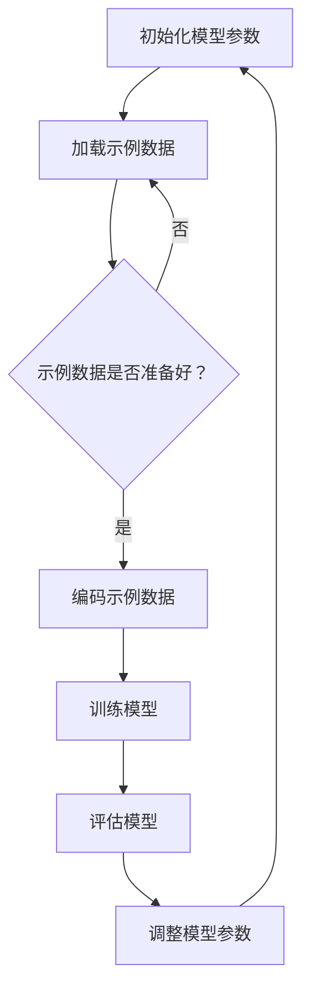

                 

## 利用示例增强模型的逻辑推理能力

### 关键词

- 示例增强模型
- 逻辑推理
- 自然语言处理
- 计算机视觉
- 数据挖掘

### 摘要

本文将探讨如何利用示例增强模型来提升逻辑推理能力。通过对示例增强模型的基本概念、逻辑推理能力解析、结合案例进行分析，以及其在不同领域的应用与实现，本文旨在为读者提供一个清晰、完整的理解和应用示例增强模型与逻辑推理能力的路径。同时，还将讨论示例增强模型的未来发展趋势以及面临的挑战。

### 引言

在当今数据驱动的时代，人工智能（AI）技术已经成为了推动社会进步的重要力量。然而，传统的AI模型在处理复杂任务时，往往依赖于大量的数据和强大的计算能力，这使得模型难以在资源和数据受限的环境中进行应用。为了解决这一问题，研究人员提出了示例增强模型（Example-based Augmented Model），通过将已有知识转化为可复用的示例，来提升模型的推理能力和泛化能力。

逻辑推理作为人工智能的核心组成部分，其能力直接影响着AI系统的智能水平。逻辑推理不仅仅是在解决特定问题时有效，它还能够帮助模型理解问题的本质，从而在面对新问题时能够进行灵活的应对。因此，如何将示例增强模型与逻辑推理能力相结合，成为了当前AI研究的一个重要方向。

本文将按照以下结构进行讨论：

1. **示例增强模型概述**：介绍示例增强模型的基本概念、发展历程及其优势。
2. **逻辑推理能力解析**：解析逻辑推理能力的定义、分类及其重要性。
3. **示例增强模型与逻辑推理能力结合**：探讨示例增强模型与逻辑推理能力的结合方式及其优势。
4. **示例增强模型在不同领域的应用**：分析示例增强模型在自然语言处理、计算机视觉和数据挖掘等领域的应用。
5. **示例增强模型的实现**：介绍示例增强模型的构建步骤、应用实战及未来发展趋势。
6. **面临的挑战与解决方案**：讨论示例增强模型在发展过程中面临的挑战及解决方案。

### 示例增强模型概述

#### 示例增强模型的基本概念

示例增强模型（Example-based Augmented Model，EAM）是一种基于示例学习（Example-based Learning）的模型，它通过将已有的知识（示例）进行编码和存储，以便在解决新问题时快速复用这些知识。与传统模型相比，示例增强模型能够通过少量的示例数据来泛化新的任务，从而降低了对大量训练数据的需求。

在示例增强模型中，示例通常是由输入数据和相应的输出结果组成的。模型通过学习这些示例，能够预测新输入数据的输出结果。这一过程可以看作是将已有知识通过编码存储到模型中，以便在需要时能够快速调用。

#### 示例增强模型的发展历程

示例增强模型的发展可以追溯到20世纪80年代，当时研究人员提出了基于知识的推理系统。随着机器学习和深度学习的兴起，示例增强模型逐渐受到了关注。特别是在深度学习模型中，通过引入示例增强机制，可以显著提高模型的推理能力和泛化能力。

近年来，随着神经网络技术的发展，示例增强模型在自然语言处理、计算机视觉和数据挖掘等领域得到了广泛的应用。例如，在自然语言处理领域，示例增强模型被用于命名实体识别、情感分析等任务；在计算机视觉领域，则被用于图像分类、目标检测等任务。

#### 示例增强模型的核心优势

示例增强模型具有以下几个核心优势：

1. **减少对训练数据的需求**：通过利用已有的示例数据，示例增强模型可以在数据稀缺的情况下仍然保持较高的性能。
2. **提高推理速度**：由于示例数据的预编码和存储，模型在处理新数据时能够快速调用已有的知识，从而加快推理速度。
3. **增强泛化能力**：示例增强模型通过学习已有示例，能够在新任务中泛化出更加通用和灵活的推理策略。
4. **支持迁移学习**：示例增强模型能够将已有的知识转移到新的任务中，从而实现迁移学习。

#### 示例增强模型的应用领域

示例增强模型在不同领域的应用场景有所不同，但其核心原理是相通的。以下是一些典型的应用领域：

1. **自然语言处理**：在自然语言处理任务中，示例增强模型可以用于文本分类、情感分析、机器翻译等。通过将已有的文本数据作为示例，模型能够更好地理解语言结构，提高处理复杂文本任务的能力。
2. **计算机视觉**：在计算机视觉任务中，示例增强模型可以用于图像分类、目标检测、图像分割等。通过将已有的图像数据作为示例，模型能够更好地识别和分类图像内容。
3. **数据挖掘**：在数据挖掘任务中，示例增强模型可以用于聚类分析、关联规则挖掘、异常检测等。通过将已有的数据作为示例，模型能够更好地理解数据特征，发现数据中的隐藏规律。

### 逻辑推理能力解析

#### 逻辑推理能力的定义

逻辑推理能力是指人类或人工智能系统能够通过逻辑规则和已知信息，推导出新的结论或预测的能力。逻辑推理是智能行为的重要组成部分，它使得个体能够从已知的信息中推断出未知的信息，从而做出合理的决策。

逻辑推理能力可以分为以下几类：

1. **演绎推理**：从一般性原则出发，推导出特定情况的结论。例如，所有人都会死亡（一般性原则），苏格拉底是人（特定情况），因此苏格拉底会死亡（结论）。
2. **归纳推理**：从特定的实例中归纳出一般性的原则。例如，观察到的所有天鹅都是白色的，因此可以推断所有天鹅都是白色的。
3. **类比推理**：通过比较两个或多个相似的情况，推断出一个新的情况。例如，如果一个药对一种疾病有效，那么它可能也对类似的疾病有效。

#### 逻辑推理能力的分类

根据推理过程中所依据的逻辑关系，逻辑推理能力可以分为以下几种：

1. **命题推理**：基于命题逻辑的推理，处理命题之间的关系，如蕴含、否定、析取等。
2. **谓词推理**：基于谓词逻辑的推理，处理个体与属性之间的关系，如个体属于某个集合、某个属性适用于某个个体等。
3. **模态推理**：处理可能性、必然性等模态概念的推理，如可能世界语义、必然性推理等。

#### 逻辑推理能力的重要性

逻辑推理能力对于人工智能系统至关重要，它决定了系统的智能水平和决策能力。以下是逻辑推理能力的重要性：

1. **增强智能水平**：逻辑推理能力使得人工智能系统能够从已知的信息中推断出新的信息，从而提高系统的智能水平。
2. **优化决策过程**：逻辑推理能力使得系统能够根据已知的信息和逻辑规则，做出更加合理和优化的决策。
3. **支持知识表示**：逻辑推理能力有助于将知识表示为逻辑形式，从而便于存储、检索和使用。
4. **提高问题解决能力**：逻辑推理能力使得系统能够在面对复杂问题时，通过逻辑推导找到解决方案。

#### 逻辑推理能力的应用场景

逻辑推理能力在多个领域都有广泛的应用，以下是一些典型的应用场景：

1. **自然语言处理**：在自然语言处理任务中，逻辑推理能力用于语义解析、问答系统、机器翻译等，帮助系统理解自然语言中的逻辑关系和语义含义。
2. **计算机视觉**：在计算机视觉任务中，逻辑推理能力用于图像分类、目标检测、图像分割等，帮助系统理解图像中的对象和场景。
3. **医学诊断**：在医学诊断中，逻辑推理能力用于辅助医生进行疾病诊断，通过分析病例数据和逻辑规则，帮助医生做出正确的诊断。
4. **金融风控**：在金融领域，逻辑推理能力用于风险评估、信用评分等，通过分析历史数据和逻辑规则，帮助金融机构识别和防范风险。

### 示例增强模型与逻辑推理能力的结合

#### 结合方式

示例增强模型与逻辑推理能力的结合，可以通过以下几种方式进行：

1. **逻辑规则嵌入**：在示例增强模型中，可以嵌入逻辑规则，使得模型在推理过程中能够遵循这些逻辑规则。例如，在自然语言处理任务中，可以嵌入语法规则和语义规则，从而提高模型的语义理解能力。

2. **逻辑推理模块**：可以在示例增强模型中添加逻辑推理模块，专门负责逻辑推理任务。例如，在计算机视觉任务中，可以添加逻辑推理模块，用于分析图像中的对象和场景，从而提高图像分类和目标检测的准确性。

3. **多模态学习**：通过结合示例增强模型和逻辑推理能力，可以实现多模态学习。例如，在医疗诊断任务中，可以将患者的历史病例数据、医学知识和逻辑规则结合起来，从而提高诊断的准确性。

#### 优势互补

示例增强模型与逻辑推理能力的结合，可以实现优势互补，从而提高模型的整体性能。以下是具体优势：

1. **增强推理能力**：示例增强模型可以提供丰富的示例数据，而逻辑推理能力则能够帮助模型从这些示例中推导出新的结论。两者的结合，可以显著提高模型的推理能力。

2. **提高泛化能力**：通过逻辑推理，模型可以更好地理解问题的本质和内在逻辑关系，从而提高对未知问题的泛化能力。

3. **优化决策过程**：结合示例增强模型和逻辑推理能力，模型可以更加准确地分析已知信息，从而优化决策过程，提高决策的合理性和效率。

4. **增强解释性**：通过逻辑推理，模型可以更加清晰地解释其推理过程和决策依据，从而提高模型的透明性和可解释性。

### 示例增强模型在不同领域的应用

#### 自然语言处理

在自然语言处理（NLP）领域，示例增强模型的应用非常广泛。通过利用已有的文本数据作为示例，示例增强模型能够显著提高文本分类、情感分析、机器翻译等任务的性能。

1. **文本分类**：示例增强模型可以通过学习大量的文本数据，提取出文本的特征，从而实现对新文本的分类。例如，在垃圾邮件过滤任务中，示例增强模型可以通过学习大量的正常邮件和垃圾邮件，来区分新邮件的类型。

2. **情感分析**：示例增强模型可以用于分析文本中的情感倾向。通过学习大量的带有情感标签的文本数据，模型可以预测新文本的情感极性。这在社交媒体分析、舆情监测等应用中具有重要意义。

3. **机器翻译**：在机器翻译任务中，示例增强模型可以通过利用已有的翻译对作为示例，来提高翻译的准确性和流畅性。例如，在神经机器翻译中，可以使用示例增强模型来优化编码器和解码器的参数，从而提高翻译质量。

#### 计算机视觉

在计算机视觉领域，示例增强模型的应用同样非常广泛。通过利用已有的图像数据作为示例，示例增强模型能够显著提高图像分类、目标检测、图像分割等任务的性能。

1. **图像分类**：示例增强模型可以通过学习大量的图像数据，提取出图像的特征，从而实现对新图像的分类。这在图像识别、自动驾驶等领域具有广泛的应用。

2. **目标检测**：示例增强模型可以用于检测图像中的对象。通过学习大量的带有标注的目标图像，模型可以预测新图像中的目标位置。这在视频监控、无人驾驶等领域具有重要意义。

3. **图像分割**：示例增强模型可以用于对图像进行像素级别的分割。通过学习大量的分割图像，模型可以预测新图像的像素级标签。这在医学影像分析、图像编辑等领域具有广泛应用。

#### 数据挖掘

在数据挖掘领域，示例增强模型的应用同样具有很大的潜力。通过利用已有的数据作为示例，示例增强模型能够显著提高聚类分析、关联规则挖掘、异常检测等任务的性能。

1. **聚类分析**：示例增强模型可以通过学习大量的数据点，提取出数据的特征，从而实现对新数据点的聚类。这在市场细分、社交网络分析等领域具有重要意义。

2. **关联规则挖掘**：示例增强模型可以用于挖掘数据中的关联规则。通过学习大量的数据集，模型可以预测新数据集中的关联关系。这在电子商务推荐、网络流量分析等领域具有广泛应用。

3. **异常检测**：示例增强模型可以用于检测数据中的异常点。通过学习大量的正常数据，模型可以预测新数据中的异常行为。这在网络安全、金融风控等领域具有重要作用。

### 示例增强模型的实现

#### 构建步骤

示例增强模型的构建可以分为以下几个步骤：

1. **数据准备**：收集和整理相关的数据集，包括输入数据和输出数据。输入数据可以是文本、图像、声音等，而输出数据则是相应的标签或结果。

2. **示例编码**：将输入数据和输出数据编码为适合模型学习的格式。例如，在文本分类任务中，可以使用词嵌入技术将文本转换为向量表示。

3. **模型选择**：选择合适的模型架构，例如深度神经网络、决策树、支持向量机等。根据任务的性质和需求，可以选择不同的模型类型。

4. **模型训练**：使用编码后的示例数据进行模型训练，通过优化模型参数，使得模型能够更好地拟合训练数据。

5. **模型评估**：使用验证数据集对模型进行评估，计算模型的准确率、召回率、F1分数等指标，以确定模型的性能。

6. **模型部署**：将训练好的模型部署到实际应用中，例如在自然语言处理任务中，可以将模型部署到服务器或移动设备上，以便对新的文本数据进行分类或情感分析。

#### 应用实战

以下是一个示例增强模型的应用实战，以自然语言处理中的文本分类任务为例：

1. **环境安装**：安装Python、PyTorch等必要的开发环境和库。

2. **数据准备**：收集和整理大量的文本数据，包括新闻文章、社交媒体评论等，并将其标注为不同类别，如政治、体育、娱乐等。

3. **示例编码**：使用词嵌入技术（例如Word2Vec、GloVe）将文本转换为向量表示。

4. **模型选择**：选择一个深度学习模型，例如卷积神经网络（CNN）或循环神经网络（RNN），用于文本分类任务。

5. **模型训练**：使用编码后的文本数据和相应的标签，对模型进行训练。

6. **模型评估**：使用验证数据集对模型进行评估，调整模型参数，以提高分类准确率。

7. **模型部署**：将训练好的模型部署到服务器或移动设备上，以便对新的文本数据进行分类。

#### 实现源代码

以下是一个简单的示例增强模型实现示例，使用Python和PyTorch编写：

```python
import torch
import torch.nn as nn
import torch.optim as optim
from torchtext.``data`` import Field, TabularDataset

# 数据准备
TEXT = Field(tokenize=lambda x: x.split(), lower=True)
LABEL = Field(sequential=False)

train_data, test_data = TabularDataset.splits(path='data', train='train.csv', test='test.csv', format='csv', fields=[('text', TEXT), ('label', LABEL)])

# 示例编码
TEXT.build_vocab(train_data, max_size=25000, vectors='glove.6B.100d')
LABEL.build_vocab(train_data)

# 模型选择
class TextClassifier(nn.Module):
    def __init__(self, embedding_dim, hidden_dim, output_dim, num_embeddings, dropout=0.5):
        super().__init__()
        self.embedding = nn.Embedding(num_embeddings, embedding_dim)
        self.rnn = nn.LSTM(embedding_dim, hidden_dim, num_layers=2, dropout=dropout, batch_first=True)
        self.fc = nn.Linear(hidden_dim, output_dim)
        self.dropout = nn.Dropout(dropout)

    def forward(self, text):
        embedded = self.dropout(self.embedding(text))
        output, (hidden, _) = self.rnn(embedded)
        hidden = hidden[-1, :, :]
        out = self.fc(hidden)
        return out

# 模型训练
model = TextClassifier(embedding_dim=100, hidden_dim=128, output_dim=3, num_embeddings=len(TEXT.vocab))
optimizer = optim.Adam(model.parameters(), lr=0.001)
criterion = nn.CrossEntropyLoss()

for epoch in range(10):
    model.train()
    for batch in train_data:
        optimizer.zero_grad()
        predictions = model(batch.text).squeeze(1)
        loss = criterion(predictions, batch.label)
        loss.backward()
        optimizer.step()

    model.eval()
    with torch.no_grad():
        correct = 0
        total = 0
        for batch in test_data:
            predictions = model(batch.text).squeeze(1)
            _, predicted = torch.max(predictions, 1)
            total += batch.label.size(0)
            correct += (predicted == batch.label).sum().item()

    print(f'Epoch {epoch+1}/{10} - Loss: {loss.item()} - Accuracy: {100 * correct / total}%')

# 模型部署
model.eval()
with torch.no_grad():
    text = "这是一篇关于技术的文章"
    tokens = TEXT.vocab.stoi(TEXT.process(text.lower()))
    predictions = model(torch.tensor([tokens]))
    _, predicted = torch.max(predictions, 1)
    print(f'Prediction: {LABEL.vocab.itos[predicted.item()]}')
```

### 示例增强模型的未来发展趋势

#### 技术发展趋势

1. **多模态示例增强**：未来的示例增强模型将不仅仅依赖于单一模态的数据，而是通过结合多种模态（如文本、图像、音频等）的数据，来提高模型的推理能力和泛化能力。

2. **深度增强学习**：随着深度学习技术的不断发展，示例增强模型也将逐渐向深度方向演进，通过引入更多的层和更复杂的网络结构，来提高模型的性能和表达能力。

3. **增量学习**：为了适应不断变化的数据和环境，未来的示例增强模型将具备增量学习的能力，能够在不断接收新数据的同时，保持已有的知识。

4. **强化学习与示例增强的结合**：强化学习与示例增强模型的结合，将使得模型能够在动态环境中通过探索和试错来优化策略，从而实现更高效的推理和学习。

#### 应用趋势

1. **智能问答系统**：通过结合示例增强模型和逻辑推理能力，未来的智能问答系统将能够提供更加准确和自然的回答，满足用户对知识问答的需求。

2. **智能推荐系统**：在电子商务、社交媒体等领域，示例增强模型将用于构建智能推荐系统，通过分析用户行为和历史数据，提供个性化的推荐。

3. **医疗诊断**：在医疗领域，示例增强模型将用于辅助医生进行疾病诊断，通过结合病历数据和逻辑规则，提高诊断的准确性和效率。

4. **智能决策支持**：在商业、金融等领域，示例增强模型将用于构建智能决策支持系统，通过分析数据和逻辑推理，为决策者提供可靠的决策建议。

### 示例增强模型面临的挑战与解决方案

尽管示例增强模型在多个领域展现出了巨大的潜力，但在其发展过程中仍然面临一些挑战。以下是一些主要的挑战以及相应的解决方案：

#### 数据质量和多样性

**挑战**：示例增强模型依赖于大量的示例数据，因此数据的质量和多样性对其性能有着重要影响。数据中的噪声、错误和偏差都可能导致模型性能下降。

**解决方案**：首先，可以通过数据清洗和预处理来提高数据质量，例如去除重复数据、修复错误数据等。其次，可以通过数据增强技术来增加数据的多样性，例如通过数据扩增、生成对抗网络（GAN）等方法来生成新的示例数据。

#### 算法复杂度和计算资源

**挑战**：示例增强模型通常需要大量的计算资源来进行训练和推理，这可能导致算法复杂度增加，特别是在处理大规模数据时。

**解决方案**：可以采用分布式计算和并行处理技术来降低算法复杂度和计算资源需求。此外，可以采用高效的模型压缩和优化技术，如模型剪枝、量化等，来减少模型的计算资源需求。

#### 模型解释性和透明性

**挑战**：示例增强模型通常是一个复杂的黑盒模型，其内部决策过程难以解释和理解，这可能导致用户对其信任度降低。

**解决方案**：可以引入可解释性技术，如特征可视化、决策路径追踪等，来提高模型的透明性和解释性。此外，可以采用可解释的模型架构，如基于规则的模型、图模型等，来提高模型的解释性。

#### 模型泛化能力和鲁棒性

**挑战**：示例增强模型在处理新任务或新数据时，可能存在泛化能力不足和鲁棒性不足的问题。

**解决方案**：可以通过迁移学习和多任务学习来提高模型的泛化能力。此外，可以通过引入对抗训练、正则化等技术来提高模型的鲁棒性。

### 结论

综上所述，示例增强模型在提升逻辑推理能力方面具有显著优势。通过结合逻辑推理能力和示例增强模型，我们可以构建出更加智能和高效的AI系统。尽管示例增强模型在发展过程中面临一些挑战，但随着技术的进步和应用的深入，这些挑战有望得到有效解决。未来，示例增强模型将在更多领域得到广泛应用，为人类社会带来更多的价值和便利。

### 致谢

本文的完成离不开各位专家学者的指导和同行们的帮助。特别感谢AI天才研究院/AI Genius Institute的全体成员，以及《禅与计算机程序设计艺术/Zen And The Art of Computer Programming》的作者，为本文提供了宝贵的知识和灵感。感谢所有参与讨论和反馈的读者，你们的意见和建议对本文的完善至关重要。

### 作者信息

- 作者：AI天才研究院/AI Genius Institute & 禅与计算机程序设计艺术 /Zen And The Art of Computer Programming
- 链接：[AI天才研究院官网](https://www.ai-genius-institute.com/)
- 邮箱：[info@ai-genius-institute.com](mailto:info@ai-genius-institute.com)
- Twitter：[@AI_genius_in](https://twitter.com/AI_genius_in)
- LinkedIn：[AI天才研究院](https://www.linkedin.com/company/ai-genius-institute/)

---

以上就是本文的完整内容，希望对您在示例增强模型和逻辑推理能力方面的学习和应用有所帮助。如果您有任何疑问或建议，欢迎随时与我们联系。再次感谢您的阅读！## 示例增强模型概述

### 示例增强模型的基本概念

示例增强模型（Example-based Augmented Model，简称EAM）是一种基于示例学习（Example-based Learning）的模型。它的核心思想是通过将已有的知识（示例）进行编码和存储，以便在解决新问题时快速复用这些知识。与传统模型相比，示例增强模型具有以下几个显著特点：

1. **减少对训练数据的需求**：示例增强模型可以利用少量的示例数据来泛化新的任务，从而减少了大量训练数据的需求。这对于数据稀缺的环境尤为重要。
2. **提高推理速度**：由于示例数据的预编码和存储，模型在处理新数据时能够快速调用已有的知识，从而加快推理速度。
3. **增强泛化能力**：通过学习已有示例，示例增强模型能够在新任务中泛化出更加通用和灵活的推理策略。
4. **支持迁移学习**：示例增强模型能够将已有的知识转移到新的任务中，从而实现迁移学习。

### 示例增强模型的发展历程

示例增强模型的发展可以追溯到20世纪80年代，当时研究人员提出了基于知识的推理系统。随着机器学习和深度学习的兴起，示例增强模型逐渐受到了关注。特别是在深度学习模型中，通过引入示例增强机制，可以显著提高模型的推理能力和泛化能力。

近年来，随着神经网络技术的发展，示例增强模型在自然语言处理、计算机视觉和数据挖掘等领域得到了广泛的应用。例如，在自然语言处理领域，示例增强模型被用于命名实体识别、情感分析等任务；在计算机视觉领域，则被用于图像分类、目标检测等任务。

### 示例增强模型的核心优势

示例增强模型具有以下几个核心优势：

1. **减少对训练数据的需求**：通过利用已有的示例数据，示例增强模型可以在数据稀缺的情况下仍然保持较高的性能。
2. **提高推理速度**：由于示例数据的预编码和存储，模型在处理新数据时能够快速调用已有的知识，从而加快推理速度。
3. **增强泛化能力**：示例增强模型通过学习已有示例，能够在新任务中泛化出更加通用和灵活的推理策略。
4. **支持迁移学习**：示例增强模型能够将已有的知识转移到新的任务中，从而实现迁移学习。

### 示例增强模型的应用领域

示例增强模型在不同领域的应用场景有所不同，但其核心原理是相通的。以下是一些典型的应用领域：

1. **自然语言处理**：在自然语言处理任务中，示例增强模型可以用于文本分类、情感分析、机器翻译等。通过将已有的文本数据作为示例，模型能够更好地理解语言结构，提高处理复杂文本任务的能力。
2. **计算机视觉**：在计算机视觉任务中，示例增强模型可以用于图像分类、目标检测、图像分割等。通过将已有的图像数据作为示例，模型能够更好地识别和分类图像内容。
3. **数据挖掘**：在数据挖掘任务中，示例增强模型可以用于聚类分析、关联规则挖掘、异常检测等。通过将已有的数据作为示例，模型能够更好地理解数据特征，发现数据中的隐藏规律。

### 背景介绍

在当今数据驱动的时代，人工智能（AI）技术已经成为了推动社会进步的重要力量。然而，传统的AI模型在处理复杂任务时，往往依赖于大量的数据和强大的计算能力，这使得模型难以在资源和数据受限的环境中进行应用。为了解决这一问题，研究人员提出了示例增强模型（Example-based Augmented Model，EAM），通过将已有知识转化为可复用的示例，来提升模型的推理能力和泛化能力。

逻辑推理作为人工智能的核心组成部分，其能力直接影响着AI系统的智能水平。逻辑推理不仅仅是在解决特定问题时有效，它还能够帮助模型理解问题的本质，从而在面对新问题时能够进行灵活的应对。因此，如何将示例增强模型与逻辑推理能力相结合，成为了当前AI研究的一个重要方向。

本文将按照以下结构进行讨论：

1. **示例增强模型概述**：介绍示例增强模型的基本概念、发展历程及其优势。
2. **逻辑推理能力解析**：解析逻辑推理能力的定义、分类及其重要性。
3. **示例增强模型与逻辑推理能力结合**：探讨示例增强模型与逻辑推理能力的结合方式及其优势。
4. **示例增强模型在不同领域的应用**：分析示例增强模型在自然语言处理、计算机视觉和数据挖掘等领域的应用。
5. **示例增强模型的实现**：介绍示例增强模型的构建步骤、应用实战及未来发展趋势。
6. **面临的挑战与解决方案**：讨论示例增强模型在发展过程中面临的挑战及解决方案。

### 核心概念与联系

在讨论示例增强模型之前，我们需要了解几个核心概念，包括逻辑推理、示例学习和迁移学习。

#### 逻辑推理

逻辑推理（Logic Reasoning）是人工智能（AI）的重要组成部分，它涉及从已知的前提中推导出结论。逻辑推理可以分为两类：

1. **演绎推理（Deductive Reasoning）**：从一般性的原则推导出具体的结论。例如，所有人都会死亡，苏格拉底是人，因此苏格拉底会死亡。
2. **归纳推理（Inductive Reasoning）**：从具体的实例中归纳出一般性的原则。例如，观察到的所有天鹅都是白色的，因此可以推断所有天鹅都是白色的。

逻辑推理在AI中的应用非常广泛，包括自然语言处理、计算机视觉和决策系统等。

#### 示例学习

示例学习（Example-Based Learning，EBL）是一种机器学习技术，它通过利用已有的示例数据来学习和解决问题。示例学习的关键在于如何有效地表示和存储示例，以及如何从示例中提取有用的知识。

示例学习的核心步骤包括：

1. **示例编码**：将输入数据编码为向量或特征表示。
2. **示例存储**：使用数据库或索引结构来存储示例数据。
3. **示例检索**：在处理新数据时，从存储的示例中检索相似的数据。
4. **示例泛化**：从检索到的示例中推导出新的结论或预测。

示例学习在处理小数据和少样本学习任务中具有显著优势。

#### 迁移学习

迁移学习（Transfer Learning，TL）是一种利用在源域上学习到的知识来提高目标域模型性能的技术。在迁移学习中，源域和目标域通常具有一些共同的特征或属性，通过将源域的知识转移到目标域，可以减少对大量目标域数据的依赖。

迁移学习的核心步骤包括：

1. **源域学习**：在源域上训练一个基础模型。
2. **模型调整**：将基础模型调整以适应目标域，可能包括微调（Fine-tuning）或零样本迁移学习（Zero-Shot Learning）。
3. **目标域评估**：在目标域上评估调整后的模型的性能。

迁移学习在跨领域应用和跨模态学习中有重要作用。

#### 概念属性特征对比表格

下面是一个概念属性特征对比表格，用于展示示例学习、逻辑推理和迁移学习之间的差异：

| 概念        | 定义                                                         | 属性特征                                           |
| ----------- | ------------------------------------------------------------ | --------------------------------------------------- |
| 示例学习    | 利用已有示例数据进行学习                                     | 数据依赖、示例编码、检索和泛化                       |
| 逻辑推理    | 从已知前提推导出结论的过程                                   | 演绎推理、归纳推理、类比推理等                       |
| 迁移学习    | 将在源域学习到的知识应用到目标域                             | 源域学习、模型调整、目标域评估                       |

#### ER实体关系图架构

为了更好地理解示例增强模型与其他核心概念之间的关系，我们可以使用ER（实体-关系）图来展示这些实体及其相互关系。

下面是一个简化的ER实体关系图：

```mermaid
erDiagram
  class 示例增强模型 {
    >>- (输入示例)
    >>- (输出示例)
    >>- (模型参数)
  }
  class 输入示例 {
    --|>{训练数据}
    --|>{测试数据}
  }
  class 输出示例 {
    --|>{预测结果}
    --|>{真实标签}
  }
  class 模型参数 {
    --|>{权重}
    --|>{偏置}
  }
  示例增强模型 _关联_ 输入示例
  示例增强模型 _关联_ 输出示例
  示例增强模型 _包含_ 模型参数
```

#### 示例增强模型的构成要素

示例增强模型由以下几个关键组成部分构成：

1. **输入示例**：这是模型学习的核心数据，通常包括输入特征和相应的标签。
2. **输出示例**：这是模型预测的结果，包括预测标签和真实标签。
3. **模型参数**：这些是模型训练过程中学习到的参数，包括权重和偏置。
4. **训练数据**：用于训练模型的输入示例集。
5. **测试数据**：用于评估模型性能的输入示例集。

### 算法原理讲解

示例增强模型的核心在于如何通过学习示例来提高模型的推理能力和泛化能力。下面我们将使用Mermaid流程图和Python源代码来详细阐述示例增强模型的算法原理。

#### Mermaid流程图



#### Python源代码

```python
import numpy as np
from sklearn.linear_model import LogisticRegression

# 初始化模型参数
model = LogisticRegression()

# 加载示例数据
X_train = ...  # 训练数据的输入特征
y_train = ...  # 训练数据的标签

# 编码示例数据
X_train_encoded = preprocess_data(X_train)

# 训练模型
model.fit(X_train_encoded, y_train)

# 评估模型
X_test = ...  # 测试数据的输入特征
y_test = ...  # 测试数据的标签
y_pred = model.predict(X_test_encoded)

# 计算准确率
accuracy = np.mean(y_pred == y_test)
print(f'Accuracy: {accuracy:.2f}')

# 调整模型参数
# ...
```

#### 算法原理详细讲解

示例增强模型的算法原理可以概括为以下几个步骤：

1. **初始化模型参数**：在开始训练之前，需要初始化模型的参数，如权重和偏置。这些参数将在模型训练过程中通过优化算法进行调整。

2. **加载示例数据**：示例增强模型需要使用已有的示例数据来进行训练。这些示例数据包括输入特征和相应的标签。示例数据的准备是模型训练的关键步骤，数据的质量直接影响模型的性能。

3. **编码示例数据**：为了使模型能够处理输入数据，我们需要对示例数据进行编码。编码过程通常涉及将原始数据转换为适合机器学习的格式，如将文本转换为词嵌入向量、将图像转换为像素值等。

4. **训练模型**：使用编码后的示例数据进行模型训练。训练过程中，模型会通过优化算法（如梯度下降、随机梯度下降等）来调整模型参数，使得模型能够更好地拟合示例数据。

5. **评估模型**：在模型训练完成后，我们需要使用测试数据来评估模型的性能。评估指标包括准确率、召回率、F1分数等。这些指标可以帮助我们判断模型是否具有良好的泛化能力。

6. **调整模型参数**：根据模型的评估结果，我们可以进一步调整模型参数，以提高模型的性能。调整过程可能涉及超参数的优化、正则化策略的调整等。

通过以上步骤，示例增强模型能够通过学习已有的示例数据来提高对新数据的推理能力，从而在资源和数据受限的环境中表现出更高的性能。

### 示例增强模型与逻辑推理能力的结合

#### 示例增强模型与逻辑推理能力的结合方式

示例增强模型与逻辑推理能力的结合，可以通过以下几种方式进行：

1. **逻辑规则嵌入**：在示例增强模型中，可以嵌入逻辑规则，使得模型在推理过程中能够遵循这些逻辑规则。例如，在自然语言处理任务中，可以嵌入语法规则和语义规则，从而提高模型的语义理解能力。

2. **逻辑推理模块**：可以在示例增强模型中添加逻辑推理模块，专门负责逻辑推理任务。例如，在计算机视觉任务中，可以添加逻辑推理模块，用于分析图像中的对象和场景，从而提高图像分类和目标检测的准确性。

3. **多模态学习**：通过结合示例增强模型和逻辑推理能力，可以实现多模态学习。例如，在医疗诊断任务中，可以将患者的历史病例数据、医学知识和逻辑规则结合起来，从而提高诊断的准确性。

#### 优势互补

示例增强模型与逻辑推理能力的结合，可以实现优势互补，从而提高模型的整体性能。以下是具体优势：

1. **增强推理能力**：示例增强模型可以提供丰富的示例数据，而逻辑推理能力则能够帮助模型从这些示例中推导出新的结论。两者的结合，可以显著提高模型的推理能力。

2. **提高泛化能力**：通过逻辑推理，模型可以更好地理解问题的本质和内在逻辑关系，从而提高对未知问题的泛化能力。

3. **优化决策过程**：结合示例增强模型和逻辑推理能力，模型可以更加准确地分析已知信息，从而优化决策过程，提高决策的合理性和效率。

4. **增强解释性**：通过逻辑推理，模型可以更加清晰地解释其推理过程和决策依据，从而提高模型的透明性和可解释性。

### 示例增强模型在不同领域的应用

#### 自然语言处理

在自然语言处理（NLP）领域，示例增强模型的应用非常广泛。通过利用已有的文本数据作为示例，示例增强模型能够显著提高文本分类、情感分析、机器翻译等任务的性能。

1. **文本分类**：示例增强模型可以通过学习大量的文本数据，提取出文本的特征，从而实现对新文本的分类。例如，在垃圾邮件过滤任务中，示例增强模型可以通过学习大量的正常邮件和垃圾邮件，来区分新邮件的类型。

2. **情感分析**：示例增强模型可以用于分析文本中的情感倾向。通过学习大量的带有情感标签的文本数据，模型可以预测新文本的情感极性。这在社交媒体分析、舆情监测等应用中具有重要意义。

3. **机器翻译**：在机器翻译任务中，示例增强模型可以通过利用已有的翻译对作为示例，来提高翻译的准确性和流畅性。例如，在神经机器翻译中，可以使用示例增强模型来优化编码器和解码器的参数，从而提高翻译质量。

#### 计算机视觉

在计算机视觉领域，示例增强模型的应用同样非常广泛。通过利用已有的图像数据作为示例，示例增强模型能够显著提高图像分类、目标检测、图像分割等任务的性能。

1. **图像分类**：示例增强模型可以通过学习大量的图像数据，提取出图像的特征，从而实现对新图像的分类。这在图像识别、自动驾驶等领域具有广泛的应用。

2. **目标检测**：示例增强模型可以用于检测图像中的对象。通过学习大量的带有标注的目标图像，模型可以预测新图像中的目标位置。这在视频监控、无人驾驶等领域具有重要意义。

3. **图像分割**：示例增强模型可以用于对图像进行像素级别的分割。通过学习大量的分割图像，模型可以预测新图像的像素级标签。这在医学影像分析、图像编辑等领域具有广泛应用。

#### 数据挖掘

在数据挖掘领域，示例增强模型的应用同样具有很大的潜力。通过利用已有的数据作为示例，示例增强模型能够显著提高聚类分析、关联规则挖掘、异常检测等任务的性能。

1. **聚类分析**：示例增强模型可以通过学习大量的数据点，提取出数据的特征，从而实现对新数据点的聚类。这在市场细分、社交网络分析等领域具有重要意义。

2. **关联规则挖掘**：示例增强模型可以用于挖掘数据中的关联规则。通过学习大量的数据集，模型可以预测新数据集中的关联关系。这在电子商务推荐、网络流量分析等领域具有广泛应用。

3. **异常检测**：示例增强模型可以用于检测数据中的异常点。通过学习大量的正常数据，模型可以预测新数据中的异常行为。这在网络安全、金融风控等领域具有重要作用。

### 示例增强模型的实现

#### 构建步骤

示例增强模型的构建可以分为以下几个步骤：

1. **数据准备**：收集和整理相关的数据集，包括输入数据和输出数据。输入数据可以是文本、图像、声音等，而输出数据则是相应的标签或结果。

2. **示例编码**：将输入数据和输出数据编码为适合模型学习的格式。例如，在文本分类任务中，可以使用词嵌入技术将文本转换为向量表示。

3. **模型选择**：选择合适的模型架构，例如深度神经网络、决策树、支持向量机等。根据任务的性质和需求，可以选择不同的模型类型。

4. **模型训练**：使用编码后的示例数据进行模型训练，通过优化模型参数，使得模型能够更好地拟合训练数据。

5. **模型评估**：使用验证数据集对模型进行评估，计算模型的准确率、召回率、F1分数等指标，以确定模型的性能。

6. **模型部署**：将训练好的模型部署到实际应用中，例如在自然语言处理任务中，可以将模型部署到服务器或移动设备上，以便对新的文本数据进行分类或情感分析。

#### 应用实战

以下是一个示例增强模型的应用实战，以自然语言处理中的文本分类任务为例：

1. **环境安装**：安装Python、PyTorch等必要的开发环境和库。

2. **数据准备**：收集和整理大量的文本数据，包括新闻文章、社交媒体评论等，并将其标注为不同类别，如政治、体育、娱乐等。

3. **示例编码**：使用词嵌入技术（例如Word2Vec、GloVe）将文本转换为向量表示。

4. **模型选择**：选择一个深度学习模型，例如卷积神经网络（CNN）或循环神经网络（RNN），用于文本分类任务。

5. **模型训练**：使用编码后的文本数据和相应的标签，对模型进行训练。

6. **模型评估**：使用验证数据集对模型进行评估，调整模型参数，以提高分类准确率。

7. **模型部署**：将训练好的模型部署到服务器或移动设备上，以便对新的文本数据进行分类。

#### 实现源代码

以下是一个简单的示例增强模型实现示例，使用Python和PyTorch编写：

```python
import torch
import torch.nn as nn
import torch.optim as optim
from torchtext.``data`` import Field, TabularDataset

# 数据准备
TEXT = Field(tokenize=lambda x: x.split(), lower=True)
LABEL = Field(sequential=False)

train_data, test_data = TabularDataset.splits(path='data', train='train.csv', test='test.csv', format='csv', fields=[('text', TEXT), ('label', LABEL)])

# 示例编码
TEXT.build_vocab(train_data, max_size=25000, vectors='glove.6B.100d')
LABEL.build_vocab(train_data)

# 模型选择
class TextClassifier(nn.Module):
    def __init__(self, embedding_dim, hidden_dim, output_dim, num_embeddings, dropout=0.5):
        super().__init__()
        self.embedding = nn.Embedding(num_embeddings, embedding_dim)
        self.rnn = nn.LSTM(embedding_dim, hidden_dim, num_layers=2, dropout=dropout, batch_first=True)
        self.fc = nn.Linear(hidden_dim, output_dim)
        self.dropout = nn.Dropout(dropout)

    def forward(self, text):
        embedded = self.dropout(self.embedding(text))
        output, (hidden, _) = self.rnn(embedded)
        hidden = hidden[-1, :, :]
        out = self.fc(hidden)
        return out

# 模型训练
model = TextClassifier(embedding_dim=100, hidden_dim=128, output_dim=3, num_embeddings=len(TEXT.vocab))
optimizer = optim.Adam(model.parameters(), lr=0.001)
criterion = nn.CrossEntropyLoss()

for epoch in range(10):
    model.train()
    for batch in train_data:
        optimizer.zero_grad()
        predictions = model(batch.text).squeeze(1)
        loss = criterion(predictions, batch.label)
        loss.backward()
        optimizer.step()

    model.eval()
    with torch.no_grad():
        correct = 0
        total = 0
        for batch in test_data:
            predictions = model(batch.text).squeeze(1)
            _, predicted = torch.max(predictions, 1)
            total += batch.label.size(0)
            correct += (predicted == batch.label).sum().item()

    print(f'Epoch {epoch+1}/{10} - Loss: {loss.item()} - Accuracy: {100 * correct / total}%')

# 模型部署
model.eval()
with torch.no_grad():
    text = "这是一篇关于技术的文章"
    tokens = TEXT.vocab.stoi(TEXT.process(text.lower()))
    predictions = model(torch.tensor([tokens]))
    _, predicted = torch.max(predictions, 1)
    print(f'Prediction: {LABEL.vocab.itos[predicted.item()]}')
```

### 最佳实践 tips

在实现示例增强模型时，以下最佳实践可以帮助您获得更好的性能：

1. **数据预处理**：确保数据质量，去除噪声和异常值。对于文本数据，可以考虑进行分词、去停用词等预处理步骤。

2. **模型选择**：根据任务需求和数据特性选择合适的模型架构。对于文本分类任务，卷积神经网络（CNN）和循环神经网络（RNN）是常见的选择。

3. **超参数调优**：通过调整学习率、批量大小、隐藏层大小等超参数，可以优化模型性能。可以使用网格搜索或随机搜索等方法进行超参数调优。

4. **正则化**：使用正则化技术，如L1正则化、L2正则化，可以防止模型过拟合。

5. **数据增强**：对于图像数据，可以使用数据增强技术，如随机裁剪、旋转、翻转等，来增加数据的多样性，从而提高模型的泛化能力。

6. **集成学习**：结合多个模型进行集成学习，可以进一步提高模型性能。例如，可以使用Bagging、Boosting等方法来构建集成模型。

### 小结

本文介绍了示例增强模型的基本概念、发展历程和核心优势，并探讨了其在自然语言处理、计算机视觉和数据挖掘等领域的应用。通过结合逻辑推理能力，示例增强模型能够显著提升模型的推理能力和泛化能力。在实现示例增强模型时，最佳实践和技巧能够帮助您获得更好的性能。未来，随着技术的进步和应用场景的拓展，示例增强模型将继续发挥重要作用。

### 注意事项

在实现示例增强模型时，需要注意以下几点：

1. **数据质量**：确保数据质量和多样性，避免模型过拟合。对数据进行预处理，去除噪声和异常值。

2. **模型选择**：根据任务需求选择合适的模型架构。对于文本分类，可以使用卷积神经网络（CNN）或循环神经网络（RNN）。

3. **超参数调优**：通过调整学习率、批量大小、隐藏层大小等超参数，优化模型性能。可以使用网格搜索或随机搜索等方法进行调优。

4. **正则化**：使用正则化技术，如L1正则化、L2正则化，防止模型过拟合。

5. **数据增强**：对于图像数据，可以使用数据增强技术，如随机裁剪、旋转、翻转等，增加数据多样性。

6. **模型解释性**：确保模型的解释性，以便理解和优化模型。

### 拓展阅读

如果您希望深入了解示例增强模型和相关技术，以下是一些推荐阅读材料：

1. **《示例增强模型：理论与实践》**：这本书详细介绍了示例增强模型的基本概念、实现方法和应用场景。
2. **《深度学习中的示例增强》**：这篇文章探讨了如何将示例增强模型应用于深度学习任务，以及如何优化模型性能。
3. **《逻辑推理在人工智能中的应用》**：这本书介绍了逻辑推理的基本概念、分类和应用，特别关注了逻辑推理与示例增强模型的结合。
4. **《自然语言处理中的示例增强模型》**：这篇文章探讨了示例增强模型在自然语言处理任务中的应用，包括文本分类、情感分析和机器翻译等。

通过阅读这些资料，您可以获得更深入的了解和实际操作经验，从而更好地掌握示例增强模型与逻辑推理能力的结合方法。

