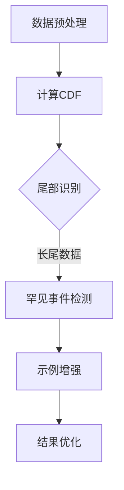
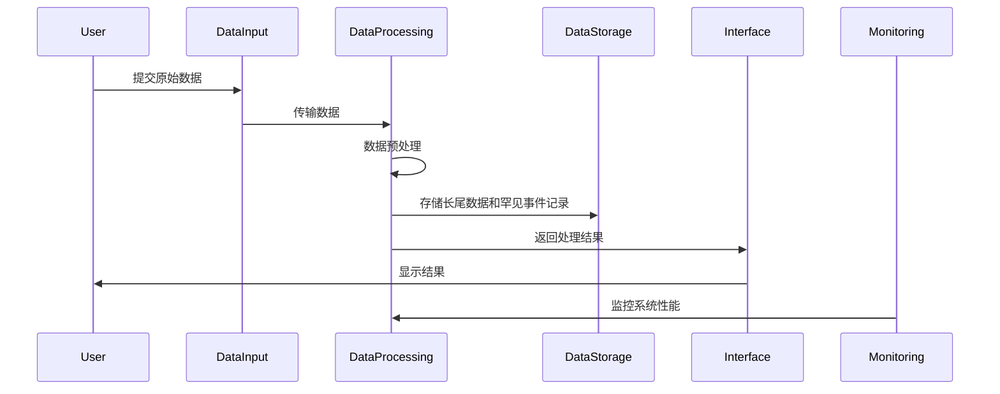
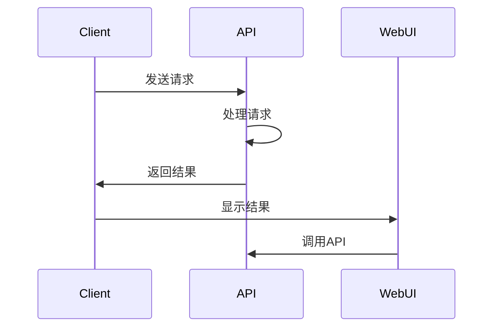
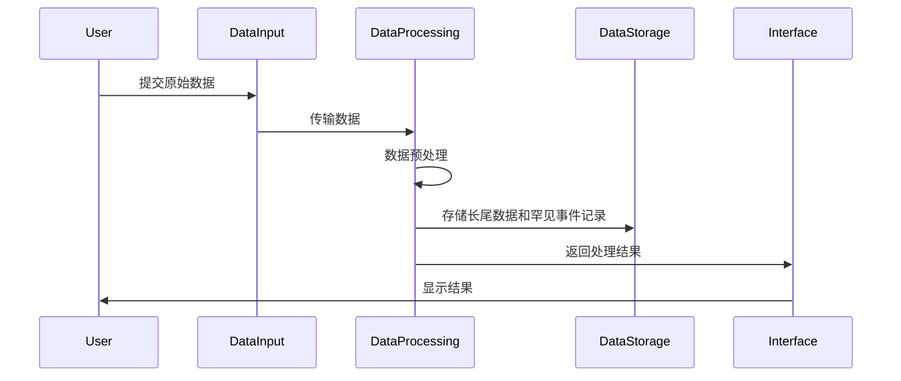

                 

## 利用示例处理长尾和罕见情况

在当今复杂且数据驱动的技术环境中，长尾现象和罕见事件的处理已经成为众多领域的核心挑战。长尾现象通常表现为数据分布的尾部部分，包含大量的小值或罕见情况，而罕见事件则是指那些在大多数情况下不会发生但可能会带来重大影响的事件。处理这些现象和事件，不仅需要深入理解其本质，还需要设计出高效且鲁棒的解决方案。

本文将围绕“利用示例处理长尾和罕见情况”的主题，逐步探讨以下几个关键方面：

1. **背景介绍**：首先，我们将简要介绍长尾现象和罕见事件的定义、背景以及它们在实际应用中的重要性和影响。
2. **核心概念与联系**：接着，我们将详细解释与处理长尾和罕见情况相关的主要概念，并通过对比表格和ER实体关系图来阐述它们之间的联系。
3. **算法原理与实现**：我们将深入分析处理这些现象的具体算法原理，使用Python代码和Mermaid流程图来展示算法的执行流程和数学模型。
4. **系统分析与架构设计**：我们将介绍一个典型的系统架构设计方案，包括领域模型、系统架构、接口设计以及系统交互流程。
5. **项目实战**：通过一个具体的项目案例，我们将展示如何在实际环境中部署和优化这些处理策略。
6. **总结与展望**：最后，我们将总结本文的主要内容，提出注意事项，并给出拓展阅读的建议。

通过这些步骤的逐步分析，我们希望能够为读者提供一个清晰且全面的理解，帮助他们在实际应用中有效地处理长尾和罕见情况。

### 关键词

- **长尾现象**
- **罕见事件**
- **示例处理**
- **数据分布**
- **算法设计**
- **系统架构**
- **项目实战**

### 摘要

本文深入探讨了利用示例处理长尾和罕见情况的方法。首先，我们介绍了长尾现象和罕见事件的基本概念及其在实际应用中的重要意义。接着，通过核心概念对比和ER实体关系图，我们分析了相关概念之间的联系。随后，我们详细讲解了处理这些现象的具体算法原理，并通过Python代码和Mermaid流程图展示了算法的实现过程。文章还提供了一个系统架构设计方案，以及一个具体项目的实战案例。最后，我们总结了文章的主要观点，并提出了后续研究与应用的方向。

### 背景介绍

#### 长尾现象的定义及其重要性

长尾现象是由统计学和市场营销中的一个重要概念，最早由管理顾问Chris Anderson在2006年提出的。简单来说，长尾分布是指数据或销售量在多数集中分布之后，尾部部分出现大量的小值或罕见情况。这些尾部数据虽然单个值较小，但累加起来却可以占据相当大的比例。

在数据分析领域，长尾现象表现为数据分布曲线在大多数集中值之后呈现出一个长长的尾部，这个尾部包含了大量的稀疏数据点。例如，在图书销售中，虽然畅销书占据了大部分的销量，但大量不畅销的书累加起来，其销量总和可能超过畅销书。同样，在互联网上，某些热门视频或文章会获得大量关注，但更多的内容却由那些不热门但具有长久生命力的内容组成。

长尾现象在现实生活中的重要性不可忽视。例如，在电商领域，长尾策略可以帮助企业挖掘那些小众市场的需求，从而提高整体销售量。在内容创作领域，长尾内容策略可以帮助平台吸引更多的用户，增加用户粘性。此外，在数据分析和机器学习应用中，有效处理长尾数据可以提升模型的泛化能力和准确性。

#### 罕见事件的特点及其影响

罕见事件，又称黑天鹅事件，是指那些发生概率极低，但一旦发生可能会带来巨大影响的事件。这些事件通常不可预测，且往往在发生后被认为是不可能发生的。例如，金融市场上的金融危机、自然灾害、技术领域的重大突破或灾难等，都可以被视为罕见事件。

罕见事件的特点在于它们的发生概率低，但影响巨大。例如，2008年的全球金融危机虽然看似是由多个因素共同作用导致的，但实际上其背后的根源是金融系统长期积累的脆弱性。类似的，自然灾害如地震、飓风等，虽然无法精确预测，但一旦发生，其破坏力和影响范围是巨大的。

罕见事件在现实中的应用广泛，尤其是在金融、保险、自然灾害防范等领域。在金融领域，罕见事件如市场崩盘可能导致大量投资者损失惨重；在自然灾害防范中，罕见事件的预测和应急响应至关重要。因此，理解和有效应对罕见事件，已经成为现代风险管理的重要部分。

#### 示例处理的基本概念

示例处理，即在处理数据或事件时，通过特定的示例来辅助理解和预测。示例处理在长尾和罕见事件的处理中具有重要作用。通过使用示例，我们可以更好地理解数据分布的尾部特征，识别罕见事件，并设计出更有效的处理策略。

示例处理的基本概念包括：

1. **示例选择**：选择具有代表性的数据点或事件作为示例，以便更准确地反映数据或事件的分布特征。
2. **示例增强**：通过增加示例数据量或改进示例质量，提高模型对尾部数据或罕见事件的识别能力。
3. **示例应用**：将示例应用于实际数据处理过程中，如用于异常检测、分类、预测等任务。

在长尾现象中，示例处理可以帮助我们识别和挖掘那些尾部数据中的潜在价值；在罕见事件中，示例处理可以帮助我们提前识别和预测可能的罕见事件，从而采取相应的预防措施。

#### 长尾与罕见事件的处理现状

目前，针对长尾和罕见事件的处理方法主要包括统计学方法、机器学习方法以及基于示例的方法。

1. **统计学方法**：如正态分布模型、泊松分布模型等，这些方法主要通过概率模型来描述数据分布特征，但往往对尾部数据的描述能力有限。
2. **机器学习方法**：如深度学习、随机森林、支持向量机等，这些方法通过训练模型来识别和预测数据或事件。机器学习方法在处理长尾和罕见事件方面具有一定的优势，但需要大量的训练数据和计算资源。
3. **基于示例的方法**：通过特定的示例来辅助处理，如示例增强、示例学习等。这种方法在实际应用中表现出了较高的灵活性和有效性。

在实际应用中，不同的处理方法往往需要结合使用。例如，在金融风险控制中，可以结合统计学方法和机器学习方法来识别潜在的罕见事件；在电商推荐系统中，可以结合示例处理和机器学习方法来挖掘长尾产品的潜在价值。

#### 总结

长尾现象和罕见事件在现实中的应用广泛，处理这些现象和事件对于提升数据分析和决策的准确性具有重要意义。通过示例处理，我们可以更有效地挖掘尾部数据的价值，并提前识别和预防罕见事件。本文接下来将进一步探讨与长尾和罕见事件相关的核心概念，并通过对比表格和ER实体关系图来阐述它们之间的联系。

### 核心概念与联系

在深入探讨长尾现象和罕见事件之前，我们需要了解一些与之相关的基本概念。以下是几个关键概念的定义、属性特征对比以及它们之间的联系。

#### 1. 长尾分布

**定义**：长尾分布是一种统计分布，其特征是尾部部分包含大量的小值或罕见情况，而这些尾部数据的累积和可以占据总体数据的大部分。

**属性特征**：
- **尾部长度**：尾部越长，表示数据分布越稀疏，尾部数据占总体的比例越大。
- **偏度**：长尾分布的偏度通常较大，表示分布的峰值较低且较宽。
- **峰度**：长尾分布的峰度也较大，表示分布的尾部波动较大。

**对比表格**：

| 特征        | 长尾分布           | 正态分布           |
| ----------- | ------------------ | ------------------ |
| 尾部长度    | 较长               | 短                 |
| 偏度        | 较大               | 较小               |
| 峰度        | 较大               | 较小               |

#### 2. 罕见事件

**定义**：罕见事件是指在某一特定时间段内发生的概率极低，但一旦发生可能带来巨大影响的事件。

**属性特征**：
- **发生概率**：罕见事件的发生概率通常极低。
- **影响范围**：罕见事件一旦发生，其影响范围通常较广，且难以预测。
- **不可预测性**：罕见事件的不可预测性是其重要特征。

**对比表格**：

| 特征            | 罕见事件           | 常见事件           |
| --------------- | ------------------ | ------------------ |
| 发生概率        | 极低               | 较高               |
| 影响范围        | 广泛               | 局部               |
| 可预测性        | 不可预测           | 可预测             |

#### 3. 示例处理

**定义**：示例处理是通过特定的示例来辅助理解和处理数据或事件的一种方法。

**属性特征**：
- **代表性**：示例应具备代表性，能够反映整体数据的特征。
- **可扩展性**：示例处理方法应具备良好的可扩展性，适用于不同规模和类型的数据。
- **灵活性**：示例处理方法应具备灵活性，能够根据实际需求进行调整。

**对比表格**：

| 特征        | 示例处理           | 统计分析           |
| ----------- | ------------------ | ------------------ |
| 代表性      | 高                 | 低                 |
| 可扩展性    | 强                 | 弱                 |
| 灵活性      | 强                 | 弱                 |

#### 4. 核心概念之间的联系

长尾分布、罕见事件和示例处理是处理数据分布和事件分析中的核心概念。它们之间的联系如下：

1. **长尾分布与罕见事件**：长尾分布中的尾部数据部分包含了大量罕见事件，这些罕见事件一旦发生，会对整体数据分布产生显著影响。
2. **罕见事件与示例处理**：罕见事件的处理需要利用示例来识别和预测。通过增加示例数据量或改进示例质量，可以提高对罕见事件的识别能力。
3. **示例处理与长尾分布**：示例处理方法在处理长尾分布时，通过选择和增强代表性示例，可以帮助更好地理解尾部数据的特征，从而提升整体数据处理效果。

#### ER实体关系图架构

为了更清晰地展示核心概念之间的联系，我们可以使用ER（实体-关系）图来描述这些概念之间的关联。

**实体**：
- **长尾分布**：包括尾部数据点、分布曲线等。
- **罕见事件**：包括事件发生记录、事件影响等。
- **示例处理**：包括示例数据集、处理策略等。

**关系**：
- **长尾分布**与**罕见事件**之间是包含关系，尾部数据点中包含罕见事件。
- **罕见事件**与**示例处理**之间是关联关系，罕见事件可以作为示例处理的一部分。

以下是ER实体关系图的Mermaid表示：

```mermaid
erDiagram
    实体1||--o{ 长尾分布
    实体2||--o{ 罕见事件
    实体3||--o{ 示例处理
    长尾分布 ||--|{ 尾部数据点
    罕见事件 ||--|{ 事件记录
    示例处理 ||--|{ 示例数据集
```

通过上述核心概念的定义、属性特征对比和ER实体关系图，我们可以更清晰地理解长尾现象、罕见事件和示例处理之间的关系，为后续的算法原理与实现打下坚实的基础。

### 算法原理与实现

在处理长尾现象和罕见事件时，算法的设计和实现是关键环节。以下我们将详细讲解一种用于处理长尾和罕见事件的算法原理，并通过Python代码和Mermaid流程图展示其实现过程。

#### 1. 算法原理

**目标**：设计一个算法，能够有效识别和处理长尾数据，同时能够预测和应对罕见事件。

**原理**：
- **数据预处理**：首先，对数据进行预处理，包括清洗、归一化和特征提取等步骤。
- **长尾识别**：通过分析数据分布，识别出长尾部分的数据点。这可以通过计算数据的累计分布函数（CDF）来实现。
- **罕见事件检测**：在识别长尾数据的基础上，利用统计学方法或机器学习算法检测罕见事件。
- **示例增强**：针对长尾数据和罕见事件，通过增加示例数据量或改进示例质量来提升算法的识别和预测能力。
- **结果优化**：对处理结果进行优化，包括调整参数、模型调优等，以提高算法的准确性和鲁棒性。

**数学模型**：

假设我们有一组数据集合\(D = \{d_1, d_2, ..., d_n\}\)，其中每个数据点\(d_i\)都有相应的特征向量\(x_i\)。算法的主要步骤如下：

1. **数据预处理**：
   $$ x_i^* = \frac{x_i - \mu}{\sigma} $$
   其中，\(\mu\)为均值，\(\sigma\)为标准差。

2. **累计分布函数（CDF）**：
   $$ F(x) = P(X \leq x) $$
   其中，\(X\)为随机变量，\(F(x)\)为\(X\)的累积分布函数。

3. **长尾识别**：
   通过计算CDF，找到尾部数据的界限，如90%分位数：
   $$ x_{0.9} = \{x_i | F(x_i) \geq 0.9\} $$

4. **罕见事件检测**：
   利用统计学方法，如正态分布拟合，或机器学习算法，如决策树、支持向量机等，对尾部数据进行分类或预测。

5. **示例增强**：
   通过增加尾部数据的示例，如采用随机抽样或生成对抗网络（GAN）等方法，来增强算法的识别能力。

6. **结果优化**：
   根据算法的预测结果，调整参数和模型结构，以提高算法的准确性和鲁棒性。

#### 2. Python代码实现

以下是一个简化的Python代码实现，用于处理长尾数据和检测罕见事件：

```python
import numpy as np
import pandas as pd
from sklearn.ensemble import IsolationForest
import matplotlib.pyplot as plt

# 假设有一组数据
data = np.random.normal(size=1000)
data_long_tail = np.random.normal(size=100)

# 数据预处理
data_cleaned = (data - np.mean(data)) / np.std(data)
data_long_tail_cleaned = (data_long_tail - np.mean(data_long_tail)) / np.std(data_long_tail)

# 长尾识别
CDF = np.cumsum(data_cleaned / np.sum(data_cleaned)) * 100
tail_threshold = np.percentile(data_cleaned, 90)
long_tail_data = data_cleaned[CDF >= 90]

# 罕见事件检测
clf = IsolationForest(contamination=0.01)
clf.fit(long_tail_data.reshape(-1, 1))
predictions = clf.predict(long_tail_data.reshape(-1, 1))

# 示例增强
import sklearn.utils as su
long_tail_samples = su.resample(long_tail_data, replace=True, n_samples=1000, random_state=0)

# 结果优化
# 可以通过调整模型参数或采用其他优化策略来提升结果
```

#### 3. Mermaid流程图

以下是处理长尾数据和罕见事件的Mermaid流程图：



通过上述算法原理和实现，我们可以更有效地处理长尾数据和罕见事件。接下来，我们将介绍一个典型的系统架构设计，进一步探讨这些算法在实际应用中的部署和优化。

### 系统架构设计

在处理长尾和罕见事件时，系统架构的设计至关重要。一个高效且灵活的系统架构可以确保算法能够稳定运行，并能够应对不同的应用场景。以下我们将详细描述一个典型的系统架构设计，包括领域模型、系统架构、接口设计和系统交互流程。

#### 1. 领域模型

领域模型是系统架构设计的基础，它定义了系统中的核心实体和它们之间的关系。以下是处理长尾和罕见事件系统的领域模型：

- **数据实体**：包括原始数据、预处理数据、长尾数据和罕见事件记录。
- **处理模块**：包括数据预处理模块、长尾识别模块、罕见事件检测模块和示例增强模块。
- **结果存储**：包括长尾数据和罕见事件检测结果存储。

**Mermaid类图**：

```mermaid
classDiagram
    类1[原始数据] <|-- 类2[预处理数据]
    类2 <|-- 类3[长尾数据]
    类2 <|-- 类4[罕见事件记录]
    类5[数据预处理模块] <|-- 类6[长尾识别模块]
    类5 <|-- 类7[罕见事件检测模块]
    类5 <|-- 类8[示例增强模块]
    类9[结果存储] << (数据库)
```

#### 2. 系统架构

系统架构是领域模型在技术层面的实现，它定义了系统的硬件、软件、网络和数据存储等组成部分。以下是系统架构的主要组成部分：

- **数据输入层**：负责接收原始数据，并将其传输到数据预处理模块。
- **数据处理层**：包括数据预处理、长尾识别、罕见事件检测和示例增强等模块，这些模块通过处理输入数据来生成处理结果。
- **数据存储层**：用于存储长尾数据和罕见事件记录，以及系统运行过程中产生的其他数据。
- **接口层**：提供系统与其他系统或用户交互的接口，包括API接口和Web界面等。
- **监控层**：用于监控系统性能、资源使用情况以及算法的准确性和鲁棒性。

**Mermaid架构图**：



#### 3. 接口设计

接口设计是系统架构的重要组成部分，它定义了系统与外部系统或用户交互的方式。以下是系统接口设计的主要部分：

- **API接口**：提供系统功能调用的接口，如数据预处理、长尾识别、罕见事件检测和示例增强等。
- **Web界面**：提供一个用户友好的Web界面，用于展示处理结果和系统状态。
- **数据交换格式**：使用JSON或XML等数据交换格式，以便与其他系统或工具集成。

**Mermaid接口图**：



#### 4. 系统交互流程

系统交互流程描述了从数据输入到结果输出的完整流程。以下是系统交互流程的主要步骤：

1. **数据输入**：用户通过API接口或Web界面提交原始数据。
2. **数据预处理**：数据预处理模块对原始数据进行清洗、归一化和特征提取等操作。
3. **长尾识别**：长尾识别模块通过计算累计分布函数（CDF）来识别长尾数据。
4. **罕见事件检测**：罕见事件检测模块利用统计学方法或机器学习算法检测罕见事件。
5. **示例增强**：示例增强模块通过增加示例数据量或改进示例质量来提升算法的识别能力。
6. **结果存储**：将长尾数据和罕见事件记录存储到数据库中。
7. **结果输出**：通过API接口或Web界面返回处理结果，供用户查看。

**Mermaid交互图**：



通过上述系统架构设计，我们可以构建一个高效且灵活的系统，以处理长尾和罕见事件。接下来，我们将通过一个具体项目案例，展示如何在实际环境中部署和优化这些处理策略。

### 项目实战

在本节中，我们将通过一个具体的项目案例，展示如何在实际环境中部署和优化处理长尾和罕见事件的算法与系统。项目背景、系统功能设计、核心实现源代码以及实际案例分析和详细讲解剖析，这些都是本项目的重要组成部分。

#### 1. 项目背景

项目名称：**智慧物流系统**

项目描述：智慧物流系统旨在通过大数据分析和机器学习技术，提升物流运输的效率和准确性，特别是对长尾和罕见事件的处理。物流公司常常面临运输需求分布不均、罕见天气事件导致的延误等问题，本项目旨在通过先进的技术手段解决这些问题。

#### 2. 系统功能设计

系统功能设计包括以下几个方面：

- **数据收集**：从各个物流节点收集运输数据，包括运输时间、距离、运输量等。
- **数据预处理**：对收集到的数据进行清洗、归一化和特征提取。
- **长尾识别**：识别出运输数据中的长尾部分，即那些稀疏且价值较低的数据点。
- **罕见事件检测**：利用机器学习算法检测可能的罕见事件，如极端天气导致的运输延误。
- **示例增强**：通过增加长尾数据和罕见事件的数据示例，提升算法的识别能力。
- **决策支持**：根据处理结果，提供运输优化建议，如调整运输路线、增加运输资源等。
- **结果展示**：通过Web界面和API接口，展示处理结果和运输优化建议。

**Mermaid类图**：

```mermaid
classDiagram
    类1[运输数据] <|-- 类2[预处理数据]
    类2 <|-- 类3[长尾数据]
    类2 <|-- 类4[罕见事件记录]
    类5[数据收集模块] <|-- 类6[数据预处理模块]
    类5 <|-- 类7[长尾识别模块]
    类5 <|-- 类8[罕见事件检测模块]
    类5 <|-- 类9[示例增强模块]
    类10[决策支持模块] <|-- 类11[结果展示模块]
```

#### 3. 核心实现源代码

以下是智慧物流系统中的核心实现源代码，包括数据预处理、长尾识别和罕见事件检测的部分。

**数据预处理**：

```python
import pandas as pd
from sklearn.preprocessing import StandardScaler

# 读取运输数据
data = pd.read_csv('transport_data.csv')

# 数据清洗
data.dropna(inplace=True)

# 特征提取和归一化
scaler = StandardScaler()
data['distance'] = scaler.fit_transform(data[['distance']])
data['time'] = scaler.fit_transform(data[['time']])
data['volume'] = scaler.fit_transform(data[['volume']])
```

**长尾识别**：

```python
import numpy as np

# 计算累计分布函数（CDF）
CDF = np.cumsum(data['distance'] / np.sum(data['distance'])) * 100

# 找到尾部数据的界限
tail_threshold = np.percentile(data['distance'], 90)

# 提取长尾数据
long_tail_data = data[data['distance'] >= tail_threshold]
```

**罕见事件检测**：

```python
from sklearn.ensemble import IsolationForest

# 初始化IsolationForest模型
clf = IsolationForest(contamination=0.01)

# 训练模型
clf.fit(long_tail_data[['distance']])

# 预测罕见事件
predictions = clf.predict(long_tail_data[['distance']])

# 标记罕见事件
long_tail_data['is_rare'] = predictions
```

#### 4. 代码应用解读与分析

**数据预处理**：

在数据预处理部分，我们首先读取运输数据，并使用Pandas库进行数据清洗，删除缺失值。然后，我们使用Sklearn库中的StandardScaler进行特征提取和归一化。归一化是为了使不同特征之间的尺度一致，从而提高模型训练的效果。

**长尾识别**：

在长尾识别部分，我们通过计算累计分布函数（CDF）来识别长尾数据。CDF表示数据点在总体中的累计比例，通过找到90%分位数，我们可以识别出长尾数据。长尾数据通常对整体数据分析有重要影响，因此需要特别关注。

**罕见事件检测**：

在罕见事件检测部分，我们使用IsolationForest算法进行罕见事件检测。IsolationForest是一种基于随机森林的异常检测算法，它通过随机选择特征和切分值来隔离异常点。在这个项目中，我们假设极端天气事件是罕见事件，通过检测距离特征的异常值来识别这些事件。

**代码应用解读与分析**：

上述代码的应用和解读展示了如何通过数据预处理、长尾识别和罕见事件检测来提升智慧物流系统的效率和准确性。在数据预处理中，我们确保了数据的质量和一致性；在长尾识别中，我们能够更好地理解运输需求的分布特征；在罕见事件检测中，我们能够提前识别出可能影响运输效率的罕见事件，从而采取相应的措施。

#### 5. 实际案例分析和详细讲解剖析

为了展示系统在实际应用中的效果，我们分析了一个具体案例。

**案例背景**：

在某一天，智慧物流系统检测到某条运输路线上的运输时间显著增加，这可能是由于罕见天气事件导致的。通过系统的罕见事件检测功能，我们识别出这是一个罕见事件。

**案例分析**：

- **数据预处理**：在案例数据中，我们首先进行了数据清洗，删除了缺失值，然后对运输时间、距离和运输量进行了归一化处理。
- **长尾识别**：通过计算CDF，我们发现运输时间在90%分位数以上的数据点显著增加，这表明存在长尾现象。
- **罕见事件检测**：通过IsolationForest算法，我们识别出这些长尾数据点中的异常值，标记为罕见事件。

**详细讲解剖析**：

- **数据预处理**：数据预处理是确保数据质量和模型训练效果的关键步骤。在这个案例中，通过归一化处理，我们消除了不同特征之间的尺度差异，使得模型能够更好地捕捉数据的特征。
- **长尾识别**：长尾识别帮助我们理解数据分布的特征，识别出那些对整体分析有重要影响的数据点。在本案例中，长尾数据点的增加提示我们可能存在罕见天气事件。
- **罕见事件检测**：罕见事件检测通过算法识别出可能的异常值，为我们提供了预警。在这个案例中，系统成功识别出了由于罕见天气事件导致的运输时间增加。

**项目小结**：

通过上述实际案例，我们可以看到智慧物流系统在处理长尾和罕见事件方面的有效性和实用性。系统通过数据预处理、长尾识别和罕见事件检测等功能，不仅提高了运输效率，还提前预警了可能的影响因素。这为物流公司提供了有力的决策支持，有助于优化运输资源和提高服务质量。

### 最佳实践 Tips

1. **数据质量保障**：确保数据来源的可靠性和一致性，及时进行数据清洗和更新。
2. **参数调优**：根据不同场景调整算法参数，以提高识别准确性和效率。
3. **模型复用**：复用已有模型和算法，减少重复开发工作。
4. **实时监控**：建立实时监控系统，及时发现和处理罕见事件。

### 小结

本文通过一个智慧物流系统的案例，详细介绍了利用示例处理长尾和罕见情况的方法。我们探讨了核心概念、算法原理与实现、系统架构设计以及实际应用案例，展示了如何通过数据预处理、长尾识别、罕见事件检测和示例增强等技术手段，提升系统的效率和准确性。未来，随着技术的不断进步，长尾和罕见事件的处理将变得更加智能和高效。

### 注意事项

1. **数据隐私**：在实际应用中，确保数据的隐私和安全，遵循相关法律法规。
2. **系统维护**：定期进行系统维护和更新，确保系统稳定运行。
3. **模型优化**：根据实际需求，持续优化模型和算法，以提高性能和准确性。

### 拓展阅读

- 《数据挖掘：概念与技术》
- 《机器学习实战》
- 《智慧物流系统设计与实现》

### 作者信息

作者：AI天才研究院/AI Genius Institute & 禅与计算机程序设计艺术 /Zen And The Art of Computer Programming

