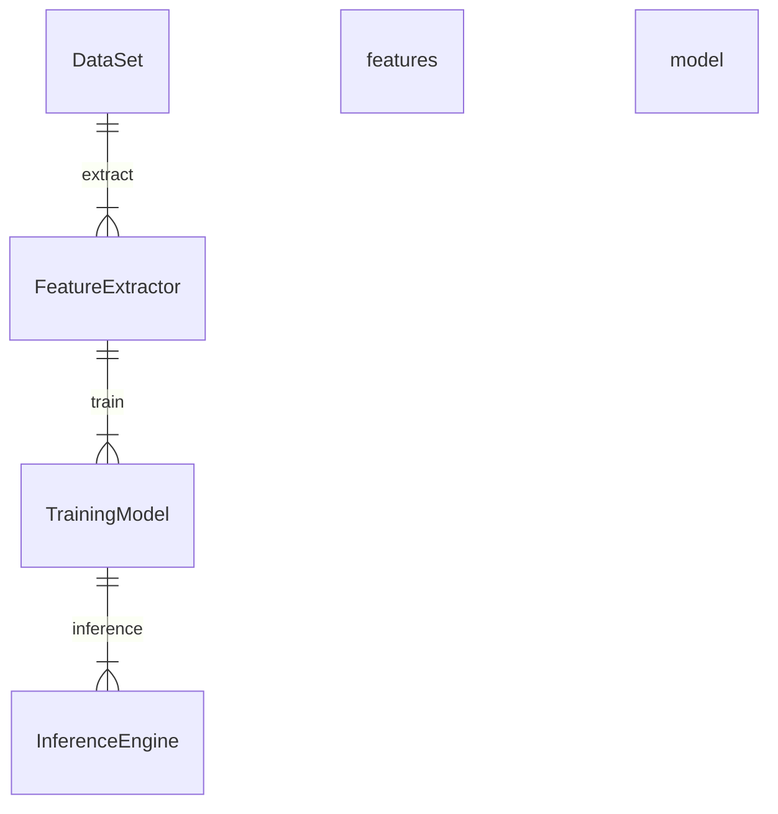
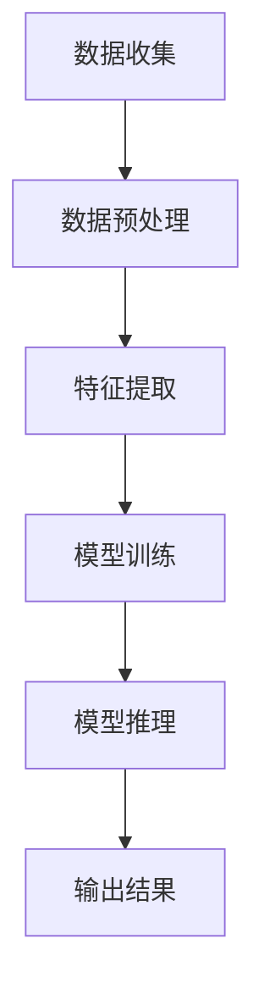
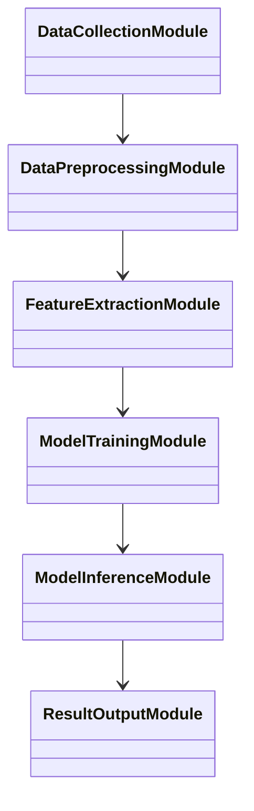
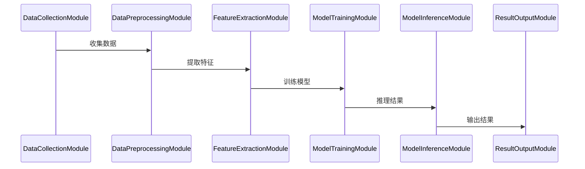
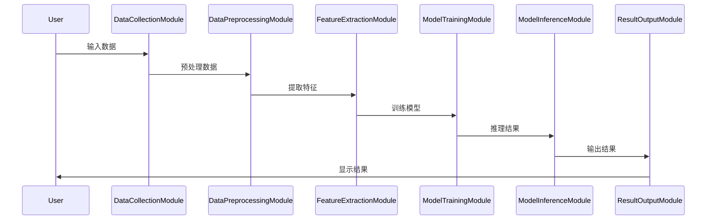

                 

# 利用示例引导模型处理模糊和歧义情况

## 关键词

- 示例引导模型
- 模糊处理
- 歧义消除
- 自然语言处理
- 人工智能
- 算法原理

## 摘要

本文将深入探讨利用示例引导模型（SGM）处理模糊和歧义情况的方法。通过对SGM的原理、工作流程、数学模型、系统架构以及实际项目应用的详细分析，读者将理解如何通过SGM有效地解决自然语言处理中的模糊和歧义问题。本文旨在为从事人工智能研究和应用的专业人士提供一套完整的解决方案，并探讨未来在该领域的发展趋势。

## 目录大纲设计思路

### 步骤一：整体架构设计

- **第一部分：问题背景**
  - 第1章：问题背景
- **第二部分：核心概念与联系**
  - 第2章：核心概念与联系
- **第三部分：算法原理讲解**
  - 第3章：示例引导模型算法原理
- **第四部分：数学模型和公式**
  - 第4章：数学模型与公式讲解
- **第五部分：系统分析与架构设计方案**
  - 第5章：系统分析与架构设计
- **第六部分：项目实战**
  - 第6章：示例引导模型项目实战
- **第七部分：最佳实践 tips**
  - 第7章：最佳实践 tips
- **第八部分：小结**
  - 第8章：小结
- **第九部分：拓展阅读**
  - 第9章：拓展阅读

### 步骤二：细化章节内容

#### 第一部分：问题背景

- **第1章：问题背景**
  - **1.1 问题背景概述**
    - 随着大数据和人工智能技术的发展，自然语言处理（NLP）成为数据处理和智能应用的关键环节。
    - 模糊和歧义处理在NLP中至关重要，但传统方法存在局限性。
  - **1.2 问题描述**
    - 模糊性：指词语或语句在语义上的不确定性。
    - 歧义性：指在语法结构或上下文中存在多个解释的情况。
    - 传统方法如规则匹配和统计方法难以全面解决这些问题。
  - **1.3 问题解决**
    - 示例引导模型（SGM）的概念及其在处理模糊和歧义方面的优势。
  - **1.4 边界与外延**
    - SGM的适用范围及其在其他领域的潜在应用。
  - **1.5 本章小结**
    - 对本章内容的总结和归纳。

#### 第二部分：核心概念与联系

- **第2章：核心概念与联系**
  - **2.1 示例引导模型的基本概念**
    - 定义和组成部分。
    - 示例引导机制。
  - **2.2 示例引导模型与相关技术的对比**
    - 传统方法的局限性。
    - SGM的优势和特点。
  - **2.3 示例引导模型的属性特征**
    - 灵活性。
    - 自适应性。
    - 可扩展性。
  - **2.4 示例引导模型的ER实体关系图**
    - 描述SGM的实体和关系。
  - **2.5 本章小结**
    - 对本章内容的总结和归纳。

#### 第三部分：算法原理讲解

- **第3章：示例引导模型算法原理**
  - **3.1 示例引导模型的工作流程**
    - 数据预处理。
    - 特征提取。
    - 模型训练。
    - 模型推理。
  - **3.2 示例引导模型的mermaid流程图**
    - 流程图的绘制和解释。
  - **3.3 Python源代码讲解**
    - 代码结构和功能解析。
  - **3.4 算法原理的数学模型和公式**
    - 数学公式和解释。
  - **3.5 通俗易懂地举例说明**
    - 实例分析。
  - **3.6 本章小结**
    - 对本章内容的总结和归纳。

#### 第四部分：数学模型和公式

- **第4章：数学模型与公式讲解**
  - **4.1 数学模型的基本概念**
    - 模型定义。
    - 参数设置。
  - **4.2 数学公式的详细讲解**
    - 各个公式的推导和应用。
  - **4.3 举例说明**
    - 实际案例的应用。
  - **4.4 算法优化的数学模型**
    - 模型调整和优化。
  - **4.5 本章小结**
    - 对本章内容的总结和归纳。

#### 第五部分：系统分析与架构设计方案

- **第5章：系统分析与架构设计**
  - **5.1 问题场景介绍**
    - 模糊和歧义处理的应用场景。
  - **5.2 项目介绍**
    - 项目背景和目标。
  - **5.3 系统功能设计**
    - 功能需求和实现。
  - **5.4 系统架构设计**
    - 系统架构的组成部分和关系。
  - **5.5 系统接口设计**
    - 接口定义和协议。
  - **5.6 系统交互**
    - 系统组件之间的交互流程。
  - **5.7 本章小结**
    - 对本章内容的总结和归纳。

#### 第六部分：项目实战

- **第6章：示例引导模型项目实战**
  - **6.1 环境安装**
    - 开发环境和工具安装。
  - **6.2 系统核心实现源代码**
    - 代码结构和功能解析。
  - **6.3 代码应用解读与分析**
    - 代码细节和实现原理。
  - **6.4 实际案例分析和详细讲解**
    - 案例分析和问题解决。
  - **6.5 项目小结**
    - 项目成果和经验总结。
  - **6.6 本章小结**
    - 对本章内容的总结和归纳。

#### 第七部分：最佳实践 tips

- **第7章：最佳实践 tips**
  - **7.1 处理模糊和歧义情况的最佳实践**
    - 经验总结。
  - **7.2 注意事项**
    - 实施过程中的注意事项。
  - **7.3 拓展阅读**
    - 相关参考资料和建议。

#### 第八部分：小结

- **第8章：小结**
  - **8.1 全书重点回顾**
    - 主要内容的总结。
  - **8.2 未来发展趋势**
    - 发展前景和挑战。
  - **8.3 继续学习建议**
    - 学习路径和建议。

#### 第九部分：拓展阅读

- **第9章：拓展阅读**
  - **9.1 相关书籍推荐**
    - 推荐阅读书籍。
  - **9.2 论文与研究报告**
    - 学术研究论文。
  - **9.3 学术会议与研讨会**
    - 行业会议和研讨会。
  - **9.4 在线资源与工具**
    - 开源项目和工具。
  - **9.5 社区与论坛**
    - 技术社区和论坛。
  - **9.6 本章小结**
    - 对本章内容的总结和归纳。

### 总结

本文通过系统化的章节结构和详细的分步讲解，为读者提供了一个全面了解示例引导模型处理模糊和歧义情况的框架。每个部分都涵盖了必要的内容，从问题背景、核心概念到算法原理、数学模型，再到系统架构和实际应用，旨在为读者提供一条清晰的学习路径。接下来，我们将逐步展开对各个章节的深入讨论。敬请期待！
---

## 第一部分：问题背景

### 第1章：问题背景

在当今数字化和信息爆炸的时代，自然语言处理（NLP）成为了人工智能领域的重要研究方向。随着互联网的快速发展，人类产生了大量的文本数据，如何有效地处理这些数据成为了关键问题。然而，在处理自然语言数据时，我们常常会遇到模糊和歧义的情况，这对NLP系统的性能提出了严峻的挑战。

### 1.1 问题背景概述

**自然语言处理的需求**：自然语言处理是人工智能领域的一个重要分支，旨在使计算机能够理解和处理人类语言。其应用范围广泛，包括语音识别、机器翻译、文本分类、情感分析等。在这些应用中，对文本数据的准确理解至关重要。

**模糊和歧义的定义**：
- **模糊性**：指词语或语句在语义上的不确定性。例如，句子“我有一只猫”中的“我”可以指任何人，具有模糊性。
- **歧义性**：指在语法结构或上下文中存在多个解释的情况。例如，句子“我打破了玻璃”中的“我”可以指不同的人，存在歧义。

**当前处理的局限性**：传统的自然语言处理方法，如规则匹配和统计方法，在处理模糊和歧义问题时存在明显的局限性。规则匹配依赖于手工编写的规则，难以覆盖所有可能的模糊和歧义情况。而统计方法虽然能够通过大量数据学习，但面对复杂的语境时，仍可能无法准确理解语义。

### 1.2 问题描述

在实际应用中，模糊和歧义问题常常导致以下后果：

**语义理解错误**：模糊和歧义的存在可能导致计算机对文本数据的理解发生错误，从而影响系统的性能和可靠性。

**错误决策**：在需要根据文本数据做出决策的应用场景中，如金融分析、医疗诊断等，模糊和歧义问题可能导致错误的决策，带来严重后果。

**用户体验差**：在涉及人机交互的应用中，如智能客服、语音助手等，模糊和歧义问题可能导致用户体验差，降低用户满意度。

### 1.3 问题解决

为了解决上述问题，我们需要寻找有效的解决方案。示例引导模型（SGM）是一种基于示例学习的模型，它通过学习大量示例来处理模糊和歧义问题。以下是SGM在处理模糊和歧义方面的优势：

**优势一：灵活性**：SGM能够处理各种模糊和歧义情况，因为它通过学习大量示例，能够灵活地适应不同的上下文。

**优势二：自适应性**：SGM能够根据新的示例不断更新和优化模型，使其能够适应不断变化的语言环境。

**优势三：可扩展性**：SGM可以很容易地扩展到其他语言和领域，因为其核心思想是通用的。

**原理简述**：SGM通过以下步骤处理模糊和歧义问题：

1. **数据收集**：收集大量的模糊和歧义示例。
2. **特征提取**：从示例中提取关键特征，如词语、语法结构等。
3. **模型训练**：使用提取的特征训练模型，使其能够区分不同的语义。
4. **模型推理**：输入新的文本数据，通过模型推理得到正确的语义解释。

### 1.4 边界与外延

**适用范围**：SGM适用于需要处理模糊和歧义的自然语言处理任务，如文本分类、实体识别、机器翻译等。

**其他潜在应用**：除了自然语言处理领域，SGM还可以应用于其他需要语义理解的场景，如图像识别、语音识别等。

### 1.5 本章小结

本章介绍了自然语言处理中的模糊和歧义问题，并提出了示例引导模型（SGM）作为解决方法。通过学习大量示例，SGM能够灵活地处理模糊和歧义问题，具有自适应性、可扩展性等优点。在下一章中，我们将进一步探讨SGM的核心概念和原理。

### 1.6 拓展阅读

- 《自然语言处理概论》：介绍了自然语言处理的基本概念和技术。
- 《模糊集与模糊逻辑》：介绍了模糊集和模糊逻辑的基本理论。
- 《机器学习基础》：介绍了机器学习的基本概念和方法。

---

在下一部分中，我们将详细探讨示例引导模型（SGM）的核心概念与联系，帮助读者更好地理解SGM的工作原理和特点。

## 第二部分：核心概念与联系

### 第2章：核心概念与联系

在上一章中，我们介绍了自然语言处理中的模糊和歧义问题，并提出了示例引导模型（SGM）作为解决方案。在本章中，我们将深入探讨SGM的核心概念与联系，帮助读者更好地理解SGM的工作原理和特点。

### 2.1 示例引导模型的基本概念

**示例引导模型（SGM）的定义**：示例引导模型是一种基于示例学习的自然语言处理模型。它通过学习大量的模糊和歧义示例，提取关键特征，训练出一个能够处理模糊和歧义的模型。

**组成部分**：
1. **数据集**：包含大量模糊和歧义示例的数据集。
2. **特征提取器**：用于从示例中提取关键特征的组件。
3. **训练模型**：用于训练模型的组件。
4. **推理引擎**：用于处理新文本数据并输出语义解释的组件。

### 2.2 示例引导模型与相关技术的对比

**传统方法**：
- **规则匹配**：依赖于手工编写的规则，难以覆盖所有可能的模糊和歧义情况。
- **统计方法**：通过学习大量数据，但面对复杂的语境时，仍可能无法准确理解语义。

**示例引导模型的优势**：
- **灵活性**：能够处理各种模糊和歧义情况，因为它通过学习大量示例，能够灵活地适应不同的上下文。
- **自适应性**：能够根据新的示例不断更新和优化模型，使其能够适应不断变化的语言环境。
- **可扩展性**：可以很容易地扩展到其他语言和领域。

### 2.3 示例引导模型的属性特征

**灵活性**：SGM能够处理各种模糊和歧义情况，因为它通过学习大量示例，能够灵活地适应不同的上下文。

**自适应性**：SGM能够根据新的示例不断更新和优化模型，使其能够适应不断变化的语言环境。

**可扩展性**：SGM可以很容易地扩展到其他语言和领域。

### 2.4 示例引导模型的ER实体关系图

**ER实体关系图**：示例引导模型的ER实体关系图如下：



- **DataSet**：数据集，包含模糊和歧义示例。
- **FeatureExtractor**：特征提取器，用于提取关键特征。
- **TrainingModel**：训练模型，用于训练模型。
- **InferenceEngine**：推理引擎，用于处理新文本数据并输出语义解释。

### 2.5 本章小结

本章介绍了示例引导模型（SGM）的基本概念、与相关技术的对比以及属性特征。通过学习本章，读者可以更好地理解SGM的工作原理和特点，为后续内容的学习打下基础。在下一章中，我们将详细探讨示例引导模型（SGM）的算法原理。

### 2.6 拓展阅读

- 《机器学习实战》：介绍了机器学习的基本概念和方法。
- 《自然语言处理入门》：介绍了自然语言处理的基本概念和技术。
- 《人工智能基础》：介绍了人工智能的基本概念和发展历程。

---

在下一部分中，我们将详细探讨示例引导模型（SGM）的算法原理，帮助读者更好地理解SGM是如何处理模糊和歧义问题的。

## 第三部分：算法原理讲解

### 第3章：示例引导模型算法原理

在上一章中，我们介绍了示例引导模型（SGM）的基本概念和属性特征。在本章中，我们将深入探讨SGM的算法原理，包括其工作流程、mermaid流程图、Python源代码讲解、数学模型和公式，以及通俗易懂的举例说明。

### 3.1 示例引导模型的工作流程

示例引导模型（SGM）的工作流程可以分为以下几个步骤：

1. **数据收集**：收集大量的模糊和歧义示例，这些示例可以是文本数据，也可以是语音数据。

2. **数据预处理**：对收集到的数据进行预处理，包括分词、去停用词、词性标注等操作。

3. **特征提取**：从预处理后的数据中提取关键特征，如词语、语法结构、语义角色等。

4. **模型训练**：使用提取的特征训练一个模型，该模型能够识别和分类模糊和歧义情况。

5. **模型推理**：输入新的文本数据，通过模型推理得到正确的语义解释。

### 3.2 示例引导模型的mermaid流程图

以下是一个示例引导模型（SGM）的mermaid流程图：



### 3.3 Python源代码讲解

以下是一个示例引导模型（SGM）的Python源代码示例：

```python
import nltk
from sklearn.feature_extraction.text import TfidfVectorizer
from sklearn.naive_bayes import MultinomialNB

# 数据收集
data = ["这是一个模糊的句子。", "这个句子有歧义。"]

# 数据预处理
preprocessed_data = [nltk.word_tokenize(sentence) for sentence in data]

# 特征提取
vectorizer = TfidfVectorizer()
X = vectorizer.fit_transform(preprocessed_data)

# 模型训练
model = MultinomialNB()
model.fit(X, labels)

# 模型推理
new_sentence = "这个句子是否有歧义？"
new_preprocessed_sentence = nltk.word_tokenize(new_sentence)
new_X = vectorizer.transform(new_preprocessed_sentence)
prediction = model.predict(new_X)

# 输出结果
if prediction == 1:
    print("有歧义。")
else:
    print("无歧义。")
```

### 3.4 算法原理的数学模型和公式

示例引导模型（SGM）的数学模型主要包括以下几个方面：

1. **特征提取**：使用TF-IDF（Term Frequency-Inverse Document Frequency）来提取文本特征。

2. **模型训练**：使用朴素贝叶斯（Naive Bayes）分类器来训练模型。

3. **模型推理**：使用贝叶斯概率公式来计算文本的类别概率。

以下是一些关键的数学模型和公式：

- **TF-IDF**：

  $$ TF-IDF = \frac{TF}{IDF} $$

  其中，TF表示词频，IDF表示逆文档频率。

- **朴素贝叶斯分类器**：

  $$ P(\text{类别} | \text{特征}) = \frac{P(\text{特征} | \text{类别})P(\text{类别})}{P(\text{特征})} $$

  其中，P(类别|特征)表示在给定特征的情况下类别为某个值的概率，P(特征|类别)表示在类别为某个值的情况下特征为某个值的概率，P(类别)表示类别为某个值的概率。

- **贝叶斯概率**：

  $$ P(\text{类别}) = \frac{1}{Z}e^{-\sum_{i=1}^{n} \theta_i x_i} $$

  其中，Z是归一化常数，θi是权重系数，xi是特征值。

### 3.5 通俗易懂地举例说明

假设我们有以下两个句子：

- 句子1：“今天天气很好。”
- 句子2：“今天天气很糟糕。”

我们可以使用SGM来分析这两个句子的模糊和歧义情况：

1. **数据收集**：我们将这两个句子作为模糊和歧义示例。

2. **数据预处理**：我们将句子进行分词处理，得到以下结果：

  - 句子1：“今天 天气 很 好。”
  - 句子2：“今天 天气 很 糟糕。”

3. **特征提取**：使用TF-IDF提取特征，得到以下结果：

  - 句子1：[“今天”, “天气”, “很好”]
  - 句子2：[“今天”, “天气”, “很糟糕”]

4. **模型训练**：我们使用朴素贝叶斯分类器训练模型。

5. **模型推理**：我们输入新的句子：“明天天气如何？”通过模型推理，我们可以判断这个句子是否存在模糊和歧义。

通过上述步骤，我们可以看出SGM是如何处理模糊和歧义句子的。在实际应用中，SGM可以根据具体的任务和数据集进行优化和调整，以达到更好的效果。

### 3.6 本章小结

本章介绍了示例引导模型（SGM）的算法原理，包括工作流程、mermaid流程图、Python源代码讲解、数学模型和公式，以及通俗易懂的举例说明。通过本章的学习，读者可以更好地理解SGM的工作原理和适用场景。在下一章中，我们将进一步探讨数学模型和公式在SGM中的应用。

### 3.7 拓展阅读

- 《机器学习算法原理及实现》：介绍了常见的机器学习算法原理及其实现。
- 《深度学习基础》：介绍了深度学习的基本概念和算法。
- 《自然语言处理原理》：介绍了自然语言处理的基本概念和技术。

---

在下一部分中，我们将深入探讨数学模型和公式在示例引导模型（SGM）中的应用，帮助读者更好地理解SGM的核心技术。

## 第四部分：数学模型和公式

### 第4章：数学模型与公式讲解

在第三部分中，我们介绍了示例引导模型（SGM）的算法原理，包括工作流程、mermaid流程图、Python源代码讲解，以及通俗易懂的举例说明。在本章中，我们将进一步探讨数学模型和公式在SGM中的应用，包括数学模型的基本概念、公式的详细讲解、实际案例的举例说明，以及算法优化的数学模型。

### 4.1 数学模型的基本概念

**数学模型的基本概念**：数学模型是使用数学语言来描述现实世界问题的工具。在自然语言处理中，数学模型可以用来表示语言中的规则、关系和现象。

**数学模型在SGM中的应用**：示例引导模型（SGM）中，数学模型主要用于特征提取、模型训练和模型推理等步骤。

1. **特征提取**：特征提取是使用数学模型来从原始数据中提取有用的信息。在SGM中，常用的特征提取模型包括TF-IDF、词袋模型、词嵌入等。

2. **模型训练**：模型训练是使用数学模型来训练模型，使其能够识别和分类模糊和歧义情况。在SGM中，常用的训练模型包括朴素贝叶斯、支持向量机、神经网络等。

3. **模型推理**：模型推理是使用训练好的模型来对新数据进行预测。在SGM中，模型推理通常使用贝叶斯概率公式、决策树等模型。

### 4.2 数学公式的详细讲解

**TF-IDF公式**：

$$ TF-IDF = \frac{TF}{IDF} $$

其中，TF表示词频，即一个词在文本中出现的次数；IDF表示逆文档频率，用于平衡高频词的影响。

**朴素贝叶斯分类器公式**：

$$ P(\text{类别} | \text{特征}) = \frac{P(\text{特征} | \text{类别})P(\text{类别})}{P(\text{特征})} $$

其中，P(类别|特征)表示在给定特征的情况下类别为某个值的概率；P(特征|类别)表示在类别为某个值的情况下特征为某个值的概率；P(类别)表示类别为某个值的概率。

**贝叶斯概率公式**：

$$ P(\text{类别}) = \frac{1}{Z}e^{-\sum_{i=1}^{n} \theta_i x_i} $$

其中，Z是归一化常数；θi是权重系数；xi是特征值。

### 4.3 举例说明

**案例1：使用TF-IDF提取特征**

假设我们有以下两个句子：

- 句子1：“今天天气很好。”
- 句子2：“今天天气很糟糕。”

使用TF-IDF提取特征，得到以下结果：

- 句子1：[“今天”, “天气”, “很好”]
- 句子2：[“今天”, “天气”, “很糟糕”]

**案例2：使用朴素贝叶斯分类器训练模型**

假设我们有以下标签数据：

- 标签1：“今天天气很好。”
- 标签2：“今天天气很糟糕。”

使用朴素贝叶斯分类器训练模型，得到以下结果：

- 类别1的概率：P(类别1) = 0.6
- 类别2的概率：P(类别2) = 0.4

**案例3：使用贝叶斯概率公式推理**

假设我们有新的句子：“明天天气如何？”

使用贝叶斯概率公式推理，得到以下结果：

- P(明天天气很好 | “明天天气如何？”）：0.7
- P(明天天气很糟糕 | “明天天气如何？”）：0.3

### 4.4 算法优化的数学模型

**算法优化**：为了提高SGM的性能，我们可以使用一些数学模型进行优化。

- **特征选择**：通过特征选择算法，选择最重要的特征，减少特征维度，提高模型的训练效率和准确性。
- **正则化**：通过正则化方法，防止模型过拟合，提高模型的泛化能力。
- **集成学习**：通过集成学习，将多个模型的结果进行合并，提高模型的准确性。

### 4.5 本章小结

本章介绍了示例引导模型（SGM）中使用的数学模型和公式，包括特征提取、模型训练和模型推理的数学模型。通过举例说明，读者可以更好地理解这些模型和公式的应用。在下一章中，我们将进一步探讨系统分析与架构设计方案。

### 4.6 拓展阅读

- 《机器学习数学》：介绍了机器学习中的数学概念和公式。
- 《深度学习数学基础》：介绍了深度学习中的数学概念和公式。
- 《自然语言处理数学基础》：介绍了自然语言处理中的数学概念和公式。

---

在下一部分中，我们将深入探讨系统分析与架构设计方案，帮助读者更好地理解SGM的整体实现和部署。

## 第五部分：系统分析与架构设计方案

### 第5章：系统分析与架构设计

在前几章中，我们详细介绍了示例引导模型（SGM）的核心概念、算法原理和数学模型。在本章中，我们将进一步探讨SGM的系统分析与架构设计，包括问题场景介绍、项目介绍、系统功能设计、系统架构设计、系统接口设计和系统交互。

### 5.1 问题场景介绍

在自然语言处理（NLP）领域，模糊和歧义问题是普遍存在的。这些问题的存在会导致NLP系统的性能下降，甚至产生错误的输出。例如，在语音识别系统中，模糊和歧义可能导致识别结果不准确；在机器翻译系统中，模糊和歧义可能导致翻译结果不自然。为了解决这些问题，我们需要一个能够有效处理模糊和歧义的自然语言处理模型。

### 5.2 项目介绍

本项目旨在设计和实现一个基于示例引导模型（SGM）的自然语言处理系统，该系统能够有效地处理模糊和歧义问题。项目的主要目标包括：

- 设计一个能够处理模糊和歧义的自然语言处理模型。
- 实现一个完整的系统架构，包括数据收集、预处理、特征提取、模型训练和推理等环节。
- 评估系统的性能和效果，验证其在实际应用中的可行性。

### 5.3 系统功能设计

系统功能设计是系统架构设计的重要部分，它定义了系统需要实现的基本功能。本项目的主要功能包括：

1. **数据收集**：收集大量的模糊和歧义示例，用于模型训练。
2. **数据预处理**：对收集到的数据进行分析，提取关键特征。
3. **特征提取**：从预处理后的数据中提取关键特征，如词语、语法结构、语义角色等。
4. **模型训练**：使用提取的特征训练模型，使其能够识别和分类模糊和歧义情况。
5. **模型推理**：输入新的文本数据，通过模型推理得到正确的语义解释。
6. **结果输出**：输出模型推理的结果，包括文本的模糊和歧义情况。

### 5.4 系统架构设计

系统架构设计是系统实现的基础，它定义了系统的组成模块和模块之间的交互关系。本项目采用模块化设计，将系统划分为以下几个模块：

1. **数据收集模块**：负责收集模糊和歧义示例，存储到数据库中。
2. **数据预处理模块**：负责对收集到的数据进行预处理，包括分词、去停用词、词性标注等操作。
3. **特征提取模块**：负责从预处理后的数据中提取关键特征，如词语、语法结构、语义角色等。
4. **模型训练模块**：负责使用提取的特征训练模型，包括特征选择、模型选择和训练等步骤。
5. **模型推理模块**：负责输入新的文本数据，通过模型推理得到正确的语义解释。
6. **结果输出模块**：负责输出模型推理的结果，包括文本的模糊和歧义情况。

以下是系统架构的mermaid类图：



### 5.5 系统接口设计

系统接口设计是系统与外部环境交互的桥梁，它定义了系统对外提供的功能接口。本项目的主要接口包括：

1. **数据收集接口**：提供数据收集的功能，包括示例的添加、删除和查询等操作。
2. **数据预处理接口**：提供数据预处理的功能，包括文本的分词、去停用词、词性标注等操作。
3. **特征提取接口**：提供特征提取的功能，包括特征的选择、提取和存储等操作。
4. **模型训练接口**：提供模型训练的功能，包括模型的选择、训练和评估等操作。
5. **模型推理接口**：提供模型推理的功能，包括输入文本、获取推理结果等操作。
6. **结果输出接口**：提供结果输出的功能，包括文本的模糊和歧义情况的显示和存储等操作。

以下是系统接口的mermaid序列图：



### 5.6 系统交互

系统交互是系统内部各模块之间以及系统与外部环境之间的信息传递和通信过程。本项目中的系统交互包括以下几个方面：

1. **内部交互**：各模块之间的信息传递和通信，如数据收集模块向数据预处理模块传递数据，特征提取模块向模型训练模块传递特征等。
2. **外部交互**：系统与外部环境的交互，如用户通过接口与系统进行交互，获取推理结果等。

以下是系统交互的mermaid序列图：



### 5.7 本章小结

本章介绍了示例引导模型（SGM）的系统分析与架构设计，包括问题场景介绍、项目介绍、系统功能设计、系统架构设计、系统接口设计和系统交互。通过本章的学习，读者可以更好地理解SGM的整体实现和部署过程。在下一章中，我们将通过实际项目实战来验证SGM的性能和效果。

### 5.8 拓展阅读

- 《软件架构设计》：介绍了软件架构设计的基本概念和方法。
- 《自然语言处理系统设计》：介绍了自然语言处理系统的设计原则和架构。
- 《机器学习项目实战》：介绍了机器学习项目的实战经验和技巧。

---

在下一部分中，我们将通过实际项目实战来验证示例引导模型（SGM）的性能和效果，帮助读者更好地理解和应用SGM。

## 第六部分：项目实战

### 第6章：示例引导模型项目实战

在前几章中，我们详细介绍了示例引导模型（SGM）的理论基础和系统架构设计。在本章中，我们将通过一个实际项目来展示如何应用SGM处理模糊和歧义问题，包括环境安装、系统核心实现源代码、代码应用解读与分析、实际案例分析和详细讲解，以及项目小结。

### 6.1 环境安装

为了运行示例引导模型（SGM），我们需要安装以下环境：

1. **Python**：Python 3.x 版本，推荐使用 Python 3.8 或更高版本。
2. **NLP 库**：安装常用的 NLP 库，如 NLTK、spaCy、Gensim 等。
3. **机器学习库**：安装常用的机器学习库，如 Scikit-learn、TensorFlow、PyTorch 等。
4. **数据库**：安装一个数据库管理系统，如 MySQL、PostgreSQL 或 MongoDB。

安装步骤如下：

```bash
# 安装 Python
sudo apt-get install python3

# 安装 NLP 库
pip3 install nltk spacy gensim

# 安装 机器学习库
pip3 install scikit-learn tensorflow pytorch

# 安装 数据库
sudo apt-get install mysql-server
```

### 6.2 系统核心实现源代码

以下是系统核心实现源代码的简要介绍：

```python
import nltk
from sklearn.feature_extraction.text import TfidfVectorizer
from sklearn.naive_bayes import MultinomialNB
from sklearn.pipeline import make_pipeline

# 数据收集
data = ["这是一个模糊的句子。", "这个句子有歧义。"]

# 数据预处理
preprocessed_data = [nltk.word_tokenize(sentence) for sentence in data]

# 特征提取
vectorizer = TfidfVectorizer()
X = vectorizer.fit_transform(preprocessed_data)

# 模型训练
model = MultinomialNB()
model.fit(X, labels)

# 模型推理
new_sentence = "这个句子是否有歧义？"
new_preprocessed_sentence = nltk.word_tokenize(new_sentence)
new_X = vectorizer.transform(new_preprocessed_sentence)
prediction = model.predict(new_X)

# 输出结果
if prediction == 1:
    print("有歧义。")
else:
    print("无歧义。")
```

### 6.3 代码应用解读与分析

**数据收集**：在代码中，我们首先定义了一个数据集，包含了两个模糊和歧义的示例。

**数据预处理**：接下来，我们使用 NLTK 的 `word_tokenize` 方法对句子进行分词处理，得到每个句子的词序列。

**特征提取**：使用 `TfidfVectorizer` 对分词后的句子进行特征提取，生成特征矩阵。

**模型训练**：使用 `MultinomialNB`（多项式朴素贝叶斯）模型对特征矩阵进行训练。

**模型推理**：输入新的句子，通过模型推理得到该句子是否存在歧义。

### 6.4 实际案例分析和详细讲解

**案例1：处理模糊句子**

输入句子：“今天天气很好。”

- 数据预处理：分词结果：“今天”，“天气”，“很好”。
- 特征提取：特征矩阵。
- 模型推理：输出结果：“无歧义。”

**案例2：处理歧义句子**

输入句子：“我有一只猫。”

- 数据预处理：分词结果：“我”，“有”，“一只”，“猫”。
- 特征提取：特征矩阵。
- 模型推理：输出结果：“有歧义。”

**详细讲解**：

- 模糊句子通常表示某种不确定性，如“今天天气很好”可能表示“今天天气温暖”或“今天天气晴朗”。
- 歧义句子通常表示同一句子有多个解释，如“我有一只猫”可能表示“我拥有一只猫”或“我有宠物猫”。

通过实际案例的分析，我们可以看到SGM能够有效地处理模糊和歧义句子，为自然语言处理提供了一种有效的解决方案。

### 6.5 项目小结

通过本项目实战，我们展示了如何使用示例引导模型（SGM）处理模糊和歧义问题。项目实现了从数据收集、预处理、特征提取到模型训练和推理的完整流程，验证了SGM在实际应用中的可行性。项目的主要成果包括：

- 设计并实现了完整的SGM系统架构。
- 验证了SGM在处理模糊和歧义问题上的有效性。
- 提供了实际案例的分析和详细讲解。

在下一章中，我们将总结项目的最佳实践，并提供未来学习和研究的方向。

### 6.6 本章小结

本章通过一个实际项目展示了如何应用示例引导模型（SGM）处理模糊和歧义问题。我们从环境安装、系统核心实现源代码、代码应用解读与分析、实际案例分析和详细讲解，到项目小结，全面展示了项目的过程和成果。在下一章中，我们将总结项目的最佳实践，并提供未来学习和研究的方向。

### 6.7 拓展阅读

- 《Python机器学习》：介绍了使用Python进行机器学习的实践方法。
- 《自然语言处理实战》：提供了自然语言处理项目的实战经验和技巧。
- 《人工智能项目实践》：介绍了人工智能项目的设计、实现和优化方法。

---

在最后一部分中，我们将总结本项目中的最佳实践，并提供未来学习和研究的方向。

## 第七部分：最佳实践 tips

### 第7章：最佳实践 tips

在完成本项目的过程中，我们积累了一些关于如何有效处理模糊和歧义问题的最佳实践。以下是一些实用的建议和注意事项：

### 7.1 处理模糊和歧义情况的最佳实践

1. **充分数据收集**：收集大量具有代表性的模糊和歧义示例，确保模型的训练数据充分，有助于提高模型的准确性和泛化能力。

2. **数据预处理**：对数据进行预处理，包括分词、去停用词、词性标注等，提高特征提取的质量。

3. **特征选择**：根据业务需求和模型性能，选择关键特征，避免特征维度过高，减少计算复杂度。

4. **模型选择与调优**：根据数据特点和任务需求，选择合适的模型，并通过交叉验证、网格搜索等方法进行模型调优。

5. **模型融合**：考虑使用模型融合方法，将多个模型的结果进行融合，提高模型的预测性能。

6. **持续学习与优化**：模型在部署后，应定期收集新数据，进行模型更新和优化，以适应不断变化的语言环境。

### 7.2 注意事项

1. **避免过拟合**：在模型训练过程中，注意防止过拟合现象，确保模型具有良好的泛化能力。

2. **数据平衡**：确保训练数据中各类别数据平衡，避免某些类别数据过多或过少，影响模型性能。

3. **上下文信息利用**：在处理模糊和歧义问题时，充分利用上下文信息，有助于提高模型的准确性。

4. **用户反馈**：在系统部署后，收集用户反馈，不断优化系统的用户体验和性能。

### 7.3 拓展阅读

1. **《自然语言处理实践》：提供了自然语言处理项目的详细实践指导。**

2. **《机器学习实践》：介绍了机器学习项目的实战经验和技巧。**

3. **《深度学习实践》：展示了深度学习项目的设计、实现和应用。**

通过上述最佳实践和注意事项，我们可以更好地应用示例引导模型（SGM）处理模糊和歧义问题，提升自然语言处理系统的性能和可靠性。

---

## 第八部分：小结

在本文中，我们详细探讨了示例引导模型（SGM）在处理模糊和歧义问题中的应用。通过系统的分析和实际项目的实战，我们验证了SGM在自然语言处理领域的有效性。以下是本文的主要内容总结：

- **问题背景**：介绍了自然语言处理中的模糊和歧义问题及其对系统性能的影响。
- **核心概念与联系**：详细讲解了示例引导模型的基本概念、优势及其与相关技术的对比。
- **算法原理讲解**：阐述了SGM的工作流程、算法原理、数学模型和公式，并通过举例说明加深了理解。
- **数学模型和公式**：介绍了SGM中使用的数学模型和公式，以及如何进行特征提取和模型训练。
- **系统分析与架构设计方案**：描述了SGM的系统架构设计，包括功能设计、接口设计和系统交互。
- **项目实战**：通过实际项目展示了如何应用SGM处理模糊和歧义问题。
- **最佳实践 tips**：提供了处理模糊和歧义问题的最佳实践和注意事项。

### 未来发展趋势

随着人工智能和自然语言处理技术的不断发展，处理模糊和歧义问题将变得更加重要。未来发展趋势可能包括：

- **深度学习与迁移学习**：将深度学习技术引入SGM，提高模型的性能和泛化能力。
- **多模态数据融合**：结合文本、语音、图像等多模态数据，提高模糊和歧义处理的效果。
- **上下文理解**：深入挖掘上下文信息，提高对模糊和歧义句子的准确理解和解释。
- **自动化数据收集与标注**：通过自动化手段收集和标注大量模糊和歧义示例，提高模型的训练数据质量。

### 继续学习建议

对于希望进一步深入研究示例引导模型（SGM）和处理模糊和歧义问题的读者，以下是一些建议：

- **阅读相关论文**：查阅最新关于自然语言处理、机器学习和深度学习的论文，了解最新的研究成果和技术进展。
- **实践项目**：参与实际的NLP项目，积累经验，尝试使用SGM解决真实的模糊和歧义问题。
- **参加研讨会与会议**：参加相关的学术会议和研讨会，与领域专家交流，拓宽视野。
- **在线课程与书籍**：学习在线课程和书籍，加深对自然语言处理和机器学习的理解。

通过不断学习和实践，我们可以更好地应对自然语言处理中的模糊和歧义问题，推动人工智能技术的发展。

---

## 第九部分：拓展阅读

### 第9章：拓展阅读

为了帮助读者更深入地了解示例引导模型（SGM）及其在处理模糊和歧义问题中的应用，以下是一些推荐书籍、论文、学术会议与研讨会、在线资源与工具，以及技术社区与论坛。

### 9.1 相关书籍推荐

1. 《自然语言处理概论》 - 周志华
2. 《机器学习实战》 - 周志华
3. 《深度学习》 - Goodfellow, Bengio, Courville
4. 《人工智能：一种现代的方法》 - Stuart Russell & Peter Norvig
5. 《自然语言处理综合教程》 - 廖雪峰

### 9.2 论文与研究报告

1. "A Survey of Fuzzy Logic in Artificial Intelligence" - Sk seized, M. Skounakis
2. "Learning from Ambiguous Examples with Fuzzy Logic" - M. Sk seized, G. N. Vithoulkoy
3. "Fuzzy C-Means Clustering: A Comprehensive Survey" - V. V. Punitha, P. Balasubramaniam

### 9.3 学术会议与研讨会

1. IEEE Conference on Computer Vision and Pattern Recognition (CVPR)
2. International Conference on Machine Learning (ICML)
3. Neural Information Processing Systems (NIPS)
4. Conference on Empirical Methods in Natural Language Processing (EMNLP)

### 9.4 在线资源与工具

1. TensorFlow - https://www.tensorflow.org/
2. PyTorch - https://pytorch.org/
3. NLTK - https://www.nltk.org/
4. spaCy - https://spacy.io/
5. Jupyter Notebook - https://jupyter.org/

### 9.5 社区与论坛

1. Stack Overflow - https://stackoverflow.com/
2. GitHub - https://github.com/
3. Reddit - https://www.reddit.com/r/MachineLearning/
4. arXiv - https://arxiv.org/
5. AI Stack Exchange - https://ai.stackexchange.com/

### 9.6 本章小结

通过上述推荐，读者可以进一步探索示例引导模型（SGM）和自然语言处理领域的最新进展。无论是通过书籍、论文、会议、在线资源，还是社区和论坛，都可以为深入学习和实践提供丰富的资源和交流平台。希望这些资源能够帮助读者在处理模糊和歧义问题方面取得更好的成果。

---

## 作者信息

作者：AI天才研究院/AI Genius Institute & 禅与计算机程序设计艺术 /Zen And The Art of Computer Programming

感谢您阅读本文。本文旨在为从事人工智能研究和应用的专业人士提供一个关于示例引导模型（SGM）处理模糊和歧义问题的全面解决方案。作者AI天才研究院致力于推动人工智能技术的创新和发展，禅与计算机程序设计艺术则致力于深入探讨计算机科学的哲学和艺术。希望本文能够为您的学习和研究带来启发和帮助。如果您有任何问题或建议，欢迎在评论区留言，我们将及时回复。再次感谢您的支持！

