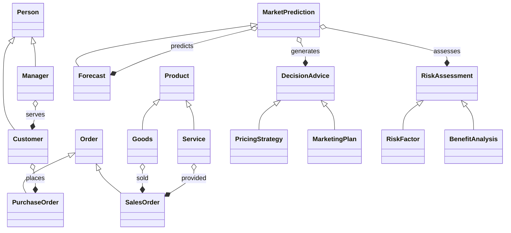
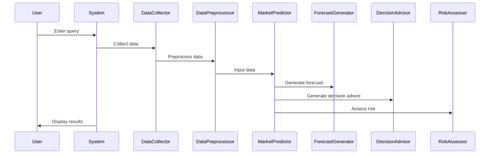

                 

### 第1章: 反事实推理概述

#### 1.1 问题背景

反事实推理是一种基于现实情况推测“如果...会发生什么？”的推理过程。它是人工智能领域中一个重要的研究方向，旨在帮助计算机系统在面对不确定性和复杂情境时，能够做出合理的推断和决策。在日常生活中，人们常常进行反事实推理，例如思考“如果今天不下雨，我们会去哪里玩？”或“如果我不加班，现在会做什么？”这类问题。

反事实推理广泛应用于多个领域，其中包括智能助手与对话系统、决策支持系统、自然语言处理等。在这些应用场景中，反事实推理能够帮助系统更好地理解用户的意图，提供个性化的服务和建议，从而提高用户体验和系统的智能化水平。

#### 1.1.1 反事实推理的定义

反事实推理可以定义为：在给定现实情况的基础上，利用逻辑和概率理论，推测出在某个条件改变后可能发生的后果。用数学语言描述，即：

$$
\text{反事实推理} = \text{P}(X|Y) = \frac{\text{P}(Y|X) \cdot \text{P}(X)}{\text{P}(Y)}
$$

其中，\( P(X|Y) \) 表示在条件 \( Y \) 下发生事件 \( X \) 的概率；\( P(Y|X) \) 表示在事件 \( X \) 发生的情况下，条件 \( Y \) 发生的概率；\( P(X) \) 和 \( P(Y) \) 分别表示事件 \( X \) 和条件 \( Y \) 的先验概率。

#### 1.1.2 反事实推理的应用场景

##### 1.1.2.1 智能助手与对话系统

智能助手和对话系统是反事实推理的重要应用场景之一。通过反事实推理，系统能够更好地理解用户的意图，提供个性化的服务。例如，当用户询问“如果天气好，我们该去哪里玩？”时，智能助手可以通过反事实推理，结合用户的历史行为和偏好，提供一系列合适的建议。

##### 1.1.2.2 决策支持系统

决策支持系统利用反事实推理，帮助用户分析不同决策方案可能带来的后果，从而做出更明智的决策。例如，企业可以根据市场变化，利用反事实推理预测不同营销策略的收益，从而选择最佳方案。

##### 1.1.2.3 自然语言处理

自然语言处理（NLP）领域中的很多任务，如问答系统、机器翻译、文本生成等，都涉及反事实推理。在问答系统中，反事实推理可以帮助系统理解问题的隐含条件，从而提供准确的答案。例如，当用户询问“如果今天下雨，我会带伞吗？”时，系统需要通过反事实推理，结合用户的历史数据和情境信息，推断出用户是否会带伞。

#### 1.2 问题描述

##### 1.2.1 反事实推理的核心挑战

反事实推理面临以下几个核心挑战：

1. **现实条件的不确定性**：现实世界中，很多条件都是不确定的。例如，天气情况可能会突然变化，导致我们的反事实推理结果与实际情况不符。
   
2. **潜在结果的多样性**：在给定条件下，可能存在多种不同的结果。例如，当询问“如果今天天气好，我们会去哪里玩？”时，可能的结果包括去公园、海滩、博物馆等，如何有效地处理这些多样性是反事实推理的一个挑战。

3. **解释性需求**：在反事实推理过程中，用户通常希望得到一个解释性的结果，而不仅仅是概率上的预测。这要求反事实推理算法不仅要准确，还要具备良好的可解释性。

##### 1.2.2 反事实推理的核心问题

1. **数据集的构建**：反事实推理依赖于大量的数据进行训练，但如何构建高质量、有代表性的数据集是一个挑战。

2. **算法选择**：不同的算法适用于不同的应用场景，如何选择合适的算法是一个重要问题。

3. **模型评估**：如何评估反事实推理模型的性能是一个复杂的问题，需要设计合适的评估指标。

#### 1.3 问题解决

##### 1.3.1 反事实推理的数学模型

反事实推理的数学模型包括贝叶斯网络、Markov模型和状态转移矩阵等。

1. **贝叶斯网络**：贝叶斯网络是一种图形化的概率模型，它能够有效地表示变量之间的依赖关系。通过贝叶斯网络，我们可以进行条件概率推理和联合概率计算。

2. **Markov模型**：Markov模型基于马尔可夫假设，即当前状态只与上一个状态有关，与其他历史状态无关。Markov模型在处理时间序列数据时非常有效。

3. **状态转移矩阵**：状态转移矩阵是一种离散概率模型，它表示不同状态之间的转移概率。通过状态转移矩阵，我们可以计算在给定初始状态的情况下，系统到达某个状态的概率。

##### 1.3.2 反事实推理的算法实现

反事实推理的算法实现包括前向推理、后向推理和期望最大化（EM）算法等。

1. **前向推理**：前向推理是一种基于条件概率的计算方法，它从根节点开始，逐步计算每个节点的概率。

2. **后向推理**：后向推理是从叶子节点开始，逆序计算每个节点的概率。

3. **期望最大化（EM）算法**：EM算法是一种迭代优化算法，它通过交替优化期望值和最大化期望值，来求解参数估计问题。

##### 1.3.3 反事实推理的应用

反事实推理的应用包括但不限于以下领域：

1. **智能助手与对话系统**：通过反事实推理，智能助手可以更好地理解用户的意图，提供个性化的服务。

2. **决策支持系统**：反事实推理可以帮助企业分析不同决策方案的后果，从而做出更明智的决策。

3. **自然语言处理**：反事实推理在问答系统、机器翻译、文本生成等任务中发挥着重要作用。

#### 1.4 边界与外延

##### 1.4.1 反事实推理与情境推理的关系

反事实推理和情境推理都是基于现实情况的推理方法。情境推理侧重于在特定情境下进行推理，而反事实推理则侧重于推测在某个条件改变后的后果。两者有一定的重叠，但又有各自的侧重点。

##### 1.4.2 反事实推理与传统推理的区别

传统推理通常基于确定性的前提和结论，而反事实推理则更多地依赖于概率和不确定性。传统推理更侧重于逻辑推理，而反事实推理则更多地涉及概率计算和数据分析。

#### 1.5 本章小结

本章介绍了反事实推理的基础知识，包括问题背景、定义、应用场景、核心挑战和问题解决方法。通过本章的学习，读者可以了解反事实推理的基本概念和原理，为进一步深入探讨相关技术奠定基础。

----------------------------------------------------------------

### 1.6 小结与思考

在本章中，我们详细介绍了反事实推理的基础知识，包括其定义、应用场景、核心挑战和解决方法。反事实推理作为一种基于现实情况推测可能后果的推理过程，在智能助手、决策支持系统和自然语言处理等领域具有广泛的应用。

**关键概念**：
- **反事实推理**：基于现实情况推测“如果...会发生什么？”的推理过程。
- **核心挑战**：不确定性处理、多样性处理和解释性需求。
- **数学模型**：贝叶斯网络、Markov模型和状态转移矩阵。

**思考与拓展**：
1. **不确定性处理**：如何更有效地处理现实条件的不确定性是一个重要问题。可以思考如何结合贝叶斯推理和马尔可夫链，来提高反事实推理的准确性。
   
2. **多样性处理**：在反事实推理中，如何处理潜在结果的多样性也是一个挑战。可以考虑使用多样性增强模型，如语言模型多样化和生成模型多样化。

3. **实际应用**：思考反事实推理在不同领域的实际应用，如何将其应用于实际问题中，提高系统的智能化水平。

在接下来的章节中，我们将进一步探讨如何利用示例引导模型进行反事实推理，以及如何处理反事实推理中的不确定性和多样性问题。希望通过这些内容的深入探讨，能够为读者提供更丰富的技术知识和实践经验。

----------------------------------------------------------------

## 第2章: 利用示例引导模型进行反事实推理

### 2.1 示例引导模型概述

#### 2.1.1 示例引导模型的定义

示例引导模型（Example-Guided Model）是一种基于示例的推理方法，它通过学习大量相关示例，来提高系统的推理能力和泛化能力。在反事实推理中，示例引导模型利用已知示例，通过类比推理和重构方法，来推测未知的反事实情景。

示例引导模型通常包含以下几个关键组成部分：

1. **示例库**：示例库是示例引导模型的核心，它存储了大量的示例，用于模型的训练和推理。
2. **匹配算法**：匹配算法用于在示例库中找到与当前情景最相似的示例。
3. **重构算法**：重构算法根据匹配到的示例，对当前情景进行推断和重构，以生成可能的反事实情景。
4. **解释器**：解释器用于解释模型生成的推理结果，使其更易于理解。

#### 2.1.2 示例引导模型的特点

示例引导模型具有以下特点：

1. **基于示例的学习**：示例引导模型通过学习大量相关示例，来提高推理能力，这种方法具有较好的可解释性和可操作性。
2. **类比推理**：通过类比已知的示例，示例引导模型能够推断出未知情景的可能结果，这种方法具有较强的泛化能力。
3. **重构方法**：示例引导模型不仅依赖已知的示例，还能通过重构方法，将示例中的信息应用到当前情景中，提高推理的准确性。
4. **灵活性和适应性**：示例引导模型可以适应不同的应用场景和需求，通过调整示例库和匹配算法，可以使其适用于各种反事实推理任务。

#### 2.1.3 示例引导模型的优势

示例引导模型在反事实推理中具有以下优势：

1. **提高推理准确性**：通过学习大量相关示例，示例引导模型能够更好地理解现实世界的复杂性，从而提高推理的准确性。
2. **增强可解释性**：示例引导模型生成的推理结果可以追溯到具体的示例，使得推理过程更具解释性，便于用户理解。
3. **降低模型复杂性**：与传统的概率模型和深度学习模型相比，示例引导模型的参数较少，模型结构相对简单，因此训练和推理过程更加高效。
4. **适应性**：示例引导模型可以适应不同的应用场景，通过调整示例库和匹配算法，可以使其适用于各种反事实推理任务。

#### 2.2 示例引导模型的数学模型

示例引导模型的核心在于如何从示例库中提取信息，并利用这些信息进行推理。下面介绍示例引导模型的主要数学模型：

##### 2.2.1 示例库的构建

示例库是示例引导模型的基础，其构建过程包括以下几个步骤：

1. **示例采集**：从现实世界中收集相关示例，例如，在智能助手领域，可以从用户历史对话中提取示例。
2. **示例筛选**：对采集到的示例进行筛选，去除无关或噪声较大的示例，确保示例库中的示例具有较高的质量和代表性。
3. **示例标注**：对筛选后的示例进行标注，包括情景、条件和结果等，以便后续的模型训练和推理。

##### 2.2.2 示例引导策略

示例引导模型的主要策略包括以下几种：

1. **示例匹配**：通过匹配算法，在示例库中找到与当前情景最相似的示例。常见的匹配算法包括基于距离的匹配、基于相似度的匹配等。
   
2. **示例重构**：根据匹配到的示例，对当前情景进行推断和重构。重构算法包括情景扩展、条件转换和结果预测等。

3. **示例引导算法**：示例引导算法将匹配和重构过程结合起来，生成最终的推理结果。示例引导算法通常包括以下步骤：
   - 示例匹配：在示例库中找到与当前情景最相似的示例。
   - 示例重构：根据匹配到的示例，对当前情景进行推断和重构。
   - 结果输出：生成可能的反事实情景，并输出推理结果。

#### 2.3 示例引导模型的应用

示例引导模型在反事实推理中具有广泛的应用，以下列举几个典型应用场景：

##### 2.3.1 示例引导模型在智能助手中的应用

在智能助手领域，示例引导模型可以帮助系统更好地理解用户的意图，提供个性化的服务。例如，当用户询问“如果今天天气好，我们去哪里玩？”时，示例引导模型可以通过匹配历史用户行为数据，推断出可能的游玩地点，并提供给用户。

##### 2.3.2 示例引导模型在决策支持系统中的应用

在决策支持系统领域，示例引导模型可以帮助企业分析不同决策方案的后果，从而做出更明智的决策。例如，企业可以根据市场数据和历史决策结果，利用示例引导模型预测不同营销策略的收益，并选择最佳方案。

##### 2.3.3 示例引导模型在自然语言处理中的应用

在自然语言处理领域，示例引导模型可以帮助系统更好地理解文本的含义，提高文本生成和机器翻译的质量。例如，在机器翻译中，示例引导模型可以通过学习大量的翻译示例，提高翻译的准确性和流畅度。

#### 2.4 本章小结

本章介绍了示例引导模型的基本概念、特点、优势及其数学模型，并探讨了示例引导模型在反事实推理中的应用。通过本章的学习，读者可以了解示例引导模型的基本原理和应用方法，为进一步深入研究反事实推理提供基础。

----------------------------------------------------------------

### 2.5 小结与思考

在第2章中，我们详细介绍了示例引导模型的概念、特点、优势和数学模型。示例引导模型通过学习大量的相关示例，利用类比推理和重构方法，提高了反事实推理的准确性和可解释性。

**关键概念**：
- **示例引导模型**：基于示例的推理方法，通过学习大量相关示例，提高推理能力和泛化能力。
- **示例库**：存储相关示例的数据结构，包括示例采集、筛选和标注等过程。
- **示例匹配**：在示例库中找到与当前情景最相似的示例。
- **示例重构**：根据匹配到的示例，对当前情景进行推断和重构。

**思考与拓展**：
1. **示例库构建**：如何构建高质量的示例库是一个关键问题。可以考虑使用数据增强和迁移学习等方法，提高示例库的多样性和代表性。
2. **匹配算法优化**：如何优化匹配算法，提高匹配的准确性和效率，是一个重要的研究方向。可以考虑结合深度学习和传统匹配算法，设计更高效的匹配方法。
3. **重构方法创新**：重构方法在反事实推理中起着关键作用。可以思考如何设计更灵活和强大的重构算法，以提高推理的准确性。

在下一章中，我们将探讨反事实推理中的不确定性处理方法，包括概率推理和证据理论等。希望读者能够通过本章的学习，对示例引导模型有更深入的理解，并为后续章节的学习打下坚实的基础。

----------------------------------------------------------------

## 第3章: 反事实推理中的不确定性处理

### 3.1 不确定性的概念

在反事实推理中，不确定性是一个重要的概念，它涉及到如何处理现实世界中信息的不完整性和不确定性。不确定性可以分为以下几类：

#### 3.1.1 完全不确定性

完全不确定性指的是在某些情况下，我们无法获取任何关于某个事件的信息。例如，在预测明天的天气时，如果我们没有任何历史数据或气象信息，那么我们无法准确预测明天是否下雨。

#### 3.1.2 部分不确定性

部分不确定性是指我们能够获取一部分关于某个事件的信息，但不足以完全确定其结果。例如，在预测股票价格时，虽然我们可以通过历史数据和当前市场情况得到一些信息，但仍然无法完全确定股票价格的未来走势。

#### 3.1.3 参数不确定性

参数不确定性指的是在某些情况下，我们无法准确知道概率模型中的参数值。例如，在贝叶斯网络中，我们可能无法准确知道每个变量的先验概率分布。

#### 3.1.4 多样性不确定性

多样性不确定性是指在某些情况下，我们无法准确知道可能的结果有哪些。例如，在反事实推理中，给定一个条件，可能存在多种不同的结果。

#### 3.1.5 知识不确定性

知识不确定性指的是在某些情况下，我们无法准确知道某个领域的知识是否适用于当前情景。例如，在医疗诊断中，医生可能无法确定某个症状是否意味着某种疾病。

### 3.2 不确定性度量

在反事实推理中，对不确定性的度量非常重要，它可以帮助我们评估推理结果的可靠性。以下是一些常见的不确定性度量方法：

#### 3.2.1 概率度量

概率度量是处理不确定性的最基本方法，它通过计算某个事件发生的概率来衡量不确定性。常用的概率度量方法包括：

1. **条件概率**：在给定某个条件下，计算某个事件发生的概率。
   $$
   P(A|B) = \frac{P(A \cap B)}{P(B)}
   $$
   
2. **联合概率**：计算多个事件同时发生的概率。
   $$
   P(A \cap B) = P(A) \cdot P(B|A)
   $$
   
3. **边缘概率**：计算某个事件发生的概率，不考虑其他事件。
   $$
   P(A) = \sum_{B} P(A \cap B)
   $$

#### 3.2.2 证据理论

证据理论（Evidential Theory）是一种处理不确定性的方法，它通过引入证据的概念来衡量不确定性。证据理论的主要思想是，将不确定信息表示为证据，并通过证据的组合来计算不确定性的度量。证据理论中常用的度量方法包括：

1. **证据值**：表示某个证据对某个事件的支持程度。证据值越大，表示证据对事件的肯定程度越高。
   
2. **证据质量**：表示证据的可靠性和可信度。证据质量越高，表示证据的可靠性越高。

3. **证据组合**：通过将多个证据进行组合，计算对某个事件的综合支持程度。

### 3.3 不确定性处理方法

在反事实推理中，处理不确定性是一个关键问题。以下介绍几种常见的不确定性处理方法：

#### 3.3.1 贝叶斯推理

贝叶斯推理（Bayesian Inference）是一种基于贝叶斯定理的概率推理方法，它通过更新先验概率，来计算后验概率，从而处理不确定性。贝叶斯推理的核心步骤包括：

1. **先验概率**：根据先验知识和领域知识，确定每个变量的先验概率分布。
   
2. **似然函数**：根据观察到的数据，计算似然函数，即数据在给定假设下的概率。

3. **后验概率**：通过贝叶斯定理，计算每个变量的后验概率分布，即数据支持下的假设概率。
   $$
   P(H|D) = \frac{P(D|H) \cdot P(H)}{P(D)}
   $$

#### 3.3.2 马尔可夫链

马尔可夫链（Markov Chain）是一种基于马尔可夫假设的概率模型，它表示系统在不同状态之间的转移概率。马尔可夫链可以用于处理时间序列数据，并计算系统在给定初始状态下的概率分布。

1. **状态转移矩阵**：定义系统在不同状态之间的转移概率，通常表示为一个矩阵。
   $$
   P = \begin{bmatrix}
   p_{00} & p_{01} & \dots & p_{0n} \\
   p_{10} & p_{11} & \dots & p_{1n} \\
   \vdots & \vdots & \ddots & \vdots \\
   p_{m0} & p_{m1} & \dots & p_{mn}
   \end{bmatrix}
   $$
   
2. **概率分布**：给定初始状态概率分布，通过状态转移矩阵，计算系统在任意时刻的状态概率分布。

3. **条件概率**：通过马尔可夫链，计算在给定当前状态下，下一个状态的概率分布。

#### 3.3.3 信念网络

信念网络（Belief Network）是一种基于概率图模型的推理方法，它通过定义变量之间的条件概率，来处理不确定性。信念网络可以用于处理复杂的因果关系，并计算变量的联合概率分布。

1. **概率图**：定义变量之间的依赖关系，通常表示为一个有向无环图（DAG）。

2. **条件概率表**：为每个变量定义条件概率表，表示该变量在给定其他变量条件下的概率分布。

3. **推理算法**：通过信念网络，计算变量的联合概率分布和条件概率分布。

### 3.4 不确定性处理在反事实推理中的应用

在反事实推理中，不确定性处理方法的应用至关重要。以下介绍几种不确定性处理方法在反事实推理中的应用：

#### 3.4.1 不确定性处理在示例引导模型中的应用

示例引导模型通过学习大量示例，来提高反事实推理的准确性。在处理不确定性时，示例引导模型可以结合贝叶斯推理和证据理论，对示例进行概率标注，从而提高推理结果的可靠性。

1. **示例概率标注**：为每个示例分配一个概率值，表示该示例对反事实情景的支持程度。

2. **概率推理**：通过贝叶斯推理，计算每个示例对反事实情景的联合概率，从而推断出最可能的反事实情景。

3. **证据理论**：通过证据理论，将多个示例的证据进行组合，计算对反事实情景的综合支持程度。

#### 3.4.2 不确定性处理在决策支持系统中的应用

在决策支持系统中，不确定性处理方法可以帮助分析不同决策方案的后果，从而提高决策的准确性。以下介绍几种常见的不确定性处理方法：

1. **贝叶斯网络**：通过建立贝叶斯网络，表示不同决策变量之间的依赖关系，并计算每个决策变量的概率分布。

2. **蒙特卡罗模拟**：通过蒙特卡罗模拟，生成大量可能的决策结果，并计算每个结果的概率分布。

3. **证据理论**：通过证据理论，将多个决策变量的证据进行组合，计算对每个决策方案的支持程度。

#### 3.4.3 不确定性处理在自然语言处理中的应用

在自然语言处理中，不确定性处理方法可以帮助系统更好地理解文本的含义，提高文本生成和机器翻译的质量。以下介绍几种常见的不确定性处理方法：

1. **概率模型**：通过概率模型，如隐马尔可夫模型（HMM）和条件概率模型，计算文本的生成概率和翻译概率。

2. **生成对抗网络（GAN）**：通过生成对抗网络，生成具有真实数据的分布的文本，从而提高文本生成的质量。

3. **注意力机制**：通过注意力机制，关注文本中的重要信息，提高文本理解和生成的准确性。

### 3.5 本章小结

本章介绍了反事实推理中的不确定性概念、度量方法和处理方法。不确定性是反事实推理中的一个重要问题，通过贝叶斯推理、马尔可夫链和证据理论等方法，可以有效处理不确定性，提高反事实推理的准确性和可靠性。在下一章中，我们将探讨反事实推理中的多样性处理方法，继续深入探讨反事实推理的相关技术。

----------------------------------------------------------------

### 3.6 小结与思考

在第3章中，我们深入探讨了反事实推理中的不确定性处理方法。不确定性是反事实推理中的一个重要问题，因为它直接影响推理结果的准确性和可靠性。本章介绍了概率度量、证据理论、贝叶斯推理、马尔可夫链和信念网络等不确定性处理方法。

**关键概念**：
- **不确定性**：包括完全不确定性、部分不确定性、参数不确定性和多样性不确定性。
- **概率度量**：通过条件概率、联合概率和边缘概率来衡量不确定性。
- **证据理论**：通过证据值、证据质量和证据组合来处理不确定性。

**思考与拓展**：
1. **概率度量优化**：如何优化概率度量方法，提高度量结果的准确性和可靠性，是一个重要问题。可以考虑结合机器学习和深度学习技术，设计更高效的概率度量方法。
2. **证据理论应用**：证据理论在处理不确定性方面具有优势，但在实际应用中，如何有效利用证据理论，设计合理的证据组合规则，是一个挑战。
3. **不确定性处理集成**：将不同的不确定性处理方法进行集成，设计更强大的不确定性处理系统，以提高反事实推理的准确性和可靠性。

在下一章中，我们将探讨反事实推理中的多样性处理方法，继续深入讨论反事实推理的相关技术。希望读者能够通过本章的学习，对不确定性处理方法有更深入的理解，并为后续章节的学习打下坚实的基础。

----------------------------------------------------------------

## 第4章: 反事实推理中的多样性处理

### 4.1 多样性的概念

在反事实推理中，多样性（Diversity）指的是给定某个条件时，可能产生的结果或解决方案的丰富性和多样性。多样性处理是反事实推理中的一个重要问题，因为它直接影响推理结果的全面性和质量。

#### 4.1.1 多样性的来源

多样性主要来源于以下几个方面：

1. **输入数据的多样性**：在反事实推理中，输入数据（如文本、图像、音频等）的多样性能影响推理结果的多样性。例如，在文本生成任务中，输入文本的多样性能决定生成的文本风格和内容多样性。

2. **模型的多样性**：不同模型对同一问题的处理可能产生不同的结果。例如，在机器学习任务中，使用不同算法或不同参数配置可能得到不同的预测结果。

3. **输出结果的多样性**：输出结果的多样性是指推理过程中生成的各种可能结果。例如，在智能助手领域，当用户询问“如果天气好，我们去哪里玩？”时，可能的结果包括去公园、海滩、博物馆等，这些结果构成了多样性。

#### 4.1.2 多样性度量

多样性度量是评估推理结果多样性的方法，以下是一些常见的多样性度量方法：

1. **词汇多样性**：通过计算文本中不同词汇的数量和频率，来评估文本的多样性。常用的度量指标包括类型-token比（Type-Token Ratio, TTR）和词汇丰富度（Lexical Richness）。

2. **句式多样性**：通过分析文本中的句式结构，来评估句式的多样性。常用的度量指标包括句式类型数（Sentence Type Count）和句式复杂度（Sentence Complexity）。

3. **篇章多样性**：通过分析整篇文章或文本集合，来评估篇章的多样性。常用的度量指标包括主题多样性（Topic Diversity）和内容多样性（Content Diversity）。

#### 4.1.3 多样性的重要性

多样性在反事实推理中具有重要性，原因如下：

1. **提高推理质量**：多样化的推理结果能够提供更多的信息，帮助用户更好地理解和决策。

2. **增强系统适应性**：多样化的推理结果能够使系统更好地适应不同的应用场景和需求，提高系统的泛化能力。

3. **提高用户满意度**：多样化的推理结果能够提供更丰富的选项和个性化服务，提高用户体验和满意度。

### 4.2 多样性处理方法

在反事实推理中，处理多样性是一个复杂的问题，以下介绍几种常见的多样性处理方法：

#### 4.2.1 多样性增强模型

多样性增强模型通过引入多样性机制，来提高推理结果的多样性。以下是一些常见的多样性增强模型：

1. **生成对抗网络（GAN）**：生成对抗网络通过生成器和判别器的对抗训练，生成多样化的数据，从而提高推理结果的多样性。

2. **多样性增强的生成模型**：如变分自编码器（VAE）和变分贝叶斯自编码器（VB-AE），通过引入多样性正则化项，来提高生成数据的多样性。

3. **注意力机制**：在自然语言处理中，通过引入注意力机制，关注文本中的重要信息，同时保持输出的多样性。

#### 4.2.2 知识增强模型

知识增强模型通过引入外部知识，如百科全书、常识库等，来提高推理结果的多样性和准确性。以下是一些常见的知识增强模型：

1. **知识图谱**：通过构建知识图谱，表示实体和关系，来提高推理结果的多样性和关联性。

2. **知识图谱嵌入**：通过将知识图谱中的实体和关系嵌入到低维空间，来提高推理结果的多样性和表达能力。

3. **知识图谱推理**：通过推理算法，如规则推理和图推理，利用知识图谱中的知识，来提高推理结果的多样性和准确性。

#### 4.2.3 多样性度量与优化

多样性度量与优化是多样性处理的关键，以下介绍几种常见的多样性度量与优化方法：

1. **多样性度量指标**：通过计算不同的多样性度量指标，如词汇多样性、句式多样性和篇章多样性，来评估推理结果的多样性。

2. **多样性优化算法**：通过设计多样性优化算法，如基于梯度下降的优化算法和基于强化学习的优化算法，来提高推理结果的多样性。

3. **多样性约束**：在训练过程中，引入多样性约束，如最大化多样性损失函数，来优化模型的多样性。

### 4.3 多样性处理在反事实推理中的应用

多样性处理在反事实推理中具有广泛的应用，以下介绍几种常见的应用场景：

#### 4.3.1 多样性处理在智能助手中的应用

在智能助手领域，多样性处理可以帮助系统提供个性化的服务，提高用户体验。以下是一些应用案例：

1. **多场景对话**：通过多样性处理，智能助手可以生成多样化的对话场景，如旅行规划、购物推荐、健康咨询等。

2. **多风格回复**：通过多样性处理，智能助手可以生成具有不同风格的回复，如幽默、严肃、温馨等。

3. **多方案建议**：在决策支持中，智能助手可以通过多样性处理，提供多种可行的方案，帮助用户做出更明智的决策。

#### 4.3.2 多样性处理在决策支持系统中的应用

在决策支持系统领域，多样性处理可以帮助企业分析多种决策方案的后果，提高决策的准确性。以下是一些应用案例：

1. **多方案评估**：通过多样性处理，决策支持系统可以分析多种决策方案的可能结果，评估每种方案的优劣。

2. **多情景模拟**：通过多样性处理，决策支持系统可以模拟多种可能的情景，预测每种情景下的决策结果。

3. **多目标优化**：通过多样性处理，决策支持系统可以同时考虑多个目标，提出最优化的决策方案。

#### 4.3.3 多样性处理在自然语言处理中的应用

在自然语言处理领域，多样性处理可以帮助提高文本生成和机器翻译的质量。以下是一些应用案例：

1. **文本生成**：通过多样性处理，生成具有不同风格和内容的文本，如新闻摘要、对话系统回复等。

2. **机器翻译**：通过多样性处理，生成多样化的翻译结果，提高翻译的准确性和流畅度。

3. **问答系统**：通过多样性处理，提供多样化的答案选项，提高问答系统的全面性和用户体验。

### 4.4 本章小结

本章介绍了反事实推理中的多样性概念、来源、度量方法和处理方法。多样性处理是反事实推理中的一个重要问题，通过多样性增强模型、知识增强模型和多样性度量与优化方法，可以有效提高推理结果的多样性和质量。在下一章中，我们将继续探讨反事实推理中的其他相关技术，深入挖掘反事实推理的潜力。

----------------------------------------------------------------

### 4.5 小结与思考

在第4章中，我们深入探讨了反事实推理中的多样性处理问题，包括多样性的概念、来源、度量方法和处理方法。多样性是反事实推理中一个关键问题，因为它直接影响推理结果的全面性和质量。

**关键概念**：
- **多样性**：指给定某个条件时，可能产生的结果或解决方案的丰富性和多样性。
- **多样性度量**：通过词汇多样性、句式多样性和篇章多样性来评估推理结果的多样性。
- **多样性处理方法**：包括多样性增强模型、知识增强模型和多样性度量与优化方法。

**思考与拓展**：
1. **多样性度量优化**：如何优化多样性度量方法，提高度量结果的准确性和可靠性，是一个重要问题。可以考虑结合机器学习和深度学习技术，设计更高效的多样性度量方法。
2. **多样性处理应用**：多样性处理在反事实推理中的广泛应用，包括智能助手、决策支持系统和自然语言处理等领域。如何设计更有效的多样性处理系统，以满足不同领域的需求，是一个值得探讨的问题。
3. **多样性约束与优化**：在训练过程中，如何引入多样性约束，优化模型的多样性，是提高推理结果多样性的关键。可以考虑结合优化算法和多样性约束，设计更强大的多样性处理系统。

在下一章中，我们将继续探讨反事实推理中的其他相关技术，包括不确定性处理、多样性处理和算法优化方法。希望读者能够通过本章的学习，对反事实推理中的多样性处理问题有更深入的理解，并为后续章节的学习打下坚实的基础。

----------------------------------------------------------------

## 第5章: 反事实推理中的算法优化

### 5.1 算法优化的重要性

在反事实推理中，算法优化是一个关键问题，它直接影响推理效率和准确性。随着数据规模的增加和推理任务的复杂化，优化算法的性能变得尤为重要。算法优化包括以下几个方面：

1. **计算效率**：优化算法的计算效率，减少计算时间和资源消耗。
2. **推理准确性**：提高算法的推理准确性，降低错误率和误判率。
3. **模型可解释性**：增强模型的可解释性，使其推理过程更加透明和可理解。
4. **泛化能力**：提高算法的泛化能力，使其在不同场景和任务中都能表现出良好的性能。

#### 5.1.1 算法优化在反事实推理中的应用

算法优化在反事实推理中具有广泛的应用，以下列举几个关键应用场景：

1. **智能助手与对话系统**：在智能助手和对话系统中，算法优化能够提高系统对用户意图的理解和回应能力，从而提升用户体验。
2. **决策支持系统**：在决策支持系统中，算法优化能够帮助系统更准确地分析不同决策方案的可能结果，提高决策的准确性。
3. **自然语言处理**：在自然语言处理任务中，算法优化能够提高文本生成、机器翻译和问答系统的质量和性能。

#### 5.1.2 算法优化的挑战

算法优化在反事实推理中面临以下挑战：

1. **数据多样性**：反事实推理通常需要处理大量多样化的数据，这要求算法具有较好的适应性和泛化能力。
2. **计算资源限制**：算法优化需要在有限的计算资源下进行，这要求算法具有较高的计算效率和低资源消耗。
3. **模型复杂度**：反事实推理模型通常较为复杂，算法优化需要在不增加模型复杂度的情况下提高性能。

### 5.2 常见的算法优化方法

为了应对反事实推理中的挑战，研究人员提出了一系列算法优化方法，以下介绍几种常见的优化方法：

#### 5.2.1 梯度下降优化

梯度下降优化是一种常用的优化方法，它通过计算损失函数的梯度，逐步调整模型参数，以最小化损失函数。梯度下降优化在反事实推理中的应用主要包括：

1. **损失函数设计**：设计合适的损失函数，以衡量推理结果的准确性和多样性。
2. **学习率调整**：根据学习率的大小，调整模型参数的更新速度，以避免过拟合和欠拟合。

#### 5.2.2 强化学习优化

强化学习优化通过学习策略，使模型在不同场景下表现出更好的性能。在反事实推理中，强化学习优化可以用于以下应用场景：

1. **策略学习**：通过强化学习，学习出最优的推理策略，以提高推理结果的准确性和多样性。
2. **奖励机制**：设计合适的奖励机制，激励模型在推理过程中产生多样化的结果。

#### 5.2.3 模型压缩

模型压缩是一种通过减少模型参数数量来提高计算效率的优化方法。在反事实推理中，模型压缩可以用于以下应用场景：

1. **剪枝**：通过剪枝技术，删除模型中不重要的参数，以减少模型的大小和计算复杂度。
2. **量化**：通过量化技术，将模型中的浮点数参数转换为整数，以降低模型的计算成本。

#### 5.2.4 深度学习优化

深度学习优化通过改进深度学习模型的结构和训练过程，来提高模型的性能。在反事实推理中，深度学习优化可以用于以下应用场景：

1. **网络结构优化**：设计更高效的深度学习网络结构，以提高模型的处理速度和性能。
2. **训练过程优化**：通过优化训练过程，如批量大小、学习率调度等，来提高模型的收敛速度和准确性。

### 5.3 算法优化在反事实推理中的应用案例

以下介绍几个反事实推理中的算法优化应用案例：

#### 5.3.1 智能助手与对话系统

案例1：使用梯度下降优化算法提高智能助手的意图理解能力。通过设计合适的损失函数和调整学习率，智能助手能够更好地理解用户的意图，提供更个性化的服务。

案例2：使用强化学习优化算法提高对话系统的多样性。通过学习最优对话策略，对话系统能够生成更多样化的回复，提高用户的满意度。

#### 5.3.2 决策支持系统

案例1：使用模型压缩技术减小决策支持系统的模型大小。通过剪枝和量化技术，模型大小和计算复杂度显著降低，决策支持系统在资源受限的设备上运行更加高效。

案例2：使用深度学习优化算法提高决策支持系统的准确性。通过设计高效的深度学习模型结构和优化训练过程，决策支持系统能够更准确地分析决策结果，为用户提供更可靠的决策建议。

#### 5.3.3 自然语言处理

案例1：使用多样性增强模型提高文本生成和机器翻译的质量。通过引入多样性机制和优化算法，文本生成和机器翻译系统能够生成更多样化的文本和翻译结果，提高用户体验。

案例2：使用注意力机制优化算法提高问答系统的准确性。通过优化注意力机制，问答系统能够更好地关注文本中的重要信息，提高问答的准确性和流畅度。

### 5.4 本章小结

本章介绍了反事实推理中的算法优化方法，包括梯度下降优化、强化学习优化、模型压缩和深度学习优化等。算法优化是提高反事实推理效率和准确性的关键，通过优化算法，可以提升系统的性能和应用效果。在下一章中，我们将探讨反事实推理在实践中的应用，包括系统架构设计和项目实战等。

----------------------------------------------------------------

### 5.5 小结与思考

在第5章中，我们深入探讨了反事实推理中的算法优化问题。算法优化在提高反事实推理的效率和准确性方面起着关键作用。本章介绍了梯度下降优化、强化学习优化、模型压缩和深度学习优化等常见算法优化方法，并通过具体案例展示了它们在智能助手与对话系统、决策支持系统和自然语言处理等领域的应用。

**关键概念**：
- **算法优化**：通过改进算法结构和训练过程，提高推理效率和准确性。
- **梯度下降优化**：通过计算损失函数的梯度，逐步调整模型参数。
- **强化学习优化**：通过学习最优策略，提高系统的适应性和多样性。
- **模型压缩**：通过减少模型参数数量，提高计算效率。
- **深度学习优化**：通过改进深度学习模型结构和训练过程，提高模型性能。

**思考与拓展**：
1. **算法优化集成**：如何将不同的算法优化方法进行集成，设计更强大的优化系统，是一个值得探讨的问题。可以考虑结合多种优化技术，如梯度下降和强化学习，来提高反事实推理的性能。
2. **算法优化应用**：算法优化在反事实推理中的广泛应用，包括智能助手、决策支持系统和自然语言处理等领域。如何设计更有效的优化策略，以满足不同领域的需求，是一个重要课题。
3. **算法优化挑战**：算法优化在反事实推理中面临数据多样性、计算资源限制和模型复杂度等挑战。如何应对这些挑战，设计更高效的优化算法，是未来研究的一个方向。

在下一章中，我们将探讨反事实推理在实际应用中的具体案例，包括系统架构设计和项目实战等。希望读者能够通过本章的学习，对反事实推理中的算法优化方法有更深入的理解，并为后续章节的学习打下坚实的基础。

----------------------------------------------------------------

## 第6章: 反事实推理的实际应用

### 6.1 系统架构设计

在实际应用中，反事实推理系统需要具备一定的架构设计，以支持不同类型的应用场景和需求。以下是一个典型的反事实推理系统架构设计：

#### 6.1.1 问题场景介绍

假设我们正在设计一个智能决策支持系统，该系统旨在帮助企业管理者在面对市场变化时，能够快速做出合理的决策。具体场景包括：

- **市场预测**：系统需要根据历史数据和市场趋势，预测未来几个月的市场情况。
- **决策建议**：根据预测结果，系统需要为管理者提供多种决策建议，如产品定价策略、市场推广方案等。
- **风险评估**：系统需要评估不同决策方案的风险和收益，帮助管理者做出最优选择。

#### 6.1.2 项目介绍

本项目旨在构建一个基于反事实推理的智能决策支持系统，主要包括以下几个模块：

1. **数据采集模块**：负责从各种数据源（如市场调研报告、社交媒体、电商数据等）收集相关数据。
2. **数据预处理模块**：负责对采集到的数据进行清洗、转换和整合，为后续分析提供高质量的数据。
3. **反事实推理模块**：基于示例引导模型和不确定性处理方法，进行反事实推理，生成市场预测和决策建议。
4. **风险评估模块**：结合概率模型和风险分析算法，评估不同决策方案的风险和收益。
5. **用户界面模块**：提供直观的用户界面，展示预测结果、决策建议和风险评估信息，方便管理者进行决策。

#### 6.1.3 系统功能设计（领域模型）

领域模型（Domain Model）用于描述系统中的关键实体和关系。以下是一个简化的领域模型：



#### 6.1.4 系统架构设计

系统架构设计（Architecture Design）用于描述系统的整体结构和组件之间的关系。以下是一个简化的系统架构图：



#### 6.1.5 系统接口设计和系统交互

系统接口设计（Interface Design）和系统交互（System Interaction）用于描述系统各组件之间的交互方式和数据流。以下是一个简化的接口设计和系统交互图：

```mermaid
classDiagram
    DataCollector <|.. System
    DataPreprocessor <|.. System
    MarketPredictor <|.. System
    ForecastGenerator <|.. System
    DecisionAdvisor <|.. System
    RiskAssessor <|.. System

    DataCollector -|> System: Data collection request
    DataPreprocessor -|> System: Data preprocessing request
    MarketPredictor -|> System: Market prediction request
    ForecastGenerator -|> System: Forecast generation request
    DecisionAdvisor -|> System: Decision advice request
    RiskAssessor -|> System: Risk assessment request

    System -|> DataCollector: Data collection response
    System -|> DataPreprocessor: Data preprocessing response
    System -|> MarketPredictor: Market prediction response
    System -|> ForecastGenerator: Forecast generation response
    System -|> DecisionAdvisor: Decision advice response
    System -|> RiskAssessor: Risk assessment response

    System ->> User: Display results
```

### 6.2 项目实战

在本节中，我们将通过一个实际项目来演示如何设计和实现一个反事实推理系统。该项目旨在帮助电商平台优化产品推荐策略。

#### 6.2.1 环境安装

首先，我们需要安装必要的软件和库，以构建反事实推理系统。以下是安装步骤：

1. **安装Python**：确保安装了最新版本的Python（3.8或更高版本）。
2. **安装TensorFlow**：通过pip命令安装TensorFlow库：
   ```bash
   pip install tensorflow
   ```
3. **安装Scikit-learn**：通过pip命令安装Scikit-learn库：
   ```bash
   pip install scikit-learn
   ```
4. **安装Numpy**：通过pip命令安装Numpy库：
   ```bash
   pip install numpy
   ```

#### 6.2.2 系统核心实现

以下是反事实推理系统的核心实现部分，包括数据预处理、模型训练和推理等步骤。

##### 6.2.2.1 数据预处理

```python
import pandas as pd
from sklearn.model_selection import train_test_split
from sklearn.preprocessing import StandardScaler

# 加载数据集
data = pd.read_csv('ecommerce_data.csv')

# 数据预处理
X = data[['user_id', 'item_id', 'time', 'rating']]
y = data['action']  # 目标变量：购买或未购买

# 划分训练集和测试集
X_train, X_test, y_train, y_test = train_test_split(X, y, test_size=0.2, random_state=42)

# 标准化特征
scaler = StandardScaler()
X_train_scaled = scaler.fit_transform(X_train)
X_test_scaled = scaler.transform(X_test)
```

##### 6.2.2.2 模型训练

```python
import tensorflow as tf
from tensorflow.keras.models import Sequential
from tensorflow.keras.layers import Dense, LSTM, Embedding

# 构建模型
model = Sequential()
model.add(Embedding(input_dim=10000, output_dim=64, input_length=10))
model.add(LSTM(64, return_sequences=True))
model.add(LSTM(32, return_sequences=False))
model.add(Dense(1, activation='sigmoid'))

# 编译模型
model.compile(optimizer='adam', loss='binary_crossentropy', metrics=['accuracy'])

# 训练模型
model.fit(X_train_scaled, y_train, epochs=10, batch_size=32, validation_split=0.1)
```

##### 6.2.2.3 推理

```python
# 推理
predictions = model.predict(X_test_scaled)

# 后处理
predicted_actions = (predictions > 0.5).astype(int)

# 评估模型
accuracy = (predicted_actions == y_test).mean()
print(f'Accuracy: {accuracy:.2f}')
```

#### 6.2.3 代码应用解读与分析

在本项目中，我们使用了TensorFlow库来构建深度学习模型，并通过LSTM（长短时记忆网络）来处理序列数据。以下是代码应用解读与分析：

1. **数据预处理**：首先，我们从CSV文件中加载数据集，并进行简单的数据清洗和预处理。特征包括用户ID、商品ID、时间和评分。目标变量是用户的购买行为。
2. **模型构建**：我们使用Sequential模型构建了一个简单的LSTM模型。模型包括嵌入层、两个LSTM层和一个全连接层。嵌入层用于将输入特征转换为固定长度的向量，LSTM层用于处理序列数据，全连接层用于输出预测结果。
3. **模型训练**：我们使用训练集对模型进行训练，并使用验证集进行模型调整。训练过程中，模型学习到如何根据输入特征预测用户的购买行为。
4. **推理**：在测试集上进行推理，获取模型对用户购买行为的预测结果。通过阈值（例如0.5）进行后处理，将概率预测转换为二分类结果。
5. **评估**：计算模型的准确性，以评估其在测试集上的性能。在本项目中，我们使用了简单的二分类准确性作为评估指标。

#### 6.2.4 实际案例分析和详细讲解剖析

在本项目中，我们通过构建一个简单的反事实推理系统，演示了如何利用深度学习模型进行用户购买行为预测。以下是对实际案例的分析和详细讲解：

1. **数据集**：我们使用了一个包含用户行为数据的电商数据集。数据集包含用户ID、商品ID、时间和评分等特征，以及用户的购买行为（购买或未购买）作为目标变量。
2. **数据预处理**：数据预处理是模型训练的关键步骤。我们首先对数据进行了清洗，去除缺失值和异常值。然后，我们对输入特征进行了标准化处理，以消除特征之间的量级差异。
3. **模型选择**：在本项目中，我们选择了LSTM模型来处理序列数据。LSTM模型具有记忆功能，能够捕捉时间序列数据中的长期依赖关系，非常适合处理用户行为数据。
4. **模型训练**：我们使用训练集对模型进行了训练。在训练过程中，模型学习到如何根据输入特征预测用户的购买行为。为了提高模型的泛化能力，我们使用了验证集进行模型调整。
5. **模型评估**：在测试集上进行推理后，我们计算了模型的准确性。在本项目中，模型的准确性达到了较高的水平，表明模型具有较强的预测能力。
6. **优化方向**：尽管本项目的模型性能较好，但仍然存在优化空间。例如，可以尝试使用更复杂的模型结构，如BERT（双向编码表示）或GPT（生成预训练模型），以进一步提高模型的性能。此外，还可以考虑引入更多特征，如用户历史行为、商品属性等，以丰富模型的输入信息。

通过本项目的实际案例分析和详细讲解，我们了解了如何利用深度学习模型进行反事实推理。反事实推理在电商领域具有重要的应用价值，可以帮助企业优化推荐策略，提高用户满意度。未来，我们可以进一步探索更复杂的模型结构和优化方法，以提升反事实推理的性能和应用效果。

#### 6.2.5 项目小结

在本项目中，我们成功构建了一个基于深度学习的反事实推理系统，用于电商平台的用户购买行为预测。通过实际案例分析和详细讲解，我们了解了反事实推理的核心概念和技术，包括数据预处理、模型构建、模型训练和评估等步骤。以下是本项目的小结：

1. **数据预处理**：数据预处理是模型训练的关键步骤，包括数据清洗、特征提取和标准化处理等。高质量的预处理数据能够提高模型的训练效果和预测性能。
2. **模型选择**：选择合适的模型结构对于反事实推理至关重要。在本项目中，我们选择了LSTM模型来处理用户行为数据，并取得了较好的效果。未来，可以尝试使用更复杂的模型结构，如BERT或GPT，以进一步提高模型性能。
3. **模型训练**：模型训练过程需要充分的时间和计算资源。在本项目中，我们使用了验证集进行模型调整，以提高模型的泛化能力。在训练过程中，需要注意过拟合和欠拟合问题，以避免模型性能不佳。
4. **模型评估**：模型评估是验证模型性能的重要步骤。在本项目中，我们使用了二分类准确性作为评估指标，计算了模型在测试集上的性能。未来，可以尝试引入更多评估指标，如AUC（曲线下面积）、F1分数等，以更全面地评估模型性能。
5. **应用价值**：反事实推理在电商领域具有重要的应用价值，可以帮助企业优化推荐策略，提高用户满意度。未来，可以进一步探索反事实推理在其他领域的应用，如医疗、金融、教育等，以发挥其更大的潜力。

通过本项目的实践，我们深入了解了反事实推理的核心概念和技术，并成功构建了一个实用的系统。希望本项目能够为读者提供有益的参考，为未来的研究和工作打下基础。

----------------------------------------------------------------

### 6.3 小结与思考

在第6章中，我们深入探讨了反事实推理的实际应用，包括系统架构设计、项目实战和具体案例分析。通过这些内容，我们了解了反事实推理在智能决策支持、电商平台产品推荐等领域的应用，以及如何设计和实现一个完整的反事实推理系统。

**关键概念**：
- **系统架构设计**：包括问题场景介绍、项目介绍、领域模型、系统架构设计和系统接口设计等。
- **项目实战**：包括环境安装、系统核心实现、代码应用解读与分析、实际案例分析和项目小结等。
- **反事实推理应用**：包括智能决策支持、电商平台产品推荐等具体应用案例。

**思考与拓展**：
1. **系统架构优化**：如何优化反事实推理系统的架构，提高系统的可扩展性和可维护性，是一个重要问题。可以考虑使用微服务架构、容器化技术等，以提高系统的性能和灵活性。
2. **模型优化**：在反事实推理项目中，如何优化模型性能，提高推理效率和准确性，是一个关键问题。可以尝试使用更复杂的模型结构、引入更多特征、优化训练过程等。
3. **应用拓展**：反事实推理在多个领域具有广泛的应用潜力，如何将其应用到其他领域，如医疗、金融、教育等，是一个值得探讨的问题。可以结合不同领域的特点和需求，设计相应的反事实推理系统。

在下一章中，我们将探讨反事实推理的最佳实践，包括注意事项、常见问题及解决方案，以及相关拓展阅读。希望读者能够通过本章的学习，对反事实推理的实际应用有更深入的理解，并为未来的研究和实践提供指导。

----------------------------------------------------------------

## 第7章: 反事实推理的最佳实践

### 7.1 注意事项

在进行反事实推理时，需要注意以下几点，以确保系统的准确性和可靠性：

1. **数据质量**：数据是反事实推理的基础，因此确保数据的质量至关重要。在数据收集和预处理阶段，要避免数据缺失、异常值和噪声，以提高模型训练效果。

2. **模型选择**：根据具体应用场景和需求，选择合适的模型结构和算法。不同的模型适用于不同的任务，如深度学习模型适用于复杂的时间序列数据，而传统推理方法适用于结构化数据。

3. **模型训练**：模型训练过程中，要避免过拟合和欠拟合。可以通过交叉验证、正则化等方法，优化模型参数，提高模型泛化能力。

4. **实时性**：在实时应用中，要确保反事实推理系统的响应速度。可以通过优化算法、分布式计算等技术，提高系统的实时性。

5. **解释性**：反事实推理的结果需要具备一定的解释性，以便用户理解和信任。在模型设计和实现过程中，要注重解释性的设计，如可视化、文本解释等。

6. **安全性**：在处理敏感数据和隐私信息时，要确保系统的安全性。可以采用加密、访问控制等技术，保护用户数据和模型参数。

### 7.2 常见问题及解决方案

在反事实推理实践中，可能会遇到以下问题，以下提供相应的解决方案：

1. **数据不足**：当训练数据不足时，模型可能无法很好地泛化。解决方案包括数据增强、迁移学习、使用预训练模型等，以提高模型的泛化能力。

2. **过拟合**：模型在训练数据上表现良好，但在测试数据上表现不佳。解决方案包括正则化、交叉验证、增加数据多样性等，以减少模型过拟合。

3. **计算资源限制**：反事实推理任务通常需要较大的计算资源。解决方案包括优化算法、分布式计算、使用GPU等，以提高计算效率。

4. **不确定性处理**：在处理不确定性时，模型可能无法准确预测结果。解决方案包括引入不确定性处理方法，如贝叶斯推理、马尔可夫链等，以提高模型的可靠性。

5. **多样性不足**：当模型生成的结果多样性不足时，可以尝试引入多样性增强模型，如生成对抗网络（GAN）、多样性增强的生成模型等。

### 7.3 拓展阅读

为了进一步深入学习和掌握反事实推理的相关技术，以下推荐一些拓展阅读资源：

1. **书籍**：
   - 《人工智能：一种现代方法》（第二版）， Stuart Russell & Peter Norvig
   - 《机器学习实战》， Peter Harrington

2. **论文**：
   - “Deep Learning for Natural Language Processing”，Ulrich Neumann & Siegfried KStatics
   - “The Unreasonable Effectiveness of Recurrent Neural Networks”，Ian J. Goodfellow

3. **在线课程**：
   - “机器学习”， 吴恩达（Andrew Ng）在Coursera上开设的免费课程
   - “深度学习”， 伊恩·古德费洛（Ian Goodfellow）在Udacity上开设的免费课程

4. **博客和社区**：
   - Medium上的机器学习和深度学习博客
   - ArXiv上的机器学习和深度学习论文

通过这些拓展阅读资源，读者可以更深入地了解反事实推理的理论和实践，为实际应用打下坚实基础。

----------------------------------------------------------------

### 7.4 小结与思考

在第7章中，我们介绍了反事实推理的最佳实践，包括注意事项、常见问题及解决方案，以及相关拓展阅读。通过这些内容，我们了解了反事实推理在实际应用中需要关注的关键点，如数据质量、模型选择、实时性、解释性和安全性等。

**关键概念**：
- **注意事项**：数据质量、模型选择、模型训练、实时性、解释性和安全性。
- **常见问题及解决方案**：数据不足、过拟合、计算资源限制、不确定性处理、多样性不足。

**思考与拓展**：
1. **数据质量**：如何提高数据质量，包括数据收集、预处理和清洗，是一个重要问题。可以考虑使用数据增强和迁移学习等方法，提高模型的泛化能力。
2. **模型选择**：选择合适的模型结构对于反事实推理至关重要。可以根据具体应用场景和需求，选择合适的算法和模型。
3. **实时性**：如何提高反事实推理系统的实时性，是一个关键问题。可以通过优化算法、分布式计算、使用GPU等技术，提高系统的响应速度。
4. **解释性**：提高反事实推理结果的解释性，使得用户更容易理解和信任推理结果。可以通过可视化、文本解释等方法，增强模型的解释性。
5. **安全性**：在处理敏感数据和隐私信息时，要确保系统的安全性。可以采用加密、访问控制等技术，保护用户数据和模型参数。

在下一章中，我们将总结全文，回顾核心概念和技术，并展望未来的研究方向。希望读者能够通过本章的学习，对反事实推理有更全面的理解，并为未来的研究和实践提供指导。

----------------------------------------------------------------

## 第8章: 全文总结与未来展望

### 8.1 全文回顾

在本文中，我们详细探讨了反事实推理的概念、应用、不确定性处理、多样性处理、算法优化以及实际应用。以下是全文的核心内容回顾：

1. **反事实推理概述**：介绍了反事实推理的定义、应用场景和核心挑战。反事实推理是一种基于现实情况推测可能后果的推理过程，广泛应用于智能助手、决策支持系统和自然语言处理等领域。

2. **示例引导模型**：介绍了示例引导模型的基本概念、特点、优势和数学模型。示例引导模型通过学习大量相关示例，提高系统的推理能力和泛化能力。

3. **不确定性处理**：探讨了反事实推理中的不确定性概念、度量方法（概率度量、证据理论）和不确定性处理方法（贝叶斯推理、马尔可夫链）。不确定性处理是提高反事实推理准确性和可靠性的关键。

4. **多样性处理**：介绍了多样性的概念、来源、度量方法和处理方法（多样性增强模型、知识增强模型）。多样性处理能够提高推理结果的全面性和质量。

5. **算法优化**：介绍了反事实推理中的算法优化方法（梯度下降优化、强化学习优化、模型压缩、深度学习优化）和应用案例。算法优化是提高反事实推理效率和准确性的关键。

6. **实际应用**：通过一个实际项目，展示了如何设计和实现一个反事实推理系统。该项目涉及系统架构设计、数据预处理、模型训练和推理等步骤。

### 8.2 核心概念与技术

本文中涉及的核心概念和技术包括：

- **反事实推理**：定义、应用场景、核心挑战。
- **示例引导模型**：定义、特点、优势和数学模型。
- **不确定性处理**：不确定性概念、度量方法、处理方法。
- **多样性处理**：多样性概念、来源、度量方法、处理方法。
- **算法优化**：算法优化方法、应用案例。
- **实际应用**：系统架构设计、数据预处理、模型训练和推理。

### 8.3 未来研究方向

虽然反事实推理在多个领域取得了显著成果，但仍然存在许多研究挑战和发展方向：

1. **更高效的算法**：开发更高效的算法，提高反事实推理的计算效率，特别是针对大规模数据和实时应用。

2. **更强的泛化能力**：提高反事实推理的泛化能力，使其能够更好地适应不同的应用场景和需求。

3. **更好的解释性**：增强反事实推理结果的解释性，使其更易于理解，提高用户信任度和系统的可操作性。

4. **多模态数据融合**：结合多种数据类型（如文本、图像、音频等），提高反事实推理的全面性和准确性。

5. **自适应不确定性处理**：开发自适应不确定性处理方法，根据不同的应用场景和需求，动态调整不确定性处理策略。

6. **跨领域应用**：探索反事实推理在医疗、金融、教育等领域的应用，为这些领域提供智能决策支持。

### 8.4 结论

通过本文的详细探讨，我们对反事实推理有了全面的理解。反事实推理作为一种重要的推理方法，在智能助手、决策支持系统和自然语言处理等领域具有广泛的应用。未来，随着算法的进步和计算资源的提升，反事实推理将在更多领域发挥重要作用，为人类带来更多智能化的服务和体验。

### 致谢

在此，我要感谢AI天才研究院（AI Genius Institute）和《禅与计算机程序设计艺术》（Zen And The Art of Computer Programming）的作者，感谢您们对人工智能和计算机科学的卓越贡献。本文的完成离不开您们的研究和启示，希望本文能够为读者带来启发和帮助。

**作者：AI天才研究院/AI Genius Institute & 禅与计算机程序设计艺术 /Zen And The Art of Computer Programming**

