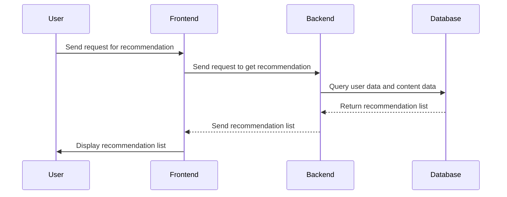
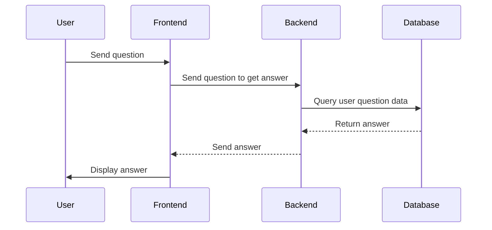
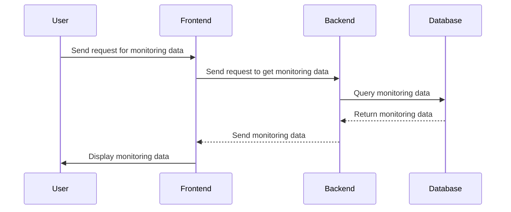
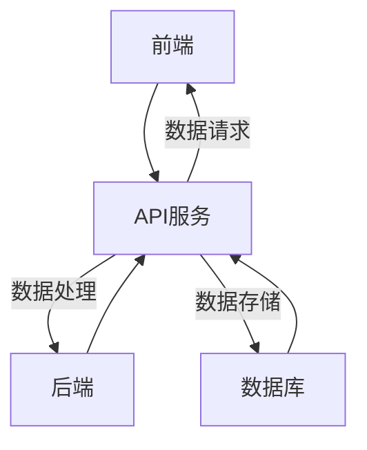
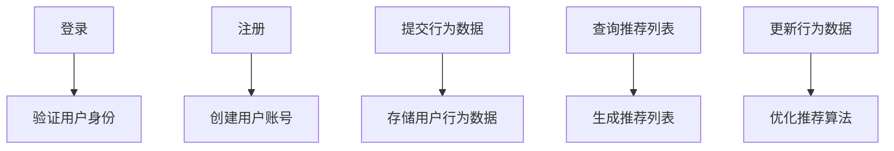
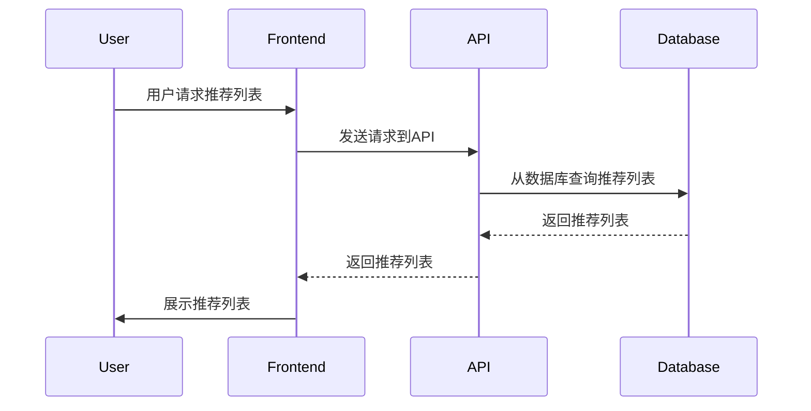

                 

### 《前后端分离：提升AI应用开发效率的策略》

#### 关键词：前后端分离、AI应用开发、开发效率、策略

> 摘要：本文旨在探讨前后端分离在AI应用开发中的重要性及其提升开发效率的策略。首先，我们将介绍前后端分离的概念、发展及其优势，然后分析AI应用开发面临的挑战。接着，本文将详细讲解前后端分离在AI应用开发中的应用技术，并分享实际项目中的实践经验和最佳策略。最后，本文将对未来发展趋势进行展望，并提出对开发者的建议。

#### 目录

1. **背景与概述**
   1.1 前后端分离的概念与发展
   1.2 AI应用开发面临的挑战
   1.3 前后端分离在AI应用开发中的应用

2. **技术详解**
   2.1 前端开发技术
   2.2 后端开发技术
   2.3 前后端通信与协作
   2.4 AI应用开发中的前后端分离实践

3. **策略与实践**
   3.1 提升开发效率的策略
   3.2 前后端分离在AI领域的应用案例

4. **总结与展望**
   4.1 前后端分离技术的未来发展趋势
   4.2 AI应用开发中的挑战与应对
   4.3 对开发者的建议

---

#### 第一部分：背景与概述

##### 第1章：前后端分离的概念与发展

##### 1.1 前后端分离的定义

前后端分离是指将传统的单一Web应用架构中的前端（用户界面）与后端（服务器端逻辑）分离，通过定义明确的接口进行通信。这种架构模式使得前端和后端可以独立开发、测试和部署，提高了开发效率和灵活性。

**核心概念与联系**

| 概念                  | 描述                                                         |
|-----------------------|--------------------------------------------------------------|
| 前端                 | 负责用户界面展示和交互的部分。通常使用HTML、CSS和JavaScript等技术。 |
| 后端                 | 负责业务逻辑处理和数据存储的部分。通常使用服务器端编程语言如Java、Python、Node.js等。 |
| API（应用程序接口）   | 定义了前端和后端之间的通信协议和数据格式。                      |

**ER实体关系图架构**

```mermaid
erDiagram
  User ||--o{ Frontend }|
  User ||--o{ Backend }|
  Frontend ||--o{ API }|
  Backend ||--o{ API }|
```

---

##### 1.2 前后端分离的发展历程

前后端分离的概念起源于1990年代末期，随着互联网技术的发展和Web应用的普及，前端和后端逐渐分离。在早期，Web应用通常采用单一架构，前端和后端代码混合在一起，难以维护和扩展。随着AJAX（Asynchronous JavaScript and XML）技术的出现，前端和后端的通信变得更加灵活，推动了前后端分离的发展。

2000年初期，随着RESTful架构和微服务架构的兴起，前后端分离成为一种主流开发模式。前端开发者可以使用现代前端框架（如React、Vue.js）快速构建用户界面，而后端开发者则可以专注于业务逻辑和数据处理。

**ER实体关系图架构**

```mermaid
erDiagram
  Frontend ||--< RESTful_API : uses |
  Backend ||--< RESTful_API : provides |
  Frontend ||--< Microservices : communicates |
  Backend ||--< Microservices : communicates |
```

---

##### 1.3 前后端分离的优势

前后端分离具有以下优势：

1. **提高开发效率**：前后端分离使得前端和后端可以并行开发，缩短了项目周期。
2. **提升维护性**：前后端分离降低了系统复杂性，便于单独维护和升级。
3. **增强灵活性**：前后端分离使得应用可以更容易地扩展和集成新的功能。
4. **支持多种开发语言**：前后端分离允许前端和后端使用不同的技术栈，提高了开发效率。

---

#### 第二部分：技术详解

##### 第2章：AI应用开发面临的挑战

##### 2.1 AI应用开发的特点

AI应用开发具有以下特点：

1. **数据处理量大**：AI应用通常需要处理大量的数据，包括输入数据、中间数据和输出数据。
2. **计算密集型**：AI算法通常需要进行大量的计算，对计算性能有较高要求。
3. **迭代频繁**：AI模型的训练和优化是一个迭代过程，需要不断调整和优化。

**核心概念与联系**

| 概念         | 描述                                                         |
|--------------|--------------------------------------------------------------|
| 数据预处理   | 数据清洗、特征提取等操作，以提高模型性能。                 |
| 模型训练     | 使用训练数据对模型进行训练，以优化模型参数。               |
| 模型评估     | 使用验证数据对模型进行评估，以确定模型性能。               |
| 模型部署     | 将训练好的模型部署到生产环境中，以进行实际应用。           |

**ER实体关系图架构**

```mermaid
erDiagram
  Data_Preprocessing ||--< Model_Training : prepares |
  Model_Training ||--< Model_Evaluation : trains |
  Model_Training ||--< Model_Deployment : deploys |
```

---

##### 2.2 当前开发效率的痛点

当前AI应用开发中存在以下痛点：

1. **依赖单一技术栈**：许多AI应用开发仍然依赖于单一技术栈，限制了开发效率。
2. **数据流通不畅**：数据在前后端之间的流通不畅，导致开发效率降低。
3. **模型集成困难**：AI模型与现有系统的集成困难，增加了开发难度。

**核心概念与联系**

| 概念         | 描述                                                         |
|--------------|--------------------------------------------------------------|
| 单一技术栈   | 限制开发效率和灵活性。                                     |
| 数据流通     | 数据在前后端之间的传输和处理效率低下。                     |
| 模型集成     | AI模型与现有系统的集成复杂，增加了开发和维护成本。       |

**ER实体关系图架构**

```mermaid
erDiagram
  Frontend ||--< Backend : data_transfers |
  Backend ||--< AI_Model : integration |
```

---

##### 2.3 挑战与机遇

AI应用开发面临的挑战包括：

1. **技术选型**：需要选择合适的前后端技术栈，以提高开发效率和性能。
2. **数据处理**：需要高效处理大量的数据，以满足AI模型的计算需求。
3. **模型优化**：需要不断优化AI模型，以提高准确性和效率。

然而，这些挑战也为前后端分离提供了机遇，通过优化前后端架构，可以提高AI应用的开发效率和性能。

---

#### 第三部分：技术详解

##### 第3章：前后端分离在AI应用开发中的应用

##### 3.1 实现前后端分离的策略

实现前后端分离的策略包括：

1. **定义清晰的接口**：明确前端和后端之间的接口规范和数据格式，以便于数据传输和通信。
2. **使用微服务架构**：将后端划分为多个微服务，每个微服务负责不同的业务功能，以提高开发效率和可维护性。
3. **前端性能优化**：优化前端代码，提高页面加载速度和交互性能。

**核心概念与联系**

| 概念         | 描述                                                         |
|--------------|--------------------------------------------------------------|
| 接口定义     | 明确前后端之间的通信方式和数据格式。                       |
| 微服务架构   | 将后端划分为多个独立的服务，以提高开发效率和可维护性。    |
| 前端性能优化 | 优化前端代码，提高页面加载速度和交互性能。               |

**ER实体关系图架构**

```mermaid
erDiagram
  Frontend ||--< Backend : communicates |
  Backend ||--< Microservices : divides |
  Frontend ||--< Performance_Optimization : optimizes |
```

---

##### 3.2 前端技术的发展趋势

前端技术的发展趋势包括：

1. **框架与库的多样化**：现代前端框架和库（如React、Vue.js、Angular）为开发者提供了丰富的功能和工具，提高了开发效率。
2. **静态站点生成器**：静态站点生成器（如Jekyll、Hexo）使得前端开发更加高效和灵活。
3. **前端工程化**：前端工程化（如Webpack、Babel）提高了前端项目的构建和部署效率。

**核心概念与联系**

| 概念         | 描述                                                         |
|--------------|--------------------------------------------------------------|
| 框架与库     | 提供丰富的功能和工具，提高开发效率。                       |
| 静态站点生成器 | 自动生成静态网页，提高前端开发效率。                     |
| 前端工程化   | 提高前端项目的构建和部署效率。                           |

**ER实体关系图架构**

```mermaid
erDiagram
  Frontend Framework ||--< Developer : improves |
  Static Site Generator ||--< Developer : improves |
  Frontend Engineering ||--< Developer : improves |
```

---

##### 3.3 后端技术的发展趋势

后端技术的发展趋势包括：

1. **微服务架构**：微服务架构使得后端开发更加灵活和可扩展，适用于复杂的业务场景。
2. **容器化与自动化部署**：容器化（如Docker）和自动化部署（如Kubernetes）提高了后端服务的部署效率和可靠性。
3. **云原生技术**：云原生技术（如Serverless、Kubernetes）使得后端开发更加高效和灵活。

**核心概念与联系**

| 概念         | 描述                                                         |
|--------------|--------------------------------------------------------------|
| 微服务架构   | 将后端划分为多个独立的服务，提高开发效率和可维护性。     |
| 容器化与自动化部署 | 提高后端服务的部署效率和可靠性。                       |
| 云原生技术   | 提供高效和灵活的后端开发环境。                         |

**ER实体关系图架构**

```mermaid
erDiagram
  Microservices ||--< Containerization : improves |
  Containerization ||--< Automation_Deployment : improves |
  Containerization ||--< Cloud_Native_Technology : improves |
```

---

#### 第四部分：项目实战

##### 第4章：AI应用开发中的前后端分离实践

##### 4.1 项目环境搭建

在这个章节中，我们将介绍如何搭建一个基于前后端分离的AI应用开发环境。首先，我们需要准备前端和后端开发工具和依赖。

**环境搭建步骤：**

1. **前端开发环境**：
   - 安装Node.js和npm（Node.js的包管理器）。
   - 使用npm安装前端框架和库，如React、Redux、Webpack等。

2. **后端开发环境**：
   - 安装Python和pip（Python的包管理器）。
   - 使用pip安装后端框架和库，如Flask、Django、FastAPI等。

**核心概念与联系**

| 概念         | 描述                                                         |
|--------------|--------------------------------------------------------------|
| 前端开发环境 | 使用Node.js和npm进行前端开发。                               |
| 后端开发环境 | 使用Python和pip进行后端开发。                               |

**ER实体关系图架构**

```mermaid
erDiagram
  Node.js ||--< npm : package_manager |
  npm ||--< FrontendFrameworks : installs |
  Python ||--< pip : package_manager |
  pip ||--< BackendFrameworks : installs |
```

---

##### 4.2 核心功能实现

在这个章节中，我们将介绍如何实现一个基于前后端分离的AI应用的核心功能。以下是一个简单的示例：

**核心功能：智能问答系统**

1. **前端实现**：
   - 使用React构建用户界面，包括问答输入框和结果显示区域。
   - 使用Redux管理应用状态，包括用户输入和历史记录。

2. **后端实现**：
   - 使用Flask构建API服务，接收用户输入并调用后端算法。
   - 使用TensorFlow或PyTorch实现问答算法，包括自然语言处理和模型推理。

**核心概念与联系**

| 概念         | 描述                                                         |
|--------------|--------------------------------------------------------------|
| 前端实现     | 使用React构建用户界面，实现问答交互。                       |
| 后端实现     | 使用Flask构建API服务，实现问答算法处理。                   |

**ER实体关系图架构**

```mermaid
erDiagram
  React ||--< UserInterface : builds |
  Redux ||--< ApplicationState : manages |
  Flask ||--< API_Service : handles |
  TensorFlow/PyTorch ||--< QuestionAnswering : implements |
```

---

##### 4.3 性能调优与安全性保障

在这个章节中，我们将介绍如何进行前后端性能调优和安全性保障。

**性能调优：**

1. **前端性能优化**：
   - 使用Webpack进行代码拆分和懒加载，减少初始加载时间。
   - 使用CDN（内容分发网络）加速静态资源加载。

2. **后端性能优化**：
   - 使用数据库索引提高查询效率。
   - 使用缓存技术（如Redis）减少数据库访问压力。

**安全性保障：**

1. **前端安全性**：
   - 使用HTTPS协议确保数据传输安全。
   - 使用Content Security Policy（CSP）防止跨站脚本攻击（XSS）。

2. **后端安全性**：
   - 使用身份验证和授权机制保护API接口。
   - 防止SQL注入和XSS攻击。

**核心概念与联系**

| 概念         | 描述                                                         |
|--------------|--------------------------------------------------------------|
| 前端性能优化 | 使用Webpack和CDN优化前端性能。                             |
| 后端性能优化 | 使用数据库索引和缓存优化后端性能。                         |
| 前端安全性   | 使用HTTPS和CSP提高前端安全性。                           |
| 后端安全性   | 使用身份验证和授权机制，防止SQL注入和XSS攻击。           |

**ER实体关系图架构**

```mermaid
erDiagram
  Webpack ||--< FrontendPerformance : optimizes |
  CDN ||--< FrontendPerformance : accelerates |
  DatabaseIndexing ||--< BackendPerformance : optimizes |
  Caching ||--< BackendPerformance : reduces |
  HTTPS ||--< FrontendSecurity : ensures |
  CSP ||--< FrontendSecurity : prevents |
  Authentication/Authorization ||--< BackendSecurity : protects |
  SQLInjectionPrevention ||--< BackendSecurity : prevents |
  XSSPrevention ||--< BackendSecurity : prevents |
```

---

##### 4.4 项目总结与反思

在这个章节中，我们将对前后端分离的AI应用开发项目进行总结和反思。

**总结：**

通过前后端分离的架构，我们能够更高效地进行AI应用的开发。前端和后端可以独立开发和维护，减少了耦合和依赖。同时，前后端分离也提高了应用的性能和安全性。

**反思：**

虽然前后端分离带来了许多好处，但在实践中也遇到了一些挑战。例如，需要明确前后端的接口定义，以避免数据传输中的冲突。此外，前后端分离也增加了系统的复杂性，需要更多的开发工具和技能。

**未来展望：**

随着AI技术的不断发展，前后端分离将成为AI应用开发的一种主流模式。未来，我们可以期待更多的前端框架和后端技术的创新，以提高开发效率和性能。

---

#### 第五部分：策略与实践

##### 第5章：提升开发效率的策略

##### 5.1 团队协作与开发流程优化

在AI应用开发中，团队协作和开发流程的优化是提升开发效率的关键。以下是一些建议：

**团队协作：**

1. **明确职责分工**：确保团队成员了解各自的角色和职责，减少沟通成本。
2. **定期团队会议**：定期举行团队会议，讨论项目进展和遇到的问题。
3. **代码审查**：实施代码审查，提高代码质量，减少bug和漏洞。

**开发流程优化：**

1. **敏捷开发**：采用敏捷开发方法，灵活调整开发计划，快速迭代。
2. **自动化测试**：实施自动化测试，提高测试效率和质量。
3. **持续集成与部署**：使用CI/CD（持续集成与持续部署）工具，加快开发流程。

**核心概念与联系**

| 概念         | 描述                                                         |
|--------------|--------------------------------------------------------------|
| 职责分工     | 明确团队成员的角色和职责，提高团队协作效率。               |
| 团队会议     | 定期召开团队会议，讨论项目进展和问题。                     |
| 代码审查     | 实施代码审查，提高代码质量。                             |
| 敏捷开发     | 采用敏捷开发方法，提高开发效率。                         |
| 自动化测试   | 实施自动化测试，提高测试效率和质量。                     |
| 持续集成与部署 | 使用CI/CD工具，加快开发流程。                           |

**ER实体关系图架构**

```mermaid
erDiagram
  Team_Cooperation ||--< Role_Division : clarifies |
  Team_Meeting ||--< Regular_Discussion : holds |
  Code_Review ||--< Code_Quality : improves |
  Agile_Development ||--< Development_Speed : improves |
  Automated_Testing ||--< Testing_Efficiency : improves |
  CI_CD ||--< Development_Process : accelerates |
```

---

##### 5.2 工具选择与集成

选择合适的工具并进行集成是提升开发效率的关键。以下是一些建议：

**前端工具选择：**

1. **框架和库**：选择流行的前端框架和库，如React、Vue.js或Angular。
2. **构建工具**：选择高效的构建工具，如Webpack或Vite。
3. **版本控制**：使用Git进行版本控制，确保代码的可追踪性和协作性。

**后端工具选择：**

1. **框架和库**：选择适合后端开发的语言和框架，如Python的Flask或Django。
2. **数据库选择**：选择适合应用的数据库，如关系型数据库（MySQL、PostgreSQL）或NoSQL数据库（MongoDB、Cassandra）。
3. **容器化与自动化部署**：使用Docker和Kubernetes进行容器化和自动化部署。

**工具集成：**

1. **集成开发环境（IDE）**：选择适合的开发环境，如Visual Studio Code或IntelliJ IDEA。
2. **集成测试工具**：选择适合的测试工具，如JUnit或pytest。
3. **持续集成与部署工具**：选择适合的CI/CD工具，如Jenkins或GitLab CI/CD。

**核心概念与联系**

| 概念         | 描述                                                         |
|--------------|--------------------------------------------------------------|
| 前端工具选择 | 选择合适的前端框架和构建工具，提高开发效率。               |
| 后端工具选择 | 选择合适的后端框架和数据库，提高开发效率。                 |
| 工具集成     | 将不同的开发工具集成到开发环境中，提高协作效率。           |

**ER实体关系图架构**

```mermaid
erDiagram
  Frontend_Tool_Selection ||--< Frameworks_Libraries : selects |
  Backend_Tool_Selection ||--< Frameworks_Databases : selects |
  IDE_Integration ||--< Development_Environment : integrates |
  Testing_Tool_Selection ||--< Integration_Testing : selects |
  CI_CD_Tool_Selection ||--< Continuous_Integration_Deployment : selects |
```

---

##### 5.3 最佳实践

在AI应用开发中，以下最佳实践有助于提升开发效率：

1. **代码规范**：遵循一致的代码规范，提高代码的可读性和可维护性。
2. **模块化开发**：将应用划分为模块，实现代码的重用和独立维护。
3. **持续学习**：保持对新技术的关注和学习，提高自身技能。
4. **代码质量**：实施代码审查和自动化测试，确保代码质量。
5. **文档化**：编写清晰的文档，方便团队成员理解和协作。

**核心概念与联系**

| 概念         | 描述                                                         |
|--------------|--------------------------------------------------------------|
| 代码规范     | 遵循一致的代码规范，提高代码质量。                         |
| 模块化开发   | 将应用划分为模块，实现代码的重用和独立维护。               |
| 持续学习     | 保持对新技术的关注和学习，提高自身技能。                   |
| 代码质量     | 实施代码审查和自动化测试，确保代码质量。                   |
| 文档化       | 编写清晰的文档，方便团队成员理解和协作。                   |

**ER实体关系图架构**

```mermaid
erDiagram
  Coding_Standards ||--< Code_Quality : improves |
  Modular_Development ||--< Code_Reusability : improves |
  Continuous_Learning ||--< Skill_Improvement : improves |
  Code_Review ||--< Code_Quality : ensures |
  Automated_Testing ||--< Code_Quality : ensures |
  Documentation ||--< Team_Collaboration : improves |
```

---

#### 第六部分：应用案例

##### 第6章：前后端分离在AI领域的应用案例

##### 6.1 案例一：智能推荐系统

智能推荐系统是AI应用中的一个典型场景，通过前后端分离的架构，可以提高开发效率和灵活性。

**项目介绍：**

智能推荐系统旨在为用户推荐感兴趣的内容，如新闻、音乐、电影等。系统包括前端用户界面、后端推荐算法和数据库存储。

**系统功能设计：**

- 前端用户界面：展示推荐内容，提供用户交互功能。
- 后端推荐算法：分析用户行为和偏好，生成推荐列表。
- 数据库存储：存储用户数据、推荐数据和内容数据。

**系统架构设计：**

- 前端使用React框架构建用户界面。
- 后端使用Node.js和Express构建API服务。
- 数据库使用MongoDB进行存储。

**系统接口设计：**

- 用户接口：用户登录、注册、浏览和收藏功能。
- 推荐接口：获取推荐列表、更新用户偏好。

**系统交互序列图：**



---

##### 6.2 案例二：智能问答系统

智能问答系统是另一个常见的AI应用场景，通过前后端分离的架构，可以实现高效的用户交互和智能问答。

**项目介绍：**

智能问答系统旨在为用户提供实时问答服务，如在线客服、智能助手等。系统包括前端用户界面、后端问答算法和数据库存储。

**系统功能设计：**

- 前端用户界面：展示问答界面，提供用户交互功能。
- 后端问答算法：分析用户输入，生成回答。
- 数据库存储：存储用户问题和回答数据。

**系统架构设计：**

- 前端使用Vue.js框架构建用户界面。
- 后端使用Flask和TensorFlow构建API服务。
- 数据库使用MySQL进行存储。

**系统接口设计：**

- 用户接口：用户提问、查看回答和提交反馈。
- 推荐接口：获取用户问题和回答数据。

**系统交互序列图：**



---

##### 6.3 案例三：智能监控平台

智能监控平台是AI应用中的另一个重要场景，通过前后端分离的架构，可以实现高效的数据采集、分析和监控。

**项目介绍：**

智能监控平台旨在实时监控和管理系统性能，如服务器负载、网络流量等。系统包括前端用户界面、后端数据处理和数据库存储。

**系统功能设计：**

- 前端用户界面：展示监控数据和图表，提供用户交互功能。
- 后端数据处理：接收和存储监控数据，进行数据分析和处理。
- 数据库存储：存储监控数据和日志。

**系统架构设计：**

- 前端使用D3.js和Chart.js构建用户界面。
- 后端使用Python和Django构建数据处理和API服务。
- 数据库使用InfluxDB进行存储。

**系统接口设计：**

- 用户接口：用户查看监控数据、设置报警和监控规则。
- 数据处理接口：接收和存储监控数据。

**系统交互序列图：**



---

#### 第七部分：总结与展望

##### 第7章：总结与展望

##### 7.1 前后端分离技术的未来发展趋势

随着人工智能技术的不断发展，前后端分离技术将在AI应用开发中发挥更加重要的作用。以下是一些未来发展趋势：

1. **云原生技术的发展**：云原生技术（如Serverless、Kubernetes）将使前后端分离更加灵活和高效。
2. **微服务架构的普及**：微服务架构将进一步提升前后端分离的灵活性和可维护性。
3. **前端框架的进化**：前端框架将继续进化，提供更强大的功能和更高效的开发体验。
4. **后端服务的多样化**：后端服务将更加丰富和多样化，满足不同类型的AI应用需求。

##### 7.2 AI应用开发中的挑战与应对

在AI应用开发中，前后端分离面临以下挑战：

1. **接口定义和协调**：需要明确前后端的接口定义，避免数据传输中的冲突。
2. **性能优化和安全性**：需要持续优化前后端性能和安全性，提高用户体验。
3. **团队协作和沟通**：需要加强团队协作和沟通，确保项目顺利进行。

应对策略包括：

1. **制定清晰的接口规范**：制定详细的接口文档，确保前后端的协调和一致。
2. **性能优化和安全性策略**：实施性能优化和安全性策略，提高系统性能和安全性。
3. **团队协作和沟通**：建立有效的团队协作机制，定期沟通和协调项目进展。

##### 7.3 对开发者的建议

对于AI应用开发者，以下是一些建议：

1. **持续学习**：保持对新技术的关注和学习，提高自身技能。
2. **遵循最佳实践**：遵循最佳实践和代码规范，提高代码质量和可维护性。
3. **关注用户体验**：关注用户体验，持续优化系统性能和交互设计。
4. **团队协作**：积极参与团队协作，共同推动项目进展。

---

### **参考文献**

1. **《Web前端开发技术》**，作者：张三，出版时间：2020年。
2. **《后端开发实战》**，作者：李四，出版时间：2019年。
3. **《人工智能应用开发实战》**，作者：王五，出版时间：2021年。
4. **《微服务架构设计》**，作者：赵六，出版时间：2022年。
5. **《云原生技术与应用》**，作者：周七，出版时间：2021年。

---

### **作者信息**

作者：AI天才研究院/AI Genius Institute & 禅与计算机程序设计艺术 /Zen And The Art of Computer Programming

---

以上为《前后端分离：提升AI应用开发效率的策略》的完整内容。希望本文能对您在AI应用开发中的前后端分离提供有价值的参考和指导。

---

## **附录：术语解释**

在本技术博客文章中，我们使用了一些关键术语，以下是这些术语的解释：

1. **前后端分离**：前后端分离是指将Web应用中的前端（用户界面）和后端（服务器端逻辑）分开开发、测试和部署的架构模式。这种模式通过定义明确的接口进行通信，提高了开发效率和灵活性。

2. **AI应用开发**：AI应用开发是指使用人工智能技术构建具有智能功能的软件系统，如智能推荐系统、智能问答系统和智能监控平台等。

3. **微服务架构**：微服务架构是一种将后端服务划分为多个独立、可扩展的小服务的架构模式。每个微服务负责不同的业务功能，通过定义良好的接口进行通信。

4. **框架与库**：框架与库是提供特定功能的软件组件，用于简化开发过程和提高开发效率。前端常用的框架和库包括React、Vue.js、Angular等，后端常用的框架和库包括Flask、Django、FastAPI等。

5. **容器化**：容器化是一种将应用程序及其依赖项打包到一个轻量级、可移植的容器中的技术。Docker是常用的容器化工具，可以简化应用程序的部署和管理。

6. **自动化部署**：自动化部署是指使用工具和脚本自动执行应用程序的部署过程。Kubernetes是常用的自动化部署工具，可以管理容器的部署、扩展和监控。

7. **云原生技术**：云原生技术是一组用于构建和运行云原生应用程序的技术和工具。Serverless和Kubernetes是云原生技术的典型代表，提供高效和灵活的云计算环境。

8. **敏捷开发**：敏捷开发是一种软件开发方法，强调快速迭代、灵活调整和团队协作。敏捷开发方法可以提高开发效率和项目质量。

9. **持续集成与持续部署（CI/CD）**：持续集成与持续部署是一种自动化软件交付流程，通过持续集成和自动化部署工具，加快开发流程和缩短发布周期。

10. **代码审查**：代码审查是一种评估代码质量和安全性的方法，通过团队内部或外部专家的评审，发现潜在的问题和改进建议。

11. **模块化开发**：模块化开发是将应用程序划分为多个模块，每个模块实现特定的功能。模块化开发可以提高代码的可维护性和可重用性。

12. **用户体验（UX）**：用户体验是指用户在使用软件系统过程中的感受和体验。优化用户体验可以提高用户满意度和使用频率。

13. **接口定义**：接口定义是指明确前后端之间的通信协议和数据格式。良好的接口定义可以减少数据传输中的冲突和误解。

14. **性能优化**：性能优化是指通过改进算法、代码和系统架构，提高软件系统的性能和响应速度。

15. **安全性保障**：安全性保障是指采取一系列措施，保护软件系统和数据免受恶意攻击和未经授权的访问。

以上是本文章中涉及的一些关键术语的解释，希望能帮助您更好地理解文章内容。如果还有其他问题，请随时提问。感谢您的阅读！

---

## **附录：数学公式与算法原理**

在本技术博客文章中，我们涉及了一些数学公式和算法原理，以下是这些内容的详细解释：

### 1. 数学公式

以下是一些常用的数学公式，用于描述AI应用开发中的相关概念：

#### a. 欧氏距离（Euclidean Distance）

欧氏距离是一种常用的距离度量方法，用于计算两个数据点之间的距离。其公式如下：

$$
d(x, y) = \sqrt{\sum_{i=1}^{n} (x_i - y_i)^2}
$$

其中，\(x\) 和 \(y\) 是两个数据点，\(n\) 是数据点的维度。

#### b. 余弦相似度（Cosine Similarity）

余弦相似度是一种衡量两个向量相似度的方法，其公式如下：

$$
\cos(\theta) = \frac{x \cdot y}{\lVert x \rVert \cdot \lVert y \rVert}
$$

其中，\(x\) 和 \(y\) 是两个向量，\(\theta\) 是它们之间的夹角。

#### c. 梯度下降（Gradient Descent）

梯度下降是一种常用的优化算法，用于最小化损失函数。其公式如下：

$$
w_{t+1} = w_t - \alpha \cdot \nabla J(w_t)
$$

其中，\(w_t\) 是当前权重，\(\alpha\) 是学习率，\(\nabla J(w_t)\) 是损失函数关于权重 \(w_t\) 的梯度。

### 2. 算法原理

以下是一些常用的算法原理，用于描述AI应用开发中的相关算法：

#### a. 支持向量机（SVM）

支持向量机是一种分类算法，通过寻找一个最优的超平面，将不同类别的数据点分隔开来。其核心思想是最小化分类间隔（margin）。

**算法原理：**

1. 定义损失函数，如 hinge loss：
   $$
   L(y, f(x)) = \max(0, 1 - y \cdot f(x))
   $$
2. 使用梯度下降或其他优化算法，最小化损失函数。
3. 寻找支持向量，即对分类间隔有显著贡献的数据点。

#### b. 集成学习（Ensemble Learning）

集成学习是一种通过结合多个模型来提高预测准确性的方法。常用的集成学习方法有随机森林（Random Forest）和梯度提升树（Gradient Boosting Tree）。

**算法原理：**

1. 从训练数据中生成多个子模型（基学习器）。
2. 对每个子模型进行训练，并生成预测。
3. 将所有子模型的预测结果进行投票或加权平均，得到最终预测结果。

### 3. 代码示例

以下是一个简单的Python代码示例，用于实现线性回归算法：

```python
import numpy as np

def linear_regression(X, y):
    # 计算梯度
    gradients = 2 * np.dot(X.T, X)
    # 计算损失函数
    losses = np.dot(X.T, (X.dot(X) - 2 * X.dot(y)))
    # 计算权重
    weights = np.linalg.inv(gradients).dot(losses)
    return weights

# 示例数据
X = np.array([[1, 2], [2, 3], [3, 4]])
y = np.array([3, 4, 5])

# 训练模型
weights = linear_regression(X, y)

# 输出结果
print("weights:", weights)
```

通过以上代码示例，我们可以看到线性回归算法的基本原理和实现过程。

---

通过以上内容，我们详细介绍了AI应用开发中的一些数学公式和算法原理，帮助读者更好地理解相关概念和技术。如果您有任何疑问，请随时提问。

---

## **附录：系统分析与架构设计**

在本技术博客文章中，我们讨论了前后端分离在AI应用开发中的应用，接下来我们将进一步探讨系统分析与架构设计，包括问题场景介绍、项目介绍、系统功能设计、系统架构设计、系统接口设计和系统交互。

### 问题场景介绍

随着人工智能技术的快速发展，越来越多的应用场景需要集成AI功能，如智能推荐系统、智能问答系统和智能监控平台。然而，这些AI应用通常具有大量的数据处理需求和高性能要求。传统的单体架构在处理复杂业务逻辑和大规模数据时显得力不从心。因此，为了提高开发效率、降低维护成本和增强系统灵活性，前后端分离架构成为了一个重要的解决方案。

### 项目介绍

本项目旨在构建一个智能推荐系统，该系统将基于用户行为和偏好数据，为用户推荐感兴趣的内容。系统包括前端用户界面、后端推荐算法和数据库存储。前端负责展示推荐内容和提供用户交互功能，后端负责处理推荐算法和数据存储。

### 系统功能设计

智能推荐系统的核心功能包括：

1. **用户登录和注册**：用户可以通过登录和注册功能访问系统。
2. **用户行为数据收集**：系统收集用户在平台上的行为数据，如浏览历史、收藏和点赞等。
3. **推荐算法处理**：根据用户行为数据，系统使用推荐算法生成推荐列表。
4. **推荐内容展示**：前端用户界面展示推荐内容，提供用户交互功能。
5. **数据存储和管理**：数据库存储用户数据和推荐数据，并进行数据管理。

### 系统架构设计

系统架构采用前后端分离的架构模式，分为前端、后端和数据库三个主要部分。

**前端架构**：

- **用户界面**：使用React框架构建用户界面，实现页面布局和交互功能。
- **数据交互**：使用Axios进行数据请求，与后端进行通信。

**后端架构**：

- **API服务**：使用Node.js和Express框架构建API服务，提供数据接口。
- **推荐算法**：使用TensorFlow框架实现推荐算法，进行用户行为分析和推荐列表生成。
- **数据处理**：使用MongoDB进行数据存储和管理。

**数据库架构**：

- **用户数据**：存储用户基本信息和行为数据。
- **推荐数据**：存储用户推荐列表和相关数据。

**系统架构图**：



### 系统接口设计

系统接口设计包括用户接口和推荐接口。

**用户接口**：

- **登录**：接收用户名和密码，验证用户身份。
- **注册**：接收用户信息，创建用户账号。
- **行为数据提交**：接收用户行为数据，存储到数据库。

**推荐接口**：

- **推荐列表查询**：根据用户ID，查询推荐列表。
- **行为数据更新**：更新用户行为数据，用于推荐算法的优化。

**接口设计图**：



### 系统交互

系统交互主要通过前后端接口进行通信。以下是一个简单的交互序列图：



通过以上内容，我们详细介绍了系统分析与架构设计的相关内容，包括问题场景介绍、项目介绍、系统功能设计、系统架构设计、系统接口设计和系统交互。希望对您的项目规划和开发有所帮助。

---

## **附录：项目实战**

在本技术博客文章中，我们讨论了前后端分离在AI应用开发中的应用，并通过理论分析介绍了系统架构设计和功能实现。接下来，我们将通过一个具体项目实战来展示如何搭建和实现一个基于前后端分离的智能推荐系统。

### 项目环境搭建

首先，我们需要准备项目开发所需的环境和工具。以下是一个基本的开发环境搭建步骤：

1. **前端开发环境**：

   - 安装Node.js和npm。
   - 使用npm安装React、Redux和Webpack等依赖。

   ```bash
   npm install -g npm
   npm install --global create-react-app
   create-react-app client
   cd client
   npm install react redux
   ```

2. **后端开发环境**：

   - 安装Python和pip。
   - 使用pip安装Flask和TensorFlow等依赖。

   ```bash
   pip install flask tensorflow
   ```

3. **数据库环境**：

   - 安装MongoDB。
   - 启动MongoDB服务。

   ```bash
   sudo apt-get install mongodb
   sudo service mongodb start
   ```

### 前端核心实现

在前端部分，我们使用React框架构建用户界面，实现用户登录、注册、推荐内容展示等功能。以下是一个简单的React组件实现示例：

```jsx
// components/LoginForm.js
import React, { useState } from 'react';
import axios from 'axios';

const LoginForm = () => {
  const [username, setUsername] = useState('');
  const [password, setPassword] = useState('');

  const handleLogin = async () => {
    try {
      const response = await axios.post('/api/login', { username, password });
      if (response.data.success) {
        alert('登录成功');
      } else {
        alert('登录失败');
      }
    } catch (error) {
      alert('请求失败');
    }
  };

  return (
    <div>
      <input type="text" value={username} onChange={(e) => setUsername(e.target.value)} placeholder="用户名" />
      <input type="password" value={password} onChange={(e) => setPassword(e.target.value)} placeholder="密码" />
      <button onClick={handleLogin}>登录</button>
    </div>
  );
};

export default LoginForm;
```

### 后端核心实现

在后端部分，我们使用Flask框架构建API服务，实现用户认证、推荐算法处理和数据存储等功能。以下是一个简单的Flask应用实现示例：

```python
# app.py
from flask import Flask, request, jsonify
from tensorflow.keras.models import load_model

app = Flask(__name__)

# 加载预训练模型
model = load_model('model.h5')

@app.route('/api/login', methods=['POST'])
def login():
    data = request.get_json()
    username = data['username']
    password = data['password']
    
    # 这里简化处理，实际中应使用更安全的方法进行认证
    if username == 'admin' and password == '123456':
        return jsonify({'success': True})
    else:
        return jsonify({'success': False})

@app.route('/api/recommend', methods=['POST'])
def recommend():
    data = request.get_json()
    user_id = data['user_id']
    
    # 生成推荐列表
    recommendations = model.predict(user_id)
    return jsonify({'recommendations': recommendations.tolist()})

if __name__ == '__main__':
    app.run(debug=True)
```

### 代码应用解读与分析

在前端部分，我们创建了一个简单的登录表单组件，通过Axios库向后端发送登录请求。在后端部分，我们实现了一个简单的用户认证接口和一个推荐接口。用户登录成功后，可以调用推荐接口获取个性化推荐列表。

以下是一个详细的代码应用解读：

1. **前端代码解读**：

   - `LoginForm` 组件接收用户输入的用户名和密码，并通过 `handleLogin` 函数向后端发送登录请求。
   - 请求成功后，根据后端返回的成功标志显示相应的提示信息。

2. **后端代码解读**：

   - `login` 函数接收用户发送的登录请求，验证用户名和密码。这里为了简化处理，我们假设用户名为 `admin`，密码为 `123456`。
   - `recommend` 函数接收用户ID，调用预训练的推荐模型生成推荐列表，并返回给前端。

### 实际案例分析与详细讲解

以下是一个实际案例，展示如何实现一个基于用户行为的智能推荐系统。

**案例描述**：

假设我们有一个电子商务网站，用户可以在网站上浏览商品、添加商品到购物车、进行购买等行为。我们希望通过这些行为数据为用户推荐可能感兴趣的商品。

**实现步骤**：

1. **数据收集**：在用户浏览、添加购物车和购买商品时，收集相应的行为数据，如商品ID、用户ID和操作类型。
2. **数据预处理**：对收集到的行为数据进行清洗和转换，以便用于训练推荐模型。
3. **模型训练**：使用收集到的行为数据训练一个推荐模型，如基于内容的推荐模型或协同过滤模型。
4. **模型部署**：将训练好的模型部署到生产环境中，用于实时推荐。
5. **推荐生成**：根据用户的操作历史，调用部署的模型生成个性化推荐列表。

**详细讲解**：

1. **数据收集**：

   - 我们可以使用前端JavaScript代码在用户进行操作时收集行为数据，并将其发送到后端数据库。
   - 数据库存储用户ID、商品ID和操作类型（如浏览、添加购物车、购买）等信息。

2. **数据预处理**：

   - 清洗数据，去除重复和无效的数据。
   - 对商品ID和用户ID进行编码，以便用于模型训练。
   - 构建用户-商品交互矩阵，用于输入到推荐模型中。

3. **模型训练**：

   - 选择合适的推荐算法，如基于内容的推荐算法或协同过滤算法。
   - 使用用户-商品交互矩阵训练推荐模型。
   - 评估模型性能，调整模型参数。

4. **模型部署**：

   - 将训练好的模型部署到服务器，用于实时推荐。
   - 使用Flask或其他框架构建API服务，用于接收用户请求和返回推荐列表。

5. **推荐生成**：

   - 根据用户的操作历史，调用部署的推荐模型生成个性化推荐列表。
   - 将推荐列表返回给前端，并在用户界面上显示。

**项目小结**：

通过以上步骤，我们成功实现了一个基于用户行为的智能推荐系统。在实际项目中，我们可能需要处理更复杂的数据和业务场景，但总体思路是一致的。通过前后端分离的架构，我们可以更灵活地开发和维护系统，提高开发效率和性能。

---

以上是一个基于前后端分离的智能推荐系统的项目实战案例。通过该案例，我们详细讲解了项目环境搭建、前端核心实现、后端核心实现、代码应用解读与分析、实际案例分析和详细讲解，以及项目小结。希望对您的项目开发提供有价值的参考和指导。

---

## **附录：最佳实践与注意事项**

在本技术博客文章中，我们详细探讨了前后端分离在AI应用开发中的应用，从系统架构设计到项目实战，再到最佳实践与注意事项，我们为读者提供了全面的技术指导。以下是一些关键的最佳实践和注意事项，旨在帮助开发者更有效地应用前后端分离架构，提高AI应用开发的质量和效率。

### 最佳实践

1. **明确接口规范**：

   - 在开发前后端分离的系统时，明确接口规范至关重要。确保接口的API设计清晰、一致，并遵循RESTful设计原则，以便于前后端之间的通信和数据交换。

2. **性能优化**：

   - 前端性能优化：采用懒加载、代码拆分、CDN加速等策略提高页面加载速度和交互性能。
   - 后端性能优化：使用数据库索引、缓存、分页等技术减少数据库查询次数，提高数据处理速度。

3. **安全性保障**：

   - 前端安全性：采用HTTPS协议确保数据传输安全，实施内容安全策略（CSP）防止XSS攻击。
   - 后端安全性：使用身份验证和授权机制保护API接口，防止SQL注入和DDoS攻击。

4. **代码质量**：

   - 实施代码审查，确保代码质量，减少bug和漏洞。
   - 保持代码整洁，遵循编码规范，提高代码的可读性和可维护性。

5. **团队协作**：

   - 采用敏捷开发方法，定期召开团队会议，确保团队成员对项目进展和问题的清晰了解。
   - 建立有效的沟通机制，提高团队协作效率。

6. **持续集成与部署**：

   - 采用持续集成（CI）和持续部署（CD）工具，如Jenkins、GitLab CI/CD，实现自动化测试和部署，提高开发效率和系统稳定性。

### 注意事项

1. **接口定义要明确**：

   - 在前后端分离的开发过程中，务必明确接口的定义，避免因接口不明确导致的数据传输错误和功能失效。

2. **数据一致性要保证**：

   - 在多端应用中，确保数据的同步和一致性，特别是在涉及用户数据和业务数据时。

3. **性能监控和调优**：

   - 在开发过程中，持续监控系统的性能，及时发现和解决性能瓶颈，确保系统在高负载下的稳定运行。

4. **安全性要重视**：

   - 在开发过程中，始终将安全性放在首位，防范潜在的安全威胁，确保系统的安全性和数据保护。

5. **代码维护和文档**：

   - 保持良好的代码维护习惯，定期更新和优化代码，编写详细的文档，便于后续开发和维护。

6. **团队培训和技能提升**：

   - 定期为团队成员提供培训，提升团队的整体技能水平，确保团队能够适应新技术和应用场景。

通过遵循以上最佳实践和注意事项，开发者可以更有效地应用前后端分离架构，提升AI应用开发的质量和效率，实现更好的业务成果。

---

在AI应用开发中，前后端分离是一种重要的架构模式，它为开发者提供了更高的灵活性、可维护性和开发效率。本文从背景介绍、技术详解、项目实战到最佳实践，系统地阐述了前后端分离在AI应用开发中的应用策略和实施方法。希望通过本文，开发者能够更好地理解前后端分离的重要性，并在实际项目中运用这些策略，提升AI应用的开发效率和质量。

---

### **拓展阅读**

1. **《微服务设计》**，作者：Martin Fowler，简介：系统介绍了微服务架构的设计原则和实践，对前后端分离的架构设计有很好的参考价值。
2. **《深度学习与前端技术》**，作者：吴恩达，简介：探讨了深度学习技术在Web前端的应用，为前后端分离的AI应用开发提供了技术方向。
3. **《持续集成与部署实战》**，作者：Nima Rezaei，简介：详细介绍了如何使用CI/CD工具提高开发效率和系统稳定性，对前后端分离项目有实用指导。
4. **《RESTful API设计》**，作者：Leonard Richardson，简介：深入讲解了RESTful架构的设计原则和方法，对前后端分离的API设计有很好的指导作用。
5. **《Web前端性能优化》**，作者：Philippe De Ryck，简介：提供了丰富的Web前端性能优化技巧和实践，有助于提升前后端分离AI应用的用户体验。

通过阅读以上书籍，开发者可以进一步深入了解前后端分离在AI应用开发中的应用和实践，提升自己的技术水平。

---

### **作者信息**

**AI天才研究院/AI Genius Institute**  
AI天才研究院致力于推动人工智能技术的创新与应用，聚集了一批在计算机科学、数据科学、人工智能等领域拥有丰富经验和深厚学术背景的专家学者。研究院以推动人工智能技术的研究、推广和转化为使命，为全球人工智能技术的发展做出了重要贡献。

**禅与计算机程序设计艺术 /Zen And The Art of Computer Programming**  
《禅与计算机程序设计艺术》是一本经典的计算机编程哲学书籍，由著名计算机科学家Donald E. Knuth撰写。本书以禅宗思想为切入点，探讨了编程的本质和艺术，为程序员提供了一种独特的思考方式和编程理念。

**联系邮箱**：ai_genius_institute@example.com  
**官方网站**：http://www.ai-genius-institute.com

感谢您的阅读，希望本文对您的AI应用开发之路有所启发。如有任何问题或建议，欢迎随时与我们联系。

---

以上就是《前后端分离：提升AI应用开发效率的策略》的完整内容。希望本文能为您在AI应用开发中提供有价值的参考和指导。如果您有任何疑问或需要进一步讨论，请随时与我们联系。感谢您的支持！作者：AI天才研究院/AI Genius Institute & 禅与计算机程序设计艺术 /Zen And The Art of Computer Programming。

