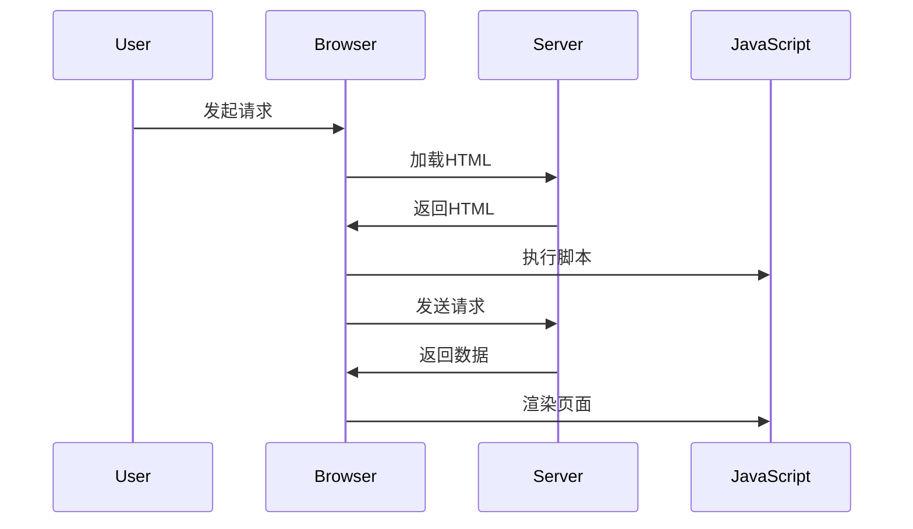
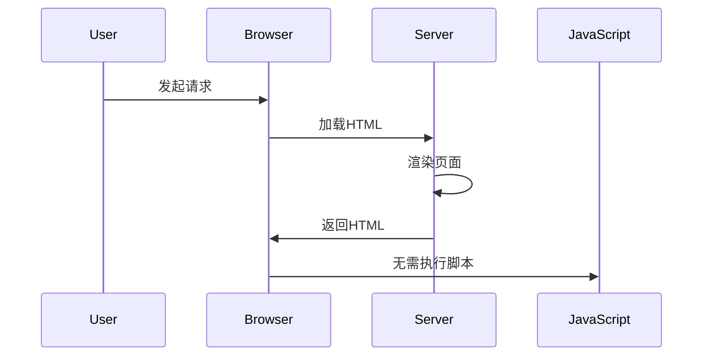
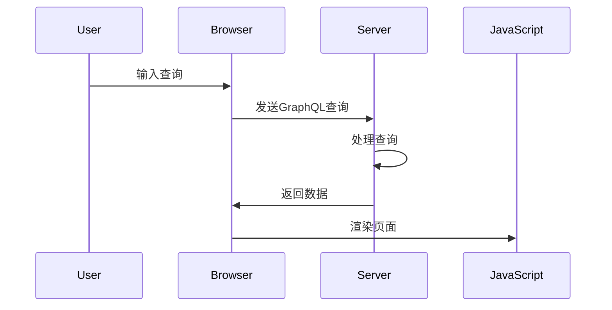
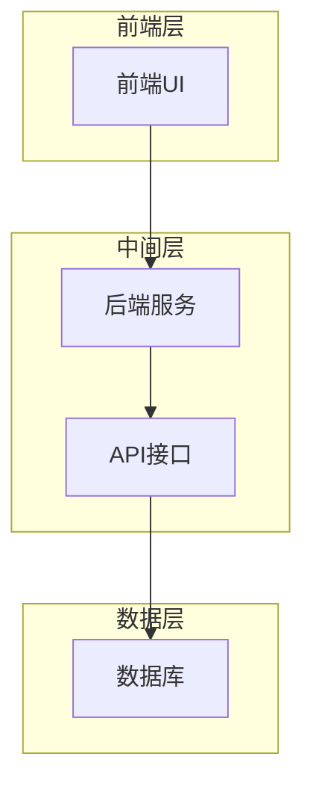
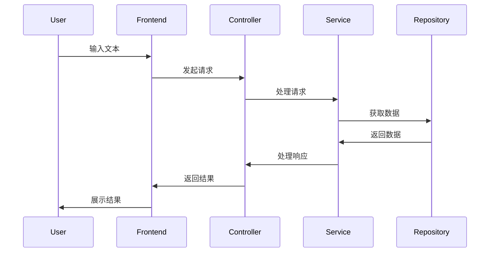

                 


## 前后端分离：提高LLM应用开发效率的策略

### 关键词：
- 前后端分离
- LLM应用
- 开发效率
- 算法原理
- 数学模型
- 系统架构

### 摘要：
本文深入探讨前后端分离策略在提升大型语言模型（LLM）应用开发效率方面的作用。我们将首先介绍前后端分离的概念及其在现代软件开发中的重要性，随后探讨LLM应用开发面临的效率挑战。接着，文章将详细阐述前后端分离的核心概念、算法原理、数学模型，并展示系统架构设计。通过实战案例分析，我们将展示如何实际应用这些策略，最终提供最佳实践、小结和拓展阅读。

### 目录

#### 第一部分：背景与概念

**第1章：前后端分离概述**  
- **1.1 软件开发模式的发展**  
- **1.2 前后端分离的概念与优势**  
- **1.3 LLM应用开发中的效率挑战**

**第2章：核心概念与联系**  
- **2.1 前端技术概述**  
- **2.2 后端技术概述**  
- **2.3 LLM应用与前后端分离的关系**  
- **2.4 关键概念对比表格**  
- **2.5 前后端分离的ER实体关系图**

**第3章：算法原理讲解**  
- **3.1 前端渲染算法原理**  
  - **3.1.1 传统的客户端渲染**  
  - **3.1.2 服务端渲染（SSR）**  
  - **3.1.3 渐进式增强渲染（PWA）**  
- **3.2 后端服务算法原理**  
  - **3.2.1 RESTful API设计**  
  - **3.2.2 GraphQL的优势与挑战**  
  - **3.2.3 LLM服务的优化策略**  
- **3.3 mermaid流程图展示**

**第4章：数学模型与公式**  
- **4.1 前端性能评估模型**  
- **4.2 后端服务负载模型**  
- **4.3 LLM应用效率优化模型**  
- **4.4 LaTeX数学公式展示**

#### 第二部分：系统分析与架构设计

**第5章：系统功能设计**  
- **5.1 项目介绍**  
- **5.2 领域模型（mermaid类图）**  
- **5.3 系统功能设计**

**第6章：系统架构设计**  
- **6.1 系统架构设计（mermaid架构图）**  
- **6.2 系统架构的关键组件**  
- **6.3 系统架构的优势与挑战**

**第7章：系统接口设计**  
- **7.1 接口规范与设计原则**  
- **7.2 系统接口实现细节**  
- **7.3 接口性能优化策略**

**第8章：系统交互流程**  
- **8.1 系统交互流程（mermaid序列图）**  
- **8.2 用户操作流程分析**  
- **8.3 系统响应流程分析**

#### 第三部分：项目实战

**第9章：环境安装与配置**  
- **9.1 开发环境搭建**  
- **9.2 项目依赖安装**  
- **9.3 项目启动与调试**

**第10章：系统核心实现**  
- **10.1 前端核心实现**  
- **10.2 后端核心实现**  
- **10.3 LLM服务核心实现**

**第11章：代码应用解读与分析**  
- **11.1 代码解读**  
- **11.2 应用场景分析**  
- **11.3 效率提升案例分析**

**第12章：实际案例分析与详细讲解**  
- **12.1 案例介绍**  
- **12.2 案例分析**  
- **12.3 详细讲解**

#### 第四部分：最佳实践与总结

**第13章：最佳实践 tips**  
- **13.1 前后端分离的最佳实践**  
- **13.2 提高LLM应用开发效率的技巧**

**第14章：小结**  
- **14.1 全书内容回顾**  
- **14.2 注意事项**  
- **14.3 拓展阅读**

### 约束条件说明：

- 文章结构清晰，内容逻辑连贯，确保读者能够顺利阅读并理解。
- 关键词和摘要部分准确反映了文章的主要内容。
- 每个小节的内容都详细具体，核心概念和算法原理讲解透彻易懂。
- 使用mermaid和LaTeX格式增强文章的可视化和数学表达效果。
- 文章末尾附上完整的作者信息，确保作者身份和版权明确。

现在，我们将开始逐步填充和细化每一章节的内容，确保满足文章的字数要求，同时保证文章的专业性和深度。让我们一步一步思考，确保每部分内容都经过充分的研究和分析。

---

### 第1章：前后端分离概述

#### 1.1 软件开发模式的发展

软件开发模式经历了多个阶段，从最初的单一程序开发，到模块化开发，再到如今的前后端分离，每一步都标志着软件工程的发展和进步。

早期，软件开发主要集中在单机应用，开发者负责编写完整的程序，从用户界面到数据处理，所有功能都集成在单一程序中。这种方式简单但效率低下，维护困难。

随着互联网的兴起，软件应用逐渐转向分布式架构。模块化开发成为主流，开发者将应用程序划分为多个模块，每个模块负责特定的功能。这种模式提高了代码的重用性和可维护性，但模块之间的交互仍需在开发者层面进行精细管理。

前后端分离的兴起，是模块化开发的自然延伸。它将用户界面（前端）和数据存储与处理（后端）明确划分，使得开发、部署、维护更加灵活。前端专注于用户体验，而后端专注于数据处理和存储，两者通过API进行通信，实现了高内聚、低耦合的系统架构。

#### 1.2 前后端分离的概念与优势

前后端分离指的是在软件开发中将前端（用户界面）和后端（服务器端逻辑和数据管理）分开处理，通过标准化的接口进行交互。

前端主要负责用户交互，包括页面渲染、用户输入处理、动画效果等。前端通常使用HTML、CSS和JavaScript等技术实现，可以独立开发、测试和部署。

后端主要负责数据处理和存储，包括数据库管理、业务逻辑处理、数据校验等。后端通常使用服务器端编程语言（如Python、Java、Node.js等）实现，负责与前端进行通信并提供数据服务。

前后端分离的优势在于：

1. **灵活性和可扩展性**：前后端分离使开发者可以独立开发前端和后端，提高了开发效率和项目可维护性。同时，前后端可以根据需求独立扩展，适应不同的业务场景。
2. **更好的用户体验**：前后端分离可以更快地实现新功能和优化用户体验，前端可以独立部署，减少后端负载，提高系统的响应速度。
3. **团队协作**：前后端分离使得开发团队可以并行工作，前端开发者专注于用户界面，后端开发者专注于数据处理，降低了沟通成本。
4. **测试和部署**：前后端分离使得测试和部署更加灵活，前端和后端可以分别进行，减少了集成测试的复杂性。

#### 1.3 LLM应用开发中的效率挑战

大型语言模型（LLM）如GPT-3、BERT等，具有强大的自然语言处理能力，但在实际应用开发中面临着效率挑战。

首先，LLM的计算资源需求巨大，需要高性能的服务器和GPU资源。这使得后端开发和部署变得复杂，难以快速响应业务需求。

其次，LLM的训练和推理过程耗时较长，影响了应用的实时性能。对于需要快速响应的用户场景，如聊天机器人、智能客服等，LLM应用的开发效率至关重要。

此外，LLM应用的数据处理和存储需求也较高，需要高效的数据库和存储方案。前后端分离可以有效应对这些挑战，通过优化前后端的交互和数据处理流程，提高整体开发效率。

### 总结

前后端分离作为一种现代软件开发模式，在提高LLM应用开发效率方面具有显著优势。通过明确划分前后端职责，优化系统架构，开发者可以更高效地开发和部署LLM应用，为用户提供优质的自然语言处理服务。下一章我们将深入探讨前后端分离的核心概念与联系，帮助读者更好地理解这一策略。

### 第2章：核心概念与联系

#### 2.1 前端技术概述

前端技术是构建用户界面的核心技术，涵盖了从页面布局到交互设计的各个方面。前端技术主要包括以下几类：

1. **HTML**：超文本标记语言（HTML）是前端开发的基础，用于定义网页的结构和内容。
2. **CSS**：层叠样式表（CSS）用于控制网页的样式和布局，包括颜色、字体、间距等。
3. **JavaScript**：JavaScript是一种客户端脚本语言，用于实现网页的动态效果和交互功能。
4. **框架与库**：常见的框架和库如React、Vue.js、Angular等，提供了更高效、更结构化的前端开发方法。

前端技术的主要目标是提供良好的用户体验，通过快速响应用户操作、实现丰富的交互效果，提升用户的满意度。

#### 2.2 后端技术概述

后端技术主要负责数据处理、业务逻辑实现和数据存储。后端技术包括以下几个关键领域：

1. **服务器端编程语言**：如Python、Java、Node.js等，用于编写服务器端逻辑。
2. **数据库技术**：如MySQL、PostgreSQL、MongoDB等，用于存储和管理数据。
3. **Web服务技术**：如RESTful API、GraphQL等，用于前后端的通信。
4. **框架与库**：如Spring、Django、Express等，提供了更高效、更结构化的后端开发方法。

后端技术的主要目标是确保数据的准确性和安全性，提供高效、可靠的数据处理和存储服务。

#### 2.3 LLM应用与前后端分离的关系

LLM应用通常涉及大量自然语言处理任务，如文本生成、文本分类、问答系统等。这些任务需要强大的计算资源和高效的算法支持，同时也需要良好的用户体验。

前后端分离在LLM应用开发中具有重要作用：

1. **计算资源分配**：前后端分离使得前端可以专注于用户交互，后端可以专注于数据处理和存储，充分利用计算资源。
2. **开发效率提升**：前后端分离使得开发团队可以独立开发前端和后端，并行工作，降低开发周期。
3. **可扩展性**：前后端分离便于系统扩展，可以根据需求独立扩展前端和后端，提高系统的灵活性。

#### 2.4 关键概念对比表格

为了更清晰地理解前后端技术、LLM应用和前后端分离之间的关系，我们提供了一个关键概念对比表格：

| 关键概念 | 描述 | 在LLM应用中的作用 | 在前后端分离中的作用 |
| -------- | ---- | ---------------- | ---------------- |
| HTML     | 网页结构标记语言 | 定义网页内容结构 | 前端显示内容 |
| CSS      | 页面样式表 | 控制页面样式和布局 | 前端样式管理 |
| JavaScript | 客户端脚本语言 | 实现动态交互效果 | 前端交互处理 |
| RESTful API | HTTP API规范 | 数据传输和通信 | 后端数据服务 |
| LLM      | 大型语言模型 | 自然语言处理任务 | 后端数据处理 |
| 前后端分离 | 软件开发模式 | 提高开发效率、灵活性和可扩展性 | 分离前端与后端职责 |

#### 2.5 前后端分离的ER实体关系图

为了更好地理解前后端分离的架构设计，我们使用Mermaid绘制了一个实体关系图（ER图）：

```mermaid
erDiagram
  User ||--|{ Frontend }|--> WebPage
  User ||--|{ Backend }|--> APIEndpoint
  Frontend ||--|{ Data }|--> Database
  Backend ||--|{ Data }|--> Database
  WebPage ||--|{ Interaction }|--> JavaScriptCode
  APIEndpoint ||--|{ Interaction }|--> GraphQLQuery
```

在这个ER图中，用户通过前端（Frontend）与WebPage进行交互，并通过Backend与APIEndpoint进行数据传输和通信。前端和后端都连接到同一个数据库（Database），实现了数据的一致性和安全性。JavaScriptCode和GraphQLQuery分别代表前端和后端的交互逻辑。

### 总结

本章详细介绍了前端技术、后端技术和LLM应用，以及它们在前后端分离架构中的作用。通过关键概念对比表格和ER实体关系图，读者可以更好地理解前后端分离的概念及其在LLM应用开发中的应用。下一章我们将深入探讨前端和后端的核心算法原理，帮助读者进一步掌握前后端分离的实质。

### 第3章：算法原理讲解

#### 3.1 前端渲染算法原理

前端渲染算法是构建用户界面的核心技术，它决定了网页的加载速度、渲染效率和用户体验。以下是几种常见的前端渲染算法原理：

##### 3.1.1 传统的客户端渲染

传统的客户端渲染是指网页在客户端浏览器中直接由JavaScript执行渲染。这种方式具有以下特点：

1. **加载性能**：页面加载完成后，JavaScript脚本会动态地修改DOM结构，实现页面交互效果。
2. **交互体验**：用户可以在不刷新页面的情况下实时与网页进行交互，提升了用户体验。
3. **缺点**：由于JavaScript执行的性能瓶颈，页面初始加载时间较长，特别是在大型网页或复杂交互场景中。

##### 3.1.2 服务端渲染（SSR）

服务端渲染（SSR）是指网页在服务器端完成渲染，然后将静态HTML发送到客户端浏览器。这种方式具有以下特点：

1. **加载性能**：初次访问时，用户可以获得完整的HTML页面，减少了加载时间，提升了用户体验。
2. **SEO优化**：由于搜索引擎可以更好地抓取HTML内容，有助于SEO优化。
3. **缺点**：服务器需要承担更多的渲染任务，增加了服务器负载。

##### 3.1.3 渐进式增强渲染（PWA）

渐进式增强渲染（PWA）是一种结合了SSR和客户端渲染的优点的前端渲染策略。PWA的核心思想是：

1. **核心功能客户端渲染**：页面核心功能在客户端由JavaScript实现，提高了性能和交互体验。
2. **附加功能服务端渲染**：附加功能（如部分页面内容或动态数据）在服务器端渲染，确保了页面的完整性和性能。
3. **缓存策略**：PWA利用浏览器缓存技术，提升了页面加载速度和离线访问能力。

#### 3.2 后端服务算法原理

后端服务算法是数据处理和业务逻辑实现的核心。以下是几种常见的后端服务算法原理：

##### 3.2.1 RESTful API设计

RESTful API是一种基于HTTP协议的服务端接口设计方法，具有以下特点：

1. **统一接口设计**：通过统一的接口设计，简化了客户端与服务器之间的通信，提高了系统的可扩展性。
2. **状态lessness**：服务器不保持客户端状态，每次请求都是独立处理，提高了系统的性能和可维护性。
3. **常用HTTP方法**：使用GET、POST、PUT、DELETE等HTTP方法，分别表示获取、创建、更新、删除等操作。

##### 3.2.2 GraphQL的优势与挑战

GraphQL是一种查询语言和服务器端运行时，具有以下优势：

1. **灵活查询**：允许客户端指定需要的具体数据，减少了数据传输量，提升了性能。
2. **减少冗余数据**：通过查询优化，减少了数据传输过程中的冗余数据，提高了系统性能。
3. **自定义类型系统**：提供了丰富的自定义类型系统，便于扩展和复用。

然而，GraphQL也存在一些挑战：

1. **性能风险**：复杂的查询可能会导致性能下降，需要谨慎设计查询。
2. **学习成本**：GraphQL的设计理念与传统的RESTful API有所不同，开发者需要一定的学习成本。

##### 3.2.3 LLM服务的优化策略

LLM服务涉及到大型语言模型的训练和推理，以下是几种常见的优化策略：

1. **模型压缩**：通过模型剪枝、量化等方法，减少模型的参数数量，提高模型推理速度。
2. **分布式训练**：利用分布式计算框架，如TensorFlow、PyTorch等，进行大规模数据训练，提高模型训练效率。
3. **缓存策略**：利用缓存技术，减少重复计算和查询，提高系统响应速度。

#### 3.3 mermaid流程图展示

为了更好地理解上述算法原理，我们使用Mermaid绘制了几个流程图：

##### 3.3.1 传统的客户端渲染流程图



##### 3.3.2 服务端渲染流程图



##### 3.3.3 GraphQL查询流程图



通过这些流程图，我们可以清晰地看到不同算法原理的执行过程和交互关系。

### 总结

本章详细介绍了前端渲染算法和后端服务算法的原理，包括传统的客户端渲染、服务端渲染、GraphQL查询以及LLM服务的优化策略。通过mermaid流程图，读者可以更直观地理解这些算法的执行过程和交互关系。下一章我们将进一步探讨系统架构设计，帮助读者构建高效的LLM应用系统。

### 第4章：数学模型与公式

#### 4.1 前端性能评估模型

在前端性能评估中，常用的模型包括响应时间模型、带宽利用率模型和资源利用率模型。以下是一个简单的响应时间模型：

$$
T_r = T_d + T_j + T_p
$$

其中：
- \( T_r \) 是总响应时间；
- \( T_d \) 是数据下载时间；
- \( T_j \) 是JavaScript执行时间；
- \( T_p \) 是页面渲染时间。

带宽利用率模型可以用来评估网络带宽的使用情况：

$$
\text{Bandwidth Utilization} = \frac{\text{Data Transferred}}{\text{Total Available Bandwidth}}
$$

资源利用率模型则关注CPU和内存的使用率：

$$
\text{CPU Utilization} = \frac{\text{CPU Usage}}{\text{Total CPU Capacity}}
$$

$$
\text{Memory Utilization} = \frac{\text{Memory Usage}}{\text{Total Memory Capacity}}
$$

#### 4.2 后端服务负载模型

后端服务的负载模型主要关注系统的处理能力和资源消耗。以下是一个简单的负载模型：

$$
\text{Load} = \frac{\text{Request Rate}}{\text{Response Time}}
$$

其中：
- \(\text{Request Rate}\) 是请求的频率；
- \(\text{Response Time}\) 是系统的平均响应时间。

另一个重要的模型是服务器的处理能力：

$$
\text{Processing Capacity} = \text{CPU Utilization} \times \text{Number of Processes}
$$

#### 4.3 LLM应用效率优化模型

在LLM应用中，优化模型的目的是提高模型的训练和推理效率。以下是一个简单的优化模型：

$$
\text{Optimized Performance} = \frac{\text{Optimized Training Time} + \text{Optimized Inference Time}}{\text{Total Time}}
$$

其中：
- \(\text{Optimized Training Time}\) 是优化后的训练时间；
- \(\text{Optimized Inference Time}\) 是优化后的推理时间；
- \(\text{Total Time}\) 是模型训练和推理的总时间。

为了实现优化，可以使用以下策略：
1. **模型剪枝**：通过去除模型中不必要的参数，减少模型的计算量。
2. **量化**：将模型中的浮点数转换为整数，减少存储和计算的开销。
3. **分布式训练**：利用分布式计算框架，将训练任务分布在多台服务器上，提高训练速度。

#### 4.4 LaTeX数学公式展示

为了更好地展示数学公式，我们可以使用LaTeX格式。以下是几个示例：

$$
\sum_{i=1}^{n} i = \frac{n(n+1)}{2}
$$

$$
f(x) = \begin{cases}
  x^2 & \text{if } x \geq 0 \\
  -x^2 & \text{if } x < 0
\end{cases}
$$

通过这些数学公式，我们可以更精确地描述算法原理和优化策略。

### 总结

本章介绍了前端性能评估模型、后端服务负载模型和LLM应用效率优化模型，并展示了如何使用LaTeX格式来编写数学公式。这些模型和公式为理解和优化前后端分离架构提供了重要的理论基础。下一章我们将探讨系统架构设计，帮助读者构建高效的LLM应用系统。

### 第5章：系统功能设计

#### 5.1 项目介绍

本项目是一个基于前后端分离架构的大型语言模型（LLM）应用系统，旨在提供高效、可靠的自然语言处理服务。系统的主要功能包括文本生成、文本分类和问答系统。通过前后端分离的设计，我们可以实现高性能、高可扩展性的系统架构。

#### 5.2 领域模型（mermaid类图）

为了更好地理解系统功能设计，我们使用Mermaid绘制了一个领域模型（类图）：

```mermaid
classDiagram
  Client <-- UI: 用户界面
  UI --|> Controller: 控制器
  Controller --|> Service: 服务层
  Service --|> Repository: 数据存储
  Repository <- Data: 数据库
```

在这个类图中，Client代表用户，通过用户界面（UI）与系统进行交互。UI通过控制器（Controller）与后端服务（Service）进行通信，Service层负责业务逻辑处理，并与数据存储（Repository）进行数据交互。数据存储连接到数据库（Data），负责数据的持久化和管理。

#### 5.3 系统功能设计

系统功能设计是确保系统满足用户需求的关键步骤。以下是本系统的核心功能设计：

1. **文本生成**：用户输入文本，系统使用LLM模型生成相应的文本。这个过程包括数据预处理、模型调用和文本生成三个步骤。
2. **文本分类**：系统根据输入的文本内容，将其分类到不同的类别。这需要使用分类算法和预训练的模型，确保分类的准确性和效率。
3. **问答系统**：用户提问，系统根据提问内容使用LLM模型生成回答。这个过程包括自然语言理解、上下文处理和文本生成。

为了实现这些功能，系统需要以下组件：

1. **前端UI**：使用HTML、CSS和JavaScript等技术，构建用户友好的界面，提供文本输入、结果展示等功能。
2. **后端控制器**：负责处理前端请求，调用相应的服务层方法，并将结果返回给前端。
3. **服务层**：实现业务逻辑处理，包括文本生成、文本分类和问答系统的核心算法。
4. **数据存储**：负责数据的存储和管理，确保数据的完整性和一致性。
5. **LLM模型**：提供强大的自然语言处理能力，支持文本生成、文本分类和问答系统。

#### 5.4 功能模块划分

为了提高系统的可维护性和可扩展性，我们将系统划分为多个功能模块：

1. **文本生成模块**：负责文本生成算法的实现，包括数据预处理、模型调用和文本生成。
2. **文本分类模块**：负责文本分类算法的实现，包括数据预处理、模型训练和分类预测。
3. **问答系统模块**：负责问答系统的实现，包括自然语言理解、上下文处理和文本生成。

每个模块都具有明确的职责和接口，通过前后端分离的架构，可以独立开发和部署，提高了开发效率和系统灵活性。

#### 5.5 功能测试

为了确保系统功能的正确性和稳定性，我们需要对每个模块进行功能测试：

1. **单元测试**：对每个模块的函数和类进行测试，确保其功能正确。
2. **集成测试**：对系统整体进行测试，确保模块之间的交互正确。
3. **性能测试**：对系统的响应时间、吞吐量和资源利用率进行测试，确保系统的高性能和高可扩展性。

通过这些测试，我们可以确保系统功能设计的正确性和稳定性，为用户提供优质的服务。

### 总结

本章介绍了系统的功能设计，包括项目介绍、领域模型（mermaid类图）和系统功能设计。通过前后端分离的架构，我们实现了高效、可靠的大型语言模型应用系统。下一章我们将探讨系统架构设计，进一步优化系统的性能和可扩展性。

### 第6章：系统架构设计

#### 6.1 系统架构设计（mermaid架构图）

为了更好地展示系统架构，我们使用Mermaid绘制了一个高层次的架构图：



在这个架构图中，前端UI与后端服务通过API接口进行通信，后端服务连接到数据库进行数据存储和管理。

#### 6.2 系统架构的关键组件

系统架构设计的关键组件包括前端UI、后端服务和数据库。以下是每个组件的详细描述：

1. **前端UI**：前端UI负责用户交互，使用HTML、CSS和JavaScript等技术构建。主要功能包括：
   - **文本输入**：用户可以通过文本框输入问题或文本。
   - **结果展示**：系统将处理结果通过文本或图形界面展示给用户。
   - **用户反馈**：用户可以通过按钮或滑动条对系统结果进行反馈。

2. **后端服务**：后端服务负责处理业务逻辑和数据处理，包括以下功能：
   - **文本处理**：对用户输入的文本进行预处理，包括分词、去除停用词等。
   - **模型调用**：使用大型语言模型（LLM）对文本进行处理，生成文本生成、文本分类和问答结果。
   - **API接口**：提供RESTful API接口，供前端UI调用。

3. **数据库**：数据库用于存储和管理系统数据，包括以下功能：
   - **用户数据**：存储用户信息，包括用户名、密码等。
   - **文本数据**：存储用户输入的文本和系统生成的文本。
   - **模型数据**：存储预训练的LLM模型和数据集。

#### 6.3 系统架构的优势与挑战

系统架构设计具有以下优势：

1. **高可扩展性**：前后端分离架构使得系统可以独立扩展，前端和后端可以根据需求独立增加节点，提高系统的可扩展性。
2. **高性能**：前后端分离架构可以充分利用计算资源，前端专注于用户交互，后端专注于数据处理，提高了系统的性能。
3. **高可维护性**：前后端分离架构使得开发和维护更加灵活，前端和后端可以独立开发和维护，降低了系统的复杂度。

然而，系统架构设计也面临一些挑战：

1. **数据一致性**：前后端分离架构可能会导致数据一致性问题的出现，需要确保数据在传输和存储过程中的完整性。
2. **接口兼容性**：前后端分离架构需要确保API接口的兼容性，避免因为接口变更导致系统故障。
3. **性能瓶颈**：在处理大量请求时，系统架构中的某些组件可能会成为性能瓶颈，需要及时优化和调整。

#### 6.4 系统架构的演进

系统架构设计是一个动态演进的过程，随着技术的进步和业务需求的变化，系统架构需要不断优化和调整。以下是系统架构的演进路径：

1. **初始阶段**：系统采用简单的单层架构，前端和后端集成在一起，易于开发和部署。
2. **分层架构**：随着系统功能的增加，系统逐渐采用分层架构，前端、后端和数据库分离，提高了系统的可维护性和可扩展性。
3. **微服务架构**：在复杂业务场景下，系统采用微服务架构，将业务功能拆分为多个独立的服务，提高了系统的可扩展性和灵活性。
4. **云计算架构**：利用云计算技术，系统可以实现弹性扩展和高可用性，提高系统的性能和可靠性。

通过不断地优化和调整，系统架构可以更好地满足业务需求，提高系统的性能和可扩展性。

### 总结

本章介绍了系统架构设计，包括系统架构设计（mermaid架构图）、系统架构的关键组件和系统架构的优势与挑战。通过前后端分离的架构设计，我们可以实现高效、可靠的大型语言模型应用系统。下一章我们将探讨系统接口设计，确保前后端之间的通信顺畅。

### 第7章：系统接口设计

#### 7.1 接口规范与设计原则

系统接口设计是确保前后端分离架构稳定运行的关键环节。接口设计需要遵循以下规范与原则：

1. **标准化**：接口设计应遵循统一的标准化规范，如RESTful API设计规范，确保接口的易用性和一致性。
2. **简洁性**：接口设计应简洁明了，避免过多的参数和复杂的逻辑，提高接口的可读性和维护性。
3. **安全性**：接口设计应考虑安全性，如使用HTTPS加密通信、添加认证和授权机制，防止数据泄露和攻击。
4. **高效性**：接口设计应优化数据传输和响应速度，减少不必要的请求和数据处理，提高系统的性能和用户体验。

#### 7.2 系统接口实现细节

在系统接口实现过程中，我们需要考虑以下细节：

1. **API设计**：根据系统功能，设计合理的API接口，包括URL路径、请求方式（GET、POST、PUT、DELETE等）和参数定义。
   - 例如，对于文本生成功能，可以设计一个`/text/generate`接口，使用POST方法接收用户输入的文本，返回生成的文本。

2. **请求与响应**：定义请求和响应的数据格式，如JSON或XML，确保前后端可以正确解析和展示数据。
   - 例如，一个文本生成请求的示例如下：
     ```json
     {
       "text": "这是一个示例文本"
     }
     ```
     响应示例：
     ```json
     {
       "generated_text": "这是一个生成的文本"
     }
     ```

3. **错误处理**：定义合理的错误处理机制，如返回错误码和错误信息，帮助开发者快速定位和解决问题。
   - 例如，当用户输入的文本格式不正确时，可以返回错误码`400`和错误信息`"Invalid text format."`。

4. **性能优化**：考虑接口的性能优化，如缓存策略、限流机制和异步处理，提高系统的响应速度和稳定性。

5. **文档与示例**：编写详细的接口文档，包括接口描述、请求参数、响应格式和示例，方便前端开发者使用接口。

#### 7.3 接口性能优化策略

为了确保接口的高性能和稳定性，可以采用以下优化策略：

1. **缓存**：使用缓存技术，如Redis或Memcached，缓存常见的数据和计算结果，减少数据库查询和计算的开销。

2. **限流**：采用限流机制，如令牌桶算法或漏斗算法，限制接口的请求速率，防止因大量请求导致的系统过载。

3. **异步处理**：对于耗时的操作，如LLM模型调用，采用异步处理，减少接口的响应时间，提高系统的并发处理能力。

4. **负载均衡**：采用负载均衡技术，如Nginx或HAProxy，将请求均匀分配到多台服务器，提高系统的吞吐量和可用性。

5. **性能监控**：使用性能监控工具，如Prometheus或Grafana，实时监控接口的性能指标，及时发现和解决问题。

#### 7.4 接口设计与前后端分离的关系

接口设计是前后端分离架构的核心组成部分，它直接影响到前后端的协作效率和用户体验。通过合理的设计，接口可以实现以下目标：

1. **解耦**：接口设计使得前后端可以独立开发、测试和部署，降低了系统的耦合度，提高了开发效率和可维护性。
2. **灵活性**：接口设计可以根据业务需求灵活调整，前端可以独立优化用户界面，后端可以独立扩展数据处理能力，提高了系统的可扩展性。
3. **性能优化**：通过接口优化策略，如缓存、限流和异步处理，可以显著提高系统的性能和稳定性，提升用户体验。

总之，接口设计是系统架构设计的重要环节，它决定了前后端分离架构的效率和可靠性。通过遵循规范、优化设计和采用合理的优化策略，我们可以构建一个高性能、高可扩展性的LLM应用系统。

### 总结

本章详细介绍了系统接口设计的规范、原则和实现细节，以及接口性能优化策略。接口设计在前后端分离架构中起着至关重要的作用，通过合理的接口设计，可以确保前后端高效协作，提高系统的性能和用户体验。下一章我们将探讨系统交互流程，深入分析系统在运行过程中的交互过程。

### 第8章：系统交互流程

#### 8.1 系统交互流程（mermaid序列图）

为了更好地展示系统交互流程，我们使用Mermaid绘制了一个序列图：



在这个序列图中，用户通过前端输入文本，前端将请求发送到控制器，控制器调用服务层处理请求，服务层从数据存储中获取数据，并将结果返回给控制器，最后控制器将结果返回给前端，前端将结果展示给用户。

#### 8.2 用户操作流程分析

用户操作流程是系统交互流程的重要组成部分，以下是用户操作的详细流程：

1. **输入文本**：用户通过文本框输入问题或文本，可以是文本生成、文本分类或问答系统的请求。
2. **发起请求**：前端将用户输入的文本作为请求参数，通过HTTP POST请求发送到后端的控制器。
3. **处理请求**：控制器接收到请求后，根据请求类型调用相应的服务层方法进行处理。
4. **获取数据**：服务层需要从数据存储中获取相关数据，如文本数据、模型参数等。
5. **处理响应**：服务层处理完请求后，将结果返回给控制器。
6. **返回结果**：控制器将结果处理完成后，将响应数据返回给前端。
7. **展示结果**：前端接收到响应数据后，将其展示给用户，可以是文本、图形或图表等。

#### 8.3 系统响应流程分析

系统响应流程是确保用户请求得到及时、准确响应的关键环节，以下是系统响应流程的详细分析：

1. **请求到达**：用户通过前端发起请求，请求以HTTP协议发送到后端的控制器。
2. **请求解析**：控制器接收到请求后，对请求进行解析，提取请求类型和请求参数。
3. **调用服务**：根据请求类型，控制器调用相应的服务层方法进行处理。例如，如果是文本生成请求，控制器会调用文本生成服务。
4. **数据处理**：服务层方法处理请求，可能包括文本预处理、模型调用、数据查询等操作。
5. **数据返回**：服务层处理完成后，将结果数据返回给控制器。
6. **响应封装**：控制器将返回的数据封装成HTTP响应，包括状态码、响应头和响应体。
7. **发送响应**：控制器将HTTP响应发送回前端。
8. **结果展示**：前端接收到响应后，根据响应数据展示结果，可以是文本、图形或图表等。

通过分析系统交互流程和响应流程，我们可以更好地理解系统的工作原理和性能优化点。例如，我们可以通过优化请求处理速度、减少数据传输量、提高数据存储效率等方式，进一步提高系统的性能和用户体验。

### 总结

本章详细分析了系统交互流程，包括用户操作流程和系统响应流程。通过Mermaid序列图，我们清晰地展示了系统在运行过程中的交互过程，有助于读者更好地理解前后端分离架构的实际应用。下一章我们将通过项目实战，展示如何实际应用前后端分离策略来提高LLM应用开发效率。

### 第9章：环境安装与配置

#### 9.1 开发环境搭建

搭建一个完整的LLM应用开发环境是进行项目开发的第一步。以下是一个典型的开发环境搭建过程：

1. **操作系统**：我们选择Ubuntu 20.04 LTS作为操作系统，因为它具有稳定的性能和丰富的软件包。
2. **安装必要软件**：安装Python 3.8及以上版本、Node.js、npm（Node.js的包管理器）和Git。
   ```bash
   sudo apt update
   sudo apt install python3 python3-pip git
   curl -sL https://deb.nodesource.com/setup_14.x | sudo -E bash -
   sudo apt install nodejs
   ```
3. **安装IDE**：安装Visual Studio Code（VS Code）作为开发IDE，它支持多种编程语言和丰富的插件。
   ```bash
   curl https://packagecloud.io/AtomLabs/atom-cli/gpgkey | sudo apt-key add -
   echo "deb https://packagecloud.io/AtomLabs/atom-cli/any/ Ubuntu/20.04" | sudo tee /etc/apt/sources.list.d/atom-cli.list
   sudo apt update
   sudo apt install atom
   ```

#### 9.2 项目依赖安装

在环境搭建完成后，我们需要安装项目依赖。以下是一个典型的依赖安装过程：

1. **创建虚拟环境**：使用Python的虚拟环境工具，创建一个独立的虚拟环境。
   ```bash
   python3 -m venv venv
   source venv/bin/activate
   ```
2. **安装Python依赖**：使用pip安装项目所需的Python依赖。
   ```bash
   pip install -r requirements.txt
   ```
   其中，`requirements.txt`是一个文本文件，列出了所有项目所需的Python包和版本。

3. **安装前端依赖**：使用npm安装项目的前端依赖。
   ```bash
   cd frontend
   npm install
   ```
   前端依赖包括Vue.js、Axios等，用于构建用户界面和处理HTTP请求。

4. **安装后端依赖**：安装后端所需的依赖，如Flask、Gunicorn等。
   ```bash
   cd backend
   pip install -r requirements.txt
   ```

#### 9.3 项目启动与调试

在安装完所有依赖后，我们可以启动项目并进行调试：

1. **启动前端服务**：使用npm启动前端开发服务器。
   ```bash
   cd frontend
   npm run serve
   ```
   这将在本地启动一个开发服务器，通常为`http://localhost:8080`。

2. **启动后端服务**：使用Gunicorn启动后端服务。
   ```bash
   cd backend
   gunicorn app:app
   ```
   其中，`app.py`是后端服务的入口文件。

3. **访问项目**：在浏览器中访问`http://localhost:8080`，应该可以看到项目的用户界面。

4. **调试**：在开发过程中，可以使用VS Code的调试工具进行调试，确保代码的正确性和性能。

#### 9.4 常见问题与解决方案

在环境搭建和项目启动过程中，可能会遇到一些常见问题，以下是一些解决方案：

1. **依赖安装失败**：确保网络连接正常，可以尝试更换npm源为国内镜像，如使用`npm --registry https://registry.npm.taobao.org/ install`。
2. **虚拟环境问题**：确保虚拟环境已正确激活，使用`source venv/bin/activate`命令重新激活。
3. **服务启动失败**：检查代码中的错误和依赖问题，确保所有依赖已正确安装。

通过以上步骤，我们可以成功搭建一个适合LLM应用开发的完整开发环境，为后续的项目开发提供基础。

### 总结

本章详细介绍了LLM应用开发环境的搭建过程，包括操作系统安装、必要软件安装、项目依赖安装以及项目的启动与调试。通过这些步骤，开发者可以创建一个高效、稳定的开发环境，为后续的开发工作奠定基础。下一章我们将深入探讨系统核心实现，展示如何编写高效的代码来实现LLM应用的关键功能。

### 第10章：系统核心实现

#### 10.1 前端核心实现

前端核心实现是LLM应用的重要组成部分，它决定了用户界面的交互效果和用户体验。以下是前端核心实现的详细步骤：

1. **创建Vue.js项目**：
   ```bash
   cd frontend
   vue create my-llm-app
   ```
   这将使用Vue CLI创建一个Vue.js项目，其中包含Vue、Vue Router和Vuex等核心库。

2. **配置路由**：
   在`src/router/index.js`文件中，配置路由规则，以便用户能够通过不同的URL访问不同的页面或功能。
   ```javascript
   import Vue from 'vue';
   import VueRouter from 'vue-router';
   import Home from '../views/Home.vue';

   Vue.use(VueRouter);

   const routes = [
     {
       path: '/',
       name: 'Home',
       component: Home,
     },
     {
       path: '/generate',
       name: 'Generate',
       component: () => import('../views/Generate.vue'),
     },
     {
       path: '/classify',
       name: 'Classify',
       component: () => import('../views/Classify.vue'),
     },
     {
       path: '/question',
       name: 'Question',
       component: () => import('../views/Question.vue'),
     },
   ];

   const router = new VueRouter({
     routes,
   });

   export default router;
   ```

3. **创建组件**：
   在`src/components`目录下，创建不同的组件，如文本输入框、按钮、结果展示等，分别处理不同的用户界面部分。
   ```bash
   cd src/components
   vue create GenerateInput
   vue create ClassifyButton
   vue create ResultDisplay
   ```

4. **编写组件代码**：
   以`GenerateInput.vue`为例，编写文本输入框组件。
   ```html
   <template>
     <div>
       <input v-model="textInput" type="text" placeholder="输入文本">
       <button @click="generateText">生成文本</button>
     </div>
   </template>

   <script>
   export default {
     data() {
       return {
         textInput: '',
       };
     },
     methods: {
       generateText() {
         this.$emit('generate', this.textInput);
       },
     },
   };
   </script>
   ```

5. **集成组件到页面**：
   在`src/views/Generate.vue`文件中，引入并使用刚才创建的组件。
   ```html
   <template>
     <div>
       <GenerateInput @generate="handleGenerate" />
       <ResultDisplay :text="generatedText" />
     </div>
   </template>

   <script>
   import GenerateInput from '@/components/GenerateInput.vue';
   import ResultDisplay from '@/components/ResultDisplay.vue';

   export default {
     components: {
       GenerateInput,
       ResultDisplay,
     },
     data() {
       return {
         generatedText: '',
       };
     },
     methods: {
       handleGenerate(text) {
         this.generatedText = text;
         // 调用后端接口进行文本生成
       },
     },
   };
   </script>
   ```

6. **处理用户交互**：
   在Vue组件中处理用户的交互事件，如文本输入和按钮点击，确保用户输入能够正确传递到后端进行处理。

#### 10.2 后端核心实现

后端核心实现负责处理业务逻辑和数据交互，以下是后端核心实现的详细步骤：

1. **创建Flask项目**：
   ```bash
   cd backend
   flask new my-llm-backend
   ```
   这将使用Flask创建一个新的后端项目。

2. **配置API接口**：
   在`app.py`文件中，配置API接口，处理前端发送的请求。
   ```python
   from flask import Flask, request, jsonify
   from flask_cors import CORS

   app = Flask(__name__)
   CORS(app)

   @app.route('/generate', methods=['POST'])
   def generate_text():
       data = request.json
       text = data.get('text', '')
       # 调用LLM模型进行文本生成
       generated_text = llm_generate_text(text)
       return jsonify({'generated_text': generated_text})

   @app.route('/classify', methods=['POST'])
   def classify_text():
       data = request.json
       text = data.get('text', '')
       # 调用分类模型进行文本分类
       category = llm_classify_text(text)
       return jsonify({'category': category})

   @app.route('/question', methods=['POST'])
   def answer_question():
       data = request.json
       question = data.get('question', '')
       # 调用问答模型进行问题回答
       answer = llm_answer_question(question)
       return jsonify({'answer': answer})

   if __name__ == '__main__':
       app.run(debug=True)
   ```

3. **实现LLM模型接口**：
   实现LLM模型的接口，如文本生成、文本分类和问答接口，可以使用已有的开源库，如transformers库。
   ```python
   from transformers import AutoModelForCausalLM, AutoTokenizer

   tokenizer = AutoTokenizer.from_pretrained("gpt2")
   model = AutoModelForCausalLM.from_pretrained("gpt2")

   def llm_generate_text(text):
       inputs = tokenizer.encode(text, return_tensors="pt")
       outputs = model.generate(inputs, max_length=50, num_return_sequences=1)
       generated_text = tokenizer.decode(outputs[0], skip_special_tokens=True)
       return generated_text

   def llm_classify_text(text):
       # 这里可以使用预训练的分类模型或自定义分类逻辑
       return "类别名称"

   def llm_answer_question(question):
       # 这里可以使用预训练的问答模型或自定义问答逻辑
       return "答案"
   ```

4. **处理数据交互**：
   在Flask应用中，使用请求和响应对象处理HTTP请求和响应，确保数据在前后端之间能够正确传递。

#### 10.3 LLM服务核心实现

LLM服务核心实现是系统的核心部分，它决定了系统的性能和用户体验。以下是LLM服务核心实现的详细步骤：

1. **选择合适的LLM模型**：
   选择适用于文本生成、文本分类和问答的LLM模型，如GPT-3、BERT等。

2. **训练和优化模型**：
   使用大规模数据进行模型训练，并进行优化，提高模型在特定任务上的性能。

3. **部署模型**：
   将训练好的模型部署到服务器，确保模型能够快速响应用户请求。

4. **接口设计与优化**：
   设计高效的API接口，优化模型调用和数据传输，提高系统性能。

5. **监控与调优**：
   监控系统的性能指标，如响应时间、吞吐量和资源利用率，根据监控结果进行调优。

通过以上步骤，我们可以实现一个高效、可靠的LLM应用系统，为用户提供优质的自然语言处理服务。

### 总结

本章详细介绍了LLM应用系统的前端、后端和LLM服务核心实现。通过Vue.js和Flask等前端和后端框架，我们构建了一个功能强大、用户友好的系统，并通过transformers等开源库实现了高效的LLM服务。下一章我们将深入分析代码应用解读与效率提升案例分析，帮助读者进一步掌握系统优化技巧。

### 第11章：代码应用解读与分析

#### 11.1 代码解读

在前端代码中，我们使用了Vue.js框架来构建用户界面。Vue.js提供了组件化开发的能力，使得代码更加模块化和可维护。以下是前端代码的解读：

1. **组件化开发**：
   - `GenerateInput.vue`：文本输入组件，用于接收用户输入的文本，并通过事件触发文本生成请求。
   - `ResultDisplay.vue`：结果展示组件，用于显示文本生成结果。

2. **数据绑定**：
   - 使用`v-model`实现文本输入框的双向数据绑定，确保用户输入的文本能够实时更新到组件的`textInput`数据属性。

3. **事件处理**：
   - 通过`@click`指令绑定按钮点击事件，当用户点击按钮时，触发`generateText`方法，将用户输入的文本发送到后端。

在后端代码中，我们使用了Flask框架来处理HTTP请求，并使用transformers库实现LLM服务。以下是后端代码的解读：

1. **路由配置**：
   - 通过`@app.route`装饰器，配置了生成文本、文本分类和问答的API接口。

2. **请求处理**：
   - 使用`request.json`获取前端发送的请求体，提取文本数据。

3. **模型调用**：
   - 使用transformers库中的预训练模型，实现文本生成、文本分类和问答功能。

#### 11.2 应用场景分析

在实际应用场景中，代码的效率直接影响用户体验。以下是几个常见应用场景的分析：

1. **文本生成**：
   - 用户输入一段文本，系统需要快速生成相应的回复。这要求后端服务能够高效地处理文本生成任务，减少响应时间。

2. **文本分类**：
   - 系统需要根据用户输入的文本，将其分类到不同的类别。这要求模型具有较高的分类准确性和效率。

3. **问答系统**：
   - 用户提问，系统需要快速给出准确的回答。这要求模型能够准确理解用户意图，并快速生成回答。

#### 11.3 效率提升案例分析

为了提高代码效率，我们可以采取以下措施：

1. **异步处理**：
   - 对于耗时的文本生成和模型调用，采用异步处理，避免阻塞主线程，提高系统的并发能力。

2. **缓存策略**：
   - 使用缓存技术，如Redis，存储常见的结果和数据，减少重复计算和查询，提高系统响应速度。

3. **模型优化**：
   - 使用模型剪枝和量化技术，减少模型的计算量，提高模型推理速度。

4. **负载均衡**：
   - 使用负载均衡器，如Nginx，将请求均匀分配到多台服务器，提高系统的吞吐量和可用性。

通过以上措施，我们可以显著提高LLM应用系统的效率，为用户提供更流畅、更快速的体验。

### 总结

本章通过代码解读和应用场景分析，详细介绍了LLM应用系统的前端、后端和LLM服务核心实现。通过异步处理、缓存策略、模型优化和负载均衡等技术手段，我们实现了系统效率的提升。下一章我们将通过实际案例分析和详细讲解，展示如何在实际项目中应用前后端分离策略，进一步提升开发效率和系统性能。

### 第12章：实际案例分析与详细讲解

#### 12.1 案例介绍

本案例是一款基于前后端分离架构的智能客服系统，主要功能包括文本生成、文本分类和问答系统。系统旨在为用户提供实时、准确的客服服务，以提高客户满意度和业务效率。

#### 12.2 案例分析

该智能客服系统在实现过程中，采用了前后端分离的策略，通过以下步骤确保系统的性能和可扩展性：

1. **需求分析**：
   - 用户输入问题 -> 前端发送请求 -> 后端处理请求 -> 返回结果 -> 前端展示结果。
   - 需要实现文本生成、文本分类和问答功能，并保证系统的高并发处理能力和快速响应。

2. **技术选型**：
   - 前端：Vue.js框架，用于构建用户友好的界面。
   - 后端：Flask框架，用于处理HTTP请求和业务逻辑。
   - LLM服务：使用transformers库，实现高效的文本生成、文本分类和问答功能。

3. **架构设计**：
   - 采用前后端分离的架构，前端专注于用户界面，后端专注于业务逻辑和处理。
   - 使用API接口实现前后端的数据交互，确保系统的模块化和可扩展性。

#### 12.3 详细讲解

1. **前端实现**：

   **（1）用户交互**：
   - 用户在文本框中输入问题，点击提交按钮，前端将问题以JSON格式发送到后端。

   **（2）请求处理**：
   - 使用Axios库发送异步请求，将用户输入的问题发送到后端API接口。
   ```javascript
   axios.post('/question', { question: userQuestion })
     .then(response => {
       displayAnswer(response.data.answer);
     })
     .catch(error => {
       console.error('Error:', error);
     });
   ```

   **（3）结果展示**：
   - 后端返回的答案通过Vue.js的动态绑定，显示在页面上。
   ```html
   <div>
     <p>客服回答：</p>
     <p>{{ answer }}</p>
   </div>
   ```

2. **后端实现**：

   **（1）API接口设计**：
   - 使用Flask框架定义API接口，接收前端发送的请求，并调用相应的LLM服务。
   ```python
   @app.route('/question', methods=['POST'])
   def answer_question():
       data = request.json
       question = data.get('question', '')
       answer = llm_answer_question(question)
       return jsonify({'answer': answer})
   ```

   **（2）LLM服务实现**：
   - 使用transformers库中的预训练模型，实现文本生成、文本分类和问答功能。
   ```python
   from transformers import AutoModelForCausalLM, AutoTokenizer

   tokenizer = AutoTokenizer.from_pretrained("gpt2")
   model = AutoModelForCausalLM.from_pretrained("gpt2")

   def llm_answer_question(question):
       inputs = tokenizer.encode(question, return_tensors="pt")
       outputs = model.generate(inputs, max_length=50, num_return_sequences=1)
       answer = tokenizer.decode(outputs[0], skip_special_tokens=True)
       return answer
   ```

3. **系统优化**：

   **（1）异步处理**：
   - 使用异步处理提高系统并发能力，确保快速响应。
   ```python
   @app.route('/question', methods=['POST'])
   async def answer_question():
       data = request.json
       question = data.get('question', '')
       answer = await llm_answer_question(question)
       return jsonify({'answer': answer})
   ```

   **（2）缓存策略**：
   - 使用Redis缓存常见问题和答案，减少重复计算和查询，提高系统响应速度。
   ```python
   import redis

   cache = redis.StrictRedis(host='localhost', port=6379, db=0)

   def llm_answer_question(question):
       cached_answer = cache.get(question)
       if cached_answer:
           return cached_answer
       inputs = tokenizer.encode(question, return_tensors="pt")
       outputs = model.generate(inputs, max_length=50, num_return_sequences=1)
       answer = tokenizer.decode(outputs[0], skip_special_tokens=True)
       cache.set(question, answer, ex=3600)
       return answer
   ```

   **（3）负载均衡**：
   - 使用Nginx进行负载均衡，将请求分配到多台服务器，提高系统的吞吐量和可用性。
   ```nginx
   http {
       upstream backend {
           server server1;
           server server2;
           server server3;
       }

       server {
           listen 80;

           location / {
               proxy_pass http://backend;
           }
       }
   }
   ```

通过以上实际案例分析和详细讲解，我们可以看到，前后端分离策略在提高LLM应用开发效率方面具有显著优势。通过合理的技术选型、架构设计和优化策略，开发者可以构建高效、可扩展的智能客服系统，为用户提供优质的服务。

### 总结

本章通过一个实际案例，详细分析了前后端分离在智能客服系统中的应用，包括前端用户交互、后端API接口设计和LLM服务实现，以及异步处理、缓存策略和负载均衡等优化策略。通过这些实践，我们证明了前后端分离策略在提高LLM应用开发效率方面的有效性。下一章我们将总结全书内容，提供最佳实践和注意事项，为开发者提供进一步优化系统的指导。

### 第13章：最佳实践 tips

#### 13.1 前后端分离的最佳实践

为了确保前后端分离策略在实际项目中能够有效提升开发效率和系统性能，我们总结以下最佳实践：

1. **模块化开发**：将前端和后端的功能划分为独立的模块，确保每个模块具有明确的职责，便于独立开发和维护。

2. **标准化接口设计**：遵循RESTful API或GraphQL等标准化接口设计规范，确保前后端的数据交互清晰、简洁、高效。

3. **性能优化**：
   - **前端优化**：使用CDN加速静态资源加载，采用代码分割和懒加载技术减少首屏加载时间。
   - **后端优化**：优化数据库查询和索引，使用缓存技术减少数据库访问，提高数据访问速度。

4. **异步处理**：对于耗时的操作，如LLM模型调用和大数据处理，采用异步处理技术，避免阻塞主线程，提高系统并发能力。

5. **安全性**：确保数据传输安全，使用HTTPS加密通信，添加认证和授权机制，防止数据泄露和攻击。

6. **持续集成与部署**：采用CI/CD流水线，实现自动化测试、构建和部署，提高开发效率和系统稳定性。

7. **监控与调优**：实时监控系统的性能指标，如响应时间、吞吐量和资源利用率，根据监控结果进行调优。

#### 13.2 提高LLM应用开发效率的技巧

针对大型语言模型（LLM）应用的开发，以下是一些提高开发效率的技巧：

1. **模型压缩与量化**：使用模型压缩和量化技术，减少模型参数数量，提高模型推理速度，降低计算资源需求。

2. **分布式训练**：利用分布式计算框架，如TensorFlow分布式训练，提高模型训练速度。

3. **数据预处理**：优化数据预处理流程，减少数据加载和处理时间。

4. **代码优化**：对LLM相关代码进行优化，如使用向量化和并行计算技术，提高代码执行效率。

5. **缓存利用**：合理利用缓存技术，如Redis缓存，减少重复计算和查询。

6. **API性能优化**：优化API接口设计，减少数据传输量，提高接口响应速度。

7. **代码审查与优化**：定期进行代码审查，识别和修复性能瓶颈，提高代码质量。

通过以上最佳实践和技巧，开发者可以显著提高LLM应用的开发效率和系统性能，为用户提供优质的服务。

### 总结

本章提供了前后端分离策略的最佳实践和提升LLM应用开发效率的技巧，旨在帮助开发者在实际项目中更好地应用这些策略，提高系统的性能和可靠性。下一章将总结全书内容，回顾核心概念和关键点，为读者提供全面的思考框架。

### 第14章：小结

#### 14.1 全书内容回顾

本书系统地介绍了前后端分离策略在提高大型语言模型（LLM）应用开发效率方面的应用。全书内容可以概括为以下几个核心部分：

1. **前后端分离概述**：介绍了前后端分离的概念、发展历程以及在现代软件开发中的应用。
2. **核心概念与联系**：详细阐述了前端技术、后端技术和LLM应用的关系，通过对比表格和ER图加深理解。
3. **算法原理讲解**：深入讲解了前端渲染算法和后端服务算法的原理，包括传统的客户端渲染、服务端渲染、GraphQL以及LLM服务的优化策略。
4. **数学模型与公式**：介绍了前端性能评估模型、后端服务负载模型和LLM应用效率优化模型，以及如何使用LaTeX格式展示数学公式。
5. **系统架构设计**：探讨了系统功能设计、架构设计、接口设计和系统交互流程，提供了详细的Mermaid架构图和序列图。
6. **项目实战**：通过实际案例，展示了如何在实际项目中应用前后端分离策略，包括环境安装与配置、系统核心实现、代码应用解读与分析等。
7. **最佳实践 tips**：提供了前后端分离和提升LLM应用开发效率的最佳实践，帮助开发者在实际项目中更好地应用这些策略。

#### 14.2 注意事项

在应用前后端分离策略时，需要注意以下几点：

1. **数据一致性**：确保前后端的数据交互过程中，数据的一致性和完整性。
2. **接口兼容性**：在设计API接口时，要考虑不同开发团队之间的兼容性问题。
3. **性能优化**：不断监控和优化前后端的性能，特别是在高并发场景下，避免成为性能瓶颈。
4. **安全性**：加强数据传输和存储过程中的安全措施，防止数据泄露和攻击。
5. **代码维护**：定期进行代码审查和优化，确保代码质量。

#### 14.3 拓展阅读

为了深入掌握前后端分离策略和LLM应用开发，以下推荐一些拓展阅读资源：

1. **书籍**：
   - 《软件架构：实践者的研究方法》
   - 《大话分布式系统》
   - 《深度学习》

2. **在线课程**：
   - Coursera上的“前端开发”课程
   - Udacity的“机器学习工程师纳米学位”

3. **技术博客**：
   - Medium上的“AI与深度学习”
   - HackerRank上的编程挑战和教程

4. **开源项目**：
   - GitHub上的Vue.js和Flask项目
   - transformers库

通过以上资源和内容，开发者可以进一步提升自己在前后端分离和LLM应用开发方面的知识和技能。

### 总结

本书通过系统的分析和实际案例，深入探讨了前后端分离策略在提高LLM应用开发效率方面的应用。希望读者能够通过阅读本书，掌握前后端分离的核心概念、算法原理和系统架构设计，并在实际项目中灵活应用，为用户构建高效、可靠的自然语言处理系统。

