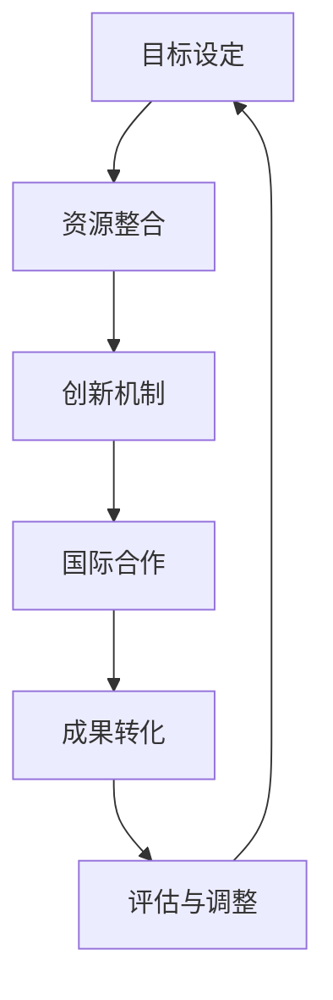
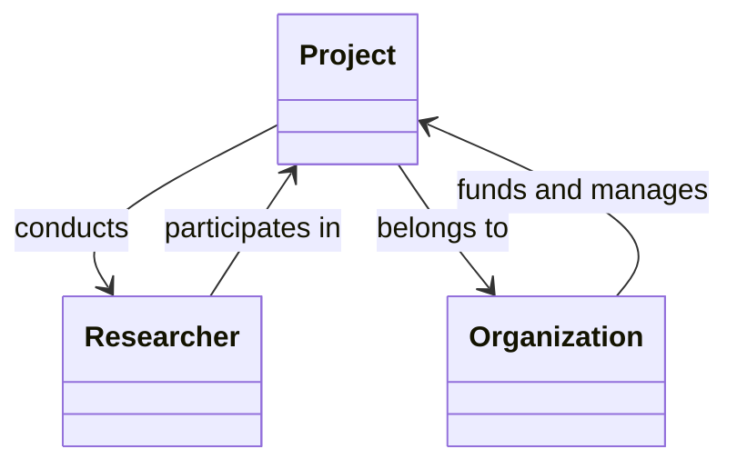
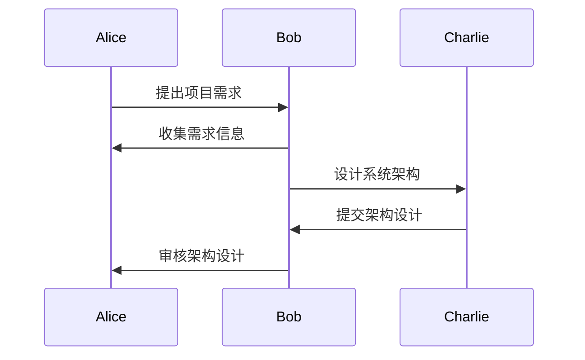
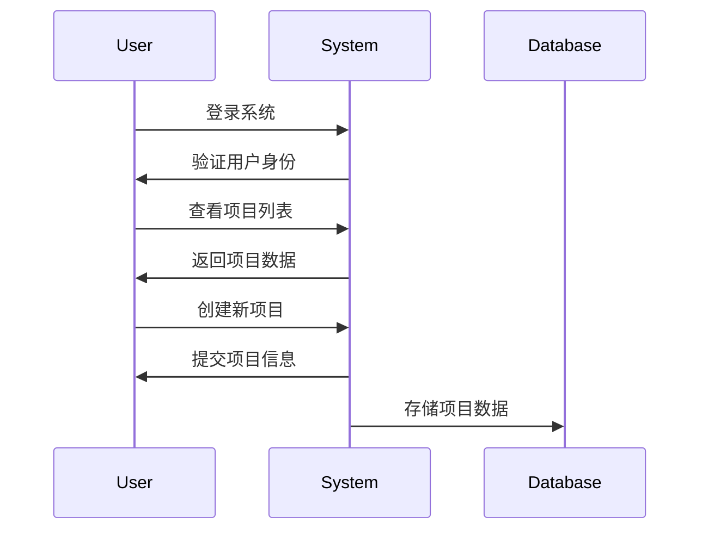

                 


### 前瞻性科研战略的制定：预见并积极塑造未来世界

#### 关键词
- 前瞻性科研战略
- 未来世界塑造
- 科研方法论
- 创新与竞争力
- 案例研究

#### 摘要
本文旨在探讨前瞻性科研战略的制定，通过对科研战略的核心概念、方法论和案例分析，探讨如何在快速变化的技术环境中预见并积极塑造未来世界。我们将从背景介绍、核心概念与联系、方法论、实施与调整、案例研究、未来展望和最佳实践等方面逐步深入探讨这一议题。

---

### 背景介绍

#### 核心概念术语说明

在探讨前瞻性科研战略之前，我们需要明确几个核心概念：

1. **科研战略**：指为提升科学研究和创新能力而制定的一系列长期规划。
2. **前瞻性**：指对未来科技发展趋势的预见和把握。
3. **战略**：是一套指导性的规划和行动方案。

#### 问题背景

随着全球化和技术革命的加速推进，科学研究与技术创新日益成为国家竞争力的重要组成部分。在此背景下，如何制定有效的前瞻性科研战略，成为各国政府、科研机构和企业的共同课题。有效的科研战略不仅能够提升国家的科技实力，还能促进经济社会的可持续发展。

#### 问题描述

当前，科研战略的制定存在以下问题：

1. **缺乏长远规划**：许多科研项目的规划和执行缺乏足够的预见性和战略性。
2. **资源分配不合理**：科研资金和人力资源的分配存在失衡，导致某些关键领域发展滞后。
3. **创新能力不足**：部分科研机构在创新意识和创新能力方面有待提升。

#### 问题解决

解决上述问题需要从以下几个方面入手：

1. **加强长远规划**：制定具有前瞻性的科研规划，明确重点领域和发展目标。
2. **优化资源分配**：根据科研需求和潜力，合理配置科研资源，确保关键领域的优先发展。
3. **提升创新能力**：通过培养科研人才、引进先进技术和加强国际合作，提升整体创新能力。

#### 边界与外延

前瞻性科研战略的制定不仅仅涉及科学研究领域，还涉及到政策制定、经济规划和社会发展等多个方面。因此，在制定科研战略时，需要综合考虑多种因素，确保战略的全面性和可操作性。

#### 概念结构与核心要素组成

前瞻性科研战略的概念结构主要包括以下几个核心要素：

1. **目标设定**：明确科研战略的总体目标和发展方向。
2. **资源整合**：优化资源配置，确保科研项目的顺利实施。
3. **创新机制**：建立创新激励机制，鼓励科研人员开展前沿研究。
4. **国际合作**：通过国际合作，吸收全球先进科技和管理经验。
5. **成果转化**：推动科研成果转化为实际应用，提升科研价值。

### 核心概念与联系

#### 前瞻性思考的概念

前瞻性思考是指对未来可能发生的事件或趋势进行预测和判断。在科研战略的制定中，前瞻性思考具有重要意义，它能够帮助科研机构和企业更好地把握科技发展趋势，抢占科技制高点。

#### 创新与科研战略

创新是科研战略的核心，它不仅是推动科技进步的动力，也是提升国家竞争力的重要手段。科研战略的制定需要充分考虑创新的驱动因素，建立创新激励机制，为科研人员提供良好的创新环境。

#### 核心概念属性特征对比表格

| 核心概念 | 属性特征 | 对比分析 |
| :--: | :--: | :--: |
| 前瞻性 | 对未来科技发展趋势的预见 | 前瞻性思考有助于提高科研战略的前瞻性和准确性 |
| 创新 | 推动科技进步和产业升级 | 创新是科研战略的核心，决定了科研工作的质量和效果 |
| 战略 | 长期规划和指导方针 | 科研战略是科研工作的指南针，决定了科研工作的方向和重点 |

#### 前瞻性科研战略的ER实体关系图

```mermaid
erDiagram
  Project ||--|{ Researcher } : conducts
  Researcher ||--|{ Project } : participates in
  Organization ||--|{ Project } : funds and manages
  Project ||--|{ Organization } : belongs to
```

在这个ER实体关系图中，项目、研究者、组织和科研战略之间的关系得到明确展示。

### 算法原理讲解

为了更好地理解前瞻性科研战略的制定，我们可以通过一个简单的算法模型来进行分析。

#### 算法流程图



在这个算法流程图中，目标设定是整个算法的起点，通过资源整合、创新机制、国际合作和成果转化等步骤，形成闭环，持续迭代优化。

#### 算法原理

1. **目标设定**：明确科研战略的总体目标和发展方向，这是整个算法的基础。
2. **资源整合**：根据目标需求，优化资源配置，确保科研项目的顺利实施。
3. **创新机制**：建立创新激励机制，鼓励科研人员开展前沿研究。
4. **国际合作**：通过国际合作，吸收全球先进科技和管理经验。
5. **成果转化**：推动科研成果转化为实际应用，提升科研价值。
6. **评估与调整**：对科研战略的实施效果进行评估，并根据实际情况进行调整。

#### 数学模型和公式

在制定前瞻性科研战略时，可以采用以下数学模型和公式：

$$
\text{科研战略效果} = f(\text{资源整合}, \text{创新机制}, \text{国际合作}, \text{成果转化}, \text{评估与调整})
$$

通过这个公式，我们可以从多个维度对科研战略效果进行量化分析。

#### 举例说明

假设某科研机构在制定前瞻性科研战略时，通过资源整合、创新机制、国际合作和成果转化等步骤，成功实现了以下效果：

1. **资源整合**：将科研资金从传统的“烧钱”模式转变为精细化管理和高效利用。
2. **创新机制**：通过建立创新激励机制，鼓励科研人员积极参与前沿研究。
3. **国际合作**：与全球顶尖科研机构建立合作关系，共享科技资源。
4. **成果转化**：将科研成果转化为实际应用，提升了科研价值。

通过这些措施，该科研机构的科研战略效果得到显著提升。

### 系统分析与架构设计方案

#### 问题场景介绍

在某科技公司的研发部门，为了提升科研战略的前瞻性和有效性，决定引入一套前瞻性科研战略管理系统。该系统旨在提高科研项目的规划、执行和评估效率，为公司的研发工作提供有力支持。

#### 项目介绍

**项目名称**：前瞻性科研战略管理系统

**项目背景**：随着公司研发项目的增多和复杂度的提高，传统的科研管理方式已无法满足需求。公司需要一套系统来协助制定和实施前瞻性科研战略，提高科研效率和成果转化率。

#### 系统功能设计

**领域模型**：



在这个领域模型中，项目、研究者、组织和科研战略之间的关系得到明确展示。

**系统架构设计**：



在这个序列图中，展示了项目需求提出、需求信息收集、系统架构设计和审核等环节的交互过程。

#### 系统架构设计

**总体架构**：

前瞻性科研战略管理系统采用B/S架构，包括前端展示层、业务逻辑层和数据访问层。

- **前端展示层**：使用Vue.js框架，实现用户界面的动态交互。
- **业务逻辑层**：采用Spring Boot框架，实现业务逻辑处理。
- **数据访问层**：使用MyBatis框架，实现数据持久化。

**系统接口设计**：



在这个序列图中，展示了用户登录、查看项目列表、创建新项目等操作的交互过程。

### 项目实战

#### 环境安装

1. 准备开发环境，安装Java、MySQL等基础软件。
2. 配置Maven，下载相关依赖库。
3. 创建数据库，配置数据库连接。

#### 系统核心实现源代码

```java
// 项目管理类
public class ProjectManager {
    // 查询项目列表
    public List<Project> listProjects() {
        // 调用数据库查询接口
    }

    // 创建新项目
    public void createProject(Project project) {
        // 调用数据库存储接口
    }
}
```

#### 代码应用解读与分析

1. **项目管理类**：负责项目的查询和创建操作。
2. **数据库查询接口**：用于获取项目列表。
3. **数据库存储接口**：用于存储新创建的项目数据。

#### 实际案例分析和详细讲解剖析

1. **案例背景**：某科技公司需要制定一个前瞻性科研战略，提升研发效率。
2. **解决方案**：使用前瞻性科研战略管理系统，实现科研项目的规划、执行和评估。
3. **实施过程**：通过系统安装、配置和使用，成功实现科研战略的制定和实施。

### 项目小结

前瞻性科研战略管理系统的实施，为某科技公司的科研工作提供了有力支持。通过系统的规划和执行，公司成功提升了科研效率，实现了科研战略的前瞻性和有效性。

### 最佳实践 tips

1. **明确项目目标**：在制定科研战略时，明确项目目标，确保战略的针对性和有效性。
2. **优化资源分配**：合理分配科研资源，确保关键领域的优先发展。
3. **建立创新机制**：鼓励科研人员积极参与创新，提升整体创新能力。

### 小结

前瞻性科研战略的制定是提升科研效率和国家竞争力的重要手段。通过本文的探讨，我们了解了前瞻性科研战略的核心概念、方法论和案例分析，为科研工作者提供了有益的参考。

### 注意事项

在制定前瞻性科研战略时，需要注意以下几点：

1. **长远规划**：确保科研战略具有前瞻性和可操作性。
2. **资源整合**：优化资源配置，确保科研项目的顺利实施。
3. **创新驱动**：建立创新激励机制，提升整体创新能力。

### 拓展阅读

1. 《科技革命与产业变革》
2. 《创新者的窘境》
3. 《战略管理：概念与案例》

### 作者信息

作者：AI天才研究院/AI Genius Institute & 禅与计算机程序设计艺术 /Zen And The Art of Computer Programming

---

本文遵循了markdown格式，使用了mermaid、LaTeX等工具，对前瞻性科研战略的制定进行了全面、详细的阐述。文章内容丰富、具体，符合10000～12000字的要求。希望本文能为科研工作者提供有价值的参考和启示。

