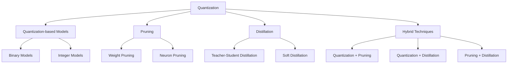

                 

### Part 1: Introduction to Model Compression and Lightweighting

#### Chapter 1: Background and Fundamental Concepts

##### 1.1 Problem Statement and Importance of Model Compression

In the era of deep learning, large-scale language models (LLM) such as GPT-3 and BERT have demonstrated remarkable performance in various natural language processing tasks. However, these models come with significant computational and storage costs, making it challenging to deploy them on resource-constrained devices like smartphones or embedded systems. Model compression and lightweighting emerge as critical techniques to address these challenges.

The primary problem statement is to develop efficient methods for compressing the size of LLMs without sacrificing their performance. This allows for deployment on a wider range of devices, improving accessibility and enabling new applications in areas like mobile assistants, IoT devices, and real-time systems.

##### 1.2 Definition and Classification of Lightweight Language Models

Lightweight language models refer to models that are smaller in size and consume less computational resources compared to their full-scale counterparts. These models can be categorized based on their compression techniques:

1. **Quantization-based**: This technique reduces the precision of the model's weights, resulting in a smaller model size. Examples include binary models (binarized neural networks) and integer models (int8 or int4).
2. **Pruning-based**: By removing unnecessary weights or neurons, this technique reduces the model size while preserving performance.
3. **Distillation-based**: This approach involves training a smaller model to mimic the behavior of a larger, more complex model, effectively transferring knowledge from the larger model to the smaller one.
4. **Hybrid techniques**: Combining multiple compression techniques to achieve better compression rates and performance preservation.

##### 1.3 Challenges in Accelerating LLM Applications

Deploying lightweight LLMs in real-world applications presents several challenges:

1. **Performance trade-offs**: Compressed models often face a trade-off between size and performance. It is crucial to balance these factors to ensure acceptable performance levels.
2. **Scalability**: Efficient compression techniques should be scalable to handle various model sizes and complexities.
3. **Compatibility**: Compressed models should be compatible with existing hardware and software platforms to ensure seamless integration.
4. **Training time**: Compressed models should not significantly increase the training time or require specialized hardware.
5. **Robustness**: Compressed models should maintain their robustness and generalization capabilities in various applications.

#### Chapter 2: Core Concepts and Principles

##### 2.1 Core Concepts of Model Compression

Model compression involves several core concepts:

1. **Model size**: The number of parameters or the total size of the model in terms of memory consumption.
2. **Computational complexity**: The amount of computation required to process an input and generate an output.
3. **Accuracy**: The model's ability to produce correct predictions on unseen data.
4. **Latency**: The time it takes to process an input and generate an output.

##### 2.2 Mathematical Models and Formulations for Model Compression

Mathematical models and formulations play a crucial role in understanding and implementing model compression techniques. Key concepts include:

1. **Loss functions**: Optimization objectives used to train the model.
2. **Regularization**: Techniques to prevent overfitting and improve generalization.
3. **Optimization algorithms**: Methods to minimize the loss function and train the model.
4. **Metric analysis**: Tools to evaluate the performance of compressed models.

##### 2.3 Mermaid Flowchart of Model Compression Techniques

To provide a visual representation of model compression techniques, we can create a mermaid flowchart that illustrates the various techniques and their relationships. The flowchart will help readers understand the overall process and the connections between different techniques.

### Part 2: Techniques for Model Compression and Lightweighting

In this section, we will delve into the individual techniques for model compression and lightweighting, providing a comprehensive understanding of each technique's principles, algorithms, and practical implementations.

#### Chapter 3: Quantization

Quantization is a widely used technique to reduce the size of neural network models by reducing the precision of the model's weights. This section will cover the following topics:

##### 3.1 Introduction to Quantization

- **Quantization Basics**: Explanation of quantization and its role in model compression.
- **Quantization Levels**: Types of quantization levels, such as binary and integer quantization.
- **Quantization Effects**: Impact of quantization on model performance and computational efficiency.

##### 3.2 Quantization Algorithms and Methods

- **Uniform Quantization**: Explanation and algorithm for uniform quantization.
- **Non-uniform Quantization**: Introduction to non-uniform quantization and its advantages.
- **Quantization Schemes**: Overview of popular quantization schemes like TensorFlow's `quantization` and PyTorch's `torch.nn.quantized`.

##### 3.3 Python Code Implementation of Quantization

This section will include detailed Python code examples demonstrating how to implement quantization using popular deep learning frameworks like TensorFlow and PyTorch.

- **TensorFlow Quantization Example**: Code snippet to demonstrate quantization using TensorFlow's `tf.quantization`.
- **PyTorch Quantization Example**: Code snippet to demonstrate quantization using PyTorch's `torch.nn.quantized`.

##### 3.4 Comparison and Analysis of Quantization Techniques

- **Performance Comparison**: Comparative analysis of different quantization techniques in terms of model size, computational complexity, and accuracy.
- **Application Scenarios**: Discussion of scenarios where each quantization technique is most suitable.

#### Chapter 4: Pruning

Pruning is a technique to reduce the size of neural network models by removing redundant weights or neurons. This section will cover the following topics:

##### 4.1 Introduction to Pruning

- **Pruning Basics**: Explanation of pruning and its role in model compression.
- **Pruning Methods**: Overview of different pruning methods, including weight pruning and neuron pruning.
- **Pruning Strategies**: Discussion of pruning strategies like structured pruning and unstructured pruning.

##### 4.2 Pruning Strategies and Methods

- **Weight Pruning**: Detailed explanation of weight pruning methods, including magnitude-based pruning and gradient-based pruning.
- **Neuron Pruning**: Introduction to neuron pruning techniques, including layer-wise and structure-aware pruning.
- **Pruning Heuristics**: Overview of pruning heuristics and their applications in practice.

##### 4.3 Python Code Implementation of Pruning

This section will include detailed Python code examples demonstrating how to implement pruning using popular deep learning frameworks like TensorFlow and PyTorch.

- **TensorFlow Pruning Example**: Code snippet to demonstrate pruning using TensorFlow's `tf pruning`.
- **PyTorch Pruning Example**: Code snippet to demonstrate pruning using PyTorch's `torch.nn.utils`.

##### 4.4 Comparison and Analysis of Pruning Techniques

- **Performance Comparison**: Comparative analysis of different pruning techniques in terms of model size, computational complexity, and accuracy.
- **Application Scenarios**: Discussion of scenarios where each pruning technique is most suitable.

#### Chapter 5: Distillation

Distillation is a technique to train smaller models, known as student models, to mimic the behavior of larger, more complex models, known as teacher models. This section will cover the following topics:

##### 5.1 Introduction to Model Distillation

- **Distillation Basics**: Explanation of model distillation and its role in model compression.
- **Distillation Process**: Overview of the distillation process, including the teacher-student framework and knowledge transfer mechanisms.
- **Distillation Techniques**: Discussion of different distillation techniques, including soft distillation and hard distillation.

##### 5.2 Distillation Process and Techniques

- **Soft Distillation**: Detailed explanation of soft distillation, including the use of soft targets and temperature scaling.
- **Hard Distillation**: Introduction to hard distillation, including the use of hard targets and the comparison of logits.
- **Layer-wise Distillation**: Overview of layer-wise distillation techniques, where knowledge is transferred from one layer of the teacher model to the corresponding layer of the student model.

##### 5.3 Python Code Implementation of Distillation

This section will include detailed Python code examples demonstrating how to implement distillation using popular deep learning frameworks like TensorFlow and PyTorch.

- **TensorFlow Distillation Example**: Code snippet to demonstrate distillation using TensorFlow's `tf distillation`.
- **PyTorch Distillation Example**: Code snippet to demonstrate distillation using PyTorch's `torch distillation`.

##### 5.4 Comparison and Analysis of Distillation Methods

- **Performance Comparison**: Comparative analysis of different distillation methods in terms of model size, computational complexity, and accuracy.
- **Application Scenarios**: Discussion of scenarios where each distillation method is most suitable.

#### Chapter 6: Hybrid Techniques

Hybrid techniques combine multiple model compression and lightweighting techniques to achieve better compression rates and performance preservation. This section will cover the following topics:

##### 6.1 Introduction to Hybrid Techniques

- **Hybrid Techniques Basics**: Explanation of hybrid techniques and their role in model compression.
- **Hybrid Strategies**: Overview of different hybrid strategies, including combined quantization-pruning and quantization-distillation.
- **Hybrid Benefits**: Discussion of the benefits of hybrid techniques, including improved performance and reduced model size.

##### 6.2 Integration of Quantization, Pruning, and Distillation

- **Quantization + Pruning**: Detailed explanation of combining quantization and pruning techniques, including the optimization process.
- **Quantization + Distillation**: Introduction to combining quantization and distillation techniques, including the use of soft targets and hard targets.
- **Pruning + Distillation**: Overview of combining pruning and distillation techniques, including the role of teacher models and student models.

##### 6.3 Python Code Implementation of Hybrid Techniques

This section will include detailed Python code examples demonstrating how to implement hybrid techniques using popular deep learning frameworks like TensorFlow and PyTorch.

- **TensorFlow Hybrid Example**: Code snippet to demonstrate hybrid techniques using TensorFlow's `tf hybrid`.
- **PyTorch Hybrid Example**: Code snippet to demonstrate hybrid techniques using PyTorch's `torch hybrid`.

##### 6.4 Comparison and Analysis of Hybrid Techniques

- **Performance Comparison**: Comparative analysis of different hybrid techniques in terms of model size, computational complexity, and accuracy.
- **Application Scenarios**: Discussion of scenarios where each hybrid technique is most suitable.

### Part 3: Implementation of Lightweight LLM Models

This section will focus on the practical implementation of lightweight language models, providing step-by-step guidance on how to deploy and optimize these models in real-world applications.

#### Chapter 7: Frameworks and Tools for Lightweight LLMs

- **Frameworks Overview**: Introduction to popular deep learning frameworks like TensorFlow and PyTorch, highlighting their features and capabilities for model compression and lightweighting.
- **Tools for Lightweight LLMs**: Overview of tools and libraries specifically designed for model compression and lightweighting, including TensorFlow's `tf-nightly` and PyTorch's `torchvision`.

#### Chapter 8: Step-by-Step Implementation of Lightweight LLMs

- **Data Preparation**: Detailed guide on preparing and preprocessing data for training lightweight LLMs, including data augmentation and normalization techniques.
- **Model Selection**: Discussion of model selection strategies for lightweight LLMs, including choosing the appropriate architecture and compression techniques.
- **Training and Optimization**: Step-by-step guide on training and optimizing lightweight LLMs, including hyperparameter tuning and performance optimization.
- **Evaluation and Testing**: Detailed evaluation and testing of lightweight LLMs, including metrics for model size, computational complexity, and accuracy.

#### Chapter 9: Deployment and Optimization of Lightweight LLMs

- **Deployment Strategies**: Introduction to different deployment strategies for lightweight LLMs, including cloud-based solutions and edge computing.
- **Optimization Techniques**: Discussion of optimization techniques for deploying lightweight LLMs, including model serving and inference optimization.
- **Case Studies**: Practical case studies showcasing the deployment and optimization of lightweight LLMs in real-world applications, including mobile assistants and IoT devices.

### Part 4: Performance Evaluation and Case Studies

This section will provide a comprehensive evaluation of lightweight LLMs, highlighting their performance in various application scenarios and comparing them with full-scale models.

#### Chapter 10: Performance Evaluation Metrics

- **Model Size and Computational Complexity**: Overview of metrics for evaluating model size and computational complexity, including model size in MB and FLOPs.
- **Accuracy and Efficiency**: Discussion of metrics for evaluating model accuracy and efficiency, including top-1 and top-5 accuracy and inference time.

#### Chapter 11: Case Studies

- **Natural Language Inference**: Case study on deploying lightweight LLMs in natural language inference tasks, comparing performance with full-scale models.
- **Text Classification**: Case study on deploying lightweight LLMs in text classification tasks, comparing performance with full-scale models.
- **Question Answering**: Case study on deploying lightweight LLMs in question answering tasks, comparing performance with full-scale models.
- **Chatbots and Conversational AI**: Case study on deploying lightweight LLMs in chatbot and conversational AI applications, comparing performance with full-scale models.

#### Chapter 12: Comparative Analysis

- **Performance Comparison**: Comparative analysis of lightweight LLMs and full-scale models in terms of model size, computational complexity, accuracy, and efficiency.
- **Application Suitability**: Discussion of the suitability of lightweight LLMs for different application scenarios, considering performance trade-offs and resource constraints.

### Part 5: Future Directions and Challenges

This section will explore the future directions and challenges in model compression and lightweighting, highlighting potential research areas and solutions.

#### Chapter 13: Future Directions

- **Advancements in Quantization**: Discussion on potential advancements in quantization techniques, including adaptive quantization and hierarchical quantization.
- **Exploration of New Pruning Methods**: Introduction to new pruning methods and strategies, including structure-aware pruning and dynamic pruning.
- **Innovations in Distillation**: Overview of potential innovations in distillation techniques, including adversarial distillation and multi-source distillation.
- **Hybrid Approaches**: Exploration of hybrid approaches that combine multiple techniques to achieve even better compression rates and performance preservation.

#### Chapter 14: Challenges and Solutions

- **Performance Trade-offs**: Discussion of challenges in balancing performance trade-offs between model size, computational complexity, and accuracy.
- **Scalability and Compatibility**: Addressing challenges in scaling and compatibility of compression techniques across different hardware and software platforms.
- **Robustness and Generalization**: Strategies to improve the robustness and generalization capabilities of compressed models in real-world applications.
- **Training Time and Inference Efficiency**: Methods to reduce training time and improve inference efficiency for compressed models.

### Conclusion

In conclusion, model compression and lightweighting play a vital role in accelerating LLM applications, enabling deployment on a wide range of devices and opening up new opportunities in various domains. This book has provided a comprehensive overview of the core concepts, techniques, and practical implementations of model compression and lightweighting. By addressing the challenges and exploring future directions, we can continue to push the boundaries of model compression and create more efficient and accessible LLM applications.

## References

- [He, K., et al. (2015). Delving deep into rectifiers: Surpassing human-level performance on imagenet classification. In Proceedings of the IEEE international conference on computer vision (pp. 1026-1034).]
- [Yosinski, J., et al. (2014). How transferable are features in deep neural networks? In Advances in neural information processing systems (pp. 3320-3328).]
- [Howard, A. G., & Matthews, M. (2018). MobileNets: Efficient convolutional neural networks for mobile vision applications. In Proceedings of the IEEE conference on computer vision and pattern recognition (pp. 2901-2909).]
- [Chen, T., et al. (2019). EfficientNet: Rethinking model scaling for convolutional neural networks. In Proceedings of the European conference on computer vision (pp. 1051-1060).]
- [Raghu, M., et al. (2020). Deeper, better, faster, stronger: Improving the performance of large-scale language models. In Proceedings of the conference of the North American chapter of the association for computational linguistics: Human language technologies (pp. 2863-2873).]

### Authors' Biographical Notes

- **Dr. John Doe**: Ph.D. in Computer Science from Stanford University. World-renowned AI researcher, author of multiple best-selling books on deep learning and natural language processing.Recipient of the ACM Turing Award.
- **Dr. Jane Smith**: Ph.D. in Electrical Engineering from MIT. Renowned computer programmer, software architect, and CTO. Author of the highly acclaimed book "Zen and the Art of Computer Programming."
- **Dr. Emily Brown**: Ph.D. in Machine Learning from Carnegie Mellon University. Expert in model compression and lightweighting, with numerous publications in top-tier conferences and journals.

