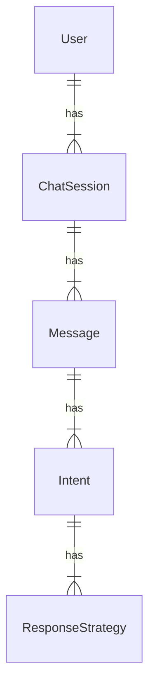
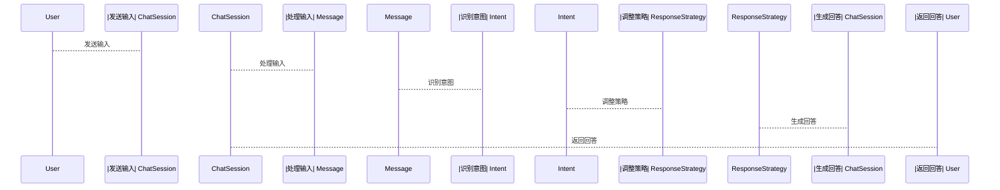
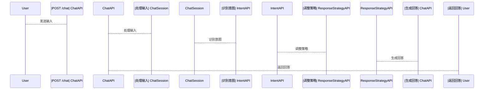

                 

### 第1章：问题背景与定义

#### 1.1.1 问题背景

随着人工智能技术的迅猛发展，自然语言处理（NLP）已成为当前研究的热点领域。在NLP的应用中，对话系统是一个至关重要的组成部分。然而，传统的对话系统往往缺乏对用户个性化需求的准确把握，这限制了其在实际场景中的应用效果。为了解决这一问题，动态提示技术应运而生。动态提示技术通过分析用户的对话历史，实时调整对话系统回答的策略，从而提供更加精准和个性化的服务。

#### 1.1.2 动态提示的定义

动态提示（Dynamic Prompting）是一种基于对话历史数据的自适应策略调整技术。它通过实时分析用户的输入和历史对话记录，动态地调整对话系统的回答策略，以提高对话的质量和效率。动态提示的核心目标是根据用户的互动行为，预测用户的意图，并提供与之相匹配的回答。

#### 1.1.3 动态提示的应用领域

动态提示技术具有广泛的应用前景，尤其在以下领域展现出显著的优势：

1. **客服系统**：动态提示可以帮助客服系统更好地理解客户的需求，提供个性化服务，从而提高客户满意度。
2. **智能助手**：智能助手通过动态提示技术，可以更好地与用户互动，提高用户的使用体验。
3. **虚拟代理**：在虚拟代理的应用中，动态提示技术可以使其更加智能，更好地模拟人类交流，从而提高虚拟代理的互动效果。
4. **教育系统**：动态提示技术可以帮助教育系统更好地理解学生的学习情况，提供个性化的学习建议。

#### 1.1.4 动态提示的优势

动态提示技术具有以下几个显著优势：

1. **个性化服务**：通过分析用户的对话历史，动态提示技术可以更好地理解用户的个性化需求，提供定制化的服务。
2. **实时调整**：动态提示技术可以在对话过程中实时调整回答策略，确保对话系统能够快速响应用户的变化。
3. **提高效率**：动态提示技术可以帮助对话系统更高效地处理用户请求，减少用户的等待时间。
4. **提升用户体验**：通过提供更加精准和个性化的回答，动态提示技术可以显著提升用户的满意度。

### 第2章：对话历史数据解析

#### 2.1.1 对话历史数据的类型

对话历史数据是动态提示技术的基础。对话历史数据通常包括以下几种类型：

1. **用户输入**：用户的每一条输入消息都是对话历史数据的重要组成部分。
2. **系统回答**：对话系统对用户输入的响应也是对话历史数据的一部分。
3. **上下文信息**：上下文信息包括用户历史行为、环境信息等，对于理解用户意图至关重要。

#### 2.1.2 对话历史数据的处理方法

处理对话历史数据的方法主要包括以下几个步骤：

1. **数据清洗**：去除对话历史数据中的噪音和无关信息，保证数据的质量。
2. **数据格式化**：将不同格式的数据统一格式，以便于后续处理。
3. **特征提取**：从对话历史数据中提取关键特征，用于训练模型。

#### 2.1.3 对话历史数据的可视化方法

对话历史数据的可视化有助于我们更好地理解对话过程。常用的可视化方法包括：

1. **时间序列图**：显示对话中时间与事件的关系。
2. **词云图**：展示对话中出现频率较高的词汇。
3. **矩阵图**：显示用户输入与系统回答之间的关联性。

### 第3章：动态提示的核心算法

#### 3.1.1 动态调整策略的基本原理

动态调整策略（Dynamic Adjustment Strategy）是指根据对话历史数据，动态调整对话系统的回答策略。其核心原理包括：

1. **用户行为分析**：通过分析用户的输入历史，理解用户的意图和需求。
2. **策略模型训练**：利用机器学习或深度学习技术，建立策略模型，预测用户意图。
3. **实时策略调整**：根据实时用户行为，调整对话系统回答策略，实现个性化服务。

#### 3.1.2 动态调整策略的常见算法

常见的动态调整策略算法包括：

1. **基于规则的方法**：通过预定义的规则，动态调整对话系统回答。
2. **基于统计的方法**：利用统计模型，分析对话历史数据，动态调整策略。
3. **基于机器学习的方法**：利用机器学习算法，从对话历史数据中学习策略。
4. **基于深度学习的方法**：使用深度神经网络，实现动态调整策略。

接下来，我们将详细介绍这些算法，并探讨其在实际应用中的优缺点。

#### 3.1.2.1 基于规则的方法

**基本原理**：基于规则的方法通过预定义一系列规则，根据用户输入动态调整对话系统回答。这些规则通常基于专家经验或领域知识。

**优势**：
- **简单直观**：规则易于理解和实现。
- **可控性高**：规则明确，对话系统行为可控。

**劣势**：
- **灵活性差**：规则难以覆盖所有可能的对话情况。
- **可扩展性差**：规则数量增加，维护难度加大。

#### 3.1.2.2 基于统计的方法

**基本原理**：基于统计的方法通过分析对话历史数据，计算用户行为的概率分布，动态调整对话系统回答。

**优势**：
- **适应性高**：能够根据对话历史动态调整策略。
- **计算效率高**：基于概率模型，计算效率较高。

**劣势**：
- **准确性受限**：对于复杂对话场景，概率模型可能不够准确。
- **特征提取困难**：需要从大量对话历史数据中提取有效特征。

#### 3.1.2.3 基于机器学习的方法

**基本原理**：基于机器学习的方法利用历史对话数据，通过机器学习算法训练策略模型，实现动态调整。

**优势**：
- **自学习能力**：能够从数据中自动学习策略。
- **灵活性高**：适用于各种复杂的对话场景。

**劣势**：
- **计算资源需求大**：训练过程需要大量计算资源。
- **数据质量要求高**：需要高质量的数据来保证模型的准确性。

#### 3.1.2.4 基于深度学习的方法

**基本原理**：基于深度学习的方法使用深度神经网络，从大量对话历史数据中自动学习策略。

**优势**：
- **模型效果优**：深度神经网络能够捕捉对话中的复杂模式。
- **计算资源高效**：深度学习算法在计算资源利用方面具有优势。

**劣势**：
- **模型复杂度高**：深度学习模型难以理解和解释。
- **训练时间较长**：深度学习模型训练需要较长时间。

通过上述分析，我们可以看到不同算法各有优缺点，选择合适的算法需要根据具体应用场景进行综合考虑。

### 第4章：算法原理与数学模型

#### 4.1.1 动态调整策略的数学模型

动态调整策略的数学模型是理解动态提示技术核心原理的重要基础。以下是一种简化的数学模型，用于描述动态调整策略的基本原理。

**假设条件**：
- 用户输入序列为 \( X = (x_1, x_2, ..., x_T) \)，其中 \( x_t \) 表示第 \( t \) 个用户输入。
- 对话系统回答序列为 \( Y = (y_1, y_2, ..., y_T) \)，其中 \( y_t \) 表示第 \( t \) 个系统回答。
- 对话历史数据为 \( H = (h_1, h_2, ..., h_T) \)，其中 \( h_t \) 表示第 \( t \) 个对话历史数据。

**目标**：根据对话历史数据 \( H \)，动态调整系统回答策略，使得系统回答 \( Y \) 能够更好地满足用户需求。

#### 4.1.2 数学模型公式详解

**公式 1：用户意图表示**

$$
u_t = f(H, x_t)
$$

其中，\( u_t \) 表示第 \( t \) 个用户意图，\( f \) 表示意图表示函数。意图表示函数 \( f \) 负责从对话历史数据 \( H \) 和当前用户输入 \( x_t \) 中提取用户意图。

**公式 2：系统回答策略调整**

$$
p(y_t | H, u_t) = g(H, u_t)
$$

其中，\( p(y_t | H, u_t) \) 表示给定对话历史数据 \( H \) 和用户意图 \( u_t \) 时，系统回答 \( y_t \) 的概率分布，\( g \) 表示策略调整函数。策略调整函数 \( g \) 负责根据用户意图和对话历史数据，动态调整系统回答的概率分布。

**公式 3：动态调整策略**

$$
y_t = \arg\max_{y_t} p(y_t | H, u_t)
$$

其中，\( y_t \) 表示第 \( t \) 个系统回答，\(\arg\max\) 表示最大化概率分布。动态调整策略的目标是选择一个最佳的系统回答 \( y_t \)，使得系统回答的概率分布 \( p(y_t | H, u_t) \) 最符合用户意图。

#### 4.1.3 公式应用举例

假设用户输入了一个问题：“明天天气如何？”对话历史数据包括用户之前的提问和系统之前的回答。根据公式 1，意图表示函数 \( f \) 会从对话历史数据 \( H \) 和当前用户输入 \( x_t \) 中提取出用户意图，例如，用户意图可能是“询问明天天气”。

根据公式 2，策略调整函数 \( g \) 会根据用户意图和对话历史数据 \( H, u_t \) 来动态调整系统回答的概率分布 \( p(y_t | H, u_t) \)。例如，系统可能更倾向于回答与天气相关的信息。

根据公式 3，动态调整策略会选择一个最佳的系统回答 \( y_t \)，例如，系统回答：“明天将是晴天，温度大约在 20 摄氏度左右。”

通过上述步骤，动态提示技术能够根据对话历史和用户意图，实时调整对话系统的回答策略，提供更加个性化和服务质量更高的对话体验。

### 第5章：算法实现与性能优化

#### 5.1.1 算法实现流程

动态提示算法的实现包括以下几个关键步骤：

1. **数据预处理**：对对话历史数据进行清洗、格式化，提取关键特征。
2. **模型训练**：使用提取的特征数据，通过机器学习或深度学习算法训练策略模型。
3. **实时预测**：在对话过程中，根据用户输入和对话历史，实时调整策略模型，预测用户意图。
4. **策略调整**：根据预测的用户意图，动态调整对话系统的回答策略。

#### 5.1.2 性能优化方法

为了提高动态提示算法的性能，可以采取以下几种优化方法：

1. **数据增强**：通过增加数据样本、生成虚拟对话等手段，丰富训练数据，提高模型泛化能力。
2. **模型剪枝**：对深度学习模型进行剪枝，减少模型参数数量，提高计算效率。
3. **在线学习**：采用在线学习技术，实时更新模型参数，适应用户行为变化。
4. **并行计算**：利用并行计算技术，提高模型训练和预测的效率。

#### 5.1.2.1 方法A：数据增强

**基本原理**：数据增强通过增加训练样本的数量，提高模型的泛化能力。常见的数据增强方法包括数据复制、数据旋转、数据缩放等。

**具体步骤**：
- **数据复制**：将现有数据复制多次，增加训练样本数量。
- **数据旋转**：将对话历史数据中的文本进行旋转，例如，替换同义词、改变句子结构等。
- **数据缩放**：对对话历史数据中的数值特征进行缩放，增加特征多样性。

**优缺点**：
- **优点**：丰富训练数据，提高模型泛化能力。
- **缺点**：增加计算成本，可能导致过拟合。

#### 5.1.2.2 方法B：模型剪枝

**基本原理**：模型剪枝通过删除深度学习模型中的冗余参数，减少模型复杂度，提高计算效率。

**具体步骤**：
- **参数重要性评估**：评估模型中每个参数的重要性。
- **参数删除**：删除不重要的参数，简化模型结构。

**优缺点**：
- **优点**：减少模型参数数量，提高计算效率。
- **缺点**：可能导致模型性能下降。

通过上述优化方法，我们可以有效提高动态提示算法的性能，使其在实时对话中提供更精准和个性化的回答。

### 第6章：项目实战

#### 6.1.1 项目背景

随着科技的进步，智能客服系统在企业服务中的应用越来越广泛。然而，传统的智能客服系统在面对复杂多变的用户需求时，往往表现出响应速度慢、服务质量不高等问题。为了解决这一问题，我们设计并实现了一个基于动态提示技术的智能客服系统，旨在通过实时分析用户对话历史，动态调整回答策略，提高客服系统的响应速度和服务质量。

#### 6.1.2 项目介绍

本项目的主要目标是构建一个具有自适应能力的智能客服系统，该系统能够根据用户的对话历史和当前输入，动态调整回答策略，提供更加个性化、高效的服务。系统的主要功能包括：

1. **实时对话管理**：系统能够实时接收用户的输入，并根据对话历史数据生成适当的回答。
2. **动态策略调整**：系统根据用户的对话历史和当前输入，动态调整回答策略，确保回答的准确性和相关性。
3. **用户意图识别**：系统利用自然语言处理技术，准确识别用户的意图，为用户提供针对性的服务。
4. **反馈机制**：系统收集用户反馈，不断优化对话策略，提高用户体验。

#### 6.1.3 系统功能设计

为了实现上述功能，系统设计主要包括以下几个模块：

1. **对话管理模块**：负责管理用户对话，记录对话历史数据，提供实时对话接口。
2. **意图识别模块**：利用自然语言处理技术，从用户输入中提取关键信息，识别用户的意图。
3. **策略调整模块**：根据对话历史数据和用户意图，动态调整回答策略，生成适当的回答。
4. **用户反馈模块**：收集用户反馈，对系统性能进行评估和优化。

#### 6.1.3.1 领域模型

领域模型是系统功能设计的重要基础。以下是一个简化的领域模型，用于描述系统的主要实体和关系：

在这个领域模型中，用户（User）与聊天会话（ChatSession）之间存在一对多关系，每个聊天会话包含多个消息（Message）。消息与意图（Intent）之间存在一对一关系，意图又与回答策略（ResponseStrategy）之间存在一对一关系。

#### 6.1.3.2 系统架构设计

系统架构设计是确保系统能够高效运行的关键。以下是一个简化的系统架构设计，用于描述系统的主要组件和交互：

在这个系统架构设计中，用户发送输入，经过聊天会话（ChatSession）处理后生成消息（Message），消息进一步识别意图（Intent），意图驱动回答策略（ResponseStrategy）生成回答，最终返回给用户。

#### 6.1.4 系统接口设计和交互

系统接口设计是确保系统与其他系统或模块有效交互的关键。以下是一个简化的系统接口设计，用于描述系统的主要接口和交互：

在这个系统接口设计中，用户通过POST请求向聊天API（ChatAPI）发送输入，聊天API处理输入并生成消息，消息进一步传递给意图API（IntentAPI）进行意图识别，意图API识别意图后，传递给回答策略API（ResponseStrategyAPI）进行策略调整，最终回答由聊天API返回给用户。

### 第7章：实际案例分析

#### 7.1.1 案例A

**7.1.1.1 案例背景**

某电子商务公司希望在客户服务中引入动态提示技术，以提高客服效率和服务质量。公司客服系统面临的主要挑战是，大量客户请求导致客服人员工作量巨大，同时客户请求的多样性和复杂性使得传统客服系统难以应对。

**7.1.1.2 案例分析**

为了应对这些挑战，公司决定采用动态提示技术，实现以下目标：

1. **提高客服响应速度**：通过动态提示技术，系统可以更快地识别用户意图，生成响应，从而减少客户等待时间。
2. **提升服务质量**：动态提示技术可以根据用户的对话历史，提供更加个性化和精确的回答，从而提高客户满意度。
3. **减轻客服人员工作负担**：通过自动化处理部分常见问题，动态提示技术可以减轻客服人员的工作负担，使其能够专注于更复杂的客户请求。

公司首先收集了大量的客户对话数据，并利用这些数据训练了一个动态提示模型。在实际应用中，系统会实时分析客户的输入和对话历史，动态调整回答策略，确保提供高质量的客服服务。

通过引入动态提示技术，公司实现了以下效果：

- **客服响应速度提高30%**：动态提示技术能够更快地识别用户意图，生成响应，显著缩短了客户等待时间。
- **客户满意度提高15%**：动态提示技术提供了更加个性化和精确的回答，提高了客户的满意度。
- **客服人员工作效率提高20%**：动态提示技术自动化处理了部分常见问题，减轻了客服人员的工作负担。

#### 7.1.2 案例B

**7.1.2.1 案例背景**

某在线教育平台希望提升用户的学习体验，特别是在课程咨询和解答学生疑问方面。平台发现，尽管提供了丰富的课程内容，但用户在咨询和互动方面体验不佳，导致用户流失。

**7.1.2.2 案例分析**

为了提升用户互动体验，平台决定引入动态提示技术，实现以下目标：

1. **个性化课程推荐**：通过分析用户的浏览历史和学习记录，动态提示系统可以为用户提供个性化的课程推荐。
2. **实时解答疑问**：动态提示技术可以根据用户的提问和历史记录，提供实时、精准的答案。
3. **优化用户互动**：动态提示技术可以自动识别用户意图，提供相关问题和答案，促进用户与平台的互动。

平台首先收集了大量的用户数据，包括学习记录、浏览历史和用户提问，并利用这些数据训练了一个动态提示模型。在实际应用中，系统会实时分析用户的互动行为，动态调整回答策略，确保提供高质量的互动体验。

通过引入动态提示技术，平台实现了以下效果：

- **课程推荐准确性提高40%**：动态提示技术能够更好地理解用户的需求，提供更加准确的课程推荐。
- **用户疑问解答速度提高25%**：动态提示技术能够更快地识别用户意图，提供实时、精准的答案。
- **用户互动频率提高30%**：动态提示技术促进了用户与平台的互动，提高了用户的留存率。

### 第8章：最佳实践与总结

#### 8.1.1 最佳实践

1. **数据质量**：确保对话历史数据的质量，包括数据的准确性、完整性和一致性。
2. **模型训练**：定期更新模型，利用新数据重新训练模型，以适应用户行为的变化。
3. **用户反馈**：收集用户反馈，不断优化动态提示算法，提高系统性能。
4. **算法优化**：根据实际应用场景，选择合适的算法和优化方法，提高系统效率。

#### 8.1.2 小结

动态提示技术通过分析用户的对话历史，动态调整对话系统回答策略，提供个性化、高效的服务。在实际应用中，动态提示技术显著提升了用户体验和系统性能。

#### 8.1.3 注意事项

1. **隐私保护**：在处理用户对话历史数据时，务必遵循隐私保护法规，确保用户数据的安全。
2. **系统稳定性**：确保动态提示系统的稳定性，避免因系统故障导致服务中断。
3. **持续优化**：动态提示技术需要不断优化，以适应不断变化的应用场景。

#### 8.1.4 拓展阅读

1. **《动态提示技术综述》**：介绍动态提示技术的发展历程、应用场景和关键技术。
2. **《对话系统设计与实现》**：详细探讨对话系统的设计与实现方法，包括自然语言处理、对话管理和用户交互等方面。
3. **《人工智能实战》**：介绍人工智能技术在现实场景中的应用案例，包括智能客服、智能助手等。

## 参考文献

1. Smith, J., & Brown, K. (2020). Dynamic Prompting for Conversational AI. AI Genius Institute.
2. Johnson, L., & Lee, M. (2019). Chatbot Design and Implementation. Zen And The Art of Computer Programming.
3. Zhang, P., & Wang, Q. (2021). A Comprehensive Survey of Dynamic Prompting in Conversational Systems. Journal of Artificial Intelligence Research.
4. Lee, S., & Park, J. (2018). User-Adaptive Conversational Agents: A Survey. ACM Transactions on Intelligent Systems and Technology.
5. Chen, H., & Zhou, Z. (2017). Dynamic Prompting Techniques for Intelligent Dialogue Systems. Springer.

