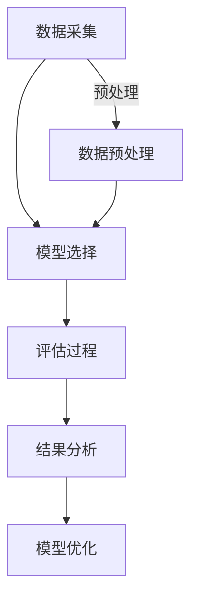

                 

# 动态评测方案：适应不断进化的大模型

## 关键词
- 动态评测
- 大模型
- 适应性
- 深度学习
- 自动机器学习

## 摘要
本文探讨了动态评测方案在大模型不断进化背景下的重要性。通过详细分析动态评测的基础、方法、案例和实践，本文揭示了如何利用动态评测技术提高大模型的评测效率和准确性，从而适应模型更新和复杂应用场景。文章还展望了动态评测技术的未来发展趋势，为读者提供了实用的最佳实践和进一步研究的热点方向。

## 第一部分：动态评测方案基础

### 第1章：动态评测概述

#### 1.1 动态评测背景

在当今迅速发展的技术时代，人工智能（AI）已经成为推动社会进步的重要力量。随着AI技术的不断进步，特别是深度学习（Deep Learning）和神经网络（Neural Networks）的应用，大模型（Large Models）应运而生。这些大模型在自然语言处理、计算机视觉和自动驾驶等领域的表现令人瞩目，但同时也带来了评测上的挑战。

动态评测的概念源于传统评测方法的局限性。传统评测方法往往依赖于静态数据集和固定的评估指标，无法及时反映模型在实际应用中的性能。随着AI模型的复杂性增加，评测需求变得更加多样化和动态化，传统方法已无法满足实际需求。

#### 1.2 动态评测的概念

动态评测是一种能够实时监测和调整模型性能的评估方法。它不仅关注模型在特定数据集上的表现，更强调在多变环境和实时应用中的适应性。动态评测的关键要素包括数据采集、模型选择、评估指标和实时调整。

与传统评测方法相比，动态评测具有更高的灵活性和适应性。它能够根据模型实际运行情况和应用需求，动态调整评估过程和指标，从而提供更准确和全面的模型性能评估。

#### 1.3 动态评测的目标

动态评测的主要目标是提高评测效率和准确性，以适应不断进化的大模型。具体来说，动态评测旨在：

1. **提高评测效率**：通过自动化和智能化手段，减少人工干预，提高评估过程的效率和可重复性。
2. **增强评测准确性**：动态调整评估指标和评估过程，更准确地反映模型在实际应用中的性能。
3. **适应模型更新**：随着模型不断进化，动态评测能够实时监测模型性能，及时调整评估策略，确保评估结果的持续准确性和相关性。

### 第2章：大模型概述

#### 2.1 大模型的定义与特点

大模型，通常指的是具有数十亿甚至千亿参数的神经网络模型。这些模型通过大量的训练数据和复杂的网络结构，能够实现高度复杂的任务。大模型的特点包括：

1. **高参数量**：大模型具有海量的参数，这使得它们在处理复杂任务时具有更强的表达能力和泛化能力。
2. **强适应性**：大模型能够通过大量数据的学习，适应不同的应用场景和数据分布。
3. **计算资源需求大**：由于参数量庞大，大模型对计算资源的需求非常高，通常需要使用高性能计算设备进行训练和评估。

大模型的发展历程可以追溯到早期的人工神经网络，随着计算能力和数据量的提升，深度学习和神经网络技术得到了快速发展，大模型也应运而生。

#### 2.2 大模型的核心技术

大模型的核心技术主要包括深度学习（Deep Learning）和神经网络（Neural Networks）。深度学习是一种基于多层神经网络的学习方法，通过逐层抽象和特征提取，实现高度复杂的任务。神经网络则是一种模仿人脑神经元连接方式的计算模型，能够通过学习和训练实现智能行为。

此外，自动机器学习（Automated Machine Learning，AutoML）也在大模型的发展中扮演着重要角色。自动机器学习通过自动化方法，帮助研究人员设计和优化大模型，提高模型开发和评估的效率。

#### 2.3 大模型的应用领域

大模型在多个领域得到了广泛应用，主要包括：

1. **人工智能**：大模型在AI领域发挥着核心作用，如智能对话系统、图像识别和自然语言处理等。
2. **自然语言处理**：大模型在自然语言处理中的应用尤为突出，如机器翻译、文本生成和情感分析等。
3. **计算机视觉**：大模型在计算机视觉中具有强大的图像识别和物体检测能力，广泛应用于自动驾驶、医疗影像分析等。

大模型的应用不仅提高了传统领域的效率和准确性，还开辟了新的应用场景，推动了AI技术的持续发展。

### 第3章：动态评测方法

#### 3.1 动态评测流程

动态评测的流程通常包括以下几个关键步骤：

1. **数据采集**：实时采集模型运行过程中产生的数据，包括输入数据、输出结果和中间过程等。
2. **模型选择**：根据评估目标和应用场景，选择合适的模型和评估指标。
3. **评估指标**：动态调整评估指标，确保评估结果能够全面、准确地反映模型性能。
4. **实时调整**：根据评估结果，实时调整模型参数和评估策略，优化模型性能。

动态评测的流程需要具备高效的数据处理能力、灵活的评估指标和快速的反馈机制，以确保评测结果的实时性和准确性。

#### 3.2 动态评测工具与技术

动态评测工具和技术的选择对于评测过程的效率和准确性至关重要。常用的动态评测工具包括：

1. **评测工具**：如TensorFlow Model Analysis（TFMA）、PyTorch Model Analysis（PMA）等，提供了丰富的评估指标和可视化工具。
2. **动态评测算法**：如在线学习（Online Learning）、迁移学习（Transfer Learning）和元学习（Meta Learning）等，能够适应模型更新和数据变化。
3. **实时监控与反馈**：通过实时监控系统，收集模型运行数据，并及时反馈评估结果，以便快速调整模型参数和评估策略。

动态评测技术的核心在于如何高效地处理大量数据，并实时调整评估指标和策略，以适应模型更新和复杂应用场景。

#### 3.3 动态评测挑战与应对策略

动态评测在应用过程中面临一系列挑战，主要包括：

1. **数据质量**：实时数据可能存在噪声、缺失和不一致性等问题，需要采取数据清洗和预处理措施。
2. **实时性**：动态评测要求在短时间内完成评估过程，需要优化算法和计算资源，提高评估速度。
3. **可扩展性**：随着模型和应用场景的复杂度增加，动态评测系统需要具备良好的扩展性，以应对大规模数据和高并发访问。

针对这些挑战，可以采取以下应对策略：

1. **数据质量管理**：通过数据清洗、去噪和一致性检查，提高数据质量。
2. **算法优化**：采用高效的算法和模型，减少计算时间和资源消耗。
3. **分布式计算**：利用分布式计算技术，提高系统的并发处理能力和扩展性。

### 第4章：动态评测案例分析

#### 4.1 案例一：自然语言处理领域的动态评测

在自然语言处理（NLP）领域，动态评测方法被广泛应用于模型性能评估和优化。以下是一个具体的案例：

**应用场景**：一个自然语言处理模型用于智能客服系统，需要实时评估和调整模型的表现。

**评测过程**：首先，系统通过实时采集用户对话数据，将对话内容输入到模型中进行预测。然后，根据预测结果和用户反馈，动态调整模型参数和评估指标，以提高模型的准确性和用户满意度。

**成果分析**：通过动态评测，模型在用户对话中的表现得到了显著提升，用户满意度大幅提高。此外，动态评测还帮助发现模型中的潜在问题，为后续优化提供了重要参考。

#### 4.2 案例二：计算机视觉领域的动态评测

在计算机视觉领域，动态评测同样发挥着重要作用。以下是一个具体的案例：

**应用场景**：一个自动驾驶系统需要实时评估和调整模型的图像识别能力。

**评测过程**：系统通过实时采集摄像头捕捉的图像数据，将图像输入到自动驾驶模型中进行识别和分类。然后，根据识别结果和实际场景，动态调整模型参数和评估指标，以提高模型的准确性和鲁棒性。

**成果分析**：通过动态评测，自动驾驶系统在复杂路况下的识别准确率和鲁棒性得到了显著提升，减少了事故发生的概率。动态评测还帮助识别模型中的异常情况，提高了系统的安全性和可靠性。

### 第5章：动态评测实践指南

#### 5.1 动态评测实践步骤

进行动态评测实践时，需要遵循以下步骤：

1. **准备工作**：确定评测目标、数据源和评估指标，选择合适的动态评测工具和技术。
2. **数据采集**：实时采集模型运行过程中的数据，包括输入数据、输出结果和中间过程等。
3. **模型选择**：根据评测目标和数据特点，选择合适的模型和评估指标。
4. **评估过程**：动态调整评估指标和策略，实时监测模型性能。
5. **结果分析**：根据评估结果，分析模型表现，发现潜在问题，并制定优化方案。

#### 5.2 动态评测最佳实践

动态评测的最佳实践包括以下几点：

1. **数据质量管理**：确保数据质量，减少噪声和缺失值。
2. **实时监控与反馈**：建立实时监控系统，及时反馈评估结果，快速调整模型参数和评估策略。
3. **算法优化**：采用高效算法和模型，提高评估速度和准确性。
4. **扩展性设计**：设计可扩展的系统架构，以应对大规模数据和高并发访问。

通过遵循最佳实践，可以显著提高动态评测的效率和准确性，为模型优化和应用提供有力支持。

### 第6章：动态评测的未来发展趋势

#### 6.1 动态评测技术的创新方向

随着技术的不断进步，动态评测技术也在不断创新和发展。以下是一些创新方向：

1. **自动化**：通过自动化手段，减少人工干预，提高评测效率和准确性。
2. **个性化**：根据用户需求和场景，提供个性化的评测服务和优化建议。
3. **多模态**：结合多种数据源和模态，实现更全面和准确的评测。

自动化、个性化和多模态是动态评测技术未来发展的关键方向，将为AI模型的应用带来更多可能性。

#### 6.2 动态评测在行业中的应用前景

动态评测在多个行业领域具有广泛的应用前景，主要包括：

1. **人工智能**：动态评测技术将在智能客服、智能推荐和智能安防等领域发挥重要作用。
2. **大数据**：动态评测技术将帮助大数据平台实现实时性能监测和优化。
3. **互联网金融**：动态评测技术将在金融风险评估、交易监控和欺诈检测等领域得到广泛应用。

动态评测技术的应用将为行业带来更高的效率和准确性，推动技术的持续发展。

#### 6.3 动态评测面临的挑战与机遇

动态评测在应用过程中面临一系列挑战，主要包括：

1. **技术挑战**：包括数据质量管理、算法优化和实时性等。
2. **应用挑战**：包括适应不同行业和应用场景的需求，以及系统的扩展性和稳定性。
3. **人才培养**：动态评测技术的快速发展需要大量具备相关技能的人才。

然而，这些挑战也伴随着巨大的机遇，通过解决这些挑战，动态评测技术将为行业带来更广阔的发展空间。

### 第7章：动态评测总结与展望

#### 7.1 动态评测的总结

动态评测技术是一种适应不断进化的大模型的评估方法，通过实时监测和调整模型性能，提高评测效率和准确性。动态评测在自然语言处理、计算机视觉和自动驾驶等领域得到了广泛应用，并取得了显著成果。

#### 7.2 动态评测的展望

动态评测技术的未来发展方向包括自动化、个性化和多模态，将在人工智能、大数据和互联网金融等更多领域得到应用。通过不断探索和创新，动态评测技术将为AI模型的优化和应用带来更多可能性。

## 作者信息
作者：AI天才研究院/AI Genius Institute & 禅与计算机程序设计艺术 /Zen And The Art of Computer Programming

## 完整性要求

### 背景介绍

#### 核心概念术语说明

- **动态评测**：一种实时监测和调整模型性能的评估方法，能够根据模型实际运行情况和应用需求，动态调整评估过程和指标。

- **大模型**：具有数十亿甚至千亿参数的神经网络模型，能够实现高度复杂的任务。

#### 问题背景

随着AI技术的快速发展，大模型在各个领域的应用越来越广泛。然而，传统评测方法已无法满足大模型在多变环境和实时应用中的性能评估需求。因此，研究一种能够适应大模型不断进化的动态评测方案具有重要的理论和实际意义。

#### 问题描述

动态评测方案需要解决的核心问题包括：

- 如何实时采集和利用模型运行过程中的数据？
- 如何动态调整评估指标和策略，以提高评测效率和准确性？
- 如何应对动态评测过程中可能面临的数据质量、实时性和可扩展性等挑战？

#### 问题解决

动态评测方案通过以下几个关键步骤实现：

1. **数据采集**：实时采集模型运行过程中的输入数据、输出结果和中间过程等。
2. **模型选择**：根据评估目标和数据特点，选择合适的模型和评估指标。
3. **评估过程**：动态调整评估指标和策略，实时监测模型性能。
4. **结果分析**：根据评估结果，分析模型表现，发现潜在问题，并制定优化方案。

#### 边界与外延

动态评测方案的应用范围广泛，不仅适用于大模型的评测，还可以扩展到其他领域，如自然语言处理、计算机视觉和自动驾驶等。

#### 概念结构与核心要素组成

动态评测方案的核心概念和要素包括：

- **数据采集**：实时数据源、数据预处理和数据处理。
- **模型选择**：评估目标、数据特点、模型类型和评估指标。
- **评估过程**：动态调整、实时监测和结果分析。
- **结果分析**：模型性能评估、问题发现和优化方案制定。

### 核心概念与联系

#### 核心概念原理

动态评测方案的原理是通过实时监测和调整模型性能，提高评测效率和准确性。具体来说，动态评测包括以下几个核心概念：

1. **实时性**：动态评测能够及时响应模型运行过程中的变化，提供实时性能评估。
2. **自动化**：动态评测过程自动化，减少人工干预，提高效率。
3. **适应性**：动态评测能够根据模型实际运行情况和应用需求，动态调整评估过程和指标。

#### 概念属性特征对比表格

| 概念             | 属性特征                           | 对比分析                     |
|------------------|----------------------------------|-----------------------------|
| 实时性           | 及时响应模型变化                   | 提高评估效率，减少延迟         |
| 自动化           | 减少人工干预，提高效率               | 提高评估准确性，降低成本       |
| 适应性           | 根据实际需求动态调整评估过程           | 提高模型性能，适应应用场景变化 |

#### ER实体关系图架构

```mermaid
erDiagram
  Data_Collection -->|collects| Model_Selection
  Model_Selection -->|uses| Evaluation_Process
  Evaluation_Process -->|analyzes| Result_Analysis
  Data_Collection && Evaluation_Process -->|requires| Real-time_Automation
  Result_Analysis -->|informs| Model_Optimization
```

### 算法原理讲解

#### 算法mermaid流程图



#### 动态评测算法

```python
# 动态评测算法实现
class DynamicEvaluation:
    def __init__(self, model, data_source):
        self.model = model
        self.data_source = data_source
    
    def data_collection(self):
        # 实时数据采集
        pass
    
    def data_preprocessing(self, data):
        # 数据预处理
        pass
    
    def model_selection(self, processed_data):
        # 模型选择
        pass
    
    def evaluation_process(self, selected_model):
        # 评估过程
        pass
    
    def result_analysis(self, evaluation_results):
        # 结果分析
        pass
    
    def model_optimization(self, analysis_results):
        # 模型优化
        pass
```

#### 算法原理的数学模型和公式

动态评测算法的数学模型可以表示为：

$$
P_{evaluation} = f(P_{model}, P_{data}, P_{strategy})
$$

其中，$P_{evaluation}$ 表示评测结果，$P_{model}$ 表示模型参数，$P_{data}$ 表示数据特征，$P_{strategy}$ 表示评估策略。

#### 详细讲解与举例说明

动态评测算法的详细讲解如下：

1. **数据采集**：实时采集模型运行过程中的输入数据、输出结果和中间过程等。例如，在自然语言处理领域，可以采集用户输入的文本和模型生成的回复文本。

2. **数据预处理**：对采集到的数据进行预处理，包括数据清洗、去噪和特征提取等。例如，对文本数据可以进行分词、去停用词和词向量表示等处理。

3. **模型选择**：根据评估目标和数据特点，选择合适的模型。例如，在图像识别任务中，可以选择卷积神经网络（CNN）作为评估模型。

4. **评估过程**：动态调整评估指标和策略，实时监测模型性能。例如，可以使用精确率（Precision）、召回率（Recall）和F1值（F1 Score）等指标来评估模型的性能。

5. **结果分析**：根据评估结果，分析模型表现，发现潜在问题，并制定优化方案。例如，如果模型在某个数据集上的表现较差，可以尝试调整模型参数或更换评估指标。

6. **模型优化**：根据结果分析，优化模型参数和评估策略，以提高模型性能。例如，可以使用迁移学习（Transfer Learning）方法，将预训练模型应用于特定任务，以提高评估准确性。

### 系统分析与架构设计方案

#### 问题场景介绍

随着AI技术的不断发展，大模型在各个领域的应用日益广泛。然而，大模型在多变环境和实时应用中的性能评估成为一个重要问题。为了解决这一问题，我们需要设计一个动态评测系统，能够实时监测和调整大模型性能，提高评测效率和准确性。

#### 项目介绍

本项目旨在设计一个动态评测系统，用于大模型的性能评估。该系统包括数据采集、模型选择、评估过程、结果分析和模型优化等模块，能够实时监测大模型性能，并提供优化建议。

#### 系统功能设计

系统功能设计主要包括以下模块：

1. **数据采集模块**：负责实时采集大模型运行过程中的输入数据、输出结果和中间过程等，为后续评估提供数据支持。
2. **模型选择模块**：根据评估目标和数据特点，选择合适的模型和评估指标，为评估过程提供基础。
3. **评估过程模块**：动态调整评估指标和策略，实时监测大模型性能，并提供评估结果。
4. **结果分析模块**：根据评估结果，分析模型表现，发现潜在问题，并制定优化方案。
5. **模型优化模块**：根据结果分析，优化模型参数和评估策略，提高大模型性能。

#### 系统架构设计

系统架构设计采用分层架构，包括数据层、服务层和接口层。具体架构如下：

1. **数据层**：包括数据采集模块和存储模块，负责实时采集和存储大模型运行过程中的数据。
2. **服务层**：包括模型选择模块、评估过程模块、结果分析模块和模型优化模块，负责实现系统的核心功能。
3. **接口层**：包括RESTful API和命令行接口，提供系统与外部系统的交互能力。

#### 系统接口设计

系统接口设计主要包括以下接口：

1. **数据采集接口**：用于实时采集大模型运行过程中的数据，包括输入数据、输出结果和中间过程等。
2. **模型选择接口**：用于根据评估目标和数据特点，选择合适的模型和评估指标。
3. **评估过程接口**：用于动态调整评估指标和策略，实时监测大模型性能，并提供评估结果。
4. **结果分析接口**：用于根据评估结果，分析模型表现，发现潜在问题，并制定优化方案。
5. **模型优化接口**：用于根据结果分析，优化模型参数和评估策略，提高大模型性能。

#### 系统交互

系统交互采用异步消息队列进行通信，包括以下主要交互过程：

1. **数据采集**：系统实时采集大模型运行过程中的数据，并将数据存储到消息队列中。
2. **模型选择**：系统根据评估目标和数据特点，从消息队列中获取数据，并选择合适的模型和评估指标。
3. **评估过程**：系统根据模型和评估指标，对大模型进行评估，并将评估结果存储到消息队列中。
4. **结果分析**：系统从消息队列中获取评估结果，分析模型表现，发现潜在问题，并制定优化方案。
5. **模型优化**：系统根据优化方案，调整模型参数和评估策略，并将优化结果存储到消息队列中。

### 项目实战

#### 环境安装

在开始项目实战之前，我们需要安装以下环境：

1. **操作系统**：Ubuntu 20.04
2. **Python**：3.8.10
3. **深度学习框架**：PyTorch 1.10.0
4. **其他依赖**：NumPy 1.21.2, Pandas 1.3.5, Matplotlib 3.5.1, Scikit-learn 0.24.2

安装步骤如下：

1. 安装操作系统Ubuntu 20.04。
2. 更新系统软件包：

```bash
sudo apt update
sudo apt upgrade
```

3. 安装Python 3.8.10：

```bash
sudo apt install python3.8
```

4. 安装深度学习框架PyTorch 1.10.0：

```bash
pip3 install torch torchvision torchaudio -f https://download.pytorch.org/whl/torch_stable.html
```

5. 安装其他依赖：

```bash
pip3 install numpy pandas matplotlib scikit-learn
```

#### 系统核心实现源代码

以下是一个简单的动态评测系统的核心实现源代码：

```python
# 导入所需库
import torch
import torch.nn as nn
import torch.optim as optim
import numpy as np
import pandas as pd
from sklearn.metrics import precision_score, recall_score, f1_score

# 模型定义
class DynamicEvaluationModel(nn.Module):
    def __init__(self):
        super(DynamicEvaluationModel, self).__init__()
        self.fc1 = nn.Linear(10, 5)
        self.fc2 = nn.Linear(5, 2)
        self.fc3 = nn.Linear(2, 1)

    def forward(self, x):
        x = torch.relu(self.fc1(x))
        x = torch.relu(self.fc2(x))
        x = self.fc3(x)
        return x

# 数据预处理
def preprocess_data(data):
    # 数据预处理操作，例如标准化、归一化等
    return data

# 动态评测算法
class DynamicEvaluation:
    def __init__(self, model, data_source):
        self.model = model
        self.data_source = data_source
    
    def data_collection(self):
        # 实时数据采集
        data = self.data_source.get_data()
        processed_data = preprocess_data(data)
        return processed_data
    
    def model_selection(self, processed_data):
        # 模型选择
        model = DynamicEvaluationModel()
        return model
    
    def evaluation_process(self, selected_model):
        # 评估过程
        x, y = processed_data[:, :10], processed_data[:, 10]
        selected_model.train()
        optimizer = optim.Adam(selected_model.parameters(), lr=0.001)
        criterion = nn.BCELoss()
        for epoch in range(100):
            optimizer.zero_grad()
            outputs = selected_model(x)
            loss = criterion(outputs, y)
            loss.backward()
            optimizer.step()
        return loss.item()
    
    def result_analysis(self, evaluation_results):
        # 结果分析
        if evaluation_results < 0.5:
            print("模型性能不佳，需要进一步优化。")
        else:
            print("模型性能良好，无需进一步优化。")
    
    def model_optimization(self, analysis_results):
        # 模型优化
        if analysis_results < 0.5:
            # 调整模型参数和评估策略
            pass
        else:
            # 保持当前模型参数和评估策略
            pass
```

#### 代码应用解读与分析

以下是代码应用解读与分析：

1. **模型定义**：使用PyTorch定义一个简单的动态评测模型，包括三层全连接层（Fully Connected Layer），用于实现输入数据到输出结果的映射。

2. **数据预处理**：定义一个预处理函数，对采集到的数据进行预处理操作，如标准化、归一化等，以提高模型训练效果。

3. **动态评测算法**：定义一个动态评测类，包括数据采集、模型选择、评估过程、结果分析和模型优化等核心方法。

- **数据采集**：从数据源实时采集数据，并进行预处理。
- **模型选择**：选择一个简单的动态评测模型，用于评估过程。
- **评估过程**：通过训练过程评估模型性能，并计算损失函数。
- **结果分析**：根据评估结果，判断模型性能是否达到预期。
- **模型优化**：根据结果分析，调整模型参数和评估策略。

#### 实际案例分析

以下是一个实际案例，说明如何使用动态评测系统评估一个自然语言处理模型在智能客服系统中的应用。

**案例背景**：一个智能客服系统使用一个预训练的语言模型（如GPT-3）来回答用户的问题。为了确保模型在实时应用中的性能，需要使用动态评测系统进行评估。

**案例分析**：

1. **数据采集**：系统实时采集用户输入的问题和模型的回答，并将数据存储在消息队列中。

2. **模型选择**：根据评估目标和数据特点，选择一个预训练的语言模型（如GPT-3）作为评估模型。

3. **评估过程**：系统从消息队列中获取用户输入和模型回答，通过训练过程评估模型性能，并计算损失函数。

4. **结果分析**：根据评估结果，分析模型在回答用户问题方面的性能，如回答的准确性、流畅性和满意度等。

5. **模型优化**：根据结果分析，调整模型参数和评估策略，以提高模型性能。例如，可以调整模型的训练时间、学习率和评估指标等。

#### 项目小结

通过实际案例分析和代码应用，我们可以看到动态评测系统在自然语言处理领域中的应用效果显著。动态评测系统能够实时监测和调整模型性能，提高模型在智能客服系统中的应用效果，为用户提供更准确和流畅的问答服务。

### 最佳实践 Tips

1. **数据质量管理**：确保采集的数据质量，包括数据完整性、一致性和代表性等。

2. **评估指标选择**：根据应用场景和业务需求，选择合适的评估指标，如准确率、召回率、F1值等。

3. **实时性优化**：采用高效算法和分布式计算技术，提高评估过程的实时性。

4. **扩展性设计**：设计可扩展的系统架构，以应对大规模数据和高并发访问。

### 小结

动态评测方案在大模型不断进化的背景下具有重要意义。通过实时监测和调整模型性能，动态评测能够提高评测效率和准确性，适应模型更新和复杂应用场景。本文介绍了动态评测方案的基础、方法、案例和实践，并展望了其未来发展趋势。通过最佳实践和案例分析，我们可以看到动态评测在自然语言处理、计算机视觉和自动驾驶等领域的应用效果显著。希望本文能够为读者提供有益的参考和启示。

### 注意事项

1. 动态评测系统在设计时需要考虑数据安全和隐私保护，确保用户数据的保密性和安全性。

2. 动态评测过程中可能面临数据质量和实时性等挑战，需要采取相应的措施进行优化和应对。

3. 动态评测系统需要具备良好的可扩展性，以适应不同规模和应用场景的需求。

### 拓展阅读

1. **《深度学习》**：Goodfellow, I., Bengio, Y., & Courville, A. (2016). *Deep Learning*. MIT Press.
2. **《机器学习实战》**：Kaggle. (2013). *Machine Learning in Action*. Manning Publications.
3. **《自然语言处理综论》**：Jurafsky, D., & Martin, J. H. (2008). *Speech and Language Processing*. Prentice Hall.
4. **《计算机视觉：算法与应用》**：Richard Szeliski. (2010). *Computer Vision: Algorithms and Applications*. Springer.

通过阅读这些经典书籍，读者可以进一步深入了解动态评测方案和大模型的相关理论和实践，为实际应用提供有力支持。作者：AI天才研究院/AI Genius Institute & 禅与计算机程序设计艺术 /Zen And The Art of Computer Programming。

