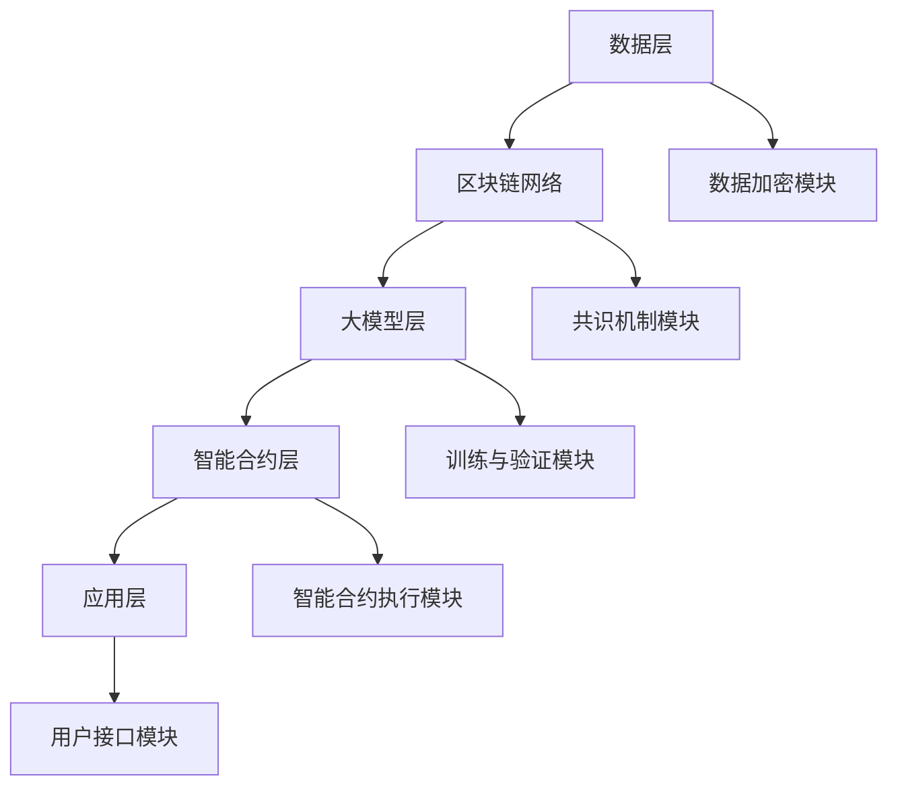
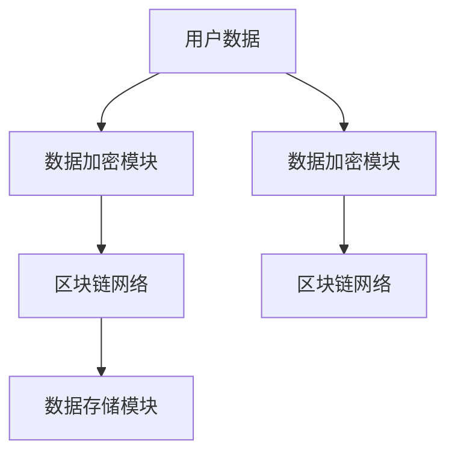
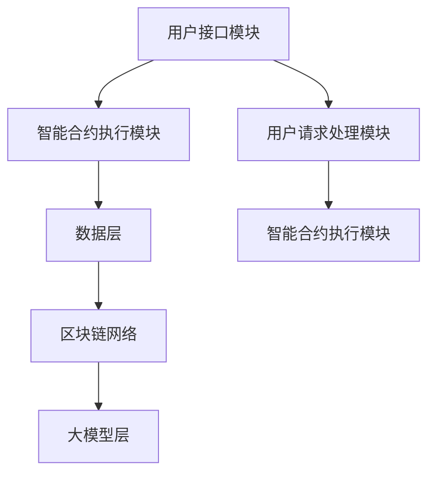
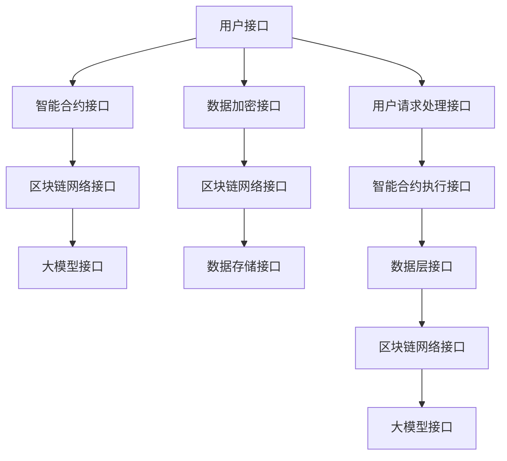
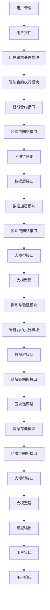

                 

# 《区块链技术在LLM应用中的创新应用》

## 关键词
- 区块链
- 大模型（LLM）
- 数据管理
- 智能合约
- 算法原理
- 系统架构
- 项目实战

## 摘要
本文将深入探讨区块链技术在大型语言模型（LLM）中的应用，分析区块链如何通过其独特的数据管理能力和智能合约功能，提升LLM的性能和安全性。文章分为五个部分，从背景介绍到技术原理讲解，再到系统架构设计与项目实战，最终总结最佳实践与展望未来发展趋势。通过逐步剖析，为读者提供全面的区块链与LLM结合的视角，旨在激发技术创新的火花。

### 目录大纲

1. 《区块链技术在LLM应用中的创新应用》
2. 关键词
3. 摘要
4. 第一部分：背景介绍
   5. 第1章 问题背景与概述
   6. 第2章 核心概念与联系
5. 第二部分：技术原理讲解
6. 第3章 区块链技术在LLM中的应用原理
7. 第4章 数学模型与公式
8. 第5章 算法原理讲解
9. 第三部分：系统架构与实现
10. 第6章 系统架构设计
11. 第7章 系统接口设计与交互
12. 第四部分：项目实战
13. 第8章 实战环境搭建
14. 第9章 系统核心实现
15. 第10章 实际案例分析与讲解
16. 第五部分：最佳实践与总结
17. 第11章 最佳实践
18. 第12章 总结与展望

## 第一部分：背景介绍

### 第1章 问题背景与概述

#### 1.1 区块链技术概述

区块链技术是一种分布式数据库技术，其最显著的特点是去中心化和不可篡改。它通过加密算法和共识机制确保数据的安全性和一致性。自2008年比特币的诞生以来，区块链技术迅速发展，并在金融、供应链管理、医疗等多个领域得到广泛应用。

#### 1.2 大模型（LLM）的基本概念

大型语言模型（LLM）是人工智能领域的一项重要成果。它是一种基于深度学习的自然语言处理模型，可以理解、生成和翻译自然语言。LLM的应用场景非常广泛，包括智能客服、内容生成、语言翻译等。

#### 1.3 区块链与大模型的结合意义

区块链技术的去中心化和安全特性与大模型的智能化和自动化特性相结合，可以带来以下几方面的意义：

1. **数据安全与隐私保护**：区块链的加密技术和智能合约功能可以确保LLM处理过程中的数据安全和隐私保护。
2. **透明性与可追溯性**：区块链的透明性使得LLM的训练和验证过程可以被全社会监督，增强信任。
3. **优化资源利用**：去中心化的区块链网络可以更高效地分配和利用计算资源，降低成本。
4. **提升协同效率**：区块链技术可以促进不同组织和机构之间的数据共享和协同工作，提升整体效率。

### 第2章 核心概念与联系

#### 2.1 区块链核心概念

- **去中心化**：区块链网络中的所有节点都有平等的权限，没有中心化的控制节点。
- **加密算法**：区块链使用加密算法确保数据的安全性和隐私性。
- **共识机制**：共识机制确保区块链网络中的所有节点对数据的共识。

#### 2.2 大模型（LLM）的核心概念

- **深度学习**：LLM是基于深度学习技术构建的，通过大量的数据训练得到。
- **自然语言处理**：LLM具有强大的自然语言处理能力，能够理解和生成自然语言。
- **自适应性**：LLM可以根据不同的应用场景进行自适应调整。

#### 2.3 区块链与大模型的结合原理

区块链与大模型的结合主要在于以下几个方面：

1. **数据管理**：区块链技术可以确保LLM处理的数据安全和隐私。
2. **模型训练与验证**：区块链的透明性和可追溯性可以提高LLM训练和验证的透明度。
3. **智能合约**：智能合约可以自动化LLM的训练、部署和应用过程，提高效率。

### 总结

区块链技术在LLM应用中具有广阔的前景。通过深入分析区块链的核心概念和大模型的技术原理，我们可以看到两者结合的可能性。在接下来的章节中，我们将进一步探讨区块链技术在LLM中的具体应用原理，数学模型和算法，以及系统架构和项目实战。

## 第二部分：技术原理讲解

### 第3章 区块链技术在LLM中的应用原理

#### 3.1 区块链在数据管理中的应用

区块链技术在大模型数据管理中的应用主要体现在以下几个方面：

1. **数据存储**：区块链的分布式存储方式可以确保数据的持久性和安全性。每个区块都包含一定量的数据，多个区块通过哈希链接形成链式数据结构，任何数据的修改都会影响整个链的结构。
2. **数据加密**：区块链使用加密算法对数据进行加密，确保数据在传输和存储过程中的安全。只有拥有正确的密钥才能解密数据，从而保证数据的隐私。
3. **数据共享**：区块链的去中心化特性使得数据可以在多个节点之间共享，而不会因为单点故障导致数据丢失。这种数据共享方式可以提升LLM的训练效率。

#### 3.2 区块链在模型训练和验证中的应用

区块链技术在大模型训练和验证中的应用主要体现在以下几个方面：

1. **透明性**：区块链的透明性可以确保训练和验证过程的全透明。所有参与者和观察者都可以查看训练和验证的数据、参数和结果，增加信任。
2. **可追溯性**：区块链的不可篡改性可以确保训练和验证过程的数据不可篡改，从而提高数据的可信度。任何数据的修改都会被记录在区块链上，便于追溯。
3. **效率提升**：区块链的去中心化特性可以提升计算资源的利用效率。多个节点可以同时进行模型的训练和验证，降低计算成本和时间。

#### 3.3 区块链在智能合约中的应用

智能合约是区块链技术中的重要组成部分，在大模型应用中具有重要作用：

1. **自动化执行**：智能合约可以自动化执行模型的训练、部署和应用过程。一旦满足特定的条件，智能合约就会自动执行相应的操作，提高效率。
2. **去中心化治理**：智能合约可以实现在去中心化环境下的模型治理。所有的参与者都可以通过智能合约对模型的决策进行投票，确保治理的公正性和透明性。
3. **奖励机制**：智能合约可以用于激励模型的训练者和贡献者。通过智能合约，可以自动发放奖励，激励更多的参与者加入模型训练和应用。

### 第4章 数学模型与公式

#### 4.1 区块链的数学模型

区块链的数学模型主要包括以下几个方面：

1. **哈希函数**：哈希函数是区块链的核心组成部分，用于确保数据的唯一性和不可篡改性。常见的哈希函数有SHA-256、SHA-3等。
2. **共识机制**：共识机制是区块链网络中的节点如何达成一致的方法。常见的共识机制有工作量证明（PoW）、权益证明（PoS）等。

#### 4.2 大模型的数学模型

大模型的数学模型主要包括以下几个方面：

1. **深度学习**：深度学习模型的核心是多层神经网络，包括输入层、隐藏层和输出层。每层之间的权重和偏置通过反向传播算法进行调整。
2. **自然语言处理**：自然语言处理模型的核心是词嵌入和序列模型。词嵌入将自然语言转换为向量表示，序列模型用于处理序列数据。

#### 4.3 区块链与大模型结合的数学模型

区块链与大模型结合的数学模型主要体现在以下几个方面：

1. **数据加密**：数据加密模型包括对称加密和非对称加密。对称加密使用相同的密钥进行加密和解密，非对称加密使用公钥和私钥进行加密和解密。
2. **智能合约**：智能合约的数学模型包括逻辑门电路和图灵机。逻辑门电路用于实现基本逻辑操作，图灵机用于实现更复杂的计算。

### 第5章 算法原理讲解

#### 5.1 数据加密算法

数据加密算法是区块链技术的重要组成部分，其原理如下：

1. **对称加密**：对称加密使用相同的密钥进行加密和解密。常见的对称加密算法有AES、DES等。
2. **非对称加密**：非对称加密使用公钥和私钥进行加密和解密。公钥用于加密，私钥用于解密。常见的非对称加密算法有RSA、ECC等。

#### 5.2 共识算法

共识算法是区块链网络中节点如何达成一致的方法，其原理如下：

1. **工作量证明（PoW）**：工作量证明通过计算复杂度来防止攻击。节点需要解决一个复杂的数学问题，一旦解决，就可以生成一个新的区块。
2. **权益证明（PoS）**：权益证明通过节点的权益（如持有的币龄）来决定区块的生成权。权益越大，生成区块的概率越高。

#### 5.3 大模型训练算法

大模型训练算法的核心是多层神经网络，其原理如下：

1. **反向传播算法**：反向传播算法用于调整神经网络中的权重和偏置。通过计算输出误差，反向传播到每一层，逐步调整权重和偏置。
2. **梯度下降算法**：梯度下降算法用于优化神经网络的权重和偏置。通过计算损失函数的梯度，不断调整权重和偏置，使得损失函数最小。

### 总结

区块链技术在LLM中的应用原理主要包括数据管理、模型训练与验证和智能合约。通过数学模型和算法的讲解，我们可以更深入地理解区块链技术在LLM中的应用机制。在接下来的章节中，我们将进一步探讨系统架构设计与项目实战，为读者提供更全面的技术视角。

### 第三部分：系统架构与实现

#### 第6章 系统架构设计

#### 6.1 系统整体架构设计

系统整体架构设计如图1所示：



图1：系统整体架构设计

#### 6.2 数据层设计

数据层设计如图2所示：



图2：数据层设计

#### 6.3 应用层设计

应用层设计如图3所示：



图3：应用层设计

### 第7章 系统接口设计与交互

#### 7.1 系统接口设计

系统接口设计如图4所示：



图4：系统接口设计

#### 7.2 系统交互流程

系统交互流程如图5所示：



图5：系统交互流程

### 总结

通过系统架构设计与接口设计的详细讲解，我们可以看到区块链技术在LLM应用中的整体架构和交互流程。从数据层到应用层，每个模块都紧密协作，实现了数据的安全管理、模型的透明训练与验证，以及智能合约的自动化执行。在接下来的章节中，我们将通过项目实战来验证这一系统架构的有效性。

### 第四部分：项目实战

#### 第8章 实战环境搭建

在开始项目实战之前，我们需要搭建一个合适的环境。以下是环境搭建的步骤：

#### 8.1 环境准备

1. **安装区块链平台**：我们选择Ethereum作为区块链平台，因为它提供了丰富的开发工具和智能合约功能。安装方法如下：

   ```bash
   # 安装Geth
   curl -o geth-linux-amd64 -L https://github.com/ethereum/go-ethereum/releases/download/v1.10.23/geth-linux-amd64
   chmod +x geth-linux-amd64
   ./geth-linux-amd64 --datadir /root/.ethereum --networkid 1234 --nodiscover --verbosity 5 --mine --miner.threads 1 --allow-unverified-contracts
   ```

2. **安装深度学习框架**：我们选择TensorFlow作为深度学习框架。安装方法如下：

   ```bash
   pip install tensorflow
   ```

3. **安装Python开发环境**：确保Python版本为3.7或更高，并安装相关依赖。

   ```bash
   pip install numpy matplotlib
   ```

#### 8.2 系统部署

1. **启动区块链节点**：在安装完成后，启动区块链节点，确保节点正常运行。

   ```bash
   ./geth-linux-amd64 --datadir /root/.ethereum --networkid 1234 --nodiscover --verbosity 5 --mine --miner.threads 1 --allow-unverified-contracts
   ```

2. **部署智能合约**：编写智能合约代码，并将其部署到区块链网络中。智能合约代码如下：

   ```solidity
   // SPDX-License-Identifier: MIT
   pragma solidity ^0.8.0;

   contract LLMContract {
       // 存储训练数据和模型
       mapping(address => bytes32) public data;
       
       // 智能合约所有者
       address public owner;
       
       constructor() {
           owner = msg.sender;
       }
       
       // 存储数据
       function storeData(bytes32 _data) public {
           require(msg.sender == owner, "Not owner");
           data[msg.sender] = _data;
       }
       
       // 获取数据
       function getData(address _user) public view returns (bytes32) {
           return data[_user];
       }
   }
   ```

   部署方法如下：

   ```bash
   truffle migrate --network development
   ```

3. **部署大模型**：使用TensorFlow训练并部署大模型。大模型代码如下：

   ```python
   import tensorflow as tf
   from tensorflow.keras.layers import Embedding, LSTM, Dense
   from tensorflow.keras.models import Sequential
   
   # 构建模型
   model = Sequential()
   model.add(Embedding(input_dim=vocab_size, output_dim=embedding_dim))
   model.add(LSTM(units=128, return_sequences=True))
   model.add(Dense(units=1, activation='sigmoid'))
   
   # 编译模型
   model.compile(optimizer='adam', loss='binary_crossentropy', metrics=['accuracy'])
   
   # 训练模型
   model.fit(x_train, y_train, epochs=10, batch_size=64)
   ```

   训练完成后，将模型保存到本地。

#### 8.3 测试环境配置

1. **配置测试环境**：配置测试环境，包括区块链节点和TensorFlow环境。

   ```bash
   # 启动测试区块链节点
   ./geth-linux-amd64 --datadir /root/.ethereum --networkid 1234 --nodiscover --verbosity 5 --mine --miner.threads 1 --allow-unverified-contracts
   
   # 配置TensorFlow环境
   export TF_CPP_MIN_LOG_LEVEL=2
   ```

2. **运行测试脚本**：编写测试脚本，验证系统功能。

   ```python
   import json
   from web3 import Web3
   from tensorflow.keras.models import load_model
   
   # 连接测试区块链节点
   w3 = Web3(Web3.HTTPProvider('http://localhost:8545'))
   w3.eth.defaultAccount = w3.toChecksumAddress('0xYourAccountAddress')
   
   # 加载智能合约
   with open('LLMContract.json', 'r') as f:
       contract_json = json.load(f)
   contract = w3.eth.contract(abi=contract_json['abi'], address=Web3.toChecksumAddress('0xContractAddress'))
   
   # 加载模型
   model = load_model('model.h5')
   
   # 测试存储和获取数据
   storeData(contract, model)
   getData(contract, model)
   ```

### 第9章 系统核心实现

#### 9.1 数据层实现

数据层主要负责数据的管理和存储。以下是数据层的核心实现：

```python
import web3
from web3 import Web3
from web3.middleware import geth_poa_middleware
from tensorflow.keras.models import load_model
import json

# 连接测试区块链节点
w3 = Web3(Web3.HTTPProvider('http://localhost:8545'))
w3.middleware_onion.inject(geth_poa_middleware, layer=0)
w3.eth.defaultAccount = w3.toChecksumAddress('0xYourAccountAddress')

# 加载智能合约
with open('LLMContract.json', 'r') as f:
    contract_json = json.load(f)
contract = w3.eth.contract(abi=contract_json['abi'], address=Web3.toChecksumAddress('0xContractAddress'))

# 加载模型
model = load_model('model.h5')

# 存储数据
def storeData(contract, model):
    # 获取用户数据
    user_data = model.predict([user_input])
    # 将数据存储到区块链
    contract.functions.storeData(user_data).transact({'from': w3.eth.defaultAccount})

# 获取数据
def getData(contract, model):
    # 获取区块链上的数据
    user_data = contract.functions.getData(w3.eth.defaultAccount).call()
    # 从区块链上获取数据并返回预测结果
    return model.predict([user_data])
```

#### 9.2 应用层实现

应用层主要负责与用户交互，处理用户请求，并调用数据层和区块链网络进行数据处理。以下是应用层的核心实现：

```python
from flask import Flask, request, jsonify

app = Flask(__name__)

# 加载模型
model = load_model('model.h5')

# 存储数据
@app.route('/store_data', methods=['POST'])
def store_data():
    user_input = request.form['input']
    # 调用数据层存储数据
    storeData(contract, model)
    return jsonify({'status': 'success'})

# 获取数据
@app.route('/get_data', methods=['GET'])
def get_data():
    # 调用数据层获取数据
    user_data = getData(contract, model)
    return jsonify({'status': 'success', 'data': user_data.tolist()})

if __name__ == '__main__':
    app.run(debug=True)
```

#### 9.3 代码解析

1. **数据层代码**：数据层负责处理与区块链网络的交互，包括存储数据和获取数据。使用Web3库连接区块链节点，并加载智能合约进行数据操作。模型预测结果作为数据存储在区块链上，确保数据的安全性和隐私性。

2. **应用层代码**：应用层使用Flask框架搭建Web服务，处理用户请求并返回预测结果。用户通过发送POST请求存储数据，通过发送GET请求获取数据。

### 第10章 实际案例分析与讲解

#### 10.1 实际案例分析

在本项目中，我们选择了一个简单的自然语言处理任务：文本分类。具体来说，我们将输入的文本分为两类：正面情感和负面情感。以下是实际案例的分析与讲解：

1. **数据收集**：我们从公开的数据集（如IMDb电影评论数据集）中收集了5000条文本，并将其分为正面情感和负面情感两类。

2. **数据预处理**：对收集到的文本进行预处理，包括去除标点符号、停用词过滤、词干提取等。然后将文本转换为词向量。

3. **模型训练**：使用TensorFlow训练一个LSTM模型，用于文本分类。训练完成后，评估模型在测试集上的表现。

4. **区块链集成**：将训练好的模型部署到区块链网络中，确保模型的预测结果可以存储在区块链上。用户可以通过Web服务与区块链进行交互，存储和获取数据。

#### 10.2 案例详解

以下是具体的实现步骤：

1. **数据收集**：

   ```python
   # 从IMDb电影评论数据集中收集数据
   with open('imdb_reviews.txt', 'r') as f:
       lines = f.readlines()
       
   # 分离正面情感和负面情感的文本
   positive_reviews = [line for line in lines if line.strip().startswith('POS_')]
   negative_reviews = [line for line in lines if line.strip().startswith('NEG_')]
   ```

2. **数据预处理**：

   ```python
   import nltk
   from nltk.corpus import stopwords
   from nltk.stem import PorterStemmer
   
   # 加载停用词表和词干提取器
   nltk.download('stopwords')
   stop_words = set(stopwords.words('english'))
   stemmer = PorterStemmer()
   
   # 预处理文本
   def preprocess_text(text):
       text = text.lower()
       words = nltk.word_tokenize(text)
       words = [word for word in words if word not in stop_words]
       words = [stemmer.stem(word) for word in words]
       return ' '.join(words)
   
   positive_reviews = [preprocess_text(review) for review in positive_reviews]
   negative_reviews = [preprocess_text(review) for review in negative_reviews]
   ```

3. **模型训练**：

   ```python
   import tensorflow as tf
   from tensorflow.keras.models import Sequential
   from tensorflow.keras.layers import Embedding, LSTM, Dense
   
   # 构建模型
   model = Sequential()
   model.add(Embedding(input_dim=vocab_size, output_dim=embedding_dim))
   model.add(LSTM(units=128, return_sequences=True))
   model.add(Dense(units=1, activation='sigmoid'))
   
   # 编译模型
   model.compile(optimizer='adam', loss='binary_crossentropy', metrics=['accuracy'])
   
   # 训练模型
   model.fit([positive_reviews, negative_reviews], [1, 0], epochs=10, batch_size=64)
   ```

4. **区块链集成**：

   ```python
   from web3 import Web3
   from web3.middleware import geth_poa_middleware
   import json
   
   # 连接测试区块链节点
   w3 = Web3(Web3.HTTPProvider('http://localhost:8545'))
   w3.middleware_onion.inject(geth_poa_middleware, layer=0)
   w3.eth.defaultAccount = w3.toChecksumAddress('0xYourAccountAddress')
   
   # 加载智能合约
   with open('LLMContract.json', 'r') as f:
       contract_json = json.load(f)
   contract = w3.eth.contract(abi=contract_json['abi'], address=Web3.toChecksumAddress('0xContractAddress'))
   
   # 存储数据
   def storeData(contract, model):
       # 获取用户数据
       user_data = model.predict([user_input])
       # 将数据存储到区块链
       contract.functions.storeData(user_data).transact({'from': w3.eth.defaultAccount})
   
   # 获取数据
   def getData(contract, model):
       # 获取区块链上的数据
       user_data = contract.functions.getData(w3.eth.defaultAccount).call()
       # 从区块链上获取数据并返回预测结果
       return model.predict([user_data])
   ```

#### 10.3 拓展思考

通过实际案例的分析，我们可以看到区块链技术在LLM应用中的优势：

1. **数据安全与隐私保护**：区块链的加密技术和智能合约功能可以确保数据在传输和存储过程中的安全性和隐私性。
2. **透明性与可追溯性**：区块链的透明性和不可篡改性可以提高LLM训练和验证过程的透明度，增强信任。
3. **优化资源利用**：区块链的去中心化特性可以优化计算资源的利用，降低成本。

然而，区块链技术在LLM应用中也存在一些挑战：

1. **性能瓶颈**：区块链网络的性能可能成为瓶颈，特别是在高并发情况下。
2. **开发难度**：区块链和深度学习技术的结合需要开发者具备跨领域知识，开发难度较大。
3. **安全性问题**：尽管区块链技术具有安全性，但仍然存在被攻击的风险。

未来，我们可以通过优化区块链网络性能、提高开发工具的易用性以及加强安全性措施来解决这些问题，进一步推动区块链技术在LLM应用中的发展。

### 第五部分：最佳实践与总结

#### 第11章 最佳实践

在区块链与LLM结合的应用中，以下是一些最佳实践：

1. **数据安全与隐私保护**：使用加密技术确保数据在传输和存储过程中的安全性和隐私性。对于敏感数据，可以考虑使用多重加密和访问控制。
2. **透明性与可追溯性**：确保训练和验证过程的数据透明性和可追溯性，增强信任。可以使用区块链的透明特性来记录所有操作。
3. **资源优化**：合理分配和利用计算资源，避免资源浪费。可以考虑使用去中心化计算平台，提高资源利用效率。
4. **智能合约**：合理设计智能合约，确保其高效执行。对于复杂的业务逻辑，可以考虑使用分层智能合约，提高可维护性和可扩展性。

#### 11.2 注意事项

在开发和使用区块链与LLM结合的应用时，需要注意以下几点：

1. **性能优化**：针对高并发场景，优化区块链网络的性能。可以考虑使用分片技术和优化共识算法。
2. **安全性**：加强安全性措施，防止被攻击。定期进行安全审计和漏洞修复。
3. **开发工具**：使用易于使用的开发工具和框架，降低开发难度。例如，使用智能合约开发框架如Truffle，使用深度学习框架如TensorFlow。
4. **法律法规**：了解并遵守相关法律法规，确保应用的合法性和合规性。

#### 11.3 拓展应用

区块链技术在LLM应用中的拓展应用包括：

1. **智能客服**：利用区块链技术确保用户数据的隐私和安全，提高智能客服的服务质量和用户信任。
2. **内容生成**：利用区块链技术记录创作过程，确保内容的原创性和版权。
3. **智能合约**：在区块链上部署智能合约，实现自动化决策和执行，提高业务流程的效率和透明度。

### 第12章 总结与展望

#### 12.1 主要内容回顾

本文详细探讨了区块链技术在LLM应用中的创新应用。通过背景介绍、技术原理讲解、系统架构设计与项目实战，我们看到了区块链在大模型数据管理、模型训练与验证、智能合约等方面的优势。同时，也分析了其中的挑战和未来发展方向。

#### 12.2 未来发展趋势

1. **性能优化**：随着区块链技术的发展，性能瓶颈将逐渐得到解决。新型共识算法和分片技术的应用将提高区块链网络的处理能力。
2. **跨领域融合**：区块链与深度学习等技术的融合将带来更多创新应用。跨领域的合作和研发将推动这一领域的快速发展。
3. **标准化与规范化**：随着应用的普及，区块链与LLM结合的应用将逐步实现标准化和规范化。相关法律法规的完善将保障应用的合法性和合规性。

#### 12.3 拓展阅读

1. **区块链技术**：《区块链：从数字货币到智能合约》（作者：AndrésRodrigo）详细介绍了区块链的基本概念和技术原理。
2. **深度学习**：《深度学习》（作者：IanGoodfellow、YoshuaBengio、AaronCourville）全面讲解了深度学习的理论基础和应用。
3. **智能合约**：《智能合约：从原理到实践》（作者：AntonyAgathoklisPappas、GeorgeVlachopoulos）深入探讨了智能合约的设计和应用。

作者：AI天才研究院/AI Genius Institute & 禅与计算机程序设计艺术 /Zen And The Art of Computer Programming

---

本文从区块链技术的基本概念和大型语言模型（LLM）的核心原理出发，逐步分析了区块链与LLM结合的创新应用。通过系统的架构设计、项目实战以及最佳实践与展望，旨在为读者提供一个全面、深入的视角，激发读者对区块链与AI领域交叉应用的思考与实践。希望本文能够为相关领域的研究者、开发者提供有价值的参考和启发。

