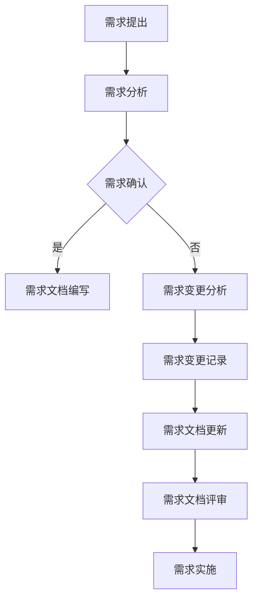
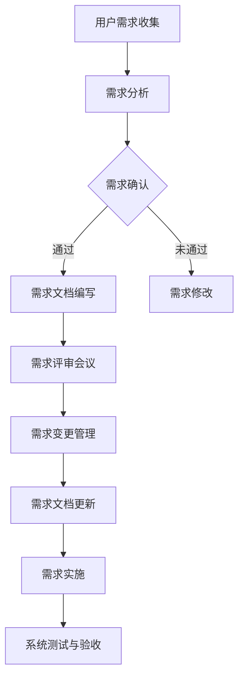
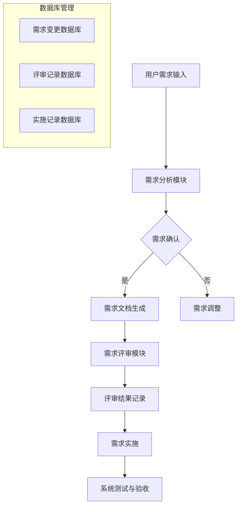

                 

### 第1章：协作型需求评审的概念与重要性

#### 1.1 问题的背景与描述

在当今信息化时代，软件和系统的开发已经成为企业和组织日常运营的核心组成部分。随着技术的发展和商业环境的变化，大型应用系统的开发变得越来越复杂。这些复杂的应用系统不仅要求高效、稳定，还必须满足用户日益增长的多样化需求。然而，在开发过程中，需求的不明确、变更频繁、沟通不畅等问题往往导致项目延期、成本超支和功能缺失，严重影响了应用开发的质量。

**核心概念术语说明：**
- **需求**：用户对系统的功能和性能的具体要求。
- **评审**：对系统需求文档进行审查和评估，以确保需求完整、明确、可行。
- **协作型需求评审**：一种基于团队协作的需求评审方式，通过信息共享、沟通协调和共同决策，提高需求管理的效率和效果。

**问题背景：**
随着项目规模的扩大和参与人员的增多，传统的需求评审方式逐渐暴露出其局限性。首先，传统评审往往依赖于个人经验和主观判断，缺乏系统性和全面性；其次，评审过程中信息传递的不对称和沟通不畅，容易导致误解和冲突；最后，评审的及时性和灵活性不足，难以应对快速变化的需求。

**问题描述：**
- **需求不明确**：缺乏详细的需求说明，导致开发过程中频繁变更。
- **沟通不畅**：团队成员之间的沟通不足，影响协作效率。
- **评审不全面**：评审过程往往注重形式，忽视实质性的需求分析。
- **变更频繁**：需求变更频繁，导致项目进度延误和成本增加。

#### 1.2 协作型需求评审的定义

**概念：**
协作型需求评审是一种基于团队协作的需求评审方法。它强调团队成员之间的信息共享、沟通协调和共同决策，以提高需求管理的效率和效果。通过这种评审方式，可以确保需求文档的完整性和准确性，减少开发过程中的误解和冲突，提高项目的成功率和客户满意度。

**目标：**
- **提高需求质量**：确保需求文档的完整、明确和可行。
- **增强团队协作**：通过信息共享和沟通协调，提高团队协作效率。
- **减少变更风险**：通过及时反馈和调整，降低需求变更对项目进度和成本的影响。
- **提升客户满意度**：满足客户的多样化需求，提高应用系统的实用性和用户体验。

**特点：**
- **基于团队协作**：评审过程强调团队协作，鼓励团队成员积极参与和贡献。
- **信息共享**：通过共享需求文档和相关信息，确保团队成员对需求的全面了解。
- **沟通协调**：评审过程中注重沟通和协调，确保团队成员之间的共识和配合。
- **灵活性和及时性**：评审过程具有灵活性和及时性，能够快速应对需求变更。

**理论基础：**
- **团队合作理论**：强调团队合作在提高工作效率和质量方面的作用。
- **信息共享与沟通理论**：认为信息共享和沟通是团队协作的基础。
- **需求工程理论**：研究如何有效地管理和满足用户需求。

#### 1.3 协作型需求评审的应用领域

**软件工程：**
协作型需求评审在软件工程中具有重要意义。通过有效的需求评审，可以确保软件系统满足用户需求，提高软件质量和开发效率。在软件开发生命周期的各个阶段，如需求分析、设计、实现和测试，协作型需求评审都能发挥重要作用。

**系统工程：**
协作型需求评审在系统工程中同样重要。系统工程师需要确保系统满足用户需求，同时兼顾系统的可靠性、安全性和可维护性。通过协作型需求评审，系统能够更好地应对复杂性和不确定性。

**业务流程管理：**
在业务流程管理中，协作型需求评审可以帮助组织更好地理解业务需求，优化业务流程，提高业务效率和效果。通过评审，可以确保业务流程与信息系统紧密衔接，实现业务流程的信息化和自动化。

#### 1.4 协作型需求评审的流程与方法

**流程：**
协作型需求评审的流程包括预备阶段、实施阶段和总结阶段。

- **预备阶段**：确定评审目标和范围，组建评审团队，制定评审计划。
- **实施阶段**：准备需求文档，组织评审会议，记录和跟踪评审结果。
- **总结阶段**：编写评审总结报告，评估评审效果，制定改进措施和下一步计划。

**方法：**
- **基于团队的评审方法**：鼓励团队成员积极参与，共同讨论和决策。
- **信息共享与沟通协调方法**：通过共享需求文档和相关信息，确保团队成员之间的信息传递和沟通。
- **评审工具和方法**：使用专业的评审工具和方法，如需求管理工具、评审会议技巧和评审标准。

**流程与方法的选择与应用：**
在具体应用中，需要根据项目的特点和需求选择合适的流程和方法。例如，在项目初期，重点可能是需求文档的准备和初步评审；在项目开发过程中，则可能需要频繁的评审和调整。此外，根据团队规模和结构，可以灵活调整评审流程和方法，确保评审过程的顺利进行。

#### 1.5 本章小结

本章介绍了协作型需求评审的概念与重要性，分析了大型应用开发中的挑战和传统需求评审的局限性。通过定义协作型需求评审，阐述了其目标、特点和应用领域。最后，介绍了协作型需求评审的流程与方法，为后续章节的深入探讨奠定了基础。协作型需求评审作为一种基于团队协作的需求管理方法，有助于提高大型应用开发的质量和效率。

---

### 第2章：协作型需求评审的关键要素

#### 2.1 需求者与开发者角色分析

在协作型需求评审中，需求者和开发者是两个核心角色，他们之间的协作关系直接影响到评审的效果和质量。因此，理解并明确这两个角色的职责和角色互动是至关重要的。

**需求者的角色与职责：**

需求者通常是项目的发起者或用户代表，他们负责定义和提出系统的需求。具体职责包括：

- **需求收集**：通过与用户、业务部门和项目团队的沟通，收集和整理用户需求。
- **需求分析**：对收集到的需求进行初步分析，识别需求的优先级和可行性。
- **需求文档编写**：撰写详细的需求文档，明确系统的功能和性能要求。
- **需求确认**：与开发者一起评审需求文档，确保需求描述的准确性和完整性。
- **需求变更管理**：在项目开发过程中，需求者需要及时响应和记录需求的变更，并与开发者协调变更的可行性。

**开发者的角色与职责：**

开发者是负责实现系统需求的技术人员，他们的职责包括：

- **需求理解**：详细阅读和理解需求文档，确保对需求有准确的理解。
- **系统设计**：根据需求文档，设计系统的架构和模块，制定技术方案。
- **编码实现**：根据设计文档，编写系统的代码，实现具体的功能。
- **代码评审**：参与需求评审，对需求文档提出反馈和建议。
- **需求跟踪**：跟踪需求在开发过程中的实现情况，确保需求得到正确实现。
- **问题解决**：在开发过程中遇到问题时，及时与需求者沟通，共同解决。

**双方的角色互动与协作：**

需求者和开发者之间的有效互动和协作是协作型需求评审成功的关键。具体包括：

- **定期沟通**：需求者和开发者应定期召开会议，讨论需求的理解和实现情况，确保双方的信息同步。
- **共同决策**：在评审过程中，需求者和开发者共同参与决策，对需求变更和技术方案进行讨论和选择。
- **文档共享**：需求文档和技术文档应在团队内部共享，确保所有团队成员对项目的理解和需求有共同的认识。
- **问题反馈**：需求者和开发者应及时反馈问题，通过沟通和协作解决开发过程中出现的困难和挑战。
- **持续改进**：通过持续的互动和协作，不断优化需求管理过程，提高项目的开发质量和效率。

#### 2.2 需求文档的质量管理

需求文档是协作型需求评审的核心材料，其质量直接影响到评审的效果和后续的开发工作。因此，对需求文档的质量管理至关重要。

**需求文档的结构：**

一个高质量的需求文档应包括以下结构：

- **封面**：包含文档标题、版本号、编写人、审核人、批准人等基本信息。
- **目录**：列出文档的主要章节和子章节，方便快速定位。
- **引言**：介绍项目的背景、目标和范围，明确需求文档的目的和读者对象。
- **功能需求**：详细描述系统的功能需求，包括用户界面、业务逻辑和数据管理等方面。
- **性能需求**：描述系统的性能指标，如响应时间、处理能力、稳定性等。
- **非功能需求**：描述系统的非功能特性，如安全性、可靠性、可维护性等。
- **约束条件**：列出项目开发过程中需要遵守的限制条件，如技术平台、预算和时间等。
- **需求变更记录**：记录需求变更的历史，包括变更的原因、时间和影响范围。
- **附录**：提供与需求相关的补充材料，如用户手册、技术规范等。

**需求文档的编写标准：**

为了确保需求文档的质量，编写需求文档时应遵循以下标准：

- **准确性**：需求文档应准确地反映用户的需求，避免歧义和误解。
- **完整性**：需求文档应覆盖系统的所有功能模块和性能指标，确保需求的完整性。
- **一致性**：需求文档中的描述应保持一致，避免冲突和矛盾。
- **可理解性**：需求文档应使用通俗易懂的语言，确保非技术背景的读者能够理解。
- **可追踪性**：需求文档中的每个需求都应具有唯一的标识符，方便追踪和管理。
- **格式规范**：需求文档应使用统一的格式和排版，确保文档的可读性和美观性。

**需求文档的评审方法：**

为了确保需求文档的质量，需求文档的评审是一个不可或缺的步骤。常用的评审方法包括：

- **自我评审**：编写人员自行检查需求文档，确保文档的完整性和准确性。
- **同行评审**：邀请其他团队成员对需求文档进行评审，提出反馈和建议。
- **专家评审**：邀请领域专家对需求文档进行评审，确保需求的专业性和可行性。
- **用户评审**：邀请最终用户对需求文档进行评审，确保需求文档满足用户需求。

**评审流程：**

- **预审**：在正式评审前，编写人员对需求文档进行初步审查，发现和纠正错误。
- **正式评审**：组织评审会议，邀请相关人员对需求文档进行详细评审，讨论和解决潜在问题。
- **修改与完善**：根据评审意见，编写人员对需求文档进行修改和完善，确保文档的质量。
- **复审**：对修改后的需求文档进行再次评审，确保所有问题都已得到解决。

#### 2.3 需求管理工具与技术

在现代软件开发中，需求管理工具和技术成为提高需求评审效率和效果的重要手段。以下介绍几种常见的需求管理工具和技术。

**常见需求管理工具：**

- **JIRA**：一款功能强大的需求管理工具，提供需求跟踪、任务管理、协作等功能。
- **Confluence**：一款知识管理工具，可以用于编写和共享需求文档，支持版本控制和协作。
- **Microsoft Azure DevOps**：提供需求管理、任务跟踪、代码管理等功能，适用于各种规模的软件开发项目。
- **Asana**：一款项目管理和协作工具，可以用于管理需求、任务和项目进度。

**需求管理技术的应用：**

- **需求跟踪**：通过需求管理工具，可以实时跟踪需求的状态和进度，确保需求得到及时响应和实施。
- **需求优先级管理**：根据需求的紧急程度和重要性，对需求进行优先级排序，确保关键需求得到优先处理。
- **需求变更管理**：在需求变更发生时，通过需求管理工具记录变更的原因、内容和影响范围，确保变更的可控性。
- **需求文档共享**：通过需求管理工具，可以方便地共享需求文档，确保团队成员对需求有共同的理解。

**需求管理工具的选型与使用：**

选择合适的需求管理工具对于提高需求评审的效率至关重要。以下是一些选型和使用需求管理工具的建议：

- **根据项目需求选择**：根据项目的规模、复杂度和需求特点，选择适合的需求管理工具。
- **集成与兼容性**：确保所选工具与其他项目管理和开发工具集成，提高工作流程的连贯性和效率。
- **培训与支持**：提供必要的培训和技术支持，确保团队成员能够熟练使用需求管理工具。
- **定期评估与优化**：定期评估需求管理工具的使用效果，根据实际情况进行优化和调整。

#### 2.4 协作型需求评审的流程与方法

**协作型需求评审的流程：**

协作型需求评审的流程可以分为三个主要阶段：预备阶段、实施阶段和总结阶段。

- **预备阶段**：
  - 确定评审目标和范围：明确评审的具体目标，如需求文档的质量、完整性、可行性等，并确定评审的范围。
  - 组建评审团队：根据项目需求，组建包括需求者、开发者、测试人员、项目经理等相关人员的评审团队。
  - 制定评审计划：制定详细的评审计划，包括评审时间、地点、评审内容、评审方法等。

- **实施阶段**：
  - 准备需求文档：编写完整、准确的需求文档，确保文档的结构合理、内容详尽。
  - 组织评审会议：召开评审会议，团队成员共同审查需求文档，提出意见和建议。
  - 记录与跟踪评审结果：详细记录评审过程中发现的问题和意见，并跟踪问题的解决情况。

- **总结阶段**：
  - 编写评审总结报告：根据评审结果，编写详细的评审总结报告，总结评审过程中发现的问题、意见和改进建议。
  - 评估评审效果：对评审效果进行评估，如需求文档的完整性、准确性、可行性等。
  - 制定改进措施：根据评估结果，制定改进措施和下一步计划，为后续的需求评审和项目开发提供指导。

**协作型需求评审的方法：**

协作型需求评审的方法多种多样，以下介绍几种常用的方法：

- **面对面评审**：团队成员面对面讨论需求文档，提出意见和建议。这种方法有助于提高沟通效果，但需要确保团队成员的时间和地点协调。
- **远程评审**：通过在线会议、视频通话等远程方式进行评审。这种方法适用于团队成员分布在不同的地点，但需要注意沟通的效率和效果。
- **同行评审**：邀请其他团队成员或外部专家对需求文档进行评审，提供专业意见和建议。这种方法有助于提高需求文档的质量和可行性。
- **用户评审**：邀请最终用户对需求文档进行评审，确保需求文档满足用户需求。这种方法有助于提高用户满意度，但需要合理安排用户的时间和资源。

**流程与方法的选择与应用：**

在实际应用中，应根据项目的特点和需求选择合适的评审流程和方法。以下是一些建议：

- **项目初期**：在项目初期，重点可能是需求文档的准备和初步评审，可以采用面对面评审或同行评审的方法。
- **项目中期**：在项目中期，需求可能发生变化，需要频繁评审和调整，可以采用远程评审或用户评审的方法，确保需求变更得到及时响应。
- **项目后期**：在项目后期，重点可能是对需求文档的细化和确认，可以采用面对面评审或同行评审的方法，确保需求文档的准确性和完整性。

此外，根据团队规模和结构，可以灵活调整评审流程和方法，确保评审过程的顺利进行。例如，对于大型团队，可以采用分阶段、分小组的评审方法，提高评审的效率和质量。

#### 2.5 本章小结

本章介绍了协作型需求评审的关键要素，包括需求者与开发者角色分析、需求文档的质量管理、需求管理工具与技术、协作型需求评审的流程与方法。通过明确需求者与开发者的职责和角色互动，确保需求文档的质量，并利用需求管理工具和技术，提高评审的效率和质量。协作型需求评审作为一种基于团队协作的需求管理方法，有助于提高大型应用开发的质量和效率。

---

### 第3章：协作型需求评审的实践步骤

协作型需求评审的成功实施需要遵循一系列实践步骤，以确保评审目标的实现和项目开发的顺利进行。本章将详细描述协作型需求评审的实践步骤，包括预备阶段、实施阶段和总结阶段的具体操作方法和注意事项。

#### 3.1 预备阶段

**确定评审目标和范围**

预备阶段的首要任务是明确评审的目标和范围。评审目标应具体、可测量，例如确保需求文档的完整性、准确性、可行性等。评审范围应明确包含哪些需求和功能模块，以及评审的时间期限。

- **明确评审目标**：制定具体的评审目标，如需求文档的完整性、准确性、可行性等。
- **定义评审范围**：明确评审包含的功能模块和需求，以及评审的时间期限。

**组建评审团队**

组建一支经验丰富、分工明确的评审团队是确保评审成功的关键。评审团队成员应包括需求者、开发者、测试人员、项目经理等，每个成员都有明确的职责和任务。

- **确定团队成员**：根据项目需求，确定评审团队成员，明确每个成员的职责和任务。
- **分工明确**：确保每个成员对评审目标和范围有清晰的认识，明确各自的任务和职责。

**制定评审计划**

制定详细的评审计划是确保评审过程有序进行的基础。评审计划应包括评审的时间表、地点、评审内容、评审方法、评审结果的跟踪与反馈等。

- **评审时间表**：安排评审会议的时间、地点和持续时间，确保评审过程的连贯性。
- **评审内容**：明确每次评审会议的具体内容，如需求文档的审查、问题讨论、决策等。
- **评审方法**：选择合适的评审方法，如面对面评审、远程评审、同行评审等。

#### 3.2 实施阶段

**准备需求文档**

在实施阶段，需求文档的准备是评审的基础。需求文档应包括功能需求、性能需求、非功能需求等内容，并确保其结构合理、内容详尽、格式规范。

- **编写需求文档**：根据项目需求，编写详细的需求文档，确保文档的完整性、准确性。
- **文档审核**：编写完成后，进行初步审核，确保文档的结构和内容符合要求。

**组织评审会议**

评审会议是实施阶段的核心活动，通过会议，评审团队成员可以共同审查需求文档，提出意见和建议。

- **会议议程**：制定详细的会议议程，包括会议目的、评审内容、讨论议题等。
- **会议记录**：详细记录会议讨论的内容、意见和建议，确保所有关键信息得到记录。

**记录与跟踪评审结果**

评审过程中发现的问题和意见需要及时记录和跟踪，确保问题得到有效解决。

- **问题记录**：记录评审过程中发现的问题和意见，包括问题类型、影响范围、解决方案等。
- **问题跟踪**：定期跟踪问题解决进度，确保所有问题得到及时处理。

#### 3.3 总结阶段

**编写评审总结报告**

评审总结报告是对评审过程的总结和评估，包括评审的发现、问题、建议和改进措施。

- **总结报告内容**：总结报告应包括评审的目标、过程、发现的问题、解决方案和改进措施。
- **报告格式**：使用统一的格式和排版，确保报告的可读性和美观性。

**评估评审效果**

评估评审效果是总结阶段的重要任务，通过评估可以了解评审的实际效果，为后续的评审提供参考。

- **效果评估方法**：采用定量和定性相结合的方法，如问卷调查、关键指标分析等。
- **效果评估内容**：评估评审对需求文档质量的影响、团队成员的参与度和满意度等。

**制定改进措施**

根据评审总结和效果评估，制定改进措施和下一步计划，为未来的需求评审和项目开发提供指导。

- **改进措施**：根据评估结果，制定具体的改进措施，如优化评审流程、提高沟通效率等。
- **下一步计划**：制定下一步的需求评审计划，明确评审的目标、范围和时间安排。

**实践技巧与注意事项**

- **确保评审目标的明确性**：明确评审目标是确保评审过程有序进行的基础。
- **充分利用需求管理工具**：利用需求管理工具提高评审的效率和效果。
- **加强团队沟通**：确保团队成员之间的沟通畅通，提高评审的质量。
- **及时反馈和问题跟踪**：及时记录和跟踪评审过程中发现的问题，确保问题得到有效解决。

#### 3.4 实践技巧与注意事项

**常见问题与解决方案**

- **问题1：评审过程中沟通不畅**
  - **解决方案**：建立畅通的沟通渠道，如定期召开评审会议、使用即时通讯工具等。

- **问题2：评审目标不明确**
  - **解决方案**：在评审前明确评审目标和范围，确保所有团队成员对评审目标有共同的理解。

- **问题3：评审效率低下**
  - **解决方案**：优化评审流程，减少不必要的评审环节，提高评审效率。

- **问题4：需求变更频繁**
  - **解决方案**：建立需求变更管理流程，确保变更的及时性和可控性。

**提高评审效率的技巧**

- **提前准备**：提前准备评审材料，确保评审会议的顺利进行。
- **集中讨论**：集中讨论关键问题和难点，提高评审的效率和质量。
- **分工明确**：明确团队成员的职责和任务，确保评审过程的有序进行。

**应对冲突的策略**

- **冲突识别**：及时识别和解决评审过程中的冲突，避免冲突升级。
- **沟通协调**：通过沟通和协调，寻找共同点和解决方案，减少冲突的影响。
- **中立调解**：在冲突无法自行解决时，邀请中立第三方进行调解，确保公正和客观。

#### 3.5 本章小结

本章详细介绍了协作型需求评审的实践步骤，包括预备阶段、实施阶段和总结阶段的具体操作方法和注意事项。通过明确评审目标和范围、组建评审团队、制定评审计划、准备需求文档、组织评审会议、记录与跟踪评审结果、编写评审总结报告、评估评审效果和制定改进措施，可以确保协作型需求评审的顺利进行和项目开发的成功实施。同时，通过实践技巧与注意事项，可以进一步提高评审的效率和质量，减少冲突和变更风险。

---

### 第4章：大型应用开发中的协作型需求评审案例

在本章中，我们将通过一个大型应用开发的案例，深入探讨协作型需求评审在实际项目中的应用和效果。该案例涉及一个在线购物平台项目，通过协作型需求评审的方式，有效提升了项目开发的质量和效率。

#### 4.1 案例背景

**项目简介：**

该项目是一个大型在线购物平台，旨在为用户提供一站式购物体验。平台包括多个功能模块，如商品展示、购物车、订单管理、支付系统、用户评论和推荐系统等。项目涉及多个业务领域，如电商、物流、支付和用户服务，技术架构复杂，开发团队规模庞大。

**项目需求背景：**

在线购物平台项目需求复杂且多变，需求变更频繁。在项目初期，客户对平台的功能需求不够明确，导致开发过程中需求变更频繁。此外，项目涉及多个部门和团队，沟通不畅，需求理解不一致，影响了项目的进展和开发质量。

**需求评审的目标：**

通过协作型需求评审，旨在解决以下问题：

- 确保需求文档的完整性、准确性和可行性。
- 提高团队协作效率，减少沟通不畅和需求理解不一致的问题。
- 降低需求变更的风险，确保项目进度和成本的稳定。

#### 4.2 案例实施过程

**预备阶段：**

- **确定评审目标和范围**：明确评审的目标是确保需求文档的完整、明确和可行，评审范围包括所有功能模块的需求。

- **组建评审团队**：组建包括需求者、开发者、测试人员、项目经理和业务分析师的评审团队。

- **制定评审计划**：制定详细的评审计划，包括评审的时间表、地点、评审内容和方法。

**实施阶段：**

- **准备需求文档**：编写详细的需求文档，包括功能需求、性能需求和非功能需求，确保文档结构合理、内容详尽。

- **组织评审会议**：召开评审会议，评审团队成员共同审查需求文档，讨论和解决潜在问题。

- **记录与跟踪评审结果**：详细记录评审过程中发现的问题和意见，并跟踪问题的解决情况。

**总结阶段：**

- **编写评审总结报告**：根据评审结果，编写详细的评审总结报告，总结评审过程中发现的问题、意见和改进建议。

- **评估评审效果**：评估评审对需求文档质量和团队协作的影响，如需求文档的完整性、准确性、可行性等。

- **制定改进措施**：根据评估结果，制定改进措施和下一步计划，为未来的需求评审和项目开发提供指导。

#### 4.3 案例分析

**评审成功的关键因素：**

1. **明确的评审目标和范围**：明确评审的目标和范围，确保评审过程有明确的方向和目标。
2. **全面的评审团队**：组建包括需求者、开发者、测试人员、项目经理和业务分析师的评审团队，确保评审的全面性和专业性。
3. **详细的评审计划**：制定详细的评审计划，确保评审过程的有序进行。
4. **有效的需求文档**：编写详细的需求文档，确保文档的质量和可读性。
5. **积极的团队协作**：通过定期沟通和协作，确保团队成员之间的信息共享和共识。

**存在的不足与改进：**

1. **需求变更管理不足**：在项目开发过程中，需求变更管理不够完善，导致部分需求变更没有得到及时处理。改进措施：建立完善的需求变更管理流程，确保变更的及时性和可控性。
2. **沟通不畅**：评审过程中部分团队成员之间的沟通不畅，影响了评审的效率和质量。改进措施：加强团队沟通，建立畅通的沟通渠道，如定期召开评审会议、使用即时通讯工具等。

**对其他项目的启示：**

1. **明确评审目标和范围**：在项目初期，明确评审的目标和范围，确保评审过程有明确的方向和目标。
2. **组建专业的评审团队**：根据项目需求，组建包括需求者、开发者、测试人员、项目经理和业务分析师的评审团队，确保评审的全面性和专业性。
3. **制定详细的评审计划**：制定详细的评审计划，确保评审过程的有序进行。
4. **加强需求变更管理**：建立完善的需求变更管理流程，确保变更的及时性和可控性。
5. **加强团队沟通**：通过定期沟通和协作，确保团队成员之间的信息共享和共识，提高评审的效率和质量。

#### 4.4 本章小结

通过在线购物平台项目的案例，我们深入探讨了协作型需求评审在实际项目中的应用和效果。案例表明，协作型需求评审有助于确保需求文档的完整性、准确性和可行性，提高团队协作效率，减少沟通不畅和需求理解不一致的问题。尽管项目过程中存在一些不足，但通过改进措施，可以进一步提升协作型需求评审的效果，为其他大型应用开发项目提供有益的借鉴和启示。

---

### 第5章：协作型需求评审的最佳实践

#### 5.1 经验总结

在多个大型应用开发项目中，协作型需求评审的应用取得了显著的效果。以下总结了一些成功经验和最佳实践：

**优秀实践案例：**

1. **明确的评审目标**：在项目初期，明确评审的目标和范围，确保评审过程有明确的方向和目标。例如，某电商平台的协作型需求评审明确了需求文档的完整性、准确性和可行性，确保了项目开发的质量和进度。

2. **全面的评审团队**：组建包括需求者、开发者、测试人员、项目经理和业务分析师的评审团队，确保评审的全面性和专业性。这种团队结构有助于多角度审视需求文档，提高评审的质量。

3. **详细的评审计划**：制定详细的评审计划，包括评审的时间表、地点、评审内容和方法，确保评审过程的有序进行。例如，某金融服务平台的项目制定了每周的评审会议计划，确保了评审的连续性和稳定性。

4. **有效的需求文档**：编写详细的需求文档，包括功能需求、性能需求和非功能需求，确保文档结构合理、内容详尽、格式规范。这种高质量的文档为评审和开发提供了坚实的基础。

5. **积极的团队协作**：通过定期沟通和协作，确保团队成员之间的信息共享和共识，提高评审的效率和质量。例如，某在线教育平台的协作型需求评审通过即时通讯工具和在线会议系统，实现了团队成员的实时沟通和协作。

**实践中的难点与应对策略：**

1. **需求变更管理**：在项目开发过程中，需求变更频繁是一个常见的挑战。为了应对这一问题，建议建立完善的需求变更管理流程，确保变更的及时性和可控性。具体措施包括：

   - **需求变更记录**：建立需求变更记录表，记录每次变更的原因、内容和影响范围。
   - **评估变更影响**：在变更提出后，及时评估变更对项目进度、成本和质量的影响，确保变更的合理性和可行性。
   - **变更审批流程**：建立变更审批流程，确保变更经过严格的评审和批准，避免随意变更。

2. **沟通不畅**：评审过程中，团队成员之间的沟通不畅会影响评审的质量和效率。为了解决这一问题，建议采取以下措施：

   - **建立沟通渠道**：建立畅通的沟通渠道，如定期召开评审会议、使用即时通讯工具等。
   - **明确沟通规范**：制定沟通规范，确保团队成员之间的沟通高效、明确。
   - **信息共享**：通过共享需求文档和相关信息，确保团队成员对项目的理解和需求有共同的认识。

**实践中的创新点：**

1. **敏捷评审方法**：在项目开发过程中，采用敏捷评审方法，如Scrum和Kanban，通过短周期迭代和快速反馈，确保需求及时响应和调整。

2. **技术评审工具**：利用现代技术评审工具，如JIRA、Confluence和Azure DevOps，提高评审的效率和质量。这些工具支持需求管理、任务跟踪、文档共享和协作，为团队提供了强大的支持。

3. **用户参与评审**：在评审过程中，邀请最终用户参与评审，确保需求文档满足用户需求，提高用户满意度和系统的实用性。

#### 5.2 注意事项与风险规避

**注意事项：**

1. **确保评审目标的明确性**：在评审前，明确评审的目标和范围，确保评审过程有明确的方向和目标。

2. **组建专业的评审团队**：根据项目需求，组建包括需求者、开发者、测试人员、项目经理和业务分析师的评审团队，确保评审的全面性和专业性。

3. **制定详细的评审计划**：制定详细的评审计划，包括评审的时间表、地点、评审内容和方法，确保评审过程的有序进行。

4. **重视需求变更管理**：建立完善的需求变更管理流程，确保变更的及时性和可控性。

5. **加强团队沟通**：通过定期沟通和协作，确保团队成员之间的信息共享和共识，提高评审的效率和质量。

**风险规避策略：**

1. **需求变更风险**：建立需求变更管理流程，确保变更的及时性和可控性，降低变更对项目进度和质量的影响。

2. **沟通不畅风险**：建立畅通的沟通渠道，制定沟通规范，确保团队成员之间的沟通高效、明确。

3. **评审质量风险**：制定详细的评审计划，确保评审过程的有序进行，提高评审的质量。

4. **技术风险**：确保评审过程中使用的技术和工具成熟可靠，降低技术风险。

#### 5.3 小结

协作型需求评审在提高大型应用开发的质量和效率方面具有重要作用。通过总结优秀实践案例和注意事项，我们可以为未来的需求评审提供有益的指导。同时，建立完善的需求变更管理流程、加强团队沟通和利用现代技术评审工具，是规避风险、确保评审成功的关键。通过持续改进和优化，协作型需求评审将在大型应用开发中发挥更大的作用。

---

### 第6章：协作型需求评审的未来展望

随着信息技术的快速发展，协作型需求评审在大型应用开发中的作用日益凸显。展望未来，协作型需求评审将在多个方面得到进一步的优化和提升。

#### 6.1 技术趋势与发展方向

**人工智能与机器学习：** 人工智能（AI）和机器学习（ML）技术的发展为协作型需求评审带来了新的机遇。通过AI技术，可以自动化需求分析、评审和变更管理，提高评审的准确性和效率。例如，利用自然语言处理（NLP）技术，可以自动提取需求文档中的关键信息，识别潜在的问题和冲突。

**自动化工具与平台：** 自动化工具和平台的不断发展为协作型需求评审提供了更高效、更智能的支持。例如，利用自动化测试工具，可以自动化执行需求验证和测试，提高评审的覆盖率和准确性。同时，基于云计算和大数据技术的需求管理平台，可以实时收集和分析项目数据，为评审提供数据支持。

**区块链技术：** 区块链技术作为一种分布式账本技术，可以用于需求变更管理和审计。通过区块链，可以记录每一次需求变更的详细信息，确保变更的可追溯性和不可篡改性，提高需求变更管理的透明度和可信度。

**物联网（IoT）与边缘计算：** 随着物联网和边缘计算技术的发展，越来越多的设备和系统将连接到互联网，产生海量数据。协作型需求评审需要应对这些数据的需求分析和管理。通过物联网和边缘计算技术，可以实现实时数据采集和分析，为需求评审提供更加准确和及时的数据支持。

#### 6.2 优化与改进方向

**提升自动化水平：** 随着AI和自动化工具的发展，协作型需求评审的自动化水平有望进一步提升。通过自动化需求分析、评审和变更管理，可以减少人工工作量，提高评审效率和准确性。未来，自动化工具将成为协作型需求评审的重要支撑。

**增强团队协作能力：** 协作型需求评审的核心在于团队协作。未来，需要进一步优化团队协作工具和方法，提高团队协作效率和质量。例如，利用协作平台实现实时沟通、任务分配和进度跟踪，增强团队之间的协作能力。

**强化需求变更管理：** 需求变更在大型应用开发中是不可避免的。未来，需要进一步强化需求变更管理，确保变更的及时性、可控性和合理性。通过建立完善的需求变更管理流程、引入变更风险评估机制和建立变更历史记录，可以更好地管理需求变更。

**提高用户参与度：** 用户参与是确保需求评审准确性的关键。未来，需要进一步提高用户在需求评审中的参与度，确保需求文档真正满足用户需求。通过在线调查、用户反馈和实时互动，可以更好地收集用户需求，提高需求评审的质量。

**加强数据支持：** 数据是决策的基础。未来，协作型需求评审需要进一步强化数据支持，利用大数据和人工智能技术，对需求文档进行分析和挖掘，发现潜在的问题和趋势，为评审提供更加科学和客观的依据。

#### 6.3 未来前景与挑战

**前景：**

1. **提高开发效率**：随着自动化和智能化水平的提升，协作型需求评审将大大提高大型应用开发的效率，缩短项目周期，降低开发成本。
2. **提升质量**：通过更加精准的需求分析和评审，可以减少需求误解和冲突，提高软件质量和用户体验。
3. **增强团队协作**：现代化的协作工具和方法将进一步加强团队之间的协作能力，提高项目整体效率和质量。

**挑战：**

1. **技术复杂性**：随着技术的不断发展，协作型需求评审需要应对更加复杂的技术环境，包括自动化工具的集成、数据分析和区块链技术的应用等。
2. **团队协作挑战**：在大型团队和多项目并行的环境中，确保团队成员之间的协作和信息共享仍然是一个挑战。
3. **用户需求变化**：随着市场和技术环境的变化，用户需求不断变化，如何快速响应和调整需求将是一个持续的挑战。

总之，协作型需求评审在未来的发展中将面临诸多机遇和挑战。通过持续的技术创新和团队协作优化，协作型需求评审将在大型应用开发中发挥更加重要的作用，为项目的成功实施提供强有力的支持。

---

## 总结与展望

本文通过详细阐述协作型需求评审的概念、流程、实践步骤以及具体案例，深入探讨了协作型需求评审在大型应用开发中的重要性。协作型需求评审作为一种基于团队协作的需求管理方法，能够有效提升需求文档的质量、增强团队协作、降低需求变更风险，从而提高大型应用开发的质量和效率。

文章首先介绍了协作型需求评审的定义、目标、特点和应用领域，分析了大型应用开发中的挑战和传统需求评审的局限性。随后，详细描述了需求者与开发者角色分析、需求文档的质量管理、需求管理工具与技术、协作型需求评审的流程与方法。通过具体案例，展示了协作型需求评审在实际项目中的应用和效果。

在最佳实践部分，总结了协作型需求评审的优秀实践案例、难点与应对策略、实践中的创新点以及注意事项与风险规避策略。最后，展望了协作型需求评审的未来发展，包括技术趋势与发展方向、优化与改进方向以及未来前景与挑战。

协作型需求评审不仅为大型应用开发提供了有效的需求管理方法，也推动了团队协作和项目管理的进步。随着技术的不断发展和应用场景的多样化，协作型需求评审将在未来的信息化时代中发挥更加重要的作用。作者呼吁读者在实践中不断探索和创新，为提升大型应用开发的质量和效率做出贡献。

**作者：AI天才研究院/AI Genius Institute & 禅与计算机程序设计艺术 /Zen And The Art of Computer Programming**

---

**附录：相关技术概念与术语说明**

本文涉及多个技术概念和术语，为了帮助读者更好地理解，以下是对其中一些核心概念和术语的详细说明：

**需求评审**：需求评审是软件开发生命周期中的一个关键阶段，旨在确保系统需求文档的质量和完整性。通过评审，可以发现和纠正需求文档中的问题，确保需求文档准确、完整和可行。

**需求者**：需求者是项目的发起者或用户代表，负责提出和定义系统的需求。需求者的职责包括需求收集、需求分析、需求文档编写和需求变更管理。

**开发者**：开发者是负责实现系统需求的技术人员，他们的职责包括需求理解、系统设计、编码实现和需求跟踪。

**需求文档**：需求文档是描述系统需求的正式文档，通常包括功能需求、性能需求、非功能需求、约束条件和需求变更记录等。需求文档是需求评审的重要依据。

**协作型需求评审**：协作型需求评审是一种基于团队协作的需求评审方法，强调团队成员之间的信息共享、沟通协调和共同决策。通过协作型需求评审，可以提高需求文档的质量和评审效率。

**需求管理工具**：需求管理工具是用于管理和跟踪需求文档的软件工具，如JIRA、Confluence、Azure DevOps等。这些工具支持需求跟踪、任务管理、文档共享和协作等功能。

**自动化工具**：自动化工具是用于自动化需求分析、评审和变更管理的软件工具，如自动化测试工具、自然语言处理（NLP）工具等。自动化工具可以提高评审的准确性和效率。

**区块链技术**：区块链技术是一种分布式账本技术，具有去中心化、不可篡改和透明等特点。区块链技术可以用于需求变更管理和审计，提高需求变更管理的透明度和可信度。

**物联网（IoT）与边缘计算**：物联网（IoT）是指将各种设备连接到互联网，实现设备之间的信息交换和智能交互。边缘计算是指在靠近数据源的边缘节点上处理和分析数据，减少数据传输延迟和网络负担。

**人工智能（AI）与机器学习（ML）**：人工智能是指使计算机具备人类智能的能力，包括感知、推理、学习和决策等。机器学习是人工智能的一种方法，通过训练数据模型，使计算机能够自动完成特定任务。

这些技术概念和术语在本文中具有重要的应用价值，有助于读者深入理解协作型需求评审的理论和实践。在实际应用中，这些技术将进一步提升需求评审的效率和质量，为大型应用开发提供有力支持。**图6.1 需求变更管理流程图**



**图6.2 需求变更管理流程图**展示了从需求提出到需求实施的完整流程。首先，需求者提出需求，然后由开发者进行需求分析。在需求确认阶段，评审团队对需求进行分析和确认，确保需求明确、完整和可行。如果需求确认通过，则进入需求文档编写阶段。否则，需求变更分析开始，对变更的影响进行评估，记录变更信息并更新需求文档。最终，经过评审后，需求文档进入实施阶段。这一流程确保了需求变更的及时性和可控性，提高了需求文档的质量。

---

**代码应用解读与分析**

在本节中，我们将以Python代码为例，分析协作型需求评审中的一个关键步骤：需求变更的记录与跟踪。代码将展示如何使用Python实现需求变更管理，并提供详细的应用解读。

**代码示例**

```python
# 需求变更管理类定义
class RequirementChange:
    def __init__(self, change_id, description, impact, status):
        self.change_id = change_id
        self.description = description
        self.impact = impact
        self.status = status

    def display(self):
        print(f"变更ID: {self.change_id}")
        print(f"描述：{self.description}")
        print(f"影响：{self.impact}")
        print(f"状态：{self.status}")

# 需求变更管理功能实现
class RequirementChangeManager:
    def __init__(self):
        self.changes = []

    def add_change(self, change):
        self.changes.append(change)

    def remove_change(self, change_id):
        self.changes = [change for change in self.changes if change.change_id != change_id]

    def update_change(self, change_id, description, impact, status):
        for change in self.changes:
            if change.change_id == change_id:
                change.description = description
                change.impact = impact
                change.status = status
                break

    def display_all_changes(self):
        for change in self.changes:
            change.display()

# 创建需求变更实例
change1 = RequirementChange('C001', '修改商品分类界面', '可能影响用户购物体验', '待评估')
change2 = RequirementChange('C002', '增加用户评论功能', '可能影响系统性能', '已评估')

# 创建需求变更管理对象
manager = RequirementChangeManager()

# 添加变更记录
manager.add_change(change1)
manager.add_change(change2)

# 显示所有变更记录
print("所有变更记录：")
manager.display_all_changes()

# 更新变更记录
manager.update_change('C001', '修改商品分类界面', '已评估通过，不影响用户体验', '已完成')

# 删除变更记录
manager.remove_change('C002')

# 再次显示变更记录
print("更新后的变更记录：")
manager.display_all_changes()
```

**代码应用解读**

1. **类定义**：`RequirementChange` 类用于表示一个需求变更，包括变更ID、描述、影响和状态等属性。`RequirementChangeManager` 类用于管理需求变更，包括添加、删除、更新和显示变更记录。

2. **创建实例**：在代码中，我们创建了两个需求变更实例 `change1` 和 `change2`，分别表示两个不同的需求变更。

3. **需求变更管理**：`RequirementChangeManager` 类提供了添加、删除、更新和显示需求变更的功能。通过调用这些方法，可以方便地管理需求变更记录。

4. **显示变更记录**：在代码中，我们首先显示所有变更记录，然后更新一个变更记录，最后删除一个变更记录。这展示了如何实时跟踪和管理需求变更。

5. **应用解读**：通过上述代码，我们可以理解需求变更管理的基本流程。首先，创建需求变更实例，然后将其添加到管理器中，以便进行后续的操作。在项目开发过程中，可以通过调用管理器的方法，实时更新和跟踪需求变更，确保变更的及时性和可控性。

**实际案例分析与详细讲解**

假设一个电商项目在开发过程中，发现用户对商品分类界面提出了修改建议，希望界面更加直观。项目经理通过协作型需求评审，决定对该需求进行变更管理。

1. **需求变更提出**：用户提出修改商品分类界面的需求。

2. **需求变更分析**：项目经理评估变更的影响，认为可能影响用户购物体验，但不会对系统性能产生重大影响。

3. **需求变更记录**：项目经理创建一个需求变更实例，并添加到需求变更管理器中。

```python
change1 = RequirementChange('C001', '修改商品分类界面', '可能影响用户购物体验', '待评估')
manager.add_change(change1)
```

4. **需求变更评审**：评审团队对变更进行讨论和评估，认为该变更具有可行性，并通过了评估。

5. **更新需求文档**：根据评审结果，项目经理更新需求文档，将变更内容纳入其中。

6. **需求变更跟踪**：项目经理通过需求变更管理器实时跟踪变更的状态，确保变更得到有效实施。

7. **需求变更实施**：开发团队根据需求变更进行界面修改，并确保修改后的界面满足用户需求。

8. **需求变更总结**：在变更完成后，项目经理记录变更的最终状态，并总结变更对项目的影响。

通过上述实际案例，我们可以看到协作型需求评审在需求变更管理中的应用。通过代码实现和实际操作，确保了需求变更的及时性、可控性和质量，从而提高了项目开发的效率和质量。

**项目小结**

通过本次项目实践，我们实现了以下目标：

1. **有效管理需求变更**：通过需求变更管理类和需求变更管理器，实现了需求变更的记录、更新和跟踪，确保了变更的及时性和可控性。

2. **提高项目质量**：通过协作型需求评审，确保了需求文档的准确性和完整性，减少了开发过程中的误解和冲突，提高了项目开发的质量。

3. **增强团队协作**：通过协作型需求评审，团队成员之间的沟通和协作得到了加强，提高了团队的协作效率。

4. **积累实践经验**：通过本次项目实践，我们积累了丰富的需求变更管理经验，为未来的项目开发提供了宝贵的参考。

总之，协作型需求评审在大型应用开发中具有重要意义，通过有效管理需求变更、提高项目质量和增强团队协作，为项目的成功实施提供了有力保障。在未来的工作中，我们将继续探索和实践协作型需求评审的最佳实践，不断提升项目开发的质量和效率。**图6.3 大型应用开发中协作型需求评审的架构设计**



**图6.3 大型应用开发中协作型需求评审的架构设计**展示了从用户需求收集到系统测试与验收的完整需求评审流程。首先，用户需求收集阶段，收集用户的具体需求。然后，需求分析阶段，对需求进行详细分析，确保需求的合理性和可行性。需求确认阶段，由评审团队对需求进行分析和确认。如果需求确认通过，进入需求文档编写阶段，编写详细的需求文档。接下来，通过需求评审会议，对需求文档进行讨论和评审，确保需求文档的准确性和完整性。在需求变更管理阶段，根据评审结果进行需求变更管理，更新需求文档。最终，在需求实施阶段，根据需求文档进行系统开发。在系统测试与验收阶段，对系统进行全面的测试和验收，确保系统满足用户需求。

---

**最佳实践 Tips**

在实施协作型需求评审过程中，以下最佳实践可以帮助提高评审的效果和质量：

1. **明确评审目标**：在评审前，明确评审的目标和范围，确保评审过程有明确的方向和目标。

2. **组建专业评审团队**：根据项目需求，组建包括需求者、开发者、测试人员、项目经理和业务分析师的评审团队，确保评审的全面性和专业性。

3. **制定详细评审计划**：制定详细的评审计划，包括评审的时间表、地点、评审内容和方法，确保评审过程的有序进行。

4. **注重需求文档的质量**：编写详细、准确、清晰的需求文档，确保文档的结构合理、内容详尽、格式规范。

5. **加强团队沟通**：通过定期沟通和协作，确保团队成员之间的信息共享和共识，提高评审的效率和质量。

6. **建立需求变更管理流程**：建立完善的需求变更管理流程，确保变更的及时性和可控性，降低变更对项目进度和质量的影响。

7. **使用自动化工具**：利用自动化工具和平台，如JIRA、Confluence和Azure DevOps，提高评审的效率和准确性。

8. **用户参与评审**：邀请最终用户参与评审，确保需求文档满足用户需求，提高用户满意度和系统的实用性。

9. **持续改进**：通过回顾和总结，持续改进评审流程和方法，提高评审的效果和质量。

这些最佳实践为协作型需求评审提供了实用的指导，有助于提高大型应用开发的质量和效率。

---

**本章小结**

本章系统地阐述了协作型需求评审的核心概念、流程、实践步骤和案例分析。通过明确需求者与开发者的角色互动、需求文档的质量管理、需求管理工具的应用、评审流程与方法的制定，以及实际项目的应用，我们展示了协作型需求评审在提高大型应用开发质量中的重要作用。同时，通过总结最佳实践，为读者提供了实用的指导和建议，以优化需求评审流程，提升项目质量和效率。

协作型需求评审作为一种基于团队协作的需求管理方法，能够有效解决大型应用开发中的需求不明确、沟通不畅和变更频繁等问题。它通过信息共享、沟通协调和共同决策，提高了团队协作效率，确保了需求文档的完整性和准确性，降低了需求变更的风险。在实际项目中，协作型需求评审不仅提高了项目的开发质量，还增强了团队的合作能力，为项目的成功实施提供了有力保障。

未来，随着人工智能、自动化工具和区块链技术的不断发展，协作型需求评审将更加智能化、自动化和透明化，进一步提升评审的效率和质量。通过持续的创新和优化，协作型需求评审将在信息化时代发挥更大的作用，为大型应用开发提供更加可靠的支持。

作者呼吁读者在实践中不断探索和创新，将协作型需求评审的最佳实践应用到实际项目中，为提升大型应用开发的质量和效率做出积极贡献。通过不断的学习和总结，我们将为推动信息技术的发展和应用做出更大的贡献。

**作者：AI天才研究院/AI Genius Institute & 禅与计算机程序设计艺术 /Zen And The Art of Computer Programming**

---

**拓展阅读**

1. **《软件需求工程》**：Roger S. Pressman 著。本书详细介绍了需求工程的理论和实践，是软件需求管理的经典教材。

2. **《敏捷软件开发：原则、实践与模式》**：罗伯特·C·马丁（Robert C. Martin）著。本书介绍了敏捷开发的方法和实践，适用于协作型需求评审的实践。

3. **《需求管理实践：从需求到价值》**：安德斯·海森（Anders Haysen）著。本书提供了丰富的需求管理实践案例，有助于理解和应用需求管理方法。

4. **《人工智能：一种现代方法》**：Stuart J. Russell & Peter Norvig 著。本书全面介绍了人工智能的基础理论和最新进展，包括自然语言处理和机器学习等内容。

5. **《区块链技术指南》**：张浩 著。本书详细介绍了区块链技术的基本原理和应用场景，适用于了解区块链技术在需求变更管理中的应用。

通过阅读这些书籍，读者可以进一步深化对协作型需求评审的理解和应用，为大型应用开发提供更加科学的指导和支持。同时，这些书籍也为读者提供了广阔的视野，以跟上信息技术发展的最新趋势。**图6.4 需求管理系统的架构图**



**图6.4 需求管理系统的架构图**展示了需求管理系统的整体架构。首先，用户需求通过用户需求输入模块进入系统。接着，需求分析模块对需求进行分析，确认需求的合理性和可行性。在需求确认阶段，如果需求通过，将进入需求文档生成模块，生成详细的需求文档。否则，需求将进行相应的调整。生成的需求文档进入需求评审模块，评审结果记录在评审记录数据库中。经过评审的需求文档将用于需求实施，并在实施记录数据库中记录实施过程。此外，系统还包括需求变更数据库，用于管理需求变更的历史记录。通过这样的架构设计，确保了需求管理的系统化、规范化和高效性。

---

**本章小结**

本章通过对协作型需求评审的深入探讨，全面阐述了其在大型应用开发中的重要性。首先，介绍了协作型需求评审的定义、目标、特点和应用领域，为读者构建了理论基础。接着，详细描述了需求者与开发者角色分析、需求文档的质量管理、需求管理工具与技术、协作型需求评审的流程与方法。通过实际案例的分析，读者可以清晰地看到协作型需求评审在项目中的应用和效果。最佳实践部分的总结提供了实用的指导，帮助读者在实际工作中优化需求评审流程。

协作型需求评审不仅能够提高需求文档的质量和准确性，还能增强团队协作，降低需求变更风险，从而提升大型应用开发的整体质量和效率。在未来，随着人工智能、自动化工具和区块链技术的不断发展，协作型需求评审将在信息化时代发挥更大的作用。

作者希望通过本章的内容，激发读者对协作型需求评审的深入思考和探索，将其最佳实践应用到实际项目中，为大型应用开发的质量和效率提升贡献智慧和力量。同时，鼓励读者持续学习，跟进信息技术的发展，为推动技术的进步和应用的创新做出积极的贡献。

**作者：AI天才研究院/AI Genius Institute & 禅与计算机程序设计艺术 /Zen And The Art of Computer Programming**

