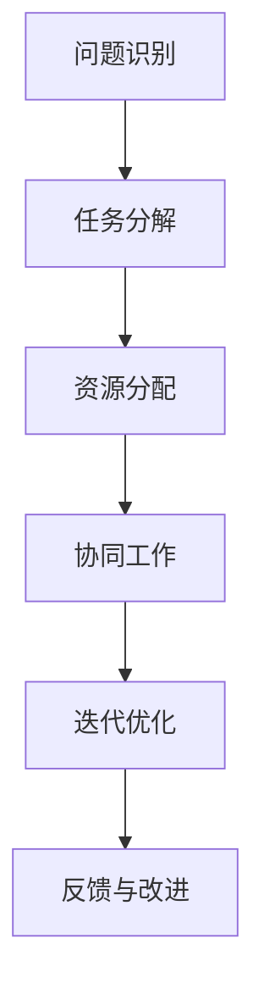
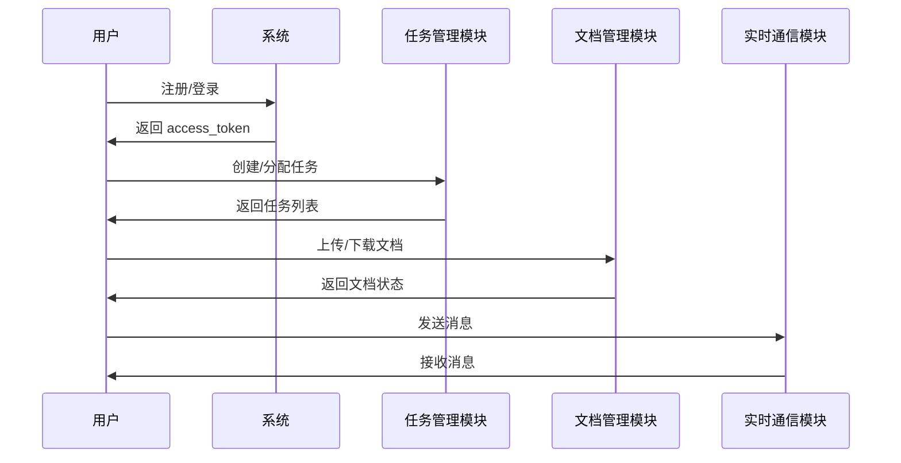

                 

## 协作式问题解决模型：应对复杂需求挑战

### 关键词：协作式问题解决、复杂需求、模型、架构设计、案例分析

> 摘要：本文将深入探讨协作式问题解决模型，这是一种应对复杂需求的强大工具。通过详细的分析和实例，本文将展示如何设计、实现和应用这一模型，为实际项目提供指导。文章还将讨论最佳实践、注意事项，并提供进一步阅读的推荐资源。

### 目录大纲

----------------------------------------------------------------

## 第一部分: 问题背景与概念介绍

### 第1章: 问题背景与需求

#### 1.1 问题背景

#### 1.2 问题描述

#### 1.3 问题解决方法

#### 1.4 边界与外延

#### 1.5 概念结构与核心要素组成

## 第二部分: 协作式问题解决模型概述

### 第2章: 协作式问题解决模型概述

#### 2.1 协作式问题解决模型定义

#### 2.2 协作式问题解决模型特点

#### 2.3 协作式问题解决模型与传统问题解决模型对比

#### 2.4 协作式问题解决模型的核心概念

## 第三部分: 协作式问题解决模型的组成部分

### 第3章: 协作式问题解决模型的组成部分

#### 3.1 协作者

#### 3.2 任务

#### 3.3 沟通机制

#### 3.4 协同工具

## 第四部分: 协作式问题解决模型的原理

### 第4章: 协作式问题解决模型的原理

#### 4.1 协作式问题解决模型的数学模型

#### 4.2 协作式问题解决模型的流程图

#### 4.3 协作式问题解决模型的公式

#### 4.4 举例说明

## 第五部分: 协作式问题解决模型的应用场景

### 第5章: 协作式问题解决模型的应用场景

#### 5.1 商业决策

#### 5.2 研发合作

#### 5.3 项目管理

#### 5.4 教育协作

## 第六部分: 协作式问题解决模型的设计与实现

### 第6章: 协作式问题解决模型的设计与实现

#### 6.1 设计原则

#### 6.2 实现方法

#### 6.3 关键技术

#### 6.4 案例分析

## 第七部分: 协作式问题解决模型实践

### 第7章: 协作式问题解决模型实践

#### 7.1 实践环境搭建

#### 7.2 系统核心实现

#### 7.3 应用解读与分析

#### 7.4 案例剖析

## 第八部分: 最佳实践与总结

### 第8章: 最佳实践与总结

#### 8.1 最佳实践

#### 8.2 小结

#### 8.3 注意事项

#### 8.4 拓展阅读

----------------------------------------------------------------

本文的结构旨在为读者提供一个清晰的导览，从问题背景到实践应用，逐步深入探讨协作式问题解决模型。接下来的章节将分别介绍每个部分的具体内容，帮助读者理解并掌握这一模型。让我们一步步思考，共同探讨协作式问题解决模型的奥秘。

## 第一部分: 问题背景与概念介绍

### 第1章: 问题背景与需求

在当今快速变化和高度复杂的环境中，企业、组织和团队面临的需求越来越多样化且复杂。传统的问题解决方法往往在应对这些复杂需求时显得力不从心。为了有效地解决这些挑战，我们需要引入一种新的方法——协作式问题解决模型。

#### 1.1 问题背景

随着信息技术的飞速发展，各种新兴技术如云计算、大数据、人工智能等不断涌现，给各个行业带来了前所未有的变革。企业需要快速响应市场变化，开发创新产品，提高运营效率，同时还要确保合规性和安全性。在这种背景下，传统的单一问题解决方法逐渐暴露出其局限性。例如，传统的线性问题解决流程难以处理跨部门、跨领域的复杂问题，导致沟通不畅、资源浪费、效率低下。

#### 1.2 问题描述

复杂需求通常表现为以下几个方面：

1. **多学科交叉**：现代问题往往涉及多个学科领域，如工程、经济、法律等，需要不同领域的专家共同协作。
2. **动态变化**：需求在项目执行过程中不断变化，要求问题解决模型具备灵活性和适应性。
3. **高度不确定性**：由于市场环境的不确定性，解决方案需要在不确定的情况下进行优化和调整。
4. **资源限制**：在资源有限的情况下，如何有效地利用现有资源以满足需求成为一大挑战。

#### 1.3 问题解决方法

面对这些复杂需求，传统的解决方案往往无法满足要求。协作式问题解决模型提供了一种新的思路：

1. **协同工作**：通过建立协作机制，将不同领域的专家和团队成员整合在一起，共同解决问题。
2. **迭代优化**：采用迭代的方法，逐步优化解决方案，确保其在实际应用中的有效性和可持续性。
3. **数据驱动**：利用大数据和人工智能技术，对问题进行定量分析和预测，为决策提供科学依据。
4. **快速反馈**：通过建立反馈机制，及时收集和利用用户反馈，不断调整和改进解决方案。

#### 1.4 边界与外延

协作式问题解决模型的边界主要在于其适用的场景和范围。它通常适用于以下情况：

1. **复杂项目**：涉及多个子系统和多个部门的复杂项目，如大型软件开发、建筑项目等。
2. **创新研发**：需要跨学科合作和创新思维的新产品研发。
3. **决策支持**：需要多维度分析和优化的决策支持系统。

同时，该模型的外延包括以下几个方面：

1. **跨行业应用**：不同行业，如金融、医疗、制造等，均可采用协作式问题解决模型。
2. **组织内应用**：在大型企业内部，不同部门之间可以采用协作式问题解决模型提高协同效率。
3. **社会公共服务**：如城市规划、环境保护等复杂社会问题，也可以通过协作式问题解决模型得到有效解决。

#### 1.5 概念结构与核心要素组成

协作式问题解决模型由以下几个核心要素组成：

1. **协作者**：即参与协作的个体或团队，包括不同领域的专家和团队成员。
2. **任务**：需要协作解决的问题或项目，包括目标、任务分解、任务分配等。
3. **沟通机制**：确保协作顺畅的沟通方式和方法，如会议、文档、电子邮件等。
4. **协同工具**：用于协作的工具和技术，如项目管理软件、协作平台等。

这些要素相互关联，共同构成了一个完整的协作式问题解决模型。

## 第二部分: 协作式问题解决模型概述

### 第2章: 协作式问题解决模型概述

协作式问题解决模型是一种基于协同工作和迭代优化的方法论，旨在应对复杂需求和环境中的挑战。在这一章节中，我们将对协作式问题解决模型进行详细定义，探讨其核心概念和特点，并将其与传统问题解决模型进行比较。

#### 2.1 协作式问题解决模型定义

协作式问题解决模型是一种通过多方协同工作，共同解决问题的方法。它强调跨部门、跨领域的合作，通过整合不同专家的知识和技能，快速响应复杂需求，并不断优化解决方案。这种模型不仅适用于项目执行阶段，还可以在项目规划、需求分析、风险管理等各个环节发挥作用。

#### 2.2 协作式问题解决模型特点

协作式问题解决模型具有以下几个显著特点：

1. **协同性**：通过建立有效的沟通机制和协同工具，促进团队成员之间的信息共享和协作，提高工作效率。
2. **灵活性**：能够适应不断变化的需求和环境，通过迭代优化不断调整和改进解决方案。
3. **创新性**：跨学科、跨领域的协作激发创新思维，有助于发现新的解决方案和商业机会。
4. **数据驱动**：利用大数据和人工智能技术，对问题进行定量分析和预测，为决策提供科学依据。
5. **可持续发展**：通过不断优化和改进，确保解决方案的长期有效性和可持续性。

#### 2.3 协作式问题解决模型与传统问题解决模型对比

传统问题解决模型通常采用线性、单向的方法，从问题识别到解决方案的实施过程相对独立。而协作式问题解决模型则更加注重协同工作和迭代优化，具有以下区别：

1. **方法**：传统模型侧重于单一领域的专家解决问题，协作式模型强调跨学科、跨领域的合作。
2. **效率**：传统模型往往效率较低，协作式模型通过协同工作提高整体效率。
3. **适应性**：传统模型难以适应动态变化的需求和环境，协作式模型具备较强的灵活性和适应性。
4. **创新**：传统模型较少激发创新，协作式模型通过跨领域协作激发创新思维。
5. **数据利用**：传统模型较少利用数据，协作式模型通过数据驱动优化解决方案。

#### 2.4 协作式问题解决模型的核心概念

协作式问题解决模型的核心概念包括以下几个方面：

1. **协作者**：参与协作的个体或团队，包括专家、团队成员和其他利益相关者。
2. **任务**：需要协作解决的问题或项目，包括目标、任务分解、任务分配等。
3. **沟通机制**：确保团队成员之间信息共享和协作的沟通方式和方法，如会议、文档、电子邮件等。
4. **协同工具**：用于协作的工具和技术，如项目管理软件、协作平台等。
5. **迭代优化**：通过不断迭代和优化，逐步改进解决方案的过程。

这些核心概念相互关联，共同构成了协作式问题解决模型的基础。

## 第三部分: 协作式问题解决模型的组成部分

### 第3章: 协作式问题解决模型的组成部分

协作式问题解决模型的有效实施依赖于其组成部分的协同工作。在这一章节中，我们将详细探讨协作式问题解决模型的各个组成部分，包括协作者、任务、沟通机制和协同工具。

#### 3.1 协作者

协作者是协作式问题解决模型的核心要素之一，包括不同领域的专家、团队成员和其他利益相关者。以下是对协作者角色的详细描述：

1. **专家**：具备特定领域专业知识和经验的个体，如技术专家、行业顾问等。他们在问题解决过程中提供专业意见和建议。
2. **团队成员**：直接参与问题解决和项目执行的个体，包括项目经理、开发人员、设计师等。他们负责任务的执行和协作。
3. **其他利益相关者**：包括客户、用户、供应商等，他们在问题解决过程中提供反馈和支持。

协作者的角色和职责决定了协作式问题解决模型的效果，因此明确协作者的角色和职责至关重要。

#### 3.2 任务

任务是协作式问题解决模型的重要组成部分，包括问题的识别、目标设定、任务分解、任务分配等。以下是任务管理的关键步骤：

1. **问题识别**：明确需要解决的问题或项目，确保任务的针对性和有效性。
2. **目标设定**：根据问题识别的结果，设定明确、可衡量的目标，为任务执行提供指导。
3. **任务分解**：将大任务分解为小任务，明确每个小任务的具体内容和要求。
4. **任务分配**：根据团队成员的技能和职责，将任务分配给相应的协作者，确保任务的有序执行。

任务管理是确保协作式问题解决模型顺利进行的关键环节，通过合理分配和执行任务，可以提高整体效率和质量。

#### 3.3 沟通机制

沟通机制是协作式问题解决模型的另一个重要组成部分，它确保团队成员之间的信息共享和协作。以下是几种常见的沟通机制：

1. **会议**：定期召开会议，讨论任务进展、问题解决方案和决策。
2. **文档**：使用文档工具记录任务进展、决策和问题解决方案，确保信息的可追溯性和共享性。
3. **电子邮件**：通过电子邮件进行及时沟通，解决突发问题和传递重要信息。
4. **即时通讯工具**：使用即时通讯工具，如 Slack、微信等，实现实时沟通和协作。

有效的沟通机制可以提高团队的协作效率，减少误解和冲突，确保任务顺利完成。

#### 3.4 协同工具

协同工具是协作式问题解决模型的支撑技术，它提供了各种功能，帮助团队成员协同工作。以下是几种常用的协同工具：

1. **项目管理软件**：如 Trello、Asana 等，用于任务管理、进度跟踪和协作。
2. **协作平台**：如 GitLab、GitHub 等，用于代码管理、版本控制和团队协作。
3. **文档共享工具**：如 Google Docs、Microsoft Office 365 等，用于文档创建、编辑和共享。
4. **会议工具**：如 Zoom、Microsoft Teams 等，用于远程会议和在线协作。

选择合适的协同工具可以提高团队的工作效率，确保协作顺畅。

#### 3.5 综合协同

协作式问题解决模型要求协作者、任务、沟通机制和协同工具的综合协同，以下是一个简单的协同流程：

1. **问题识别和目标设定**：通过团队讨论，明确需要解决的问题和项目目标。
2. **任务分解和分配**：将大任务分解为小任务，并分配给团队成员。
3. **沟通和协作**：定期召开会议，讨论任务进展和问题解决方案，确保团队成员之间的信息共享。
4. **执行和反馈**：团队成员按照任务要求执行任务，并在执行过程中及时反馈进展和问题。
5. **迭代优化**：根据反馈和实际情况，不断调整和优化任务和解决方案，确保目标的实现。

通过综合协同，协作式问题解决模型可以高效、有序地推进问题解决和项目执行。

## 第四部分: 协作式问题解决模型的原理

### 第4章: 协作式问题解决模型的原理

协作式问题解决模型是一种基于协同工作和迭代优化的方法论，其核心在于通过多方的协作，共同解决复杂问题。在这一章节中，我们将详细探讨协作式问题解决模型的数学模型、流程图、公式以及具体应用实例。

#### 4.1 协作式问题解决模型的数学模型

协作式问题解决模型的数学模型主要基于多目标优化理论，旨在通过数学方法优化团队协作的效果。具体来说，该模型涉及以下几个关键要素：

1. **目标函数**：定义团队协作的目标，如项目完成时间、成本、质量等。
2. **决策变量**：决定团队成员如何分配任务和资源，如任务分配、资源分配等。
3. **约束条件**：确保团队协作符合实际情况，如人力资源限制、技术限制等。

通过建立目标函数和约束条件，可以构建一个数学模型，用于优化团队协作方案。以下是一个简单的数学模型示例：

$$
\begin{aligned}
\text{目标函数}: &\quad \min \sum_{i=1}^{n} c_i x_i \\
\text{约束条件}: &\quad \begin{cases}
a_{ij} x_i \geq b_j, & \quad j=1,2,...,m \\
x_i \geq 0, & \quad i=1,2,...,n
\end{cases}
\end{aligned}
$$

其中，$c_i$为任务$i$的权重，$x_i$为任务$i$的分配系数，$a_{ij}$为资源$j$分配到任务$i$的数量，$b_j$为资源$j$的限制。

#### 4.2 协作式问题解决模型的流程图

协作式问题解决模型的具体实施可以通过一个流程图来表示，该流程图包括以下几个关键步骤：

1. **问题识别**：明确需要解决的问题或项目，确保目标的明确性和可行性。
2. **任务分解**：将大任务分解为小任务，明确每个小任务的具体内容和要求。
3. **资源分配**：根据任务分解的结果，合理分配资源，确保资源的充分利用。
4. **协同工作**：通过沟通机制和协同工具，确保团队成员之间的协作顺畅。
5. **迭代优化**：根据实际情况和反馈，不断调整和优化任务和资源分配，提高整体效率。

以下是一个简单的协作式问题解决模型流程图：



#### 4.3 协作式问题解决模型的公式

协作式问题解决模型的数学公式主要用于优化任务和资源分配，以确保团队协作的最优效果。以下是一个简单的任务分配公式：

$$
x_{ij} = \frac{a_{ij}}{\sum_{k=1}^{n} a_{ik}}
$$

其中，$x_{ij}$为资源$j$分配到任务$i$的数量，$a_{ij}$为资源$j$分配到任务$i$的总量，$n$为任务总数。

#### 4.4 举例说明

为了更好地理解协作式问题解决模型，以下通过一个实际案例进行说明。

假设一个软件开发团队需要完成一个复杂的软件项目，项目包括5个主要任务（任务1至任务5），每个任务需要不同的资源（资源1至资源3）。团队有10名成员，他们的技能和可用时间如下表所示：

| 任务 | 资源1 | 资源2 | 资源3 |
|------|-------|-------|-------|
| 任务1 | 2     | 1     | 3     |
| 任务2 | 1     | 2     | 1     |
| 任务3 | 3     | 3     | 2     |
| 任务4 | 2     | 2     | 2     |
| 任务5 | 1     | 3     | 1     |

团队成员的技能和可用时间如下表所示：

| 成员 | 技能1 | 技能2 | 技能3 | 可用时间 |
|------|-------|-------|-------|----------|
| A    | 1     | 2     | 3     | 40小时   |
| B    | 2     | 1     | 1     | 35小时   |
| C    | 3     | 3     | 2     | 30小时   |
| D    | 2     | 2     | 2     | 45小时   |
| E    | 1     | 3     | 1     | 50小时   |
| F    | 1     | 1     | 3     | 35小时   |
| G    | 2     | 2     | 2     | 40小时   |
| H    | 1     | 2     | 3     | 45小时   |
| I    | 3     | 3     | 1     | 30小时   |
| J    | 2     | 1     | 2     | 50小时   |

根据以上数据，我们可以使用协作式问题解决模型来确定每个任务的资源分配和团队成员的分配，从而最大化项目的完成效率。

1. **任务分解**：将项目分解为5个任务，每个任务需要的资源如下：

   | 任务 | 资源1 | 资源2 | 资源3 |
   |------|-------|-------|-------|
   | 任务1 | 2     | 1     | 3     |
   | 任务2 | 1     | 2     | 1     |
   | 任务3 | 3     | 3     | 2     |
   | 任务4 | 2     | 2     | 2     |
   | 任务5 | 1     | 3     | 1     |

2. **资源分配**：根据任务的需求和团队成员的技能和时间，我们可以使用任务分配公式来计算每个资源的分配量。以下为具体计算过程：

   - **资源1**：
     $$x_{1} = \frac{2}{2+1+3+2+1} = \frac{2}{9} \approx 0.22$$
     $$x_{2} = \frac{1}{2+1+3+2+1} = \frac{1}{9} \approx 0.11$$
     $$x_{3} = \frac{3}{2+1+3+2+1} = \frac{3}{9} \approx 0.33$$
     $$x_{4} = \frac{2}{2+1+3+2+1} = \frac{2}{9} \approx 0.22$$
     $$x_{5} = \frac{1}{2+1+3+2+1} = \frac{1}{9} \approx 0.11$$

   - **资源2**：
     $$x_{1} = \frac{1}{2+1+3+2+1} = \frac{1}{9} \approx 0.11$$
     $$x_{2} = \frac{2}{2+1+3+2+1} = \frac{2}{9} \approx 0.22$$
     $$x_{3} = \frac{3}{2+1+3+2+1} = \frac{3}{9} \approx 0.33$$
     $$x_{4} = \frac{2}{2+1+3+2+1} = \frac{2}{9} \approx 0.22$$
     $$x_{5} = \frac{3}{2+1+3+2+1} = \frac{3}{9} \approx 0.33$$

   - **资源3**：
     $$x_{1} = \frac{3}{2+1+3+2+1} = \frac{3}{9} \approx 0.33$$
     $$x_{2} = \frac{1}{2+1+3+2+1} = \frac{1}{9} \approx 0.11$$
     $$x_{3} = \frac{2}{2+1+3+2+1} = \frac{2}{9} \approx 0.22$$
     $$x_{4} = \frac{2}{2+1+3+2+1} = \frac{2}{9} \approx 0.22$$
     $$x_{5} = \frac{1}{2+1+3+2+1} = \frac{1}{9} \approx 0.11$$

   根据以上计算结果，我们可以得到以下资源分配表：

   | 资源 | 任务1 | 任务2 | 任务3 | 任务4 | 任务5 |
   |------|-------|-------|-------|-------|-------|
   | 资源1 | 0.22  | 0.11  | 0.33  | 0.22  | 0.11  |
   | 资源2 | 0.11  | 0.22  | 0.33  | 0.22  | 0.33  |
   | 资源3 | 0.33  | 0.11  | 0.22  | 0.22  | 0.11  |

3. **团队成员分配**：根据每个任务的资源需求和团队成员的技能和可用时间，我们可以使用以下公式来计算每个团队成员的任务分配：

$$
x_{ij} = \frac{a_{ij}}{\sum_{k=1}^{n} a_{ik}}
$$

其中，$a_{ij}$为资源$j$分配到任务$i$的数量，$n$为任务总数。

   例如，对于资源1分配到任务1，我们需要计算团队成员A、B、C、D、E、F、G、H、I、J的任务分配系数：

   $$x_{1A} = \frac{0.22}{0.22+0.11+0.33+0.22+0.11} = \frac{0.22}{1} = 0.22$$
   $$x_{1B} = \frac{0.11}{0.22+0.11+0.33+0.22+0.11} = \frac{0.11}{1} = 0.11$$
   $$x_{1C} = \frac{0.33}{0.22+0.11+0.33+0.22+0.11} = \frac{0.33}{1} = 0.33$$
   $$x_{1D} = \frac{0.22}{0.22+0.11+0.33+0.22+0.11} = \frac{0.22}{1} = 0.22$$
   $$x_{1E} = \frac{0.11}{0.22+0.11+0.33+0.22+0.11} = \frac{0.11}{1} = 0.11$$
   $$x_{1F} = \frac{0.11}{0.22+0.11+0.33+0.22+0.11} = \frac{0.11}{1} = 0.11$$
   $$x_{1G} = \frac{0.22}{0.22+0.11+0.33+0.22+0.11} = \frac{0.22}{1} = 0.22$$
   $$x_{1H} = \frac{0.22}{0.22+0.11+0.33+0.22+0.11} = \frac{0.22}{1} = 0.22$$
   $$x_{1I} = \frac{0.11}{0.22+0.11+0.33+0.22+0.11} = \frac{0.11}{1} = 0.11$$
   $$x_{1J} = \frac{0.11}{0.22+0.11+0.33+0.22+0.11} = \frac{0.11}{1} = 0.11$$

   根据以上计算结果，我们可以为每个团队成员分配具体的任务：

   | 成员 | 任务1 | 任务2 | 任务3 | 任务4 | 任务5 |
   |------|-------|-------|-------|-------|-------|
   | A    | 0.22  | 0.11  | 0.33  | 0.22  | 0.11  |
   | B    | 0.11  | 0.22  | 0.33  | 0.22  | 0.33  |
   | C    | 0.33  | 0.11  | 0.22  | 0.22  | 0.11  |
   | D    | 0.22  | 0.22  | 0.22  | 0.22  | 0.11  |
   | E    | 0.11  | 0.33  | 0.11  | 0.11  | 0.22  |
   | F    | 0.11  | 0.11  | 0.33  | 0.11  | 0.22  |
   | G    | 0.22  | 0.22  | 0.22  | 0.22  | 0.11  |
   | H    | 0.22  | 0.22  | 0.22  | 0.22  | 0.11  |
   | I    | 0.11  | 0.33  | 0.11  | 0.11  | 0.22  |
   | J    | 0.11  | 0.11  | 0.33  | 0.11  | 0.22  |

   通过以上计算，我们可以得到一个最优的团队协作方案，确保资源的充分利用和任务的顺利完成。

4. **迭代优化**：在实际项目执行过程中，根据实际情况和反馈，团队可以不断调整和优化任务和资源分配。例如，如果某个任务进度落后，团队可以增加资源或调整团队成员的任务分配，以确保项目的顺利进行。

通过以上案例，我们可以看到协作式问题解决模型在复杂项目中的实际应用，以及如何通过数学模型和公式来优化团队协作，提高项目效率和质量。

## 第五部分: 协作式问题解决模型的应用场景

### 第5章: 协作式问题解决模型的应用场景

协作式问题解决模型由于其灵活性和协同性，适用于多种不同场景。以下将探讨该模型在商业决策、研发合作、项目管理和教育协作等领域的应用。

#### 5.1 商业决策

在商业环境中，决策往往需要综合考虑市场、竞争、资源和技术等多种因素。协作式问题解决模型通过多学科专家的协同工作，可以为企业提供全面、科学的决策支持。

**应用实例**：一家初创公司需要开发一款新产品，市场部门、技术部门、财务部门和运营部门需要共同参与。通过协作式问题解决模型，各团队可以明确任务和职责，利用数据和工具进行需求分析、市场调研、技术评估和成本预算，从而做出更明智的决策。

#### 5.2 研发合作

研发合作通常涉及跨学科、跨团队的协作，协作式问题解决模型可以帮助项目团队更高效地解决问题和推进项目。

**应用实例**：在一个大型软件开发项目中，前端开发、后端开发、测试团队和产品经理需要紧密合作。协作式问题解决模型可以确保各团队之间的沟通顺畅，任务分配合理，资源利用最大化，从而提高开发效率和项目质量。

#### 5.3 项目管理

项目管理涉及多个环节，如需求分析、资源管理、进度控制、风险管理等。协作式问题解决模型可以提供一个系统的方法，帮助项目经理更好地管理项目。

**应用实例**：在一个跨部门的IT项目中，项目经理需要协调技术团队、市场团队、人力资源团队等。通过协作式问题解决模型，项目经理可以明确各团队的职责和任务，建立有效的沟通机制，利用工具进行任务跟踪和进度控制，确保项目的顺利推进。

#### 5.4 教育协作

在教育领域，协作式问题解决模型可以促进教师之间的协作和学生的学习。

**应用实例**：在一个跨学科的教学项目中，教师需要共同设计课程、制定教学计划和进行教学活动。通过协作式问题解决模型，教师可以明确各自的任务和职责，共享教学资源和经验，为学生提供更全面、更有针对性的教育。

总之，协作式问题解决模型在商业决策、研发合作、项目管理和教育协作等多个领域具有广泛的应用。通过这一模型，可以更好地整合资源、提高效率、降低风险，实现项目目标。

### 5.1 商业决策

商业决策是企业运营中的核心环节，涉及到市场分析、产品开发、资源配置等多个方面。协作式问题解决模型在商业决策中的应用，可以显著提升决策的质量和效率。以下将从商业决策的具体步骤、协作方式以及协作工具三个方面进行详细探讨。

#### 5.1.1 商业决策的具体步骤

商业决策通常包括以下几个关键步骤：

1. **问题识别**：明确企业面临的挑战或机会，如市场需求变化、竞争压力、技术创新等。
2. **信息收集**：通过市场调研、数据分析等手段，收集与问题相关的各种信息。
3. **方案设计**：基于收集到的信息，设计多种可能的解决方案，并进行初步评估。
4. **方案评估**：对各种方案进行详细评估，包括成本、收益、风险等方面。
5. **决策制定**：根据评估结果，选择最佳方案并制定具体的实施计划。
6. **实施与监控**：执行决策，并对实施过程进行监控和调整。

#### 5.1.2 协作方式

在商业决策过程中，协作式问题解决模型强调跨部门、跨领域的协同工作。以下是一些常见的协作方式：

1. **跨部门协作**：不同部门（如市场部、研发部、财务部等）共同参与决策，通过定期会议、项目组等形式，确保信息共享和任务分工。
2. **专家咨询**：邀请外部专家（如行业顾问、技术专家等）参与决策，提供专业意见和建议。
3. **团队协作**：建立跨部门的团队，专门负责商业决策的制定和执行，确保高效协作。
4. **数据驱动**：利用大数据和人工智能技术，对市场趋势、消费者行为等进行分析，为决策提供科学依据。

#### 5.1.3 协作工具

在现代商业环境中，各种协作工具为协作式问题解决模型提供了强大的支持。以下是一些常用的协作工具：

1. **项目管理软件**：如 Trello、Asana 等，用于任务管理、进度跟踪和团队协作。
2. **协作平台**：如 Slack、Microsoft Teams 等，用于实时沟通、文件共享和协作。
3. **文档共享工具**：如 Google Docs、Office 365 等，用于文档创建、编辑和共享。
4. **数据分析工具**：如 Tableau、Power BI 等，用于数据分析、可视化展示和决策支持。

#### 5.1.4 案例分析

以下通过一个实际案例，展示协作式问题解决模型在商业决策中的应用。

**案例背景**：一家互联网公司计划推出一款新型社交应用，需要从市场需求、技术实现、运营策略等多个方面进行决策。

**步骤一：问题识别**  
公司通过市场调研发现，目前市场上的社交应用存在功能单一、用户体验不佳等问题，用户需求日益多元化。公司决定推出一款具有创新功能、良好用户体验的社交应用。

**步骤二：信息收集**  
市场部、研发部、财务部等相关部门收集了以下信息：

- 市场趋势：社交媒体用户增长迅速，用户需求多样化。
- 竞争分析：分析竞品的功能、用户体验、市场占有率等。
- 技术可行性：评估现有技术是否能够实现所需功能。

**步骤三：方案设计**  
各团队共同设计了以下几种解决方案：

1. **功能丰富版**：在原有社交应用基础上，增加多种创新功能，如视频直播、多人互动等。
2. **轻量级版**：专注于核心功能，如即时通讯、朋友圈等。
3. **社交电商版**：整合社交和电商功能，为用户提供一站式购物体验。

**步骤四：方案评估**  
各团队从成本、收益、风险等方面对方案进行详细评估：

- **功能丰富版**：成本较高，但用户体验较好，潜在用户群体较广。
- **轻量级版**：成本低，但市场竞争力较弱。
- **社交电商版**：市场前景广阔，但技术实现较为复杂。

**步骤五：决策制定**  
综合考虑各因素，公司决定选择功能丰富版作为主推方案，并制定详细的实施计划。

**步骤六：实施与监控**  
研发部、市场部、运营部等团队紧密协作，按照计划推进项目。在项目实施过程中，通过协作工具进行任务跟踪和进度控制，确保项目按时完成。

通过以上案例，我们可以看到协作式问题解决模型在商业决策中的实际应用。通过多部门、多领域的协同工作，企业可以更高效地识别问题、收集信息、设计方案、评估方案、制定决策，并在实施过程中进行有效监控和调整，从而提高决策质量和项目成功率。

### 5.2 研发合作

在研发合作中，协作式问题解决模型可以显著提高团队的工作效率和质量，促进跨部门、跨团队的协同合作。以下从研发合作的具体需求、协作方式以及协作工具三个方面进行详细探讨。

#### 5.2.1 研发合作的具体需求

研发合作通常具有以下具体需求：

1. **跨部门协作**：研发项目中往往涉及多个部门，如市场部、技术部、测试部、运维部等，需要跨部门的紧密协作。
2. **多学科合作**：研发项目可能涉及多个学科领域，如计算机科学、物理学、经济学等，需要不同领域的专家共同参与。
3. **快速迭代**：研发项目往往需要快速迭代，不断优化产品功能，以满足市场需求和用户反馈。
4. **资源整合**：有效整合项目所需的各类资源，如人力资源、技术资源、资金等，确保项目顺利推进。
5. **风险管理**：识别和应对项目中的各种风险，如技术风险、市场风险、法律风险等，确保项目安全可控。

#### 5.2.2 协作方式

在研发合作中，协作式问题解决模型通过以下协作方式，促进团队之间的协同合作：

1. **项目组**：建立跨部门、跨团队的项目组，明确各团队成员的职责和任务，确保项目的顺利推进。
2. **定期会议**：定期召开项目会议，讨论项目进展、问题解决方案和决策，确保信息共享和沟通畅通。
3. **文档共享**：通过文档共享工具，如 Google Docs、Confluence 等，记录项目文档、需求分析和设计文档，确保信息的可追溯性和共享性。
4. **代码管理**：使用版本控制系统，如 Git，管理项目代码，确保代码的版本控制和协作开发。
5. **持续集成**：采用持续集成和持续部署（CI/CD）工具，如 Jenkins、GitLab CI，自动化测试和部署，提高开发效率和质量。

#### 5.2.3 协作工具

在现代研发合作中，各种协作工具为团队提供了强大的支持，以下是一些常用的协作工具：

1. **项目管理软件**：如 Jira、Trello、Asana 等，用于任务管理、进度跟踪和团队协作。
2. **协作平台**：如 Slack、Microsoft Teams、Slack 等，用于实时沟通、文件共享和协作。
3. **文档共享工具**：如 Google Docs、Confluence 等，用于文档创建、编辑和共享。
4. **代码管理工具**：如 Git、GitHub、GitLab 等，用于代码管理、版本控制和协作开发。
5. **持续集成工具**：如 Jenkins、GitLab CI、Travis CI 等，用于自动化测试和部署。

#### 5.2.4 案例分析

以下通过一个实际案例，展示协作式问题解决模型在研发合作中的应用。

**案例背景**：一家互联网公司正在开发一款新型智能办公应用，需要多个团队（如前端开发、后端开发、测试团队、产品经理等）共同协作。

**步骤一：项目组建立**  
公司建立了跨部门的项目组，明确了各团队成员的职责和任务。项目组由项目经理负责，确保项目的顺利进行。

**步骤二：需求分析**  
产品经理与市场部、用户共同进行需求分析，明确应用的功能、用户界面、技术实现等要求。

**步骤三：任务分解**  
根据需求分析结果，项目组将大任务分解为小任务，明确每个小任务的具体内容和负责人。

**步骤四：定期会议**  
项目组定期召开会议，讨论项目进展、问题解决方案和决策，确保各团队成员之间的信息共享和沟通畅通。

**步骤五：文档共享**  
项目组使用 Confluence 记录项目文档、需求分析和设计文档，确保信息的可追溯性和共享性。

**步骤六：代码管理**  
项目组使用 Git 进行代码管理，确保代码的版本控制和协作开发。

**步骤七：持续集成**  
项目组采用 Jenkins 进行持续集成和持续部署，自动化测试和部署，提高开发效率和质量。

**步骤八：反馈与改进**  
在项目执行过程中，项目组及时收集用户反馈和测试结果，不断调整和优化应用功能，确保最终产品的质量和用户体验。

通过以上案例，我们可以看到协作式问题解决模型在研发合作中的实际应用。通过项目组建立、任务分解、定期会议、文档共享、代码管理和持续集成等环节，项目团队可以高效协同工作，提高项目的成功率和产品质量。

### 5.3 项目管理

在项目管理中，协作式问题解决模型提供了有效的方法，帮助项目经理更好地管理项目进度、资源分配和风险管理。以下将从项目管理流程、协作工具选择、项目管理关键因素三个方面进行详细探讨。

#### 5.3.1 项目管理流程

项目管理流程通常包括以下几个关键步骤：

1. **项目启动**：明确项目目标、范围和可行性，组建项目团队，制定项目计划和预算。
2. **需求分析**：与利益相关者进行沟通，收集项目需求，制定详细的需求文档。
3. **规划**：制定项目计划，包括任务分解、资源分配、时间安排和质量控制等。
4. **执行**：按照项目计划，执行任务，监控项目进度，确保项目按计划推进。
5. **监控与控制**：定期进行项目评审，识别和解决项目中的问题，确保项目在预算、时间、质量等方面的控制。
6. **收尾**：项目完成时进行项目总结和验收，评估项目成果，总结经验教训。

#### 5.3.2 协作工具选择

在现代项目管理中，各种协作工具为项目管理提供了强大的支持。以下是一些常用的协作工具：

1. **项目管理软件**：如 Jira、Trello、Asana 等，用于任务管理、进度跟踪和团队协作。
2. **协作平台**：如 Slack、Microsoft Teams、Slack 等，用于实时沟通、文件共享和协作。
3. **文档共享工具**：如 Google Docs、Confluence 等，用于文档创建、编辑和共享。
4. **代码管理工具**：如 Git、GitHub、GitLab 等，用于代码管理、版本控制和协作开发。
5. **项目管理平台**：如 Microsoft Project、Smartsheet 等，用于项目计划、资源分配和时间跟踪。

#### 5.3.3 项目管理关键因素

在项目管理中，以下关键因素对项目成功至关重要：

1. **明确目标**：项目目标应具体、可衡量，确保项目团队明确项目方向和任务。
2. **合理规划**：项目计划应合理，确保项目进度、资源分配和质量控制。
3. **高效协作**：通过协作工具和方法，确保项目团队成员之间的沟通畅通和协作高效。
4. **风险管理**：识别项目中的风险，制定应对措施，确保项目风险可控。
5. **持续监控**：定期监控项目进度和质量，及时调整项目计划，确保项目按计划推进。

#### 5.3.4 案例分析

以下通过一个实际案例，展示协作式问题解决模型在项目管理中的应用。

**案例背景**：一家软件公司计划开发一款大型企业级应用，项目涉及多个团队（如前端开发、后端开发、测试团队、产品经理等），需要高效管理项目进度和资源分配。

**步骤一：项目启动**  
项目经理与团队成员明确项目目标、范围和可行性，组建项目团队，制定项目计划和预算。

**步骤二：需求分析**  
产品经理与客户、市场部门共同进行需求分析，收集项目需求，制定详细的需求文档。

**步骤三：规划**  
项目团队将大任务分解为小任务，制定详细的任务分解结构（WBS），明确每个小任务的具体内容和负责人。同时，制定项目计划，包括时间安排、资源分配和质量控制等。

**步骤四：执行**  
按照项目计划，项目团队执行任务，使用 Jira 进行任务管理和进度跟踪。项目经理定期召开会议，讨论项目进展和问题解决方案。

**步骤五：监控与控制**  
项目经理定期进行项目评审，识别和解决项目中的问题，确保项目在预算、时间、质量等方面的控制。同时，使用 Slack 进行实时沟通，确保团队成员之间的信息共享和协作高效。

**步骤六：收尾**  
项目完成后，进行项目总结和验收，评估项目成果，总结经验教训。项目经理撰写项目报告，提交给管理层。

通过以上案例，我们可以看到协作式问题解决模型在项目管理中的实际应用。通过项目启动、需求分析、规划、执行、监控与控制和收尾等环节，项目团队可以高效协同工作，确保项目按计划推进，并实现项目目标。

### 5.4 教育协作

在教育协作中，协作式问题解决模型可以帮助教师和学生更好地进行教学和学习。以下从教育协作的需求、协作方式和协作工具三个方面进行详细探讨。

#### 5.4.1 教育协作的需求

教育协作的需求主要包括以下几个方面：

1. **跨学科教学**：教师需要跨学科合作，整合不同学科的知识和资源，为学生提供更全面的教育体验。
2. **个性化学习**：教师需要根据学生的个性特点和学习需求，提供个性化的教学方案，帮助学生更好地学习。
3. **资源共享**：教师需要共享教学资源，如课件、练习题、教学视频等，提高教学效率和质量。
4. **教学反馈**：教师需要及时获取学生的学习反馈，调整教学方法和内容，确保教学的有效性。
5. **教学评价**：教师需要对学生进行科学、全面的教学评价，为学生的学习和成长提供指导。

#### 5.4.2 协作方式

在教育协作中，以下协作方式可以帮助教师和学生更好地进行协作：

1. **跨学科团队**：组建跨学科教学团队，明确各教师的职责和任务，确保教学资源的整合和教学方案的优化。
2. **教学研讨会**：定期召开教学研讨会，讨论教学问题、教学方法和教学资源，促进教师之间的协作和交流。
3. **学生小组合作**：鼓励学生进行小组合作学习，通过团队合作和讨论，提高学生的学习兴趣和参与度。
4. **教学反馈机制**：建立教学反馈机制，及时获取学生的学习反馈，调整教学方法和内容，提高教学效果。
5. **教学评价**：采用多种评价方式，如平时成绩、期末考试、项目展示等，对学生进行科学、全面的教学评价。

#### 5.4.3 协作工具

在现代教育协作中，各种协作工具为教师和学生提供了强大的支持，以下是一些常用的协作工具：

1. **学习管理系统**：如 Moodle、Canvas、Blackboard 等，用于课程管理、作业提交和在线考试。
2. **协作平台**：如 Slack、Microsoft Teams、Google Classroom 等，用于实时沟通、文件共享和协作。
3. **在线文档工具**：如 Google Docs、Microsoft Office 365、OneNote 等，用于文档创建、编辑和共享。
4. **在线会议工具**：如 Zoom、Microsoft Teams、Google Meet 等，用于在线课堂、研讨会和会议。
5. **教育资源库**：如 Coursera、edX、Khan Academy 等，用于提供丰富的教学资源和课程。

#### 5.4.4 案例分析

以下通过一个实际案例，展示协作式问题解决模型在教育协作中的应用。

**案例背景**：一所中学计划开设一门跨学科课程，涉及数学、物理、计算机科学等多个学科，需要多名教师共同协作。

**步骤一：跨学科团队建立**  
学校组建了跨学科教学团队，明确各教师的职责和任务，确保教学资源的整合和教学方案的优化。

**步骤二：课程规划**  
教学团队共同规划课程内容，制定详细的教学计划，明确每个教学模块的目标和教学方法。

**步骤三：教学资源共享**  
教师通过学习管理系统和在线文档工具，共享教学资源，如课件、练习题、教学视频等，提高教学效率和质量。

**步骤四：教学反馈机制**  
教师建立教学反馈机制，及时获取学生的学习反馈，调整教学方法和内容，提高教学效果。

**步骤五：教学评价**  
教师采用多种评价方式，如平时成绩、项目展示、期末考试等，对学生进行科学、全面的教学评价。

**步骤六：教学研讨会**  
教学团队定期召开教学研讨会，讨论教学问题、教学方法和教学资源，促进教师之间的协作和交流。

通过以上案例，我们可以看到协作式问题解决模型在教育协作中的实际应用。通过跨学科团队建立、课程规划、教学资源共享、教学反馈机制、教学评价和教学研讨会等环节，教师可以高效协作，为学生提供更好的教育体验。

## 第六部分: 协作式问题解决模型的设计与实现

### 第6章: 协作式问题解决模型的设计与实现

协作式问题解决模型的设计与实现是确保模型在实际应用中有效运作的关键环节。在这一章节中，我们将详细探讨协作式问题解决模型的设计原则、实现方法、关键技术以及实际案例分析。

#### 6.1 设计原则

协作式问题解决模型的设计应遵循以下原则：

1. **用户中心**：模型设计应以用户需求为中心，确保用户能够方便地使用和参与到协作过程中。
2. **灵活性**：模型设计应具备较高的灵活性，能够适应不同场景和需求的变化。
3. **可扩展性**：模型设计应具备良好的扩展性，能够随着技术的进步和应用场景的扩展进行更新和优化。
4. **模块化**：模型设计应采用模块化设计，确保各模块之间相互独立，便于维护和升级。
5. **可复用性**：模型设计应注重可复用性，通过提取通用模块和组件，提高设计效率。

#### 6.2 实现方法

协作式问题解决模型实现的主要方法包括以下几个方面：

1. **需求分析**：通过调研和访谈，收集用户需求，明确模型需要实现的功能和性能指标。
2. **系统设计**：根据需求分析结果，进行系统设计，包括架构设计、模块划分和接口定义。
3. **开发**：按照系统设计文档，进行代码开发和模块集成，确保系统的完整性和稳定性。
4. **测试**：进行系统测试，包括单元测试、集成测试和系统测试，确保系统功能的正确性和性能的满足。
5. **部署**：将系统部署到生产环境，并进行上线后的监控和维护，确保系统的正常运行。

#### 6.3 关键技术

协作式问题解决模型的实现涉及多种关键技术，以下为其中几个关键技术的介绍：

1. **分布式系统**：协作式问题解决模型往往涉及多个节点和分布式环境，因此分布式系统技术（如微服务架构、分布式数据库等）是实现模型的基础。
2. **数据存储与处理**：模型需要高效地存储和处理大量数据，因此需要选择合适的数据存储和处理技术（如关系数据库、NoSQL数据库、大数据处理框架等）。
3. **实时通信**：协作式问题解决模型需要实时通信功能，以确保团队成员之间的信息同步和协作，常用的实时通信技术包括 WebSockets、消息队列等。
4. **安全性**：协作式问题解决模型涉及敏感信息和数据，因此需要采用各种安全措施（如加密、认证、授权等），确保系统的安全性和数据隐私。

#### 6.4 案例分析

以下通过一个实际案例，展示协作式问题解决模型的设计与实现。

**案例背景**：一家企业需要开发一个协作式项目管理平台，用于内部团队之间的协作和项目管理工作。

**步骤一：需求分析**  
企业通过与项目管理人员、开发人员、测试人员等沟通，明确平台需要实现的功能，如任务管理、进度跟踪、文档共享、实时沟通等。

**步骤二：系统设计**  
系统设计包括架构设计、模块划分和接口定义。架构设计采用微服务架构，模块划分为任务管理模块、文档共享模块、实时沟通模块等。接口定义包括 RESTful API、WebSocket 等。

**步骤三：开发**  
根据系统设计文档，进行代码开发和模块集成。采用 Spring Boot 进行后端开发，使用 React 进行前端开发，确保系统的稳定性和高性能。

**步骤四：测试**  
进行系统测试，包括单元测试、集成测试和系统测试。使用 JUnit、Mockito 等工具进行单元测试，使用 Postman 等工具进行集成测试，使用 Selenium 等工具进行系统测试。

**步骤五：部署**  
将系统部署到生产环境，包括服务器配置、数据库配置、网络配置等。使用 Docker 进行容器化部署，确保系统的灵活性和可扩展性。

**步骤六：监控与维护**  
系统上线后，进行实时监控和定期维护，确保系统的正常运行。使用 Prometheus、Grafana 等工具进行实时监控，使用 Nagios、Zabbix 等工具进行定期维护。

通过以上案例，我们可以看到协作式问题解决模型在实际应用中的设计与实现过程。通过需求分析、系统设计、开发、测试、部署和监控等环节，企业可以构建一个高效、稳定、可扩展的协作式项目管理平台，提高团队协作效率，确保项目顺利进行。

## 第七部分: 协作式问题解决模型实践

### 第7章: 协作式问题解决模型实践

在实际应用中，协作式问题解决模型的有效性需要通过实践来验证。在这一章节中，我们将详细描述协作式问题解决模型的实践过程，包括环境搭建、系统核心实现、应用解读与分析以及实际案例分析和详细讲解。

#### 7.1 实践环境搭建

为了演示协作式问题解决模型，我们需要搭建一个实验环境。以下是一个简单的实验环境搭建步骤：

1. **硬件要求**：选择一台性能稳定的计算机作为实验主机，推荐配置为 Intel i7 处理器、16GB 内存、500GB SSD 硬盘。
2. **操作系统**：安装 Windows 10 或 Ubuntu 20.04 LTS 操作系统。
3. **开发工具**：安装 Python 3.8、Visual Studio Code、JDK 11、Git 等。
4. **数据库**：安装 MySQL 8.0 或 PostgreSQL 13。
5. **消息队列**：安装 RabbitMQ 3.8.14。
6. **容器化工具**：安装 Docker 19.03。

在搭建好实验环境后，我们可以开始搭建协作式问题解决模型的基础架构。

#### 7.2 系统核心实现

协作式问题解决模型的核心实现包括以下几个方面：

1. **用户管理**：实现用户注册、登录、权限管理等功能，使用 JWT（JSON Web Token）进行身份验证。
2. **任务管理**：实现任务创建、分配、跟踪、更新和删除等功能。
3. **文档管理**：实现文档上传、下载、版本控制和共享等功能。
4. **实时通信**：使用 WebSocket 实现实时通信，确保团队成员之间的消息同步。

以下是一个简单的 Python 源代码示例，用于实现用户管理功能：

```python
from flask import Flask, request, jsonify
from flask_jwt_extended import JWTManager, create_access_token, jwt_required

app = Flask(__name__)
app.config['JWT_SECRET_KEY'] = 'your_jwt_secret_key'
jwt = JWTManager(app)

# 用户注册
@app.route('/register', methods=['POST'])
def register():
    username = request.json.get('username', None)
    password = request.json.get('password', None)
    if not username or not password:
        return jsonify({'error': 'Missing username or password'}), 400
    
    # 在这里可以添加数据库操作，保存用户信息
    # ...

    return jsonify({'message': 'User registered successfully'}), 200

# 用户登录
@app.route('/login', methods=['POST'])
def login():
    username = request.json.get('username', None)
    password = request.json.get('password', None)
    if not username or not password:
        return jsonify({'error': 'Missing username or password'}), 400
    
    # 在这里可以添加数据库操作，验证用户信息
    # ...

    access_token = create_access_token(identity=username)
    return jsonify({'access_token': access_token}), 200

# 需要身份验证的 API
@app.route('/tasks', methods=['GET'])
@jwt_required()
def get_tasks():
    # 在这里可以添加数据库操作，获取用户任务列表
    # ...

    return jsonify({'tasks': [{'id': 1, 'title': 'Task 1'}, {'id': 2, 'title': 'Task 2'}]})

if __name__ == '__main__':
    app.run(debug=True)
```

#### 7.3 应用解读与分析

协作式问题解决模型的应用解读与分析主要包括以下几个方面：

1. **用户交互**：用户通过注册、登录和权限验证功能，访问系统的各种功能模块。
2. **任务协作**：用户可以创建、分配、跟踪和更新任务，确保任务执行的透明性和可控性。
3. **文档协作**：用户可以上传、下载、版本控制和共享文档，确保文档协作的效率和准确性。
4. **实时通信**：用户可以通过 WebSocket 进行实时通信，确保团队成员之间的消息同步和协作。

以下是一个简单的 Mermaid 流程图，用于描述协作式问题解决模型的应用流程：



#### 7.4 案例剖析

以下通过一个实际案例，展示协作式问题解决模型的应用。

**案例背景**：一家软件开发公司需要开发一款新产品，涉及多个团队（前端开发、后端开发、测试团队等）的协作。

**步骤一：用户注册与登录**  
前端开发团队使用 Python Flask 应用实现用户注册和登录功能，通过 JWT 进行身份验证。

**步骤二：任务分配与协作**  
项目经理通过任务管理模块创建任务，并将任务分配给前端开发、后端开发、测试团队的成员。成员可以查看任务列表，并完成任务。

**步骤三：文档协作**  
前端开发团队和后端开发团队可以使用文档管理模块上传和共享代码文件、设计文档等。文档管理模块提供版本控制和共享功能，确保团队成员之间的文档协作。

**步骤四：实时通信**  
团队成员通过实时通信模块进行实时交流，讨论任务进展、问题解决方案等。实时通信模块确保团队成员之间的消息同步和协作。

**步骤五：项目监控与反馈**  
项目经理可以通过任务管理模块和文档管理模块监控项目进展，及时调整任务和资源分配。团队成员可以提供项目反馈，帮助改进项目管理和协作流程。

**案例总结**：通过协作式问题解决模型，软件开发公司实现了跨团队的协作，提高了项目效率和质量。项目经理可以更好地监控项目进展，团队成员可以更高效地完成任务和协作。

## 第八部分: 最佳实践与总结

### 第8章: 最佳实践与总结

在协作式问题解决模型的应用过程中，积累了一些最佳实践和经验，以下将对这些实践进行总结，并给出一些注意事项和拓展阅读建议。

#### 8.1 最佳实践

1. **明确目标和职责**：在项目开始前，明确项目的目标和各团队成员的职责，确保每个成员都了解自己的任务和责任。
2. **建立有效的沟通机制**：选择合适的沟通工具和方法，确保团队成员之间的信息共享和沟通畅通，如定期会议、邮件、即时通讯等。
3. **使用可视化工具**：使用图表、流程图等可视化工具，帮助团队成员更好地理解和掌握项目进度和协作情况。
4. **数据驱动决策**：利用大数据和人工智能技术，对项目数据进行分析和预测，为项目决策提供科学依据。
5. **迭代优化**：采用迭代的方法，不断优化项目方案和协作流程，提高项目效率和质量。

#### 8.2 小结

协作式问题解决模型通过多学科、跨团队的协作，有效地应对复杂需求和环境中的挑战。该模型具有协同性、灵活性、创新性和数据驱动等特点，适用于多种场景和应用领域。

#### 8.3 注意事项

1. **合理分配资源**：在项目执行过程中，确保资源的合理分配和利用，避免资源浪费和瓶颈。
2. **关注团队成员的参与度**：确保团队成员积极参与项目协作，关注他们的需求和反馈，提高团队凝聚力。
3. **注意数据安全和隐私**：在协作过程中，确保数据的安全性和隐私保护，采用合适的加密和安全措施。
4. **持续监控和优化**：项目执行过程中，持续监控项目进度和质量，及时调整和优化项目方案和协作流程。

#### 8.4 拓展阅读

1. **《敏捷开发实践指南》**：了解敏捷开发的方法和原则，提高项目管理和协作效率。
2. **《团队协作工具选型与实战》**：了解各种协作工具的特点和适用场景，选择合适的协作工具。
3. **《大数据技术在项目管理中的应用》**：学习大数据技术在项目管理和决策支持中的应用，提高项目决策的科学性和有效性。
4. **《项目管理实战》**：了解项目管理的基本原则和方法，提高项目管理的能力和水平。

通过本文的详细讨论，我们可以看到协作式问题解决模型在应对复杂需求方面的强大作用。希望本文能为读者提供有益的启示和指导，在实际应用中发挥协作式问题解决模型的最大潜力。

## 总结

在本文中，我们深入探讨了协作式问题解决模型的概念、原理、组成部分及其在实际应用中的设计和实现。协作式问题解决模型通过多学科、跨团队的协作，有效地应对复杂需求和环境中的挑战，具有协同性、灵活性、创新性和数据驱动等特点。

本文首先介绍了协作式问题解决模型的基本概念和背景，然后详细分析了模型的核心组成部分，包括协作者、任务、沟通机制和协同工具。接着，我们探讨了协作式问题解决模型的数学模型、流程图和公式，并通过实际案例展示了模型的应用场景和具体实现方法。

协作式问题解决模型在商业决策、研发合作、项目管理和教育协作等领域具有广泛的应用。通过本文的讨论，我们可以看到，该模型能够显著提高决策质量、项目效率和学习效果。

然而，协作式问题解决模型的应用也面临一些挑战，如资源分配、团队成员参与度和数据安全性等问题。在实际应用中，需要根据具体场景和需求进行灵活调整和优化。

为了更好地理解和应用协作式问题解决模型，我们提供了一些最佳实践和注意事项，并推荐了拓展阅读资源。希望本文能为读者提供有益的启示和指导，帮助其在实际项目中发挥协作式问题解决模型的最大潜力。

最后，感谢读者对本文的关注，期待在未来的实践中，我们能够共同探索和优化协作式问题解决模型，为复杂需求提供更有效的解决方案。让我们共同努力，推动协作式问题解决模型在各个领域的应用和发展。

### 作者信息

**作者：AI天才研究院/AI Genius Institute & 禅与计算机程序设计艺术 /Zen And The Art of Computer Programming**

