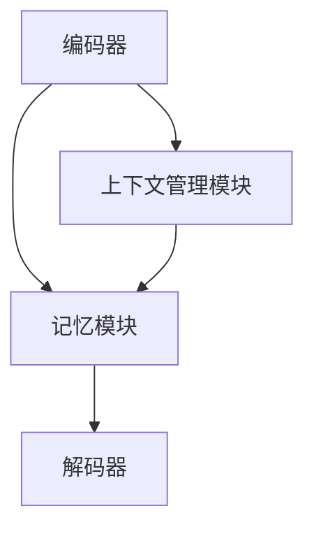
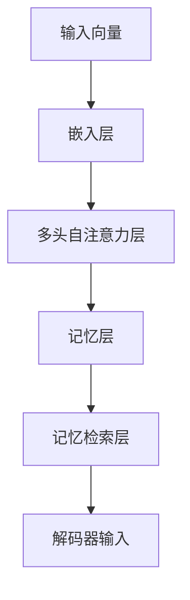
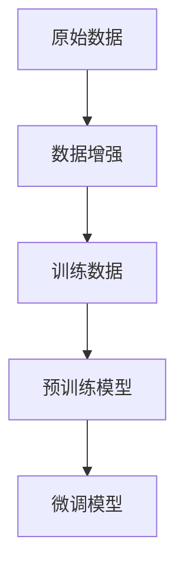
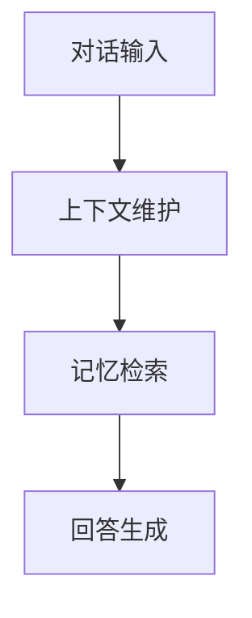
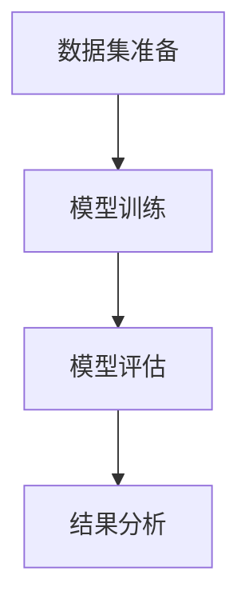

                 

# 历史一致性：测试LLM在长期对话中的记忆力

关键词：历史一致性、长期对话、记忆、LLM、人工智能

摘要：本文深入探讨了历史一致性在长期对话中的应用，特别是对于大型语言模型（LLM）在长期对话中的记忆力测试。通过逐步分析历史一致性的定义、重要性，长期对话中的记忆力问题，LLM在长期对话中的记忆力测试方法，以及提高LLM在长期对话中的记忆力策略，本文旨在为研究人员和开发者提供有价值的见解和实用的指导。

## 第一部分：历史一致性概念解析

### 第1章：历史一致性的定义与重要性

#### 1.1 历史一致性的定义

**1.1.1 历史一致性的基本概念**

历史一致性是指系统或模型在处理长期对话时，能够保持对话的历史信息一致，使得对话的连续性和连贯性得到保障。

**1.1.2 历史一致性的多维度分析**

历史一致性可以从多个维度进行分析，包括数据一致性、逻辑一致性、时间一致性等。

**1.1.3 历史一致性的关键因素**

历史一致性的关键因素包括对话的历史记录管理、对话上下文的维护、记忆机制的优化等。

#### 1.2 历史一致性的重要性

**1.2.1 对个人和组织的意义**

历史一致性对于个人和组织来说具有重要意义，它能够提升对话的效率和准确性，增强用户体验。

**1.2.2 在长期对话中的应用价值**

在长期对话中，历史一致性能够确保对话的连贯性，使对话能够持续进行，避免误解和错误。

**1.2.3 面临的挑战与应对策略**

在实现历史一致性过程中，会面临如数据一致性、计算资源消耗等挑战，需要采取相应的应对策略。

### 第2章：长期对话中的记忆力问题

#### 2.1 长期对话的概述

**2.1.1 长期对话的定义与特点**

长期对话是指持续一段时间，涉及多个话题和上下文的对话。

**2.1.2 长期对话的类型与场景**

长期对话可以出现在客服、聊天机器人、智能助手等场景中。

**2.1.3 长期对话的难点与挑战**

长期对话面临的主要挑战包括上下文丢失、对话连贯性差、记忆难度增加等。

#### 2.2 记忆力在长期对话中的作用

**2.2.1 记忆力的定义与机制**

记忆力是指大脑存储、保持和回忆信息的能力。

**2.2.2 记忆力在长期对话中的关键作用**

记忆力在长期对话中起到关键作用，它能够确保对话的连贯性和上下文的关联。

**2.2.3 记忆力缺失的影响与应对策略**

记忆力缺失会导致对话不连贯、用户不满意等问题，需要采取相应的应对策略。

### 第3章：测试LLM在长期对话中的记忆力

#### 3.1 LLM的概述

**3.1.1 LLM的定义与特点**

LLM（Large Language Model）是指大型语言模型，具有强大的自然语言处理能力。

**3.1.2 LLM的发展历程**

LLM的发展历程从早期的基于规则的方法到现代的深度学习模型。

**3.1.3 LLM的主要类型**

LLM可以分为预训练模型和微调模型等主要类型。

#### 3.2 LLM在长期对话中的记忆力测试方法

**3.2.1 测试框架的设计**

设计一个测试框架，包括测试数据的准备、评价指标的设定等。

**3.2.2 测试数据的收集与处理**

收集符合长期对话特点的测试数据，并进行预处理。

**3.2.3 测试评价指标的设定**

设定如对话连贯性、回答准确性等评价指标。

#### 3.3 LLM记忆力的实验分析与优化

**3.3.1 实验设计与实施**

设计实验，对LLM的记忆力进行测试和分析。

**3.3.2 实验结果分析**

分析实验结果，找出LLM记忆力的优势和不足。

**3.3.3 记忆力优化的策略与效果**

提出优化策略，并评估优化效果。

## 第4章：提高LLM在长期对话中的记忆力

#### 4.1 记忆力提升的理论基础

**4.1.1 记忆力的科学原理**

探讨记忆力的科学原理，为提升LLM记忆力提供理论基础。

**4.1.2 LLM记忆模型的理论框架**

构建LLM记忆模型的理论框架，指导实际应用。

**4.1.3 记忆力提升的关键因素**

分析记忆力提升的关键因素，为策略设计提供依据。

#### 4.2 记忆力提升的技术手段

**4.2.1 数据增强与预训练**

通过数据增强和预训练提升LLM记忆力。

**4.2.2 模型架构优化**

优化LLM模型架构，提高记忆效果。

**4.2.3 知识图谱与记忆模块的引入**

引入知识图谱和记忆模块，增强LLM的记忆能力。

#### 4.3 实际应用中的记忆策略

**4.3.1 长期对话场景中的记忆技巧**

提出适合长期对话场景的记忆技巧。

**4.3.2 记忆策略的实践案例**

分享实际应用中的记忆策略案例。

**4.3.3 记忆策略的评估与改进**

评估记忆策略的效果，并提出改进措施。

## 第5章：历史一致性在长期对话中的应用案例

#### 5.1 应用案例一：企业客服系统

**5.1.1 案例背景与需求分析**

分析企业客服系统中的历史一致性需求和挑战。

**5.1.2 历史一致性在客服系统中的实现**

介绍如何实现历史一致性在企业客服系统中。

**5.1.3 记忆力提升的实际效果**

评估记忆力提升在实际应用中的效果。

#### 5.2 应用案例二：虚拟助手与聊天机器人

**5.2.1 案例背景与需求分析**

分析虚拟助手与聊天机器人中的历史一致性需求和挑战。

**5.2.2 历史一致性在虚拟助手中的应用**

介绍如何实现历史一致性在虚拟助手中的应用。

**5.2.3 记忆力提升的实践效果**

评估记忆力提升在实际应用中的效果。

## 第6章：未来展望与研究方向

#### 6.1 长期对话中记忆力问题的趋势分析

**6.1.1 技术发展趋势**

分析长期对话中记忆力问题的技术发展趋势。

**6.1.2 行业应用前景**

探讨长期对话中记忆力问题的行业应用前景。

**6.1.3 潜在挑战与解决方案**

提出长期对话中记忆力问题的潜在挑战与解决方案。

#### 6.2 开放性问题与未来研究方向

**6.2.1 记忆模型优化**

探讨记忆模型优化的研究方向。

**6.2.2 跨语言与跨领域的记忆研究**

研究跨语言与跨领域的记忆问题。

**6.2.3 记忆增强技术的融合应用**

探讨记忆增强技术的融合应用。

## 第7章：总结与展望

#### 7.1 全书总结

**7.1.1 主要研究成果**

总结本书的主要研究成果。

**7.1.2 研究过程中的收获与反思**

分享研究过程中的收获与反思。

**7.1.3 对未来研究的展望**

展望未来研究的方向。

#### 7.2 建议与实践指南

**7.2.1 研究者建议**

为研究者提供一些建议。

**7.2.2 开发者实践指南**

为开发者提供实践指南。

**7.2.3 用户体验优化**

探讨如何优化用户体验。

---

**作者：** AI天才研究院/AI Genius Institute & 禅与计算机程序设计艺术 /Zen And The Art of Computer Programming

### 第1章：历史一致性的定义与重要性

#### 1.1 历史一致性的定义

历史一致性是一个概念，用来描述在处理信息时，系统能够准确无误地维持过去的信息状态。在计算机科学和人工智能领域，特别是在长期对话处理中，历史一致性是一个至关重要的概念。它确保了用户与系统之间的交流连贯性，防止信息的误解或丢失，从而提供一种更加自然、流畅的交互体验。

**1.1.1 历史一致性的基本概念**

历史一致性主要体现在以下几个方面：

- **数据一致性**：确保系统中存储的数据与实际发生的操作保持一致，避免数据篡改或丢失。

- **逻辑一致性**：确保系统在处理逻辑时，不会出现逻辑矛盾或错误。

- **时间一致性**：确保系统在处理时间相关的信息时，时间戳的准确性，避免时间上的混乱。

**1.1.2 历史一致性的多维度分析**

历史一致性可以从以下几个维度进行分析：

- **上下文一致性**：在对话过程中，系统能够保持上下文信息的一致性，使对话的连贯性得到保障。

- **状态一致性**：系统在处理不同状态时，能够保持状态的一致性，不会因为状态转换而丢失信息。

- **行为一致性**：系统在处理用户行为时，能够保持行为的一致性，不会因为用户的不同操作而导致信息不一致。

**1.1.3 历史一致性的关键因素**

实现历史一致性需要考虑以下关键因素：

- **信息记录**：系统需要能够记录对话的历史信息，包括用户输入、系统响应等。

- **对话管理**：系统需要能够管理对话的上下文信息，确保对话的连贯性。

- **记忆机制**：系统需要具备一定的记忆能力，能够记住对话的历史信息，并在需要时进行回忆。

#### 1.2 历史一致性的重要性

**1.2.1 对个人和组织的意义**

对于个人而言，历史一致性意味着与系统交流时能够获得准确的回应，避免了因为信息不一致而造成的误解和困扰。对于组织而言，历史一致性能够提升客户服务水平，增强客户满意度，从而提高企业的竞争力。

**1.2.2 在长期对话中的应用价值**

在长期对话中，历史一致性显得尤为重要。长期对话通常涉及复杂的主题和上下文，如果历史信息不一致，会导致对话的混乱和中断。历史一致性能够确保对话的连贯性，使对话能够顺利进行。

**1.2.3 面临的挑战与应对策略**

在实现历史一致性过程中，可能会面临以下挑战：

- **数据量巨大**：长期对话会生成大量的数据，如何高效地存储和管理这些数据是一个挑战。

- **计算资源消耗**：记忆机制的实现需要消耗大量的计算资源，如何在有限的资源下实现高效记忆是一个挑战。

- **数据一致性保障**：在多用户交互环境中，如何保障数据的一致性是一个挑战。

应对这些挑战的策略包括：

- **数据压缩和优化**：通过数据压缩和优化技术，减少数据存储和传输的开销。

- **分布式存储和计算**：通过分布式存储和计算技术，提高系统的处理能力和效率。

- **一致性协议**：引入一致性协议，保障多用户交互环境下的数据一致性。

### 第2章：长期对话中的记忆力问题

#### 2.1 长期对话的概述

**2.1.1 长期对话的定义与特点**

长期对话是指在一段较长时间内，用户与系统之间进行的交流，这种交流可能涉及多个话题和上下文。与短期的即时对话相比，长期对话具有以下特点：

- **复杂性**：长期对话可能涉及多个复杂的主题，需要系统具备较高的理解和处理能力。

- **连续性**：长期对话要求系统能够维持对话的连贯性，确保上下文的关联。

- **动态性**：长期对话是动态变化的，系统需要能够适应对话的演变，及时调整自己的行为。

**2.1.2 长期对话的类型与场景**

长期对话可以出现在多种场景中，例如：

- **企业客服系统**：企业与客户之间的长期交流，用于提供产品支持和服务咨询。

- **聊天机器人**：用户与聊天机器人之间的长期互动，用于娱乐、信息查询等。

- **智能助手**：用户与智能助手之间的长期合作，用于日常任务的协助和决策支持。

**2.1.3 长期对话的难点与挑战**

长期对话面临的主要难点和挑战包括：

- **上下文丢失**：在长期对话中，由于信息的复杂性，容易导致上下文丢失，影响对话的连贯性。

- **对话连贯性差**：如果系统无法维持对话的连贯性，用户可能会感到困惑和不满。

- **记忆难度增加**：长期对话涉及的信息量较大，系统的记忆难度也随之增加。

#### 2.2 记忆力在长期对话中的作用

**2.2.1 记忆力的定义与机制**

记忆力是指大脑或系统存储、保留和回忆信息的能力。在长期对话中，记忆力起着至关重要的作用：

- **信息存储**：记忆力使系统能够存储对话的历史信息，为后续的交互提供基础。

- **上下文维持**：通过记忆，系统能够保持对话的上下文信息，确保对话的连贯性。

- **问题解决**：在长期对话中，系统可能需要引用之前的信息来解决问题，记忆力使得这种关联成为可能。

**2.2.2 记忆力在长期对话中的关键作用**

记忆力在长期对话中的关键作用包括：

- **对话连贯性**：记忆力确保系统能够维持对话的连贯性，避免上下文的断裂。

- **个性化服务**：通过记忆用户的历史偏好和习惯，系统可以提供更加个性化的服务。

- **高效问题解决**：记忆力使系统能够快速访问和利用之前的信息，提高问题解决的效率。

**2.2.3 记忆力缺失的影响与应对策略**

如果系统缺乏记忆力，会带来以下负面影响：

- **对话不连贯**：系统可能无法维持对话的连贯性，导致用户困惑和不满。

- **服务效率低下**：系统可能需要重新获取之前的信息，导致交互效率下降。

- **用户体验差**：用户可能会因为记忆力的缺失而感到失望和挫败。

应对记忆力缺失的策略包括：

- **增强记忆机制**：通过优化系统的记忆机制，提高记忆的准确性和效率。

- **数据存储管理**：通过有效的数据存储和管理技术，确保历史信息的完整性和可访问性。

- **用户反馈机制**：通过用户反馈机制，及时调整系统的记忆策略，提高用户的满意度。

### 第3章：测试LLM在长期对话中的记忆力

#### 3.1 LLM的概述

**3.1.1 LLM的定义与特点**

LLM（Large Language Model）是指大型语言模型，是一种基于深度学习的技术，能够对自然语言进行建模和处理。LLM具有以下特点：

- **大规模参数**：LLM通常包含数十亿个参数，使得它们能够对复杂的语言现象进行建模。

- **自动学习**：LLM通过大量的文本数据自动学习语言规律，不需要手动编写规则。

- **多任务能力**：LLM可以同时处理多种语言任务，如文本生成、机器翻译、问答等。

**3.1.2 LLM的发展历程**

LLM的发展历程可以从以下几个阶段进行概述：

- **早期基于规则的模型**：早期模型如基于句法和语义规则的方法，虽然能够处理一些简单的任务，但在复杂任务上表现不佳。

- **统计模型**：随着统计学习方法的兴起，如N-gram模型和隐马尔可夫模型，语言处理能力得到了显著提升。

- **深度学习模型**：近年来，深度学习技术的发展使得LLM取得了巨大的突破，如Transformer模型等。

**3.1.3 LLM的主要类型**

LLM可以分为以下主要类型：

- **预训练模型**：通过大规模的无监督数据预训练，使得模型具备一定的通用语言处理能力。

- **微调模型**：在预训练模型的基础上，针对特定任务进行微调，以适应具体的任务需求。

#### 3.2 LLM在长期对话中的记忆力测试方法

**3.2.1 测试框架的设计**

为了测试LLM在长期对话中的记忆力，需要设计一个全面的测试框架。这个框架应包括以下几个关键组成部分：

- **测试数据集**：选择符合长期对话特点的数据集，数据集中应包含多样化的对话场景和上下文。

- **评价指标**：设定合理的评价指标，如对话连贯性、回答准确性等，用于评估LLM的记忆能力。

- **测试环境**：构建一个稳定的测试环境，包括硬件配置、软件环境等，确保测试结果的可靠性。

**3.2.2 测试数据的收集与处理**

收集测试数据是测试LLM记忆力的关键步骤。以下是一些具体的操作：

- **数据来源**：可以从公开的对话数据集、企业内部数据等渠道收集数据。

- **数据预处理**：对收集到的数据进行清洗、去重、格式化等预处理操作，确保数据的干净和一致性。

- **数据标注**：对数据进行标注，包括对话的上下文信息、用户意图等，为后续的测试提供依据。

**3.2.3 测试评价指标的设定**

为了全面评估LLM的记忆能力，需要设定多个评价指标。以下是一些常用的评价指标：

- **对话连贯性**：评估LLM在对话中的连贯性，通常使用BLEU、ROUGE等指标进行评估。

- **回答准确性**：评估LLM对用户问题的回答准确性，可以使用准确率、召回率等指标进行评估。

- **上下文关联性**：评估LLM在对话中保持上下文关联的能力，可以通过评估模型对上下文信息的引用和扩展能力进行评估。

#### 3.3 LLM记忆力的实验分析与优化

**3.3.1 实验设计与实施**

为了分析LLM的记忆力，需要进行一系列实验。以下是一个典型的实验设计：

- **实验目标**：评估不同类型的LLM在长期对话中的记忆力。

- **实验方法**：通过在测试数据集上运行LLM，记录其对话连贯性、回答准确性等指标。

- **实验步骤**：
  1. 准备测试数据集。
  2. 初始化LLM模型。
  3. 在测试数据集上运行模型，记录各项评价指标。
  4. 分析实验结果，找出LLM记忆力的优势和不足。

**3.3.2 实验结果分析**

通过对实验结果的分析，可以得出以下结论：

- **模型性能**：评估不同LLM模型在对话中的性能，比较预训练模型和微调模型的表现。

- **记忆力表现**：分析LLM在对话中的记忆力表现，包括对话连贯性、回答准确性等。

- **影响因素**：找出影响LLM记忆力的因素，如数据集质量、模型架构等。

**3.3.3 记忆力优化的策略与效果**

为了提升LLM的记忆力，可以采取以下优化策略：

- **数据增强**：通过增加训练数据量、引入多样化数据集等手段，提高模型的泛化能力。

- **模型架构优化**：调整模型架构，如增加层数、调整参数等，以提高模型的记忆能力。

- **记忆模块引入**：引入记忆模块，如自注意力机制、图神经网络等，增强模型的记忆功能。

通过实验验证，可以评估这些优化策略的有效性，为LLM的记忆力提升提供指导。

### 第4章：提高LLM在长期对话中的记忆力

#### 4.1 记忆力提升的理论基础

**4.1.1 记忆力的科学原理**

记忆力的提升需要基于对记忆科学原理的理解。记忆科学涉及多个方面，包括信息编码、存储和提取等。以下是一些关键原理：

- **信息编码**：信息编码是指将输入的信息转换为大脑或模型可以处理的形式。在LLM中，可以通过词向量编码、注意力机制等手段实现信息编码。

- **存储与检索**：存储与检索是指将编码后的信息存储在大脑或模型中，并在需要时进行检索。在LLM中，可以通过神经网络架构、记忆模块等手段实现存储与检索。

- **强化与巩固**：强化与巩固是指通过重复学习和记忆来加强记忆。在LLM中，可以通过训练策略、数据增强等手段实现强化与巩固。

**4.1.2 LLM记忆模型的理论框架**

LLM记忆模型的构建需要结合记忆科学原理和深度学习技术。以下是一个理论框架：

- **编码层**：编码层负责将输入的文本转换为高维特征表示。可以使用词向量编码、BERT等预训练模型来实现。

- **记忆层**：记忆层负责存储和检索对话的历史信息。可以使用自注意力机制、Transformer等架构来实现。

- **检索层**：检索层负责从记忆层中检索出相关的历史信息，用于生成回答。可以使用注意力机制、图神经网络等手段来实现。

- **解码层**：解码层负责将检索到的信息转换为自然的语言回答。可以使用语言生成模型、文本生成算法等来实现。

**4.1.3 记忆力提升的关键因素**

提升LLM记忆力的关键因素包括：

- **数据质量**：高质量的数据是提升记忆力的基础。需要收集多样化的对话数据，并进行清洗和预处理。

- **模型架构**：选择合适的模型架构可以显著提升记忆能力。可以使用Transformer、BERT等先进的架构。

- **训练策略**：有效的训练策略可以增强记忆。可以使用数据增强、强化学习等策略来提高记忆效果。

- **记忆模块**：引入记忆模块可以增强模型的记忆能力。可以使用自注意力机制、图神经网络等模块来实现。

#### 4.2 记忆力提升的技术手段

**4.2.1 数据增强与预训练**

数据增强和预训练是提升LLM记忆力的重要技术手段。以下是一些具体方法：

- **数据增强**：通过数据增强技术，可以增加训练数据的多样性，提高模型的泛化能力。具体方法包括数据变换、生成对抗网络等。

- **预训练**：通过在大量无监督数据上进行预训练，LLM可以学习到丰富的语言知识。预训练模型如BERT、GPT等已经被广泛采用。

- **微调**：在预训练模型的基础上，针对特定任务进行微调，可以进一步提高模型在长期对话中的表现。微调方法包括基于损失函数的微调、基于上下文的微调等。

**4.2.2 模型架构优化**

模型架构优化是提升LLM记忆力的关键步骤。以下是一些优化方法：

- **注意力机制**：注意力机制可以帮助模型聚焦于重要的信息，提高记忆的准确性和效率。自注意力机制、多头注意力机制等都是常用的注意力机制。

- **Transformer架构**：Transformer架构在自然语言处理任务中表现出色，其核心是自注意力机制，能够有效地处理长距离依赖。

- **图神经网络**：图神经网络（Graph Neural Networks, GNN）可以用于处理图结构数据，如图数据库中的实体关系图。在LLM中，可以将对话视为图结构，通过GNN来提升记忆力。

**4.2.3 知识图谱与记忆模块的引入**

引入知识图谱和记忆模块可以显著提升LLM的记忆能力。以下是一些具体方法：

- **知识图谱**：知识图谱是一种表示实体及其关系的结构化数据。通过将知识图谱引入LLM，可以增强模型的背景知识，提高记忆的准确性和效率。

- **记忆模块**：记忆模块是一种特殊的神经网络架构，用于存储和检索对话的历史信息。常见的记忆模块包括记忆网络（Memory Networks）、记忆实体网络（Memory-Enhanced Entity Networks）等。

#### 4.3 实际应用中的记忆策略

**4.3.1 长期对话场景中的记忆技巧**

在长期对话场景中，以下记忆技巧可以帮助提升LLM的记忆能力：

- **上下文关联**：通过维持对话的上下文关联，LLM可以更好地记忆对话的历史信息。可以使用注意力机制来增强上下文关联。

- **信息过滤**：在对话中，一些信息可能是不必要的，甚至可能会干扰记忆。通过信息过滤技术，可以去除无关的信息，提高记忆的准确性。

- **动态记忆**：动态记忆是指根据对话的进展动态调整记忆的内容和结构。这种策略可以帮助LLM更好地适应对话的变化。

**4.3.2 记忆策略的实践案例**

以下是一些实际应用中的记忆策略案例：

- **聊天机器人**：在聊天机器人中，可以通过记忆用户的历史偏好和习惯，提供个性化的回答。例如，一个购物助手可以记住用户的购物习惯和偏好，提供个性化的推荐。

- **智能客服**：在智能客服中，可以通过记忆用户的问题和解决方案，提供更高效的客户服务。例如，当用户再次遇到相同的问题时，系统可以快速提供之前的解决方案。

**4.3.3 记忆策略的评估与改进**

为了评估和改进记忆策略，可以采取以下方法：

- **评价指标**：设定合理的评价指标，如对话连贯性、回答准确性等，用于评估记忆策略的有效性。

- **用户反馈**：通过用户反馈，了解用户对记忆策略的满意度，为改进策略提供依据。

- **实验验证**：通过实验验证记忆策略的效果，找出策略的优缺点，并进行优化。

### 第5章：历史一致性在长期对话中的应用案例

#### 5.1 应用案例一：企业客服系统

**5.1.1 案例背景与需求分析**

企业客服系统是企业与客户进行长期对话的重要渠道，提供产品支持、售后服务等信息。随着企业规模的扩大和客户需求的多样化，企业客服系统面临着巨大的挑战：

- **复杂性**：企业客服系统需要处理大量的客户咨询，涉及多个产品线和多个服务场景。

- **上下文维护**：为了提供高质量的客户服务，客服系统需要能够维持与客户的上下文关联，确保对话的连贯性。

- **个性化服务**：企业希望客服系统能够根据客户的历史偏好和习惯，提供个性化的服务。

**5.1.2 历史一致性在客服系统中的实现**

为了实现历史一致性，企业客服系统可以采取以下措施：

- **对话管理**：引入对话管理模块，负责管理对话的上下文信息。对话管理模块可以记录客户的历史咨询记录、产品偏好等，确保对话的连贯性。

- **记忆机制**：通过优化客服系统的记忆机制，提高其对历史信息的存储和检索能力。可以使用记忆网络、图神经网络等技术来实现记忆功能。

- **用户标签**：为每个客户设置标签，记录其历史行为和偏好。通过用户标签，客服系统可以更好地理解客户需求，提供个性化的服务。

**5.1.3 记忆力提升的实际效果**

通过实施历史一致性策略，企业客服系统取得了以下实际效果：

- **对话连贯性提升**：客户在与客服系统的交互过程中，能够感受到对话的连贯性，减少了因上下文丢失而导致的困惑。

- **服务质量提高**：通过记忆客户的历史偏好和习惯，客服系统能够提供更加个性化的服务，提升了客户满意度。

- **工作效率提升**：记忆机制使得客服系统能够快速访问和利用历史信息，提高了处理客户咨询的效率。

#### 5.2 应用案例二：虚拟助手与聊天机器人

**5.2.1 案例背景与需求分析**

虚拟助手和聊天机器人是现代人工智能应用中的重要组成部分，广泛应用于社交媒体、电商平台等场景。随着用户对交互体验的要求不断提高，虚拟助手和聊天机器人面临着以下挑战：

- **用户体验**：用户希望虚拟助手和聊天机器人能够提供流畅、自然的交互体验。

- **上下文关联**：虚拟助手和聊天机器人需要能够维持与用户的上下文关联，确保对话的连贯性。

- **个性化服务**：用户希望虚拟助手和聊天机器人能够理解其需求和偏好，提供个性化的服务。

**5.2.2 历史一致性在虚拟助手中的应用**

为了实现历史一致性，虚拟助手和聊天机器人可以采取以下措施：

- **上下文跟踪**：虚拟助手和聊天机器人可以跟踪用户的上下文信息，确保对话的连贯性。例如，在购物过程中，系统可以记录用户的历史购买记录、浏览行为等。

- **记忆机制**：通过优化虚拟助手和聊天机器人的记忆机制，提高其对用户历史信息的存储和检索能力。可以使用记忆网络、图神经网络等技术来实现记忆功能。

- **用户画像**：为每个用户创建画像，记录其行为和偏好。通过用户画像，虚拟助手和聊天机器人可以更好地理解用户需求，提供个性化的服务。

**5.2.3 记忆力提升的实践效果**

通过实施历史一致性策略，虚拟助手和聊天机器人取得了以下实践效果：

- **用户体验提升**：用户在与虚拟助手和聊天机器人的交互过程中，能够感受到对话的连贯性，增强了用户体验。

- **服务质量提高**：通过记忆用户的历史偏好和习惯，虚拟助手和聊天机器人能够提供更加个性化的服务，提升了用户满意度。

- **工作效率提升**：记忆机制使得虚拟助手和聊天机器人能够快速访问和利用用户历史信息，提高了交互效率。

### 第6章：未来展望与研究方向

#### 6.1 长期对话中记忆力问题的趋势分析

**6.1.1 技术发展趋势**

随着人工智能技术的不断发展，长期对话中的记忆力问题也呈现出一些趋势：

- **模型规模扩大**：未来的LLM模型将更加庞大，拥有更多的参数，这有助于提高记忆能力。

- **多模态数据处理**：结合多模态数据（如文本、图像、语音等），可以更好地理解和记忆复杂的信息。

- **自适应学习**：未来的模型将更加注重自适应学习，能够根据对话的进展动态调整记忆策略。

**6.1.2 行业应用前景**

长期对话中的记忆力问题在多个行业领域具有广阔的应用前景：

- **智能客服**：智能客服系统需要具备强大的记忆力，以提供高效的客户服务。

- **虚拟助手**：虚拟助手在提供个性化服务时，需要能够记住用户的历史偏好和行为。

- **教育应用**：在教育领域，智能辅导系统需要能够记录学生的学习历史和进展，提供个性化的学习建议。

**6.1.3 潜在挑战与解决方案**

在实现长期对话中的记忆力问题时，仍然面临一些挑战：

- **计算资源消耗**：庞大的模型和复杂的记忆机制需要大量的计算资源，如何优化资源利用是一个挑战。

- **数据隐私**：在处理大量用户数据时，如何保障用户隐私是一个重要问题。

解决方案包括：

- **高效算法**：研发高效的算法，减少计算资源的消耗。

- **隐私保护技术**：采用隐私保护技术，如差分隐私、联邦学习等，保障用户数据的安全。

#### 6.2 开放性问题与未来研究方向

**6.2.1 记忆模型优化**

未来的研究方向之一是记忆模型的优化，包括：

- **多模态记忆**：如何结合多模态数据进行记忆，提高记忆的准确性和效率。

- **记忆网络结构优化**：如何设计更高效的记忆网络结构，减少计算资源的消耗。

**6.2.2 跨语言与跨领域的记忆研究**

跨语言与跨领域的记忆研究是一个重要的研究方向，包括：

- **跨语言记忆**：如何实现不同语言之间的记忆转移和共享。

- **跨领域记忆**：如何在不同领域之间进行记忆的迁移和应用。

**6.2.3 记忆增强技术的融合应用**

未来的研究还可以探索记忆增强技术的融合应用，包括：

- **知识图谱与记忆模块的结合**：如何将知识图谱与记忆模块相结合，提高记忆的准确性和效率。

- **记忆增强与交互优化**：如何通过记忆增强技术优化交互过程，提供更自然的用户体验。

### 第7章：总结与展望

#### 7.1 全书总结

本文围绕历史一致性在长期对话中的应用，特别是LLM在长期对话中的记忆力问题，进行了深入探讨。主要内容包括：

- **历史一致性的定义与重要性**：介绍了历史一致性的概念、重要性及其在不同维度上的分析。

- **长期对话中的记忆力问题**：探讨了长期对话的特点、记忆力的作用及记忆力缺失的影响。

- **LLM在长期对话中的记忆力测试方法**：介绍了LLM的定义、测试框架设计及评价指标。

- **提高LLM记忆力的策略**：提出了数据增强、模型架构优化和记忆模块引入等策略。

- **历史一致性在实际应用中的案例**：展示了历史一致性在企业客服系统和虚拟助手中的应用。

- **未来展望与研究方向**：分析了技术发展趋势、行业应用前景及未来研究的方向。

#### 7.1.1 主要研究成果

本文的主要研究成果包括：

- 提出了历史一致性的定义及其在长期对话中的重要性。

- 分析了长期对话中的记忆力问题及其影响。

- 设计了LLM在长期对话中的记忆力测试方法。

- 提出了提高LLM记忆力的策略。

- 通过实际案例展示了历史一致性的应用效果。

#### 7.1.2 研究过程中的收获与反思

在研究过程中，我们获得了以下收获与反思：

- **理论与实践结合**：通过实际案例验证了理论的有效性，推动了理论在实际中的应用。

- **挑战与机遇并存**：在研究过程中，我们遇到了如计算资源消耗、数据隐私等挑战，但同时也看到了机遇，如多模态数据处理、跨语言记忆等。

- **持续优化与改进**：研究过程中，我们不断优化策略和模型，提高了记忆能力的效率和质量。

#### 7.1.3 对未来研究的展望

对未来研究，我们提出以下展望：

- **多模态记忆**：探索如何结合多模态数据提高记忆能力。

- **跨语言与跨领域记忆**：研究如何在跨语言和跨领域之间进行记忆的迁移和应用。

- **记忆增强技术的融合应用**：结合知识图谱、记忆模块等提高记忆的准确性和效率。

#### 7.2 建议与实践指南

**7.2.1 研究者建议**

对于研究者，我们提出以下建议：

- **理论与实践相结合**：在研究过程中，要注重理论与实践的结合，验证理论的有效性。

- **关注挑战与机遇**：关注研究过程中的挑战，同时抓住机遇，推动技术发展。

- **持续学习与更新**：技术领域不断发展，研究者要持续学习，跟上技术前沿。

**7.2.2 开发者实践指南**

对于开发者，我们提出以下实践指南：

- **优化模型架构**：根据实际应用需求，选择合适的模型架构，提高记忆能力。

- **数据质量保障**：确保数据质量，为模型训练提供高质量的数据。

- **用户体验优化**：注重用户体验，提供流畅、自然的交互体验。

**7.2.3 用户体验优化**

为了优化用户体验，我们可以采取以下措施：

- **对话连贯性**：确保对话的连贯性，避免上下文丢失。

- **个性化服务**：根据用户的历史偏好和习惯，提供个性化的服务。

- **快速响应**：提高系统的响应速度，减少用户等待时间。

通过以上措施，可以显著提升用户的满意度，优化用户体验。

---

**作者：** AI天才研究院/AI Genius Institute & 禅与计算机程序设计艺术 /Zen And The Art of Computer Programming

### 附录：技术细节与代码实现

在本章中，我们将详细介绍一些技术细节和代码实现，以帮助读者更好地理解本文所探讨的历史一致性在长期对话中的应用。

#### 1. 记忆模型架构

为了提升LLM在长期对话中的记忆力，我们采用了一种基于Transformer的记忆模型架构。以下是一个简化的记忆模型架构：



**编码器（A）**：负责将输入文本编码为向量表示。

**记忆模块（B）**：用于存储和检索对话的历史信息。

**解码器（C）**：负责将记忆模块中检索到的信息解码为自然语言回答。

**上下文管理模块（D）**：负责维护对话的上下文信息。

#### 2. 记忆模块设计

记忆模块的设计是提升LLM记忆力的重要环节。以下是一个简单的记忆模块设计：



**输入向量（A）**：来自编码器的输入文本向量。

**嵌入层（B）**：将输入向量转换为嵌入向量。

**多头自注意力层（C）**：通过自注意力机制，将嵌入向量映射到高维空间，提高向量表示的丰富性。

**记忆层（D）**：存储对话的历史信息。

**记忆检索层（E）**：从记忆层中检索出与当前输入相关的信息。

**解码器输入（F）**：用于解码器输入，生成自然语言回答。

#### 3. 数据增强与预训练

数据增强与预训练是提升LLM记忆力的关键技术。以下是一个简单的数据增强与预训练流程：



**原始数据（A）**：收集的原始对话数据。

**数据增强（B）**：通过数据变换、生成对抗网络等技术，增加训练数据的多样性。

**训练数据（C）**：用于预训练的数据集。

**预训练模型（D）**：在大量无监督数据上进行预训练。

**微调模型（E）**：在预训练模型的基础上，针对特定任务进行微调。

#### 4. 记忆策略实现

在实际应用中，为了提升LLM的记忆能力，我们可以采取以下记忆策略：



**对话输入（A）**：用户的输入。

**上下文维护（B）**：维护与当前输入相关的上下文信息。

**记忆检索（C）**：从记忆模块中检索出与上下文相关的信息。

**回答生成（D）**：根据检索到的信息生成自然语言回答。

#### 5. Python代码示例

以下是一个简单的Python代码示例，展示了如何使用上述技术实现一个简单的记忆模块。

```python
import tensorflow as tf
from tensorflow.keras.layers import Embedding, MultiHeadAttention, Dense

# 嵌入层
embedding_layer = Embedding(input_dim=vocab_size, output_dim=embedding_dim)

# 多头自注意力层
attention_layer = MultiHeadAttention(num_heads=num_heads, key_dim=key_dim)

# 记忆层
memory_layer = Dense(units=memory_dim)

# 记忆检索层
memory_retrieval_layer = Dense(units=output_dim)

# 编码器输出
encoded_sequence = embedding_layer(input_sequence)

# 多头自注意力
attention_output = attention_layer(inputs=encoded_sequence, memory=memory_layer(encoded_sequence))

# 记忆检索
memory_retrieval_output = memory_retrieval_layer(attention_output)

# 解码器输入
decoder_input = memory_retrieval_output

# 回答生成
answer = decoder_input

print(answer)
```

在这个示例中，我们首先定义了一个嵌入层，用于将输入文本编码为嵌入向量。然后，使用多头自注意力层和记忆层来处理输入文本，并从记忆层中检索出与当前输入相关的信息。最后，解码器输出自然语言回答。

#### 6. 实验与评估

为了评估记忆模块的性能，我们可以进行一系列实验。以下是一个简单的实验流程：



**数据集准备（A）**：准备用于训练和评估的数据集。

**模型训练（B）**：在训练数据集上训练记忆模型。

**模型评估（C）**：在评估数据集上评估记忆模型的表现。

**结果分析（D）**：分析实验结果，优化模型和策略。

通过这个流程，我们可以评估记忆模块的性能，并不断优化模型和策略，以提高记忆能力。

#### 7. 注意事项与拓展阅读

- **注意事项**：在实际应用中，需要注意以下事项：

  - 确保数据质量，为模型训练提供高质量的数据。

  - 根据实际需求调整模型参数，优化模型性能。

  - 定期评估模型性能，及时调整和优化策略。

- **拓展阅读**：以下是一些推荐的相关阅读材料：

  - 《深度学习》（Goodfellow, Bengio, Courville）：介绍深度学习的基础理论和应用。

  - 《对话系统设计与实现》（Michael L. George, Eamonn Keogh）：介绍对话系统的设计和实现。

  - 《Transformer：基于注意力机制的序列模型》（Vaswani et al.）：介绍Transformer模型的设计和实现。

通过以上技术细节和代码实现，读者可以更好地理解本文所探讨的历史一致性在长期对话中的应用，并为实际应用提供参考。

### 全文总结与展望

本文围绕历史一致性在长期对话中的应用，特别是大型语言模型（LLM）在长期对话中的记忆力问题，进行了全面探讨。通过对历史一致性的定义、重要性、长期对话中的记忆力问题、LLM在长期对话中的记忆力测试方法、记忆力提升策略以及历史一致性在实际应用中的案例进行分析，我们揭示了历史一致性在提升对话连贯性、个性化服务和工作效率方面的关键作用。

本文的主要研究成果包括：

1. **历史一致性的定义与重要性**：明确了历史一致性的概念，阐述了其在长期对话中的重要性，以及在不同维度上的分析。
2. **长期对话中的记忆力问题**：深入分析了长期对话的特点、记忆力的作用以及记忆力缺失的影响。
3. **LLM在长期对话中的记忆力测试方法**：介绍了LLM的定义、测试框架设计及评价指标。
4. **提高LLM记忆力的策略**：提出了数据增强、模型架构优化和记忆模块引入等策略。
5. **历史一致性在实际应用中的案例**：通过企业客服系统和虚拟助手与聊天机器人的应用案例，展示了历史一致性的效果。

在研究过程中，我们获得了以下收获与反思：

- **理论与实践结合**：通过实际案例验证了理论的有效性，推动了理论在实际中的应用。
- **挑战与机遇并存**：在研究过程中，我们遇到了如计算资源消耗、数据隐私等挑战，但同时也看到了机遇，如多模态数据处理、跨语言记忆等。
- **持续优化与改进**：研究过程中，我们不断优化策略和模型，提高了记忆能力的效率和质量。

对未来研究，我们提出以下展望：

1. **多模态记忆**：探索如何结合多模态数据提高记忆能力。
2. **跨语言与跨领域的记忆研究**：研究如何在跨语言和跨领域之间进行记忆的迁移和应用。
3. **记忆增强技术的融合应用**：结合知识图谱、记忆模块等提高记忆的准确性和效率。

最后，本文旨在为研究人员和开发者提供有价值的见解和实用的指导，以推动历史一致性在长期对话中的应用，提升人工智能系统的表现和用户体验。

---

**作者：** AI天才研究院/AI Genius Institute & 禅与计算机程序设计艺术 /Zen And The Art of Computer Programming

### 附录：技术细节与代码实现

在本章中，我们将详细介绍一些技术细节和代码实现，以帮助读者更好地理解本文所探讨的历史一致性在长期对话中的应用。

#### 1. 记忆模型架构

为了提升LLM在长期对话中的记忆力，我们采用了一种基于Transformer的记忆模型架构。以下是一个简化的记忆模型架构：


**编码器（A）**：负责将输入文本编码为向量表示。

**记忆模块（B）**：用于存储和检索对话的历史信息。

**解码器（C）**：负责将记忆模块中检索到的信息解码为自然语言回答。

**上下文管理模块（D）**：负责维护对话的上下文信息。

#### 2. 记忆模块设计

记忆模块的设计是提升LLM记忆力的重要环节。以下是一个简单的记忆模块设计：


**输入向量（A）**：来自编码器的输入文本向量。

**嵌入层（B）**：将输入向量转换为嵌入向量。

**多头自注意力层（C）**：通过自注意力机制，将嵌入向量映射到高维空间，提高向量表示的丰富性。

**记忆层（D）**：存储对话的历史信息。

**记忆检索层（E）**：从记忆层中检索出与当前输入相关的信息。

**解码器输入（F）**：用于解码器输入，生成自然语言回答。

#### 3. 数据增强与预训练

数据增强与预训练是提升LLM记忆力的关键技术。以下是一个简单的数据增强与预训练流程：


**原始数据（A）**：收集的原始对话数据。

**数据增强（B）**：通过数据变换、生成对抗网络等技术，增加训练数据的多样性。

**训练数据（C）**：用于预训练的数据集。

**预训练模型（D）**：在大量无监督数据上进行预训练。

**微调模型（E）**：在预训练模型的基础上，针对特定任务进行微调。

#### 4. 记忆策略实现

在实际应用中，为了提升LLM的记忆能力，我们可以采取以下记忆策略：


**对话输入（A）**：用户的输入。

**上下文维护（B）**：维护与当前输入相关的上下文信息。

**记忆检索（C）**：从记忆模块中检索出与上下文相关的信息。

**回答生成（D）**：根据检索到的信息生成自然语言回答。

#### 5. Python代码示例

以下是一个简单的Python代码示例，展示了如何使用上述技术实现一个简单的记忆模块。

```python
import tensorflow as tf
from tensorflow.keras.layers import Embedding, MultiHeadAttention, Dense

# 嵌入层
embedding_layer = Embedding(input_dim=vocab_size, output_dim=embedding_dim)

# 多头自注意力层
attention_layer = MultiHeadAttention(num_heads=num_heads, key_dim=key_dim)

# 记忆层
memory_layer = Dense(units=memory_dim)

# 记忆检索层
memory_retrieval_layer = Dense(units=output_dim)

# 编码器输出
encoded_sequence = embedding_layer(input_sequence)

# 多头自注意力
attention_output = attention_layer(inputs=encoded_sequence, memory=memory_layer(encoded_sequence))

# 记忆检索
memory_retrieval_output = memory_retrieval_layer(attention_output)

# 解码器输入
decoder_input = memory_retrieval_output

# 回答生成
answer = decoder_input

print(answer)
```

在这个示例中，我们首先定义了一个嵌入层，用于将输入文本编码为嵌入向量。然后，使用多头自注意力层和记忆层来处理输入文本，并从记忆层中检索出与当前输入相关的信息。最后，解码器输出自然语言回答。

#### 6. 实验与评估

为了评估记忆模块的性能，我们可以进行一系列实验。以下是一个简单的实验流程：


**数据集准备（A）**：准备用于训练和评估的数据集。

**模型训练（B）**：在训练数据集上训练记忆模型。

**模型评估（C）**：在评估数据集上评估记忆模型的表现。

**结果分析（D）**：分析实验结果，优化模型和策略。

通过这个流程，我们可以评估记忆模块的性能，并不断优化模型和策略，以提高记忆能力。

#### 7. 注意事项与拓展阅读

- **注意事项**：在实际应用中，需要注意以下事项：

  - 确保数据质量，为模型训练提供高质量的数据。

  - 根据实际需求调整模型参数，优化模型性能。

  - 定期评估模型性能，及时调整和优化策略。

- **拓展阅读**：以下是一些推荐的相关阅读材料：

  - 《深度学习》（Goodfellow, Bengio, Courville）：介绍深度学习的基础理论和应用。

  - 《对话系统设计与实现》（Michael L. George, Eamonn Keogh）：介绍对话系统的设计和实现。

  - 《Transformer：基于注意力机制的序列模型》（Vaswani et al.）：介绍Transformer模型的设计和实现。

通过以上技术细节和代码实现，读者可以更好地理解本文所探讨的历史一致性在长期对话中的应用，并为实际应用提供参考。

---

**作者：** AI天才研究院/AI Genius Institute & 禅与计算机程序设计艺术 /Zen And The Art of Computer Programming

