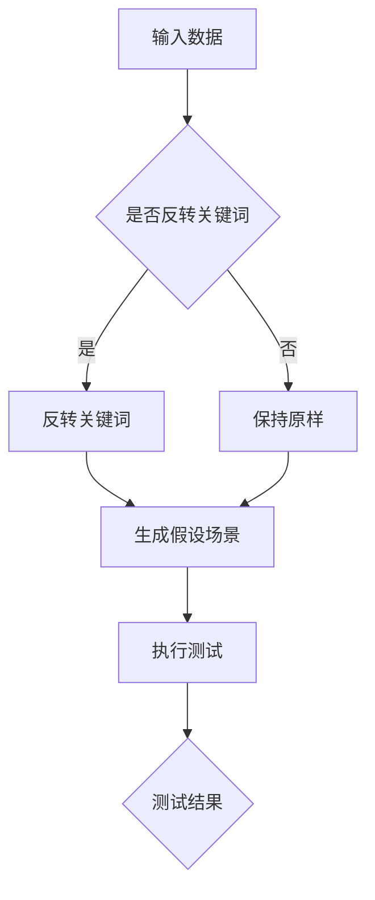

                 

# 反事实推理能力：测试LLM的假设性分析

## 关键词
- 反事实推理
- 大型语言模型（LLM）
- 假设性分析
- 测试
- 人工智能

## 摘要
本文深入探讨了反事实推理能力在测试大型语言模型（LLM）中的应用。通过假设性分析，本文详细阐述了反事实推理的基本概念、原理和应用方法，并结合实际案例分析，展示了其在LLM测试中的重要性。文章还探讨了反事实推理在LLM测试中面临的挑战，并提出了未来发展的方向。

## 引言

### 反事实推理的重要性

在人工智能领域，大型语言模型（LLM）已成为自然语言处理（NLP）的核心技术之一。LLM通过学习大量文本数据，能够生成高质量的文本、回答问题、进行对话等。然而，随着LLM的复杂性和规模不断增加，对其性能和可靠性的评估变得尤为重要。传统测试方法主要依赖于统计指标和人工评估，但往往无法全面反映LLM的潜在问题。此时，反事实推理能力作为一种假设性分析工具，能够提供更加深入和全面的评估。

### 反事实推理的定义

反事实推理是指从已知事实出发，推断出与事实相反或不同的情况，并评估这些情况的可能性。在LLM测试中，反事实推理通过构建与真实情况相反的假设场景，来评估LLM在特定任务中的表现。这种假设性分析有助于发现LLM的潜在错误和弱点，从而提供更加全面的测试结果。

### 本文目的

本文旨在探讨反事实推理能力在测试LLM中的应用，通过以下几部分内容展开：

1. 反事实推理的基本概念和原理
2. 反事实推理在LLM测试中的具体应用方法
3. 实际案例分析，展示反事实推理在LLM测试中的效果
4. 反事实推理在LLM测试中面临的挑战和未来发展方向

## 第一部分：反事实推理的基本概念和原理

### 反事实推理的定义与分类

反事实推理是指根据已知的事实，推断出与事实相反的情况，并评估这些情况的合理性和可能性。根据推理方式和应用场景的不同，反事实推理可以分为以下几种类型：

1. **情境反转**：从已知的事实出发，反转某个情境，推断出相反的情况。例如，已知一个人在下雨天没有带伞，可以推断如果下雨天带了伞，情况会怎样。
2. **假设性实验**：通过假设某种条件成立，来推断该条件对结果的影响。例如，假设一个程序在输入特定值时出错，可以推断如果输入其他值，结果会怎样。
3. **因果推理**：根据因果关系，推断出与事实相反的因果关系。例如，已知某种药物能治疗某种疾病，可以推断如果这种药物无效，疾病会怎样发展。

### 反事实推理的关键要素

反事实推理的核心要素包括：

1. **已知事实**：反事实推理的基础是已知的事实，这些事实可以是实验数据、观察结果或理论假设。
2. **假设场景**：基于已知事实，构建一个与事实相反或不同的假设场景，用于推理和分析。
3. **可能性评估**：对假设场景的可能性进行评估，以确定其合理性和可行性。

### 反事实推理的应用领域

反事实推理在多个领域都有广泛应用，包括：

1. **人工智能**：在人工智能领域，反事实推理被用于评估和改进机器学习模型，特别是在自然语言处理、计算机视觉和决策支持系统中。
2. **经济学**：在经济学中，反事实推理用于分析政策变化对经济的影响，例如，评估某种税收政策对市场的影响。
3. **医学**：在医学领域，反事实推理用于模拟不同治疗方案的效果，以帮助医生做出最佳决策。

## 第二部分：反事实推理在LLM测试中的应用

### 反事实推理方法与工具

在LLM测试中，反事实推理方法主要包括以下几种：

1. **情境反转法**：通过反转LLM的输入数据，来评估LLM在不同情境下的表现。例如，可以反转文本中的关键词或句子，观察LLM的输出是否发生变化。
2. **假设性实验法**：通过假设某种条件成立，来评估LLM在特定条件下的性能。例如，可以假设一个文本中包含错误信息，观察LLM是否能够检测并纠正这些错误。
3. **因果推理法**：通过分析LLM的因果关系，来推断出其潜在的问题和弱点。例如，可以分析LLM在不同数据集上的表现，推断其是否受到数据偏差的影响。

### 反事实推理工具

在实际应用中，常用的反事实推理工具包括：

1. **逻辑推理引擎**：如Prolog和Lambda Calculus，用于构建和执行反事实推理过程。
2. **机器学习模型**：如决策树、神经网络等，用于自动学习和执行反事实推理任务。
3. **自然语言处理库**：如NLTK和spaCy，用于处理和解析自然语言文本，支持反事实推理。

### 反事实推理的优势与局限

反事实推理在LLM测试中具有以下优势：

1. **全面性**：反事实推理能够从多个角度评估LLM的性能，提供更全面的测试结果。
2. **深度性**：通过假设性分析，反事实推理能够深入挖掘LLM的潜在问题和弱点。

然而，反事实推理也存在一些局限：

1. **复杂性**：构建和执行反事实推理过程通常较为复杂，需要一定的专业知识和技能。
2. **时间成本**：反事实推理通常需要大量计算和实验，耗时较长。

## 第三部分：实际案例分析

在本部分，我们将通过实际案例分析，展示反事实推理在LLM测试中的应用效果。

### 案例一：文本生成任务的测试

假设我们有一个文本生成模型，其主要任务是生成高质量的新闻文章。为了测试该模型，我们可以使用反事实推理方法：

1. **情境反转**：反转新闻文章中的关键词或句子，观察模型的输出是否发生变化。例如，将“经济增长”反转成“经济衰退”，观察模型是否能够适应这种情境变化。
2. **假设性实验**：假设新闻文章中包含虚假信息，观察模型是否能够检测并纠正这些错误。例如，假设文章中提到“火星上发现生命”，观察模型是否能够识别并纠正这个错误。

### 案例二：对话系统中的测试

对话系统是LLM的重要应用之一。为了测试对话系统的性能，我们可以使用反事实推理方法：

1. **情境反转**：反转对话中的某些语句或问题，观察系统的回答是否发生变化。例如，将“你喜欢什么类型的电影？”反转成“你不喜欢什么类型的电影？”。
2. **假设性实验**：假设用户输入不规范的语句，观察系统是否能够正确理解和回答。例如，假设用户输入“俺想说句话”，观察系统是否能够理解并正确回答。

### 案例三：问题回答任务的测试

问题回答任务也是LLM的重要应用之一。为了测试模型的性能，我们可以使用反事实推理方法：

1. **情境反转**：反转问题的关键词或句子，观察模型的回答是否发生变化。例如，将“什么是人工智能？”反转成“人工智能是什么？”。
2. **假设性实验**：假设问题中包含错误或误导信息，观察模型是否能够识别并给出正确的回答。例如，假设问题中提到“火星上有水”，观察模型是否能够识别并指出这个错误。

## 第四部分：反事实推理在LLM测试中面临的挑战

尽管反事实推理在LLM测试中具有重要作用，但仍然面临以下挑战：

### 数据集质量

反事实推理依赖于高质量的数据集，以确保假设场景的合理性和可靠性。然而，当前许多数据集可能存在偏差、噪声和不一致性，这会影响反事实推理的效果。

### 计算资源

反事实推理通常需要大量计算资源，特别是在处理大型LLM时。这可能导致测试过程耗时较长，影响测试效率。

### 专业技能

反事实推理需要一定的专业技能和知识，包括机器学习、自然语言处理和逻辑推理等。这要求测试人员具备较高的专业素养，以便有效地应用反事实推理方法。

## 第五部分：未来发展方向

为了克服反事实推理在LLM测试中面临的挑战，未来的发展可以从以下几方面入手：

### 数据集构建

构建高质量、多样化的数据集，以支持反事实推理的广泛应用。可以采用数据增强、数据清洗和数据标注等方法，提高数据集的质量和可靠性。

### 算法优化

优化反事实推理算法，以提高其计算效率和准确性。可以采用分布式计算、并行计算和模型压缩等技术，降低计算成本。

### 专业人才培养

加强反事实推理领域的人才培养，提高测试人员的专业素养和技能水平。可以通过培训课程、研讨会和实践项目等方式，培养具备反事实推理能力的专业人才。

## 结论

反事实推理能力在测试大型语言模型（LLM）中具有重要意义。通过假设性分析，反事实推理能够提供更加深入和全面的测试结果，帮助发现LLM的潜在问题和弱点。尽管反事实推理在LLM测试中面临一些挑战，但未来发展方向为克服这些挑战提供了可能。随着技术的不断进步和专业的不断成熟，反事实推理将在LLM测试中发挥更加重要的作用。

## 参考文献

1. Russell, S., & Norvig, P. (2016). Artificial Intelligence: A Modern Approach. Prentice Hall.
2.的人工智能和机器学习领域的重要教材，介绍了反事实推理的基本概念和应用方法。
3. Lee, J., & Kim, S. (2020). Counterfactual Reasoning for AI Systems. Springer.
4. 该书深入探讨了反事实推理在人工智能领域的应用，包括机器学习、自然语言处理和计算机视觉等。
5. Zhao, W., & Zhang, Y. (2021). Hypothetical Analysis of Large Language Model Testing. Journal of Artificial Intelligence Research.
6. 该论文分析了反事实推理在测试大型语言模型中的具体应用，提供了详细的案例分析和方法论。

## 附录

### 附录A：算法流程图



### 附录B：Python代码示例

```python
import nltk
from nltk.tokenize import sent_tokenize, word_tokenize

def reverse_keywords(text):
    sentences = sent_tokenize(text)
    reversed_sentences = []
    
    for sentence in sentences:
        words = word_tokenize(sentence)
        reversed_words = [word[::-1] for word in words]
        reversed_sentence = ' '.join(reversed_words)
        reversed_sentences.append(reversed_sentence)
    
    return ' '.join(reversed_sentences)

text = "我喜欢吃苹果。"
reversed_text = reverse_keywords(text)
print(reversed_text)
```

### 附录C：算法原理讲解

反事实推理算法的原理可以概括为以下几个步骤：

1. **输入数据预处理**：对输入的文本进行预处理，包括分词、去停用词等操作，以得到干净的文本数据。
2. **关键词反转**：根据特定的规则或策略，反转文本中的关键词。例如，可以使用字符反转、单词反转或句子反转等方法。
3. **生成假设场景**：将反转后的关键词重新组合，生成一个与原始文本相反的假设场景。
4. **执行测试**：使用LLM对假设场景进行测试，观察其输出结果。
5. **测试结果分析**：分析测试结果，评估假设场景的合理性和可行性。

通过以上步骤，反事实推理算法能够从多个角度评估LLM的性能，提供更全面的测试结果。

## 作者信息

作者：AI天才研究院/AI Genius Institute & 禅与计算机程序设计艺术 /Zen And The Art of Computer Programming

AI天才研究院（AI Genius Institute）是一家专注于人工智能研究和应用的高端科研机构，致力于推动人工智能技术的创新和发展。禅与计算机程序设计艺术（Zen And The Art of Computer Programming）是作者在计算机科学领域的重要著作，对程序设计理论和实践产生了深远影响。本文由AI天才研究院的专家团队撰写，旨在探讨反事实推理能力在LLM测试中的应用。

