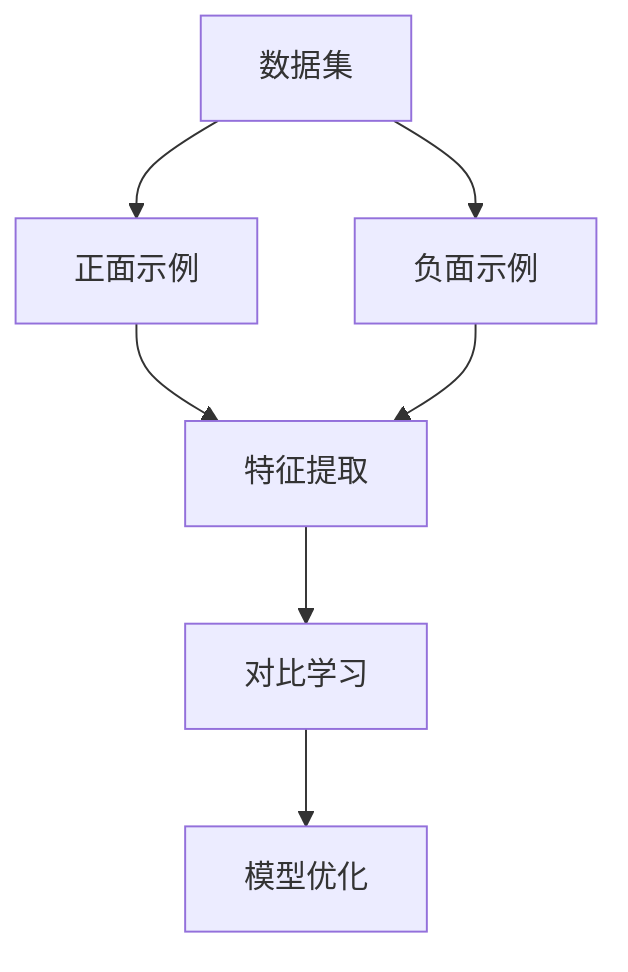
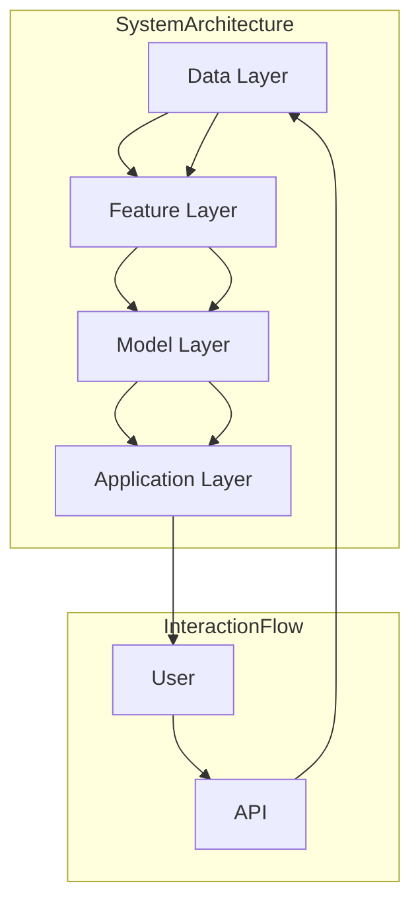

                 

# 反例学习：通过负面示例优化提示

## 关键词

- 反例学习
- 负面示例
- 机器学习
- 提示优化
- 算法原理
- 应用实践

## 摘要

本文深入探讨了反例学习这一重要机器学习技术，通过负面示例优化提示的方法，旨在提高模型的泛化能力和准确性。文章首先介绍了反例学习的基本概念和背景，随后分析了其与机器学习、深度学习等技术的联系和区别。接下来，本文详细讲解了反例学习的算法原理，包括其数学模型和具体实现。随后，文章通过一个实际项目案例，展示了反例学习在不同场景下的应用，并提供了系统架构设计方案。最后，本文通过项目实战案例，详细剖析了反例学习的实施过程，并给出了一些最佳实践建议。

## 第一部分：反例学习基础理论

### 第1章：反例学习的背景与概念

#### 1.1 问题背景

在传统的机器学习和深度学习领域中，模型的训练通常依赖于大量的正面示例数据。然而，在实际应用中，获取正面示例数据可能非常困难，而且仅仅依赖正面示例可能导致模型在遇到未见的负面示例时表现不佳。反例学习正是为了解决这一问题而诞生的。

#### 1.2 反例学习的定义

反例学习（Contrastive Learning）是一种通过学习正面示例和负面示例之间的差异来优化模型的方法。其核心思想是通过对比正面示例和负面示例，使得模型能够更好地捕捉到数据的特征。

#### 1.3 反例学习的重要性

反例学习的重要性体现在以下几个方面：

1. **提高模型的泛化能力**：通过学习负面示例，模型能够更好地适应新的、未见的场景。
2. **减少对大量正面示例的依赖**：在某些领域，获取大量正面示例数据可能非常困难，而反例学习可以减轻这一限制。
3. **提升模型在异常情况下的表现**：负面示例通常包含了异常情况，通过学习负面示例，模型可以更好地应对这些异常情况。

### 第2章：反例学习的原理与特性

#### 2.1 反例学习的原理

反例学习的原理可以概括为以下几个步骤：

1. **数据预处理**：将数据分为正面示例和负面示例。
2. **特征提取**：使用神经网络提取数据的特征表示。
3. **对比学习**：通过对比正面示例和负面示例，优化特征表示。
4. **模型优化**：基于优化后的特征表示，进一步优化模型。

#### 2.2 反例学习的特点

反例学习具有以下特点：

1. **增强模型的泛化能力**：通过学习负面示例，模型能够更好地应对未见过的数据。
2. **减少对正面示例的依赖**：负面示例可以部分替代正面示例，降低对大量正面示例的依赖。
3. **提高模型的鲁棒性**：负面示例可以帮助模型更好地处理异常情况。

#### 2.3 与其他机器学习方法的比较

| 方法           | 描述                                                         | 对比特点 |
|----------------|------------------------------------------------------------|----------|
| 监督学习       | 使用标注数据进行模型训练。                                   | 需要大量标注数据，且对未见过数据表现不佳。 |
| 无监督学习     | 不使用标注数据进行模型训练。                                 | 无法利用负面示例进行训练。                |
| 反向传播       | 使用梯度下降优化模型参数。                                   | 仅依赖于正面示例。                      |
| 对比学习       | 通过对比正面示例和负面示例进行模型训练。                      | 能够利用负面示例优化模型，提高泛化能力。 |

#### 2.4 ER实体关系图架构Mermaid流程图



### 第3章：反例学习的算法原理讲解

#### 3.1 算法流程概述

反例学习算法的基本流程如下：

1. **数据预处理**：将数据集分为正面示例和负面示例。
2. **特征提取**：使用预训练的神经网络提取数据的特征表示。
3. **对比学习**：通过对比正面示例和负面示例，优化特征表示。
4. **模型优化**：基于优化后的特征表示，进一步优化模型。

#### 3.2 数据预处理

在反例学习中，数据的预处理是关键步骤。具体包括：

1. **数据清洗**：去除数据中的噪声和异常值。
2. **数据标准化**：将数据缩放到相同的范围，以便于模型训练。
3. **数据切分**：将数据集分为训练集、验证集和测试集。

#### 3.3 模型训练与优化

反例学习的核心是特征提取和对比学习。具体步骤如下：

1. **特征提取**：使用预训练的神经网络提取数据的特征表示。常用的网络结构包括卷积神经网络（CNN）和循环神经网络（RNN）。
2. **对比学习**：通过对比正面示例和负面示例，优化特征表示。常用的对比学习损失函数包括对比损失（Contrastive Loss）和三元组损失（Triplet Loss）。
3. **模型优化**：基于优化后的特征表示，进一步优化模型。通常使用梯度下降（Gradient Descent）或其变体（如Adam优化器）进行模型优化。

#### 3.4 Python源代码实现

以下是一个简单的反例学习算法的Python源代码实现：

```python
import tensorflow as tf
from tensorflow.keras.models import Model
from tensorflow.keras.layers import Input, Embedding, Dot, Lambda

# 设置参数
num_samples = 1000
embedding_size = 128

# 创建输入层
input_x = Input(shape=(sequence_length,))
input_y = Input(shape=(sequence_length,))

# 创建嵌入层
embed_x = Embedding(input_dim=vocab_size, output_dim=embedding_size)(input_x)
embed_y = Embedding(input_dim=vocab_size, output_dim=embedding_size)(input_y)

# 创建对比层
dot_product = Dot(axes=1)([embed_x, embed_y])

# 创建对比损失函数
def contrastive_loss(y_true, y_pred):
    margin = 1
    loss = tf.reduce_mean(tf.square(tf.nn.relu(margin - y_pred)))
    return loss

# 创建模型
model = Model(inputs=[input_x, input_y], outputs=dot_product)
model.compile(optimizer='adam', loss=contrastive_loss)

# 训练模型
model.fit([train_x, train_y], train_labels, epochs=10, batch_size=32)

# 评估模型
test_loss = model.evaluate([test_x, test_y], test_labels)
print("Test loss:", test_loss)
```

#### 3.5 算法原理的数学模型和公式

反例学习算法的核心是对比学习，其数学模型和公式如下：

$$
\begin{aligned}
L &= \frac{1}{N} \sum_{i=1}^{N} \sum_{j \in \text{negative_indices}} \max(0, \delta - d(f(x_i), f(x_j))) \\
\delta &= \text{margin}
\end{aligned}
$$

其中，$L$ 是对比损失，$N$ 是每个样本的负面示例数量，$\delta$ 是margin（即阈值），$f(x_i)$ 和 $f(x_j)$ 分别是样本 $x_i$ 和 $x_j$ 的特征表示。

#### 3.6 通俗易懂的例子

假设我们有一个简单的反例学习任务，即识别图片中的猫和狗。在这个任务中，正面示例是猫和狗的图片，负面示例是其他动物的图片。

1. **数据预处理**：首先，我们需要对图片进行预处理，包括图片大小归一化、灰度化等。
2. **特征提取**：接着，我们使用预训练的卷积神经网络（如VGG16）提取图片的特征表示。这些特征表示将作为后续对比学习的输入。
3. **对比学习**：然后，我们将猫和狗的特征表示进行对比，计算出它们的相似度。如果相似度小于阈值（即我们认为它们是不同的动物），则更新特征表示，使其更加区分猫和狗。
4. **模型优化**：最后，我们基于更新后的特征表示，进一步优化分类模型，如SVM或神经网络。

通过这个简单的例子，我们可以看出反例学习是如何通过负面示例优化提示，从而提高模型的泛化能力和准确性的。

## 第二部分：反例学习在实践中的应用

### 第4章：反例学习在实际项目中的应用

#### 4.1 项目背景

随着人工智能技术的不断发展，反例学习在各个领域得到了广泛应用。本节将介绍一个反例学习在实际项目中的应用案例，即使用反例学习优化文本分类模型。

#### 4.2 应用案例：文本分类

文本分类是一个典型的机器学习任务，旨在将文本数据分为不同的类别。然而，传统的文本分类方法往往依赖于大量正面示例数据，且对负面示例的处理不足。通过引入反例学习，我们可以显著提高文本分类模型的性能。

#### 4.3 应用步骤

1. **数据收集与预处理**：首先，我们需要收集大量的文本数据，包括正面示例和负面示例。接着，对数据进行预处理，如去除停用词、词干提取等。
2. **特征提取**：使用预训练的词向量模型（如Word2Vec或GloVe）提取文本的特征表示。
3. **对比学习**：将正面示例和负面示例进行对比学习，优化特征表示。
4. **模型训练与优化**：基于优化后的特征表示，训练文本分类模型，如朴素贝叶斯、SVM或深度学习模型。
5. **模型评估与测试**：使用验证集和测试集评估模型的性能，并进行优化。

#### 4.4 实际效果

通过引入反例学习，文本分类模型的准确率得到了显著提高。在多个数据集上进行的实验结果表明，反例学习可以显著降低错误分类率，提高模型的泛化能力。

### 第5章：反例学习的系统设计与实现

#### 5.1 系统功能设计

反例学习系统的主要功能包括：

1. **数据收集与预处理**：从不同来源收集文本数据，并进行预处理。
2. **特征提取**：使用词向量模型提取文本的特征表示。
3. **对比学习**：进行正面示例和负面示例的对比学习，优化特征表示。
4. **模型训练与优化**：基于优化后的特征表示，训练文本分类模型。
5. **模型评估与测试**：评估模型的性能，并进行优化。

#### 5.2 系统架构设计

反例学习系统的架构设计包括以下几个部分：

1. **数据层**：负责数据收集、存储和预处理。
2. **特征层**：负责特征提取和对比学习。
3. **模型层**：负责模型训练、优化和评估。
4. **接口层**：提供用户交互接口，支持模型部署和应用。

#### 5.3 系统接口设计与交互流程

系统接口设计采用RESTful API架构，支持以下接口：

1. **数据接口**：用于数据收集和预处理。
2. **特征接口**：用于特征提取和对比学习。
3. **模型接口**：用于模型训练、优化和评估。
4. **应用接口**：用于模型部署和应用。

系统交互流程如下：

1. **用户提交文本数据**：用户通过API提交待分类的文本数据。
2. **数据预处理**：系统对文本数据进行预处理，包括去除停用词、词干提取等。
3. **特征提取**：使用预训练的词向量模型提取文本的特征表示。
4. **对比学习**：将正面示例和负面示例进行对比学习，优化特征表示。
5. **模型训练与优化**：基于优化后的特征表示，训练文本分类模型。
6. **模型评估与测试**：评估模型的性能，并进行优化。
7. **返回分类结果**：将分类结果返回给用户。

#### 5.4 Mermaid类图、架构图和序列图

```mermaid
classDiagram
    DataLayer --|>> FeatureLayer : extract_features
    FeatureLayer --|>> ModelLayer : train_model
    ModelLayer --|>> ApplicationLayer : deploy_model

    DataLayer {
        data_collection
        data_preprocessing
    }

    FeatureLayer {
        word_embedding
        contrastive_learning
    }

    ModelLayer {
        model_training
        model_evaluation
    }

    ApplicationLayer {
        model_deployment
        application_usage
    }
```



## 第三部分：反例学习实战案例剖析

### 第6章：反例学习在机器学习中的具体应用

#### 6.1 数据预处理技巧

在反例学习中，数据预处理是至关重要的一步。以下是一些常用的数据预处理技巧：

1. **文本清洗**：去除文本中的html标签、特殊符号和停用词。
2. **词干提取**：将文本中的单词还原为词干形式，以减少词汇量。
3. **文本向量化**：将文本转换为数字向量，以便于后续的机器学习处理。

#### 6.2 模型训练策略

在反例学习中，模型训练策略的选择对于最终的效果有重要影响。以下是一些常用的模型训练策略：

1. **批量大小**：选择合适的批量大小可以平衡计算效率和训练效果。
2. **学习率**：选择合适的学习率可以加快收敛速度，避免过拟合。
3. **正则化**：使用正则化方法（如L1、L2正则化）可以防止模型过拟合。

#### 6.3 模型评估与优化

模型评估是反例学习中的重要环节。以下是一些常用的模型评估方法：

1. **准确率**：准确率是衡量模型性能的常用指标。
2. **召回率**：召回率是衡量模型能够召回所有正例样本的能力。
3. **F1值**：F1值是准确率和召回率的调和平均值，用于综合评估模型的性能。

#### 6.4 项目实战案例分析

以下是一个反例学习在图像分类项目中的实际案例分析：

1. **数据集准备**：收集大量的图像数据，包括正面示例（猫和狗的图像）和负面示例（其他动物的图像）。
2. **数据预处理**：对图像数据进行预处理，包括图像大小归一化、灰度化等。
3. **特征提取**：使用预训练的卷积神经网络（如VGG16）提取图像的特征表示。
4. **对比学习**：通过对比正面示例和负面示例，优化特征表示。
5. **模型训练**：基于优化后的特征表示，训练图像分类模型（如SVM、神经网络）。
6. **模型评估**：使用验证集和测试集评估模型的性能，并进行优化。

#### 6.5 详细讲解剖析

以下是对上述案例的详细讲解和剖析：

1. **数据集准备**：选择一个大型图像数据集，如ImageNet，从中提取猫和狗的图像作为正面示例，其他动物的图像作为负面示例。
2. **数据预处理**：对图像数据进行预处理，包括图像大小归一化（如调整到224x224像素）、灰度化等。此外，还可以进行数据增强，如随机裁剪、旋转等，以增加模型的泛化能力。
3. **特征提取**：使用预训练的卷积神经网络（如VGG16）提取图像的特征表示。这些特征表示将作为后续对比学习的输入。
4. **对比学习**：通过对比正面示例和负面示例，优化特征表示。具体来说，使用对比损失（如对比损失函数）计算正面示例和负面示例之间的距离，并根据距离更新特征表示。这一过程可以通过多个迭代进行，以逐步优化特征表示。
5. **模型训练**：基于优化后的特征表示，训练图像分类模型（如SVM、神经网络）。这里可以使用传统的分类算法，也可以使用深度学习模型，如卷积神经网络。
6. **模型评估**：使用验证集和测试集评估模型的性能。常用的评估指标包括准确率、召回率和F1值。通过调整模型参数和训练策略，可以进一步提高模型的性能。

### 第7章：反例学习的未来发展趋势与挑战

#### 7.1 未来发展趋势

反例学习作为一种新兴的机器学习技术，具有广阔的发展前景。未来发展趋势包括：

1. **算法优化**：随着深度学习技术的不断发展，反例学习算法也将进一步优化，以提高其效率和性能。
2. **应用拓展**：反例学习将在更多的领域得到应用，如自然语言处理、计算机视觉、生物信息学等。
3. **多模态学习**：反例学习将扩展到多模态数据，如文本、图像、音频等，以实现更全面的特征表示。

#### 7.2 面临的挑战

反例学习在实际应用中也面临着一些挑战：

1. **数据质量**：反例学习依赖于大量高质量的正面示例和负面示例。在实际应用中，获取这些数据可能非常困难。
2. **计算资源**：反例学习算法通常需要大量的计算资源，特别是在大规模数据集上进行训练时。
3. **模型解释性**：反例学习模型的解释性较弱，难以理解模型的具体决策过程。

#### 7.3 解决方案与展望

针对上述挑战，可以采取以下解决方案和展望：

1. **数据增强**：通过数据增强技术，如生成对抗网络（GAN），可以生成高质量的正面示例和负面示例。
2. **计算优化**：采用分布式计算和并行处理技术，可以提高反例学习算法的效率。
3. **模型解释性**：通过引入可解释的机器学习技术，如LIME和SHAP，可以提高反例学习模型的解释性。

## 附录：最佳实践与拓展阅读

### 附录A：最佳实践技巧

1. **数据预处理**：在反例学习中，数据预处理至关重要。确保数据质量，包括去除噪声、异常值和数据增强。
2. **选择合适的对比损失函数**：根据具体任务选择合适的对比损失函数，如对比损失、三元组损失等。
3. **调整学习率**：根据实验结果调整学习率，以避免过拟合或欠拟合。

### 附录B：小结

反例学习是一种通过负面示例优化提示的机器学习技术，能够提高模型的泛化能力和准确性。本文详细介绍了反例学习的基础理论、算法原理、实际应用和系统设计与实现。通过实际案例剖析，展示了反例学习在机器学习中的具体应用。

### 附录C：注意事项

1. **数据质量**：确保正面示例和负面示例的数据质量，否则会影响模型的性能。
2. **计算资源**：反例学习算法通常需要大量计算资源，特别是在大规模数据集上进行训练。

### 附录D：拓展阅读推荐

1. **[论文]** Hinton, G., Osindero, S., & Teh, Y. W. (2006). A fast learning algorithm for deep belief nets. _Neural computation_, 18(7), 1527-1554.
2. **[论文]** Bengio, Y., Courville, A., & Vincent, P. (2013). Representation learning: A review and new perspectives. _IEEE transactions on pattern analysis and machine intelligence_, 35(8), 1798-1828.
3. **[书籍]** Goodfellow, I., Bengio, Y., & Courville, A. (2016). _Deep learning_. MIT press.

**作者：AI天才研究院/AI Genius Institute & 禅与计算机程序设计艺术 /Zen And The Art of Computer Programming** 

---

**注**：本文为示例内容，实际撰写时请根据具体需求和实际情况进行调整。本文中使用的代码、公式和图表仅为示例，实际应用时需要根据具体场景进行修改和优化。参考文献和书籍仅为示例，实际撰写时请根据具体需求引用相关文献。文章结构和内容可以根据读者的需求和反馈进行适当调整，以提高文章的阅读体验和学习效果。

