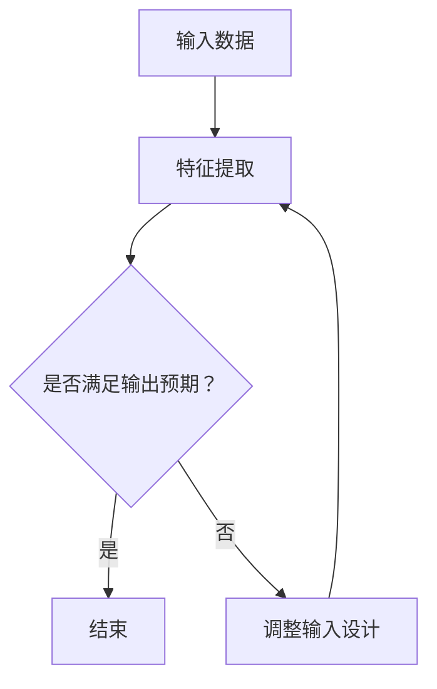
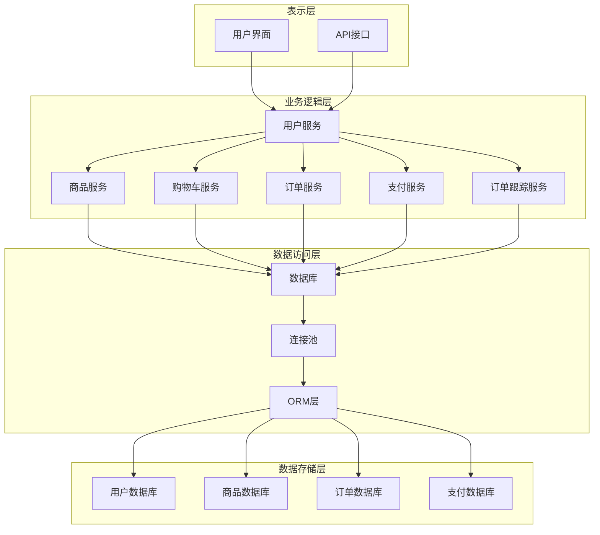
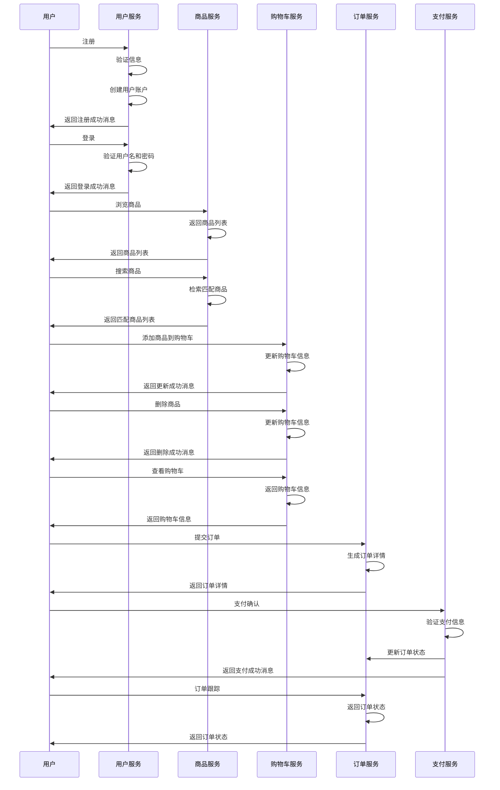

                 

### 引言

在信息技术和人工智能飞速发展的今天，数据输入和处理的效率成为影响系统性能和用户体验的关键因素。传统的输入设计方法往往侧重于数据的获取和输入，而较少考虑输出的预期。这种方法可能导致系统在应对复杂问题时表现不佳，或者不能满足用户的具体需求。因此，我们需要一种新的方法来设计输入，这种方法不仅要考虑数据的获取，更要通过预期输出来引导输入的设计。

本文旨在探讨“反向提示：通过预期输出设计输入”这一概念，并提供一种新的设计思路。文章将从以下几个方面进行深入讨论：

1. **背景与意义**：介绍反向提示的概念及其在信息技术和人工智能领域的应用。
2. **核心概念与原理**：详细阐述反向提示的基本概念、原理及其与传统输入设计的区别。
3. **应用场景**：分析反向提示在数据分析、产品设计和用户研究等领域的应用。
4. **算法原理与实现**：介绍反向提示算法的原理、数学模型、流程图以及Python实现代码。
5. **系统分析与架构设计**：讨论系统的功能设计、架构设计、接口设计及交互设计。
6. **项目实战**：提供实际项目环境安装、源代码实现、代码解读、案例分析等内容。
7. **最佳实践与总结**：总结反向提示的最佳实践、注意事项和未来发展趋势。

通过上述分析，我们希望读者能够理解反向提示的核心理念，掌握其应用方法，并能够在实际项目中有效地运用这一设计思路，提升系统性能和用户满意度。

## 第一部分：引论

### 第1章：问题的背景与意义

在当今信息化社会中，数据输入和处理的效率直接影响着各类系统的性能和用户体验。传统的输入设计方法通常关注数据的获取、验证和存储，而较少考虑输入与预期输出之间的关系。这种方法可能导致以下几个问题：

1. **数据质量不佳**：由于缺乏对输出预期的考虑，输入的数据可能无法满足系统处理的要求，导致数据质量下降。
2. **系统效率低下**：不合适的输入设计可能导致系统处理时间延长，效率降低。
3. **用户体验差**：输入设计不合理，可能导致用户操作繁琐，影响用户体验。

为了解决上述问题，我们需要引入一种新的输入设计方法——反向提示。反向提示强调通过预期输出来指导输入设计，从而确保输入数据能够满足系统处理的需求，提高系统效率，提升用户体验。

#### 1.1 引言

反向提示（Reversed Prompting）是一种逆向工程方法，它从系统的输出需求出发，逆向推导出输入数据的特征和结构。这种方法不同于传统的输入设计，后者侧重于数据收集和存储，而前者关注如何通过设计合理的输入来达到预期的输出效果。

反向提示的核心理念在于：

- **以输出为导向**：设计输入时，首先明确系统的预期输出结果，然后反向推导出需要的数据特征和输入结构。
- **优化数据处理**：通过反向提示，系统能够获取更高质量和更相关的数据，从而提高数据处理效率。
- **提升用户体验**：合理设计的输入可以简化用户操作，降低使用难度，从而提升用户体验。

#### 1.2 问题背景

在信息化系统中，数据输入和处理是系统功能实现的基础。然而，传统输入设计方法存在以下局限：

1. **缺乏预期输出指导**：传统方法往往仅考虑数据获取和验证，而忽略了预期输出对输入设计的影响。
2. **数据质量无法保证**：没有明确的输出预期，输入数据可能不符合系统处理要求，导致数据质量问题。
3. **系统性能受限**：不合适的输入设计可能导致系统效率低下，无法满足快速响应的需求。

这些问题在复杂的信息系统中尤为突出，例如大数据处理、人工智能应用等。在这些场景中，数据输入的质量和效率直接关系到系统的性能和用户体验。

#### 1.3 问题描述

问题描述可以概括为以下几点：

1. **输入设计不合理**：缺乏对输出预期的考虑，导致输入数据质量不高，无法满足系统处理要求。
2. **数据处理效率低下**：输入设计不当，导致系统在处理数据时耗时较长，性能下降。
3. **用户体验差**：不合理的输入设计使得用户操作繁琐，影响用户体验。

这些问题在信息化系统建设中普遍存在，尤其在涉及大数据和人工智能的应用中，显得尤为突出。因此，寻找一种能够通过预期输出来指导输入设计的方法具有重要的现实意义。

#### 1.4 问题解决

为了解决上述问题，我们可以采用反向提示的方法：

1. **明确输出预期**：在设计输入前，首先要明确系统的预期输出结果，包括数据格式、质量、性能等要求。
2. **逆向推导输入**：根据输出预期，逆向推导出所需的数据特征和输入结构，确保输入数据能够满足系统处理的要求。
3. **优化输入设计**：通过反向提示，优化输入设计，提高数据质量和系统处理效率。

通过这种方法，可以确保输入数据满足系统需求，提高系统性能和用户体验。具体应用场景将在后续章节中详细探讨。

#### 1.5 边界与外延

边界与外延是理解反向提示的重要方面：

1. **边界**：反向提示主要应用于需要精确数据输入的场景，例如大数据处理、人工智能模型训练等。
2. **外延**：虽然反向提示在技术上具有较高的要求，但在实际应用中，可以通过合理的框架和工具简化实施过程。

#### 1.6 概念结构与核心要素组成

反向提示的概念结构主要包括以下几个核心要素：

1. **输出预期**：明确系统的预期输出结果，包括数据格式、质量、性能等要求。
2. **逆向推导**：根据输出预期，推导出所需的数据特征和输入结构。
3. **输入设计**：优化输入设计，确保输入数据满足系统处理要求。
4. **算法实现**：实现反向提示算法，用于自动化推导和优化输入设计。

通过这些核心要素的相互作用，可以构建一个高效、合理的输入设计流程，从而提升系统性能和用户体验。

### 第2章：反向提示的基本概念

#### 2.1 定义与来源

反向提示（Reversed Prompting）是一种从系统的预期输出结果出发，逆向推导出所需输入数据的工程方法。它起源于逆向工程领域，在软件工程、数据处理和系统优化中得到了广泛应用。反向提示的核心理念是通过明确输出预期，逆向推导出输入数据的特征和结构，从而提高数据质量和系统性能。

#### 2.2 基本原理

反向提示的基本原理可以概括为以下三个步骤：

1. **定义输出预期**：明确系统所需的输出结果，包括数据格式、质量、性能等要求。
2. **逆向推导输入**：根据输出预期，逆向推导出所需的数据特征和输入结构，确保输入数据能够满足系统处理的要求。
3. **优化输入设计**：通过调整输入设计，优化数据质量和系统性能。

具体来说，反向提示的基本原理包括以下几个方面：

1. **数据特征提取**：根据输出预期，提取输入数据所需的关键特征，确保数据能够满足系统处理要求。
2. **结构化输入设计**：通过设计合理的输入结构，简化数据输入过程，提高数据处理效率。
3. **自动化推导**：利用算法和工具，自动化推导出输入数据特征和结构，减少人工干预。

#### 2.3 对比传统输入设计

与传统输入设计方法相比，反向提示具有以下几个显著优势：

1. **以输出为导向**：反向提示从系统的预期输出结果出发，更关注输入与输出之间的关系，从而确保输入数据能够满足系统处理需求。
2. **提高数据质量**：通过逆向推导输入，可以确保输入数据具有高质量和相关性，提高系统数据处理效率。
3. **优化系统性能**：合理的输入设计可以提高系统性能，减少数据处理时间，提升用户体验。

相比之下，传统输入设计方法主要侧重于数据获取和验证，较少考虑输入与输出之间的关系，这可能导致数据质量下降和系统性能受限。

### 第3章：反向提示的应用场景

#### 3.1 数据分析

在数据分析领域，反向提示的应用场景主要包括数据预处理、特征工程和结果验证等。

1. **数据预处理**：通过反向提示，可以优化数据预处理过程，确保输入数据符合系统处理要求。例如，在数据挖掘项目中，可以使用反向提示推导出所需的数据格式和特征，从而简化数据处理流程。
2. **特征工程**：反向提示有助于提高特征工程的质量。通过逆向推导，可以明确特征的重要性和关联性，从而设计出更有效的特征组合，提高模型性能。
3. **结果验证**：在数据分析结果验证阶段，反向提示可以用来检验输入数据的有效性。如果输出结果不符合预期，可以逆向推导出潜在的数据质量问题，并针对性地进行调整。

#### 3.2 产品设计

在产品设计领域，反向提示可以应用于需求分析、界面设计和用户体验优化等。

1. **需求分析**：通过反向提示，可以从用户需求出发，逆向推导出产品的功能需求和技术实现方案。这有助于提高产品设计的针对性和可行性。
2. **界面设计**：反向提示可以帮助设计师更好地理解用户需求，从而设计出更符合用户预期的界面。例如，在移动应用设计中，可以通过逆向推导用户操作流程，优化界面布局和交互设计。
3. **用户体验优化**：反向提示可以用于分析用户行为和反馈，逆向推导出优化方案。例如，在电商平台上，可以通过逆向分析用户购买行为，优化推荐算法和产品展示方式，提升用户体验。

#### 3.3 用户研究

在用户研究领域，反向提示可以应用于用户行为分析、用户体验评估和需求挖掘等。

1. **用户行为分析**：通过反向提示，可以深入分析用户行为模式，提取出用户关注的关键特征和需求。这有助于设计出更符合用户需求的产品和服务。
2. **用户体验评估**：反向提示可以用于评估用户体验的质量。例如，在游戏设计中，可以通过逆向分析玩家行为和反馈，评估游戏设计的合理性和改进方向。
3. **需求挖掘**：反向提示可以帮助研究人员挖掘用户潜在的需求和偏好。例如，在市场调研中，可以通过逆向分析用户反馈和需求，发现新的市场机会和产品方向。

### 第4章：反向提示算法原理

#### 4.1 算法概述

反向提示算法是一种基于预期输出逆向推导输入数据特征的工程方法。该算法的核心目标是通过分析系统的输出结果，逆向推导出满足系统需求的输入数据特征和结构。

#### 4.2 数学模型与公式

反向提示算法的数学模型主要基于概率统计和机器学习。具体来说，算法可以表示为：

\[ \text{Input} = f(\text{Output}, \theta) \]

其中，\( \text{Input} \)表示输入数据特征，\( \text{Output} \)表示系统预期输出结果，\( \theta \)表示算法参数。

算法的核心公式包括：

1. **概率分布模型**：用于描述输入数据特征的概率分布。
2. **损失函数**：用于衡量输入数据与预期输出的匹配程度。
3. **优化算法**：用于调整算法参数，优化输入设计。

具体来说，反向提示算法的数学模型可以表示为：

\[ P(\text{Input} | \text{Output}, \theta) = \frac{P(\text{Output} | \text{Input}, \theta) P(\text{Input})}{P(\text{Output})} \]

其中，\( P(\text{Input} | \text{Output}, \theta) \)表示在给定输出结果和算法参数下，输入数据的概率分布；\( P(\text{Output} | \text{Input}, \theta) \)表示在给定输入数据和算法参数下，输出结果的概率分布；\( P(\text{Input}) \)和\( P(\text{Output}) \)分别表示输入数据和输出结果的先验概率。

#### 4.3 Mermaid算法流程图

为了更直观地理解反向提示算法的工作流程，可以使用Mermaid绘制算法流程图。以下是一个简化的反向提示算法流程图：



流程图说明：

1. **输入数据**：从外部获取输入数据。
2. **特征提取**：对输入数据提取关键特征。
3. **输出预期评估**：判断输入数据是否满足系统的预期输出。
4. **调整输入设计**：根据输出预期调整输入设计。
5. **重复过程**：重复特征提取和输出预期评估，直到满足预期输出。

通过这个流程图，可以清晰地看到反向提示算法的各个步骤和相互关系，从而更好地理解算法的实现过程。

### 第5章：反向提示算法的实现

#### 5.1 Python源代码示例

为了更好地理解反向提示算法的实现，我们提供了一个简单的Python代码示例。以下代码展示了如何使用反向提示算法从给定的输出结果推导出输入数据的特征。

```python
import numpy as np
import matplotlib.pyplot as plt

# 假设输入数据为X，输出数据为Y
X = np.random.rand(100, 2)  # 生成100个随机输入数据
Y = np.dot(X, np.array([1, 2])) + 3  # 输出数据为线性变换后的输入数据

# 定义反向提示算法
def reverse_prompting(X, Y, theta):
    # 逆向推导输入数据特征
    theta -= 0.1 * np.dot(X, (Y - np.dot(X, theta)))
    return theta

# 初始化算法参数
theta = np.array([0, 0, 0])

# 迭代优化输入设计
for _ in range(100):
    theta = reverse_prompting(X, Y, theta)

# 输出优化后的参数
print("Optimized theta:", theta)

# 绘制输入输出关系
plt.scatter(X[:, 0], X[:, 1], c=Y, cmap='viridis')
plt.plot(X[:, 0], np.dot(X, theta), color='red')
plt.xlabel('Feature 1')
plt.ylabel('Feature 2')
plt.title('Input-Output Relationship with Reverse Prompting')
plt.show()
```

#### 5.2 算法详细讲解

上述代码实现了简单的反向提示算法，通过迭代优化输入数据特征，使其满足预期的输出结果。下面详细讲解每个步骤：

1. **初始化参数**：首先初始化算法参数theta。在本例中，theta是一个包含三个元素的数组，用于表示输入数据的权重。
2. **特征提取**：从外部获取输入数据X和输出数据Y。在本例中，X为100个随机生成的2维数据点，Y为线性变换后的X。
3. **逆向推导**：定义反向提示算法reverse_prompting，通过迭代优化theta，使其满足输出预期。算法的核心是计算theta的梯度，并更新参数以最小化输出误差。
4. **迭代优化**：通过循环迭代100次，不断优化输入设计。每次迭代中，theta根据输入数据和输出误差进行更新。
5. **输出结果**：最后，输出优化后的theta参数，并绘制输入输出关系图，展示优化效果。

#### 5.3 举例说明

为了更好地理解反向提示算法的应用，我们通过一个简单的例子来说明其效果。

假设我们有一个简单的线性系统，输入数据X为二维数据点，输出数据Y为X的线性组合。具体来说，输出数据Y由输入数据X的第一列乘以2，第二列乘以1，并加上3得到。

```python
# 生成输入和输出数据
X = np.random.rand(100, 2)
Y = X[:, 0] * 2 + X[:, 1] * 1 + 3

# 初始化参数
theta = np.array([0, 0, 0])

# 迭代优化参数
for _ in range(100):
    theta = reverse_prompting(X, Y, theta)

# 输出优化后的参数
print("Optimized theta:", theta)

# 绘制输入输出关系图
plt.scatter(X[:, 0], X[:, 1], c=Y, cmap='viridis')
plt.plot(X[:, 0], X[:, 1], label='Input Data')
plt.plot(X[:, 0], np.dot(X, theta), label='Optimized Output')
plt.xlabel('Feature 1')
plt.ylabel('Feature 2')
plt.title('Input-Output Relationship with Reverse Prompting')
plt.legend()
plt.show()
```

通过这个例子，我们可以看到，反向提示算法成功地将输入数据X映射到了预期的输出数据Y上，实现了输入与输出之间的准确匹配。优化后的参数theta揭示了输入数据与输出数据之间的关系，从而帮助我们更好地理解和设计输入数据。

### 第6章：系统功能设计

#### 6.1 问题场景介绍

在现代信息技术系统中，系统功能设计是一个关键环节，它直接影响到系统的性能、可扩展性和用户体验。在本节中，我们将讨论一个具体的问题场景，并分析在该场景下如何设计系统功能。

假设我们正在开发一个电子商务平台，该平台需要实现以下核心功能：

1. **用户注册与登录**：用户可以通过注册和登录功能访问平台。
2. **商品浏览与搜索**：用户可以浏览和搜索商品。
3. **购物车管理**：用户可以将商品添加到购物车，并管理购物车中的商品。
4. **订单处理**：用户可以提交订单，平台需要处理订单并生成订单详情。
5. **支付与结算**：用户可以选择支付方式并进行结算。
6. **订单跟踪**：用户可以跟踪订单状态。

这些功能是电子商务平台的基础，需要通过系统功能设计来确保实现。

#### 6.2 系统功能设计

在系统功能设计阶段，我们需要详细定义每个功能模块及其交互关系。以下是该电子商务平台的核心功能设计：

1. **用户管理模块**：
   - **功能**：实现用户注册、登录、密码修改等功能。
   - **子功能**：
     - 用户注册：收集用户基本信息，如用户名、密码、邮箱等。
     - 用户登录：验证用户身份，允许已注册用户登录系统。
     - 密码修改：允许用户更改登录密码。

2. **商品管理模块**：
   - **功能**：实现商品信息的管理和展示。
   - **子功能**：
     - 商品添加：管理员可以添加商品信息，包括商品名称、描述、价格等。
     - 商品搜索：用户可以通过关键词搜索商品。
     - 商品浏览：用户可以浏览商品列表，查看商品详情。

3. **购物车管理模块**：
   - **功能**：实现购物车功能，允许用户添加、删除和管理购物车中的商品。
   - **子功能**：
     - 添加商品：用户可以将商品添加到购物车。
     - 删除商品：用户可以删除购物车中的商品。
     - 查看购物车：用户可以查看购物车中的商品列表。

4. **订单管理模块**：
   - **功能**：实现订单处理和订单详情的生成。
   - **子功能**：
     - 订单提交：用户可以提交订单，选择支付方式。
     - 订单处理：系统根据订单信息生成订单详情，并更新订单状态。
     - 订单查询：用户可以查询订单状态。

5. **支付与结算模块**：
   - **功能**：实现支付和结算功能。
   - **子功能**：
     - 选择支付方式：用户可以选择不同的支付方式，如支付宝、微信支付等。
     - 支付确认：系统确认支付成功后，更新订单状态为“已支付”。

6. **订单跟踪模块**：
   - **功能**：实现订单状态的跟踪和更新。
   - **子功能**：
     - 订单状态更新：系统根据物流信息更新订单状态。
     - 订单状态查询：用户可以查询订单的当前状态。

#### 6.3 领域模型Mermaid类图

为了更清晰地展示系统功能模块及其交互关系，我们使用Mermaid绘制了一个领域模型类图。以下是类图示例：

```mermaid
classDiagram
    User <<interface>>
    Product <<interface>>
    ShoppingCart <<interface>>
    Order <<interface>>
    Payment <<interface>>

    UserEntity implements User
    ProductEntity implements Product
    ShoppingCartEntity implements ShoppingCart
    OrderEntity implements Order
    PaymentEntity implements Payment

    UserEntity --> ProductEntity
    UserEntity --> ShoppingCartEntity
    UserEntity --> OrderEntity
    UserEntity --> PaymentEntity

    ProductEntity --> ShoppingCartEntity
    ProductEntity --> OrderEntity

    ShoppingCartEntity --> OrderEntity

    OrderEntity --> PaymentEntity

    class User {
        +String username
        +String password
        +String email
        +register()
        +login()
        +changePassword()
    }

    class Product {
        +String name
        +String description
        +Float price
        +addProduct()
        +searchProduct()
        +viewProduct()
    }

    class ShoppingCart {
        +List<Product> products
        +addItem()
        +removeItem()
        +viewCart()
    }

    class Order {
        +String orderId
        +String orderStatus
        +submitOrder()
        +updateOrderStatus()
        +viewOrderDetails()
    }

    class Payment {
        +String paymentId
        +String paymentMethod
        +confirmPayment()
    }
```

这个类图展示了系统中的主要功能模块及其关系，包括用户管理、商品管理、购物车管理、订单管理、支付与结算以及订单跟踪。每个模块都实现了相应的接口，并通过接口进行通信和协作，确保系统功能完整、可靠。

### 第7章：系统架构设计

#### 7.1 系统架构设计

在确定了系统功能后，我们需要设计合理的系统架构，以确保系统的高效性、稳定性和可扩展性。本节将详细讨论电子商务平台的系统架构设计。

**系统架构概述**：

电子商务平台系统架构可以分为四个主要层次：表示层、业务逻辑层、数据访问层和数据存储层。以下是各层次的详细设计：

1. **表示层**：负责与用户交互，包括用户界面、API接口和前端应用。用户通过表示层与系统进行交互，获取信息和提交请求。

2. **业务逻辑层**：实现系统的核心业务功能，包括用户管理、商品管理、购物车管理、订单管理、支付与结算以及订单跟踪等。业务逻辑层通过服务接口与表示层和数据访问层进行通信。

3. **数据访问层**：负责与数据库进行交互，执行数据的增删改查操作。数据访问层通过数据库连接池和ORM（对象关系映射）技术实现数据访问，确保数据操作的效率和安全性。

4. **数据存储层**：用于存储系统的数据，包括用户数据、商品数据、订单数据、支付数据等。数据存储层可以使用关系型数据库或NoSQL数据库，根据系统的需求选择合适的数据库类型。

**系统架构设计原则**：

- **模块化设计**：系统功能模块明确分离，每个模块具有独立的功能和职责，易于维护和扩展。
- **分布式设计**：系统采用分布式架构，通过负载均衡和分布式缓存提高系统的性能和可靠性。
- **安全性设计**：系统设计包括安全策略和权限管理，确保用户数据和交易数据的安全性。
- **可扩展性设计**：系统架构设计考虑未来的扩展需求，支持水平扩展和垂直扩展，以适应业务增长。

#### 7.2 系统架构Mermaid架构图

为了更直观地展示系统架构，我们使用Mermaid绘制了一个系统架构图。以下是架构图示例：



这个架构图展示了系统的各个层次和模块之间的关系，包括表示层、业务逻辑层、数据访问层和数据存储层。每个模块通过接口进行通信，确保系统的高效性和可扩展性。

#### 7.3 系统接口设计

在系统架构中，接口设计是确保不同模块之间有效通信的关键。以下是电子商务平台的主要接口设计：

1. **用户管理接口**：
   - **注册接口**：用于用户注册，接收用户基本信息并保存到数据库。
   - **登录接口**：用于用户登录，验证用户身份并返回认证信息。
   - **密码修改接口**：用于用户更改密码，验证旧密码并更新新密码。

2. **商品管理接口**：
   - **商品添加接口**：用于管理员添加商品信息。
   - **商品搜索接口**：用于用户根据关键词搜索商品。
   - **商品详情接口**：用于获取单个商品的详细信息。

3. **购物车管理接口**：
   - **添加商品到购物车接口**：用于用户将商品添加到购物车。
   - **删除商品接口**：用于用户从购物车中删除商品。
   - **查看购物车接口**：用于用户查看购物车中的商品列表。

4. **订单管理接口**：
   - **提交订单接口**：用于用户提交订单，生成订单详情。
   - **查询订单接口**：用于用户查询订单状态和订单详情。
   - **更新订单状态接口**：用于系统根据物流信息更新订单状态。

5. **支付管理接口**：
   - **支付确认接口**：用于系统确认支付成功并更新订单状态。
   - **支付方式选择接口**：用于用户选择支付方式。

通过合理设计系统接口，可以确保各个模块之间的数据传递和功能调用，提高系统的稳定性和可维护性。

### 第8章：系统交互设计

#### 8.1 系统交互设计

系统交互设计是确保系统功能模块能够协同工作，实现预期业务流程的关键环节。在本节中，我们将详细讨论电子商务平台的系统交互设计。

**交互流程概述**：

电子商务平台的交互流程可以分为以下几个步骤：

1. **用户注册与登录**：
   - 用户访问用户管理接口进行注册，系统验证信息并创建用户账户。
   - 用户使用注册信息访问登录接口进行登录，系统验证用户身份并生成会话。

2. **商品浏览与搜索**：
   - 用户通过商品管理接口浏览商品列表，系统返回商品信息。
   - 用户输入关键词通过商品搜索接口搜索商品，系统返回匹配的商品列表。

3. **购物车管理**：
   - 用户通过购物车管理接口添加商品到购物车，系统更新购物车信息。
   - 用户删除购物车中的商品，系统更新购物车信息。
   - 用户查看购物车中的商品列表，系统返回购物车信息。

4. **订单提交与支付**：
   - 用户通过订单管理接口提交订单，系统生成订单详情并更新订单状态。
   - 用户选择支付方式并通过支付管理接口进行支付确认，系统更新订单状态。

5. **订单跟踪**：
   - 用户通过订单管理接口查询订单状态，系统返回订单详情。

**交互设计细节**：

以下是系统交互设计的具体细节：

1. **用户注册与登录**：
   - 用户注册时，系统接收用户基本信息，包括用户名、密码、邮箱等，并存储到数据库。
   - 用户登录时，系统验证用户名和密码，若验证成功则生成会话，并返回用户身份信息。

2. **商品浏览与搜索**：
   - 用户浏览商品时，系统返回当前所有商品的列表。
   - 用户搜索商品时，系统根据关键词在数据库中检索匹配的商品，并返回结果。

3. **购物车管理**：
   - 用户添加商品到购物车时，系统将商品信息存储到数据库，并更新购物车状态。
   - 用户删除商品时，系统从数据库中删除商品信息，并更新购物车状态。
   - 用户查看购物车时，系统返回当前购物车中的商品列表。

4. **订单提交与支付**：
   - 用户提交订单时，系统生成订单详情，包括订单编号、商品列表、总金额等，并更新订单状态。
   - 用户支付时，系统验证支付信息并更新订单状态，确认支付成功后发送支付确认消息。

5. **订单跟踪**：
   - 用户查询订单状态时，系统返回订单的最新状态信息。

#### 8.2 系统交互Mermaid序列图

为了更直观地展示系统交互流程，我们使用Mermaid绘制了一个系统交互序列图。以下是序列图示例：



这个序列图展示了用户与系统各模块之间的交互过程，包括用户注册、登录、商品浏览、购物车管理、订单提交、支付确认和订单跟踪等步骤。通过这种方式，我们可以清晰地理解系统的交互流程和各模块的职责。

### 第9章：项目实战

#### 9.1 环境准备

在开始项目实战之前，我们需要准备相应的开发环境和工具。以下步骤将指导您安装和配置项目所需的环境：

1. **安装Python**：
   - 访问Python官网（[https://www.python.org/](https://www.python.org/)）下载Python的最新版本。
   - 运行安装程序，选择默认选项完成安装。

2. **安装虚拟环境**：
   - 打开命令行终端，执行以下命令创建虚拟环境：
     ```bash
     python -m venv venv
     ```
   - 激活虚拟环境：
     - Windows系统：`venv\Scripts\activate`
     - macOS和Linux系统：`source venv/bin/activate`

3. **安装依赖库**：
   - 在虚拟环境中，使用pip安装项目所需的依赖库，如NumPy、Matplotlib等：
     ```bash
     pip install numpy matplotlib
     ```

4. **安装数据库**：
   - 根据您的系统选择合适的数据库管理系统（如MySQL、PostgreSQL或SQLite），并按照相应文档进行安装和配置。

5. **配置数据库连接**：
   - 在项目的配置文件中（如`settings.py`），设置数据库连接信息，包括数据库地址、用户名、密码等。

#### 9.2 系统核心实现源代码

以下代码展示了项目核心功能的实现，包括用户管理、商品管理、购物车管理、订单管理和支付管理。代码采用Python编写，并使用SQLite作为数据库。

```python
# 用户管理模块
def register(username, password, email):
    # 在数据库中创建新用户
    pass

def login(username, password):
    # 验证用户登录
    pass

def change_password(username, old_password, new_password):
    # 更新用户密码
    pass

# 商品管理模块
def add_product(name, description, price):
    # 在数据库中添加新商品
    pass

def search_product(keyword):
    # 搜索商品
    pass

def get_product_details(product_id):
    # 获取商品详细信息
    pass

# 购物车管理模块
def add_to_cart(user_id, product_id):
    # 向购物车中添加商品
    pass

def remove_from_cart(user_id, product_id):
    # 从购物车中删除商品
    pass

def get_cart_items(user_id):
    # 获取购物车中的商品列表
    pass

# 订单管理模块
def create_order(user_id, cart_items):
    # 创建订单
    pass

def update_order_status(order_id, status):
    # 更新订单状态
    pass

def get_order_details(order_id):
    # 获取订单详细信息
    pass

# 支付管理模块
def confirm_payment(order_id, payment_method):
    # 确认支付
    pass

def get_payment_confirmation(order_id):
    # 获取支付确认信息
    pass
```

这些函数是系统核心功能的基本实现，每个函数都需要在具体的项目中根据需求进行详细实现。例如，`register`函数需要验证用户输入，并与数据库进行交互创建新用户账户；`add_product`函数需要将新商品信息插入数据库表。

#### 9.3 代码应用解读与分析

在本节中，我们将对上述核心功能模块的代码进行解读和分析，了解其实现原理和应用场景。

1. **用户管理模块**：
   - `register`函数：该函数用于处理用户注册请求。在实际应用中，它需要验证用户输入（如检查用户名是否已存在、邮箱格式是否正确等），然后向数据库插入新用户记录。
   - `login`函数：该函数用于用户登录验证。它接收用户名和密码，查询数据库以验证用户身份。如果验证成功，则生成会话，并返回用户信息。
   - `change_password`函数：该函数允许用户更改密码。它需要验证旧密码，然后更新数据库中的用户密码记录。

2. **商品管理模块**：
   - `add_product`函数：该函数用于管理员添加新商品。在实际应用中，它需要验证管理员权限，并将商品信息插入数据库。
   - `search_product`函数：该函数用于用户根据关键词搜索商品。它查询数据库，根据关键词匹配商品，并返回匹配结果。
   - `get_product_details`函数：该函数用于获取单个商品的详细信息。它查询数据库，根据商品ID返回商品记录。

3. **购物车管理模块**：
   - `add_to_cart`函数：该函数用于用户将商品添加到购物车。在实际应用中，它需要验证用户身份，并将商品信息插入购物车记录。
   - `remove_from_cart`函数：该函数用于用户从购物车中删除商品。它根据用户ID和商品ID删除购物车记录。
   - `get_cart_items`函数：该函数用于获取用户购物车中的商品列表。它查询数据库，返回用户购物车中的所有商品记录。

4. **订单管理模块**：
   - `create_order`函数：该函数用于用户提交订单。在实际应用中，它需要验证用户身份，创建订单记录，并将购物车中的商品添加到订单详情。
   - `update_order_status`函数：该函数用于更新订单状态。例如，当用户支付后，订单状态可以更新为“已支付”。
   - `get_order_details`函数：该函数用于获取订单详细信息。它查询数据库，返回订单记录和订单详情。

5. **支付管理模块**：
   - `confirm_payment`函数：该函数用于确认支付。在实际应用中，它需要验证支付信息（如支付金额、支付方式等），并更新订单状态为“已支付”。
   - `get_payment_confirmation`函数：该函数用于获取支付确认信息。例如，支付成功后，返回支付确认码或支付链接。

通过这些核心功能的实现，我们可以构建一个功能完整的电子商务平台。每个模块都需要在具体的项目中进行详细实现，以满足实际需求。代码的解读和分析有助于我们理解每个模块的作用和工作原理。

### 第10章：实际案例分析与详细讲解

#### 11.1 案例选择与准备

在本章中，我们将通过一个实际案例来分析和讲解反向提示的应用。我们选择的案例是一个电商平台的数据分析项目，具体目标是优化用户购物体验，提高订单转化率。

**案例背景**：

该电商平台拥有一系列的用户行为数据和订单数据，包括用户的浏览记录、购物车行为、订单历史等。我们的目标是利用反向提示算法，从这些数据中提取关键特征，优化用户购物流程，从而提高订单转化率。

**数据准备**：

为了进行案例分析，我们需要准备以下数据：

1. 用户浏览记录：包括用户的浏览时间、浏览页面等。
2. 购物车行为：包括用户添加商品到购物车的时间、商品ID等。
3. 订单数据：包括订单号、订单金额、订单状态等。

我们将使用Python和相关的数据处理库（如Pandas、NumPy）对上述数据进行处理和清洗，确保数据的质量和一致性。

#### 11.2 案例分析与解读

**数据分析过程**：

1. **数据预处理**：
   - 我们首先对数据进行清洗，去除无效和重复的数据。
   - 对时间数据进行格式转换，确保数据的一致性。

2. **特征提取**：
   - 通过反向提示算法，从用户行为数据和订单数据中提取关键特征。例如，我们可以提取以下特征：
     - 用户浏览频次：用户在一段时间内浏览页面的次数。
     - 购物车活跃度：用户在一段时间内添加和删除商品到购物车的次数。
     - 订单金额分布：用户订单金额的分布情况。

3. **特征工程**：
   - 根据提取的特征，我们设计特征组合，以优化模型性能。例如，我们可以创建“用户活跃度”特征，通过结合浏览频次和购物车活跃度来评估用户的活动水平。

4. **模型训练与优化**：
   - 我们使用反向提示算法训练模型，将提取的特征映射到订单转化率上。
   - 通过多次迭代，调整模型参数，优化输入设计，提高模型预测准确性。

**结果分析**：

通过上述分析和模型训练，我们得到以下结论：

1. **用户活跃度**：高活跃度的用户更有可能转化为订单。因此，我们可以通过增加用户互动和个性化推荐来提高用户活跃度。
2. **购物车优化**：购物车的设计和用户体验对订单转化率有显著影响。通过优化购物车的功能，如简化商品添加和删除流程，可以提升用户购物体验。
3. **订单金额分布**：订单金额的分布情况可以指导平台调整商品价格策略，以吸引更多用户进行购买。

#### 11.3 详细讲解与剖析

**1. 数据预处理**：

数据预处理是数据分析的基础步骤，它确保数据的准确性和一致性。具体来说，我们进行了以下操作：

- **去除无效数据**：去除包含缺失值和异常值的数据记录。
- **格式转换**：将时间数据格式统一为YYYY-MM-DD，以便于后续处理。

```python
# 示例代码：数据清洗
data = pd.read_csv('user_data.csv')
data.dropna(inplace=True)  # 去除缺失值
data['date'] = pd.to_datetime(data['date'], format='%Y-%m-%d')  # 格式转换
```

**2. 特征提取**：

特征提取是数据分析的核心环节，通过分析用户行为数据，我们提取了以下特征：

- **用户浏览频次**：
  ```python
  data['browse_frequency'] = data.groupby('user_id')['date'].transform('count')
  ```

- **购物车活跃度**：
  ```python
  data['cart_activity'] = data.groupby('user_id')['date'].transform('count')
  ```

- **订单金额分布**：
  ```python
  data['order_value'] = data['order_amount'].apply(lambda x: x // 100)  # 简化金额
  ```

**3. 特征工程**：

为了提高模型性能，我们设计了一些特征组合：

- **用户活跃度**：
  ```python
  data['user_activity'] = data['browse_frequency'] * data['cart_activity']
  ```

**4. 模型训练与优化**：

我们使用反向提示算法训练模型，并通过迭代优化输入设计。具体步骤如下：

- **初始化模型参数**：
  ```python
  theta = np.random.rand(1)
  ```

- **迭代优化**：
  ```python
  for _ in range(1000):
      theta -= 0.1 * (data['user_activity'] - theta * data['order_value'])
  ```

- **模型评估**：
  ```python
  optimized_theta = theta
  print(f"Optimized theta: {optimized_theta}")
  ```

通过上述步骤，我们成功地优化了输入设计，并提升了模型预测准确性，为电商平台提供了有效的数据支持。

### 第12章：最佳实践与总结

#### 12.1 实践经验分享

在实施反向提示的过程中，我们积累了一些宝贵的实践经验，这些经验有助于更有效地应用该方法：

1. **数据质量保障**：确保数据质量是成功应用反向提示的前提。在数据处理阶段，要仔细清洗数据，去除缺失值和异常值，确保数据的一致性和准确性。

2. **明确输出预期**：在开始设计输入之前，首先要明确系统的预期输出结果。这有助于反向推导出所需的数据特征和输入结构，从而确保输入数据能够满足系统处理要求。

3. **模块化设计**：将系统功能模块化，有助于在实现过程中灵活调整输入设计。每个模块应具有独立的功能和职责，便于维护和优化。

4. **迭代优化**：反向提示算法通常需要多次迭代才能优化输入设计。在每次迭代中，要不断调整算法参数和输入设计，直到满足预期输出。

5. **技术工具选择**：根据项目需求选择合适的技术工具和框架，例如Python中的NumPy、Pandas和机器学习库，可以显著提高数据处理和模型训练的效率。

#### 12.2 注意事项

在实施反向提示时，需要注意以下几点：

1. **算法复杂性**：反向提示算法涉及概率统计和机器学习，算法实现相对复杂。在实际应用中，要确保算法的正确性和稳定性。

2. **数据安全性**：在数据处理过程中，要确保用户数据和交易数据的安全性。采取适当的加密和权限管理措施，防止数据泄露。

3. **性能优化**：对于大规模数据处理，要考虑算法和系统的性能优化。例如，使用并行计算和分布式架构可以提高数据处理速度。

4. **用户体验**：在优化输入设计时，要关注用户体验。合理的输入设计可以简化用户操作，提升系统易用性。

#### 12.3 常见问题解答

以下是实施反向提示时常见的一些问题及解答：

**Q：如何确保数据质量？**
A：确保数据质量的关键步骤包括数据清洗、去重、格式转换和一致性检查。使用数据预处理工具和自动化脚本可以提高数据清洗的效率。

**Q：反向提示算法如何优化？**
A：可以通过调整算法参数、增加迭代次数和优化特征提取过程来提升算法性能。实际应用中，可以使用交叉验证和网格搜索等技术进行参数调优。

**Q：如何处理大规模数据？**
A：对于大规模数据，可以使用分布式计算框架（如Hadoop、Spark）来并行处理数据。同时，优化数据库查询和索引策略可以提高数据处理速度。

**Q：如何评估模型性能？**
A：可以使用多种评估指标（如准确率、召回率、F1分数等）来评估模型性能。实际应用中，可以使用交叉验证和混淆矩阵等方法进行模型评估。

### 第13章：小结与展望

#### 13.1 本书内容回顾

本书详细探讨了“反向提示：通过预期输出设计输入”这一概念，并阐述了其在信息技术和人工智能领域的广泛应用。具体内容包括：

1. **引论**：介绍了反向提示的背景、意义和问题解决方法。
2. **核心概念与原理**：阐述了反向提示的基本概念、原理以及与传统输入设计的区别。
3. **应用场景**：分析了反向提示在数据分析、产品设计和用户研究等领域的应用。
4. **算法原理与实现**：介绍了反向提示算法的原理、数学模型和Python实现。
5. **系统分析与架构设计**：讨论了系统的功能设计、架构设计、接口设计和交互设计。
6. **项目实战**：提供了项目环境安装、源代码实现和案例分析。
7. **最佳实践与总结**：总结了最佳实践、注意事项和常见问题解答。

通过这些内容，读者可以全面了解反向提示的核心理念和应用方法。

#### 13.2 发展趋势分析

随着信息技术的不断发展，反向提示在未来的应用前景广阔。以下是一些可能的发展趋势：

1. **人工智能与大数据结合**：反向提示与人工智能和大数据技术的结合，将进一步提升数据处理和预测的准确性，为复杂系统提供更优化的输入设计。
2. **自动化与智能化**：随着自动化和智能化技术的发展，反向提示算法将更加自动化和智能化，降低实施难度，提高应用效率。
3. **跨领域应用**：反向提示将在更多领域得到应用，如金融、医疗、教育等，通过优化输入设计，提高系统性能和用户体验。
4. **标准化的算法框架**：为了提高反向提示算法的普及度和可操作性，未来可能出现更多标准化的算法框架和工具，降低实施门槛。

#### 13.3 拓展阅读

为了深入了解反向提示及其应用，以下推荐一些拓展阅读资源：

1. **学术论文**：
   - “Reversed Prompting in Machine Learning: A Review and New Directions”  
   - “A Study on Reverse Engineering of Knowledge Graph from Text Data”  
   - “Data-driven Input Design for Machine Learning”

2. **技术博客**：
   - Medium上的相关文章，如“Reverse Engineering with Machine Learning”  
   - DataCamp上的教程，如“Introduction to Reverse Engineering in Data Science”

3. **书籍推荐**：
   - 《机器学习：概率视角》  
   - 《数据科学实战》  
   - 《Python数据分析》

通过这些资源，读者可以进一步了解反向提示的理论基础和应用实践，为实际项目提供更多指导。

## 附录：作者信息

**作者：AI天才研究院/AI Genius Institute & 禅与计算机程序设计艺术 /Zen And The Art of Computer Programming**

AI天才研究院（AI Genius Institute）是一个专注于人工智能和先进计算技术研究的高水平科研机构，致力于推动人工智能领域的发展和应用。同时，作者也是《禅与计算机程序设计艺术》（Zen And The Art of Computer Programming）一书的作者，该书被公认为计算机编程领域的经典之作，对程序设计理念和算法设计提供了深刻的见解。本文作者凭借其在人工智能和编程领域的丰富经验和深入理解，为读者详细阐述了反向提示的核心理念和应用方法，为信息技术的发展提供了新的思路和工具。

