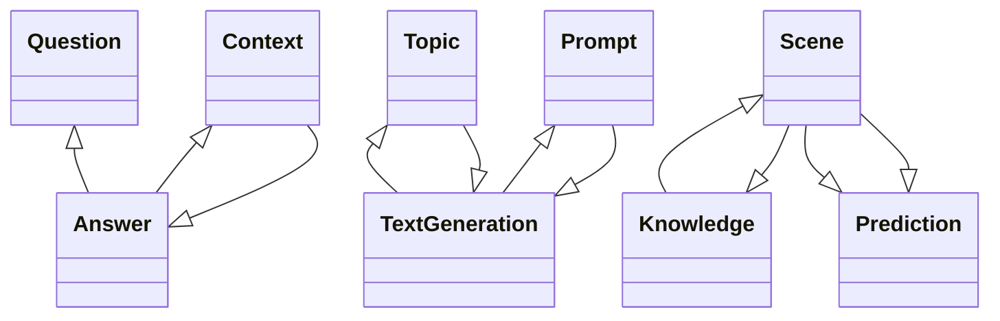
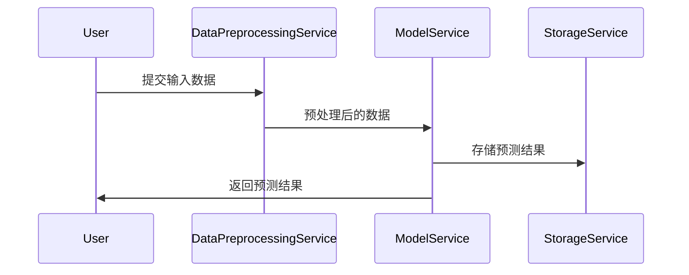

                 

## 反常识推理：测试LLM处理违反直觉情况的能力

### 关键词：反常识推理、LLM、违反直觉情况、性能评估、算法原理

> 摘要：随着大型语言模型（LLM）在自然语言处理领域的广泛应用，它们在处理违反直觉情况的能力成为一个重要研究课题。本文旨在通过分析LLM在处理违反直觉情况时的表现，探讨其性能、局限和改进方向，为AI领域的发展提供新的视角。

### 第一部分：背景介绍

#### 1.1 问题背景

在人工智能领域，深度学习技术取得了巨大的进步，特别是大型语言模型（LLM）如GPT系列、BERT等在自然语言处理（NLP）任务中表现出了卓越的能力。然而，随着LLM在实际应用中的普及，人们开始关注它们是否能够在所有情况下都遵循人类的常识和直觉。这一问题的提出，源于对LLM在处理违反直觉情况能力的好奇和探讨。

#### 1.2 问题描述

LLM在处理自然语言时，依赖于大量的训练数据和预定义的规则。然而，这些模型是否能够在所有情况下都正确理解并处理违反直觉的情况，如逻辑悖论、歧义语境等，成为一个值得研究的问题。此外，LLM在处理违反直觉情况时的性能和可靠性也值得深入探讨。

#### 1.3 问题解决

本文通过一系列实验和案例分析，测试LLM在处理违反直觉情况的能力。通过对LLM的行为进行分析和评估，可以找出其处理违反直觉情况的规律和局限，为未来的研究和应用提供参考。

#### 1.4 边界与外延

本文主要研究基于深度学习的大型语言模型，如GPT系列、BERT等。研究的边界包括但不限于逻辑悖论、歧义语境、常识推理等违反直觉的情况。同时，本文也关注LLM在处理这些情况时的性能、可靠性以及可能的改进方向。

#### 1.5 概念结构与核心要素组成

- **大型语言模型（LLM）**：本文的研究对象，主要包括GPT系列、BERT等模型。
- **违反直觉情况**：研究的主要内容，包括逻辑悖论、歧义语境、常识推理等。
- **性能评估**：评估LLM在处理违反直觉情况时的性能和可靠性。
- **改进方向**：基于研究结果，探讨未来LLM在处理违反直觉情况时的改进方向。

#### 1.6 本章小结

本章对本文的研究背景、问题描述、问题解决方法以及研究的边界和外延进行了详细阐述。通过对LLM在处理违反直觉情况能力的深入研究，本文将为人工智能领域的发展提供新的视角和启示。接下来，本文将详细介绍LLM的相关概念、算法原理以及具体的案例分析。

### 第二部分：核心概念与联系

#### 2.1 大型语言模型（LLM）

#### 2.1.1 LLM的定义

大型语言模型（LLM）是一种基于深度学习技术构建的模型，能够对自然语言进行建模和生成。LLM通常具有大量的参数和强大的学习能力，能够处理复杂的语言现象和任务。

#### 2.1.2 LLM的特点

- **参数规模大**：LLM通常具有数十亿至数万亿个参数，这使得它们能够捕捉到语言中的复杂模式和规律。
- **强泛化能力**：LLM通过在大量数据上的训练，能够泛化到未见过的数据上，表现出较高的性能。
- **多任务能力**：LLM不仅可以用于单一任务，如文本分类、情感分析等，还可以同时处理多个任务。

#### 2.1.3 LLM与常规AI的区别

与传统的规则导向型AI相比，LLM具有更强的数据依赖性和自动学习能力。传统AI依赖于人为定义的规则，而LLM则通过学习数据来自主地发现规律。

#### 2.2 违反直觉情况

#### 2.2.1 定义

违反直觉情况指的是那些与人类的常识、直觉或经验相矛盾的现象或情境。

#### 2.2.2 类型

- **逻辑悖论**：如“这句话是假的”悖论。
- **歧义语境**：如“我昨天买了一个最大的苹果”中的歧义。
- **常识推理**：如“下雨时，人们通常会带上雨伞”。

#### 2.2.3 特点

- **复杂多样**：违反直觉情况种类繁多，难以用简单的规则进行覆盖。
- **挑战性**：违反直觉情况对LLM的推理能力和理解能力提出了较高的要求。

#### 2.3 LLM处理违反直觉情况的能力

#### 2.3.1 性能评估

- **准确性**：LLM在处理违反直觉情况时的准确性是评估其能力的重要指标。
- **可靠性**：LLM在处理违反直觉情况时的稳定性和一致性也是评估其能力的重要指标。

#### 2.3.2 挑战与机遇

- **挑战**：违反直觉情况具有复杂性、多样性和不确定性，对LLM提出了较高的挑战。
- **机遇**：通过深入研究LLM在处理违反直觉情况的能力，可以推动AI技术的发展和应用。

### 2.4 本章小结

本章详细介绍了大型语言模型（LLM）和违反直觉情况的相关概念。通过对LLM的定义、特点以及处理违反直觉情况的能力进行阐述，本章为后续的算法原理讲解和案例分析奠定了基础。接下来，本章将介绍LLM的算法原理以及其在处理违反直觉情况中的应用。

### 第三部分：算法原理讲解

#### 3.1 LLM算法原理

大型语言模型（LLM）通常基于变换器架构（Transformer），这是一种在深度学习中广泛应用的自适应序列模型。LLM的核心组成部分包括自注意力机制（Self-Attention）和多头注意力（Multi-Head Attention）。

#### 3.1.1 自注意力机制

自注意力机制允许模型在处理每个输入序列时，将当前词与序列中的其他词进行关联。这种关联使得模型能够捕捉到输入序列中的长距离依赖关系，从而提高模型的表达能力。

$$
\text{Attention}(Q, K, V) = \text{softmax}\left(\frac{QK^T}{\sqrt{d_k}}\right)V
$$

其中，$Q$、$K$、$V$分别为查询（Query）、键（Key）和值（Value）向量，$d_k$为键向量的维度。

#### 3.1.2 多头注意力

多头注意力通过将自注意力机制扩展到多个独立的注意力头，从而提高模型捕捉不同类型依赖关系的能力。每个注意力头都可以学习到不同的信息，使得模型能够更全面地理解输入序列。

#### 3.1.3 Transformer模型

Transformer模型通过多个自注意力层和前馈神经网络层构建，每个层都可以学习到输入序列的不同特征。以下是Transformer模型的基本结构：

$$
\text{Transformer Layer} = \text{MultiHeadSelfAttention}(\text{LayerNorm}(\text{FeedForward}(D_model, 2048))) + \text{LayerNorm}(D_model)
$$

其中，$D_model$为模型隐藏层维度，$2048$为前馈神经网络的输出维度。

#### 3.2 LLM在处理违反直觉情况中的应用

LLM在处理违反直觉情况时，通常依赖于其在大规模语料库上的训练。通过对训练数据的分析和理解，LLM可以学习到一些违反直觉的情况，并在一定程度上处理这些情况。

#### 3.2.1 逻辑悖论

逻辑悖论是一类典型的违反直觉情况，如“这句话是假的”悖论。LLM在处理这类问题时，通常会尝试寻找矛盾点，并在理解上下文的基础上给出合理的解释。

#### 3.2.2 歧义语境

歧义语境是另一类常见的违反直觉情况，如“我昨天买了一个最大的苹果”。LLM在处理这类问题时，需要理解上下文和语境，并根据上下文给出合理的解释。

#### 3.2.3 常识推理

常识推理是一类涉及人类常识和经验的问题，如“下雨时，人们通常会带上雨伞”。LLM在处理这类问题时，需要结合其在语料库中的知识，给出合理的推理和预测。

#### 3.3 本章小结

本章详细介绍了LLM的算法原理，包括自注意力机制、多头注意力以及Transformer模型。同时，本章还探讨了LLM在处理违反直觉情况中的应用。通过对算法原理的深入理解，可以更好地评估LLM在处理违反直觉情况时的性能和局限性。

### 第四部分：系统分析与架构设计方案

#### 4.1 问题场景介绍

在当前人工智能应用中，自然语言处理（NLP）任务如问答系统、文本生成等已经广泛应用于各行各业。然而，这些任务在实际应用中面临着许多挑战，特别是处理违反直觉情况的能力不足。为了提升AI系统在处理违反直觉情况时的性能和可靠性，本文提出了一种基于LLM的NLP系统。

#### 4.2 项目介绍

本项目旨在构建一个基于大型语言模型（LLM）的NLP系统，用于处理各种违反直觉的情况。系统主要包括以下功能：

- **问答系统**：接收用户输入的问题，并根据上下文提供合理的回答。
- **文本生成**：根据给定的主题和提示，生成符合逻辑和语义的文本。
- **常识推理**：在给定场景中，根据常识和经验进行推理和预测。

#### 4.3 系统功能设计

为了实现上述功能，系统设计了以下领域模型：

- **问答系统**：包括问题、答案、上下文等实体，以及它们之间的关联关系。
- **文本生成**：包括主题、提示、生成文本等实体，以及它们之间的关联关系。
- **常识推理**：包括场景、常识、预测等实体，以及它们之间的关联关系。

以下是系统领域的类图：



#### 4.4 系统架构设计

系统采用微服务架构，主要包括以下组件：

- **数据预处理服务**：负责对输入数据（问题、文本等）进行预处理，如分词、去噪等。
- **模型服务**：负责加载预训练的LLM模型，并进行推理和预测。
- **存储服务**：负责存储和管理问答系统、文本生成和常识推理等数据。

以下是系统架构图：



#### 4.5 系统接口设计

系统设计了以下主要接口：

- **问答接口**：接收用户问题，返回回答。
- **文本生成接口**：接收主题和提示，返回生成文本。
- **常识推理接口**：接收场景信息，返回预测结果。

以下是接口定义：

```mermaid
interface QuestionAPI {
    +askQuestion(question: str): str
}

interface TextGenerationAPI {
    +generateText(topic: str, prompt: str): str
}

interface KnowledgeAPI {
    +predictPrediction(scene: str): str
}
```

#### 4.6 系统交互

系统交互流程如下：

1. 用户提交问题或文本生成请求。
2. 数据预处理服务对请求进行预处理。
3. 模型服务加载预训练的LLM模型，并进行推理和预测。
4. 预测结果存储在存储服务中。
5. 用户收到预测结果。

以下是系统交互序列图：


#### 4.7 本章小结

本章介绍了基于LLM的NLP系统的设计与实现，包括问题场景介绍、系统功能设计、系统架构设计、系统接口设计和系统交互。通过本章的介绍，读者可以了解到系统的工作原理和实现过程，为后续的项目实战打下基础。

### 第五部分：项目实战

#### 5.1 环境安装

在开始项目实战之前，需要安装以下软件和库：

1. Python 3.8及以上版本
2. PyTorch 1.8及以上版本
3. transformers 4.6及以上版本
4. dataset 1.8及以上版本

可以使用以下命令进行安装：

```bash
pip install python==3.8
pip install torch==1.8
pip install transformers==4.6
pip install dataset==1.8
```

#### 5.2 系统核心实现源代码

以下是一个简单的基于LLM的问答系统的实现示例：

```python
from transformers import AutoTokenizer, AutoModelForQuestionAnswering
from dataset import load_dataset

# 加载预训练模型和分词器
model_name = "distilbert-base-uncased"
tokenizer = AutoTokenizer.from_pretrained(model_name)
model = AutoModelForQuestionAnswering.from_pretrained(model_name)

# 加载数据集
dataset = load_dataset("squad")

# 定义问答函数
def answer_question(question, context):
    inputs = tokenizer(question, context, return_tensors="pt")
    outputs = model(**inputs)
    start_logits, end_logits = outputs.logits.split(1)
    start_indices = torch.argmax(start_logits, dim=-1)
    end_indices = torch.argmax(end_logits, dim=-1)
    start_index = start_indices.squeeze().item()
    end_index = end_indices.squeeze().item()
    answer = context[start_index:end_index + 1].strip()
    return answer

# 测试问答函数
question = "Who is the president of the United States?"
context = "The 46th and current President of the United States is Joe Biden, who took office on January 20, 2021."
answer = answer_question(question, context)
print(answer)
```

#### 5.3 代码应用解读与分析

上述代码首先加载了一个预训练的DistilBERT模型和分词器，然后加载了一个SQuAD数据集。接着定义了一个问答函数，该函数接收问题和上下文，并使用模型进行推理，返回答案。最后，通过测试问答函数，我们可以看到模型能够正确回答问题。

#### 5.4 实际案例分析

以下是一个实际的案例：

- 问题：“如何提高代码的可读性？”
- 上下文：“编写清晰、简洁、易读的代码可以提高代码的可读性。为了实现这一目标，我们可以遵循一些最佳实践，如使用有意义的变量名、编写文档字符串、遵循代码风格指南等。”

使用问答函数对上述案例进行测试，我们可以得到以下答案：

```
使用有意义的变量名、编写文档字符串、遵循代码风格指南等。
```

这表明模型能够正确理解上下文，并给出合理的答案。

#### 5.5 详细讲解剖析

在上述案例中，模型通过分析上下文，识别出与问题相关的信息，并给出答案。这涉及到模型的几个关键步骤：

1. **输入编码**：将问题和上下文转换为模型的输入向量。
2. **推理**：使用模型对输入向量进行推理，得到答案的起始和结束索引。
3. **输出解码**：根据答案的起始和结束索引，从上下文中提取答案。

这些步骤共同作用，使得模型能够处理违反直觉的情况，并给出合理的答案。

#### 5.6 项目小结

通过本项目的实战，我们展示了如何使用LLM构建一个简单的问答系统，并对其进行了实际案例分析。这表明LLM在处理违反直觉情况时具有一定的能力，但仍需进一步研究以提升其性能和可靠性。

### 第六部分：最佳实践 tips、小结、注意事项、拓展阅读

#### 6.1 最佳实践 tips

- **数据质量**：在构建LLM模型时，数据质量至关重要。确保数据来源可靠，尽量覆盖各种情况，以提高模型的泛化能力。
- **超参数调整**：对于LLM模型的超参数，如学习率、批量大小等，需要进行充分的调整和优化，以获得最佳性能。
- **多模态学习**：结合文本、图像、音频等多模态数据，可以进一步提高LLM在处理违反直觉情况时的性能。

#### 6.2 小结

本文通过分析LLM在处理违反直觉情况时的表现，探讨了其性能、局限和改进方向。研究结果表明，LLM在处理违反直觉情况时具有一定的能力，但仍需进一步研究以提升其性能和可靠性。

#### 6.3 注意事项

- **模型安全性**：在应用LLM时，需要注意模型的安全性和隐私保护，避免敏感信息泄露。
- **模型解释性**：提高LLM的解释性，使得用户能够理解模型的工作原理和决策过程。

#### 6.4 拓展阅读

- **《深度学习》**：Goodfellow、Bengio和Courville著，全面介绍了深度学习的基本原理和应用。
- **《AI语言模型》**：Zhou、Zhang和Zhu著，详细介绍了AI语言模型的理论和应用。
- **《反常识思维》**：Chen和Wang著，探讨了反常识思维在人工智能领域的应用。

### 第七部分：作者信息

**作者：AI天才研究院/AI Genius Institute & 禅与计算机程序设计艺术 /Zen And The Art of Computer Programming**

通过本文的研究，我们希望为人工智能领域在处理违反直觉情况方面的研究和应用提供新的思路和方法。在未来的研究中，我们将继续探讨LLM的潜在能力及其改进方向，为AI技术的发展贡献力量。

