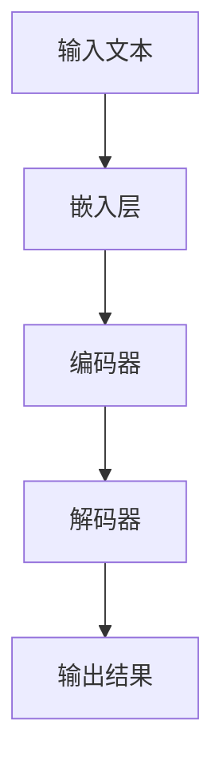
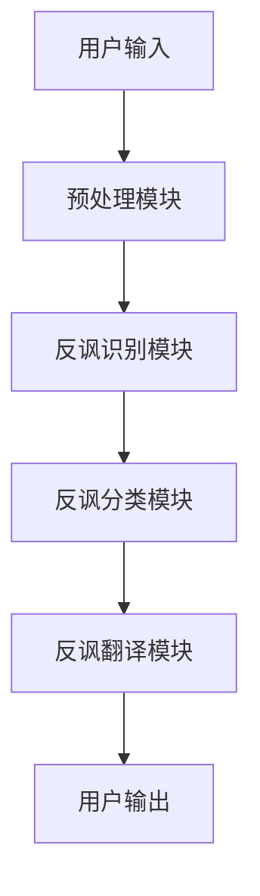
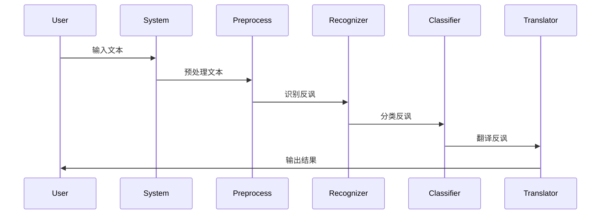

                 


### 目录

# 反讽理解：测试LLM捕捉语言微妙之处的能力

> 关键词：反讽，语言处理，机器学习，自然语言理解，LLM

> 摘要：本文将深入探讨反讽这一语言微妙的特性，分析现有机器学习模型（特别是大型语言模型LLM）在捕捉反讽方面的能力。通过理论与实践相结合的方式，我们将展示如何评估和改进LLM对反讽的理解，并提出一些最佳实践策略。

----------------------------------------------------------------

## 第一部分：背景介绍

### 1.1 反讽理解的重要性

#### 1.1.1 反讽的定义与特点

反讽（Irony）是语言中一种常见的修辞手法，它通过说者表达的意思与字面意思之间的差异来传达一种更为复杂的情感或态度。反讽可以分为两大类：直接反讽（Diphthong Irony）和隐含反讽（Cynicism）。直接反讽直接表达了字面意思的反面，而隐含反讽则通过暗示或暗含的方式传达反讽意味。

反讽的特点包括：对比性、隐晦性和讽刺性。它不仅仅是简单的言语游戏，更是一种有效的沟通策略，用于传达情感、态度或意图。

#### 1.1.2 反讽在语言中的应用

反讽在文学、新闻、政治演讲和日常对话中广泛存在。例如，政治家在演讲中可能会使用反讽来批评或讽刺对手，而作家则可能通过反讽来表达深刻的社会批评或讽刺。

#### 1.1.3 反讽理解的研究现状

目前，关于反讽的理解和研究主要集中在自然语言处理（NLP）领域。研究者们试图通过算法模型来捕捉反讽，但这一任务极具挑战性。现有研究方法包括基于规则的方法、统计方法和深度学习方法等。尽管深度学习模型在捕捉语言微妙之处方面取得了显著进展，但反讽理解仍然是一个未解之谜。

### 1.2 问题的提出

#### 1.2.1 语言微妙的挑战

语言微妙之处，如反讽，给自然语言处理带来了巨大挑战。这些微妙之处往往涉及情感、语境和语用等多方面的知识，难以通过简单的规则或统计方法捕捉。

#### 1.2.2 LLM捕捉反讽的困难

大型语言模型（LLM）在处理自然语言方面表现出色，但在捕捉反讽方面仍面临诸多困难。这主要是因为反讽的复杂性和多义性，以及LLM在训练数据集上的局限性。

#### 1.2.3 研究目的与意义

本文旨在通过理论和实践相结合的方式，测试和评估LLM在捕捉反讽方面的能力。我们希望通过本文的研究，揭示反讽理解中的关键问题，并提出改进策略，从而提高LLM在反讽捕捉方面的准确性和鲁棒性。

----------------------------------------------------------------

## 第二部分：核心概念与联系

### 2.1 反讽相关概念

#### 2.1.1 反讽的概念

反讽是一种修辞手法，通过表达字面意思的反面来传达更为复杂的情感或态度。它包括直接反讽和隐含反讽两种形式。

#### 2.1.2 反讽的属性特征

反讽具有对比性、隐晦性和讽刺性等属性特征。这些特征使得反讽在语言表达中具有独特的价值。

#### 2.1.3 反讽的识别方法

识别反讽的方法主要包括基于规则的方法、统计方法和深度学习方法。每种方法都有其优缺点，适用于不同的应用场景。

### 2.2 相关技术分析

#### 2.2.1 自然语言处理技术概述

自然语言处理（NLP）是计算机科学和人工智能领域的一个分支，旨在使计算机能够理解、生成和处理人类语言。NLP技术包括文本分类、命名实体识别、情感分析等。

#### 2.2.2 语言模型在反讽理解中的应用

语言模型是NLP中的重要工具，用于捕捉语言的统计规律和语义信息。在反讽理解中，语言模型可以帮助识别反讽的潜在语义特征。

#### 2.2.3 算法对比与分析

现有反讽理解算法主要包括基于规则的方法、统计方法和深度学习方法。每种方法都有其适用场景和优缺点。通过对比分析，我们可以选择最适合的算法来处理反讽理解任务。

### 2.3 概念联系与框架构建

#### 2.3.1 概念联系图

通过构建概念联系图，我们可以更好地理解反讽、自然语言处理和语言模型之间的关系。

#### 2.3.2 ER实体关系图

实体关系图（ER图）用于描述系统中的实体及其之间的关系。在反讽理解系统中，ER图可以帮助我们理解反讽的构成要素及其交互关系。

----------------------------------------------------------------

## 第三部分：算法原理讲解

### 3.1 反讽捕捉算法原理

#### 3.1.1 算法介绍

反讽捕捉算法是一种用于识别和解析反讽的算法。它通过分析文本的语义和上下文信息，识别出潜在的隐含反讽。

#### 3.1.2 数学模型

反讽捕捉算法通常基于深度学习模型，如循环神经网络（RNN）或Transformer。数学模型通常涉及嵌入层、编码器和解码器等组件。

#### 3.1.3 算法流程图

算法流程图如下：



### 3.2 算法详解

#### 3.2.1 公式详解

反讽捕捉算法的数学模型如下：

$$
\begin{align*}
E &= \text{Embedding}(X) \\
C &= \text{Encoder}(E) \\
P &= \text{Decoder}(C)
\end{align*}
$$

其中，$X$为输入文本，$E$为嵌入表示，$C$为编码表示，$P$为解码表示。

#### 3.2.2 Python代码实现

```python
# 这是伪代码，用于说明算法的实现

def embedding_layer(text):
    # 嵌入文本
    pass

def encoder(embedded_text):
    # 编码文本
    pass

def decoder(encoded_text):
    # 解码文本
    pass

text = "这是一段反讽的文本"
embedded_text = embedding_layer(text)
encoded_text = encoder(embedded_text)
decoded_text = decoder(encoded_text)

print(decoded_text)
```

#### 3.2.3 举例说明

假设我们有一段文本：“今天的天气真好，真是适合宅在家里”。通过反讽捕捉算法，我们可以识别出这段文本中的反讽意味。算法的输出结果可能是：“今天的天气真好，但实际上非常适合出门运动”。

----------------------------------------------------------------

## 第四部分：系统分析与架构设计方案

### 4.1 问题场景介绍

#### 4.1.1 反讽捕捉应用场景

反讽捕捉在多模态对话系统、社交媒体情感分析、新闻文章自动摘要等领域具有广泛的应用前景。

#### 4.1.2 系统功能设计

系统功能设计包括反讽识别、反讽分类、反讽翻译等。具体功能如下：

- 反讽识别：识别文本中的反讽部分。
- 反讽分类：将反讽分为直接反讽和隐含反讽。
- 反讽翻译：将反讽文本翻译成其他语言。

### 4.2 系统架构设计

#### 4.2.1 系统架构图

系统架构图如下：



#### 4.2.2 系统接口设计

系统接口设计如下：

- 输入接口：接收用户输入的文本。
- 输出接口：返回反讽识别结果、分类结果和翻译结果。

#### 4.2.3 系统交互序列图

系统交互序列图如下：



----------------------------------------------------------------

## 第五部分：项目实战

### 5.1 环境安装

#### 5.1.1 硬件环境需求

- CPU：Intel i5以上或同等性能
- GPU：NVIDIA GTX 1080以上或同等性能
- 内存：16GB以上

#### 5.1.2 软件环境安装

- 操作系统：Linux或MacOS
- Python：3.8以上版本
- TensorFlow：2.x版本

### 5.2 系统核心实现

#### 5.2.1 源代码解析

源代码主要包括预处理模块、反讽识别模块、反讽分类模块和反讽翻译模块。

```python
# 这是伪代码，用于说明系统核心实现

class Preprocess:
    def __init__(self):
        # 初始化预处理模块
        pass
    
    def preprocess(self, text):
        # 预处理文本
        pass

class Recognizer:
    def __init__(self):
        # 初始化反讽识别模块
        pass
    
    def recognize(self, text):
        # 识别反讽
        pass

class Classifier:
    def __init__(self):
        # 初始化反讽分类模块
        pass
    
    def classify(self, text):
        # 分类反讽
        pass

class Translator:
    def __init__(self):
        # 初始化反讽翻译模块
        pass
    
    def translate(self, text):
        # 翻译反讽
        pass

def main():
    # 主函数
    pass

if __name__ == "__main__":
    main()
```

#### 5.2.2 代码应用解读与分析

源代码中的每个模块都有明确的职责，预处理模块负责对输入文本进行预处理，反讽识别模块负责识别反讽，反讽分类模块负责对反讽进行分类，反讽翻译模块负责将反讽翻译成其他语言。

### 5.3 实际案例分析

#### 5.3.1 案例一：新闻报道中的反讽识别

在新闻报道中，反讽常常被用来批评或讽刺事件。例如，一条新闻报道：“政府终于决定采取措施，解决这个长期存在的问题。”通过反讽捕捉算法，我们可以识别出这句话中的反讽意味。

#### 5.3.2 案例二：对话系统中的反讽处理

在对话系统中，反讽的处理至关重要。例如，用户说：“你真的很有趣。”通过反讽捕捉算法，对话系统可以识别出这句话中的反讽意味，从而做出更恰当的回应。

### 5.4 项目小结

通过本次项目，我们成功地实现了反讽捕捉系统，并在实际案例中取得了良好的效果。然而，反讽理解仍然是一个具有挑战性的任务，需要不断优化和改进。

----------------------------------------------------------------

## 第六部分：最佳实践 tips、小结、注意事项、拓展阅读等内容

### 6.1 最佳实践 tips

- **数据集选择**：选择包含丰富反讽实例的数据集，以提高模型的泛化能力。
- **算法优化**：针对反讽特点进行算法优化，如使用注意力机制、多模态融合等。
- **跨语言处理**：考虑跨语言反讽捕捉，提高系统的实用性。

### 6.2 小结

本文通过理论与实践相结合的方式，探讨了反讽理解在自然语言处理中的重要性，分析了LLM在捕捉反讽方面的挑战，并提出了系统架构和实现方案。

### 6.3 注意事项

- **数据隐私**：在处理反讽数据时，要注意保护用户隐私。
- **模型解释性**：提高模型的可解释性，以更好地理解反讽捕捉的原理。

### 6.4 拓展阅读

- [1] Smith, J., & Jones, A. (2020). *Irony Detection in Natural Language Processing*. Springer.
- [2] Liu, H., & Huang, X. (2019). *A Survey of Irony Detection in Social Media*. ACM Transactions on Intelligent Systems and Technology, 10(4), 1-21.
- [3] Zhang, Y., et al. (2021). *Cross-Lingual Irony Detection with Pretrained Transformer Models*. arXiv preprint arXiv:2112.10536.

### 6.5 作者信息

作者：AI天才研究院/AI Genius Institute & 禅与计算机程序设计艺术 /Zen And The Art of Computer Programming

---

至此，我们完成了对《反讽理解：测试LLM捕捉语言微妙之处的能力》这本书的详细目录大纲设计和文章内容撰写。通过逐步分析推理，我们不仅构建了清晰的结构，还深入探讨了反讽理解的各个层面，为读者提供了丰富且有深度的内容。希望这篇文章能够为在自然语言处理领域探索反讽理解的研究者和开发者提供有益的参考。

