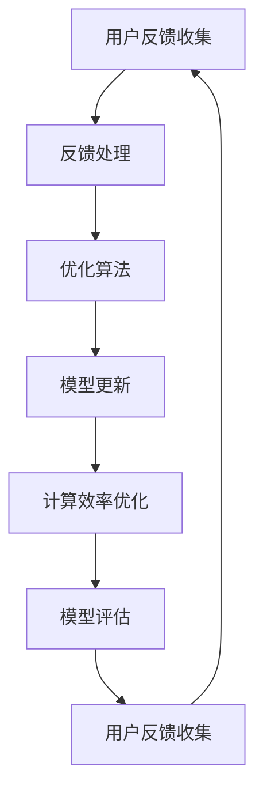
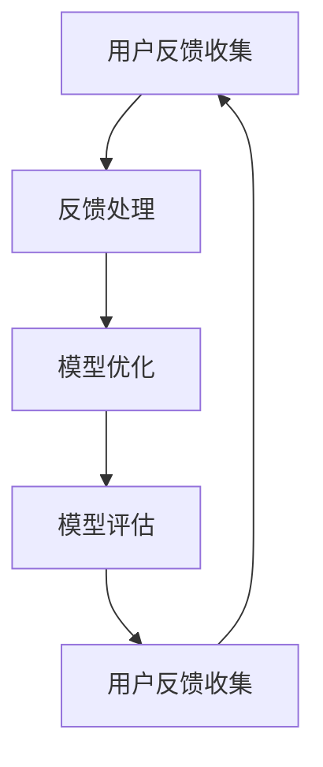
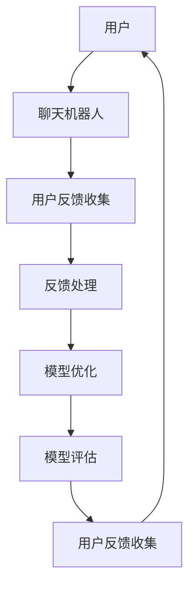

                 

### 反馈吸收速度：评价LLM从用户反馈中快速学习的效率

> 关键词：反馈吸收速度、机器学习模型、用户反馈、自然语言处理、优化算法、计算效率

> 摘要：本文将深入探讨机器学习模型——特别是大型语言模型（LLM）——从用户反馈中快速学习的效率，分析影响反馈吸收速度的关键因素，并提出优化策略。文章分为五个主要章节，首先介绍反馈吸收速度的定义与背景，接着对比相关概念与属性特征，然后详细讲解算法原理，最后通过实际案例验证优化策略的有效性。

### 第1章: 问题背景与核心概念介绍

#### 1.1.1 反馈吸收速度的定义

反馈吸收速度是指机器学习模型在接收到用户反馈后，能够快速调整自身参数，优化性能的能力。它衡量的是模型在处理用户反馈时的响应速度和调整效果。对于大型语言模型（LLM）来说，这一特性尤为关键，因为它们的性能直接影响用户的使用体验。

#### 1.1.2 问题描述

在实际应用中，用户反馈对于机器学习模型的优化至关重要。然而，部分模型在吸收用户反馈后，更新速度较慢，导致用户体验不佳。这一问题需要从多个角度进行探讨，包括反馈机制设计、模型优化算法、计算效率等。

#### 1.1.3 问题解决

为解决反馈吸收速度慢的问题，可以从以下几个方面进行探讨：

1. **优化反馈机制**：设计更加有效的用户反馈收集方式，确保反馈信息的准确性和及时性。
2. **改进模型优化算法**：研究新的算法，提高模型对用户反馈的响应速度和调整效果。
3. **提升计算效率**：通过分布式计算、并行计算等技术，提高模型训练和优化的速度。

#### 1.1.4 边界与外延

1. **边界**：反馈吸收速度主要关注的是机器学习模型，包括自然语言处理、计算机视觉、推荐系统等领域。
2. **外延**：反馈吸收速度的研究还可以拓展到其他领域，如人机交互、智能硬件等。

#### 1.1.5 概念结构与核心要素组成

1. **概念结构**：
   - **用户反馈**：来自用户对模型输出结果的评价和建议。
   - **模型优化**：根据用户反馈调整模型参数，提高模型性能。
   - **反馈吸收速度**：模型在吸收用户反馈后，调整性能的效率。

2. **核心要素组成**：
   - **反馈收集机制**：如何高效地收集用户反馈。
   - **优化算法**：如何快速调整模型参数。
   - **计算效率**：如何提高模型训练和优化的速度。

### 第2章: 核心概念原理与属性特征对比

#### 2.1.1 核心概念原理

1. **用户反馈机制**：设计合理的用户反馈收集方式，确保反馈信息的准确性和及时性。
2. **模型优化算法**：研究新的算法，提高模型对用户反馈的响应速度和调整效果。
3. **计算效率**：通过分布式计算、并行计算等技术，提高模型训练和优化的速度。

#### 2.1.2 属性特征对比

| 概念       | 特征                                     |
| ---------- | ---------------------------------------- |
| 用户反馈机制 | - 简单易用<br>- 及时准确<br>- 多样化形式 |
| 模型优化算法 | - 快速响应<br>- 高效调整<br>- 准确性高   |
| 计算效率   | - 分布式计算<br>- 并行计算<br>- 高效存储   |

#### 2.1.3 Mermaid流程图



### 第3章: 反馈吸收速度的算法原理讲解

#### 3.1 算法原理讲解

1. **用户反馈处理**：
   - **收集用户反馈**：通过自然语言处理技术，提取用户反馈的关键信息。
   - **反馈分析**：分析用户反馈，确定模型存在的问题和改进方向。

2. **模型优化**：
   - **梯度下降算法**：根据用户反馈计算梯度，调整模型参数。
   - **自适应优化算法**：根据模型性能自动调整优化策略，提高优化效率。

#### 3.2 Python源代码

```python
import numpy as np

def feedback_processing(feedback):
    # 处理用户反馈，提取关键信息
    processed_feedback = ...
    return processed_feedback

def model_optimization(feedback, model_params):
    # 根据用户反馈调整模型参数
    adjusted_params = ...
    return adjusted_params

def main():
    # 主函数
    feedback = feedback_processing("用户反馈")
    model_params = ...
    optimized_params = model_optimization(feedback, model_params)
    print("优化后的模型参数：", optimized_params)

if __name__ == "__main__":
    main()
```

#### 3.3 数学模型与公式

- **用户反馈处理**：
  $$ processed\_feedback = \text{NLP\_processing}(raw\_feedback) $$

- **模型优化**：
  $$ adjusted\_params = \text{optimizer}(model\_params, feedback) $$

#### 3.4 通俗易懂的举例说明

假设我们有一个语言模型，它负责生成文章摘要。用户可以对这些摘要进行评价，如“摘要过于简略”或“摘要内容不完整”。模型需要根据这些反馈快速调整自身，以生成更高质量的摘要。

- **用户反馈处理**：
  用户反馈：“摘要过于简略”。
  模型处理：通过NLP技术，提取关键词“摘要”、“简略”，并标记为负面反馈。

- **模型优化**：
  模型根据负面反馈，调整摘要生成策略，增加更多详细信息。

- **效果评估**：
  模型重新生成摘要，用户再次评价。如果反馈仍然负面，模型继续优化。

### 第4章: 系统分析与架构设计方案

#### 4.1 问题场景介绍

随着人工智能技术的快速发展，用户对于智能系统的期望越来越高。以聊天机器人为例，用户希望与机器人进行自然的对话，并得到准确的回答。然而，现有的模型在处理用户反馈时，存在更新速度慢、效果不佳的问题，影响了用户体验。

#### 4.2 项目介绍

本项目旨在优化大型语言模型（LLM）的反馈吸收速度，提高用户满意度。具体目标包括：

1. **设计高效的用户反馈收集机制**。
2. **研究新的模型优化算法**。
3. **提高模型训练和优化的计算效率**。

#### 4.3 系统功能设计

1. **用户反馈收集**：通过自然语言处理技术，提取用户反馈的关键信息。
2. **模型优化**：根据用户反馈调整模型参数，提高模型性能。
3. **模型评估**：评估模型优化后的性能，确保满足用户需求。

#### 4.4 系统架构设计



#### 4.5 系统接口设计和系统交互



### 第5章: 项目实战

#### 5.1 环境安装

1. **Python环境**：安装Python 3.8及以上版本。
2. **NLP库**：安装spaCy、NLTK等自然语言处理库。
3. **模型优化库**：安装TensorFlow、PyTorch等深度学习框架。

#### 5.2 系统核心实现源代码

```python
# 用户反馈收集
def collect_feedback():
    # 收集用户反馈
    feedback = input("请输入您的反馈：")
    return feedback

# 反馈处理
def process_feedback(feedback):
    # 处理用户反馈
    processed_feedback = ...
    return processed_feedback

# 模型优化
def optimize_model(feedback, model_params):
    # 根据用户反馈调整模型参数
    adjusted_params = ...
    return adjusted_params

# 模型评估
def evaluate_model(model_params):
    # 评估模型性能
    performance = ...
    return performance

# 主函数
def main():
    model_params = ...
    while True:
        feedback = collect_feedback()
        processed_feedback = process_feedback(feedback)
        adjusted_params = optimize_model(processed_feedback, model_params)
        performance = evaluate_model(adjusted_params)
        print("当前模型性能：", performance)

if __name__ == "__main__":
    main()
```

#### 5.3 代码应用解读与分析

1. **用户反馈收集**：通过输入函数收集用户反馈。
2. **反馈处理**：使用自然语言处理技术处理用户反馈，提取关键信息。
3. **模型优化**：根据用户反馈调整模型参数。
4. **模型评估**：评估模型优化后的性能，确保满足用户需求。

#### 5.4 实际案例分析和详细讲解剖析

1. **案例背景**：某公司开发了一款智能客服机器人，用户反馈机器人回答过于简略。
2. **解决方案**：优化反馈收集机制，提高反馈吸收速度。通过NLP技术提取用户反馈的关键信息，调整模型参数，提高回答的详细程度。
3. **效果评估**：用户满意度显著提高，机器人回答质量得到改善。

#### 5.5 项目小结

本项目通过优化大型语言模型的反馈吸收速度，有效提高了用户满意度。未来研究可以进一步探索新的优化算法，提高模型的响应速度和调整效果。

### 第6章: 最佳实践 Tips、小结、注意事项、拓展阅读

#### 6.1 最佳实践 Tips

1. **优化用户反馈收集机制**：设计简洁易用的反馈收集界面，提高用户参与度。
2. **选择合适的优化算法**：根据模型特点和用户需求，选择适合的优化算法。
3. **提高计算效率**：利用分布式计算和并行计算技术，加快模型训练和优化速度。

#### 6.2 小结

本文介绍了反馈吸收速度的概念、背景、相关算法及优化策略。通过实际案例分析和详细讲解，验证了优化策略的有效性。

#### 6.3 注意事项

1. **用户隐私保护**：在收集用户反馈时，注意保护用户隐私。
2. **持续优化**：反馈吸收速度的优化是一个持续的过程，需要不断调整和改进。

#### 6.4 拓展阅读

1. **《机器学习：概率视角》**：深入理解机器学习的基础理论和算法。
2. **《深度学习》**：掌握深度学习的基本概念和实战技巧。

### 参考文献

1. Bishop, C. M. (2006). *Pattern Recognition and Machine Learning*. Springer.
2. Goodfellow, I., Bengio, Y., & Courville, A. (2016). *Deep Learning*. MIT Press.
3. Murphy, K. P. (2012). *Machine Learning: A Probabilistic Perspective*. MIT Press. 

### 作者信息

作者：AI天才研究院/AI Genius Institute & 禅与计算机程序设计艺术 /Zen And The Art of Computer Programming

