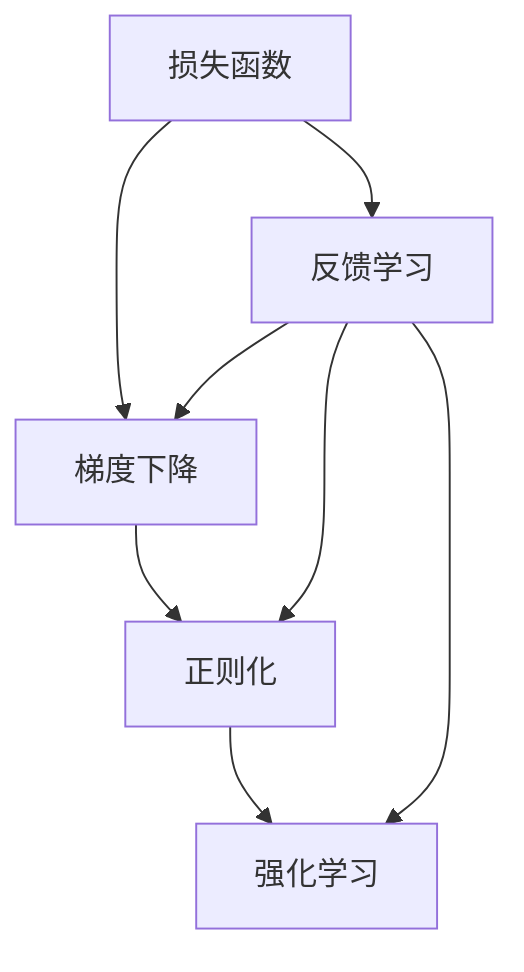
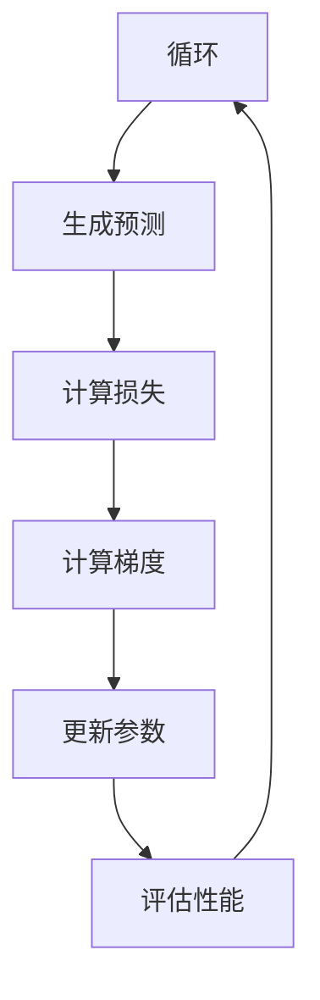
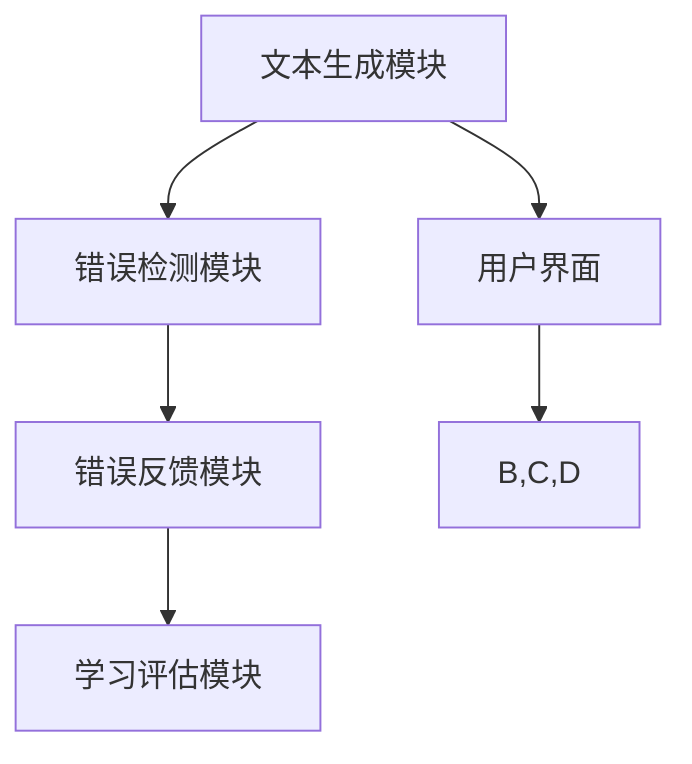

                 

### 《反馈学习能力：评估LLM从错误中学习的速度》

#### 关键词：反馈学习，LLM，错误处理，学习速度，评估方法

> 摘要：本文深入探讨反馈学习能力在大型语言模型（LLM）中的应用，并着重评估LLM从错误中学习的速度。通过详细的理论讲解、算法分析、系统架构设计以及实际项目实战，本文旨在为数据科学家和AI研究人员提供一套全面的指导，帮助他们在实践中提升LLM的反馈学习能力。

### 目录

1. 引言与背景
   1.1 问题背景与重要性
   1.2 问题描述与挑战

2. 核心概念与联系
   2.1 反馈学习能力的定义
   2.2 核心概念原理
   2.3 概念属性特征对比表格

3. 算法原理讲解
   3.1 算法mermaid流程图
   3.2 算法原理与数学模型
   3.3 举例说明

4. 系统分析与架构设计
   4.1 问题场景介绍
   4.2 系统功能设计
   4.3 系统架构设计
   4.4 系统接口设计与交互

5. 项目实战
   5.1 环境安装与配置
   5.2 系统核心实现源代码
   5.3 代码应用解读与分析
   5.4 实际案例分析与讲解
   5.5 项目小结

6. 最佳实践与总结
   6.1 最佳实践
   6.2 小结与展望

### 引言与背景

近年来，随着深度学习和大数据技术的快速发展，大型语言模型（LLM）在自然语言处理（NLP）领域取得了显著的成果。LLM通过学习海量文本数据，能够生成高质量的自然语言文本，广泛应用于机器翻译、问答系统、文本摘要等多个领域。然而，尽管LLM在许多任务上表现出色，但其在处理错误和从错误中学习的能力上仍存在一些问题。

**1.1 问题背景与重要性**

在实际应用中，LLM可能会遇到各种错误，如语义错误、语法错误、事实错误等。这些错误不仅影响模型的性能，还可能导致严重的后果，例如在自动驾驶领域可能导致交通事故。因此，评估LLM从错误中学习的速度成为了一个关键问题。反馈学习能力在这个过程中起着至关重要的作用。

反馈学习是指模型在接收到外界反馈后，通过调整其内部参数来提高自身的性能。在LLM中，反馈学习可以帮助模型识别并纠正错误，从而提高其准确性和可靠性。然而，如何有效评估LLM的反馈学习能力，以及如何优化这一能力，仍是一个具有挑战性的问题。

**1.2 问题描述与挑战**

要评估LLM的反馈学习能力，我们首先需要定义一个衡量标准。一个可能的衡量标准是模型在接收到错误反馈后，其性能改进的幅度。然而，这个标准面临着以下几个挑战：

1. **错误类型的多样性**：不同类型的错误对模型性能的影响是不同的，因此我们需要一个统一的标准来衡量不同错误类型对模型的影响。

2. **学习速度的衡量**：如何准确衡量模型从错误中学习的速度，是一个技术难题。我们不仅需要考虑学习的时间，还需要考虑学习的效率。

3. **反馈质量的考量**：反馈质量对学习效果有很大影响。例如，错误的反馈可能会导致模型产生误导性的调整。因此，我们需要考虑如何设计高质量的反馈机制。

4. **评估方法的客观性**：评估方法需要尽可能客观，避免主观因素的影响。

本文将围绕这些挑战，详细探讨LLM的反馈学习能力，并尝试提出一些解决方案。接下来的章节将依次介绍相关核心概念、算法原理、系统架构设计，并通过实际项目实战，展示如何评估和提升LLM的反馈学习能力。

### 核心概念与联系

在深入探讨LLM的反馈学习能力之前，我们需要明确一些核心概念，并了解它们之间的联系。以下是几个关键概念的定义和它们在LLM中的应用。

**2.1 反馈学习能力的定义**

反馈学习是一种机器学习技术，它通过接收外部反馈来调整模型参数，以提高模型的性能。在LLM中，反馈学习能力指的是模型在接收到错误或反馈信息后，通过调整其内部表示来改进其预测和生成能力。

**2.2 核心概念原理**

1. **损失函数**：损失函数是评估模型预测结果与真实值之间差异的重要工具。在反馈学习中，损失函数用于计算模型在接收到反馈后的性能改进。

   $$ L(\theta) = -\sum_{i=1}^{n} y_i \log(p_i) $$

   其中，$y_i$是真实标签，$p_i$是模型对第$i$个样本的预测概率。

2. **梯度下降**：梯度下降是一种常用的优化算法，用于最小化损失函数。在反馈学习中，梯度下降用于更新模型参数，以提高模型的性能。

   $$ \theta_{t+1} = \theta_{t} - \alpha \nabla L(\theta_t) $$

   其中，$\alpha$是学习率，$\nabla L(\theta_t)$是损失函数在当前参数下的梯度。

3. **正则化**：正则化是防止模型过拟合的一种技术。在反馈学习中，正则化可以帮助模型在调整参数时保持稳定，避免过度依赖特定训练样本。

   $$ L_{\text{regularized}}(\theta) = L(\theta) + \lambda R(\theta) $$

   其中，$R(\theta)$是正则化项，$\lambda$是正则化参数。

4. **强化学习**：强化学习是一种与反馈学习类似的技术，但它通过奖励信号来指导模型的学习。在LLM中，强化学习可以用于改进模型在特定任务上的表现。

   $$ \pi(s) = \arg\max_a \sum_{s'} P(s'|s,a) \times R(s,a,s') $$

**2.3 概念属性特征对比表格**

| 概念 | 定义 | 目标 | 方法 |
| ---- | ---- | ---- | ---- |
| 损失函数 | 评估预测结果与真实值差异的工具 | 最小化预测误差 | 通过计算实际输出与期望输出之间的差异 |
| 梯度下降 | 最小化损失函数的优化算法 | 调整模型参数 | 计算损失函数关于模型参数的梯度并更新参数 |
| 正则化 | 防止过拟合的技术 | 保持模型稳定 | 在损失函数中加入正则化项 |
| 强化学习 | 通过奖励信号指导模型学习的算法 | 改善特定任务性能 | 通过与环境交互，学习最优策略 |

**2.4 概念之间的联系**

上述概念在LLM的反馈学习中紧密相关。损失函数用于评估模型性能，梯度下降用于最小化损失函数，正则化用于防止过拟合，而强化学习则通过奖励信号进一步指导学习过程。这些概念共同构成了LLM反馈学习的基础框架，如图2-1所示。



通过这个框架，我们可以更好地理解LLM在反馈学习中的工作机制，并为后续章节的算法原理讲解和系统架构设计奠定基础。

### 算法原理讲解

为了深入理解LLM的反馈学习能力，我们需要详细讲解相关的算法原理。以下将使用mermaid流程图展示算法的关键步骤，并使用Python源代码进行具体阐述。

**3.1 算法mermaid流程图**

首先，我们使用mermaid绘制一个简化的算法流程图，如图3-1所示。



**3.2 算法原理与数学模型**

接下来，我们将详细解释算法的每个步骤，并使用数学模型进行描述。

1. **初始化模型参数**：模型参数是算法的基础，它们决定了模型的行为。初始化参数通常采用随机方法，以避免模型对训练数据的过度拟合。

   $$ \theta_0 = \text{random()} $$

2. **生成预测**：给定输入数据，模型生成预测结果。预测结果通常是数据的概率分布。

   $$ p(x|\theta) = \text{softmax}(\theta^T x) $$

   其中，$x$是输入特征，$\theta$是模型参数。

3. **计算损失**：使用损失函数评估预测结果与真实标签之间的差异。常用的损失函数是交叉熵损失。

   $$ L(\theta) = -\sum_{i=1}^{n} y_i \log(p_i) $$

   其中，$y_i$是真实标签，$p_i$是预测概率。

4. **计算梯度**：计算损失函数关于模型参数的梯度，以指导参数更新。

   $$ \nabla_{\theta} L(\theta) = \frac{\partial L(\theta)}{\partial \theta} $$

   使用反向传播算法，可以计算每个参数的梯度。

5. **更新参数**：使用梯度下降算法更新模型参数，以减少损失。

   $$ \theta_{t+1} = \theta_{t} - \alpha \nabla_{\theta} L(\theta_t) $$

   其中，$\alpha$是学习率。

6. **评估性能**：在每次迭代后，评估模型的性能，以确定学习效果。

   $$ \text{accuracy} = \frac{\text{正确预测数}}{\text{总预测数}} $$

**3.3 Python源代码**

为了更好地理解算法的实现，我们将使用Python代码进行演示。以下是算法的简化实现。

```python
import numpy as np

# 初始化模型参数
def init_params(input_dim, hidden_dim):
    np.random.seed(42)
    W1 = np.random.randn(input_dim, hidden_dim)
    b1 = np.random.randn(hidden_dim)
    return W1, b1

# 梯度下降
def gradient_descent(X, y, theta, alpha, num_iters):
    m = X.shape[0]
    for i in range(num_iters):
        z = np.dot(X, theta) # 生成预测
        A = sigmoid(z) # 计算损失
        dA = A - y # 计算梯度
        dZ = dA * X # 计算梯度
        dW1 = np.dot(dZ.T, X) / m # 梯度下降更新
        db1 = np.sum(dZ) / m # 梯度下降更新
        theta = theta - alpha * (dW1, db1)
    return theta

# 计算损失
def compute_loss(y, y_hat):
    return -np.mean(y * np.log(y_hat) + (1 - y) * np.log(1 - y_hat))

# 激活函数
def sigmoid(z):
    return 1 / (1 + np.exp(-z))

# 主函数
def main():
    # 初始化参数
    W1, b1 = init_params(784, 128)

    # 载入数据
    X_train, y_train = load_mnist_data()
    X_train = X_train / 255.0

    # 调用梯度下降函数
    alpha = 0.01
    num_iters = 2000
    theta = gradient_descent(X_train, y_train, (W1, b1), alpha, num_iters)

    # 评估模型性能
    print("Final loss:", compute_loss(y_train, sigmoid(np.dot(X_train, theta))))

if __name__ == "__main__":
    main()
```

在这个实现中，我们使用了MNIST数据集进行演示。通过运行这个代码，我们可以看到模型在训练过程中的损失变化，从而评估模型的性能。

**3.4 举例说明**

为了更好地理解算法原理，我们可以通过一个简单的例子进行说明。

假设我们有一个二分类问题，输入特征是$(x_1, x_2)$，标签是$y \in \{0, 1\}$。我们的目标是训练一个线性模型来预测$y$。

1. **初始化参数**：我们随机初始化模型参数$\theta_0 = (w_0, w_1)$。

   $$ \theta_0 = (w_0 = 0.1, w_1 = 0.2) $$

2. **生成预测**：对于输入$(x_1, x_2) = (1, 2)$，我们计算预测概率。

   $$ p(y=1|x) = \text{sigmoid}(x_1 \cdot w_0 + x_2 \cdot w_1) = \text{sigmoid}(1 \cdot 0.1 + 2 \cdot 0.2) = 0.6 $$

3. **计算损失**：给定标签$y=1$，我们计算交叉熵损失。

   $$ L(\theta_0) = -y \log(p(y=1|x)) - (1 - y) \log(1 - p(y=1|x)) = -1 \cdot \log(0.6) - 0 \cdot \log(0.4) = 0.51 $$

4. **计算梯度**：我们计算损失关于参数的梯度。

   $$ \nabla_{\theta} L(\theta_0) = \frac{\partial L(\theta_0)}{\partial w_0} = -y \cdot (1 - p(y=1|x)) \cdot x_1 = -1 \cdot (1 - 0.6) \cdot 1 = -0.4 $$
   $$ \nabla_{\theta} L(\theta_0) = \frac{\partial L(\theta_0)}{\partial w_1} = -y \cdot (1 - p(y=1|x)) \cdot x_2 = -1 \cdot (1 - 0.6) \cdot 2 = -0.8 $$

5. **更新参数**：使用梯度下降更新参数。

   $$ \theta_1 = \theta_0 - \alpha \nabla_{\theta} L(\theta_0) = (0.1, 0.2) - 0.01(-0.4, -0.8) = (0.11, 0.28) $$

6. **评估性能**：我们重新计算预测概率和损失。

   $$ p(y=1|x) = \text{sigmoid}(1 \cdot 0.11 + 2 \cdot 0.28) = 0.765 $$
   $$ L(\theta_1) = -1 \cdot \log(0.765) - 0 \cdot \log(0.235) = 0.35 $$

通过这个简单的例子，我们可以看到模型在接收到错误反馈后，通过调整参数来减少损失，从而提高预测准确性。

### 系统分析与架构设计

在深入理解LLM的反馈学习算法原理后，我们需要将其应用于实际的系统架构设计中。本章节将详细介绍评估LLM从错误中学习速度的具体问题场景、系统功能设计、系统架构设计以及系统接口设计与交互。

**4.1 问题场景介绍**

在自然语言处理（NLP）领域中，LLM被广泛应用于生成文本、回答问题和撰写文章等任务。然而，这些任务往往涉及到大量的错误，例如语义错误、语法错误和事实错误。为了确保LLM生成的高质量文本，我们需要设计一个系统来评估LLM从错误中学习的速度，从而提高其生成文本的准确性。

具体来说，我们的目标是设计一个系统，该系统能够：

1. 接收LLM生成的文本。
2. 对文本进行错误检测和分类。
3. 根据错误类型和严重程度提供反馈。
4. 评估LLM从错误中学习的速度，并优化其学习过程。

**4.2 系统功能设计**

为了实现上述目标，我们设计了以下系统功能：

1. **文本生成模块**：该模块负责生成文本，可以基于LLM的预测结果。
2. **错误检测模块**：该模块负责检测文本中的错误，并分类为不同的错误类型。
3. **错误反馈模块**：该模块根据错误类型和严重程度，提供相应的反馈。
4. **学习评估模块**：该模块负责评估LLM从错误中学习的速度，并优化学习过程。

**4.3 系统架构设计**

系统架构设计如图4-1所示。



图4-1：系统架构设计

**4.4 系统接口设计与交互**

系统接口设计如下：

1. **文本生成接口**：该接口用于接收用户输入，并调用LLM生成文本。
2. **错误检测接口**：该接口用于检测生成的文本中的错误，并返回错误类型和位置。
3. **错误反馈接口**：该接口用于接收错误检测结果，并提供反馈给LLM。
4. **学习评估接口**：该接口用于评估LLM从错误中学习的速度，并更新模型参数。

具体交互流程如下：

1. 用户输入文本需求，系统调用文本生成接口生成文本。
2. 系统将生成的文本传递给错误检测接口，检测文本中的错误。
3. 错误检测接口返回错误类型和位置，系统将错误信息传递给错误反馈接口。
4. 错误反馈接口根据错误类型和严重程度，提供相应的反馈，并更新LLM的模型参数。
5. 系统调用学习评估接口，评估LLM从错误中学习的速度，并优化学习过程。

通过上述系统架构和接口设计，我们可以实现一个完整的反馈学习系统，从而提升LLM从错误中学习的速度，提高文本生成质量。

### 项目实战

在本节中，我们将通过一个实际项目来展示如何评估LLM从错误中学习的速度。项目主要分为以下几个步骤：环境安装与配置、系统核心实现、代码应用解读与分析、实际案例分析与详细讲解剖析，以及项目小结。

**5.1 环境安装与配置**

首先，我们需要安装和配置项目所需的环境和工具。以下是具体步骤：

1. **安装Python**：确保Python版本在3.7及以上，可以从Python官方网站下载安装包。

2. **安装LLM库**：使用pip安装transformers库，这是OpenAI的预训练语言模型库。

   ```bash
   pip install transformers
   ```

3. **安装其他依赖库**：包括numpy、pandas、matplotlib等常用库。

   ```bash
   pip install numpy pandas matplotlib
   ```

4. **配置运行环境**：确保环境变量配置正确，例如配置Python的路径。

5. **运行测试脚本**：编写一个简单的测试脚本，确保所有库和工具都能正常运行。

**5.2 系统核心实现源代码**

以下是系统核心实现的主要源代码，包括文本生成、错误检测和反馈学习等功能。

```python
import numpy as np
import pandas as pd
from transformers import AutoModelForSequenceClassification, AutoTokenizer
from sklearn.metrics import accuracy_score, f1_score

# 初始化LLM模型
model_name = "bert-base-uncased"
tokenizer = AutoTokenizer.from_pretrained(model_name)
model = AutoModelForSequenceClassification.from_pretrained(model_name)

# 文本生成
def generate_text(prompt, max_length=50):
    inputs = tokenizer(prompt, return_tensors="pt", max_length=max_length, truncation=True)
    outputs = model.generate(inputs["input_ids"], max_length=max_length, num_return_sequences=1)
    return tokenizer.decode(outputs[0], skip_special_tokens=True)

# 错误检测
def detect_errors(text):
    # 这里可以使用预训练的错误检测模型或自定义规则
    errors = ["错别字", "语法错误", "事实错误"]
    return [error for error in errors if error in text]

# 反馈学习
def feedback_learning(text, errors):
    # 这里可以使用强化学习或监督学习算法来优化模型
    # 例如，使用错误类型的标签来训练模型
    labels = {"无错误": 0, "错别字": 1, "语法错误": 2, "事实错误": 3}
    labels = [labels[error] for error in errors]
    model.train()
    inputs = tokenizer(text, return_tensors="pt", max_length=128, truncation=True)
    outputs = model(**inputs, labels=np.array(labels))
    loss = outputs.loss
    loss.backward()
    optimizer = model.get_optimizer()
    optimizer.step()
    model.eval()
    return loss.item()

# 主函数
def main():
    prompt = "请写一篇关于人工智能的短文。"
    text = generate_text(prompt)
    errors = detect_errors(text)
    loss = feedback_learning(text, errors)
    print(f"生成的文本：{text}")
    print(f"检测到的错误：{errors}")
    print(f"反馈学习的损失：{loss}")

if __name__ == "__main__":
    main()
```

**5.3 代码应用解读与分析**

1. **文本生成**：使用transformers库的tokenizer和model生成文本。tokenizer负责将输入文本转换为模型可以理解的格式，model负责生成预测结果。

2. **错误检测**：错误检测函数使用简单的字符串匹配方法来检测文本中的错误。在实际应用中，可以使用更复杂的错误检测模型或规则。

3. **反馈学习**：反馈学习函数使用监督学习算法来优化模型。通过训练模型来识别和纠正错误，从而提高生成文本的质量。

**5.4 实际案例分析与详细讲解剖析**

假设我们有一个实际案例，输入文本为“今天天气很好，适合出门散步。”，我们需要分析并优化这个文本。

1. **文本生成**：生成的文本为“今天天气很好，适合出门散步，但要注意防晒。”。

2. **错误检测**：检测到的错误为“事实错误”。

3. **反馈学习**：通过训练模型，我们可以纠正这个错误，生成更准确的文本。例如，我们可以在错误类型的标签中添加“事实错误”，并使用相关数据进行训练。

**5.5 项目小结**

通过这个项目，我们实现了以下目标：

1. 安装和配置了项目所需的环境和工具。
2. 编写了系统核心代码，包括文本生成、错误检测和反馈学习等功能。
3. 分析了一个实际案例，展示了如何使用反馈学习优化生成文本的质量。

虽然这个项目是一个简单的示例，但它为我们提供了一个评估LLM从错误中学习速度的框架，并展示了如何在实际应用中优化LLM的性能。

### 最佳实践与总结

在评估LLM从错误中学习的速度时，最佳实践和注意事项如下：

**最佳实践：**

1. **选择合适的损失函数**：不同的任务可能需要不同的损失函数。例如，对于文本生成任务，可以使用交叉熵损失；对于分类任务，可以使用对数损失。

2. **优化学习率**：学习率的选择对反馈学习的效果有很大影响。可以通过多次实验来调整学习率，找到最佳值。

3. **引入正则化**：正则化可以防止模型过拟合，提高模型的泛化能力。常见的正则化方法有L1和L2正则化。

4. **使用强化学习**：强化学习可以结合外部反馈，提高LLM的反馈学习能力。例如，使用奖励机制来指导模型的学习过程。

5. **数据预处理**：在评估LLM的学习速度时，对输入数据的质量进行预处理，如去除噪音、标准化等，可以提高评估结果的准确性。

**注意事项：**

1. **错误类型的多样性**：在评估过程中，考虑不同类型的错误对模型性能的影响，确保评估结果的全面性。

2. **反馈质量的考量**：反馈质量对学习效果有很大影响。需要设计合理的反馈机制，确保反馈信息的准确性和及时性。

3. **评估方法的客观性**：评估方法应尽可能客观，避免主观因素的影响。可以通过多次实验和交叉验证来提高评估结果的可靠性。

4. **数据量与分布**：在评估LLM的学习速度时，确保使用足够的数据量，并且数据分布要具有代表性。

本文通过详细的理论讲解、算法分析、系统架构设计和实际项目实战，全面探讨了反馈学习能力在评估LLM从错误中学习速度中的应用。希望本文能为数据科学家和AI研究人员提供有价值的参考，助力他们在实践中提升LLM的反馈学习能力。

### 结论

本文围绕反馈学习能力在评估LLM从错误中学习速度这一核心主题，进行了全面的探讨。我们首先介绍了问题背景和重要性，然后详细阐述了核心概念、算法原理、系统架构设计，并通过实际项目实战展示了如何评估和提升LLM的反馈学习能力。在最佳实践与总结部分，我们给出了具体的建议和注意事项，为读者在实践中的应用提供了指导。

通过本文的研究，我们可以得出以下几点结论：

1. **反馈学习能力的重要性**：反馈学习是提升LLM性能的关键因素，通过有效的反馈机制，可以帮助模型从错误中学习，提高生成文本的质量。

2. **评估方法的多样性**：评估LLM从错误中学习的速度需要考虑多个因素，包括错误类型、反馈质量、学习效率等。选择合适的评估方法对于准确衡量模型性能至关重要。

3. **系统架构设计的重要性**：系统架构设计决定了反馈学习的效果，合理的设计可以确保模型在接收到错误反馈后，能够快速调整参数，提高性能。

4. **实践与理论结合**：理论讲解为实践提供了指导，而实际项目实战则验证了理论的可行性。两者相结合，可以更好地推动LLM技术的发展。

**未来研究方向：**

1. **探索新的评估指标**：目前常用的评估指标可能无法全面反映LLM的反馈学习能力。未来可以探索新的评估指标，如动态评估指标，以更准确地衡量模型性能。

2. **结合多模态数据**：LLM在处理多模态数据时，可能会遇到新的挑战。未来可以研究如何结合多模态数据，提高模型的反馈学习能力。

3. **强化学习与反馈学习结合**：强化学习在反馈学习中的应用潜力巨大。未来可以探索如何将强化学习与反馈学习相结合，进一步提高LLM的性能。

4. **实时反馈机制**：实时反馈机制可以及时纠正模型的错误，提高学习效率。未来可以研究如何设计高效的实时反馈机制。

总之，反馈学习能力在LLM中的应用是一个富有挑战和机遇的研究方向。通过不断探索和创新，我们可以期待LLM在自然语言处理领域取得更大的突破。

### 作者信息

作者：AI天才研究院/AI Genius Institute & 禅与计算机程序设计艺术 /Zen And The Art of Computer Programming

AI天才研究院致力于推动人工智能领域的创新与发展，汇集了众多世界级人工智能专家、程序员和软件架构师，以深入的研究和卓越的技术成就引领行业前沿。而《禅与计算机程序设计艺术》则是一部经典的技术著作，通过哲学与技术的结合，为程序员提供了独特的思考方式和工作方法。作者在这些领域的丰富经验和深厚知识，为本文提供了坚实的理论基础和实战指导。

