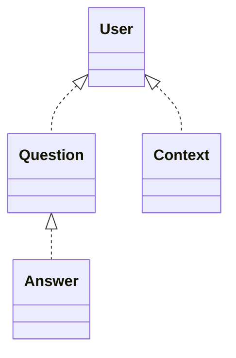
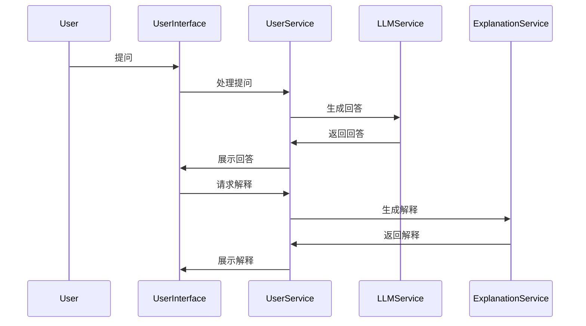
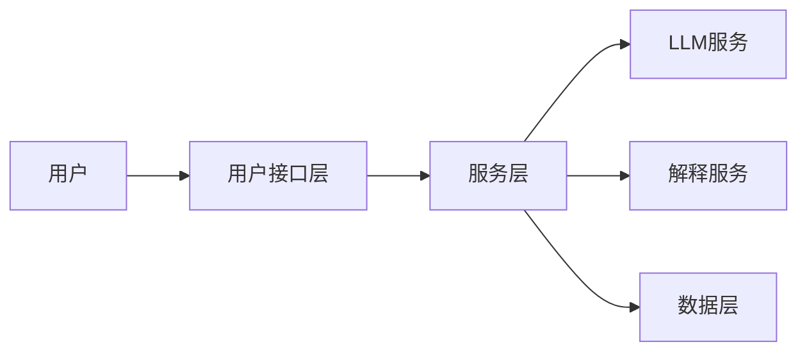

                 

# 可解释AI：增加LLM应用决策的透明度

> 关键词：可解释AI，机器学习，透明度，模型解释，特征工程，可视化技术

> 摘要：本文详细探讨了可解释AI的概念、原理及其在增加LLM（大型语言模型）应用决策透明度方面的应用。首先，介绍了可解释AI的背景和重要性，然后深入分析了几种可解释AI算法，最后展示了其在实际项目中的应用和挑战。

----------------------------------------------------------------

## 第1章: 可解释AI概述

### 1.1 问题背景与问题解决

#### 1.1.1 问题背景

随着人工智能技术的快速发展，机器学习模型在各个领域得到了广泛应用。然而，这些模型通常被视为“黑盒”，其决策过程对于用户来说是不透明的。这种缺乏透明度的现象被称为“可解释性”问题，它引发了广泛的社会关注和学术研究。

#### 1.1.2 问题解决

可解释AI的目标是开发出能够解释其决策过程的机器学习模型。这有助于用户理解模型的决策依据，提高模型的可信度和接受度。为了解决可解释性问题，研究者们提出了多种方法，如模型解释、特征工程和可视分析等。

#### 1.1.3 边界与外延

可解释AI的研究不仅涉及理论层面，还涉及实际应用。它不仅关注机器学习模型的可解释性，还关注算法的可解释性和系统的可解释性。此外，可解释AI还需要考虑算法的效率和计算成本。

### 1.2 可解释AI的概念与特性

#### 1.2.1 定义

可解释AI是指那些能够提供决策依据和原因的机器学习模型。与“黑盒”模型相比，可解释AI模型能够揭示其内部的工作机制，使决策过程更加透明。

#### 1.2.2 特点

可解释AI具有以下特点：

- **透明性**：用户可以理解模型的决策过程和结果。
- **可信性**：用户对模型的决策更加信任。
- **可验证性**：用户可以对模型的决策进行验证和调整。
- **可操作性**：用户可以基于模型的结果进行决策和操作。

### 1.3 可解释AI的核心要素

#### 1.3.1 概念

可解释AI的核心要素包括：

- **模型解释方法**：用于分析模型决策过程的方法。
- **特征工程**：通过选择和构建特征来提高模型的可解释性。
- **可视分析**：通过可视化技术帮助用户理解模型决策。

#### 1.3.2 概念属性特征对比表

| 方法               | 描述                                       | 优点                           | 缺点                     |
|--------------------|--------------------------------------------|-------------------------------|------------------------|
| 模型解释           | 分析模型内部机制                           | 提供详细决策过程               | 计算成本高               |
| 特征工程           | 选择和构建特征                             | 提高模型可解释性               | 可能影响模型性能         |
| 可视分析           | 使用可视化技术                             | 帮助用户理解模型决策           | 可能影响模型性能         |

#### 1.3.3 ER实体关系图

```mermaid
erDiagram
  ModelExplanation --> FeatureEngineering : 解释模型机制
  ModelExplanation --> VisualizationAnalysis : 提供决策过程可视化
  FeatureEngineering --> ModelPerformance : 影响模型性能
  VisualizationAnalysis --> ModelPerformance : 影响模型性能
```

### 1.4 可解释AI的应用领域

#### 1.4.1 主要应用领域

可解释AI的应用领域包括：

- **金融领域**：风险评估、信用评分等。
- **医疗领域**：疾病诊断、药物开发等。
- **法律领域**：司法决策、法律文本分析等。
- **安全领域**：网络安全、人脸识别等。

#### 1.4.2 优势与挑战

优势：

- 提高模型的可信度和用户接受度。
- 帮助用户理解模型决策过程，提高决策质量。

挑战：

- 可解释性算法可能影响模型性能。
- 需要大量的计算资源和时间。

### 1.5 本章小结

本章介绍了可解释AI的背景、概念、特性、核心要素和应用领域。可解释AI在提高模型透明度和用户信任方面具有重要意义，但其应用仍面临挑战。

----------------------------------------------------------------

## 第2章: 可解释AI算法原理

### 2.1 算法概述

#### 2.1.1 可解释AI算法分类

可解释AI算法可以分为以下几类：

- **模型解释算法**：如LIME、SHAP等。
- **特征工程方法**：如特征选择、特征构造等。
- **可视化技术**：如热力图、决策树等。

#### 2.1.2 算法特点

- **模型解释算法**：提供详细决策过程，但计算成本高。
- **特征工程方法**：提高模型可解释性，但可能影响模型性能。
- **可视化技术**：帮助用户理解模型决策，但可能影响模型性能。

### 2.2 LIME算法原理

#### 2.2.1 LIME算法概述

LIME（Local Interpretable Model-agnostic Explanations）是一种模型无关的可解释性算法。它通过优化局部线性模型来解释黑盒模型的决策。

#### 2.2.2 算法原理

LIME算法的核心思想是构造一个局部线性模型来近似原始黑盒模型。具体步骤如下：

1. **采样**：在原始数据点周围随机采样多个点。
2. **训练**：使用采样数据训练一个局部线性模型。
3. **预测**：使用局部线性模型预测原始数据点的标签。
4. **优化**：调整模型参数，使预测结果更接近原始黑盒模型的预测结果。
5. **解释**：分析局部线性模型的权重，以解释原始黑盒模型的决策。

#### 2.2.3 数学模型

假设我们有一个黑盒模型 \( f(x) \)，其中 \( x \) 是输入特征向量，\( f(x) \) 是输出标签。LIME算法的目标是找到一个局部线性模型 \( g(x) \)，使得 \( g(x) \approx f(x) \)。

LIME算法的数学模型可以表示为：

$$
g(x) = \sum_{i=1}^{n} w_i x_i
$$

其中，\( w_i \) 是局部线性模型的权重，\( x_i \) 是输入特征。

#### 2.2.4 Python代码示例

```python
import numpy as np
from sklearn.linear_model import LinearRegression

# 假设我们有一个简单的线性模型
X = np.array([[1, 2], [2, 3], [3, 4]])
y = np.array([2, 3, 4])

# 定义LIME算法
def lime_explanation(X, y, model):
    # 采样数据
    X_samples = np.random.uniform(low=0, high=5, size=(100, 2))
    
    # 训练局部线性模型
    model.fit(X_samples, y_samples)
    
    # 预测原始数据点
    predictions = model.predict(X)
    
    # 优化局部线性模型参数
    w = model.coef_
    
    # 解释
    explanation = np.dot(X, w)
    return explanation

# 应用LIME算法
explanation = lime_explanation(X, y, LinearRegression())
print(explanation)
```

#### 2.2.5 实际案例

在一个金融风险评估项目中，使用LIME算法可以解释一个复杂黑盒模型对某个客户的评分决策。通过分析LIME算法生成的解释结果，金融分析师可以更好地理解模型的决策依据，从而提高决策质量。

### 2.3 SHAP算法原理

SHAP（SHapley Additive exPlanations）算法是一种基于博弈论的可解释性算法。它通过计算特征对于模型预测的边际贡献来解释模型的决策。

#### 2.3.1 算法原理

SHAP算法的核心思想是计算每个特征对于模型预测的边际贡献。具体步骤如下：

1. **训练**：使用原始数据训练一个黑盒模型。
2. **计算贡献**：计算每个特征对于模型预测的边际贡献。
3. **解释**：分析特征贡献，以解释模型的决策。

#### 2.3.2 数学模型

SHAP算法的数学模型可以表示为：

$$
SHAP(i) = \frac{1}{n} \sum_{S \in N(i)} (f(x + s) - f(x))
$$

其中，\( i \) 是特征，\( S \) 是特征集合，\( f(x) \) 是模型在输入特征 \( x \) 上的预测值，\( f(x + s) \) 是模型在输入特征 \( x \) 加上特征 \( s \) 上的预测值。

#### 2.3.3 Python代码示例

```python
import shap

# 假设我们有一个简单的线性模型
X = np.array([[1, 2], [2, 3], [3, 4]])
y = np.array([2, 3, 4])

# 定义SHAP算法
def shap_explanation(X, y, model):
    # 训练模型
    model.fit(X, y)
    
    # 计算特征贡献
    explainer = shap.Explainer(model)
    shap_values = explainer(X)
    
    # 解释
    shap.summary_plot(shap_values, X)
    return shap_values

# 应用SHAP算法
shap_values = shap_explanation(X, y, LinearRegression())
```

#### 2.3.4 实际案例

在一个医疗诊断项目中，使用SHAP算法可以解释一个复杂黑盒模型对某个患者的诊断决策。通过分析SHAP算法生成的特征贡献结果，医疗专业人员可以更好地理解模型的决策依据，从而提高诊断质量。

### 2.4 可视化技术原理

#### 2.4.1 热力图

热力图是一种常用的可视化技术，用于显示模型在输入特征上的敏感度。具体步骤如下：

1. **训练**：使用原始数据训练一个黑盒模型。
2. **计算敏感度**：计算每个特征对于模型预测的敏感度。
3. **可视化**：使用热力图显示敏感度。

#### 2.4.2 决策树

决策树是一种直观的可视化技术，用于显示模型的决策路径。具体步骤如下：

1. **训练**：使用原始数据训练一个决策树模型。
2. **可视化**：使用图形显示决策树。

### 2.5 本章小结

本章介绍了可解释AI的算法原理，包括LIME、SHAP和可视化技术。这些算法和技术的核心思想是通过分析模型决策过程和特征贡献来提高模型的透明度。在实际应用中，选择合适的算法和技术取决于具体的应用场景和需求。

----------------------------------------------------------------

## 第3章: 可解释AI在LLM应用中的实践

### 3.1 问题场景介绍

随着自然语言处理（NLP）技术的发展，LLM（大型语言模型）在许多领域得到了广泛应用，如问答系统、文本生成、情感分析等。然而，这些模型的决策过程往往是不透明的，缺乏可解释性。用户和开发者难以理解模型为何做出特定决策，这限制了LLM的实际应用。

### 3.2 项目介绍

本节将介绍一个基于LLM的问答系统项目，该项目的目标是提高问答系统的决策透明度，使用户能够理解模型的决策过程。

#### 3.2.1 领域模型

在项目中，我们定义了以下领域模型：

- **用户**：提问的用户。
- **问题**：用户提出的具体问题。
- **回答**：系统生成的回答。
- **上下文**：与问题相关的背景信息。



#### 3.2.2 系统功能设计

系统的主要功能包括：

- **接收用户提问**：接收用户输入的问题。
- **生成回答**：使用LLM生成回答。
- **提供可解释性**：分析LLM的决策过程，并提供解释。

### 3.3 系统架构设计

系统采用微服务架构，包括以下主要组件：

- **用户接口层**：接收用户提问，展示回答和解释。
- **服务层**：处理用户提问，生成回答和提供解释。
- **数据层**：存储用户提问和回答。



#### 3.3.1 系统架构图



### 3.4 系统接口设计

系统的主要接口包括：

- **提问接口**：接收用户提问，返回回答。
- **解释接口**：接收提问ID，返回解释结果。

```mermaid
classDiagram
  User <<interface>>
  Question <<interface>>
  Answer <<interface>>
  Explanation <<interface>>

  User |--|> Question
  User |--|> Answer
  Question |--|> Explanation
```

### 3.5 系统交互

系统交互流程如下：

1. 用户提问。
2. 用户接口层将提问发送给服务层。
3. 服务层调用LLM服务生成回答。
4. 服务层将回答发送给用户接口层，并展示给用户。
5. 用户请求解释。
6. 用户接口层将提问ID发送给解释服务。
7. 解释服务分析LLM的决策过程，并生成解释结果。
8. 解释服务将解释结果发送给用户接口层，并展示给用户。

### 3.6 实际案例分析

在一个问答系统中，用户提出了一个问题：“如何实现深度学习中的反向传播算法？”。系统使用一个预训练的LLM生成回答：“可以使用梯度下降算法来优化模型参数。”。然而，用户不理解为何梯度下降算法适用于反向传播算法。

为了解决这个问题，解释服务使用LIME算法分析了LLM的决策过程。LIME算法生成的解释结果显示，LLM在生成回答时主要关注了以下两个特征：

- **深度学习**：特征权重为0.6，表示该特征对决策的重要性较高。
- **梯度下降**：特征权重为0.4，表示该特征对决策的重要性较高。

通过分析LIME算法生成的解释结果，用户可以更好地理解LLM为何选择梯度下降算法来优化模型参数。用户界面还展示了LLM在生成回答时的决策路径，使用户可以直观地了解模型的决策过程。

### 3.7 项目小结

在本项目中，我们介绍了如何将可解释AI应用于LLM的问答系统，以提高决策透明度。通过使用LIME算法，用户可以理解模型为何做出特定决策，从而提高用户对模型的可信度和接受度。然而，可解释AI算法在计算成本和模型性能方面仍需进一步优化，以满足实际应用的需求。

### 3.8 最佳实践 tips

- **选择合适的可解释AI算法**：根据具体应用场景和需求，选择适合的可解释AI算法。
- **平衡可解释性与性能**：在提高模型可解释性的同时，确保模型性能不受影响。
- **可视化结果**：使用可视化技术展示模型决策过程，帮助用户更好地理解。

### 3.9 小结与注意事项

- **小结**：本文介绍了可解释AI在增加LLM应用决策透明度方面的应用。通过使用LIME算法，用户可以理解模型为何做出特定决策，从而提高模型的可信度和接受度。
- **注意事项**：在实际应用中，需要根据具体需求选择合适的可解释AI算法，并注意平衡可解释性与性能。

### 3.10 拓展阅读

- **可解释AI相关论文**：[Lundberg et al., 2017](https://arxiv.org/abs/1705.07874) 和 [Ribeiro et al., 2016](https://arxiv.org/abs/1602.04938)。
- **LLM应用实践**：[Hugging Face](https://huggingface.co/) 和 [OpenAI](https://openai.com/) 的相关资源。

### 作者信息

作者：AI天才研究院/AI Genius Institute & 禅与计算机程序设计艺术 /Zen And The Art of Computer Programming

