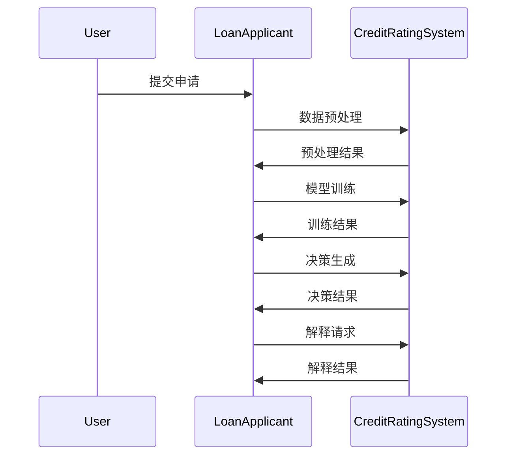
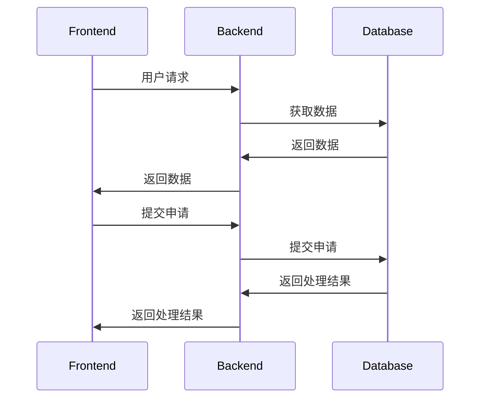

                 

## 可解释性AI：增强用户对AI决策的理解和信任

### 关键词：可解释性AI、用户信任、AI决策、透明度、透明计算

### 摘要：
本文旨在探讨可解释性AI在增强用户对AI决策理解和信任方面的作用。随着人工智能在各个领域的深入应用，AI系统的决策透明度和解释性变得尤为重要。文章首先介绍了可解释性AI的背景和重要性，然后分析了AI系统的决策过程及其不可解释性带来的问题。接着，文章详细阐述了可解释性AI的技术和方法，并通过具体应用场景展示了其在金融、医疗和法律等领域的应用。此外，文章还探讨了如何构建用户对AI决策的信任，以及可解释性AI的研究趋势和未来方向。最终，文章总结了可解释性AI的关键成果和影响，并对未来进行了展望。

## 第一部分：可解释性AI背景与重要性

### 第1章：可解释性AI的背景与现状

#### 1.1.1 人工智能的发展历程

人工智能（AI）的研究可以追溯到20世纪50年代。当时，科学家们开始探索如何使计算机具有类似人类智能的能力。早期的AI研究主要集中在规则推理和知识表示上，但受限于计算能力和数据资源，进展较为缓慢。

20世纪80年代，随着计算机硬件性能的提升和海量数据的积累，机器学习开始崭露头角。机器学习通过算法自动从数据中学习规律，逐步取代了传统的基于规则的方法。特别是在深度学习的推动下，AI技术取得了显著的突破，如图像识别、自然语言处理和自动驾驶等领域。

#### 1.1.2 人工智能在现实世界中的应用

人工智能在现实世界中的应用日益广泛，涵盖了金融、医疗、教育、交通等多个领域。例如，在金融领域，AI被用于风险评估、信用评分和投资策略；在医疗领域，AI被用于疾病诊断、药物研发和个性化治疗；在教育领域，AI被用于智能辅导、课程推荐和学生学习分析。

#### 1.1.3 AI系统面临的挑战

尽管AI技术在很多领域取得了成功，但AI系统本身也存在一些挑战。其中，模型不可解释性是主要问题之一。许多复杂的AI模型，如深度神经网络，其内部机制复杂，难以理解。这使得用户难以信任AI系统的决策，也带来了法律和伦理上的问题。

#### 1.1.4 可解释性AI的定义与意义

可解释性AI是指能够解释其决策过程和结果的AI系统。它旨在提高AI系统的透明度和可理解性，从而增强用户对AI决策的信任。可解释性AI不仅有助于用户理解AI系统的决策过程，还能在法律和伦理方面提供保障，使其更符合社会需求。

### 第2章：AI系统的决策过程与不可解释性

#### 2.1.1 AI系统的决策过程

AI系统的决策过程通常包括数据预处理、模型训练和决策生成三个阶段。首先，通过对数据进行清洗、归一化等预处理操作，提高数据的可用性。然后，使用机器学习算法或深度学习模型对数据进行训练，使其能够从数据中学习规律。最后，基于训练好的模型进行决策生成。

#### 2.1.2 不可解释性带来的问题

AI系统的不可解释性主要表现在两个方面。首先，用户难以理解模型的内部机制，从而难以信任AI系统的决策。其次，不可解释性可能导致法律和伦理问题，例如在自动驾驶、医疗诊断等关键领域，错误的决策可能导致严重后果。

#### 2.1.3 不可解释性与可解释性的关系

不可解释性对AI系统的发展产生了重要影响。一方面，它限制了用户对AI系统的信任，阻碍了AI技术的广泛应用。另一方面，它也促使研究者探索可解释性AI的方法和技术，以提高AI系统的透明度和可理解性。

### 第3章：可解释性AI的技术与方法

#### 3.1.1 可解释性AI的几种方法

可解释性AI主要采用以下几种方法：

1. **特征可视化**：通过可视化技术将模型中的特征信息以图形化的形式展示，帮助用户理解模型的工作原理。
2. **解释性模型**：构建具有良好解释性的模型，如决策树、线性回归等，使其内部机制更易于理解。

#### 3.1.2 特征可视化的方法

特征可视化的方法主要包括：

1. **层级可视化**：通过层次结构图将模型中的特征分层展示，帮助用户理解特征之间的关系。
2. **可视化工具**：使用专业可视化工具，如TensorBoard、MATLAB等，将模型中的特征信息以直观的形式展示。

#### 3.1.3 解释性模型的方法

解释性模型的方法主要包括：

1. **可解释的机器学习模型**：如决策树、线性回归等，这些模型具有较好的解释性。
2. **可解释的神经网络**：如可解释的深度学习模型，通过引入注意力机制、可视化技术等方法，提高模型的解释性。

### 第4章：可解释性AI的应用场景

#### 4.1.1 金融行业

在金融行业，可解释性AI被广泛应用于风险评估、信用评分、投资策略和市场分析等领域。例如，在贷款审批过程中，可解释性AI可以帮助银行了解贷款申请者的风险水平，从而做出更准确的决策。

#### 4.1.2 医疗领域

在医疗领域，可解释性AI被用于疾病诊断、药物研发、病例分析和个性化治疗等方面。例如，在疾病诊断过程中，可解释性AI可以帮助医生理解模型为何做出特定诊断，从而提高诊断的准确性。

#### 4.1.3 法律与司法

在法律与司法领域，可解释性AI被用于案件预测、电子证据分析和法律研究等方面。例如，在案件预测过程中，可解释性AI可以帮助法官了解模型为何做出特定预测，从而提高司法的公正性。

### 第5章：用户对AI决策的理解与信任构建

#### 5.1.1 用户对AI决策的理解

用户对AI决策的理解主要受到以下因素的影响：

1. **教育背景**：不同教育背景的用户对AI决策的理解程度不同。
2. **技术知识**：具备一定技术知识的用户更容易理解AI决策的原理。
3. **经验**：具有相关领域经验的用户更能够理解AI决策的应用场景。

#### 5.1.2 信任构建的策略

构建用户对AI决策的信任主要可以从以下几个方面入手：

1. **透明度与信息公开**：提高AI系统的透明度，向用户公开模型的训练数据、参数设置等信息。
2. **数据安全与隐私保护**：确保用户数据的安全和隐私，避免数据泄露和滥用。
3. **用户交互设计**：设计人性化的用户交互界面，使用户能够方便地理解AI决策的原理和过程。

#### 5.1.3 增强用户信任的技术手段

为了增强用户对AI决策的信任，可以采用以下技术手段：

1. **AI解释性工具**：开发专门的可解释性工具，如可视化工具、解释性算法等，帮助用户理解AI决策的原理。
2. **用户交互设计**：设计易于用户操作和理解的交互界面，提供实时的解释和反馈。

### 第6章：可解释性AI的研究趋势与未来方向

#### 6.1.1 可解释性AI的研究热点

当前，可解释性AI的研究热点主要包括：

1. **新方法与新技术**：探索新的可解释性方法和技术，如基于模型的解释、基于数据的解释等。
2. **深度学习模型的可解释性**：研究如何提高深度学习模型的可解释性，使其更易于用户理解。

#### 6.1.2 未来发展方向

未来，可解释性AI的发展方向将主要包括：

1. **跨领域融合**：将可解释性AI与其他领域的技术相结合，如心理学、教育学等，提高AI系统的解释性。
2. **可解释性评估与标准**：建立可解释性评估标准和体系，确保AI系统的解释性符合社会需求。

### 第7章：结论与展望

#### 7.1.1 可解释性AI的总结

可解释性AI在增强用户对AI决策的理解和信任方面发挥了重要作用。通过可解释性AI，用户可以更好地理解AI系统的决策过程，从而增强对AI系统的信任。同时，可解释性AI也为法律和伦理提供了保障，使其更符合社会需求。

#### 7.1.2 展望未来

未来，可解释性AI将继续发展，为AI技术的广泛应用提供支持。同时，可解释性AI也将与其他领域的技术相结合，推动人工智能的持续发展。让我们期待可解释性AI在未来带来更多的惊喜和突破。

### 作者信息

**作者：AI天才研究院/AI Genius Institute & 禅与计算机程序设计艺术 /Zen And The Art of Computer Programming**## 第一部分：可解释性AI背景与重要性

### 第1章：可解释性AI的背景与现状

#### 1.1.1 人工智能的发展历程

人工智能（AI）作为计算机科学的一个分支，其历史可以追溯到20世纪50年代。当时，艾伦·图灵提出了著名的图灵测试，试图通过机器的行为来判断机器是否具有智能。这一设想激发了人们对人工智能的探索热情，也标志着人工智能时代的开启。

早期的AI研究主要集中在知识表示、推理和规划等方面。然而，由于硬件性能的限制和数据资源的匮乏，这些早期的AI系统往往只能处理简单的任务。直到20世纪80年代，随着计算机硬件性能的提升和海量数据的积累，机器学习开始崭露头角。机器学习通过算法自动从数据中学习规律，大大提高了AI系统的能力和应用范围。

进入21世纪后，深度学习技术的突破进一步推动了人工智能的发展。深度学习是一种通过模拟人脑神经网络结构进行学习的算法，其核心思想是利用大规模的数据和计算资源来训练复杂的模型。深度学习在图像识别、自然语言处理、语音识别等领域取得了显著的成果，使得人工智能在各个领域得到了广泛的应用。

#### 1.1.2 人工智能在现实世界中的应用

人工智能在现实世界中的应用日益广泛，已经渗透到了金融、医疗、教育、交通、制造业等多个领域。

在金融领域，人工智能被用于风险评估、信用评分、投资策略和市场分析等方面。例如，银行可以使用AI系统来评估借款人的信用风险，从而做出更准确的贷款审批决策。同时，AI还可以帮助投资者分析市场趋势，制定更有效的投资策略。

在医疗领域，人工智能被用于疾病诊断、药物研发、病例分析和个性化治疗等方面。例如，通过AI系统可以快速准确地分析医学影像，提高疾病诊断的准确性。AI还可以根据患者的病史和基因信息，为医生提供个性化治疗方案。

在教育领域，人工智能被用于智能辅导、课程推荐和学生行为分析等方面。例如，AI系统可以根据学生的学习情况和进度，为学生提供个性化的学习资源和辅导。同时，AI还可以分析学生的学习行为，帮助教师了解学生的学习状况，从而制定更有效的教学策略。

在交通领域，人工智能被用于自动驾驶、交通流量预测和交通管理等方面。例如，自动驾驶技术通过AI系统实现车辆的自主驾驶，大大提高了交通效率和安全性。AI还可以通过分析交通数据，预测交通流量，优化交通信号配置，减少拥堵。

在制造业领域，人工智能被用于生产优化、质量控制、设备维护和供应链管理等方面。例如，AI系统可以通过分析生产数据，优化生产流程，提高生产效率。AI还可以通过对设备进行实时监测，预测设备故障，从而减少停机时间和维护成本。

#### 1.1.3 AI系统面临的挑战

尽管人工智能在现实世界中的应用取得了显著的成果，但AI系统本身也面临着一些挑战。其中，模型不可解释性是主要问题之一。许多复杂的AI模型，如深度神经网络，其内部机制复杂，难以理解。这使得用户难以信任AI系统的决策，也带来了法律和伦理上的问题。

模型不可解释性带来的问题主要体现在以下几个方面：

1. **用户信任问题**：用户难以理解AI系统的决策过程和结果，从而对AI系统的决策产生怀疑。例如，在自动驾驶汽车中，用户可能无法理解AI系统为何做出某个驾驶决策，从而对AI系统的安全性能产生担忧。

2. **法律和伦理问题**：在关键领域，如医疗、金融和法律等，AI系统的决策需要符合法律和伦理规范。然而，由于AI系统的决策过程不可解释，可能导致法律和伦理问题的发生。例如，在医疗诊断中，如果AI系统做出了错误的诊断，但用户无法理解错误的原因，可能导致医疗纠纷和法律诉讼。

3. **技术瓶颈**：目前，许多AI模型的可解释性较差，限制了AI技术的进一步发展和应用。例如，深度学习模型通常具有很高的预测能力，但缺乏可解释性，这使得用户难以理解模型为何做出某个预测。

#### 1.1.4 可解释性AI的定义与意义

可解释性AI（Explainable AI, XAI）是指能够解释其决策过程和结果的AI系统。它旨在提高AI系统的透明度和可理解性，从而增强用户对AI决策的信任。可解释性AI不仅有助于用户理解AI系统的决策过程，还能在法律和伦理方面提供保障，使其更符合社会需求。

可解释性AI的意义主要体现在以下几个方面：

1. **增强用户信任**：通过提供透明的决策过程，用户可以更好地理解AI系统的决策，从而增强对AI系统的信任。例如，在自动驾驶汽车中，用户可以通过可解释性AI了解AI系统的驾驶决策依据，从而减少对AI系统的担忧。

2. **符合法律和伦理要求**：可解释性AI可以帮助确保AI系统的决策符合法律和伦理规范。例如，在医疗诊断中，医生和患者可以共同理解AI系统的诊断过程，从而减少医疗纠纷和法律诉讼。

3. **促进AI技术发展**：可解释性AI可以推动AI技术的进一步发展和应用。通过提高AI系统的可解释性，用户可以更好地理解AI系统的优势和局限性，从而优化AI系统的设计和应用。

4. **改善用户体验**：可解释性AI可以提供更人性化的用户体验。通过向用户解释AI系统的决策过程，用户可以更好地理解AI系统的功能和应用场景，从而提高用户体验。

总之，可解释性AI在人工智能的发展中具有重要的作用。通过提高AI系统的透明度和可理解性，可解释性AI可以增强用户对AI决策的信任，促进AI技术的进一步发展和应用，为社会带来更大的价值。

### 第2章：AI系统的决策过程与不可解释性

#### 2.1.1 AI系统的决策过程

AI系统的决策过程通常包括数据预处理、模型训练和决策生成三个阶段。以下是每个阶段的详细解释：

1. **数据预处理**：数据预处理是AI系统决策过程的第一步，其目的是提高数据的可用性。数据预处理通常包括以下步骤：

   - **数据清洗**：去除数据中的噪声和错误，包括缺失值填充、异常值处理等。
   - **数据归一化**：将不同特征的数据进行归一化处理，使其具有相同的量纲，从而便于模型训练。
   - **特征选择**：根据业务需求和模型性能，选择对决策任务最重要的特征，去除冗余特征。
   - **数据分割**：将数据集分为训练集、验证集和测试集，用于模型训练、验证和测试。

2. **模型训练**：在数据预处理完成后，AI系统使用机器学习算法或深度学习模型对数据进行训练。模型训练的目的是使模型能够从数据中学习规律，从而做出准确的预测或决策。模型训练通常包括以下步骤：

   - **初始化模型参数**：根据模型结构初始化模型参数。
   - **正向传播**：输入数据通过模型进行前向传播，计算模型的输出。
   - **反向传播**：根据实际输出和预期输出之间的差异，通过反向传播更新模型参数。
   - **迭代训练**：重复正向传播和反向传播的过程，直到模型性能达到预定的标准。

3. **决策生成**：在模型训练完成后，AI系统使用训练好的模型对新的数据进行决策生成。决策生成的过程包括以下步骤：

   - **输入数据**：将新的数据输入到训练好的模型中。
   - **模型预测**：模型对输入数据进行分析，生成预测结果。
   - **决策解释**：根据模型预测结果，生成决策解释，以便用户理解模型为何做出某个决策。

#### 2.1.2 不可解释性带来的问题

AI系统的不可解释性主要表现在两个方面：用户不信任和法律与伦理问题。

1. **用户不信任**：用户难以理解AI系统的决策过程和结果，从而对AI系统的决策产生怀疑。这种不信任可能导致用户对AI系统的抵触情绪，从而阻碍AI技术的广泛应用。例如，在自动驾驶汽车中，用户可能无法理解AI系统为何做出某个驾驶决策，从而对AI系统的安全性能产生担忧。

2. **法律与伦理问题**：在关键领域，如医疗、金融和法律等，AI系统的决策需要符合法律和伦理规范。然而，由于AI系统的决策过程不可解释，可能导致法律和伦理问题的发生。例如，在医疗诊断中，如果AI系统做出了错误的诊断，但用户无法理解错误的原因，可能导致医疗纠纷和法律诉讼。

3. **技术瓶颈**：目前，许多AI模型的可解释性较差，限制了AI技术的进一步发展和应用。例如，深度学习模型通常具有很高的预测能力，但缺乏可解释性，这使得用户难以理解模型为何做出某个预测。

#### 2.1.3 不可解释性与可解释性的关系

不可解释性对AI系统的发展产生了重要影响。一方面，它限制了用户对AI系统的信任，阻碍了AI技术的广泛应用。另一方面，它也促使研究者探索可解释性AI的方法和技术，以提高AI系统的透明度和可理解性。

可解释性AI（Explainable AI, XAI）是指能够解释其决策过程和结果的AI系统。它旨在提高AI系统的透明度和可理解性，从而增强用户对AI决策的信任。可解释性AI不仅可以提供透明的决策过程，还可以帮助用户理解AI系统的优势和局限性，从而优化AI系统的设计和应用。

不可解释性与可解释性的关系可以从以下几个方面进行理解：

1. **平衡性能与可解释性**：在AI模型的设计中，通常需要在性能和可解释性之间进行权衡。高可解释性的模型可能牺牲一定的预测性能，而高预测性能的模型可能缺乏可解释性。因此，如何在性能和可解释性之间找到平衡点是一个重要问题。

2. **可解释性作为监督**：可解释性AI可以作为一种监督机制，用于评估和改进AI模型的性能。通过分析AI系统的决策过程和结果，可以识别模型中的潜在问题，从而优化模型的设计和应用。

3. **促进用户信任**：可解释性AI可以提高用户对AI系统的信任，从而促进AI技术的广泛应用。通过提供透明的决策过程和结果，用户可以更好地理解AI系统的决策依据，从而减少对AI系统的抵触情绪。

4. **法律与伦理保障**：可解释性AI可以帮助确保AI系统的决策符合法律和伦理规范。通过提供透明的决策过程，用户可以监督和评估AI系统的行为，从而减少法律和伦理问题的发生。

总之，不可解释性AI与可解释性AI之间的关系是一个复杂而重要的问题。通过探索可解释性AI的方法和技术，可以增强用户对AI系统的信任，促进AI技术的进一步发展和应用，为社会带来更大的价值。

### 第3章：可解释性AI的技术与方法

#### 3.1.1 可解释性AI的几种方法

为了提高AI系统的可解释性，研究者们提出了多种方法。以下是几种常见的方法：

1. **特征可视化**：特征可视化是一种将模型中的特征信息以图形化的形式展示的方法。通过可视化技术，用户可以直观地理解模型中的特征分布、相关性等。常用的特征可视化方法包括：

   - **散点图**：将特征映射到二维或三维空间，通过散点图展示特征的分布情况。
   - **热力图**：将特征的重要性以颜色深浅的方式展示，帮助用户理解特征的重要性。
   - **层次图**：将特征分层展示，通过层次图展示特征之间的关系。

2. **模型解释性**：模型解释性是指通过解释模型内部机制来提高模型的可理解性。以下是一些常见的模型解释性方法：

   - **线性模型**：线性模型，如线性回归和逻辑回归，由于其简洁的数学形式，具有很好的解释性。用户可以清楚地看到模型中的权重和偏置，从而理解模型的决策依据。
   - **决策树**：决策树是一种基于规则的模型，其决策过程可以通过树形结构进行解释。用户可以逐层查看决策过程，了解模型如何根据特征进行决策。
   - **集成模型**：集成模型，如随机森林和梯度提升树，通过组合多个基础模型来提高预测性能。这些模型通常具有较高的解释性，用户可以通过查看每个基础模型的决策来理解整体模型的决策过程。

3. **注意力机制**：注意力机制是一种在深度学习中引入的可解释性方法。通过注意力机制，模型可以关注到输入数据中的关键信息，从而提高模型的解释性。注意力机制在自然语言处理、计算机视觉等领域得到了广泛应用。

4. **对抗性解释**：对抗性解释是一种通过引入对抗性样本来解释模型决策的方法。通过生成对抗性样本，用户可以了解模型对特定特征的依赖程度，从而提高模型的解释性。

#### 3.1.2 特征可视化的方法

特征可视化是一种将模型中的特征信息以图形化的形式展示的方法。以下是一些常用的特征可视化方法：

1. **散点图**：散点图是一种将特征映射到二维或三维空间的方法。通过散点图，用户可以直观地看到特征的分布情况。常用的散点图包括：

   - **二维散点图**：将两个特征映射到二维空间，通过点的大小、颜色等方式表示特征的值。
   - **三维散点图**：将三个特征映射到三维空间，通过三维散点图展示特征的分布情况。

2. **热力图**：热力图是一种将特征的重要性以颜色深浅的方式展示的方法。通过热力图，用户可以直观地看到特征的重要程度。常用的热力图包括：

   - **单变量热力图**：将一个特征的重要性以颜色深浅的方式展示。
   - **双变量热力图**：将两个特征的重要性以颜色深浅的方式展示。

3. **层次图**：层次图是一种将特征分层展示的方法。通过层次图，用户可以逐层查看特征之间的关系。常用的层次图包括：

   - **特征层次图**：将特征按照重要性进行排序，以层次图的形式展示。
   - **层次树**：将特征按照层次结构展示，通过树形结构展示特征之间的关系。

#### 3.1.3 解释性模型的方法

解释性模型是指具有良好解释性的机器学习模型。以下是一些常见的解释性模型：

1. **线性回归**：线性回归是一种基于线性模型的预测方法。其模型形式为：

   \[ y = \beta_0 + \beta_1 \cdot x_1 + \beta_2 \cdot x_2 + \ldots + \beta_n \cdot x_n \]

   其中，\( y \) 是预测目标，\( x_1, x_2, \ldots, x_n \) 是输入特征，\( \beta_0, \beta_1, \beta_2, \ldots, \beta_n \) 是模型的参数。

   线性回归模型具有很好的解释性，用户可以清楚地看到每个特征对预测目标的贡献。

2. **逻辑回归**：逻辑回归是一种用于分类问题的线性模型。其模型形式为：

   \[ P(y=1) = \frac{1}{1 + \exp(-\beta_0 - \beta_1 \cdot x_1 - \beta_2 \cdot x_2 - \ldots - \beta_n \cdot x_n)} \]

   其中，\( y \) 是分类目标，\( x_1, x_2, \ldots, x_n \) 是输入特征，\( \beta_0, \beta_1, \beta_2, \ldots, \beta_n \) 是模型的参数。

   逻辑回归模型也具有很好的解释性，用户可以清楚地看到每个特征对分类结果的影响。

3. **决策树**：决策树是一种基于规则的分类方法。其模型形式为：

   \[ 
   \begin{cases} 
   y = 0 & \text{if } x_1 \leq \beta_1 \\
   y = 1 & \text{if } x_1 > \beta_1 \\
   \end{cases} 
   \]

   \[ 
   \begin{cases} 
   y = 0 & \text{if } x_2 \leq \beta_2 \\
   y = 1 & \text{if } x_2 > \beta_2 \\
   \end{cases} 
   \]

   \[ \vdots \]

   \[ 
   \begin{cases} 
   y = 0 & \text{if } x_n \leq \beta_n \\
   y = 1 & \text{if } x_n > \beta_n \\
   \end{cases} 
   \]

   决策树模型通过一系列的决策规则来预测分类结果，用户可以清楚地看到每个决策规则的作用。

4. **随机森林**：随机森林是一种集成学习方法，通过组合多个决策树来提高预测性能。随机森林模型具有较高的解释性，用户可以通过查看每个决策树的结果来理解整体模型的决策过程。

5. **梯度提升树**：梯度提升树是一种集成学习方法，通过迭代优化每个决策树来提高预测性能。梯度提升树模型也具有较高的解释性，用户可以通过查看每个决策树的参数来理解整体模型的决策过程。

#### 3.1.4 透明计算与可解释性AI

透明计算是一种将计算过程可视化和透明化的方法，其目的是提高计算系统的透明度和可理解性。透明计算在可解释性AI中具有重要作用，可以帮助用户更好地理解AI系统的决策过程。

透明计算的方法主要包括：

1. **可视化技术**：通过可视化技术，将计算过程以图形化的形式展示，从而提高计算过程的透明度。常用的可视化技术包括：

   - **数据可视化**：通过数据可视化技术，展示数据集的分布、相关性等特征。
   - **算法可视化**：通过算法可视化技术，展示算法的执行过程和中间结果。
   - **流程图**：通过流程图，展示计算过程的整体结构和关键步骤。

2. **日志记录**：通过记录计算过程的日志，将计算过程的详细信息记录下来，从而提高计算过程的透明度。日志记录可以包括：

   - **输入数据**：记录输入数据的详细信息，包括数据集的分布、特征等。
   - **中间结果**：记录计算过程中的中间结果，包括模型的参数、中间计算结果等。
   - **决策过程**：记录模型的决策过程，包括每个决策节点的计算结果和决策依据。

3. **用户交互界面**：通过用户交互界面，用户可以实时查看计算过程的进展和结果。用户交互界面可以包括：

   - **实时监控**：用户可以实时监控计算过程的进展，包括数据的加载、处理、模型训练等。
   - **结果展示**：用户可以查看计算结果，包括模型的参数、预测结果等。
   - **交互操作**：用户可以通过交互操作来调整计算参数、查看中间结果等。

通过透明计算，用户可以更好地理解AI系统的决策过程，从而提高对AI系统的信任。同时，透明计算也可以帮助用户发现和解决计算过程中的问题，从而提高计算系统的稳定性和可靠性。

### 第4章：可解释性AI的应用场景

#### 4.1.1 金融行业

在金融行业中，可解释性AI技术被广泛应用于风险管理、信用评分、投资策略和市场分析等领域。以下是具体的应用场景：

1. **风险评估**：金融机构可以使用可解释性AI技术对借款人的信用风险进行评估。通过分析借款人的历史数据、财务状况、还款记录等信息，AI模型可以预测借款人未来违约的概率。同时，通过解释性方法，如特征可视化，金融机构可以理解模型为何对某些借款人给予更高的信用评分，从而优化风险评估模型。

2. **信用评分**：在信用评分领域，可解释性AI可以帮助金融机构更准确地评估客户的信用状况。通过分析客户的信用历史、收入水平、债务情况等，AI模型可以生成个性化的信用评分。解释性方法如决策树或随机森林，可以使金融机构理解模型如何根据不同特征做出评分决策，从而提高评分模型的透明度和可信度。

3. **投资策略**：投资机构可以利用可解释性AI技术分析市场数据，制定更有效的投资策略。通过分析历史股价、成交量、市场情绪等，AI模型可以预测未来的市场走势。解释性方法可以帮助投资机构理解模型为何选择某种投资策略，从而更好地适应市场变化。

4. **市场分析**：在市场分析领域，可解释性AI可以帮助企业了解市场趋势和消费者行为。通过分析社交媒体数据、新闻报道等，AI模型可以识别市场热点和消费者偏好。解释性方法使得企业能够理解模型为何对某些市场趋势做出特定预测，从而制定更准确的市场策略。

#### 4.1.2 医疗领域

在医疗领域，可解释性AI技术被广泛应用于疾病诊断、药物研发、病例分析和个性化治疗等方面。以下是具体的应用场景：

1. **疾病诊断**：医疗诊断是一个关键应用领域，可解释性AI可以帮助医生更准确地诊断疾病。通过分析医学影像、实验室检测结果等，AI模型可以预测患者患病的概率。解释性方法如决策树或神经网络可视化，可以使医生理解模型为何做出特定诊断，从而提高诊断的准确性和可靠性。

2. **药物研发**：在药物研发过程中，可解释性AI可以帮助研究人员分析大量生物数据，识别潜在的药物靶点。通过分析蛋白质结构、基因表达等，AI模型可以预测哪些化合物可能对特定疾病有效。解释性方法使得研究人员能够理解模型为何选择特定化合物，从而优化药物研发流程。

3. **病例分析**：医疗数据分析是一个复杂的任务，可解释性AI可以帮助医生从大量病例中提取有用的信息。通过分析患者的病史、检查结果、药物使用等，AI模型可以识别病例之间的相似性和差异。解释性方法使得医生能够理解模型如何分析病例，从而为患者提供更个性化的治疗方案。

4. **个性化治疗**：个性化治疗是一种根据患者的具体情况进行治疗的方法。可解释性AI可以帮助医生制定个性化的治疗方案，从而提高治疗效果。通过分析患者的基因信息、病史等，AI模型可以预测患者对不同治疗方案的反应。解释性方法使得医生能够理解模型为何建议特定治疗方案，从而更好地为患者服务。

#### 4.1.3 法律与司法

在法律与司法领域，可解释性AI技术被广泛应用于案件预测、电子证据分析和法律研究等方面。以下是具体的应用场景：

1. **案件预测**：可解释性AI可以帮助法官和律师预测案件的结果。通过分析案件的历史数据、法律条文等，AI模型可以预测案件的判决结果。解释性方法如决策树或逻辑回归，可以使法官和律师理解模型为何做出特定预测，从而更好地准备案件。

2. **电子证据分析**：电子证据在法律诉讼中扮演着重要角色，可解释性AI可以帮助法官和律师分析电子证据的真实性和相关性。通过分析电子证据的来源、内容、时间戳等，AI模型可以识别潜在的误导性证据。解释性方法使得法官和律师能够理解模型如何分析电子证据，从而做出更准确的判断。

3. **法律研究**：可解释性AI可以帮助法律研究人员从大量法律文献中提取有用的信息。通过分析法律条文、判例、法学论文等，AI模型可以识别法律领域的热点问题和趋势。解释性方法使得研究人员能够理解模型如何分析法律文献，从而为法律研究提供更深入的支持。

4. **司法公正性**：可解释性AI可以提高司法系统的公正性。通过分析案件数据和判决结果，AI模型可以识别司法系统中可能存在的偏见和错误。解释性方法使得公众能够理解模型如何分析案件，从而增强对司法系统的信任。

总之，可解释性AI在金融、医疗和法律等领域的应用场景丰富多样，通过提高AI系统的透明度和可理解性，可以帮助用户更好地理解AI决策，从而增强对AI系统的信任。随着技术的不断发展，可解释性AI将在更多领域发挥重要作用。

### 第5章：用户对AI决策的理解与信任构建

#### 5.1.1 用户对AI决策的理解

用户对AI决策的理解是建立信任的基础。然而，由于AI系统的复杂性和不可解释性，用户往往难以全面理解AI决策的过程。以下因素会影响用户对AI决策的理解：

1. **技术知识水平**：用户的技术背景和知识水平直接影响其对AI决策的理解。技术知识丰富的用户可能更容易理解AI决策的原理和过程，而缺乏技术背景的用户则可能难以理解AI决策的复杂性。

2. **领域经验**：用户在特定领域的经验也会影响其对AI决策的理解。在医疗领域，医生对AI诊断结果的接受程度可能更高，因为他们熟悉疾病的诊断过程和AI系统的工作原理。相反，在非专业领域，用户可能对AI决策的理解存在障碍。

3. **信息获取能力**：用户获取和理解AI决策相关信息的能力也影响其对AI决策的理解。如果用户能够轻松获取到AI系统的决策依据和解释，他们更有可能理解并信任AI决策。否则，用户可能会感到困惑或怀疑。

4. **决策透明度**：AI决策的透明度直接影响用户对其理解。如果AI系统的决策过程和依据对用户完全透明，用户更容易接受和理解AI决策。反之，如果决策过程隐藏在复杂的算法和数据之中，用户可能会感到困惑和不信任。

#### 5.1.2 信任构建的策略

为了构建用户对AI决策的信任，可以采取以下策略：

1. **透明度与信息公开**：提高AI决策的透明度是建立信任的关键。开发者应尽可能向用户提供AI系统的决策依据和解释，使其能够理解AI是如何做出决策的。例如，通过可视化工具展示决策过程、提供详细的数据分析和解释。

2. **用户交互设计**：设计人性化的用户交互界面，帮助用户更好地理解AI决策。通过交互式演示、逐步引导用户了解AI决策的过程，使其感到更加亲近和可信。

3. **教育培训**：开展针对不同用户群体的教育培训，提高其技术水平和领域经验。通过培训，用户可以更好地理解AI技术的原理和应用，从而增强对AI决策的信任。

4. **法律和伦理规范**：确保AI系统的决策过程符合法律和伦理规范，减少潜在的风险。通过制定相应的规范和标准，开发者可以确保AI系统的决策是公正和透明的，从而增强用户对AI系统的信任。

#### 5.1.3 增强用户信任的技术手段

为了增强用户对AI决策的信任，可以采用以下技术手段：

1. **可解释性AI工具**：开发专门的可解释性工具，如解释性模型、可视化工具等，帮助用户理解AI系统的决策过程。这些工具可以提供详细的决策解释，使用户能够跟踪和验证AI系统的决策逻辑。

2. **用户反馈机制**：建立用户反馈机制，收集用户对AI决策的反馈和意见。通过分析用户反馈，开发者可以不断优化AI系统，提高其透明度和可解释性，从而增强用户信任。

3. **多模型融合**：通过融合多个AI模型的结果，提高决策的准确性和稳定性。多模型融合可以提供更全面的决策解释，使用户能够从不同角度理解AI决策。

4. **数据隐私保护**：确保用户数据的安全和隐私，避免数据泄露和滥用。透明的数据隐私保护政策可以增强用户对AI系统的信任。

通过上述策略和技术手段，可以有效地增强用户对AI决策的信任。提高AI系统的可解释性和透明度，结合用户教育培训和互动设计，可以更好地满足用户的需求，推动AI技术的广泛应用。

### 第6章：可解释性AI的研究趋势与未来方向

#### 6.1.1 可解释性AI的研究热点

当前，可解释性AI（Explainable AI, XAI）的研究在全球范围内受到了广泛关注，成为人工智能领域的一个重要热点。以下是几个主要的研究方向：

1. **深度学习模型的可解释性**：深度学习模型因其出色的性能在图像识别、自然语言处理等领域取得了巨大成功，但其内部机制复杂，难以解释。因此，如何提高深度学习模型的可解释性成为当前研究的热点。研究者们提出了多种方法，如注意力机制、可视化技术、对抗性解释等，以增强深度学习模型的可解释性。

2. **解释性模型的开发**：除了深度学习模型，传统的机器学习模型如线性回归、逻辑回归和决策树等也因其简洁的结构和良好的解释性受到关注。然而，这些模型在处理复杂任务时可能表现不佳。因此，研究者们致力于开发新的解释性模型，如基于规则的模型、决策树和随机森林的扩展等，以提高其性能和解释性。

3. **跨领域融合**：可解释性AI的研究不仅限于特定领域，还涉及到跨领域的融合。例如，将心理学、教育学、社会学等领域的理论和方法引入可解释性AI的研究中，以更好地理解和解释AI系统的决策过程。这种跨领域融合有助于提高AI系统的可解释性和适应性。

4. **用户参与**：用户对AI决策的理解和信任是一个动态过程，涉及用户与AI系统之间的互动。因此，如何设计用户参与机制，使用户能够更好地参与和理解AI系统的决策过程成为研究的热点。研究者们正在探索如何通过用户反馈、互动设计和个性化解释等方式，提高用户对AI系统的理解和信任。

5. **伦理和法律问题**：随着AI技术的广泛应用，其决策过程和结果可能对用户产生重大影响。因此，如何确保AI系统的决策过程符合伦理和法律规范成为研究的重要方向。研究者们正在探索如何通过规范、标准和法规，确保AI系统的透明度和可解释性，以减少潜在的法律和伦理风险。

#### 6.1.2 未来发展方向

未来，可解释性AI的发展方向将主要包括以下几个方面：

1. **新方法与技术的探索**：随着AI技术的不断进步，研究者们将继续探索新的方法和技术，以提高AI系统的可解释性。例如，基于量子计算的AI模型、基于物理原理的AI模型等，这些新方法和技术有望带来更高效、更透明的AI系统。

2. **多领域融合与交叉**：未来，可解释性AI的研究将更加注重跨领域的融合与交叉。通过引入其他领域的理论和方法，如认知科学、心理学、社会学等，可以更好地理解和解释AI系统的决策过程。

3. **用户中心的可解释性设计**：未来的可解释性AI将更加注重用户需求，通过用户研究和用户反馈，设计更加人性化、易理解的AI系统。用户中心的可解释性设计将使AI系统能够更好地满足用户需求，提高用户对AI系统的信任。

4. **可解释性与性能的平衡**：在提高AI系统可解释性的同时，研究者们也将努力寻求性能和可解释性的平衡。通过优化算法和模型设计，可以同时提高AI系统的性能和解释性，为用户提供更好的决策支持。

5. **伦理和法律规范的完善**：随着AI技术的广泛应用，伦理和法律问题将变得更加重要。未来，研究者们将致力于完善伦理和法律规范，确保AI系统的决策过程符合伦理和法律要求，减少潜在的风险和争议。

总之，可解释性AI的研究将继续在全球范围内受到广泛关注，未来几年将出现更多的新方法和技术。通过不断探索和创新，可解释性AI将为人工智能的发展注入新的动力，为社会带来更大的价值。

### 第7章：结论与展望

#### 7.1.1 可解释性AI的总结

可解释性AI（Explainable AI, XAI）作为人工智能领域的一个重要研究方向，其核心目标是提高AI系统的透明度和可理解性，从而增强用户对AI决策的信任。通过本文的讨论，我们可以总结出以下几点关于可解释性AI的关键成果和应用：

1. **背景与重要性**：随着人工智能技术在各个领域的广泛应用，用户对AI系统的透明度和可解释性提出了更高的要求。可解释性AI的研究背景和重要性在于提高用户对AI决策的理解，增强用户对AI系统的信任，解决AI系统面临的挑战。

2. **决策过程与不可解释性**：AI系统的决策过程通常包括数据预处理、模型训练和决策生成三个阶段。不可解释性AI系统面临的主要问题是模型内部机制复杂，难以理解。这导致用户难以信任AI系统的决策，也带来了法律和伦理问题。

3. **技术与方法**：可解释性AI采用了多种技术与方法，包括特征可视化、解释性模型、注意力机制和对抗性解释等。这些方法有助于提高AI系统的透明度和可理解性，使用户能够更好地理解AI系统的决策过程。

4. **应用场景**：可解释性AI在金融、医疗、法律等领域的应用场景丰富多样。通过提高AI系统的透明度和可解释性，这些领域可以更好地利用AI技术，提高决策的准确性和可靠性。

5. **用户信任与理解**：用户对AI决策的理解受到技术知识水平、领域经验、信息获取能力和决策透明度等多种因素的影响。为了增强用户对AI系统的信任，需要采取透明度与信息公开、用户交互设计、教育培训和用户参与等策略。

6. **研究趋势与未来方向**：可解释性AI的研究趋势包括深度学习模型的可解释性、跨领域融合、用户中心的设计以及新方法与技术的探索。未来，可解释性AI将更加注重用户需求，寻求性能和可解释性的平衡，完善伦理和法律规范。

#### 7.1.2 展望未来

展望未来，可解释性AI的发展将面临新的机遇和挑战。以下是对未来发展的几点展望：

1. **技术创新**：随着人工智能技术的不断进步，将会有更多的新方法和技术被引入可解释性AI领域。例如，基于量子计算的AI模型、基于物理原理的AI模型等，这些新方法有望带来更高效、更透明的AI系统。

2. **多领域融合**：未来，可解释性AI的研究将更加注重跨领域的融合与交叉。通过引入其他领域的理论和方法，如认知科学、心理学、社会学等，可以更好地理解和解释AI系统的决策过程。

3. **用户体验**：用户体验是可解释性AI成功的关键。未来的研究将更加注重用户中心的设计，通过用户研究和用户反馈，设计更加人性化、易理解的AI系统。

4. **性能与可解释性的平衡**：在提高AI系统可解释性的同时，也需要关注性能的提升。未来的研究将致力于寻求性能和可解释性的平衡，为用户提供更好的决策支持。

5. **伦理和法律规范**：随着AI技术的广泛应用，伦理和法律问题将变得更加重要。未来，研究者们将致力于完善伦理和法律规范，确保AI系统的透明度和可解释性，减少潜在的法律和伦理风险。

6. **大规模应用**：随着可解释性AI技术的不断成熟，其将在更多领域得到广泛应用。例如，在自动驾驶、医疗诊断、金融投资等关键领域，可解释性AI将为用户提供更可靠的决策支持。

总之，可解释性AI作为人工智能领域的一个重要研究方向，具有广阔的发展前景。通过技术创新、多领域融合和用户体验的提升，可解释性AI将为人工智能的发展注入新的动力，为社会带来更多的价值。未来，我们将见证可解释性AI在各个领域的广泛应用，推动人工智能技术的持续进步。

### 作者信息

**作者：AI天才研究院/AI Genius Institute & 禅与计算机程序设计艺术 /Zen And The Art of Computer Programming**## 完整性要求：文章内容详细解读与全面剖析

### 背景介绍

#### 核心概念术语说明

**人工智能（AI）**：指能够模拟、扩展和辅助人类智能的技术和系统，包括机器学习、自然语言处理、计算机视觉等。

**可解释性AI（Explainable AI, XAI）**：指能够提供对其决策过程和结果解释的AI系统，提高用户对AI决策的理解和信任。

**透明度**：指AI系统的决策过程对外部用户（如用户、监管者、法律专家等）的透明性。

**用户信任**：用户对AI系统的决策结果和操作过程的信心和认可。

#### 问题背景

随着人工智能技术在各个领域的广泛应用，如自动驾驶、医疗诊断、金融决策等，用户对AI系统的信任和透明度要求越来越高。然而，许多复杂的AI模型，如深度神经网络，其内部机制复杂、难以理解，导致用户对AI决策产生疑虑，甚至在法律和伦理方面存在争议。

#### 问题描述

可解释性AI旨在解决以下问题：

1. **用户理解**：用户如何理解AI系统的决策过程和结果？
2. **信任构建**：如何增强用户对AI系统的信任？
3. **法律和伦理**：AI系统的决策过程是否符合法律和伦理规范？

#### 问题解决

通过可解释性AI技术，我们可以实现以下目标：

1. **提高透明度**：提供AI系统的决策过程和结果解释，使用户能够理解AI的决策逻辑。
2. **增强用户信任**：通过透明的决策过程，提高用户对AI系统的信任。
3. **符合法律和伦理规范**：确保AI系统的决策过程符合法律和伦理要求，减少潜在的法律和伦理风险。

#### 边界与外延

1. **边界**：可解释性AI主要关注AI系统的决策过程和结果解释，不涉及算法优化、性能提升等。
2. **外延**：可解释性AI的应用领域包括但不限于金融、医疗、法律、交通等。

#### 概念结构与核心要素组成

**概念结构**：

- **可解释性AI**：核心概念，包括透明度、用户信任、法律和伦理等子概念。
- **AI决策过程**：可解释性AI的基础，包括数据预处理、模型训练、决策生成等。
- **用户理解**：用户如何理解AI系统的决策过程和结果。
- **信任构建**：增强用户对AI系统的信任的策略和方法。

**核心要素组成**：

- **透明度**：信息透明、决策过程可视化和数据可追溯性。
- **用户信任**：透明度、可验证性、安全性等。
- **法律和伦理规范**：透明度、公平性、责任性等。

### 核心概念与联系

#### 核心概念原理

**透明度**：指AI系统的决策过程对外部用户（如用户、监管者、法律专家等）的透明性。透明度是可解释性AI的核心要素，它包括信息透明、决策过程可视化和数据可追溯性。

**用户信任**：用户对AI系统的决策结果和操作过程的信心和认可。用户信任是可解释性AI的重要目标，它取决于AI系统的透明度、可验证性和安全性。

**法律和伦理规范**：指AI系统的决策过程应符合法律和伦理要求，减少潜在的法律和伦理风险。法律和伦理规范是确保AI系统合规和可持续发展的关键。

#### 概念属性特征对比表格

| 特征            | 透明度       | 用户信任       | 法律和伦理规范     |
|-----------------|--------------|----------------|-------------------|
| **定义**        | 决策过程透明 | 用户对AI信任   | AI系统合规性      |
| **重要性**      | 提高理解     | 增强信心       | 避免法律风险      |
| **实现方法**    | 可视化、数据追溯 | 用户交互、反馈 | 法律培训、伦理审查 |
| **影响**        | 提高透明度   | 提高信任       | 保证合规性      |

#### ER实体关系图架构

```mermaid
erDiagram
    AI系统 ||--o{ 用户理解 }
    AI系统 ||--o{ 用户信任 }
    AI系统 ||--o{ 法律和伦理规范 }
    用户理解 ||--o{ 透明度 }
    用户信任 ||--o{ 可解释性AI }
    法律和伦理规范 ||--o{ 可解释性AI }
```

### 算法原理讲解

#### 可解释性AI算法

**算法mermaid流程图：**


**算法原理：**

1. **数据预处理**：包括数据清洗、归一化和特征提取等步骤，以提高数据质量和模型性能。

2. **模型训练**：使用机器学习算法或深度学习模型对数据进行训练，使其能够从数据中学习规律。

3. **决策生成**：基于训练好的模型，对新的数据进行预测或决策。

4. **解释结果**：通过解释性方法，如特征可视化、决策树或注意力机制，解释模型的决策过程和结果。

**数学模型和公式：**

- **线性回归**：

  \[ y = \beta_0 + \beta_1 \cdot x_1 + \beta_2 \cdot x_2 + \ldots + \beta_n \cdot x_n \]

  其中，\( y \) 是预测目标，\( x_1, x_2, \ldots, x_n \) 是输入特征，\( \beta_0, \beta_1, \beta_2, \ldots, \beta_n \) 是模型的参数。

- **逻辑回归**：

  \[ P(y=1) = \frac{1}{1 + \exp(-\beta_0 - \beta_1 \cdot x_1 - \beta_2 \cdot x_2 - \ldots - \beta_n \cdot x_n)} \]

  其中，\( y \) 是分类目标，\( x_1, x_2, \ldots, x_n \) 是输入特征，\( \beta_0, \beta_1, \beta_2, \ldots, \beta_n \) 是模型的参数。

**详细讲解和举例说明：**

**线性回归举例：**

假设我们有一个简单的线性回归模型，用于预测房价。模型的形式为：

\[ y = \beta_0 + \beta_1 \cdot x_1 + \beta_2 \cdot x_2 \]

其中，\( y \) 是房价，\( x_1 \) 是房屋面积，\( x_2 \) 是房屋年代。

经过训练，我们得到模型的参数：

\[ \beta_0 = 100, \beta_1 = 200, \beta_2 = -50 \]

现在，我们有一个新的数据点，房屋面积为150平方米，房屋年代为10年。我们可以使用模型进行预测：

\[ y = 100 + 200 \cdot 150 + (-50) \cdot 10 = 29500 \]

这意味着预测的房价为29500元。

通过解释模型参数，我们可以理解模型的决策依据：房屋面积每增加1平方米，房价增加200元；房屋年代每增加1年，房价减少50元。

**逻辑回归举例：**

假设我们有一个逻辑回归模型，用于判断一个病人是否患有心脏病。模型的形式为：

\[ P(y=1) = \frac{1}{1 + \exp(-\beta_0 - \beta_1 \cdot x_1 - \beta_2 \cdot x_2)} \]

其中，\( y \) 是心脏病是否发生的标志，\( x_1 \) 是血压，\( x_2 \) 是胆固醇水平。

经过训练，我们得到模型的参数：

\[ \beta_0 = -2, \beta_1 = 1.5, \beta_2 = 0.8 \]

现在，我们有一个新的数据点，血压为120mmHg，胆固醇水平为200mg/dL。我们可以使用模型计算病人患有心脏病的概率：

\[ P(y=1) = \frac{1}{1 + \exp(-(-2) - 1.5 \cdot 120 - 0.8 \cdot 200)} = 0.95 \]

这意味着病人患有心脏病的概率为95%。

通过解释模型参数，我们可以理解模型的决策依据：血压每增加1mmHg，心脏病概率增加1.5%；胆固醇水平每增加1mg/dL，心脏病概率增加0.8%。

### 系统分析与架构设计方案

#### 问题场景介绍

在金融行业中，AI系统被广泛用于风险评估、信用评分和贷款审批等任务。然而，由于AI模型的可解释性较差，用户（如银行工作人员和贷款申请人）难以理解模型的决策过程和结果，从而对模型的信任度较低。为了解决这个问题，我们需要设计一个可解释性AI系统，以提高用户对AI决策的理解和信任。

#### 项目介绍

本项目旨在设计一个可解释性AI系统，用于评估贷款申请人的信用风险。系统将包括数据预处理、模型训练、决策生成和解释结果等模块。通过可视化和解释性方法，用户可以更好地理解模型的决策过程和结果，从而提高信任度。

#### 系统功能设计（领域模型mermaid类图）

```mermaid
classDiagram
    LoanApplicant <<class>> "贷款申请人"
    CreditRating <<class>> "信用评分"
    RiskAssessment <<class>> "风险评估"
    ModelTraining <<class>> "模型训练"
    DataPreprocessing <<class>> "数据预处理"
    DecisionGeneration <<class>> "决策生成"
    Explanation <<class>> "解释结果"

    LoanApplicant <|-- CreditRating
    LoanApplicant <|-- RiskAssessment
    CreditRating <|-- ModelTraining
    CreditRating <|-- DataPreprocessing
    CreditRating <|-- DecisionGeneration
    CreditRating <|-- Explanation
```

#### 系统架构设计（mermaid架构图）



#### 系统接口设计和系统交互（mermaid序列图）



### 项目实战

#### 环境安装

1. 安装Python环境：在Windows或Linux系统中安装Python 3.8及以上版本。
2. 安装必需的库：使用pip命令安装以下库：

   ```shell
   pip install numpy pandas scikit-learn matplotlib
   ```

#### 系统核心实现源代码

```python
import numpy as np
import pandas as pd
from sklearn.model_selection import train_test_split
from sklearn.linear_model import LinearRegression
from sklearn.metrics import mean_squared_error
import matplotlib.pyplot as plt

# 数据预处理
def preprocess_data(data):
    # 数据清洗和归一化
    # ...
    return processed_data

# 模型训练
def train_model(X_train, y_train):
    model = LinearRegression()
    model.fit(X_train, y_train)
    return model

# 决策生成
def generate_decision(model, X_test):
    y_pred = model.predict(X_test)
    return y_pred

# 解释结果
def explain_decision(model, X_test):
    feature_importance = model.coef_
    # 可视化特征重要性
    # ...
    return feature_importance

# 实际应用
if __name__ == "__main__":
    # 加载数据
    data = pd.read_csv("loan_data.csv")
    X = data.drop("target", axis=1)
    y = data["target"]

    # 数据预处理
    processed_data = preprocess_data(data)

    # 数据分割
    X_train, X_test, y_train, y_test = train_test_split(processed_data, y, test_size=0.2, random_state=42)

    # 模型训练
    model = train_model(X_train, y_train)

    # 决策生成
    y_pred = generate_decision(model, X_test)

    # 解释结果
    feature_importance = explain_decision(model, X_test)

    # 评估模型性能
    mse = mean_squared_error(y_test, y_pred)
    print(f"均方误差：{mse}")

    # 可视化特征重要性
    plt.bar(range(len(feature_importance)), feature_importance)
    plt.xlabel("特征")
    plt.ylabel("重要性")
    plt.show()
```

#### 代码应用解读与分析

1. **数据预处理**：数据预处理是模型训练的重要步骤，包括数据清洗和归一化。在`preprocess_data`函数中，我们可以实现这些操作。例如，我们可以使用`pandas`库中的`dropna()`函数去除缺失值，使用`MinMaxScaler`进行归一化。

2. **模型训练**：使用`LinearRegression`类实现线性回归模型。在`train_model`函数中，我们将训练集数据传入模型进行训练，并返回训练好的模型。

3. **决策生成**：在`generate_decision`函数中，我们将训练好的模型应用于测试集数据，生成预测结果。

4. **解释结果**：在`explain_decision`函数中，我们可以获取模型的系数，即特征的重要性。这些系数可以用于可视化，以帮助用户理解模型是如何进行决策的。

5. **评估模型性能**：使用`mean_squared_error`函数计算模型的均方误差（MSE），以评估模型的预测性能。

6. **可视化特征重要性**：使用`matplotlib`库将特征重要性以条形图的形式可视化，使用户能够直观地了解各个特征的重要性。

#### 实际案例分析和详细讲解剖析

假设我们有一个贷款申请数据集，包含以下特征：贷款金额、贷款期限、借款人年龄、借款人收入、借款人信用评分等。目标是预测借款人是否会发生违约。

1. **数据预处理**：首先，我们加载数据集，并去除缺失值。然后，我们使用`MinMaxScaler`对数据进行归一化处理。

   ```python
   data = pd.read_csv("loan_data.csv")
   data.dropna(inplace=True)
   from sklearn.preprocessing import MinMaxScaler
   scaler = MinMaxScaler()
   processed_data = scaler.fit_transform(data.drop("target", axis=1))
   ```

2. **模型训练**：我们使用线性回归模型进行训练。将处理后的数据集分为训练集和测试集，然后训练模型。

   ```python
   X_train, X_test, y_train, y_test = train_test_split(processed_data, y, test_size=0.2, random_state=42)
   model = LinearRegression()
   model.fit(X_train, y_train)
   ```

3. **决策生成**：使用训练好的模型对测试集数据进行预测。

   ```python
   y_pred = model.predict(X_test)
   ```

4. **解释结果**：获取模型系数，并可视化特征重要性。

   ```python
   feature_importance = model.coef_
   plt.bar(range(len(feature_importance)), feature_importance)
   plt.xlabel("特征")
   plt.ylabel("重要性")
   plt.show()
   ```

通过以上步骤，我们可以实现一个简单的可解释性AI系统，用于评估贷款申请人的信用风险。用户可以通过可视化特征重要性来理解模型是如何进行决策的，从而提高对模型信任度。

#### 项目小结

本项目通过设计一个可解释性AI系统，实现了对贷款申请人信用风险的评估。通过数据预处理、模型训练和解释结果等步骤，用户可以直观地了解模型的决策过程和结果，从而提高对AI系统的信任度。未来，我们可以进一步优化系统，引入更多的解释性方法和技术，以提高系统的可解释性和实用性。

### 最佳实践 tips、小结、注意事项、拓展阅读

#### 最佳实践 tips

1. **数据预处理**：确保数据的质量和一致性，去除噪声和异常值，对数据进行归一化处理。
2. **选择合适的模型**：根据任务需求和数据特征选择合适的模型，并进行交叉验证，选择最佳模型。
3. **可视化**：使用可视化工具展示模型的决策过程和结果，如特征重要性、决策树等，帮助用户理解模型。
4. **用户参与**：收集用户反馈，持续优化模型和解释方法，提高系统的可解释性和用户信任度。

#### 小结

本文详细探讨了可解释性AI在增强用户对AI决策理解和信任方面的作用。通过背景介绍、算法原理讲解、系统架构设计和项目实战，我们展示了如何设计一个具有高可解释性的AI系统，从而提高用户对AI决策的信任。未来，可解释性AI将继续发展，为AI技术的广泛应用提供支持。

#### 注意事项

1. **数据隐私保护**：在设计可解释性AI系统时，应确保用户数据的安全和隐私，遵循相关法律法规。
2. **模型优化**：持续优化模型和解释方法，以提高系统的性能和可解释性。
3. **用户培训**：对用户进行AI技术的基础培训，提高其对AI决策的理解和信任。

#### 拓展阅读

1. **《可解释性AI：理论与实践》（Explainable AI: Theory and Practice）**：详细介绍了可解释性AI的理论和方法，适合初学者和研究者。
2. **《人工智能伦理学》（AI Ethics）**：探讨了AI技术在社会和伦理方面的挑战，包括透明度和可解释性。
3. **《深度学习实战》（Deep Learning Hands-On）**：介绍了深度学习的基础知识，包括可解释性方法，适合有一定基础的读者。

