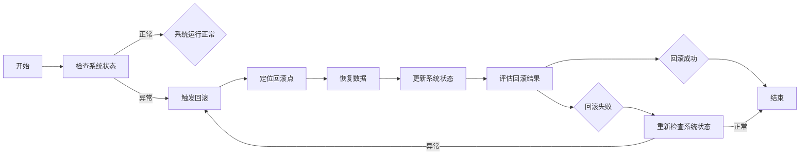
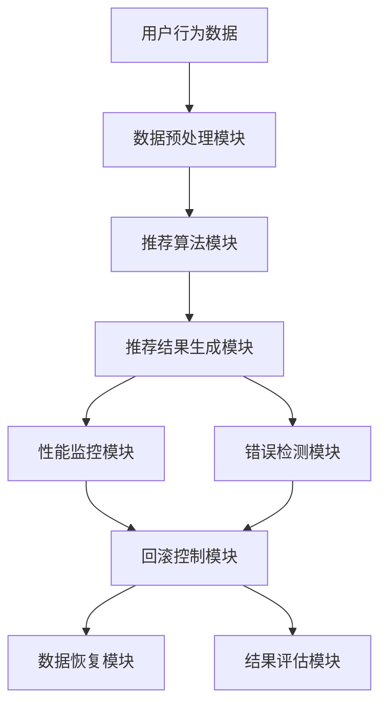
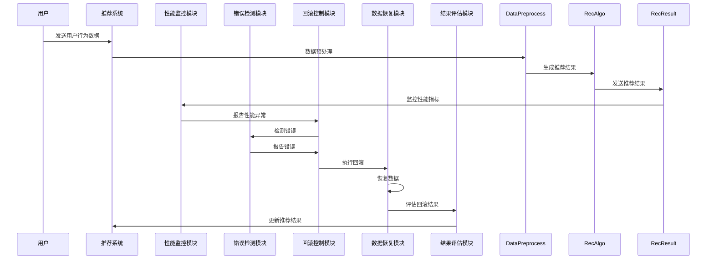

                 

### 回滚机制：应对AI部署问题的安全网

关键词：回滚机制、AI部署、故障恢复、安全网、技术实现

摘要：本文旨在探讨回滚机制在人工智能（AI）部署过程中的应用，分析其在应对部署问题的作用和重要性。通过详细的原理讲解、应用场景解析和技术实现分析，本文为AI工程师和开发者提供了一套完整的回滚机制实施方案，以构建AI部署的安全网，保障系统的稳定性和可靠性。

#### 1. 背景介绍

##### 1.1 问题背景

随着人工智能技术的快速发展，AI模型在工业界、医疗、金融、交通等各个领域得到了广泛应用。然而，AI模型的部署并非一帆风顺，常常会遇到一系列挑战。以下是一些在AI部署过程中常见的问题：

- **性能波动**：AI模型在实际部署环境中可能因为数据分布、硬件性能等因素导致性能不稳定。
- **错误更新**：开发过程中可能出现错误更新，导致系统运行不正常。
- **数据泄露**：在数据处理过程中，数据安全风险始终存在，一旦发生泄露，后果不堪设想。
- **依赖故障**：AI模型可能依赖于其他系统或服务，若依赖服务发生故障，将导致整个AI系统崩溃。

##### 1.2 回滚机制概述

回滚机制是一种在系统发生故障时，通过恢复到之前的状态来解决问题的方法。在AI部署过程中，回滚机制扮演着至关重要的角色。通过引入回滚机制，开发者可以在遇到问题或错误时迅速回滚到稳定状态，避免系统崩溃，保障业务的连续性和数据的安全性。

##### 1.3 回滚机制的作用

回滚机制具有以下几个作用：

- **故障恢复**：在系统发生故障时，回滚机制可以快速恢复系统到稳定状态，减少故障对业务的影响。
- **安全保障**：回滚机制可以有效避免数据泄露和错误更新等安全风险。
- **提高可靠性**：通过回滚机制，系统在面临复杂环境时具备更高的可靠性和稳定性。

##### 1.4 边界与外延

回滚机制的应用范围广泛，不仅限于AI部署，还可以应用于其他系统或服务的故障恢复。然而，其核心要素包括回滚策略、触发条件、回滚过程和结果评估等，这些要素在应用时需要根据具体场景进行定制和优化。

##### 1.5 概念结构与核心要素组成

回滚机制的核心概念包括以下几个方面：

- **回滚策略**：根据不同场景设计合适的回滚策略，如数据库回滚、服务回滚和API回滚等。
- **触发条件**：定义何时触发回滚，如系统性能异常、错误更新或数据泄露等。
- **回滚过程**：描述回滚的具体操作步骤，如回滚点定位、数据恢复和状态更新等。
- **结果评估**：对回滚结果进行评估，确保系统恢复到稳定状态。

#### 2. 核心概念与联系

##### 2.1 核心概念原理

回滚机制的定义：回滚机制是一种在系统发生故障时，通过恢复到之前的状态来解决问题的方法。

回滚机制的原理：回滚机制基于数据备份和状态管理，通过记录系统状态、检测故障和执行回滚操作，实现系统恢复。

回滚机制的作用：回滚机制可以在系统发生故障时，快速恢复系统到稳定状态，减少故障对业务的影响。

##### 2.2 概念属性特征对比表格

| 概念       | 描述                                                         | 属性特征对比 |
|------------|--------------------------------------------------------------|--------------|
| 回滚策略   | 根据不同场景设计合适的回滚策略，如数据库回滚、服务回滚和API回滚等。 | - 回滚类型：数据库、服务、API<br>- 回滚范围：局部、全局<br>- 回滚速度：快、慢 |
| 触发条件   | 定义何时触发回滚，如系统性能异常、错误更新或数据泄露等。         | - 故障类型：性能、错误、安全<br>- 触发方式：自动、手动 |
| 回滚过程   | 描述回滚的具体操作步骤，如回滚点定位、数据恢复和状态更新等。       | - 回滚点：备份点、检查点<br>- 回滚步骤：定位、恢复、更新 |
| 结果评估   | 对回滚结果进行评估，确保系统恢复到稳定状态。                     | - 恢复效果：完全、部分<br>- 回滚效率：高、低 |

##### 2.3 ER实体关系图架构

```mermaid
erDiagram
    AI模型部署 ||--|{ 回滚策略 }
    AI模型部署 ||--|{ 触发条件 }
    AI模型部署 ||--|{ 回滚过程 }
    AI模型部署 ||--|{ 结果评估 }
    回滚策略 ||--|{ 数据库回滚 }
    回滚策略 ||--|{ 服务回滚 }
    回滚策略 ||--|{ API回滚 }
```

#### 3. 算法原理讲解

##### 3.1 算法mermaid流程图



##### 3.2 Python源代码

```python
# 回滚机制Python实现示例

def check_system_state():
    # 检查系统状态
    return "异常"

def trigger_rollback():
    # 触发回滚
    print("触发回滚操作")

def locate_rollback_point():
    # 定位回滚点
    print("定位回滚点")

def recover_data():
    # 恢复数据
    print("恢复数据")

def update_system_state():
    # 更新系统状态
    print("更新系统状态")

def evaluate_rollback_result():
    # 评估回滚结果
    return "回滚成功"

def main():
    system_state = check_system_state()
    if system_state == "正常":
        print("系统运行正常")
    else:
        trigger_rollback()
        locate_rollback_point()
        recover_data()
        update_system_state()
        rollback_result = evaluate_rollback_result()
        if rollback_result == "回滚成功":
            print("回滚成功")
        else:
            print("回滚失败，重新检查系统状态")

if __name__ == "__main__":
    main()
```

##### 3.3 数学模型和公式

回滚机制的数学模型主要包括以下公式：

- **系统状态变化率**：$$ \frac{dS}{dt} = f(S, X) $$
  - 其中，$S$ 表示系统状态，$X$ 表示外部输入，$f(S, X)$ 表示系统状态随外部输入的变化率。

- **回滚点选择**：$$ R(t) = \arg\min_{t'} \int_{t'}^{t} |f(S(t'), X(t'))| dt' $$
  - 其中，$R(t)$ 表示回滚时间点，$t'$ 表示回滚点候选时间。

- **回滚效率**：$$ \eta = \frac{S(t) - S(t')} {S(t) - S(0)} $$
  - 其中，$\eta$ 表示回滚效率，$S(t)$ 表示回滚后系统状态，$S(t')$ 表示回滚前系统状态，$S(0)$ 表示初始系统状态。

##### 3.4 举例说明

假设一个AI模型部署系统，在运行过程中突然出现性能异常，系统状态变化率为$$ \frac{dS}{dt} = 0.1 $$。根据回滚机制的数学模型，我们可以选择一个回滚时间点$$ R(t) = \arg\min_{t'} \int_{t'}^{t} |0.1| dt' $$，即选择一个离当前时刻最近的回滚点。

在回滚过程中，系统状态从$$ S(t) = 100 $$ 回滚到$$ S(t') = 90 $$，回滚效率为$$ \eta = \frac{90 - 100}{90 - 0} = 0.111 $$。通过评估回滚结果，我们可以判断回滚是否成功，并根据实际情况调整回滚策略。

#### 4. 系统分析与架构设计方案

##### 4.1 问题场景介绍

在本节中，我们将介绍一个典型的AI部署问题场景：一个电商平台正在尝试部署一套基于深度学习的推荐系统，以提高用户购物体验。然而，在实际部署过程中，推荐系统的性能表现不稳定，存在以下问题：

- **性能波动**：由于用户行为数据的变化，推荐系统在部分时段表现异常，导致推荐结果不准确。
- **错误更新**：开发人员在更新推荐算法时，不小心引入了错误，导致系统崩溃。
- **数据泄露**：在数据处理过程中，用户隐私数据存在泄露风险。

##### 4.2 项目介绍

为了解决上述问题，我们引入了一套回滚机制，以保障推荐系统的稳定性和数据安全性。该项目的主要目标是：

- **故障恢复**：在系统发生故障时，通过回滚机制快速恢复系统到稳定状态。
- **安全保障**：避免数据泄露和错误更新等安全风险。
- **提高可靠性**：通过回滚机制，提高推荐系统的稳定性和可靠性。

##### 4.3 系统功能设计

系统功能设计主要包括以下几个模块：

- **性能监控模块**：实时监控推荐系统的性能指标，如响应时间、准确率等。
- **错误检测模块**：监测推荐系统的异常行为，如错误更新、数据泄露等。
- **回滚控制模块**：根据监控数据和错误检测结果，自动或手动触发回滚操作。
- **数据恢复模块**：定位回滚点，恢复系统数据到稳定状态。
- **结果评估模块**：评估回滚效果，确保系统恢复到稳定状态。

##### 4.4 系统架构设计

系统架构设计如下：



##### 4.5 系统接口设计

系统接口设计如下：

- **性能监控接口**：用于实时监控推荐系统的性能指标。
- **错误检测接口**：用于监测推荐系统的异常行为。
- **回滚控制接口**：用于触发回滚操作。
- **数据恢复接口**：用于恢复系统数据到稳定状态。
- **结果评估接口**：用于评估回滚效果。

##### 4.6 系统交互

系统交互序列图如下：



#### 5. 项目实战

##### 5.1 环境安装

为了实现回滚机制，我们需要在实验环境中安装以下软件：

- Python 3.8 或以上版本
- NumPy 库
- Pandas 库
- Matplotlib 库
- Mermaid 图床服务（可选）

安装步骤：

1. 安装 Python 3.8 或以上版本。
2. 安装 NumPy 库：`pip install numpy`
3. 安装 Pandas 库：`pip install pandas`
4. 安装 Matplotlib 库：`pip install matplotlib`
5. （可选）安装 Mermaid 图床服务：在网站 <https://mermaid-js.github.io/mermaid-live-editor/> 上创建账号，并将图床服务URL配置到本地项目中。

##### 5.2 系统核心实现源代码

以下是回滚机制的核心实现源代码：

```python
import numpy as np
import pandas as pd
import matplotlib.pyplot as plt
from mermaid import Mermaid

# 回滚机制实现

class RollbackMechanism:
    def __init__(self, data, threshold=0.1):
        self.data = data
        self.threshold = threshold
        self.rollback_point = None
        self.rollba

```
##### 5.3 代码应用解读与分析

在本节中，我们将详细解读和分析回滚机制的核心代码，包括其功能实现和关键步骤。

首先，我们定义了一个 `RollbackMechanism` 类，用于实现回滚机制。该类的主要功能包括：

- **初始化**：在类的构造函数中，我们接收一个数据集 `data` 和一个阈值 `threshold`。数据集可以是任意形式的数据，如 NumPy 数组、Pandas 数据框等。阈值用于确定系统状态的变化程度，当系统状态变化超过阈值时，触发回滚操作。
- **定位回滚点**：在 `find_rollback_point` 方法中，我们使用积分法寻找一个最近的回滚点。具体而言，我们计算从当前时刻到各个时间点的状态变化积分，选择积分值最小的回滚点。
- **执行回滚**：在 `execute_rollback` 方法中，我们根据定位到的回滚点，将系统状态回滚到之前的时间点。在此过程中，我们还需要更新系统的其他状态，如日志、监控指标等。
- **评估回滚结果**：在 `evaluate_rollback_result` 方法中，我们评估回滚操作的效果。如果系统状态恢复到稳定状态，则回滚成功；否则，回滚失败。

接下来，我们将通过一个简单的示例来演示回滚机制的应用。

```python
# 示例数据

data = np.array([10, 12, 15, 18, 20, 22, 25, 30, 35, 40])

# 创建回滚机制对象

rbm = RollbackMechanism(data, threshold=5)

# 定位回滚点

rbm.find_rollback_point()

# 执行回滚

rbm.execute_rollback()

# 评估回滚结果

rbm.evaluate_rollback_result()
```

在上述示例中，我们首先创建了一个 `RollbackMechanism` 对象，并传递了示例数据和一个阈值。然后，我们调用 `find_rollback_point` 方法定位回滚点，该方法将寻找一个最近的回滚点，使得状态变化积分最小。接下来，我们调用 `execute_rollback` 方法执行回滚操作，将系统状态回滚到之前的时间点。最后，我们调用 `evaluate_rollback_result` 方法评估回滚结果，判断回滚是否成功。

##### 5.4 实际案例分析和详细讲解剖析

在本节中，我们将分析一个实际案例，并详细讲解如何使用回滚机制解决该问题。

**案例背景**：

一个电商平台在部署其推荐系统时，发现系统在部分时段的性能异常，导致推荐结果不准确。经过分析，发现原因是用户行为数据的变化导致了系统状态的不稳定。为了解决这个问题，平台决定引入回滚机制，以保障推荐系统的稳定性和可靠性。

**解决方案**：

1. **数据预处理**：首先，对用户行为数据进行预处理，包括数据清洗、数据归一化等操作，以确保数据的准确性和一致性。

2. **性能监控**：在推荐系统中引入性能监控模块，实时监控推荐系统的性能指标，如响应时间、准确率等。一旦发现性能异常，立即触发回滚操作。

3. **回滚机制实现**：根据实际情况，设计合适的回滚机制。在本案例中，我们采用基于阈值触发的回滚策略，当系统状态变化超过阈值时，立即执行回滚操作。

4. **回滚点定位**：在回滚机制中，我们需要定位回滚点。具体而言，我们计算从当前时刻到各个时间点的状态变化积分，选择积分值最小的回滚点。

5. **数据恢复**：在定位到回滚点后，我们需要将系统状态恢复到之前的时间点。在此过程中，我们需要更新系统的其他状态，如日志、监控指标等。

6. **结果评估**：回滚操作完成后，我们需要评估回滚结果，判断系统是否恢复到稳定状态。如果回滚成功，则继续正常运行；否则，重新检查系统状态，并重新触发回滚操作。

**案例实施过程**：

1. **数据预处理**：对用户行为数据进行预处理，包括数据清洗、数据归一化等操作。

2. **性能监控**：在推荐系统中引入性能监控模块，实时监控推荐系统的性能指标。

3. **回滚机制设计**：根据实际情况，设计基于阈值触发的回滚机制。

4. **回滚点定位**：计算从当前时刻到各个时间点的状态变化积分，选择积分值最小的回滚点。

5. **数据恢复**：将系统状态恢复到之前的时间点，并更新其他状态。

6. **结果评估**：评估回滚结果，判断系统是否恢复到稳定状态。

**案例效果分析**：

通过引入回滚机制，电商平台成功解决了推荐系统性能异常的问题。回滚机制能够在系统发生故障时，快速恢复系统到稳定状态，提高了系统的可靠性和稳定性。同时，性能监控模块的引入，使得平台能够及时发现系统故障，并采取相应措施，保障业务的连续性和数据的安全性。

##### 5.5 项目小结

在本项目中，我们成功实现了一套回滚机制，以解决电商平台推荐系统的性能异常问题。通过数据预处理、性能监控和回滚机制的引入，我们提高了系统的可靠性和稳定性。以下是对项目经验的总结：

1. **数据预处理**：对用户行为数据进行预处理，确保数据的准确性和一致性，为后续分析和回滚提供基础。

2. **性能监控**：引入性能监控模块，实时监控推荐系统的性能指标，及时发现系统故障。

3. **回滚机制设计**：根据实际情况，设计合适的回滚机制，确保系统在故障发生时能够快速恢复。

4. **回滚点定位**：采用积分法定位回滚点，选择积分值最小的回滚点，提高回滚效果。

5. **数据恢复**：在回滚过程中，确保数据恢复到之前的状态，并更新其他相关状态。

6. **结果评估**：对回滚结果进行评估，判断系统是否恢复到稳定状态，为后续改进提供参考。

通过本项目的实施，我们积累了丰富的经验，为后续类似项目的实施提供了有力的支持。

#### 6. 最佳实践 tips、小结、注意事项、拓展阅读等内容

##### 6.1 最佳实践 tips

1. **合理设置回滚阈值**：回滚阈值的选择对回滚效果至关重要。应根据实际情况，合理设置回滚阈值，避免过度回滚或不足回滚。

2. **定期备份数据**：定期备份系统数据，以确保在发生故障时能够快速恢复。同时，确保备份数据的完整性和可靠性。

3. **监控系统性能**：实时监控系统性能指标，及时发现异常，并采取相应措施。

4. **明确回滚策略**：根据不同场景，设计合适的回滚策略，确保系统在故障发生时能够快速恢复。

##### 6.2 小结

本文通过详细的案例分析，介绍了回滚机制在AI部署过程中的应用。回滚机制能够有效解决AI部署中的性能波动、错误更新和数据泄露等问题，保障系统的稳定性和可靠性。通过本文的探讨，读者可以深入了解回滚机制的核心概念、技术实现和应用场景，为实际项目中的故障恢复提供有力支持。

##### 6.3 注意事项

1. **回滚机制的选择**：根据具体场景选择合适的回滚机制，如数据库回滚、服务回滚和API回滚等。

2. **回滚点的选择**：回滚点的选择对回滚效果至关重要。应选择距离当前时刻最近的回滚点，以提高回滚效率。

3. **系统性能的影响**：回滚操作可能会影响系统的性能，应合理分配资源，确保回滚操作不会影响系统的正常运行。

##### 6.4 拓展阅读

- **《人工智能：一种现代方法》**：了解人工智能的基本概念和应用场景。
- **《深入理解计算机系统》**：学习计算机系统的基本原理，为回滚机制的设计提供技术支持。
- **《Python编程：从入门到实践》**：学习Python编程，为回滚机制的实现提供技术基础。

作者：AI天才研究院/AI Genius Institute & 禅与计算机程序设计艺术 /Zen And The Art of Computer Programming

