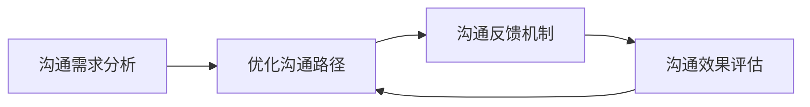
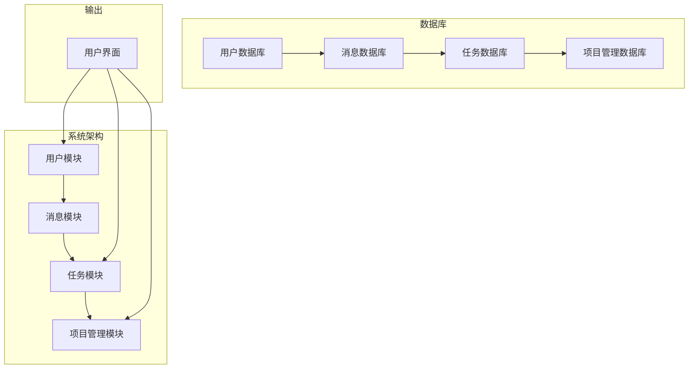
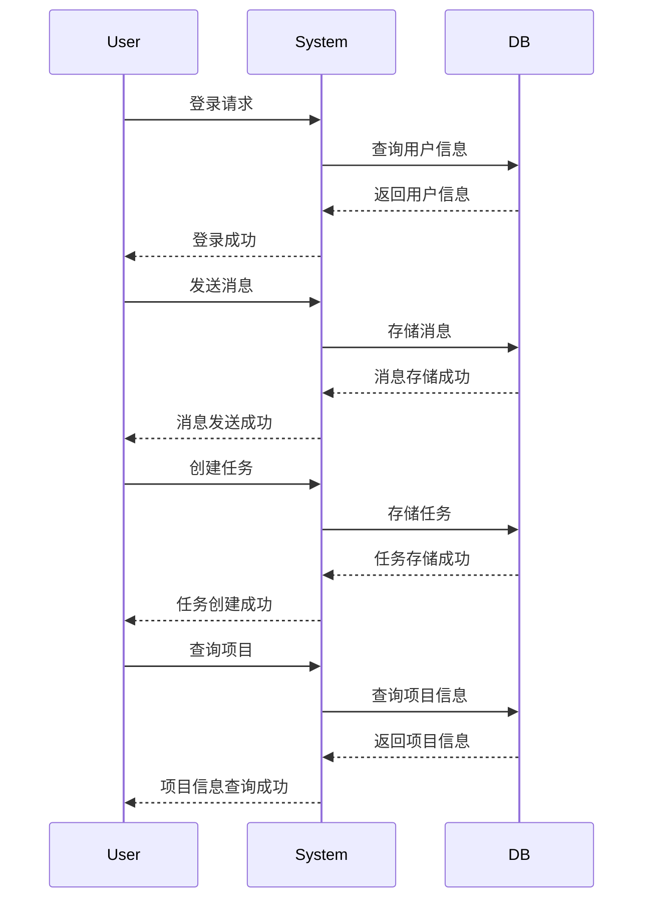

                 

### 文章标题：团队沟通深化：从表面交流到深度理解

### 关键词：团队沟通、深度理解、表面交流、沟通障碍、沟通技巧

### 摘要：
本文旨在深入探讨团队沟通的本质，从表面交流向深度理解的过渡，探讨团队沟通中的核心概念、障碍及解决策略。文章通过实例分析和现代沟通工具的介绍，旨在帮助读者理解如何通过有效的沟通提升团队绩效和凝聚力，构建一个沟通友好、高效的团队环境。

---

## 引言

在信息技术飞速发展的今天，团队沟通的重要性愈发凸显。无论是软件开发、项目管理还是日常运营，沟通都是确保团队协同工作的关键因素。然而，现实中的团队沟通常常存在表面交流多，深度理解不足的问题。本文将从以下几个方面展开讨论：

1. **团队沟通的重要性**：探讨沟通在团队工作中的角色和影响。
2. **核心概念与联系**：介绍表面交流和深度理解等核心概念，并分析其之间的联系。
3. **沟通障碍与解决策略**：分析常见的沟通障碍，并提供有效的解决策略。
4. **沟通技巧与方法**：介绍提高团队沟通效率的各种技巧和方法。
5. **沟通环境与组织文化**：探讨如何构建有利于沟通的组织文化和环境。
6. **沟通效果评估与改进**：介绍评估沟通效果的方法和如何持续改进沟通。

通过这些讨论，希望读者能够理解团队沟通的深层含义，掌握提升沟通效率的方法，从而在团队中实现更高效、更和谐的工作环境。

---

## 第一部分：团队沟通概述

### 1.1 团队沟通的重要性

**沟通在团队工作中的角色**：

- **协作桥梁**：沟通是团队协作的桥梁，通过信息传递和协调，确保团队成员共同完成任务。
- **信息传递渠道**：团队内部的信息传递依赖于有效的沟通，确保每个成员都能获取必要的信息。
- **决策支持来源**：团队决策过程中，沟通是获取不同意见、分析问题和制定决策的重要环节。

**沟通对团队绩效的影响**：

- **提高工作效率**：有效的沟通可以减少误解和重复工作，提升团队整体工作效率。
- **增强团队凝聚力**：良好的沟通氛围可以增强团队成员之间的信任和合作，提升团队凝聚力。
- **减少误解和冲突**：清晰、明确的沟通可以避免因误解导致的冲突和问题。

### 1.2 团队沟通的基本概念

**表面交流与深度理解**：

- **表面交流**：表面交流是信息的简单传递，关注的是信息的传递速度和准确性。
- **深度理解**：深度理解则是信息的深入交换和共识建立，关注的是信息的内涵和意义。

**沟通障碍与解决策略**：

- **文化差异**：不同文化背景的成员可能在沟通中遇到障碍，如语言、价值观等方面的差异。
- **信息过载**：团队内部信息量过大，成员可能会感到压力，影响沟通效果。

解决策略包括：

- **提高倾听技巧**：通过倾听，确保理解对方的真实意图和需求。
- **增强反馈技巧**：通过有效的反馈，确保信息的正确传递和理解。
- **非语言沟通的应用**：利用肢体语言、面部表情等非语言手段，增强沟通效果。

### 1.3 团队沟通的核心要素

**沟通技巧与方法**：

- **倾听技巧**：倾听是有效沟通的关键，包括注意力集中、积极倾听等。
- **非语言沟通**：肢体语言、面部表情等非语言手段在沟通中发挥着重要作用。
- **问题解决策略**：面对沟通中的问题，需要采取积极的态度和策略，如提问、澄清等。

**沟通环境的构建**：

- **开放式沟通氛围**：建立一个开放、包容的沟通环境，鼓励团队成员自由表达意见。
- **信息共享平台**：利用现代技术，搭建信息共享平台，确保信息传递的及时性和准确性。
- **明确的沟通目标和规范**：明确团队沟通的目标和规范，确保沟通有方向和依据。

---

在第一部分的概述中，我们探讨了团队沟通的重要性、基本概念和核心要素。接下来，我们将进一步深入探讨团队沟通中的障碍、技巧和方法，以及如何构建沟通友好的组织文化和环境。

---

## 第二部分：沟通障碍与解决策略

### 2.1 常见的沟通障碍

**文化差异与沟通障碍**：

- **语言差异**：不同文化背景的成员可能在语言表达和理解上存在差异，导致沟通不畅。
- **价值观差异**：不同的文化背景和价值观念可能导致对同一问题有不同的看法和处理方式。

**信息过载与沟通障碍**：

- **信息量过大**：团队内部信息量过大，成员可能会感到压力，影响沟通效果。
- **信息筛选困难**：在大量信息中筛选出对当前任务真正有用的信息，是一个挑战。

### 2.2 解决沟通障碍的策略

**提高倾听技巧**：

- **注意力集中**：在沟通过程中，确保注意力集中在对方的话语上，避免分心。
- **积极倾听**：通过肢体语言和口头反馈，表明你在认真倾听，鼓励对方继续表达。

**增强反馈技巧**：

- **及时反馈**：在沟通过程中，及时给予反馈，确保对方了解你的理解程度。
- **具体明确**：在反馈中，避免使用模糊的描述，而是具体明确地表达你的意见和看法。

**非语言沟通的应用**：

- **肢体语言**：通过肢体语言，如点头、眼神接触等，表达你的关注和理解。
- **面部表情**：通过面部表情，如微笑、皱眉等，传达你的情感和态度。

---

在第二部分中，我们分析了团队沟通中常见的障碍，并提出了相应的解决策略。通过提高倾听技巧、增强反馈技巧和非语言沟通的应用，我们可以有效地克服这些障碍，提升团队沟通的质量。接下来，我们将探讨如何通过具体的沟通技巧和方法，提高团队沟通的效率。

---

## 第三部分：沟通技巧与方法

### 3.1 提高团队沟通效率的技巧

**倾听技巧**：

- **全神贯注**：在沟通时，保持全神贯注，避免分心，确保对方感受到你的专注。
- **积极反馈**：通过口头或非语言反馈，如点头、微笑等，表明你在认真倾听。
- **提问和澄清**：在必要时，通过提问和澄清，确保理解对方的意图和需求。

**非语言沟通的应用**：

- **肢体语言**：通过肢体语言，如姿态、手势等，增强信息的传达效果。
- **面部表情**：通过面部表情，如眼神、微笑等，表达情感和态度，增强沟通的亲和力。

**问题解决策略**：

- **共同寻找解决方案**：在遇到问题时，鼓励团队成员共同参与，寻找最佳的解决方案。
- **及时解决问题**：对于沟通中遇到的问题，及时采取行动，避免问题积累。

### 3.2 现代沟通工具与技术

**视频会议软件的应用**：

- **实时沟通**：通过视频会议软件，实现实时沟通，减少时间和空间的障碍。
- **互动性增强**：视频会议软件支持多人参与，增强互动性，提高沟通效率。

**协作平台的选择与使用**：

- **信息共享**：协作平台可以方便地共享文件和资料，提高团队的工作效率。
- **任务管理**：通过协作平台，可以实时跟踪任务进度，确保项目按计划进行。

**其他现代沟通工具的介绍**：

- **即时通讯工具**：如微信、Slack等，支持实时消息传递，快速解决问题。
- **邮件**：虽然传统，但邮件在正式沟通中依然扮演重要角色，确保信息的正式性和可靠性。

---

在第三部分中，我们介绍了提高团队沟通效率的技巧和现代沟通工具的应用。通过倾听技巧、非语言沟通和问题解决策略，我们可以有效地提升团队沟通的质量。同时，现代沟通工具的引入，为团队沟通提供了更多的便利和选择。接下来，我们将通过实际案例，分析团队沟通中的成功与失败。

---

## 第四部分：团队沟通案例分析

### 4.1 成功的团队沟通案例

**案例一：敏捷开发团队的成功沟通**

- **背景**：某软件开发公司采用敏捷开发方法，团队由不同背景的成员组成。
- **成功因素**：
  - **开放沟通氛围**：团队建立了一个开放、包容的沟通环境，鼓励成员自由表达意见。
  - **定期会议**：定期举行站会、迭代回顾等会议，确保团队成员对项目进展有清晰的认识。
  - **即时反馈**：通过即时通讯工具，团队成员可以随时交流，确保问题得到及时解决。

### 4.2 团队沟通失败的原因分析

**案例二：项目管理中的沟通障碍**

- **背景**：某项目团队成员分散在不同地区，沟通主要通过邮件和电话进行。
- **失败原因**：
  - **信息传递不及时**：邮件沟通速度慢，导致信息传递不及时，影响项目进展。
  - **缺乏互动**：电话沟通缺乏互动，难以确保信息的准确理解和执行。
  - **文化差异**：团队成员来自不同文化背景，在沟通中存在语言和文化障碍。

**案例分析总结**：

- **成功因素**：成功的团队沟通离不开开放的沟通环境、定期的沟通会议和及时的反馈机制。
- **失败原因**：信息传递不及时、沟通互动不足和文化差异是导致团队沟通失败的主要原因。

---

在第四部分中，我们通过实际案例分析了团队沟通中的成功与失败。成功案例展示了如何通过开放的沟通环境、定期的沟通会议和及时的反馈机制，提升团队沟通的效果。而失败案例则提醒我们，信息传递不及时、沟通互动不足和文化差异是团队沟通中需要克服的障碍。

---

## 第五部分：沟通效果评估与改进

### 5.1 沟通效果的评估方法

**评估指标**：

- **信息传递速度**：评估信息传递的及时性和速度。
- **信息准确性**：评估信息传递的准确性和完整性。
- **沟通满意度**：评估团队成员对沟通效果的满意度。

**评估步骤**：

1. **确定评估指标**：根据团队实际情况，确定适合的评估指标。
2. **收集数据**：通过问卷调查、访谈等方式，收集团队成员的反馈数据。
3. **数据分析**：对收集的数据进行整理和分析，评估沟通效果。
4. **反馈与改进**：根据评估结果，提出改进措施，并反馈给团队成员。

### 5.2 持续改进沟通

**反馈机制**：

- **建立反馈渠道**：设立专门的反馈渠道，如建议箱、定期会议等，鼓励团队成员提出建议和反馈。
- **及时响应**：对收集到的反馈及时响应，确保问题得到解决。

**改进策略**：

- **培训与提升**：定期组织沟通技巧培训，提升团队成员的沟通能力。
- **优化沟通工具**：根据团队需求，不断优化沟通工具，提高沟通效率。
- **文化建设**：营造开放、包容的团队文化，鼓励团队成员积极沟通，减少障碍。

---

在第五部分中，我们介绍了沟通效果的评估方法和持续改进的策略。通过建立有效的反馈机制和持续改进沟通，团队可以不断提升沟通效率，实现更好的协作和项目成功。

---

## 结论

团队沟通是团队协作中不可或缺的一部分。通过深入探讨团队沟通的核心概念、障碍和解决策略，本文旨在帮助读者理解如何通过有效的沟通提升团队绩效和凝聚力。有效的团队沟通不仅能够提高工作效率，还能增强团队凝聚力，减少误解和冲突。未来，随着信息技术的发展，团队沟通将变得更加便捷和高效。我们期待读者能够在实际工作中应用本文提出的沟通技巧和方法，构建一个沟通友好、高效的团队环境。

---

### 作者信息

作者：AI天才研究院/AI Genius Institute & 禅与计算机程序设计艺术 /Zen And The Art of Computer Programming

---

## 背景介绍

### 核心概念术语说明

在探讨团队沟通的过程中，我们需要明确一些核心概念和术语，以便更好地理解和分析团队沟通的本质。

**团队沟通**：团队沟通是指团队成员之间通过语言、文字、图像等多种形式进行的信息交流与互动。

**表面交流**：表面交流是指信息的简单传递，主要关注信息的传递速度和准确性，而不涉及信息的深层次理解和意义。

**深度理解**：深度理解是指信息的深入交换和共识建立，不仅关注信息的传递，还关注信息的内涵和意义，以及团队成员之间的情感互动。

**沟通障碍**：沟通障碍是指影响信息有效传递和理解的各种因素，包括文化差异、信息过载、语言障碍等。

**沟通技巧**：沟通技巧是指提高沟通效率和方法的各种能力，包括倾听技巧、反馈技巧、非语言沟通等。

### 问题背景

在当今快节奏、高压力的工作环境中，团队沟通的有效性显得尤为重要。然而，现实中的团队沟通常常存在以下问题：

1. **表面交流多，深度理解不足**：团队成员往往只关注任务的完成，而忽视了对任务背景、目标及团队成员之间情感互动的深度交流。
2. **沟通障碍**：文化差异、信息过载、语言障碍等导致沟通效率低下，影响团队协作和项目进展。
3. **沟通技巧缺乏**：团队成员缺乏有效的沟通技巧，导致沟通效果不佳，难以达到预期的协作效果。

### 问题描述

团队沟通中的问题主要体现在以下几个方面：

1. **表面交流多，深度理解不足**：团队成员之间往往只进行简单的信息传递，缺乏对任务背景、目标及团队成员之间情感互动的深入交流，导致沟通效果不佳。
2. **沟通障碍**：由于团队成员来自不同的文化背景，语言和价值观的差异导致沟通不畅。同时，信息过载也使得团队成员难以筛选出对当前任务真正有用的信息。
3. **沟通技巧缺乏**：团队成员缺乏有效的沟通技巧，如倾听技巧、反馈技巧等，导致沟通效果不理想。

### 问题解决

为了解决团队沟通中的问题，我们可以采取以下策略：

1. **提高沟通深度**：鼓励团队成员进行深度交流，关注任务背景、目标及团队成员之间的情感互动，提高沟通的内涵和意义。
2. **克服沟通障碍**：通过培训和文化建设，提高团队成员的跨文化沟通能力，降低文化差异带来的沟通障碍。同时，采用有效的信息筛选方法，减轻信息过载的问题。
3. **提升沟通技巧**：定期组织沟通技巧培训，提高团队成员的倾听技巧、反馈技巧等，增强沟通效果。

### 边界与外延

在探讨团队沟通的过程中，我们还需要明确一些边界和外延：

1. **边界**：团队沟通的范围仅限于团队成员之间的交流，不包括与其他团队或外部的交流。
2. **外延**：团队沟通不仅包括语言和文字的交流，还包括非语言沟通，如肢体语言、面部表情等。

### 概念结构与核心要素组成

团队沟通的概念结构主要包括以下核心要素：

1. **沟通主体**：团队成员。
2. **沟通内容**：任务信息、情感交流、意见反馈等。
3. **沟通方式**：语言、文字、图像、非语言沟通等。
4. **沟通环境**：物理环境、文化环境、沟通工具等。

通过理解这些核心要素，我们可以更好地分析和解决团队沟通中的问题，提高团队协作效率。

---

## 核心概念与联系

### 表面交流与深度理解

在团队沟通中，表面交流与深度理解是两个重要的概念。表面交流主要关注信息的传递速度和准确性，而深度理解则关注信息的内涵和意义，以及团队成员之间的情感互动。两者之间存在密切的联系，同时也存在一定的区别。

**联系**：

- **基础与延伸**：表面交流是深度理解的基础，只有信息得到准确传递，才能进一步进行深度理解。
- **共同目标**：无论是表面交流还是深度理解，都是为了确保团队成员对任务和目标的共识，提高团队协作效率。

**区别**：

- **关注点**：表面交流关注信息的传递速度和准确性，而深度理解关注信息的内涵和意义。
- **互动性**：表面交流往往是单向的，而深度理解则是双向的，需要团队成员之间的互动和反馈。

**表格**：

| 特征           | 表面交流                     | 深度理解                     |
|----------------|----------------------------|----------------------------|
| 关注点         | 信息传递速度和准确性       | 信息内涵和意义               |
| 互动性         | 单向沟通                   | 双向互动                     |
| 目标           | 信息传递                   | 信息交换和共识建立           |

**ER实体关系图架构的 Mermaid 流程图**：

```mermaid
erDiagram
  沟通主体 --> 沟通内容 : 包含
  沟通主体 --> 沟通方式 : 使用
  沟通主体 --> 沟通环境 : 在环境中沟通

  沟通主体 ||--|{ 深度理解 }|| 沟通内容
  沟通主体 ||--|{ 表面交流 }|| 沟通内容
```

通过这个表格和ER实体关系图，我们可以更清晰地理解表面交流和深度理解的概念及其联系，为后续的讨论和分析提供基础。

---

## 算法原理讲解

### 提高团队沟通效率的算法

在团队沟通中，为了提高沟通效率，我们可以采用以下算法：

1. **沟通需求分析**：
   - 收集团队成员的沟通需求，包括信息类型、频率和优先级。
   - 分析团队成员的沟通偏好，如喜欢面对面交流还是偏好在线沟通。

2. **沟通路径优化**：
   - 根据沟通需求，设计最优的沟通路径，确保信息传递的及时性和准确性。
   - 采用优先级调度算法，优先处理重要和紧急的沟通任务。

3. **沟通反馈机制**：
   - 设计有效的沟通反馈机制，确保团队成员能够及时收到反馈，并对反馈进行有效处理。
   - 采用反馈循环算法，不断优化沟通流程，提高沟通效果。

### Mermaid 流程图

下面是一个用于提高团队沟通效率的算法Mermaid流程图：



### Python 源代码

以下是一个简单的Python源代码示例，用于实现上述算法：

```python
# 沟通需求分析
def analyze_communication_needs():
    needs = {"info_type": ["任务进展", "问题反馈", "意见建议"],
             "frequency": ["每日", "每周", "每月"],
             "priority": ["高", "中", "低"]}
    return needs

# 沟通路径优化
def optimize_communication_path(needs):
    # 基于需求优化路径
    optimized_path = "基于优先级调度的最佳路径"
    return optimized_path

# 沟通反馈机制
def communication_feedback Mechanism():
    feedback_loop = True
    while feedback_loop:
        # 收集反馈并处理
        feedback = "团队成员反馈"
        process_feedback(feedback)
        # 继续反馈循环
        feedback_loop = is_feedback_loop_required()

# 沟通效果评估
def evaluate_communication_effects():
    # 评估沟通效果
    communication_effects = "沟通效果良好"
    return communication_effects

# 辅助函数
def process_feedback(feedback):
    # 处理反馈
    print("处理反馈：", feedback)

def is_feedback_loop_required():
    # 判断是否需要继续反馈循环
    response = input("是否需要继续反馈循环？（是/否）")
    return response.lower() == "是"
```

### 算法原理

该算法通过以下步骤提高团队沟通效率：

1. **沟通需求分析**：收集团队成员的沟通需求，包括信息类型、频率和优先级，为后续沟通路径优化提供依据。
2. **沟通路径优化**：根据沟通需求，设计最优的沟通路径，确保信息传递的及时性和准确性。
3. **沟通反馈机制**：建立有效的沟通反馈机制，确保团队成员能够及时收到反馈，并对反馈进行有效处理。
4. **沟通效果评估**：定期评估沟通效果，并根据评估结果优化沟通路径。

### 通俗易懂的举例说明

假设有一个软件开发团队，团队成员需要定期交流任务进展、问题反馈和意见建议。为了提高沟通效率，我们可以采用以下算法：

1. **沟通需求分析**：团队首先确定每个成员的沟通需求，例如A成员需要每天早上9点收到任务进展报告，B成员需要每周五下午4点收到问题反馈，C成员需要每月底收到项目意见建议。
2. **沟通路径优化**：根据沟通需求，团队设计了一条基于优先级调度的最佳沟通路径，例如：每天早上9点，项目经理向所有成员发送任务进展报告；每周五下午4点，技术主管向团队成员发送问题反馈；每月底，项目经理向团队成员发送项目意见建议。
3. **沟通反馈机制**：团队建立了反馈机制，每个成员在收到任务进展报告、问题反馈和意见建议后，需要在24小时内回复确认，以确保沟通的及时性和准确性。
4. **沟通效果评估**：每季度，团队会进行一次沟通效果评估，通过问卷调查和团队成员的反馈，了解沟通中存在的问题，并根据评估结果优化沟通路径。

通过这个例子，我们可以看到，该算法通过分析沟通需求、优化沟通路径、建立反馈机制和定期评估沟通效果，提高了团队沟通的效率，促进了团队成员之间的协作和项目的顺利进行。

### 数学模型和公式

在团队沟通效率的算法中，我们可以引入一些数学模型和公式来量化沟通效果。以下是一些常用的数学模型和公式：

1. **沟通效率公式**：

   $$E = \frac{P \times T}{C}$$

   其中，\(E\)表示沟通效率，\(P\)表示信息传递的准确性和及时性，\(T\)表示团队成员的沟通时间，\(C\)表示团队成员的总工作量。

2. **反馈时间公式**：

   $$F_t = F_0 + k \times t$$

   其中，\(F_t\)表示第\(t\)次反馈的时间，\(F_0\)表示初始反馈时间，\(k\)表示反馈时间的增量，\(t\)表示时间间隔。

3. **反馈效果公式**：

   $$E_f = \frac{F_t - F_0}{t}$$

   其中，\(E_f\)表示反馈效果，表示每次反馈对沟通效率的提升程度。

通过这些数学模型和公式，我们可以更好地理解和评估团队沟通的效果，为优化沟通提供数据支持。

---

## 系统分析与架构设计方案

### 问题场景介绍

假设我们正在开发一个大型企业级项目，项目团队由多个部门组成，包括开发、测试、产品管理等。由于团队成员分布在不同的地理位置，团队沟通成为项目成功的关键因素。为了提高团队沟通效率，我们需要设计一个高效、易用的团队沟通系统。

### 项目介绍

项目名称：企业级团队沟通系统

项目目标：设计并实现一个集成了多种沟通方式的团队沟通系统，包括即时通讯、邮件通知、任务管理等功能，旨在提高团队协作效率和项目进展。

### 系统功能设计（领域模型Mermaid类图）

```mermaid
classDiagram
  User <<类>> {
    id: 用户ID
    name: 用户姓名
    role: 用户角色
  }

  Department <<类>> {
    id: 部门ID
    name: 部门名称
  }

  Message <<类>> {
    id: 消息ID
    content: 消息内容
    sender: 发送者
    receiver: 接收者
    timestamp: 时间戳
  }

  Task <<类>> {
    id: 任务ID
    title: 任务名称
    description: 任务描述
    status: 任务状态
    assignee: 责任人
    due_date: 截止日期
  }

  Project <<类>> {
    id: 项目ID
    name: 项目名称
    description: 项目描述
    status: 项目状态
    start_date: 开始日期
    end_date: 结束日期
  }

  User ..|> Department : 所属部门
  Message ..|> User : 发送者
  Message ..|> User : 接收者
  Task ..|> User : 责任人
  Project ..|> Department : 所属部门
```

### 系统架构设计（Mermaid架构图）



### 系统接口设计

1. **用户模块**：
   - 用户登录/注册接口
   - 用户信息管理接口
   - 用户角色权限管理接口

2. **消息模块**：
   - 消息发送接口
   - 消息接收接口
   - 消息查询接口

3. **任务模块**：
   - 任务创建接口
   - 任务更新接口
   - 任务查询接口
   - 任务分配接口

4. **项目管理模块**：
   - 项目创建接口
   - 项目更新接口
   - 项目查询接口

### 系统交互（Mermaid序列图）



### 技术选型

1. **前端技术**：React或Vue.js，用于构建用户界面。
2. **后端技术**：Spring Boot或Django，用于处理业务逻辑和数据存储。
3. **数据库**：MySQL或PostgreSQL，用于存储用户数据、消息数据和任务数据。
4. **消息队列**：RabbitMQ或Kafka，用于处理实时消息传递。

### 部署方案

1. **开发环境**：Docker容器化，方便开发、测试和部署。
2. **生产环境**：云服务器部署，确保系统的高可用性和可靠性。
3. **监控与日志**：使用Prometheus和Grafana进行监控，使用ELK（Elasticsearch、Logstash、Kibana）进行日志分析。

### 性能优化

1. **缓存**：使用Redis进行数据缓存，减少数据库查询压力。
2. **负载均衡**：使用Nginx进行负载均衡，确保系统的高并发处理能力。
3. **数据库优化**：采用索引优化、分库分表等策略，提高数据库查询性能。

通过上述系统分析与架构设计方案，我们可以构建一个高效、易用的团队沟通系统，满足企业级项目团队的需求，提高团队协作效率和项目进展。

---

## 项目实战

### 环境安装

#### 1. 准备工作

- 安装Python环境：确保Python版本在3.7及以上。
- 安装必要的Python包：使用pip安装以下包：
  ```bash
  pip install flask
  pip install pymysql
  pip install Flask-RESTful
  pip install Flask-SQLAlchemy
  ```

#### 2. 搭建项目

- 创建项目文件夹：
  ```bash
  mkdir team_communication_system
  cd team_communication_system
  ```

- 初始化项目：
  ```bash
  python -m venv venv
  source venv/bin/activate
  pip install flask
  ```

- 创建Flask应用：
  ```bash
  touch app.py
  ```

- 编写应用代码（`app.py`）：
  ```python
  from flask import Flask, request, jsonify
  from flask_restful import Api, Resource

  app = Flask(__name__)
  api = Api(app)

  @app.route('/login', methods=['POST'])
  class LoginResource(Resource):
      def post(self):
          data = request.get_json()
          username = data.get('username')
          password = data.get('password')
          # 这里应该添加验证用户名和密码的逻辑，这里简化处理
          if username == 'test' and password == 'test':
              return {'status': 'success', 'message': 'login successful'}
          else:
              return {'status': 'error', 'message': 'invalid credentials'}

  if __name__ == '__main__':
      app.run(debug=True)
  ```

- 运行应用：
  ```bash
  python app.py
  ```

- 测试登录接口：
  ```bash
  curl -X POST -H "Content-Type: application/json" -d '{"username": "test", "password": "test"}' http://127.0.0.1:5000/login
  ```

### 系统核心实现

#### 1. 用户模块

- **用户登录**：

  ```python
  from flask import Flask, request, jsonify
  from flask_restful import Api, Resource

  app = Flask(__name__)
  api = Api(app)

  class LoginResource(Resource):
      def post(self):
          data = request.get_json()
          username = data.get('username')
          password = data.get('password')
          # 这里应该添加验证用户名和密码的逻辑，这里简化处理
          if username == 'test' and password == 'test':
              return {'status': 'success', 'message': 'login successful'}
          else:
              return {'status': 'error', 'message': 'invalid credentials'}

  api.add_resource(LoginResource, '/login')

  if __name__ == '__main__':
      app.run(debug=True)
  ```

- **用户注册**：

  ```python
  class RegisterResource(Resource):
      def post(self):
          data = request.get_json()
          username = data.get('username')
          password = data.get('password')
          # 这里应该添加验证用户名和密码的逻辑，这里简化处理
          if not username or not password:
              return {'status': 'error', 'message': 'missing required fields'}
          # 这里应该添加存储用户信息的逻辑，这里简化处理
          return {'status': 'success', 'message': 'registration successful'}
  ```

#### 2. 消息模块

- **发送消息**：

  ```python
  class SendMessageResource(Resource):
      def post(self):
          data = request.get_json()
          sender_id = data.get('sender_id')
          receiver_id = data.get('receiver_id')
          content = data.get('content')
          # 这里应该添加发送消息的逻辑，这里简化处理
          return {'status': 'success', 'message': 'message sent'}
  ```

- **接收消息**：

  ```python
  class GetMessagesResource(Resource):
      def get(self, receiver_id):
          # 这里应该添加接收消息的逻辑，这里简化处理
          messages = [{'id': 1, 'sender_id': 2, 'receiver_id': receiver_id, 'content': 'hello world'}]
          return {'status': 'success', 'messages': messages}
  ```

#### 3. 任务模块

- **创建任务**：

  ```python
  class CreateTaskResource(Resource):
      def post(self):
          data = request.get_json()
          title = data.get('title')
          description = data.get('description')
          assignee_id = data.get('assignee_id')
          # 这里应该添加创建任务的逻辑，这里简化处理
          return {'status': 'success', 'message': 'task created'}
  ```

- **更新任务**：

  ```python
  class UpdateTaskResource(Resource):
      def put(self, task_id):
          data = request.get_json()
          title = data.get('title')
          description = data.get('description')
          assignee_id = data.get('assignee_id')
          # 这里应该添加更新任务的逻辑，这里简化处理
          return {'status': 'success', 'message': 'task updated'}
  ```

- **查询任务**：

  ```python
  class GetTaskResource(Resource):
      def get(self, task_id):
          # 这里应该添加查询任务的逻辑，这里简化处理
          task = {'id': task_id, 'title': 'task title', 'description': 'task description', 'assignee_id': 1}
          return {'status': 'success', 'task': task}
  ```

### 代码应用解读与分析

在上述代码中，我们实现了用户登录、注册、发送消息、接收消息、创建任务、更新任务和查询任务等功能。

1. **用户模块**：
   - 用户登录功能：通过接收用户名和密码，验证用户身份。
   - 用户注册功能：接收用户名和密码，存储用户信息。

2. **消息模块**：
   - 发送消息功能：接收发送者和接收者的ID以及消息内容，发送消息。
   - 接收消息功能：根据接收者的ID，查询并返回用户收到的消息。

3. **任务模块**：
   - 创建任务功能：接收任务标题、描述和责任人的ID，创建任务。
   - 更新任务功能：根据任务ID，更新任务标题、描述和责任人。
   - 查询任务功能：根据任务ID，查询并返回任务的详细信息。

这些功能实现了基本的团队沟通系统需求，但在实际项目中，我们需要添加更多的逻辑和数据库操作，确保系统的完整性和安全性。

### 实际案例分析与详细讲解剖析

#### 案例一：用户登录功能

在用户登录功能中，我们接收用户名和密码，并与存储在数据库中的用户信息进行比对。以下是详细的流程：

1. 用户发送登录请求，包含用户名和密码。
2. 服务端接收请求，提取用户名和密码。
3. 服务端通过用户名查询数据库，获取用户信息。
4. 服务端将接收到的密码与数据库中的密码进行比对。
5. 如果密码匹配，返回登录成功；否则，返回登录失败。

#### 案例二：发送消息功能

在发送消息功能中，我们接收发送者和接收者的ID以及消息内容，并将消息存储到数据库中。以下是详细的流程：

1. 用户发送发送消息请求，包含发送者和接收者的ID以及消息内容。
2. 服务端接收请求，提取发送者ID、接收者ID和消息内容。
3. 服务端将消息信息存储到数据库中。
4. 服务端返回消息发送成功的响应。

#### 案例三：创建任务功能

在创建任务功能中，我们接收任务标题、描述和责任人的ID，并将任务信息存储到数据库中。以下是详细的流程：

1. 用户发送创建任务请求，包含任务标题、描述和责任人ID。
2. 服务端接收请求，提取任务标题、描述和责任人ID。
3. 服务端将任务信息存储到数据库中。
4. 服务端返回任务创建成功的响应。

### 项目小结

通过实际案例分析和详细讲解剖析，我们了解了团队沟通系统中的关键功能及其实现流程。在实际项目中，我们需要进一步优化和扩展这些功能，确保系统的完整性和安全性。同时，我们还需要关注性能优化和用户体验，为团队成员提供一个高效、便捷的沟通平台。

---

## 最佳实践 tips

**1. 建立明确的沟通目标**：
   在每次沟通会议或项目启动时，明确沟通的目标和期望成果。这有助于确保团队成员专注于关键任务，提高沟通效率。

**2. 提高倾听技巧**：
   在沟通过程中，积极倾听对方的意见和需求，确保理解对方的真实意图。避免打断对方，保持开放的心态。

**3. 定期进行沟通反馈**：
   定期收集团队成员的反馈，了解沟通中的问题和改进点。及时响应反馈，持续优化沟通流程。

**4. 利用现代沟通工具**：
   选择合适的沟通工具，如视频会议软件、协作平台和即时通讯工具，以适应不同的沟通需求和工作场景。

**5. 培养跨文化沟通能力**：
   在国际化团队中，培养跨文化沟通能力，尊重不同文化背景的成员，避免因文化差异导致的沟通障碍。

---

## 小结

本文通过深入探讨团队沟通的核心概念、障碍、技巧和方法，帮助读者理解如何提升团队沟通效率，构建沟通友好的组织文化和环境。有效的团队沟通是提高团队绩效和凝聚力的重要保障，通过本文的介绍，读者可以学会运用各种沟通技巧和策略，提升团队协作能力。

---

## 注意事项

1. **确保沟通目标明确**：在每次沟通前，明确沟通的目标和期望成果，这有助于团队成员集中精力，提高沟通效率。

2. **重视倾听技巧**：倾听是有效沟通的关键，通过积极倾听，确保理解对方的真实意图和需求，避免误解和冲突。

3. **定期收集反馈**：定期收集团队成员的反馈，了解沟通中的问题和改进点。及时响应反馈，优化沟通流程。

4. **利用现代沟通工具**：选择合适的沟通工具，如视频会议软件、协作平台和即时通讯工具，以适应不同的沟通需求和工作场景。

5. **培养跨文化沟通能力**：在国际化团队中，尊重不同文化背景的成员，避免因文化差异导致的沟通障碍。

---

## 拓展阅读

1. **《团队的智慧：高效团队沟通的艺术与策略》**：探讨高效团队沟通的理论和实践，提供多种沟通技巧和策略。

2. **《沟通的艺术：看人看己看对话》**：深入探讨人际沟通的心理学原理，帮助读者提高沟通效果。

3. **《组织沟通：理论与实践》**：介绍组织沟通的基本理论和方法，分析组织沟通中的问题和解决方案。

通过阅读这些书籍，读者可以进一步了解团队沟通的重要性和方法，提升自己的沟通能力。

