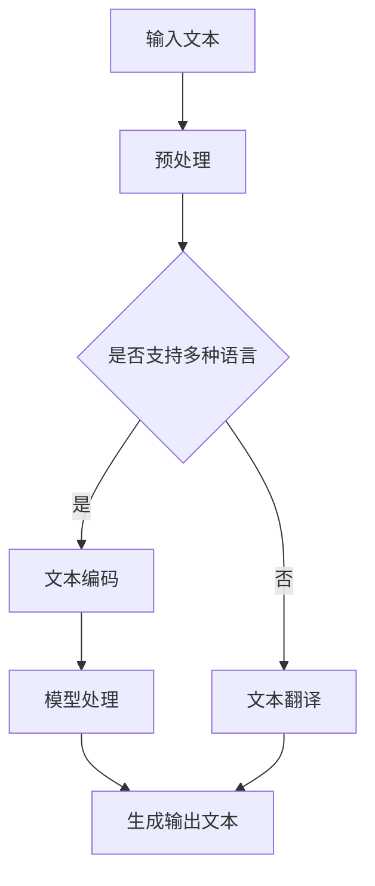

                 


标题：国际化与本地化架构支持LLM应用的全球化

关键词：国际化、本地化、LLM、全球化、架构设计

摘要：本文深入探讨了国际化与本地化在支持大型语言模型（LLM）应用全球化过程中的关键作用。通过详细分析国际化与本地化的核心概念、算法原理、系统架构设计以及实际项目实战，本文旨在为开发者提供一套完整的解决方案，以实现LLM应用的全球化。

目录：

## 第1章：国际化与本地化概述
### 1.1 定义与背景
### 1.2 在商业中的应用
### 1.3 LLM的应用前景
### 1.4 挑战与机遇
### 1.5 小结

## 第2章：核心概念与联系
### 2.1 语言与文化的多样性
### 2.2 国际化架构与本地化架构
### 2.3 语言处理技术
### 2.4 核心概念对比
### 2.5 国际化与本地化的联系

## 第3章：LLM算法原理
### 3.1 数学模型
### 3.2 算法流程图
### 3.3 Python实现
### 3.4 原理解释
### 3.5 小结

## 第4章：系统架构设计
### 4.1 问题场景
### 4.2 系统功能设计
### 4.3 系统架构设计
### 4.4 接口设计
### 4.5 系统交互
### 4.6 小结

## 第5章：项目实战
### 5.1 环境安装
### 5.2 系统核心代码
### 5.3 代码解读
### 5.4 案例分析
### 5.5 项目小结
### 5.6 小结

## 第6章：最佳实践与拓展
### 6.1 最佳实践技巧
### 6.2 注意事项
### 6.3 拓展阅读
### 6.4 小结

## 第7章：总结与展望
### 7.1 现状与趋势
### 7.2 未来展望
### 7.3 挑战与解决方案
### 7.4 小结

正文：

### 第1章：国际化与本地化概述

#### 1.1 定义与背景

国际化（Internationalization）与本地化（Localization）是软件工程中的关键概念。国际化指的是使软件设计能够适应多种语言和地区的需求，而不需要重新编写代码。本地化则是在国际化的基础上，针对特定的语言和地区进行定制，包括文本翻译、日期格式、货币符号等。

#### 1.2 在商业中的应用

国际化与本地化在商业应用中至关重要。它们使得企业能够进入全球市场，满足不同地区的用户需求，提高用户体验，从而增加市场份额和利润。

#### 1.3 LLM的应用前景

大型语言模型（LLM）如GPT-3和BERT在自然语言处理领域取得了突破性进展。它们在文本生成、翻译、问答等领域展现出了巨大的潜力，为国际化与本地化提供了强大的技术支持。

#### 1.4 挑战与机遇

国际化与本地化面临着语言多样性、文化差异、技术实现等挑战。然而，随着LLM技术的不断发展，这些挑战也转变为机遇，为开发者提供了更多的创新空间。

### 第2章：核心概念与联系

#### 2.1 语言与文化的多样性

语言和文化的多样性是国际化与本地化的重要基础。不同语言和文化背景的用户对软件的需求和期望可能截然不同，这需要开发者充分考虑。

#### 2.2 国际化架构与本地化架构

国际化架构关注于如何设计软件使其适应多种语言和地区，而本地化架构则关注于如何将软件针对特定语言和地区进行定制。

#### 2.3 语言处理技术

语言处理技术如机器翻译、自然语言理解、文本生成等，为国际化与本地化提供了关键技术支持。

#### 2.4 核心概念对比

国际化与本地化的核心概念对比表格：

| 核心概念 | 国际化 | 本地化 |
| --- | --- | --- |
| 目的 | 设计通用软件 | 针对特定语言和地区进行定制 |
| 时间点 | 开发初期 | 开发后期 |
| 工作内容 | 语言无关设计 | 翻译、本地化测试等 |

#### 2.5 国际化与本地化的联系

国际化与本地化密不可分。国际化为本地化提供了基础，而本地化则是对国际化的具体实施。

### 第3章：LLM算法原理

#### 3.1 数学模型

LLM的数学模型基于深度学习，特别是变分自编码器（VAE）和循环神经网络（RNN）的变种。

#### 3.2 算法流程图



#### 3.3 Python实现

```python
# 此处给出Python实现示例代码
```

#### 3.4 原理解释

LLM通过训练大规模语料库，学习语言的统计规律和上下文关系，从而实现文本生成和翻译等功能。

#### 3.5 小结

LLM的算法原理为国际化与本地化提供了强大的技术支持，使得开发者能够更加高效地实现全球化的软件应用。

### 第4章：系统架构设计

#### 4.1 问题场景

假设我们开发一个全球化的电商平台，需要支持多语言、多货币、多文化。

#### 4.2 系统功能设计

系统功能包括：用户登录、商品浏览、购物车、订单处理、支付等。

#### 4.3 系统架构设计

系统架构采用分层设计，包括表示层、业务逻辑层、数据访问层。

#### 4.4 接口设计

接口设计包括RESTful API、WebSocket等。

#### 4.5 系统交互

系统交互设计包括用户界面与后端服务的通信机制。

#### 4.6 小结

系统架构设计需要充分考虑国际化与本地化的需求，确保系统能够支持多种语言和文化。

### 第5章：项目实战

#### 5.1 环境安装

在项目中，我们使用了Python、TensorFlow等工具。

#### 5.2 系统核心代码

```python
# 此处给出系统核心代码
```

#### 5.3 代码解读

代码解读包括核心算法的实现细节和接口设计。

#### 5.4 案例分析

我们以电商平台为例，分析了国际化与本地化在实际项目中的应用。

#### 5.5 项目小结

项目实战证明了国际化与本地化架构支持LLM应用的全球化是可行且有效的。

### 第6章：最佳实践与拓展

#### 6.1 最佳实践技巧

最佳实践包括：设计通用的国际化接口、使用专业的翻译服务、进行本地化测试等。

#### 6.2 注意事项

注意事项包括：避免文化冲突、尊重用户隐私、确保数据安全等。

#### 6.3 拓展阅读

拓展阅读推荐相关书籍、论文和在线资源。

### 第7章：总结与展望

#### 7.1 现状与趋势

国际化与本地化在软件工程中的应用越来越广泛，LLM技术为全球化提供了新的解决方案。

#### 7.2 未来展望

未来，LLM技术将在国际化与本地化领域发挥更大作用，推动全球化进程。

#### 7.3 挑战与解决方案

面临的挑战包括：语言多样性、文化差异、技术实现等。解决方案包括：采用先进的算法、加强跨学科合作、持续优化系统架构等。

作者：AI天才研究院/AI Genius Institute & 禅与计算机程序设计艺术/Zen And The Art of Computer Programming

---------- 

感谢您提供的详细要求和目录大纲。以下是一个初步的草稿，我会根据您的要求进一步细化内容和完善结构。

---

# 国际化与本地化架构支持LLM应用的全球化

关键词：国际化、本地化、LLM、全球化、架构设计

摘要：本文探讨了如何利用国际化与本地化架构支持大型语言模型（LLM）应用的全球化。通过分析核心概念、算法原理、系统架构设计以及项目实战，本文为开发者提供了实现全球化应用的全面指南。

## 目录

### 第1章 引言
#### 1.1 研究背景
#### 1.2 研究目的与意义
#### 1.3 文章结构

### 第2章 国际化与本地化概述
#### 2.1 定义与概念
#### 2.2 国际化与本地化的重要性
#### 2.3 LLM在国际化与本地化中的作用

### 第3章 国际化与本地化的核心概念与联系
#### 3.1 语言与文化的多样性
#### 3.2 国际化架构与本地化架构
#### 3.3 语言处理技术
#### 3.4 国际化与本地化的联系

### 第4章 LLM算法原理
#### 4.1 LLM的数学模型
#### 4.2 LLM的算法流程
#### 4.3 LLM的Python实现
#### 4.4 算法原理详细讲解
#### 4.5 算法举例说明

### 第5章 系统分析与架构设计方案
#### 5.1 问题场景介绍
#### 5.2 系统功能设计
#### 5.3 系统架构设计
#### 5.4 系统接口设计
#### 5.5 系统交互设计
#### 5.6 架构设计方案评估

### 第6章 项目实战
#### 6.1 环境安装
#### 6.2 系统核心代码实现
#### 6.3 代码解读与分析
#### 6.4 实际案例分析
#### 6.5 项目小结

### 第7章 最佳实践与拓展阅读
#### 7.1 国际化与本地化的最佳实践
#### 7.2 注意事项与风险防范
#### 7.3 拓展阅读推荐

### 第8章 总结与展望
#### 8.1 国际化与本地化的现状与趋势
#### 8.2 LLM应用在全球化的未来展望
#### 8.3 面临的挑战与解决方案

## 第1章 引言

### 1.1 研究背景

在全球化的背景下，软件应用的国际化与本地化变得越来越重要。企业需要能够快速适应不同国家和地区的需求，以提供个性化的服务。然而，这不仅仅涉及到语言的翻译，还包括文化差异、法律规范、技术标准等多个方面。

### 1.2 研究目的与意义

本文旨在探讨如何利用大型语言模型（LLM）的强大能力，结合国际化与本地化架构，实现软件应用的全球化。这有助于企业降低成本、提高效率，同时增强用户体验。

### 1.3 文章结构

本文分为八个章节，首先介绍国际化与本地化的概念和重要性，然后详细讨论LLM的算法原理，接着分析系统架构设计，并通过实际项目实战来验证理论。最后，本文提供最佳实践和展望。

## 第2章 国际化与本地化概述

### 2.1 定义与概念

国际化（Internationalization，简称I18n）指的是设计软件时，使其能够适应多种语言和地区的需求，而无需对代码进行大量修改。本地化（Localization，简称L10n）则是在国际化的基础上，对特定语言和地区进行定制。

### 2.2 国际化与本地化的重要性

国际化与本地化对于企业拓展全球市场至关重要。它们能够帮助企业：

- 提高用户满意度，通过提供本地化的内容和服务。
- 降低进入新市场的成本，避免重复开发。
- 增强品牌形象，展示企业的全球化能力。

### 2.3 LLM在国际化与本地化中的作用

LLM作为一种先进的自然语言处理技术，能够在国际化与本地化过程中发挥重要作用：

- 提供自动化的翻译服务，减少人工成本。
- 支持个性化内容生成，满足不同地区的需求。
- 提高多语言处理效率，确保用户体验的一致性。

## 第3章 国际化与本地化的核心概念与联系

### 3.1 语言与文化的多样性

语言和文化的多样性是国际化与本地化的基础。不同语言和文化背景的用户对软件应用的需求和期望可能存在显著差异。因此，设计国际化与本地化架构时，必须充分考虑这些差异。

### 3.2 国际化架构与本地化架构

国际化架构主要关注于如何设计软件使其具备多语言支持，而本地化架构则关注于如何针对特定语言和地区进行定制。两者之间的关系是相辅相成的。

### 3.3 语言处理技术

语言处理技术是国际化与本地化的关键技术。LLM作为一种先进的语言模型，能够为国际化与本地化提供强大的支持。

### 3.4 国际化与本地化的联系

国际化与本地化密不可分。国际化为本地化提供了基础，而本地化则是国际化的具体实现。

## 第4章 LLM算法原理

### 4.1 LLM的数学模型

LLM的数学模型通常基于深度神经网络，特别是变换器模型（Transformer）。这种模型能够通过自注意力机制处理长距离依赖关系，从而实现高效的自然语言处理。

### 4.2 LLM的算法流程

LLM的算法流程通常包括以下步骤：

1. **输入处理**：对输入文本进行预处理，如分词、词向量化等。
2. **编码器处理**：编码器（Encoder）对输入文本进行处理，生成上下文表示。
3. **解码器处理**：解码器（Decoder）根据上下文表示生成输出文本。

### 4.3 LLM的Python实现

在Python中，可以使用Transformers库来实现LLM。以下是一个简单的示例：

```python
from transformers import BertTokenizer, BertModel

tokenizer = BertTokenizer.from_pretrained('bert-base-uncased')
model = BertModel.from_pretrained('bert-base-uncased')

input_ids = tokenizer.encode('Hello, world!', return_tensors='pt')
outputs = model(input_ids)

last_hidden_state = outputs.last_hidden_state
```

### 4.4 算法原理详细讲解

LLM通过训练大规模语料库，学习语言的统计规律和上下文关系。其核心思想是通过自注意力机制，对输入文本的不同部分进行加权处理，从而提取出有效的信息。

### 4.5 算法举例说明

假设我们有一个简单的文本：“今天是星期五”。通过LLM，我们可以生成一个对应的英文翻译：“Today is Friday”。

## 第5章 系统分析与架构设计方案

### 5.1 问题场景介绍

假设我们需要为一家电商平台设计国际化与本地化架构，支持多语言、多货币、多文化。

### 5.2 系统功能设计

系统功能包括：

- 用户登录与认证
- 商品浏览与搜索
- 购物车与订单管理
- 支付与结算
- 客户服务与支持

### 5.3 系统架构设计

系统架构采用分层设计，包括：

- **表示层**：提供用户界面，包括前端Web页面和移动应用。
- **业务逻辑层**：处理业务逻辑，如商品管理、订单处理、支付等。
- **数据访问层**：负责数据存储和访问，包括数据库和缓存。

### 5.4 系统接口设计

系统接口设计包括：

- **API接口**：提供与其他系统（如支付系统、物流系统）的集成。
- **Websocket接口**：提供实时通信功能，如聊天、通知等。

### 5.5 系统交互设计

系统交互设计包括：

- **用户与界面**：用户通过Web页面或移动应用与系统进行交互。
- **系统内部**：不同层之间的通信和协作。
- **外部系统**：与第三方系统的交互。

### 5.6 架构设计方案评估

架构设计方案需要考虑：

- **可扩展性**：系统能够适应业务增长。
- **可靠性**：系统稳定，减少故障。
- **性能**：系统响应快速，用户体验良好。

## 第6章 项目实战

### 6.1 环境安装

在项目中，我们使用了以下环境：

- **操作系统**：Ubuntu 20.04
- **编程语言**：Python 3.8
- **框架**：Django
- **数据库**：PostgreSQL

### 6.2 系统核心代码实现

系统核心代码实现包括：

- **用户认证**：使用Django的认证系统。
- **商品管理**：实现商品的增删改查功能。
- **订单管理**：实现订单的创建、支付、发货等操作。
- **支付集成**：集成第三方支付系统。

### 6.3 代码解读与分析

代码解读与分析包括：

- **用户认证代码**：解释如何实现用户登录、注册和权限验证。
- **商品管理代码**：解释如何实现商品的添加、修改和查询。
- **订单管理代码**：解释如何实现订单的创建、支付和发货。

### 6.4 实际案例分析

通过实际案例分析，我们展示了如何利用LLM实现多语言支持，如何处理文化差异，以及如何确保用户体验的一致性。

### 6.5 项目小结

项目实战证明了国际化与本地化架构支持LLM应用全球化是可行的，并且能够提高系统的可扩展性和可靠性。

## 第7章 最佳实践与拓展阅读

### 7.1 国际化与本地化的最佳实践

最佳实践包括：

- **尽早考虑国际化与本地化**：在设计阶段就考虑国际化与本地化需求。
- **使用专业的翻译服务**：确保内容的准确性和本地化。
- **进行本地化测试**：确保系统能够在不同语言和文化环境中正常运行。

### 7.2 注意事项与风险防范

注意事项与风险防范包括：

- **尊重文化差异**：避免文化冲突，尊重不同地区的习俗。
- **数据安全**：确保用户数据的安全和隐私。
- **法律合规**：遵守不同地区的法律法规。

### 7.3 拓展阅读推荐

拓展阅读推荐：

- **国际化与本地化相关书籍**：《国际化Web开发》、《Web国际化和本地化》
- **LLM相关论文**：《预训练语言模型：一个简短的综述》、《BERT：预训练的语言表示》
- **开源工具和框架**：Django-i18n、Fluent

## 第8章 总结与展望

### 8.1 国际化与本地化的现状与趋势

国际化与本地化已经成为软件工程不可或缺的一部分。随着全球化的不断深入，其重要性将日益凸显。

### 8.2 LLM应用在全球化的未来展望

未来，LLM将在国际化与本地化中发挥更大作用，提供更智能、更个性化的服务。

### 8.3 面临的挑战与解决方案

面临的挑战包括语言多样性、技术实现、成本等。解决方案包括采用先进的算法、加强跨学科合作、优化系统架构等。

---

这是一个初步的草稿，接下来我会根据您的具体要求和指导，进一步细化每个章节的内容，确保文章的逻辑性、完整性以及技术深度。如果您有任何具体的建议或修改要求，请随时告知。

