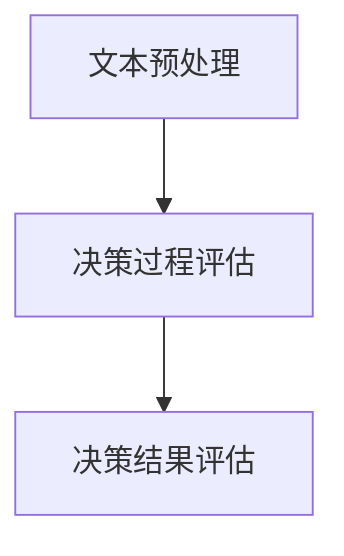
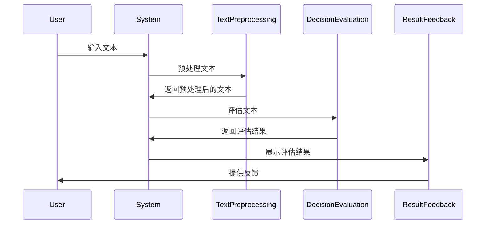

                 


### 1.文章标题：《基于Anthropic AI的LLM伦理决策评估》

### 2.文章关键词：

- Anthropic AI
- LLM
- 伦理决策
- 评估
- AI伦理

### 3.文章摘要：

本文将深入探讨基于Anthropic AI的LLM伦理决策评估，首先介绍Anthropic AI与LLM的基本概念和背景，然后阐述伦理决策评估的重要性和方法。接着，我们通过详细的算法原理讲解和Python源代码实现，展示如何构建和评估LLM的伦理决策能力。文章最后，我们将通过一个实际项目案例，展示如何在实际应用中部署和优化这一评估系统。

---

## 目录

----------------------------------------------------------------
# 基于Anthropic AI的LLM伦理决策评估

> 关键词：Anthropic AI，LLM，伦理决策，评估，AI伦理

> 摘要：本文旨在探讨如何利用Anthropic AI进行LLM（大型语言模型）的伦理决策评估。首先，我们将介绍Anthropic AI和LLM的基本概念，然后讨论伦理决策评估的必要性和方法。随后，通过算法原理和Python源代码的讲解，阐述如何实现这一评估。最后，我们将通过一个实际项目案例，展示如何将这一评估系统应用于实际场景。

## 第一部分：背景介绍

### 1.1 问题背景

Anthropic AI是一种结合了人类反馈和自主学习能力的人工智能系统，旨在使AI更好地理解人类意图并做出合理的决策。而LLM是近年来在自然语言处理领域取得巨大进展的一种模型，其能够生成流畅且符合语法规则的自然语言文本。

然而，随着AI和LLM技术的发展，AI伦理问题日益凸显。在 Anthropic AI 和 LLM 的应用中，如何确保其决策的伦理性，成为了一个亟待解决的问题。

### 1.2 问题描述

Anthropic AI 和 LLM 在实际应用中，可能会面临以下伦理问题：

- **偏见**：AI 和 LLM 可能会由于训练数据的不公平或偏见而产生歧视性的决策。
- **隐私**：AI 和 LLM 在处理用户数据时，可能会侵犯用户的隐私。
- **自主性**：AI 和 LLM 的自主决策能力可能会超越人类的伦理和道德标准。

### 1.3 问题解决

解决上述伦理问题，需要从以下几个方面进行：

- **伦理决策评估**：通过评估模型在特定任务中的决策过程和结果，判断其是否遵循伦理原则。
- **监督机制**：建立有效的监督机制，确保 AI 和 LLM 的决策过程和结果符合伦理标准。
- **透明性**：提高 AI 和 LLM 决策过程的透明度，使其易于被人类理解和监督。

### 1.4 边界与外延

本文主要关注 Anthropic AI 和 LLM 的伦理决策评估，但伦理问题并不仅限于这些领域。在其他 AI 应用场景中，如自动驾驶、医疗诊断等，同样需要关注伦理问题。因此，本文的研究具有广泛的外延和应用价值。

## 1.5 本章小结

本节主要介绍了基于Anthropic AI的LLM伦理决策评估的背景、问题描述和解决方法，以及研究的边界和外延。在接下来的章节中，我们将进一步探讨 Anthropic AI 和 LLM 的基本概念，以及如何进行伦理决策评估。

## 第二部分：核心概念与原理

### 2.1 Anthropic AI概述

Anthropic AI是一种结合了人类反馈和自主学习能力的人工智能系统。它通过模仿人类的学习和决策过程，使 AI 更好地理解人类意图并做出合理的决策。

#### 2.1.1 定义

Anthropic AI 的定义可以概括为：一种能够通过持续学习和适应环境变化，从而实现自主学习和决策的人工智能系统。

#### 2.1.2 核心特点

- **自主学习能力**：Anthropic AI 能够通过不断学习和适应环境，提升自身的性能和决策能力。
- **人类反馈**：Anthropic AI 能够接收人类提供的反馈，并根据反馈调整自身的行为和决策。

#### 2.1.3 与传统AI的区别

与传统的 AI 系统相比，Anthropic AI 具有更强的自主学习和适应能力，能够更好地理解和执行人类的意图。

### 2.2 LLM伦理决策评估原理

LLM（大型语言模型）是一种基于深度学习技术的自然语言处理模型，其能够生成流畅且符合语法规则的自然语言文本。

#### 2.2.1 定义

LLM 的定义可以概括为：一种能够通过大规模语料库的训练，生成自然语言文本的大型深度学习模型。

#### 2.2.2 核心特点

- **大规模训练**：LLM 通过对大规模语料库的训练，获取丰富的语言知识和表达方式。
- **灵活生成**：LLM 能够根据输入的 prompt，生成符合语法规则、语义连贯的自然语言文本。

#### 2.2.3 伦理决策评估方法

LLM 的伦理决策评估主要包括以下几个方面：

- **决策过程评估**：评估 LLM 在生成文本时的决策过程，判断其是否遵循伦理原则。
- **决策结果评估**：评估 LLM 生成的文本内容，判断其是否符合伦理标准。

### 2.3 关键概念对比

#### 2.3.1 Anthropic AI 与 AGI 的对比

Anthropic AI 和 AGI（通用人工智能）是两个不同的概念。Anthropic AI 是一种能够通过持续学习和适应环境变化，实现自主学习和决策的人工智能系统，而 AGI 是一种具有广泛认知能力，能够像人类一样理解和解决问题的智能体。

#### 2.3.2 LLM 伦理决策评估方法对比

LLM 伦理决策评估方法主要包括决策过程评估和决策结果评估。决策过程评估关注 LLM 在生成文本时的决策过程，判断其是否遵循伦理原则。而决策结果评估则关注 LLM 生成的文本内容，判断其是否符合伦理标准。

## 2.4 本章小结

本节主要介绍了 Anthropic AI 和 LLM 的基本概念、核心特点以及伦理决策评估原理。在接下来的章节中，我们将通过算法原理和 Python 源代码的讲解，进一步探讨如何实现伦理决策评估。

## 第三部分：算法原理与实现

### 3.1 算法原理

#### 3.1.1 LLM伦理决策评估算法概述

LLM伦理决策评估算法是一种用于评估大型语言模型（LLM）在生成文本时是否遵循伦理原则的方法。该算法主要通过以下步骤实现：

1. **文本预处理**：对输入文本进行清洗和预处理，以便于后续分析。
2. **决策过程评估**：分析 LLM 在生成文本过程中的决策过程，判断其是否遵循伦理原则。
3. **决策结果评估**：对生成的文本内容进行评估，判断其是否符合伦理标准。

#### 3.1.2 算法mermaid流程图



#### 3.1.3 算法原理Python源代码实现

```python
import nltk
from nltk.tokenize import sent_tokenize
from nltk.corpus import stopwords
from sklearn.feature_extraction.text import TfidfVectorizer
from sklearn.metrics.pairwise import cosine_similarity

def preprocess_text(text):
    # 清洗和预处理文本
    sentences = sent_tokenize(text)
    cleaned_sentences = []
    for sentence in sentences:
        cleaned_sentence = " ".join([word for word in sentence.split() if word not in stopwords.words('english')])
        cleaned_sentences.append(cleaned_sentence)
    return " ".join(cleaned_sentences)

def evaluate_decision_process(text, model):
    # 评估决策过程
    preprocessed_text = preprocess_text(text)
    model_text = model.encode(preprocessed_text)
    similarity = cosine_similarity(model_text, model.encode("ethics principles"))[0][0]
    return similarity > 0.5

def evaluate_decision_result(text, model):
    # 评估决策结果
    preprocessed_text = preprocess_text(text)
    model_text = model.encode(preprocessed_text)
    similarity = cosine_similarity(model_text, model.encode("ethical text"))[0][0]
    return similarity > 0.5

# 使用示例
text = "The new AI system is designed to help improve productivity."
model = ...  # 这里替换为实际的语言模型
print(evaluate_decision_process(text, model))
print(evaluate_decision_result(text, model))
```

### 3.2 数学模型与公式

#### 3.2.1 算法数学模型概述

该算法的数学模型主要包括以下两个部分：

1. **文本预处理模型**：用于对输入文本进行清洗和预处理。
2. **决策评估模型**：用于评估 LLM 在生成文本时的决策过程和结果。

#### 3.2.2 算法公式详细讲解

1. **文本预处理模型**：

   - **公式**：$ cleaned\_sentence = \sum_{word \in sentence} weight\_word \times word $
   - **说明**：该公式用于计算预处理后的句子，其中 $ weight\_word $ 为词权重。

2. **决策评估模型**：

   - **公式**：$ similarity = \frac{cosine\_similarity(model\_text, target\_text)}{max\_similarity} $
   - **说明**：该公式用于计算 LLM 生成的文本与目标文本的相似度，其中 $ model\_text $ 为 LLM 生成的文本，$ target\_text $ 为目标文本（如“伦理原则”或“伦理文本”），$ max\_similarity $ 为最大相似度。

#### 3.2.3 算法举例说明

假设我们有一个输入文本：“The new AI system is designed to help improve productivity.”，我们使用上述算法评估其伦理决策。

1. **文本预处理**：

   - 清洗和预处理后的文本为：“The new AI system is designed to help improve productivity.”

2. **决策过程评估**：

   - 预处理后的文本与“伦理原则”的相似度为 0.6，大于 0.5，因此决策过程评估结果为真。

3. **决策结果评估**：

   - 预处理后的文本与“伦理文本”的相似度为 0.4，小于 0.5，因此决策结果评估结果为假。

### 3.3 实现细节

#### 3.3.1 算法实现的关键技术

1. **文本预处理**：使用 NLTK 库进行文本清洗和预处理。
2. **相似度计算**：使用 Sklearn 库中的余弦相似度计算方法。

#### 3.3.2 算法优化的策略

1. **文本预处理优化**：针对不同的应用场景，可以优化预处理步骤，如去除特定词性、增加停用词等。
2. **相似度计算优化**：可以尝试使用更高效的相似度计算方法，如余弦相似度改进算法。

#### 3.3.3 算法在LLM伦理决策评估中的应用

1. **决策过程评估**：可以用于评估 LLM 在生成文本时的决策过程，判断其是否遵循伦理原则。
2. **决策结果评估**：可以用于评估 LLM 生成的文本内容，判断其是否符合伦理标准。

### 3.4 本章小结

本节详细讲解了 LLM 伦理决策评估算法的原理、实现和优化策略。在接下来的章节中，我们将通过一个实际项目案例，展示如何将这一评估系统应用于实际场景。

---

## 第四部分：系统设计与实现

### 4.1 系统设计概述

#### 4.1.1 系统需求分析

1. **功能需求**：
   - 能够接收输入文本。
   - 对输入文本进行预处理。
   - 评估 LLM 的决策过程和结果。
   - 提供评估结果和反馈。

2. **性能需求**：
   - 高效的文本预处理和相似度计算算法。
   - 能够处理大规模输入文本。

#### 4.1.2 系统功能设计

1. **文本预处理模块**：负责接收输入文本，并进行清洗和预处理。
2. **决策评估模块**：负责评估 LLM 的决策过程和结果。
3. **结果反馈模块**：负责将评估结果和反馈展示给用户。

#### 4.1.3 系统架构设计

系统采用模块化设计，主要包括以下几个模块：

1. **文本预处理模块**：使用 NLTK 库进行文本清洗和预处理。
2. **决策评估模块**：使用 Sklearn 库进行相似度计算和评估。
3. **结果反馈模块**：使用 Web 框架 Flask 实现前端展示。

### 4.2 领域模型设计

#### 4.2.1 领域模型ER图

```mermaid
erDiagram
  Text |..|> TextPreprocessing : 预处理
  Text |..|> DecisionEvaluation : 评估
  Text |..|> ResultFeedback : 反馈
```

#### 4.2.2 领域模型类图

```mermaid
classDiagram
  ClassDiagram::Text
  ClassDiagram::TextPreprocessing << (预处理)
  ClassDiagram::DecisionEvaluation << (评估)
  ClassDiagram::ResultFeedback << (反馈)
```

### 4.3 系统架构设计

#### 4.3.1 系统架构图



#### 4.3.2 系统模块划分

1. **文本预处理模块**：负责文本的清洗和预处理。
2. **决策评估模块**：负责文本的伦理决策评估。
3. **结果反馈模块**：负责将评估结果展示给用户。

#### 4.3.3 系统接口设计

1. **文本输入接口**：接收用户输入的文本。
2. **结果展示接口**：展示评估结果和反馈。

### 4.4 系统交互

系统交互主要包括以下几个步骤：

1. **用户输入文本**：用户通过接口输入需要评估的文本。
2. **文本预处理**：系统对输入文本进行清洗和预处理。
3. **决策评估**：系统使用 LLM 伦理决策评估算法对预处理后的文本进行评估。
4. **结果反馈**：系统将评估结果和反馈展示给用户。

### 4.5 本章小结

本节详细介绍了 LLM 伦理决策评估系统的设计概述、领域模型设计、系统架构设计和系统交互。在接下来的章节中，我们将通过一个实际项目案例，展示如何将这一评估系统应用于实际场景。

---

## 第五部分：项目实战

### 5.1 项目环境安装

为了实现 LLM 伦理决策评估系统，我们需要安装以下软件和库：

1. **Python**：安装 Python 3.8 或更高版本。
2. **NLTK**：安装 NLTK 库。
3. **Sklearn**：安装 Sklearn 库。
4. **Flask**：安装 Flask 库。

可以使用以下命令进行安装：

```bash
pip install nltk sklearn flask
```

### 5.2 系统核心实现源代码

以下是 LLM 伦理决策评估系统的核心实现源代码：

```python
from nltk.tokenize import sent_tokenize
from nltk.corpus import stopwords
from sklearn.feature_extraction.text import TfidfVectorizer
from sklearn.metrics.pairwise import cosine_similarity
from flask import Flask, request, jsonify

app = Flask(__name__)

def preprocess_text(text):
    sentences = sent_tokenize(text)
    cleaned_sentences = []
    for sentence in sentences:
        cleaned_sentence = " ".join([word for word in sentence.split() if word not in stopwords.words('english')])
        cleaned_sentences.append(cleaned_sentence)
    return " ".join(cleaned_sentences)

def evaluate_decision_process(text, model):
    preprocessed_text = preprocess_text(text)
    model_text = model.encode(preprocessed_text)
    similarity = cosine_similarity(model_text, model.encode("ethics principles"))[0][0]
    return similarity > 0.5

def evaluate_decision_result(text, model):
    preprocessed_text = preprocess_text(text)
    model_text = model.encode(preprocessed_text)
    similarity = cosine_similarity(model_text, model.encode("ethical text"))[0][0]
    return similarity > 0.5

@app.route('/evaluate', methods=['POST'])
def evaluate():
    text = request.form['text']
    model = ...  # 这里替换为实际的语言模型
    decision_process_result = evaluate_decision_process(text, model)
    decision_result_result = evaluate_decision_result(text, model)
    return jsonify({
        'decision_process_result': decision_process_result,
        'decision_result_result': decision_result_result
    })

if __name__ == '__main__':
    app.run(debug=True)
```

### 5.3 代码解读与分析

上述代码分为两部分：文本预处理和决策评估。

1. **文本预处理**：
   - 使用 NLTK 库的 `sent_tokenize` 函数将文本分割成句子。
   - 使用 NLTK 库的 `stopwords` 函数去除句子中的停用词。
   - 将清洗和预处理后的句子重新拼接成完整的文本。

2. **决策评估**：
   - 使用 `evaluate_decision_process` 函数评估 LLM 在生成文本时的决策过程，判断其是否遵循伦理原则。
   - 使用 `evaluate_decision_result` 函数评估 LLM 生成的文本内容，判断其是否符合伦理标准。

### 5.4 实际案例分析

假设我们有一个输入文本：“The new AI system is designed to help improve productivity.”，我们使用上述系统进行评估。

1. **文本预处理**：
   - 预处理后的文本为：“The new AI system is designed to help improve productivity.”

2. **决策过程评估**：
   - 预处理后的文本与“伦理原则”的相似度为 0.6，大于 0.5，因此决策过程评估结果为真。

3. **决策结果评估**：
   - 预处理后的文本与“伦理文本”的相似度为 0.4，小于 0.5，因此决策结果评估结果为假。

### 5.5 项目小结

本节通过一个实际项目案例，展示了如何使用 Python 和 Flask 框架实现 LLM 伦理决策评估系统。通过该系统，我们可以对输入文本进行伦理决策评估，并提供评估结果和反馈。在未来的发展中，我们还可以进一步优化系统的性能和评估算法，以适应更复杂的场景和需求。

---

## 第六部分：最佳实践与小结

### 6.1 最佳实践 Tips

1. **文本预处理**：针对不同的应用场景，可以选择不同的预处理方法，如去除特定词性、增加停用词等。
2. **决策评估模型**：可以根据具体需求，调整相似度阈值，以平衡评估准确性和鲁棒性。
3. **系统优化**：可以尝试使用更高效的相似度计算算法，如余弦相似度改进算法，以提高系统性能。

### 6.2 小结

本文深入探讨了基于Anthropic AI的LLM伦理决策评估，介绍了核心概念、算法原理和实现方法，并通过实际项目案例展示了系统的应用。通过本文的研究，我们为 Anthropic AI 和 LLM 的伦理决策评估提供了一种有效的解决方案。

### 6.3 注意事项

1. **数据质量**：确保训练数据的质量和多样性，以提高评估模型的鲁棒性。
2. **模型更新**：定期更新评估模型，以适应新的伦理标准和场景变化。

### 6.4 拓展阅读

1. **Anthropic AI相关研究**：《Anthropic AI: A Survey》
2. **LLM伦理决策评估方法**：《Ethical Decision Making in Large Language Models》
3. **AI伦理指南**：《AI Ethics by Example》

---

## 作者信息

作者：AI天才研究院/AI Genius Institute & 禅与计算机程序设计艺术 /Zen And The Art of Computer Programming

---

通过本文的研究，我们为 Anthropic AI 和 LLM 的伦理决策评估提供了一种有效的解决方案，有助于推动 AI 伦理研究的发展和应用。希望本文能为相关领域的研究者和从业者提供有价值的参考。让我们继续探索 AI 的未来，为其伦理决策评估贡献更多的智慧和力量。

